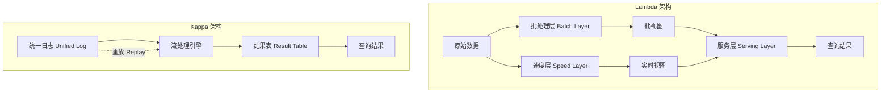

> 学习 Lambda 架构时，最容易陷入「记住了三层名字，却说不清为什么要这样设计」的困境。真正需要掌握的不是名词本身，而是背后的**设计权衡**和**核心概念**。

> 这篇笔记按「概念 → 作用 → 两者关联」整理了我目前收集的 Lambda / Kappa 关键概念，方便日后复习和架构选型。

---

## 一、先建立整体图景

Lambda 架构由 Nathan Marz 提出，核心思路是：**用批处理保证准确性，用流处理保证实时性，在服务层合并两者**。

Kappa 架构由 Jay Kreps 提出，核心思路是：**只保留一条流处理管道，通过重放日志完成历史重算**。



---

## 二、Lambda 架构的关键概念

### 1. 批处理层（Batch Layer）

- **概念**：存储所有**不可变的原始数据**，定期（如每小时/每天）对**全量数据**进行离线计算，生成**批视图**。
- **核心特性**：准确性高（精确计算）、延迟高（分钟到小时级）、容错性强（重新计算即可）。
- **技术代表**：Hadoop HDFS、Apache Spark、Hive。

### 2. 速度层（Speed Layer）

- **概念**：只处理**上一次批处理之后产生的增量数据**，实时生成**实时视图**（临时结果）。
- **核心特性**：低延迟（秒/毫秒级），结果可能是近似的（数据乱序、延迟到达时尤其明显）。
- **技术代表**：Apache Flink、Storm、Kafka Streams。

### 3. 服务层（Serving Layer）

- **概念**：对外提供统一查询接口，**合并**批视图（历史精确结果）和实时视图（增量近似结果），返回最终答案。
- **核心特性**：对上层应用屏蔽内部复杂性，支持随机读/更新。
- **技术代表**：HBase、Cassandra、Redis、Presto。

### 4. 不可变数据（Immutable Data）

- **概念**：原始数据一旦写入批处理层就**永远不修改**（只追加）。
- **作用**：简化容错——数据损坏时从原始数据重算即可；支持时间旅行查询。

### 5. 重新计算（Recomputation）

- **概念**：当业务逻辑变更或发现计算错误时，**丢弃旧的批视图，用新逻辑重跑全量历史数据**。
- **作用**：保证最终一致性，是批处理层「容错性」的根源。

### 6. 最终一致性（Eventual Consistency）

- **概念**：查询结果可能在短时间内（实时视图主导时）不完美，但经过下一次批处理覆盖后，最终会变得精确。
- **作用**：平衡「实时性」和「准确性」的矛盾。

### 7. 批流结果合并逻辑

- **概念**：服务层在响应查询时，通常执行：

  ```
  最终结果 = 批视图（截止上次批处理） + 实时视图（增量）
  ```

- **作用**：用户无感知地获得「历史准确 + 实时最新」的整合数据。

---

## 三、Kappa 架构的关键概念

### 1. 统一日志（Unified Log）

- **概念**：所有数据（无论实时还是历史）都作为**流**进入同一个消息中间件（如 Kafka），并且日志**保留足够长时间**（如 7～30 天甚至更久）。
- **作用**：消除批/流数据源的差异，让历史数据也能以「流」的形式被重放。

### 2. 单一处理引擎（Single Processing Engine）

- **概念**：只使用一个流处理引擎（如 Flink、Kafka Streams）消费统一日志，同时完成实时计算和历史重算。
- **作用**：避免维护两套代码（Lambda 的最大痛点），降低运维成本。

### 3. 重放（Replay）

- **概念**：当业务逻辑变更或需要重算历史数据时，**将消费者的 offset 拨回到过去某个时间点**，让流引擎重新消费那部分日志。
- **作用**：替代 Lambda 的批处理重算机制，实现「历史重算即重放」。

### 4. 位置偏移（Offset）

- **概念**：流处理引擎在消息队列中的消费进度标记。
- **作用**：控制重放的起点（例如 offset = 30 天前），也用于故障恢复时从断点续传。

### 5. 结果表（Result Table）

- **概念**：流处理产出的最终计算结果，通常存储在外部 KV 数据库或分析型数据库中。
- **作用**：对外提供查询服务，类似 Lambda 的服务层，但**不需要合并两套视图**。

### 6. 幂等写入（Idempotent Write）

- **概念**：重复处理同一批数据（如在重放过程中）不会导致结果错误。
- **作用**：保证重放操作的正确性，是 Kappa 可重放的基础。

### 7. 日志保留策略（Retention Policy）

- **概念**：决定统一日志保留多久（按时间或存储空间）。
- **作用**：平衡「重放能力」和「存储成本」。保留越长，可重算历史越久，但磁盘成本越高。

---

## 四、贯穿两者的通用概念

### 1. 流处理 vs 批处理

| 维度 | 流处理 | 批处理 |
| :--- | :--- | :--- |
| 数据形态 | 持续到达的事件流 | 静态数据集 |
| 延迟 | 低（秒/毫秒级） | 高（分钟到小时级） |
| 吞吐 | 受状态管理、乱序处理影响 | 高吞吐，易于横向扩展 |
| 精确计算 | 需额外机制保障 | 天然易于实现 |

### 2. Exactly-Once 语义

- **概念**：每条数据在计算中只被处理一次（即使发生故障）。
- **在 Lambda**：批处理层天然接近 Exactly-Once（重跑幂等）；速度层需引擎支持（如 Flink Checkpoint）。
- **在 Kappa**：完全依赖流引擎的 Exactly-Once 能力（事务 + 幂等输出）。

### 3. 时间域

- **事件时间**：数据实际发生的时间（如用户点击时间）。
- **处理时间**：数据被系统处理的时间。
- **作用**：处理数据乱序、延迟时，两者差异是关键难点。Lambda 的批处理天然按事件时间计算；Kappa 需流引擎支持事件时间窗口（Watermark）。

### 4. 数据湖 / 数据仓库

- **在 Lambda**：批处理层通常配合数据湖（HDFS/S3 + Parquet）存储原始数据。
- **在 Kappa**：统一日志（Kafka）暂时代替数据湖入口，但长期归档仍需数据湖。

---

## 五、概念对照表（快速复习）

| 概念 | Lambda | Kappa |
| :--- | :--- | :--- |
| 核心存储 | 批层（不可变数据湖）+ 速度层（消息队列） | 统一日志（长期保留的消息队列） |
| 计算引擎数 | 2 套（批 + 流） | 1 套（流） |
| 历史重算方式 | 批层全量重跑 | 流引擎重放（offset 回拨） |
| 结果合并 | 服务层合并批视图 + 实时视图 | 直接查询结果表（无需合并） |
| 最终一致性 | 有（批覆盖实时） | 重放期间可能暂不一致 |
| 存储成本 | 较低（批层用廉价存储） | 较高（消息队列长保留成本高） |
| 运维复杂度 | 高（两套管道） | 中（一套管道，但需管理 offset） |

---

## 六、架构选型判断树

面对一个新场景，可以用下面的判断树做初步选型：

```
1. 数据量是否 PB 级以上，且存储成本极度敏感？
   └─ 是 → Lambda
   └─ 否 → 进入 2

2. 业务逻辑是否频繁变更（每月 >= 2 次重算）？
   └─ 是 → Kappa（重放更方便）
   └─ 否 → 进入 3

3. 是否允许查询结果在短时间（秒～分钟）内存在不精确？
   └─ 是 → Lambda（最终一致性可接受）
   └─ 否 → 需评估 Kappa 的 Exactly-Once + 事件时间窗口能力
```

> 注意：现实中大量系统采用**混合架构**——在线查询走 Kappa 风格的流处理，离线分析走 Lambda 风格的批处理，两者通过统一日志或数据湖衔接。

---

## 七、如何检验自己是否「彻底掌握」

可以用下面三个问题自测：

1. **能画图**：不看资料，能否画出 Lambda 和 Kappa 的数据流向图？
2. **能解释权衡**：为什么 Lambda 要维护两套代码？Kappa 为什么要长保留 Kafka 日志？
3. **能选型**：给定一个业务场景（如实时大屏 + 离线报表），能否说出各层该用什么技术、为什么？

如果每个概念都能用自己的话解释一遍，并讲清楚「它解决了什么问题、带来了什么代价」，就算真正掌握了。

---

## 八、后续学习计划

- [ ] 深入 Lambda 三层各自的状态管理与容错机制
- [ ] 用 Flink 实现一个最小化的 Speed Layer 示例
- [ ] 对比 Kafka 日志保留 vs 数据湖归档的成本模型
- [ ] 阅读 Jay Kreps 关于 Kappa 的原始文章，理解「重放」的设计哲学

---

*本文为学习笔记，概念整理参考了 Lambda / Kappa 架构的公开资料与常见技术博客，后续会结合实际项目经验持续补充。*
