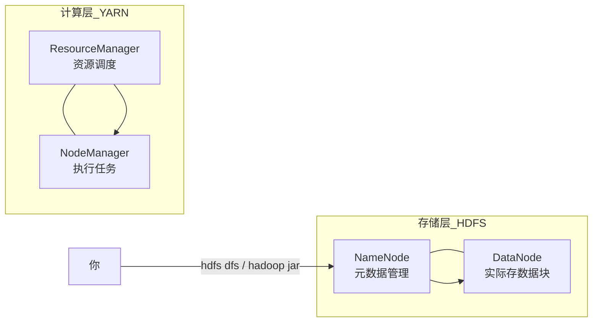
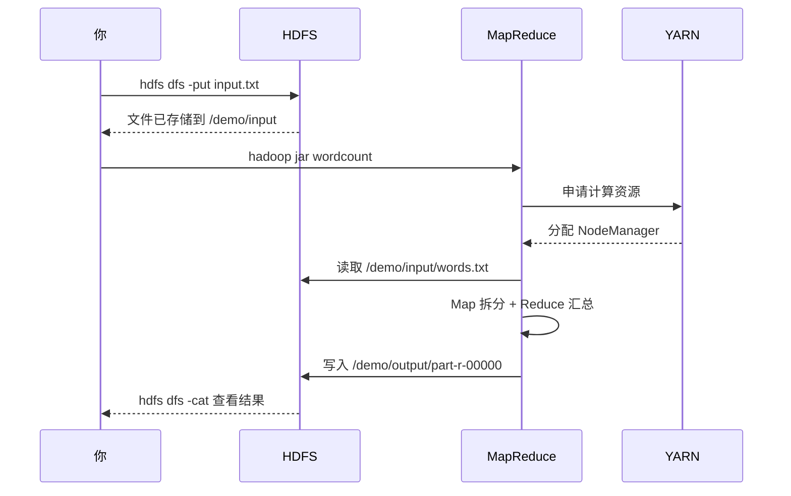

> 很多人听过 Hadoop，但说不清它到底解决什么问题。  
> 这篇文章不讲架构 PPT，而是用 **Docker 起一个最小集群**，跑通一个 **WordCount（词频统计）** 例子——这是大数据领域的「Hello World」。

> 读完后你会知道：Hadoop 不是神秘黑盒，而是 **分布式存储 + 分布式计算** 的组合。

**阅读时间**：约 15 分钟（含动手）  
**环境要求**：已安装 Docker / Docker Compose（本文在 WSL Ubuntu 26.04 验证）

---

## 一、Hadoop 到底是什么？

先用一句话概括：

> **Hadoop = 用很多台普通机器，一起存海量数据、一起算海量数据。**

单机 Excel 能处理几万行，但面对 **TB 级日志、历史交易、传感器数据**，单机磁盘和 CPU 都不够。Hadoop 的思路是：把数据切碎分散存储，把计算任务分发到多台机器并行执行。

它有两个核心能力：

| 组件 | 全称 | 干什么 | 生活类比 |
|------|------|--------|----------|
| **HDFS** | Hadoop Distributed File System | 分布式文件系统，大文件切块存到多台机器 | 一个文件被拆成很多份，分散放在不同硬盘柜 |
| **MapReduce** | — | 分布式计算模型：Map 拆分统计，Reduce 汇总结果 | 全班分小组数词，组长再把各组结果合并 |

后来 YARN 出现，负责 **集群资源调度**（哪台机器跑哪个任务），你可以把 YARN 理解成「任务调度中心」。

---

## 二、我们要跑什么 Demo？

目标很简单，分两步：

1. **HDFS**：上传一个文本文件到分布式文件系统  
2. **MapReduce**：对这个文件做 **WordCount（词频统计）**

测试文件 `input.txt` 内容如下：

```text
Hadoop is a framework for distributed storage and processing of big data.
Hadoop can store huge files across many machines using HDFS.
Hadoop can run MapReduce jobs to analyze data in parallel.
hello hadoop hello world hello mapreduce
```

跑完后，你会看到每个单词出现了多少次，例如 `Hadoop 3`、`hello 3`。

这就是 Hadoop 最经典的入门示例：**存数据 → 提交计算 → 读结果**。

---

## 三、最小集群长什么样？

我们用 Docker Compose 启动 4 个容器，模拟一个精简版 Hadoop 集群：



各容器职责：

| 容器 | 端口 | 作用 |
|------|------|------|
| `namenode` | 9870, 9000 | HDFS 大脑，管理文件目录和块位置 |
| `datanode` | — | HDFS 工人，真正存数据块 |
| `resourcemanager` | 8088 | YARN 调度员，分配 CPU/内存 |
| `nodemanager` | — | YARN 工人，在节点上跑任务 |

---

## 四、动手：一键跑通 Demo

### 4.1 准备目录结构

在 Linux / WSL 下创建项目目录：

```bash
mkdir -p ~/hadoop-demo && cd ~/hadoop-demo
```

需要 4 个文件：

**`input.txt`** — 测试数据（见上文）

**`hadoop.env`** — 集群基础配置：

```properties
CORE_CONF_fs_defaultFS=hdfs://namenode:9000
CORE_CONF_hadoop_http_staticuser_user=root
HDFS_CONF_dfs_webhdfs_enabled=true
HDFS_CONF_dfs_permissions_enabled=false
HDFS_CONF_dfs_namenode_datanode_registration_ip___hostname__check=false
```

**`docker-compose.yml`** — 启动 4 个 Hadoop 组件：

```yaml
services:
  namenode:
    image: bde2020/hadoop-namenode:2.0.0-hadoop3.2.1-java8
    container_name: namenode
    ports:
      - "9870:9870"
      - "9000:9000"
    volumes:
      - hadoop_namenode:/hadoop/dfs/name
    environment:
      - CLUSTER_NAME=demo
    env_file:
      - ./hadoop.env

  datanode:
    image: bde2020/hadoop-datanode:2.0.0-hadoop3.2.1-java8
    container_name: datanode
    volumes:
      - hadoop_datanode:/hadoop/dfs/data
    env_file:
      - ./hadoop.env
    environment:
      SERVICE_PRECONDITION: "namenode:9870"

  resourcemanager:
    image: bde2020/hadoop-resourcemanager:2.0.0-hadoop3.2.1-java8
    container_name: resourcemanager
    ports:
      - "8088:8088"
    env_file:
      - ./hadoop.env

  nodemanager:
    image: bde2020/hadoop-nodemanager:2.0.0-hadoop3.2.1-java8
    container_name: nodemanager
    env_file:
      - ./hadoop.env
    environment:
      SERVICE_PRECONDITION: "namenode:9870 datanode:9864 resourcemanager:8088"

volumes:
  hadoop_namenode:
  hadoop_datanode:
```

**`run-demo.sh`** — 自动化演示脚本（启动集群 → 上传文件 → 跑 WordCount → 打印结果）。

> 完整脚本见文末「附录」，或直接从 `~/hadoop-demo/run-demo.sh` 复制。

### 4.2 运行

```bash
chmod +x run-demo.sh
./run-demo.sh
```

首次运行会拉取镜像，可能需要几分钟。成功后你会看到两段输出。

---

## 五、Demo 1：HDFS 分布式存储

脚本先把 `input.txt` 复制进 `namenode` 容器，再执行：

```bash
hdfs dfs -mkdir -p /demo/input
hdfs dfs -put -f /tmp/input.txt /demo/input/words.txt
hdfs dfs -ls /demo/input
hdfs dfs -cat /demo/input/words.txt
```

### 这些命令在干什么？

| 命令 | 含义 |
|------|------|
| `hdfs dfs -mkdir` | 在 HDFS 里建目录（类似 `mkdir`，但操作的是分布式文件系统） |
| `hdfs dfs -put` | 把本地文件上传到 HDFS |
| `hdfs dfs -ls` | 列出 HDFS 目录 |
| `hdfs dfs -cat` | 读取 HDFS 文件内容 |

典型输出：

```text
Found 1 items
-rw-r--r--   3 root supergroup        235 2026-06-06 12:58 /demo/input/words.txt
```

注意路径是 `/demo/input/words.txt`——这是 **HDFS 路径**，不是你电脑上的路径。文件已经存入分布式文件系统，由 NameNode 记录元数据、DataNode 保存数据块。

打开浏览器访问 **http://localhost:9870**，在「Utilities → Browse the file system」里能看到这个文件。

---

## 六、Demo 2：MapReduce 词频统计

接下来跑 Hadoop 自带的 WordCount 示例：

```bash
hadoop jar \
  /opt/hadoop-3.2.1/share/hadoop/mapreduce/hadoop-mapreduce-examples-3.2.1.jar \
  wordcount \
  /demo/input/words.txt \
  /demo/output
```

四个参数分别是：

1. **jar 包**：MapReduce 示例程序  
2. **任务类型**：`wordcount`  
3. **输入路径**：HDFS 上的源文件  
4. **输出路径**：结果写入 HDFS（必须不存在，否则报错）

### WordCount 背后发生了什么？

可以分成两个阶段理解：

**Map 阶段**（分头统计）  
把每一行文字拆开，对每个单词输出 `(单词, 1)`。  
例如 `hello hadoop` → `(hello,1), (hadoop,1)`

**Reduce 阶段**（汇总合并）  
把相同单词的 `1` 加在一起。  
`(hello,1), (hello,1), (hello,1)` → `(hello, 3)`

即使数据有 1TB，Hadoop 也会把文件切成很多 **split（分片）**，每台机器处理自己那一份，最后汇总——这就是「分布式计算」。

### 结果示例

```text
Hadoop    3
hello     3
can       2
data      1
...
```

读取结果：

```bash
hdfs dfs -cat /demo/output/part-r-00000 | sort
```

任务跑完后，可在 **http://localhost:8088** 的 YARN 界面看到作业历史。

---

## 七、用一张图串起来



**整条链路就是 Hadoop 的标准工作流：**

```text
数据进 HDFS → 提交 MapReduce 作业 → YARN 调度资源 → 输出写回 HDFS
```

---

## 八、Hadoop 能做什么？不能做什么？

### 适合的场景

- 离线日志分析（统计 PV、Top URL、错误率）
- 海量文本处理（词频、倒排索引）
- 历史数据批处理（ETL、报表）
- 作为 Hive / Spark 的底层存储（HDFS）

### 不太适合的场景

- 低延迟在线查询（毫秒级）→ 用 Redis、ClickHouse
- 事务型业务（银行转账）→ 用 MySQL、PostgreSQL
- 实时流处理 → 用 Flink、Kafka Streams（虽然也有 Hadoop 生态组件）

>Hadoop 是 **批处理** 时代的基石。今天很多公司用 Spark 替代 MapReduce 做计算，但 **HDFS 的思想** 和 **分布式处理的思路** 不过时。

---

## 九、常见问题

### Q1：`docker` 报错找不到命令？

WSL 里如果装了 Docker Desktop 集成，可能优先调用 Windows 侧的包装脚本。确保使用 Ubuntu 内原生 Docker，或在 `~/.bashrc` 里把 `/usr/bin` 放在 PATH 前面。

### Q2：`hdfs: command not found`？

在容器内执行命令时，需要：

```bash
export PATH=$HADOOP_HOME/bin:$PATH
```

我们的 `run-demo.sh` 已处理这一点。

### Q3：拉镜像很慢？

配置 Docker 镜像加速，或耐心等待首次拉取。Hadoop 镜像体积较大。

### Q4：如何停止集群？

```bash
cd ~/hadoop-demo
docker compose down      # 停止
docker compose down -v     # 停止并删除数据卷
```

---

## 十、总结

| 概念 | 你在这个 Demo 里见到了什么 |
|------|---------------------------|
| HDFS | `hdfs dfs -put` 上传文件，`hdfs dfs -cat` 读取 |
| MapReduce | `wordcount` 词频统计 |
| YARN | 8088 页面上的作业调度 |
| 分布式 | 4 个容器分工协作，模拟真实集群 |

**一句话记住 Hadoop：**

> 它让「一台机器干不完的存储和计算」，变成「很多台机器一起干」。

如果你已经跑通了这个 Demo，下一步可以尝试：

- 换一份更大的日志文件跑 WordCount  
- 在 NameNode Web UI 里观察块（block）分布  
- 了解 Spark 如何复用 HDFS 做更快的计算  

---

## 附录：`run-demo.sh` 完整脚本

```bash
#!/usr/bin/env bash
set -euo pipefail

cd "$(dirname "$0")"

echo "==> 启动 Hadoop 集群..."
docker compose up -d

echo "==> 等待服务就绪..."
for i in $(seq 1 60); do
  if docker exec namenode bash -lc 'export PATH=$HADOOP_HOME/bin:$PATH; hdfs dfsadmin -report' >/dev/null 2>&1; then
    echo "HDFS 已就绪"
    break
  fi
  sleep 5
  if [ "$i" -eq 60 ]; then
    echo "HDFS 启动超时，请检查: docker compose logs"
    exit 1
  fi
done

echo
echo "==> Demo 1: HDFS 分布式存储"
docker cp input.txt namenode:/tmp/input.txt
docker exec namenode bash -lc '
  export PATH=$HADOOP_HOME/bin:$PATH
  hdfs dfs -mkdir -p /demo/input
  hdfs dfs -put -f /tmp/input.txt /demo/input/words.txt
  echo "--- HDFS 文件列表 ---"
  hdfs dfs -ls /demo/input
  echo "--- 文件内容 ---"
  hdfs dfs -cat /demo/input/words.txt
'

echo
echo "==> Demo 2: MapReduce 词频统计 (WordCount)"
docker exec namenode bash -lc '
  export PATH=$HADOOP_HOME/bin:$PATH
  hdfs dfs -rm -r -f /demo/output
  hadoop jar /opt/hadoop-3.2.1/share/hadoop/mapreduce/hadoop-mapreduce-examples-3.2.1.jar \
    wordcount /demo/input/words.txt /demo/output
  echo "--- 统计结果 ---"
  hdfs dfs -cat /demo/output/part-r-00000 | sort
'

echo
echo "==> 完成!"
echo "Web 界面:"
echo "  HDFS NameNode : http://localhost:9870"
echo "  YARN 资源管理 : http://localhost:8088"
```

---

*本文基于 WSL Ubuntu 26.04 + Docker 29.1 环境编写。集群镜像为 `bde2020/hadoop` 系列，适合本地学习，生产环境请使用官方部署方案。*
