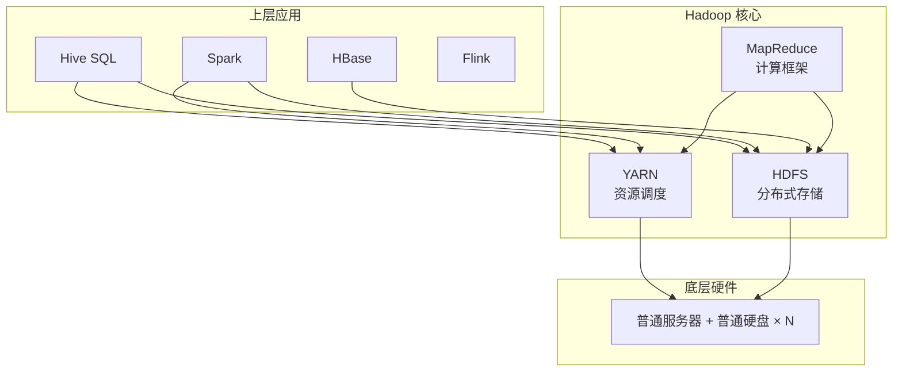

> **Hadoop 入门系列 · 第 1/10 篇**  
> 下一篇预告：[《HDFS 核心概念——把文件切成面包片，分散到你家三台电脑》](/2026/06/07/hadoop-series-02-hdfs-core-concepts/)

---

## 开头：一台 1TB 硬盘装不下，怎么办？

假设你是一家电商公司的数据工程师。双 11 当天，用户点击、下单、支付、退款……每一秒都在产生日志。

- 一天下来：**500 GB**
- 存一年：**180 TB**
- 还要做统计：哪个商品卖得最好？哪个地区退货率最高？

你买了一台服务器，插了一块 4 TB 硬盘。看起来够用？

问题是：

1. **单盘会坏** —— 硬盘挂了，数据全没
2. **单机算不动** —— 180 TB 做一次全量统计，一台机器要跑几天
3. **扩容太贵** —— 买一台 100 TB 的「超级服务器」，价格呈指数级上涨

这时候你会想：**能不能把很多台普通电脑、很多块普通硬盘拼在一起，当成一台「超级电脑」来用？**

这就是 Hadoop 要解决的问题。

---

## 一、大数据时代的存储与计算困境

在 Hadoop 出现之前，企业处理海量数据通常有两条路：

| 路线 | 做法 | 问题 |
|------|------|------|
| **垂直扩展（Scale Up）** | 买更贵的服务器、更大的磁盘、更多的 CPU | 有天花板，且越来越贵 |
| **传统数据库** | Oracle / MySQL 存结构化数据 | 非结构化日志、图片、视频塞不进去；单库容量有限 |

2000 年代互联网爆发，Google 每天要处理 **数百亿次网页抓取、索引、搜索**。传统方案彻底不够用。

Google 面临的核心困境可以概括成两句话：

- **存储困境**：文件太大、太多，单机磁盘放不下
- **计算困境**：任务太大，单机 CPU 算不完、算太慢

Hadoop 的答案很朴素：**不跟摩尔定律赌单机性能，改赌「机器数量 × 普通硬件」**。

---

## 二、Hadoop 的起源：三篇论文 + 雅虎的实现

2003–2004 年，Google 发表了影响整个大数据行业的三篇论文：

| 论文 | 解决的问题 | 对应 Hadoop 组件 |
|------|------------|------------------|
| **GFS**（Google File System） | 海量文件如何分布式存储 | **HDFS** |
| **MapReduce** | 海量数据如何并行计算 | **MapReduce** |
| **Bigtable** | 海量结构化数据如何随机读写 | 后来催生了 **HBase** |

论文是理论，代码才是生产力。

2006 年，**Doug Cutting**（Lucene 之父）在雅虎主导开发了 Hadoop 的开源实现。名字来自他儿子玩具大象的名字 **Hadoop** 🐘。

2008 年，雅虎用 4000 台机器组成的 Hadoop 集群，**1 分钟排序 1 TB 数据**，在业界炸开了锅。

从此，Hadoop 成为大数据的「基础设施操作系统」—— 不是比喻，它真的像 OS 一样，上面可以跑 MapReduce、Hive、Spark、HBase 等无数应用。

---

## 三、Hadoop 生态全景图：HDFS、YARN、MapReduce 是什么关系？

很多人第一次接触 Hadoop 会懵：**HDFS、YARN、MapReduce、Hive、Spark……到底谁是谁？**

先记住一张分层图：



### 3.1 HDFS —— 分布式文件系统

**HDFS（Hadoop Distributed File System）** 负责 **存**。

- 把大文件切成块（Block），分散存到多台机器的硬盘上
- 每块默认复制 3 份，某台机器坏了数据还在
- 对外看起来像一个巨大的目录树，路径如 `/user/logs/2026-06-06.log`

类比：**HDFS = 一个跨很多台电脑的超大 U 盘**

### 3.2 MapReduce —— 分布式计算模型

**MapReduce** 负责 **算**（早期默认计算引擎）。

- **Map**：把大任务拆成小任务，并行处理
- **Shuffle**：把相同 key 的数据归拢到一起
- **Reduce**：汇总结果

经典例子：统计 1 TB 文本里每个单词出现次数 —— 一台机器读不完，100 台各读 1%，最后汇总。

类比：**MapReduce = 把作业分给全班同学，每人做一部分，课代表最后汇总**

### 3.3 YARN —— 资源调度层

Hadoop 2.0 引入了 **YARN（Yet Another Resource Negotiator）**。

早期 Hadoop 1.x 里，MapReduce 既管计算又管资源，**一个集群同时只能跑 MapReduce**，Hive、Spark 想进来没门。

YARN 的定位是 **集群操作系统**：

| 组件 | 角色 | 类比 |
|------|------|------|
| **ResourceManager** | 全局资源调度 | 班主任 |
| **NodeManager** | 单台机器资源管理 | 各组组长 |
| **ApplicationMaster** | 单个应用的协调者 | 课代表 |
| **Container** | CPU + 内存的隔离单元 | 一张课桌 |

有了 YARN，MapReduce、Spark、Hive on Tez 都可以在同一集群「和平共处」。

### 3.4 三者关系一句话

```
HDFS 存数据 → YARN 分配算力 → MapReduce/Spark/Hive 跑计算
```

---

## 四、适用场景：什么时候用 Hadoop，什么时候不用

Hadoop 不是银弹。用对了是神器，用错了是灾难。

### ✅ 适合用 Hadoop 的场景

| 场景 | 原因 |
|------|------|
| **海量日志存储与分析** | 每天 TB 级，HDFS 便宜、可扩展 |
| **离线批处理** | 报表、ETL、数据仓库 T+1 出数 |
| **历史数据归档** | 温冷数据长期保存，成本低于高端存储阵列 |
| **非结构化/半结构化数据** | 文本、JSON、Parquet 等 |
| **一次写入、多次读取** | HDFS 擅长 append，不擅长随机修改 |

### ❌ 不适合用 Hadoop 的场景

| 场景 | 为什么不用 | 更好的选择 |
|------|------------|--------------|
| **低延迟在线查询**（毫秒级） | HDFS + MR 是为吞吐设计的，不是为延迟 | Redis、MySQL、Elasticsearch |
| **频繁随机更新** | HDFS 不支持文件内随机改 | HBase、MySQL |
| **数据量很小**（< 1 TB） | 集群运维成本 > 收益 | PostgreSQL、单机分析 |
| **实时流计算** | 原生 MR 是批处理 | Flink、Kafka Streams |
| **复杂迭代计算**（机器学习） | MR 每次迭代都读写磁盘，太慢 | Spark |

### 决策口诀

```
数据 > 10 TB，能接受小时级延迟 → 考虑 Hadoop 生态
数据 < 1 TB，要秒级响应 → 别上 Hadoop
```

---

## 五、最小可运行示例：3 分钟感受 Hadoop

如果你已经按 [上一篇环境搭建文章](/2026/06/05/windows-wsl-docker-hadoop-setup/) 跑起了 Docker 版 Hadoop，可以立刻验证「存 + 算」的基本能力：

```bash
# 进入容器
docker exec -it hdfs bash

# 1. 在 HDFS 上创建目录
hdfs dfs -mkdir -p /user/words

# 2. 写入测试文件
cat > /tmp/input.txt << 'EOF'
hadoop hdfs yarn mapreduce
hadoop spark flink
hdfs is storage
EOF

hdfs dfs -put /tmp/input.txt /user/words/

# 3. 查看文件
hdfs dfs -ls /user/words/
hdfs dfs -cat /user/words/input.txt
```

在浏览器打开 `http://localhost:50070/explorer.html`，刷新后能看到刚上传的文件 —— 这就是 HDFS 在工作。

MapReduce WordCount 的完整实战，我们留到 **系列第 4 篇** 展开。

---

## 六、一句话总结

> **Hadoop = 便宜的存储（HDFS）+ 便宜的计算（MapReduce/Spark）+ 统一的资源调度（YARN）**

它不会让你单台机器变快，但让你用 **100 台普通机器 + 100 块普通硬盘**，拼出一台能存 PB 级、算 TB 级任务的「逻辑超级计算机」。

---

## 本节小结

| 概念 | 一句话 |
|------|--------|
| **大数据困境** | 单机存不下、算不动 |
| **Hadoop 起源** | Google 三论文 → 雅虎开源实现 |
| **HDFS** | 分布式存储 |
| **MapReduce** | 分布式计算模型 |
| **YARN** | 集群资源调度 |
| **适用场景** | 海量、离线、批处理 |
| **不适用** | 小数据、低延迟、频繁更新 |

---

## 下篇预告

**第 2 篇：《HDFS 核心概念——把文件切成面包片，分散到你家三台电脑》**

我们将深入：

- NameNode 与 DataNode 的分工
- 块大小为什么是 128MB
- 副本机制与机架感知
- 手绘架构图 + 文件写入全流程

---

## 思考题

> 你所在的公司（或你熟悉的一个系统）每天产生多少数据？如果全部存进 HDFS，需要多少台普通服务器？单机 4 TB 硬盘、3 副本的情况下，粗算一下容量需求。

欢迎在评论区留下你的估算思路。下一篇见 🐘
