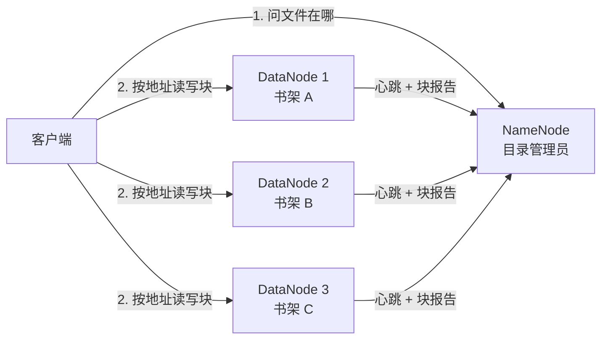
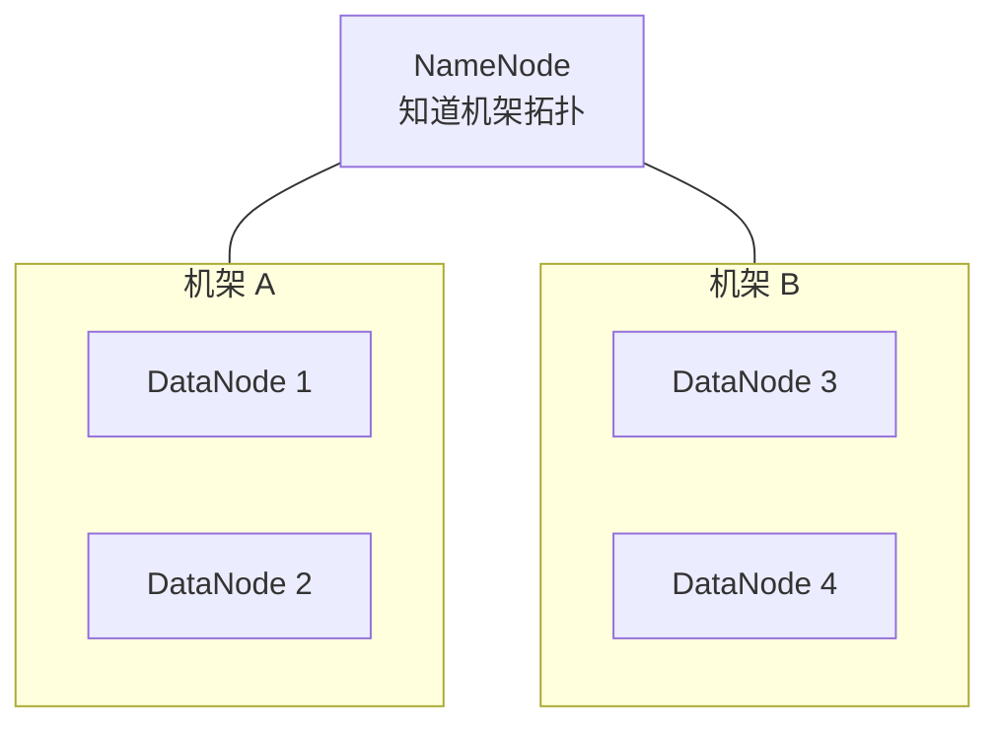
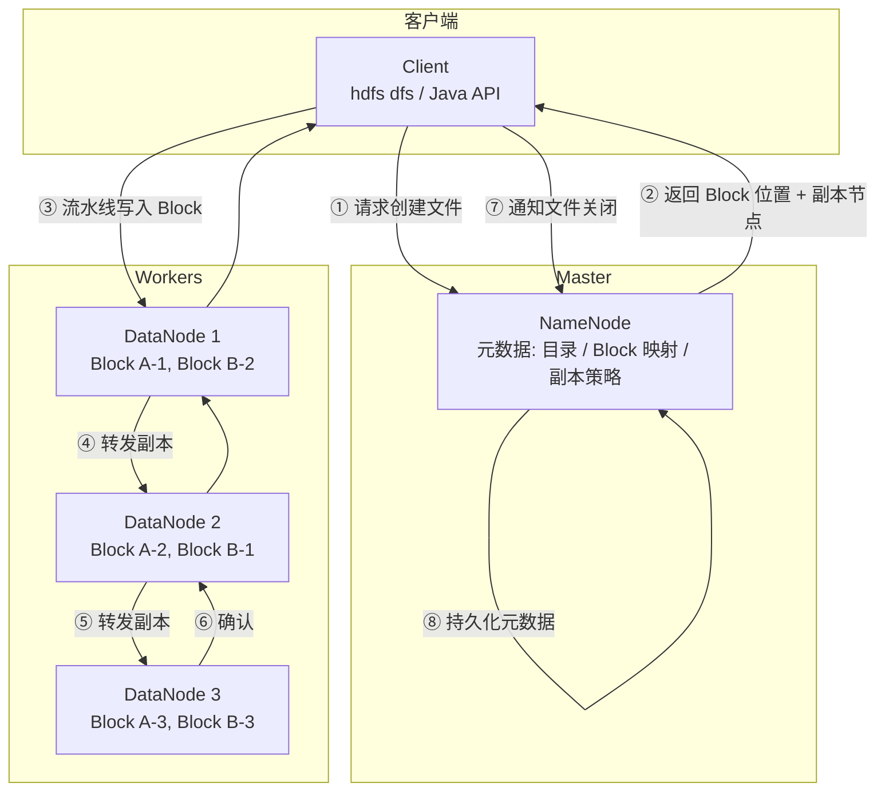

> **Hadoop 入门系列 · 第 2/10 篇**  
> 上一篇：[《Hadoop 是什么？》](/2026/06/06/hadoop-series-01-what-is-hadoop/)  
> 下一篇预告：[《HDFS 读写流程——一个 300MB 文件的奇幻漂流》](/2026/06/08/hadoop-series-03-hdfs-read-write/)

---

## 开头：一份 10GB 的文件，怎么存进三台旧电脑？

你家里有三台旧电脑，每台只剩 500GB 硬盘。现在有一份 **10GB 的视频素材** 要保存，还要 **防止任意一台硬盘坏掉就全丢**。

你会怎么做？

- 把文件 **切成很多小块**
- **每块复制几份**，分散放到不同机器
- 用 **一本目录册** 记录：第 3 块在第 2 台电脑、第 7 块在第 1 台电脑……

这就是 HDFS 的核心思想。**面包片是 Block，目录册是 NameNode，书架是 DataNode。**

---

## 一、NameNode 与 DataNode：目录柜 vs 书架

HDFS 采用 **主从（Master/Worker）架构**：



### NameNode —— 图书馆目录柜

**只存元数据（metadata），不存文件内容本身。**

| 存什么 | 例子 |
|--------|------|
| 文件目录树 | `/user/logs/` 下有哪些文件 |
| 每个文件被切成哪些 Block | `app.log` → block_001, block_002 |
| 每个 Block 在哪些 DataNode | block_001 → DN1, DN2, DN3 |
| 权限、副本数、修改时间 | rwx, replication=3 |

NameNode 是 **单点大脑**（Hadoop 2.x 后可 HA 双活，第 3 篇细讲）。它挂了，整个 HDFS 暂时无法定位数据 —— 所以元数据极其重要，要持久化到 fsimage + edits 日志。

### DataNode —— 真正放数据的书架

- 存储实际的 **Block 数据**
- 定期向 NameNode **发送心跳**（我还活着）
- 定期 **汇报块列表**（我上有哪些块）
- 按 NameNode 指令 **复制块** 到其他 DataNode

**类比总结：**

| 角色 | 类比 | 存什么 |
|------|------|--------|
| NameNode | 图书馆目录柜 | 索引、位置 |
| DataNode | 书架 | 书（Block）本身 |

---

## 二、块大小为什么是 128MB？

Hadoop 2.x 默认 Block 大小是 **128MB**（1.x 是 64MB）。一个 300MB 的文件会被切成 3 块：128 + 128 + 44 MB。

### 为什么不设成 4KB（像普通文件系统）？

Block 太小 → **寻址开销爆炸**。

假设集群存 **280 TB** 数据：

| Block 大小 | Block 数量 | NameNode 内存压力 |
|------------|------------|-------------------|
| 4 KB | ~737 亿个 | 元数据撑爆，NameNode 直接 OOM |
| 128 MB | ~224 万个 | 可接受 |

NameNode 要在内存里维护每个 Block 的位置信息。Block 越多，NameNode 越胖。

### 为什么不设成 10GB？

Block 太大 → **并行度下降 + 容错粒度粗**。

- 一个 Map 任务通常处理 1 个 Block → Block 太大，Map 任务数变少，并行算不动
- 某 Block 损坏，要重新复制 10GB，Recovery 时间长
- 小文件问题：1KB 的文件也占一个 Block 的元数据条目（小文件灾难）

### 寻址开销的直觉计算

```
元数据条目数 ≈ 总数据量 / Block 大小

280 TB ÷ 128 MB ≈ 2,240,000 条
280 TB ÷ 4 KB   ≈ 73,728,000,000 条  ← 差 3 万倍
```

**128MB 是在「NameNode 能扛住」和「Map 并行度够高」之间的工程平衡点。**

> Hadoop 3.x 支持更大 Block（如 256MB、512MB），但 128MB 仍是最常见的默认值。

---

## 三、副本机制：为什么默认是 3？

HDFS 默认 **replication = 3**：每个 Block 存 3 份，放在不同 DataNode。

### 三个原因

**1. 容错**

任意 1 台机器硬盘坏了，还有 2 份副本可用。NameNode 发现副本不足，自动安排 **再复制一份**。

**2. 读性能**

客户端读数据时，NameNode 返回 3 个副本位置，客户端选 **最近的一个** 读 —— 相当于天然 CDN。

**3. 成本与可靠性的平衡**

| 副本数 | 可靠性 | 存储成本 |
|--------|--------|----------|
| 1 | 机器坏 = 数据丢 | 1× |
| 2 | 坏 1 台 OK，同时坏 2 台丢 | 2× |
| **3** | 坏 1 台 OK，坏 2 台仍 OK 的概率极高 | 3× |
| 5 | 更高 | 5× —— 大多数场景过度 |

工业界验证：**3 副本** 是性价比最优解。云厂商的对象存储（如 S3）也常用类似的多副本/纠删码策略。

### 副本放置策略（默认）

写 3 副本时，Hadoop 默认：

1. **第 1 副本**：写在客户端所在机架（或随机）的某 DataNode
2. **第 2 副本**：写在 **不同机架** 的某 DataNode
3. **第 3 副本**：与第 2 副本 **同机架**，不同节点

目的：**机架级容错** —— 整个机架断电，数据仍在另一个机架。

---

## 四、机架感知：数据放哪儿最快？

真实数据中心里，机器按 **机架（Rack）** 排列。同一机架内交换机带宽高（如 10Gbps），跨机架带宽低（如 1Gbps）。



**机架感知（Rack Awareness）** 让 NameNode 和调度器知道：

- 哪些 DataNode 在同一机架
- 读数据时 **优先读本机架**
- 写副本时 **分散到不同机架**

**带宽对比（直觉）：**

```
读本机架 DataNode：  ~100 MB/s
读跨机架 DataNode：  ~10 MB/s   ← 慢 10 倍
```

所以 HDFS 不是随机放数据，而是 **在可靠性和网络开销之间做拓扑优化**。

---

## 五、架构总览 + 文件写入流程

### 5.1 架构图



### 5.2 写入流程（8 步）

假设客户端要写一个 **300MB 文件**，默认 Block 128MB、副本 3：

| 步骤 | 谁 | 做什么 |
|------|-----|--------|
| ① | Client → NameNode | 「我要在 `/user/data/video.mp4` 创建文件」 |
| ② | NameNode → Client | 「可以，Block 大小 128MB，副本写到 DN1、DN2、DN3」 |
| ③ | Client → DN1 | 发送第 1 个 Block 的数据（流水线起点） |
| ④ | DN1 → DN2 | DN1 边写本地边转发给 DN2（第 2 副本） |
| ⑤ | DN2 → DN3 | DN2 边写本地边转发给 DN3（第 3 副本） |
| ⑥ | DN3 → DN2 → DN1 → Client | 逐级 ACK 确认 |
| ⑦ | Client → NameNode | 3 个 Block 都写完，关闭文件 |
| ⑧ | NameNode | 持久化元数据（文件名 → Block 列表 → 副本位置） |

**关键设计：流水线复制（Pipeline Replication）**

数据只从 Client 传 **一次** 到第一个 DataNode，后续副本由 DataNode 链式转发 —— 避免 Client 向 3 台机器各传一遍，节省客户端带宽。

读流程、故障恢复、NameNode HA，我们在 **第 3 篇** 用「300MB 文件奇幻漂流」完整展开。

---

## 六、动手验证：在 Docker HDFS 里看 Block

```bash
docker exec -it hdfs bash

# 创建 200MB 测试文件（超过 1 个 Block 在 2.x 默认 128MB 配置下）
dd if=/dev/zero of=/tmp/bigfile.bin bs=1M count=200

hdfs dfs -put /tmp/bigfile.bin /user/test/

# 查看文件块信息
hdfs fsck /user/test/bigfile.bin -files -blocks -locations
```

典型输出片段：

```
/user/test/bigfile.bin 209715200 bytes, replicated: replication=1, 2 block(s)
0. blk_xxx len=134217728 repl=1 [dn:50010]
1. blk_yyy len=75497472 repl=1 [dn:50010]
```

你会看到：**200MB 文件被切成 2 个 Block**（128MB + 72MB）。Docker 单节点环境下副本数可能是 1，生产集群才是 3。

在 NameNode Web UI `http://localhost:50070` 的 **Overview** 页也能看到 **Live Nodes** 和容量变化。

---

## 本节小结

| 概念 | 要点 |
|------|------|
| **NameNode** | 管元数据，不管数据内容 |
| **DataNode** | 存 Block，汇报心跳 |
| **Block 128MB** | 平衡 NameNode 压力与 Map 并行度 |
| **副本 3** | 容错 + 读加速 + 成本平衡 |
| **机架感知** | 副本跨机架，读本机架优先 |
| **流水线写入** | Client → DN1 → DN2 → DN3，只传一次 |

---

## 下篇预告

**第 3 篇：《HDFS 读写流程——一个 300MB 文件的奇幻漂流》**

- 读文件的完整路径
- DataNode 宕机如何自动恢复
- NameNode 高可用（HA）
- Docker 实验：上传第一个文件并截图验证

---

## 思考题

> 如果 Block 大小改成 1GB，一个 10TB 的集群 NameNode 需要维护大约多少个 Block 元数据条目？对 Map 并行度有什么影响？

提示：条目数 = 10TB ÷ 1GB = 10,240 个 Block —— 看起来 NameNode 很轻松，但一个 10TB 文件只能产生 10 个 Map 任务，并行度够吗？

下一篇见 🐘
