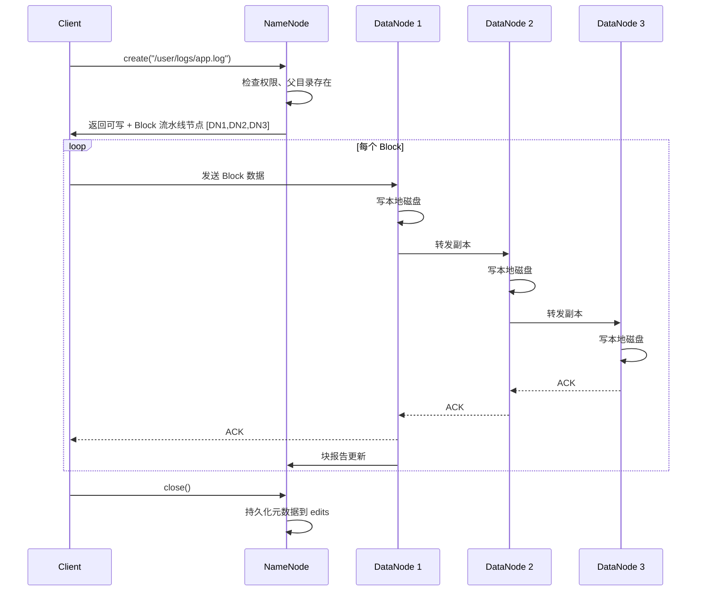
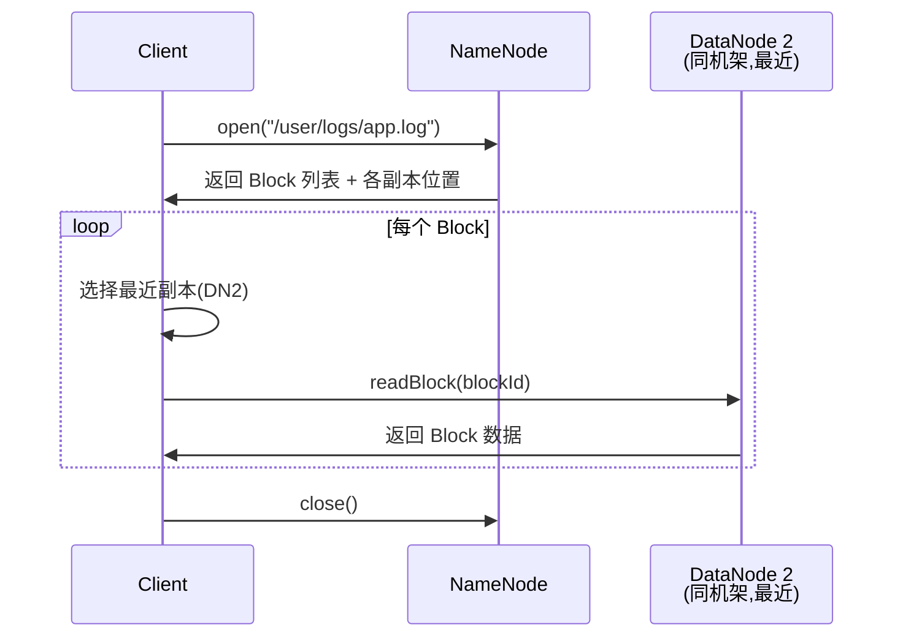
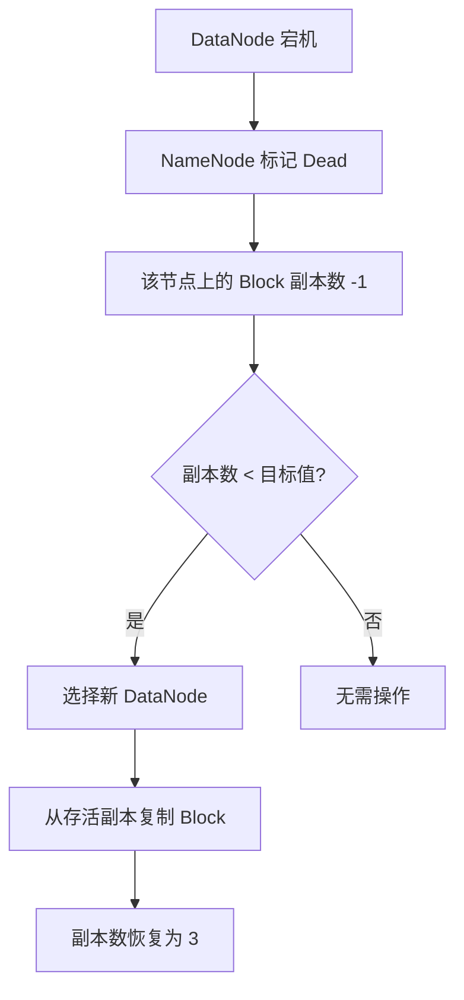
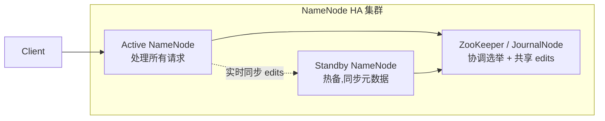

> **Hadoop 入门系列 · 第 3/10 篇**  
> 上一篇：[《HDFS 核心概念》](/2026/06/07/hadoop-series-02-hdfs-core-concepts/)  
> 下一篇预告：[《MapReduce 思想》](/2026/06/09/hadoop-series-04-mapreduce/)

---

## 开头：300MB 的文件，从上传到下载经历了什么？

你在笔记本上有一个 **300MB 的日志包**，要存进 HDFS，第二天同事要从集群里下载分析。

这 300MB 不会「整包」塞进某一台机器。它会：

1. 被切成 **3 片**（128 + 128 + 44 MB）
2. 每片复制 **3 份**，散落到不同 DataNode
3. 下载时再 **就近取片**，在客户端拼回原样

这篇我们就跟着这个文件，走完 **写 → 存 → 读 → 故障恢复** 的全流程。

---

## 一、写文件：客户端 → NameNode → 流水线复制

### 1.1 写流程时序图



### 1.2 关键细节

**文件 vs Block**

- 客户端眼里：一个 300MB 的 `app.log`
- NameNode 眼里：3 个 Block ID + 各自 3 副本位置
- DataNode 眼里：6 个块文件（3 Block × 2 额外副本，简化理解）

**写过程中 NameNode 不参与数据传输**

NameNode 只负责 **指路**，数据流不经过 NameNode —— 否则 NameNode 会成为带宽瓶颈。

**写失败怎么办？**

流水线中任一环节失败，Client 会：

1. 关闭当前流水线
2. 向 NameNode 申请新的 DataNode
3. 重新建立流水线，从未成功的 Block 重传

---

## 二、读文件：客户端 → NameNode → 就近读取

### 2.1 读流程



### 2.2 副本选择策略

NameNode 返回某个 Block 的所有副本地址，Client 按优先级选择：

1. **与 Client 同节点的副本**（本地读，零网络）
2. **与 Client 同机架的副本**
3. **跨机架副本**

读的时候 **只从一个副本读**，不会同时读 3 份 —— 副本是为了容错，不是为了并行读（HDFS 读并行靠多个 Block 同时读）。

### 2.3 校验

每个 Block 有 **校验和（Checksum）**。Client 读完后验证，发现损坏会：

1. 向 NameNode 报告 corrupt block
2. 从另一个副本重读
3. NameNode 安排删除坏块、补副本

---

## 三、故障处理：DataNode 宕机怎么办？

### 3.1 DataNode 心跳超时

DataNode 每 **3 秒** 向 NameNode 发心跳。超过 **10 分钟** 没心跳，NameNode 标记该节点 **Dead**。

### 3.2 自动恢复流程



**例子：** Block X 原本在 DN1、DN2、DN3 各一份。DN3 挂了：

- Block X 副本数从 3 → 2
- NameNode 发现 under-replicated
- 选 DN4，从 DN1 或 DN2 复制一份到 DN4
- 副本数恢复 3

你在 NameNode Web UI 的 **Overview** 页可以看到 **Number of Under-Replicated Blocks**，集群自愈期间这个数字会 > 0，恢复完成后归零。

### 3.3 NameNode 挂了怎么办？

这是更严重的问题 —— **元数据丢失 = 整个 HDFS 找不到文件**。

早期 Hadoop 1.x：Secondary NameNode 只帮忙合并 fsimage，**不能自动切换**。

Hadoop 2.x 起：**NameNode HA（High Availability）**

---

## 四、NameNode 高可用（HA）：两个大脑的接力赛



| 组件 | 作用 |
|------|------|
| **Active NameNode** | 处理客户端请求，写 edits |
| **Standby NameNode** | 读共享 edits，保持元数据同步 |
| **JournalNode 集群** | 存储 edits 日志，供 Standby 拉取 |
| **ZooKeeper** | 故障检测 + 自动选举新 Active |

**切换过程：**

1. Active NameNode 宕机
2. ZooKeeper 检测到，选举 Standby 升主
3. 新 Active 加载最新 fsimage + edits
4. 客户端自动连到新 Active，**几十秒内恢复**

类比：**两个值班的目录管理员，一个干活，一个盯日志，主班倒了副班立刻顶上。**

Docker 单容器 `harisekhon/hadoop:2.7` 是伪分布式，不含 HA，但生产集群必备。

---

## 五、动手实验：Docker 跑 HDFS，上传第一个文件

### 5.1 环境准备

参考 [环境搭建篇](/2026/06/05/windows-wsl-docker-hadoop-setup/)，确保容器运行：

```bash
docker ps | grep hdfs
# 浏览器可访问 http://localhost:50070
```

### 5.2 上传文件

```bash
docker exec -it hdfs bash

# 创建测试内容
cat > /tmp/hello-hdfs.txt << 'EOF'
Hello HDFS!
这是 Hadoop 入门系列第 3 篇的测试文件。
HDFS 会把文件切成 Block 分散存储。
EOF

# 创建 HDFS 目录
hdfs dfs -mkdir -p /user/corey

# 上传
hdfs dfs -put /tmp/hello-hdfs.txt /user/corey/

# 验证
hdfs dfs -ls /user/corey/
hdfs dfs -cat /user/corey/hello-hdfs.txt
```

预期输出：

```
Found 1 items
-rw-r--r--   3 root supergroup        89 2026-06-08 10:00 /user/corey/hello-hdfs.txt

Hello HDFS!
这是 Hadoop 入门系列第 3 篇的测试文件。
HDFS 会把文件切成 Block 分散存储。
```

### 5.3 Web UI 验证

打开 `http://localhost:50070/explorer.html#/user/corey`，应能看到 `hello-hdfs.txt`。


> 上传后刷新 Explorer，文件会出现在对应目录。Overview 页 **DFS Used** 会从 28 KB 略微增加。

### 5.4 查看 Block 信息

```bash
hdfs fsck /user/corey/hello-hdfs.txt -files -blocks
```

小文件通常只占 **1 个 Block**。

---

## 本节小结

| 流程 | 核心要点 |
|------|----------|
| **写** | Client → 流水线 DN1→DN2→DN3，NameNode 只指路 |
| **读** | Client 问 NameNode 拿 Block 位置，就近读一个副本 |
| **DataNode 故障** | 心跳超时 → 副本不足 → 自动补副本 |
| **NameNode HA** | Active/Standby + JournalNode + ZK 自动切换 |
| **实验** | `hdfs dfs -put` 上传，`explorer.html` 可视化验证 |

---

## 下篇预告

**第 4 篇：《MapReduce 思想——分而治之，还是 Google 那套老古董？》**

- Map / Shuffle / Reduce 三阶段
- WordCount 完整 Java 代码 + 命令行运行
- 为什么 Spark 会取代 MapReduce

---

## 思考题

> 写文件时，如果流水线中 DN2 写成功了但 DN3 写失败，Client 会怎么做？最终 Block 的 3 副本如何保证一致？

提示：回顾「写失败关闭流水线 → 向 NameNode 申请新节点 → 重传」。

下一篇见 🐘
