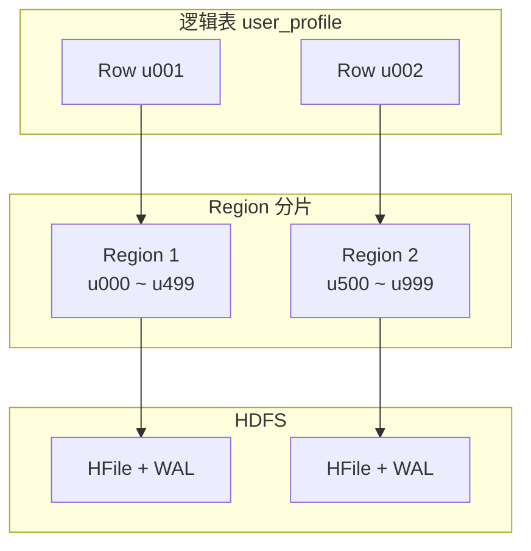
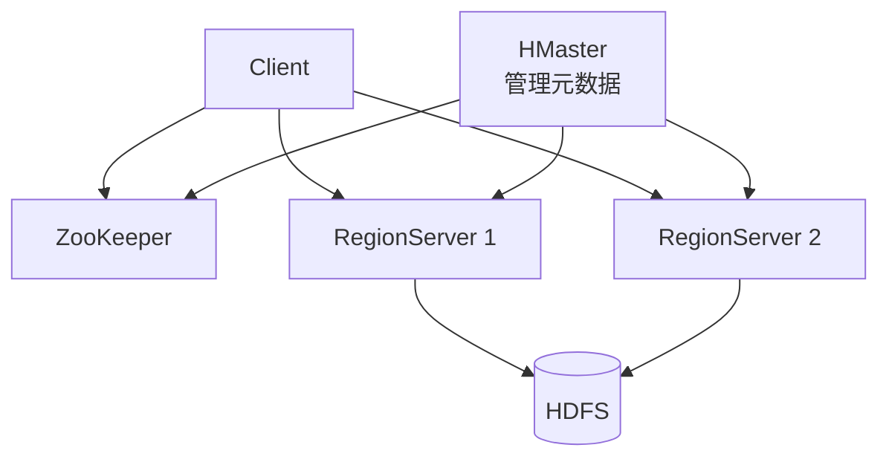

> **Hadoop 入门系列 · 第 8/10 篇**  
> 上一篇：[《Kafka + Hadoop》](/2026/06/12/hadoop-series-07-kafka-hadoop/)  
> 下一篇预告：[《搭建一个离线数仓》](/2026/06/14/hadoop-series-09-data-warehouse/)

---

## 开头：HDFS 找不到某一行，怎么办？

Hive 查 `WHERE user_id = 'u001'` 要扫描整个分区 —— 几亿行数据，分钟级延迟。

你需要的是：**给定 RowKey，毫秒级定位一行** —— 像 MySQL 主键查询，但数据量在 **PB 级**。

**HBase** 就是 HDFS 上的 **NoSQL 宽表数据库**：

- 底层数据存在 **HDFS**
- 上层提供 **随机读写、行级更新**
- 灵感来自 Google **Bigtable** 论文

---

## 一、HBase 的定位

| 系统 | 模型 | 随机读 | 随机写 | 适用 |
|------|------|--------|--------|------|
| **HDFS** | 文件 | ❌ | ❌ append only | 批量存储 |
| **Hive** | SQL 表 | ❌ 全表/分区扫 | ❌ | 离线分析 |
| **HBase** | 宽表 KV | ✅ 毫秒级 | ✅ 行级 | 实时点查、海量写入 |
| **Redis** | 内存 KV | ✅ 极快 | ✅ | 缓存、小数据 |
| **MySQL** | 关系表 | ✅ | ✅ | 事务 OLTP，GB–TB 级 |

**HBase 不是 Redis 的替代品，也不是 MySQL 的升级版** —— 它是 **海量稀疏宽表 + 高并发读写** 的专用工具。

典型场景：

- 用户画像（亿级用户，几百个标签列）
- 物联网时序数据（设备 ID + 时间戳）
- 消息已读状态、Feed 流

---

## 二、数据模型

### 2.1 逻辑结构

```
Table: user_profile
RowKey          Column Family: info          Column Family: tags
                info:name   info:city       tags:interest
─────────────   ─────────   ──────────      ──────────────
u001            张三        北京            sports,music
u002            李四        上海            tech
u003            王五        广州            food
```

| 概念 | 说明 |
|------|------|
| **RowKey** | 行唯一标识，**字典序排序** 存储 |
| **Column Family（列族）** | 列的分组，建表时定义，物理上分开存储 |
| **Column Qualifier** | 列族内的具体列，如 `info:name` |
| **Cell** | RowKey + CF + CQ + Timestamp → Value |
| **Timestamp** | 同一 Cell 多版本，默认取最新 |

**稀疏性：** 一行有 100 列，另一行只有 3 列 —— 不占空间，不像 MySQL 定长 NULL。

### 2.2 物理存储



- 表按 RowKey 范围切成 **Region**
- 每个 Region 由一个 **RegionServer** 服务
- 数据文件 **HFile** 和预写日志 **WAL** 存在 HDFS

---

## 三、架构：HMaster + RegionServer



| 组件 | 职责 |
|------|------|
| **HMaster** | 管理 Region 分配、DDL、负载均衡（Active/Standby HA） |
| **RegionServer** | 读写 Region，Flush MemStore → HFile |
| **ZooKeeper** | 选举 HMaster、RegionServer 注册 |
| **HDFS** | 持久化 HFile 和 WAL |

**读路径：** Client → ZK 查 Meta 表 → 定位 RegionServer → 读 MemStore + HFile  
**写路径：** Client → RegionServer → 写 WAL → 写 MemStore → 异步 Flush 到 HFile

---

## 四、RowKey 设计原则

RowKey 设计 **决定 HBase 性能**，是最关键的调优点。

### 4.1 原则

| 原则 | 说明 | 反例 |
|------|------|------|
| **避免热点** | 不要连续递增前缀 | `20260612001, 20260612002...` 全打到一个 Region |
| **长度适中** | 建议 10–100 字节 | 太长浪费内存，太短表达能力弱 |
| **散列前缀** | 高位加 salt / hash | `{hash(uid)%10}_uid` 分散到 10 个 Region |
| **查询模式优先** | RowKey 按最常查的模式设计 | 按用户查 → uid 在前；按时间范围 → 时间戳设计 |

### 4.2 示例：订单表

**需求：** 查某用户最近订单 + 按订单 ID 精确查

```
# 差设计：order_id 自增
RowKey = 0000000001, 0000000002  → 全部写最后一个 Region，热点

# 好设计：反转 + 用户前缀
RowKey = {reverse(order_id)}_{user_id}
或
RowKey = {hash(user_id)%10}_{user_id}_{reverse_timestamp}
```

### 4.3 扫描 vs Get

- **Get(rowkey)**：精确查一行，毫秒级
- **Scan(startRow, stopRow)**：范围扫描，RowKey 设计决定 Scan 效率

---

## 五、HBase vs Redis vs MySQL

| 维度 | HBase | Redis | MySQL |
|------|-------|-------|-------|
| **数据量** | PB 级 | GB 级（内存） | TB 级 |
| **延迟** | 毫秒–百毫秒 | 亚毫秒 | 毫秒 |
| **模型** | 宽表 KV | KV / 数据结构 | 关系表 + SQL |
| **事务** | 行级原子 | 单命令原子 | ACID |
| **查询** | Get / Scan | 丰富命令 | 任意 SQL |
| **成本** | 廉价磁盘（HDFS） | 内存贵 | SSD + 单机贵 |

**组合用法（常见）：**

```
Redis 缓存热数据 → HBase 存全量 → Hive 离线分析历史
MySQL 存订单事务 →  nightly Sqoop → Hive 报表
```

---

## 六、最小 Shell 示例

```bash
# HBase Shell
hbase shell

# 建表
create 'user_profile', 'info', 'tags'

# 插入
put 'user_profile', 'u001', 'info:name', '张三'
put 'user_profile', 'u001', 'info:city', '北京'
put 'user_profile', 'u001', 'tags:interest', 'sports'

# 精确查
get 'user_profile', 'u001'

# 扫描
scan 'user_profile', {LIMIT => 10}

# 删除
delete 'user_profile', 'u001', 'tags:interest'
```

---

## 本节小结

| 概念 | 要点 |
|------|------|
| **HBase 定位** | HDFS 上的 NoSQL 宽表，随机读写 |
| **RowKey** | 字典序，决定分布与查询效率 |
| **Column Family** | 物理分族，建表时固定 |
| **Region** | 表的水平分片 |
| **架构** | HMaster + RegionServer + ZK + HDFS |
| **RowKey 设计** | 防热点、适长度、匹配查询模式 |

---

## 下篇预告

**第 9 篇：《搭建一个离线数仓——从原始日志到 BI 报表》**

- ODS → DWD → DWS → ADS 分层
- PV/UV SQL 实战
- Airflow 调度日报

---

## 思考题

> 物联网场景：1 亿台设备，每台每秒 1 条数据，RowKey 如何设计才能既支持「查某设备最近 1 小时数据」，又避免热点？

提示：`{hash(device_id) % 100}_{device_id}_{Long.MAX_VALUE - timestamp}` —— 前缀散列 + 设备 ID + 时间倒序。

下一篇见 🐘
