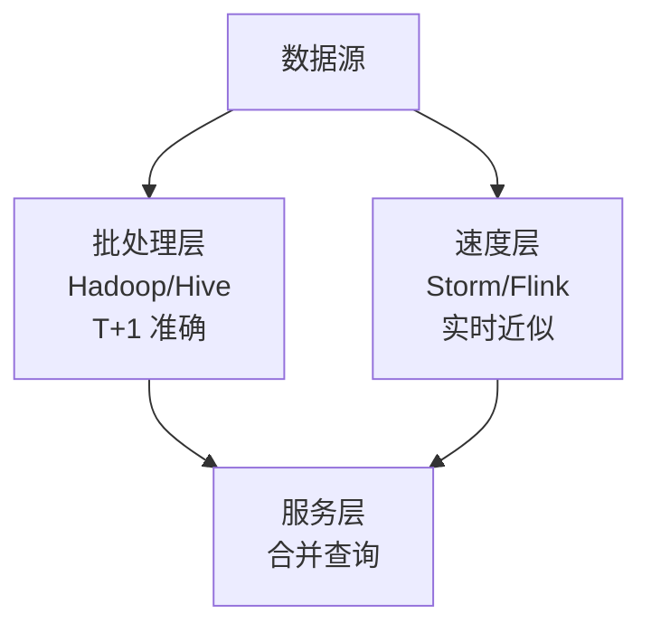
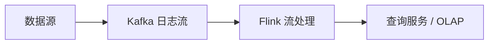
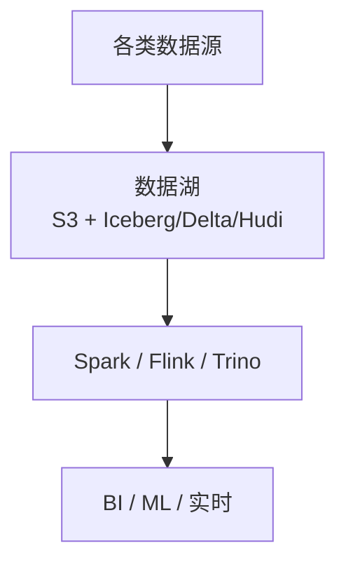
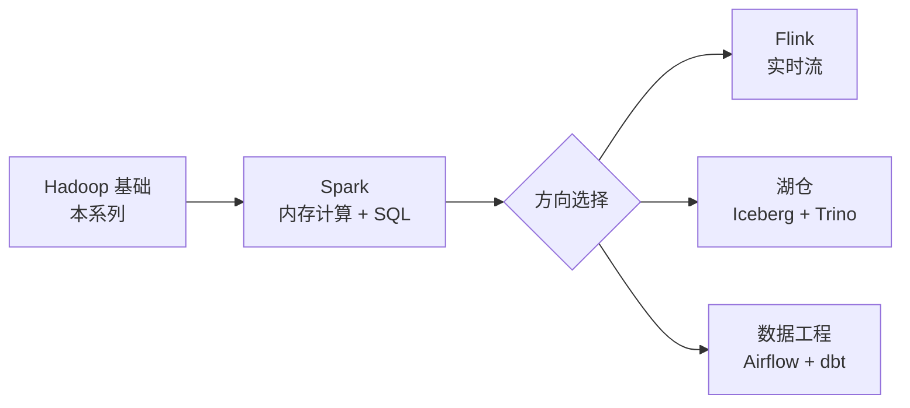

> **Hadoop 入门系列 · 第 10/10 篇（收官）**  
> 上一篇：[《离线数仓实战》](/2026/06/14/hadoop-series-09-data-warehouse/)  
> 系列第 1 篇：[《Hadoop 是什么？》](/2026/06/06/hadoop-series-01-what-is-hadoop/)

---

## 开头：2026 年了，还要学 Hadoop 吗？

Stack Overflow 上「Is Hadoop dead?」的帖子每年都被挖坟。

一边是云厂商推 **S3 + EMR / 湖仓一体**，一边是面试仍问 **HDFS 副本机制、MapReduce Shuffle、YARN 调度**。

Hadoop 过时了吗？

**准确答案：Hadoop 作为「默认大数据平台」的地位已过，但作为「分布式系统的底层常识」永远不会过。**

---

## 一、Hadoop 的历史贡献与现状

### 1.1 编年史

| 年份 | 里程碑 |
|------|--------|
| 2003–04 | Google GFS + MapReduce 论文 |
| 2006 | Hadoop 项目诞生（Nutch → Apache） |
| 2008 | 雅虎 1 分钟排序 1TB，一战成名 |
| 2010–14 | Hadoop 1.x 黄金期，「大数据」= Hadoop |
| 2013 | Hadoop 2.0 + YARN，生态爆发 |
| 2014–16 | Spark 崛起，「Hadoop is slow」 |
| 2018–20 | 云原生大数据，对象存储替代 HDFS |
| 2020+ | 湖仓一体（Iceberg/Delta/Hudi）成为主流 |

### 1.2 今天 Hadoop 还在哪儿用？

| 场景 | 现状 |
|------|------|
| **金融/电信传统数仓** | 大量 HDFS + Hive 存量，迁移成本高 |
| **Cloudera / Hortonworks 客户** | 企业版 CDP 仍基于 Hadoop 生态 |
| **HBase / Kafka 的底层** | HBase 仍依赖 HDFS（或 S3 兼容存储） |
| **新兴互联网公司** | 多数直接用 **云对象存储 + Spark/Flink** |
| **学习 / 面试** | 核心概念仍是准入门槛 |

**Hadoop 没有消失，但从「C 位」变成了「基础设施层」或「被云托管的隐形依赖」。**

---

## 二、新技术的冲击

### 2.1 Spark —— 内存计算取代 MapReduce

| 维度 | MapReduce | Spark |
|------|-----------|-------|
| 中间结果 | 写 HDFS | 尽量内存 |
| 编程模型 | Map + Reduce | DAG（map/filter/join/...） |
| 速度 | 慢 | 快 10–100 倍 |
| SQL | 需 Hive | Spark SQL 原生 |

**今天的新项目：** Hive on Spark / Spark SQL 是主流，裸 MapReduce 极少。

### 2.2 Flink —— 真正的流批一体

| 维度 | Spark Streaming（微批） | Flink（原生流） |
|------|-------------------------|-----------------|
| 模型 | 小批次 RDD | 事件驱动流 |
| 延迟 | 秒级 | 毫秒–秒级 |
| 状态 | 有限 | 强大的 Managed State |
| 场景 | 近实时 | 实时风控、实时大屏 |

**CEP（复杂事件处理）、Exactly-Once 语义** —— Flink 是实时数仓核心。

### 2.3 云原生 —— S3 替代 HDFS

```
传统：  自建 HDFS 集群 + NameNode HA + 运维 3 人
云原生：S3 存数据 + EMR/Serverless Spark 按需计算 + 0 运维存储
```

| 对比 | HDFS | S3 / OSS |
|------|------|----------|
| 运维 | 自己管 NameNode/DataNode | 云厂商管 |
| 成本 | 3 副本固定 | 存储便宜，计算分离 |
| 扩展 | 加 DataNode | 无限 |
| 生态 | Hadoop 原生 | Iceberg/Delta 湖格式 |

**趋势：存储和计算彻底分离（Storage-Compute Separation）。**

---

## 三、架构演进：Lambda → Kappa → 湖仓一体

### 3.1 Lambda 架构



- **批层**：HDFS + Hive，全量准确
- **速层**：实时流，低延迟但不精确
- **缺点**：两套代码、两套逻辑，维护成本高

### 3.2 Kappa 架构



- **一切皆是流**，批处理 = 流的重放
- Kafka 存全量历史，Flink 可重算任意时间段
- **优点**：一套代码；**缺点**：Kafka 存储成本、重算耗时

### 3.3 湖仓一体（Lakehouse）



**核心创新：开放表格式（Table Format）**

- **Apache Iceberg / Delta Lake / Hudi**
- 在对象存储上提供 **ACID、Schema 演进、Time Travel、分区剪枝**
- 同时支持 **批分析 + 流写入 + ML 训练**

**湖仓一体 = 数据湖的灵活 + 数据仓库的管理能力**

---

## 四、Hadoop 还值得学吗？

### 4.1 必须掌握的核心概念（永不过时）

| 来自 Hadoop | 在新技术中的对应 |
|-------------|------------------|
| HDFS 分块 + 副本 | S3 分片 + 多 AZ 冗余 |
| MapReduce 分而治之 | Spark Partition / Flink Parallelism |
| Shuffle | Spark Shuffle / Flink KeyBy |
| YARN 资源调度 | K8s + YARN / Mesos 思想 |
| 数据本地性 | Spark Locality / Pushdown |
| Hive 分区 | Iceberg Hidden Partition |

**不懂 HDFS，就不理解对象存储为什么也要「分块」；不懂 Shuffle，就不理解 Spark Job 为什么慢。**

### 4.2 面试仍然高频

真实面试题（2025–2026 仍常见）：

1. HDFS 读写流程？Block 大小为什么 128MB？
2. MapReduce Shuffle 过程？
3. YARN 任务提交流程？
4. Hive 分区与分桶区别？
5. HBase RowKey 设计原则？
6. 数据倾斜怎么处理？（MR/Spark 通用）

### 4.3 学习 ROI 判断

```
你的目标                    建议
─────────────────────────────────────────
大数据开发工程师            Hadoop 基础 + Spark/Flink 主力
数据分析师                  Hive SQL + Spark SQL
后端转大数据                本系列 10 篇 + Spark 实战
只想用云 SQL               可跳过 MR 编程，但 HDFS 概念仍要懂
```

---

## 五、学习路线回顾 + 下一步

### 5.1 本系列 10 篇回顾

| 篇 | 标题 | 核心产出 |
|:---:|------|----------|
| 01 | [Hadoop 是什么？](/2026/06/06/hadoop-series-01-what-is-hadoop/) | 生态全景 |
| 02 | [HDFS 核心概念](/2026/06/07/hadoop-series-02-hdfs-core-concepts/) | 架构图 |
| 03 | [HDFS 读写流程](/2026/06/08/hadoop-series-03-hdfs-read-write/) | Docker 跑通 HDFS |
| 04 | [MapReduce 思想](/2026/06/09/hadoop-series-04-mapreduce/) | WordCount |
| 05 | [YARN 资源调度](/2026/06/10/hadoop-series-05-yarn/) | Web UI 调度 |
| 06 | [Hive SQL 入口](/2026/06/11/hadoop-series-06-hive/) | SQL 查 HDFS |
| 07 | [Kafka + Hadoop](/2026/06/12/hadoop-series-07-kafka-hadoop/) | 实时管道 |
| 08 | [HBase](/2026/06/13/hadoop-series-08-hbase/) | NoSQL 宽表 |
| 09 | [离线数仓实战](/2026/06/14/hadoop-series-09-data-warehouse/) | ODS→ADS |
| 10 | **本文** | 架构演进 + 路线 |

### 5.2 推荐下一步



**具体行动清单：**

1. **Spark** —— 《Spark 快速大数据分析》+ 本地 `spark-shell` WordCount
2. **Flink** —— 官方 Training 跑 WindowWordCount
3. **云实践** —— 阿里云 MaxCompute / AWS EMR Serverless 跑 Hive SQL
4. **湖格式** —— 读 Iceberg 官方 Quickstart，理解 Time Travel
5. **环境** —— 延续 [Docker Hadoop 环境](/2026/06/05/windows-wsl-docker-hadoop-setup/)，逐步叠加 Spark 容器

---

## 六、收官一句话

> **Hadoop 不是你要就职的公司，而是你要路过的城市。**  
> 你最终可能住在 Spark/Flink/湖仓一体的新城，但不懂 Hadoop 的路标，你会在新城里迷路。

感谢读完 **Hadoop 入门系列** 全部 10 篇。🐘

---

## 最终思考题

> 如果让你从零设计一个 2026 年的数据分析平台，你会选「自建 Hadoop 集群」还是「S3 + EMR Serverless + Iceberg」？列出你的决策依据（成本、运维、团队技能、数据规模、延迟要求）。

没有标准答案，但有清晰的思考框架 —— 这正是本系列想给你的。

---

## 系列索引

- [第 1 篇：Hadoop 是什么？](/2026/06/06/hadoop-series-01-what-is-hadoop/)
- [第 2 篇：HDFS 核心概念](/2026/06/07/hadoop-series-02-hdfs-core-concepts/)
- [第 3 篇：HDFS 读写流程](/2026/06/08/hadoop-series-03-hdfs-read-write/)
- [第 4 篇：MapReduce 思想](/2026/06/09/hadoop-series-04-mapreduce/)
- [第 5 篇：YARN 资源调度](/2026/06/10/hadoop-series-05-yarn/)
- [第 6 篇：Hive SQL 入口](/2026/06/11/hadoop-series-06-hive/)
- [第 7 篇：Kafka + Hadoop](/2026/06/12/hadoop-series-07-kafka-hadoop/)
- [第 8 篇：HBase](/2026/06/13/hadoop-series-08-hbase/)
- [第 9 篇：离线数仓实战](/2026/06/14/hadoop-series-09-data-warehouse/)
- [第 10 篇：总结与展望](/2026/06/15/hadoop-series-10-future/)
