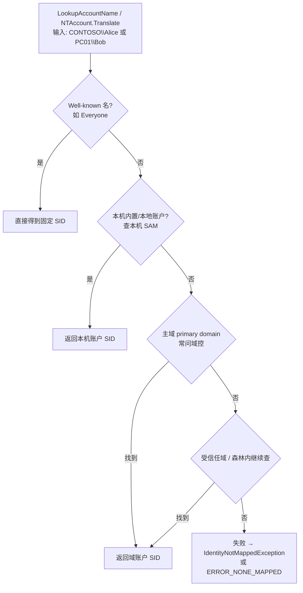

---
layout: post
author:     "Corey"
header-img: "img/post-bg-circuit-board.jpg"
header-mask: 0.25
title: "如果没有权限系统：一步步「发明」Windows 权限（单概念递进版）"
subtitle: "账户 → SID → 登录与令牌 → Owner → 权限位 → 组 → ACL → 继承 → 域与共享"
date: 2026-08-06
catalog: true
tags: [Windows, ACL, NTFS, Active Directory, 权限, InheritanceFlags, PropagationFlags, LSA, 安全]
---

> 假设世界上本来没有「权限」这回事。  
> 我们不从名词大全开始，而用**西蒙/费曼式**读法：  
> **一次只讲透一个概念 → 只用已经会的东西解释它 → 讲完再往前走，尽量不剧透后面。**

每一站固定节奏：

1. 碰到了什么麻烦  
2. 这一站只发明什么  
3. 怎么理解 / 怎么看见（命令或 C#）  
4. **你现在会了什么 / 下一站才需要什么**

关键论断旁标注 Microsoft Learn 出处（经 Context7 查阅）。

阅读地图（只显示站名，细节进站再学）：

```text
第 0 站  没有权限的世界
第 1 站  账户：系统如何认出「人」
第 2 站  SID：机器真正认的身份证号
第 3 站  名字 ↔ SID：LSA 去哪里查
第 4 站  登录：谁验密码，如何验（LSA 过程）
第 5 站  Access Token：登录成功后发的通行证
第 6 站  Owner：文件上的「主人」字段
第 7 站  权限位：读 / 写 / 完全控制……
第 8 站  组：人太多时如何打包
第 9 站  ACE 与 DACL：规则列表
第 10 站 访问检查：令牌对 DACL；UNC/SMB 与共享∩NTFS 两道门
第 11 站 安全描述符：把 Owner 与 DACL 放进同一份档案
第 12 站 继承：从最小实验一步步发明（OI/CI/IO/NP）（重点）
第 13 站 有效权限
第 14 站 SACL：审计
第 15 站 域与域控：从「一本公共账」推到加域与目录树
第 16 站 用户权利 ≠ 对象权限；UAC 双令牌
总图    串回全链路
```

---

## 第 0 站：没有权限的世界

一台电脑、一个使用者。文件就躺在磁盘上，谁开机谁能动。

单人单机完全够用。麻烦从**第二个人**坐到这台电脑前开始。

**你现在会了：** 为什么需要后面这些发明。  
**下一站才需要：** 怎样认出「现在动手的是谁」。

---

## 第 1 站：账户——系统眼里的「人」

### 麻烦

同事登录同一台机器，打开你的报表，改了两行，或删了。

系统若连「现在是谁」都分不清，后面谈不上保护。

### 这一站只发明：账户（用户）

Microsoft Learn 把能被 Windows **认证**的实体叫做 **Security Principal（安全主体）**。常见形态包括用户、组、计算机等；**这一站我们先只盯住「用户账户」**，组和计算机以后再开。  
来源：[Understand security principals](https://learn.microsoft.com/en-us/windows-server/identity/ad-ds/manage/understand-security-principals)

白话：

> 账户 = 系统里登记过的一个「人」。  
> 登录时你证明「我是这个账户」，系统才认你。

本机可以有本地用户（存在本机账户库里）；公司环境里还会有「域账户」——那是后文的集中身份，现在只要知道：**都是「账户」这一种东西的不同存放位置。**

### 怎么看见

登录后打开命令行：

```bat
whoami

PS C:\Users\chengongyi> whoami /user

用户信息
----------------

用户名          SID
=============== ================================================
jzfz\chengongyi S-1-5-21-3977539503-3587586693-2971573549-279405
```

会打印类似 `PC01\Alice` 或 `CONTOSO\Alice` 的账户名。

C#：

```csharp
using System.Security.Principal;

WindowsIdentity id = WindowsIdentity.GetCurrent();
Console.WriteLine(id.Name);              // 账户名
Console.WriteLine(id.IsAuthenticated);   // 是否已认证
```

来源：[Create a WindowsPrincipal](https://learn.microsoft.com/en-us/dotnet/standard/security/how-to-create-a-windowsprincipal-object)

### 收束

**你现在会了：** 系统用「账户」区分不同的人。  
**下一站才需要：** 为什么系统内部更爱用一串 `S-1-5-21-...`，而不是只记名字。

---

## 第 2 站：SID——机器真正认的身份证号

### 麻烦

账户可以改显示名、改登录名。若权限规则写死「名字叫 Alice 的人能读」，改名后规则全乱。

### 这一站只发明：SID

**SID（Security Identifier）** 是唯一值，用来标识一个安全主体。账户或组在创建时由权威分配 SID，**不会再分配给别的主体复用**。  
来源：[Understand security identifiers](https://learn.microsoft.com/en-us/windows-server/identity/ad-ds/manage/understand-security-identifiers)

类比：

| 给人看 | 给机器用 |
|--------|----------|
| 账户名 `CONTOSO\Alice` | SID `S-1-5-21-...-1103` |

> 改名像换工牌打印字；SID 像身份证号，不跟着换。

### 怎么看见

```bat
whoami /user
```

C#：

```csharp
WindowsIdentity id = WindowsIdentity.GetCurrent();
Console.WriteLine(id.User);   // 当前用户的 SID
```

### 收束

**你现在会了：** 稳定身份是 SID；名字是给人看的标签。  
**下一站才需要：** 代码里写了账户名时，系统如何查出对应 SID。

---

## 第 3 站：名字 ↔ SID——LSA 去哪里查

### 麻烦

你在程序里常写 `CONTOSO\Alice`，但对象上要记的是 SID。需要一次「翻译」。

### 这一站只发明：名字与 SID 的互译

Windows 的 **LSA（Local Security Authority）** 提供 **name ↔ SID 翻译**。  
来源：[Credentials processes - LSA](https://learn.microsoft.com/en-us/windows-server/security/windows-authentication/credentials-processes-in-windows-authentication)

对应的经典 Win32 API 是 **`LookupAccountName`**（名→SID）和 **`LookupAccountSid`**（SID→名）。  
来源：[LookupAccountNameW](https://learn.microsoft.com/en-us/windows/win32/api/winbase/nf-winbase-lookupaccountnamew)

#### C# 里你看到的写法

```csharp
using System.Security.Principal;

var account = new NTAccount(@"CONTOSO\Alice");
var sid = (SecurityIdentifier)account.Translate(typeof(SecurityIdentifier));
Console.WriteLine(sid.Value);   // S-1-5-21-...-xxxx

// 反过来
var name = (NTAccount)sid.Translate(typeof(NTAccount));
Console.WriteLine(name.Value);
```

`.NET` 的 `Translate` **不会自己算 SID**，而是向操作系统发起这次查找；找不到会抛 `IdentityNotMappedException`。

#### 官方架构图：LSA 在整机里处在什么位置

下面这张图来自 Microsoft Learn《Credentials processes in Windows authentication》，画的是**客户端上的 LSA 架构**：凭据/安全请求如何进入 LSA，再如何落到本机 SAM 或域控一侧。

> 图片来源（Microsoft Learn）：  
> [Credentials processes in Windows authentication](https://learn.microsoft.com/en-us/windows-server/security/windows-authentication/credentials-processes-in-windows-authentication)  
> 原图文件：`authn_lsa_architecture_client.png`


**怎么读这张图（只盯住「名字↔SID 去哪查」）：**

| 图上区域 | 组件（图中英文） | 和小白的关系 |
|----------|------------------|--------------|
| 最上排 | User Mode App / CredUI / Winlogon / Kernel App | 各种「想问安全子系统」的入口。你的 C# `Translate` 也属于**用户态程序**经系统 API 问到 LSA，不必自己懂协议细节。 |
| 黄色大框 | **Local Security Authority**（`Lsasrv.dll` 等） | **翻译与认证的总调度台**。名字↔SID、验身份相关请求，先汇聚到这里。 |
| 黄框内一排 SSP | NTLM / Kerberos / Schannel… | 不同场景用的安全支持提供者。本站先记住：**本地账户路径常和 NTLM↔SAM 相关；域账户路径常和 Kerberos / Netlogon↔域控相关**。具体登录协议下一站再展开。 |
| 右侧 | **SAM（`Samsrv.dll`）→ Registry** | **本机账户**的权威库。本地用户名对应的 SID，答案在本机 SAM（注册表中有受保护副本）。 |
| 下侧 | **Netlogon**、到 **Domain Controller / KDC** 的箭头 | **域账户**要问域。图上可见到 DC / KDC 的网络路径——这就是 `CONTOSO\Alice` 这类名字最终常落到域控的原因。 |

用一句话把图收束到本站：

> **C# 只负责开口问；本机 LSA 负责调度；本地答案在 SAM，域答案在域控（经 Netlogon / 目录服务相关路径）。**

Learn 对该图相关组件的文字说明也印证了这一点，例如：Winlogon 经 `secur32.dll` 把交互登录凭据交给 LSA；`samsrv.dll` 是存放本地安全账户的 SAM；`netlogon.dll` 维护到域控的安全通道，并可传回域 SID 与用户权利等。  
来源：同上 [Credentials processes](https://learn.microsoft.com/en-us/windows-server/security/windows-authentication/credentials-processes-in-windows-authentication) 中组件表。

#### 执行时究竟按什么顺序查？（LookupAccountName）

官方架构图回答「**经过哪些组件**」；`LookupAccountName` 的 Remarks 还规定了「**按什么优先级试**」。官方没有单独流程图，下面按文档顺序自绘：



文字对照：

1. **Well-known SIDs**（如 Everyone）  
2. **本机内置/本地账户**（本机 SAM）——对应图里 **SAM → Registry**  
3. **主域（primary domain）**——对应图里通向 **Domain Controller** 的路径  
4. 再查 **受信任域**；还可查到森林中其它域账户  

并建议用完全限定名 `域\用户`（你这段就是），比光写 `Alice` 更清晰、通常也更快。  
来源：[LookupAccountName Remarks](https://learn.microsoft.com/en-us/windows/win32/api/winbase/nf-winbase-lookupaccountnamew)

对 `CONTOSO\Alice` 走一遍：

```text
C# Translate
  → 本机 LSA / LookupAccountName
      → 不是 well-known
      → 一般也不是「仅存在本机 SAM」的本地用户
      → 进入主域查找 → 常联系 CONTOSO 域控（或命中本机 LSA 名称缓存）
  → 返回 SID
```

LSA 还有 Name/SID **查找缓存**，减少反复打域控。  
来源：[LSA Lookup performance counters](https://learn.microsoft.com/en-us/windows-server/identity/ad-ds/lsa-lookup-performance-counters)

> **权威数据**：域账户在域目录（经域控）；本地账户在本机 SAM。  
> **本次调用**：可能命中缓存，也可能当场问域控——不是 C# 进程自己读库。

### 收束

**你现在会了：** 名字与 SID 如何互译；能对着 LSA 架构图指出「本地走 SAM、域走域控」。  
**下一站才需要：** 登录时，LSA 不只做翻译，还要**验密码**——过程是怎样的。

---

## 第 4 站：登录——谁验密码，过程怎样（LSA）

### 先分清两个词（本站只用到「认证」）

| 词 | 白话 | 本站是否展开 |
|----|------|--------------|
| **认证 Authentication** | 你是不是你声称的那个人？ | ✅ 本站讲透 |
| **授权 Authorization** | 验过之后，某个文件/共享能不能碰？ | ❌ 后面才讲 |

来源：[Windows logon scenarios](https://learn.microsoft.com/en-us/windows-server/security/windows-authentication/windows-logon-scenarios)

### 例子：Alice 在 PC01 上登录

> 电脑 `PC01` 已加入域 `CONTOSO`。  
> Alice 输入 `CONTOSO\Alice` + 密码，点登录。

#### ① 唤起登录界面

**Winlogon** 管理安全交互，拉起安全桌面上的 **Logon UI**。  
来源：[Credentials processes - Winlogon](https://learn.microsoft.com/en-us/windows-server/security/windows-authentication/credentials-processes-in-windows-authentication)

#### ② 选磁贴、输入账号密码

**Credential Provider** 负责采集、打包凭据（密码 / PIN / Hello…）。  
文档强调：Provider **不做最终放行**；执法的是 **LSA 与认证包**。  
来源：[Credential provider architecture](https://learn.microsoft.com/en-us/windows-server/security/windows-authentication/credentials-processes-in-windows-authentication)

#### ③ 凭据交给本机 LSA

Winlogon 把凭据经 **`secur32.dll`** 交给 **LSA**（常在 LSASS 进程中）。  
来源：同上 Winlogon 说明。

#### ④ 去哪里对答案？

默认对照 **本机 SAM** 或（域加入机器上的）**Active Directory**。  
来源：[Credentials processes overview](https://learn.microsoft.com/en-us/windows-server/security/windows-authentication/credentials-processes-in-windows-authentication)

```text
CONTOSO\Alice → LSA 判定为域账户 → 问 CONTOSO 域控
PC01\Bob      → LSA 查本机 SAM
```

#### ⑤ 成功或失败

认证包在初始登录成功时会**创建 logon session**，并返回后续构建安全上下文所需信息。  
来源：[LSA_AP_LOGON_USER](https://learn.microsoft.com/en-us/windows/win32/api/ntsecpkg/nc-ntsecpkg-lsa_ap_logon_user)

失败则回到登录界面（密码错、账户禁用、登录时段限制等）。

#### ⑥ 域控暂时连不上

若以前在这台机器成功用域账户登录过，可能使用**缓存的域登录凭据**仍进入桌面。  
来源：[Cached credentials and validation](https://learn.microsoft.com/en-us/windows-server/security/windows-authentication/credentials-processes-in-windows-authentication)

```text
Alice 输入密码
  → Logon UI + Credential Provider（采集）
  → Winlogon ──secur32──► LSA
  → 域账户？→ 问域控（或缓存）
  → 成功：建立 logon session → 下一站「发通行证」
```

### 收束

**你现在会了：** 登录框只收凭据；LSA 是验钞机；域/本机对答案的地方不同。  
**下一站才需要：** 验过之后，系统发给你什么，好让之后不用反复问密码。

---

## 第 5 站：Access Token——登录成功后的通行证

### 麻烦

不能每打开一个程序就再输一次密码。系统需要一份「本次登录有效的身份摘要」，挂在你的进程上。

### 这一站只发明：访问令牌（Access Token）

认证成功后，**LSA 创建主访问令牌（primary access token）**，其中包含：

- 用户 **SID**  
- **组 SID**（你属于哪些组——组的细节下一站才展开，这里先接受「令牌里可以有一组 SID 列表」）  
- 分配的 **用户权利（user rights）**  

令牌会附着到你名下的进程与线程。  
来源：[Understand security principals - Access tokens](https://learn.microsoft.com/en-us/windows-server/identity/ad-ds/manage/understand-security-principals)

域用户登录时，相关 SID（含组 SID、可能的 `SIDHistory`）会进入令牌；之后访问资源时，**令牌里的 SID 都可能参与允许或拒绝**。  
来源：[Understand security identifiers](https://learn.microsoft.com/en-us/windows-server/identity/ad-ds/manage/understand-security-identifiers)

口诀：

> **登录 ≈ 认证 + 发令牌。**  
> 之后本机操作主要看令牌，而不是反复问密码。

### 怎么看见

```bat
whoami /all


PS C:\Users\chengongyi> whoami /all

用户信息
----------------

用户名          SID
=============== ================================================
jzfz\chengongyi S-1-5-21-3977539503-3587586693-2971573549-279405


组信息
-----------------

组名                                          类型   SID                                              属性
============================================= ====== ================================================ ==========================================
Everyone                                      已知组 S-1-1-0                                          必需的组, 启用于默认, 启用的组
BUILTIN\Administrators                        别名   S-1-5-32-544                                     必需的组, 启用于默认, 启用的组, 组的所有者
BUILTIN\Users                                 别名   S-1-5-32-545                                     必需的组, 启用于默认, 启用的组
NT AUTHORITY\INTERACTIVE                      已知组 S-1-5-4                                          必需的组, 启用于默认, 启用的组
CONSOLE LOGON                                 已知组 S-1-2-1                                          必需的组, 启用于默认, 启用的组
NT AUTHORITY\Authenticated Users              已知组 S-1-5-11                                         必需的组, 启用于默认, 启用的组
NT AUTHORITY\This Organization                已知组 S-1-5-15                                         必需的组, 启用于默认, 启用的组
LOCAL                                         已知组 S-1-2-0                                          必需的组, 启用于默认, 启用的组
JZFZ\CD-2013388_建筑                          组     S-1-5-21-3977539503-3587586693-2971573549-24272  必需的组, 启用于默认, 启用的组
JZFZ\节点入库-正式                            组     S-1-5-21-3977539503-3587586693-2971573549-472641 必需的组, 启用于默认, 启用的组
JZFZ\20260410-S001_设总                       组     S-1-5-21-3977539503-3587586693-2971573549-553488 必需的组, 启用于默认, 启用的组

```

来源：[whoami](https://learn.microsoft.com/en-us/windows-server/administration/windows-commands/whoami)

```csharp
var id = WindowsIdentity.GetCurrent();
Console.WriteLine(id.User);
foreach (IdentityReference g in id.Groups!)
{
    Console.WriteLine(g); // 组 SID；有的能 Translate 成名字
}
```

### 收束

**你现在会了：** 令牌是什么、里面有用户 SID（以及一组组 SID 槽位）、挂在进程上。  
**下一站才需要：** 文件上如何登记「主人是谁」（还不是完整权限表）。

---

## 第 6 站：Owner——对象上的主人字段

### 麻烦

只有「当前操作者」不够：每个文件还要回答「这算谁的」。

### 这一站只发明：Owner

可保护对象（文件、文件夹等）带有一份安全信息；其中有一个 **Owner（所有者）** 字段，记录主人对应的主体（最终仍是 SID）。  
Learn 的安全描述符示例里可以看到 `Owner: ... [S-1-5-21-...]` 这种形态。  
来源：[AD domain-join permissions 示例中的 Security Descriptor](https://learn.microsoft.com/en-us/windows-server/identity/ad-ds/manage/active-directory-domain-join-permissions)

直觉：

- 创建文件时，常把创建者记为 Owner  
- Owner 提供「这是谁的文件」的默认锚点；**更细的「谁能读谁能写」是后面的规则表**，本站先不展开  

运维夺回失控对象时，可用 `takeown` 取得所有权。  
来源：[takeown](https://learn.microsoft.com/en-us/windows-server/administration/windows-commands/takeown)

```bat
takeown /f lostfile
```

### C#：读 / 改 Owner

```csharp
using System.IO;
using System.Security.AccessControl;
using System.Security.Principal;

var file = new FileInfo(@"D:\Share\report.xlsx");
FileSecurity security = file.GetAccessControl();

IdentityReference owner = security.GetOwner(typeof(NTAccount))!;
Console.WriteLine(owner);

security.SetOwner(new NTAccount(@"CONTOSO\Alice"));
file.SetAccessControl(security);
```

（现代 .NET 经 `FileSystemAclExtensions` 的 `GetAccessControl` / `SetAccessControl`。）  
来源：[FileSystemAclExtensions](https://learn.microsoft.com/en-us/dotnet/api/system.io.filesystemaclextensions.setaccesscontrol)

### 收束

**你现在会了：** Owner 是对象上的主人槽位；可用 API / `takeown` 查看或变更。  
**下一站才需要：** 主人之外，如何表达「同事能读不能改」。

---

## 第 7 站：权限位——读、写、完全控制……

### 麻烦

只有「主人全能 / 别人全不能」无法协作。

### 这一站只发明：权限位（能做什么）

先把「动作」拆成可勾选的能力。资源管理器里常见打包名：

| 说法 | 直觉 |
|------|------|
| 读取 | 打开看、列目录 |
| 写入 / 修改 | 改内容 |
| 读取和执行 | 读 + 运行 |
| 修改 | 读写下删（通常不含改权限本身） |
| 完全控制 | 一切，含改权限 |

`icacls` 里常见缩写：`F` 完全控制、`RX` 读执行、`N` 无访问等。  
本站还不改 ACL，只先认识缩写；查看某个文件当前权限时可这样看输出里的字母：

```bat
icacls D:\Share\Q1.xlsx
:: 输出里可能出现类似：(F)、(RX)、(R) —— 对应完全控制 / 读执行 / 读取
```

来源：[icacls](https://learn.microsoft.com/en-us/windows-server/administration/windows-commands/icacls)

> 本站只发明「有哪些开关」。  
> **还没发明**「把开关授给谁、怎样写成一张表」——那是后面 ACE/DACL。

### 收束

**你现在会了：** 权限是一堆可组合的能力位。  
**下一站才需要：** 人一多，不能对每个人单独维护时怎么办。

---

## 第 8 站：组——对人打包

### 麻烦

财务 30 人都要对某目录只读；入职离职时改 30 条个人规则会疯。

### 这一站只发明：组（Group）

组也是安全主体，有自己的 SID。把人放进组，权限授给组，成员自动带着组的身份去访问。  
来源：[Understand security groups](https://learn.microsoft.com/en-us/windows-server/identity/ad-ds/manage/understand-security-groups)

回扣第 5 站：登录后令牌里的 **组 SID 列表**，就是「你当前带着哪些组身份」。进组/出组后，通常需重新登录（或刷新令牌）才完整反映到令牌上。

本机有 `Users`、`Administrators` 等；域里还有更多——域的集中管理后文再讲。

### 收束

**你现在会了：** 组把人打包；令牌可携带组 SID。  
**下一站才需要：** 如何把「某个账户/组 + 允许或拒绝 + 哪些权限位」写成对象上的规则。

---

## 第 9 站：ACE 与 DACL——规则列表

### 麻烦

第 7 站有了「权限位」，第 8 站有了「组」。现实马上变成：

- 同一个文件要对很多人/很多组写规则；  
- 还会出现「财务组允许读，同时又有一条拒绝某人修改」这类冲突。

需要一张**挂在对象上的规则表**，而不是只在口头说「给 Alice 只读」。

### 这一站只发明：Permissions → ACE → DACL

Microsoft Learn（Appendix B）把 **Permissions（权限）** 说成：施加在**可保护对象（securable objects）**上的访问控制。可保护对象包括文件系统、注册表、服务、Active Directory 对象等。  
每个这样的对象都有关联的 **ACL（Access Control List）**，ACL 里是一条条 **ACE（Access Control Entry）**，用来对安全主体（用户、服务、计算机、组）**授予或拒绝**各种操作。  
来源：[Appendix B - Permissions](https://learn.microsoft.com/en-us/windows-server/identity/ad-ds/plan/security-best-practices/appendix-b--privileged-accounts-and-groups-in-active-directory)

本站重点是「谁能碰这个对象」那张表，也就是安全描述符里的 **DACL（Discretionary ACL）**。  
（审计用的 SACL 以后再讲；完整「安全描述符拼图」在第 11 站。）

### 9.1 先认清：规则挂在「对象」上，不是挂在人脑门上

| 概念 | 白话 |
|------|------|
| 可保护对象 | 文件、文件夹、注册表键、服务、AD 对象……凡是系统允许挂安全信息的东西 |
| Permissions | 「对这个对象，某身份能不能做某些操作」 |
| ACE | 规则表里的**一行** |
| DACL | 这些行组成的**整张「谁能碰」表** |

> 人带着令牌去敲门；门上贴的是 DACL。  
> 本站先把「门上的字」写清楚；下一站再讲系统怎么对照令牌读这些字。

### 9.2 DACL 保存在哪里？——跟对象走的元数据，不是文件正文

#### 先认一下：什么是 NTFS

后面会反复提到 **NTFS**，这里用一分钟对齐概念。

磁盘上的文件不是随便扔一堆字节：必须有一套规则，规定「文件怎么命名、怎么找到、属性存在哪」。这套规则就是 **文件系统（file system）**。

**NTFS（New Technology File System）** 是现代 Windows 的**默认文件系统**。除了存你的文档内容，它还支持更丰富的能力，其中包括 **security descriptors（安全描述符）**、加密、磁盘配额、丰富元数据等。  
来源：[NTFS overview](https://learn.microsoft.com/en-us/windows-server/storage/file-server/ntfs-overview)

和本篇的关系只要记一句：

> **正因为 NTFS 支持安全描述符，并用 ACL 做文件/文件夹级访问控制，DACL 才能作为「元数据」贴在每个文件旁边。**  
> 来源：同上（Increased security：NTFS provides granular access control through ACLs）

U 盘若格式化成 **FAT / exFAT** 等不支持这套 NTFS 安全描述符的文件系统，把文件拷过去时，**NTFS ACL 常常带不过去**——权限不是写在文件正文里，而是写在 NTFS 的元数据里。

（本站只需要「NTFS = Windows 默认文件系统，能挂安全描述符」。加密、集群卷等其它 NTFS 特性这里不展开。）

#### DACL 是写在文件内容里的吗？

常见疑问：**DACL 是写在文件内容里的吗？**

短答：对 **NTFS** 上的文件/文件夹，DACL 在该对象的 **安全描述符（Security Descriptor）** 里，由文件系统作为**安全元数据**保存，和对象绑在一起；**不是**塞进你用 Word/记事本打开的那种「文件正文」。

Learn 的表述是：安全描述符是与每个可保护对象**关联（associated）**的数据结构，其中可含 DACL（谁能碰）与 SACL（审计）等。  
来源：[Understand security principals - Security descriptors](https://learn.microsoft.com/en-us/windows-server/identity/ad-ds/manage/understand-security-principals)

可以这样对照：

| 东西 | 存哪 |
|------|------|
| 文件内容（报表文字、图片像素） | 数据流（你打开文件看到的） |
| Owner、DACL、SACL… | NTFS 为该文件维护的**安全描述符元数据** |

因此：

- ✅ 保存在「这个文件对象」旁边（由 NTFS 管理）  
- ❌ 不是写进 `.xlsx` / `.txt` 的用户数据字节里  
- 复制到**不支持这套安全描述符**的介质时，NTFS ACL 常常带不过去——也说明权限不在「内容」里，而在文件系统元数据里  

`icacls` 可以把目录下各文件的 DACL **导出成另一个文件做备份**，需要时再还原——进一步说明：平时 DACL 贴在对象上，可以另存成独立备份文件。  
官方文档示例风格如下（路径改成与本文一致的练习目录）：

```bat
:: 保存：把 D:\Share 下匹配项及其子目录的 DACL 写入备份文件（/t = 递归）
icacls D:\Share\* /save D:\Share-acl-backup.txt /t

:: 还原：按备份文件，把 DACL 写回 D:\Share\ 目录树
icacls D:\Share\ /restore D:\Share-acl-backup.txt
```

对照 Learn 原文例子：`icacls c:\windows\* /save aclfile /t` 与 `icacls c:\windows\ /restore aclfile`。  
来源：[icacls - Examples（save / restore）](https://learn.microsoft.com/en-us/windows-server/administration/windows-commands/icacls)

换对象类型，**模型一样，载体不同**：

| 对象 | DACL 跟谁走 |
|------|-------------|
| NTFS 文件/文件夹 | 该文件的文件系统安全元数据 |
| 注册表键 | 跟那个注册表键 |
| AD 对象 | 跟目录里那个对象 |

都是「对象自带安全描述符」，不是 Windows 另外一张与文件无关的全局「权限总表」。

### 9.3 ACE 解剖：一行规则里有什么

一条 ACE，可以先记成三个格子：

```text
┌──────────────┬──────────┬────────────────────┐
│ 对谁（SID）    │ 允许/拒绝 │ 哪些权限位（操作）     │
│ 用户或组…      │ Allow/Deny│ 读 / 写 / 完全控制… │
└──────────────┴──────────┴────────────────────┘
```

- **对谁**：最终是 SID（账户名只是给人看的；写入前常先 `Translate`）。  
- **允许还是拒绝**：Allow 或 Deny。  
- **哪些操作**：第 7 站的那些权限位（可读可写等）。

多条 ACE 排在一起，就是该对象的 **DACL**。

### 9.4 用一张示意表走读

假设文件 `D:\Share\Q1.xlsx` 的 DACL 是：

```text
某文件的 DACL（示意）
├── Allow  CONTOSO\FinanceRO     读取
├── Allow  CONTOSO\Alice         修改
└── Deny   CONTOSO\TempVendor    修改
```

直觉（精确求值算法下一站展开）：

| 来访者令牌里有谁 | 想做什么 | 粗结果 |
|------------------|----------|--------|
| 只在 `FinanceRO` 组 | 读 | 通常可以（命中 Allow 读取） |
| `Alice` | 修改 | 通常可以 |
| `TempVendor`（即使也在某允许组里） | 修改 | **Deny 一般压过冲突的 Allow** |

Appendix B 原文要点：**若 ACL 里有一条 Deny，且其 SID 出现在访问者令牌中，该 Deny 通常覆盖冲突的 Allow。**  
来源：同上 [Appendix B - Permissions](https://learn.microsoft.com/en-us/windows-server/identity/ad-ds/plan/security-best-practices/appendix-b--privileged-accounts-and-groups-in-active-directory)

### 9.5 三条必须先建立的直觉

在进入第 10 站「完整对表」之前，先把 Appendix B 里的判定直觉立住：

**① 没有任何匹配的 ACE → 不能访问**

若对象上没有定义任何「其 SID 出现在你令牌里」的 ACE，则主体**不能**访问该对象。  
来源：同上 Appendix B（no ACEs matching token SIDs → can't access）

白话：门上没写你的名字（也没写你的组），默认不是「随便进」，而是**进不去**。

**② Deny 一般压过 Allow**

同一对象上，对你令牌里某个 SID 既有允许又有拒绝时，**拒绝通常说了算**。  
因此「随手 Deny」杀伤力很大——尤其以后学到继承，一条错误 Deny 可能铺整棵目录树。

**③ 令牌里的组 SID 也会命中 ACE**

ACE 常写给组，而不是写给每个人。你令牌里带着组 SID（第 5、8 站），就会命中「授给该组」的那一行。

Appendix B 还举了 AD 里的常见模式：许多对象的 ACL 含有允许 **Authenticated Users** 读取一般信息的 ACE，但不允许读敏感信息或修改对象。除内置 Guest 等例外外，在域中通过域控认证的主体，令牌里默认常带有 Authenticated Users 这个 SID——所以「已登录的普通人」往往能读到目录里大量一般属性。  
来源：同上 Appendix B

> 这说明：DACL 里经常有一条「很宽、但权限很浅」的 Allow；  
> 真正敏感的操作，要靠更细的 ACE（或不给 Allow）来收紧。

### 9.6 Permissions ≠ User rights（本站只点破，不展开）

Appendix B 特意区分：

| 词 | 管什么 |
|----|--------|
| **Permissions（本站）** | 某个**对象**上的 ACL/ACE：能不能读这个文件、改这个 AD 属性…… |
| **User rights / privileges** | 更偏**系统范围**的能力：如取得所有权、备份、改系统时间……常通过组策略等分配 |

原文还给出冲突例：即便某对象 ACL **拒绝** Administrators 读写，属于 Administrators 的用户仍可能凭借用户权利 **Take ownership of files or other objects** 取得所有权，再改写 ACL 给自己完全控制。因此文档建议：**不要用高权账户做日常操作**，而不是幻想「靠 ACL Deny 就能挡住决心用高权的人」。  
来源：同上 Appendix B

本站只要记住：

> **DACL 很重要，但不是宇宙尽头。**  
> 「权利压过权限 / 夺所有权」的细节 → **第 16 站**再讲透。

（Appendix B 后半关于 Enterprise Admins、Domain Admins 等内置高权组的大表，属于域与高权专题，**不在本站展开**。）

### 9.7 怎么看见、怎么改 DACL

**命令行（改的就是 ACE）：**

```bat
:: 查看
icacls D:\Share\Q1.xlsx

:: 允许：给组读取（写入一条 Allow ACE）
icacls D:\Share\Q1.xlsx /grant CONTOSO\FinanceRO:R

:: 拒绝：显式 Deny（会加入 Deny ACE；文档说明还会从显式授予中去掉相同权限）
icacls D:\Share\Q1.xlsx /deny CONTOSO\TempVendor:M

:: 备份 / 还原整个目录树的 DACL（与 9.2 节同思路）
icacls D:\Share\* /save D:\Share-acl-backup.txt /t
icacls D:\Share\ /restore D:\Share-acl-backup.txt
```

```bat
:: 查看文件的权限（真实共享样例；第 10 站会用这份 DACL 与 whoami /groups 对表）
icacls "\\jzfz18\协同设计平台-18\CD-2013388\XREF\A"
```

示例输出：

```text
\\jzfz18\协同设计平台-18\CD-2013388\XREF\A BUILTIN\Administrators:(I)(F)
                                     CREATOR OWNER:(I)(OI)(CI)(IO)(F)
                                     JZFZ\CD-2013388_项目组:(I)(OI)(CI)(RX,WD,WEA,WA)
                                     JZFZ\CD-2013388_设总:(I)(OI)(CI)(F)
                                     JZFZ\成都协同平台只读组:(I)(OI)(CI)(RX)
                                     NT AUTHORITY\SYSTEM:(I)(OI)(CI)(F)
                                     ...（另有若干个人账户的 (RX)/(F) 行，此处从略）
```


来源：[icacls](https://learn.microsoft.com/en-us/windows-server/administration/windows-commands/icacls)（`/grant`、`/deny`、`/save`、`/restore`；**完整标志与实测见第 12 站**）

**C#（构造一条 ACE 并加入）：**

```csharp
using System.IO;
using System.Security.AccessControl;
using System.Security.Principal;

var file = new FileInfo(@"D:\Share\Q1.xlsx");
FileSecurity security = file.GetAccessControl();

// 一条 Allow ACE：对组 FinanceRO 授予读取
var allow = new FileSystemAccessRule(
    new NTAccount(@"CONTOSO\FinanceRO"),
    FileSystemRights.ReadAndExecute,
    AccessControlType.Allow);
security.AddAccessRule(allow);

// 一条 Deny ACE：拒绝 TempVendor 修改
var deny = new FileSystemAccessRule(
    new NTAccount(@"CONTOSO\TempVendor"),
    FileSystemRights.Modify,
    AccessControlType.Deny);
security.AddAccessRule(deny);

file.SetAccessControl(security);
```

（继承相关参数下一站之后的「继承专章」再加；这里先写「作用于当前对象」的最简 ACE。）

### 9.8 本站概念图

```text
可保护对象（文件 / 注册表 / AD 对象…）
        │
        │  NTFS 等以「安全元数据」形式保存（不是文件正文）
        ▼
   Security Descriptor（后文拼全）
        │
        └── DACL  ← 本站主角
              ├── ACE: Allow  FinanceRO   读取
              ├── ACE: Allow  Alice       修改
              └── ACE: Deny   TempVendor  修改
```

### 收束

**你现在会了：**

- Permissions 是对象上的访问控制；  
- **NTFS** 是 Windows 默认文件系统，能挂安全描述符；DACL 是跟对象走的安全元数据（不是文件正文）；  
- ACE 是一行（谁 × 允许/拒绝 × 操作）；DACL 是整张表；  
- 无匹配 ACE → 不能访问；Deny 通常压过 Allow；组 SID 可命中 ACE；  
- 权限与用户权利不是同一旋钮（细节后置）。

**下一站才需要：** 打开文件时，系统如何拿你令牌里的 SID，去和这张 DACL **逐条对表**（Access Check）。

---

## 第 10 站：访问检查——令牌如何对上规则（含网络共享两道门）

### 麻烦

令牌有了，DACL 有了，中间怎么判「能不能开」？  
真实协作里路径还常是 `\\服务器\共享\...`——本机对表之外，网络上还会多几步。用一个真实场景把抽象对表变成可操作的自查。

### 这一站只发明：访问检查（Access Check）

主体（你的进程）尝试访问客体（文件/文件夹）时，系统比较：

> **令牌里的 SID** ↔ **对象安全描述符里的 ACE**

据此做出允许或拒绝。  
来源：[Understand security principals - Authorization and access control](https://learn.microsoft.com/en-us/windows-server/identity/ad-ds/manage/understand-security-principals)

```text
[你的进程] 带着 Access Token（用户 SID + 组 SID + …）
        │
        ▼
   Access Check
        │
        ▼
[文件/文件夹] 带着 DACL（一条条 ACE）
```

要点（先立住）：

- **不是登录时算一次贴脑门**，而是**每次访问对象时现场对表**  
- 令牌里**任一相关 SID**（用户或组）都可能命中某条 ACE  
- 无匹配 ACE → 不能访问；Deny 通常压过 Allow（第 9 站）

对本机路径（如 `D:\Share\Q1.xlsx`），大体就是上面这一道 **NTFS Access Check**。  
对网络 UNC，还要先认清地址与协议，再补上「认身份」和「共享门」——下面按顺序发明。

### 10.0 先认两个词：UNC 与 SMB

例子会用到 `\\jzfz18\...`。动手对表之前，先把两个词立住。

#### 本机路径 vs 网络路径

| 写法 | 文件实际在哪 |
|------|----------------|
| `D:\Share\Q1.xlsx` | **本机**磁盘上的文件夹 |
| `\\jzfz18\协同设计平台-18\CD-2013388` | **另一台电脑**（`jzfz18`）上的文件夹 |

资源管理器里两者看起来都像「打开文件夹」，但第二种要**经网络**去别人机器上取目录列表。

#### UNC 是什么

**UNC（Universal Naming Convention，通用命名约定）** 是 Windows 里书写「网络上某个共享位置」的标准格式，常见形态：

```text
\\服务器名\共享名\后面的目录或文件...
```

对照本例：

```text
\\jzfz18\协同设计平台-18\CD-2013388
   │         │                │
   │         │                └─ 共享里面的子路径（项目文件夹）
   │         └─ 共享名（服务器上「挂出来」给别人用的入口名）
   └─ 服务器计算机名（或主机名）
```

所以：UNC **不是一种权限**，而是一种**地址写法**——告诉系统「去哪台机器、进哪个共享、再往下哪条路径」。

#### SMB 是什么

**SMB（Server Message Block）** 是 Windows 环境里做**文件共享与数据访问**的核心协议：让客户端像访问本地文件夹一样，去读写服务器上共享出来的文件。  
来源：[SMB security overview](https://learn.microsoft.com/en-us/windows-server/storage/file-server/smb-security)

直觉分工：

| 概念 | 角色 |
|------|------|
| **共享（Share）** | 管理员在服务器上把某个本地文件夹「挂出去」，起一个共享名 |
| **SMB** | 本机与服务器之间，用来传「列目录、读文件」等请求的协议 |
| **UNC** | 你在地址栏里写的那个 `\\服务器\共享\...` 地址 |

串成一句：

> **UNC 是门牌号；SMB 是路上跑的协议；共享名是服务器上开给别人的入口。**

管理员在 `jzfz18` 上把某个目录共享为 `协同设计平台-18` 之后，你在本机用 UNC 访问，底层通常就是走 SMB。

### 10.1 例子：先对 NTFS 这道门——`\\jzfz18\协同设计平台-18\CD-2013388`

假设你在本机资源管理器地址栏输入（或双击）：

```text
\\jzfz18\协同设计平台-18\CD-2013388
```

问的是：**我究竟能不能打开这个文件夹？中间发生了什么？**

#### ① 这不是「只读本机硬盘」

由上一小节可知：这是 **UNC 地址**，目标在服务器 `jzfz18` 的共享 `协同设计平台-18` 下，访问时经 **SMB** 协议到达对方机器。  
因此比打开 `D:\某文件夹` 多几步：本机要向服务器证明「我是谁」，再过共享门，最后仍要对**该文件夹的 NTFS DACL** 做 Access Check。

本小节先把 **NTFS 对表**做透（你本机就能用 `whoami` + `icacls` 自查）。  
**网络登录**与**共享权限**紧接着在 10.2 / 10.3 补上——读完本站才算把 UNC 打开路径讲完整。

SMB 侧文档也写明：访问控制由 **NTFS permissions** 与 **share permissions** 共同管理。  
来源：[SMB security overview](https://learn.microsoft.com/en-us/windows-server/storage/file-server/smb-security)

#### ② 时序（小白话，整站读完后应对得上）

```text
本机 explorer.exe（带着你的 Access Token）
        │
        ▼
 连接 \\jzfz18\协同设计平台-18\...
        │
        ├─（10.2）向 jzfz18 证明身份 → 服务器侧得到「你是 JZFZ\某人」
        ├─（10.3）过共享权限这一道门
        │
        ▼
 对本路径做 NTFS Access Check（10.1 详练）
        │  用「你的令牌里的 SID 集合」
        │  去对「该文件夹安全描述符里的 DACL」
        ▼
   允许列目录/进入  或  拒绝访问
```

#### ③ 先看门上贴了什么：`icacls` 读 DACL

对共享下某一级目录（示例曾用到 `...\CD-2013388\XREF\A`，根路径同理可查）执行：

```bat
icacls "\\jzfz18\协同设计平台-18\CD-2013388"
```

典型输出里会出现类似（节选，完整样例见第 9 站）：

```text
JZFZ\CD-2013388_项目组:(I)(OI)(CI)(RX,WD,WEA,WA)
JZFZ\CD-2013388_设总:(I)(OI)(CI)(F)
JZFZ\成都协同平台只读组:(I)(OI)(CI)(RX)
BUILTIN\Administrators:(I)(F)
NT AUTHORITY\SYSTEM:(I)(OI)(CI)(F)
... 以及若干个人账户的 (RX) ...
```

怎么读这些记号（完整表与实测见**第 12 站**；本处够用）：

| 记号 | 含义 |
|------|------|
| `(I)` | 继承来的 ACE |
| `(OI)(CI)` | 可继续向子文件/子文件夹继承（第 12 站细讲） |
| `(F)` | 完全控制 |
| `(RX)` | 读取和执行（通常够「打开文件夹、列目录、读文件」） |
| `(RX,WD,…)` | 在读执行之外还有写数据等（项目组比「只读组」更宽） |

#### ④ 再看你口袋里有什么：本机令牌

在**同一台已登录的电脑**上：

```bat
whoami
whoami /groups
```

以本机实测为例（作者环境）：

```text
用户：jzfz\chengongyi

令牌里与本路径相关的组（节选）：
  JZFZ\成都协同平台只读组
  JZFZ\CD-2013388_项目组
  JZFZ\CD-2013388_设总
  … 以及其它项目组 …
```

#### ⑤ 对表：NTFS 这道门我能不能过？

Access Check 的白话做法：

1. 取出令牌里的用户 SID + 所有组 SID；  
2. 看 DACL 里有没有 **Allow** 且 SID 命中的 ACE，权限是否覆盖「列目录 / 读取」；  
3. 再看有没有命中的 **Deny**（有则通常直接否决冲突的允许）。

对本例：

| 令牌里有的组 | DACL 上对应 ACE | 对「打开文件夹」的含义 |
|--------------|-----------------|------------------------|
| `成都协同平台只读组` | `(RX)` | 通常**可以**进入、列出、读取 |
| `CD-2013388_项目组` | `(RX,WD,…)` | 可读，且比只读组更多写相关能力 |
| `CD-2013388_设总` | `(F)` | **完全控制**（在 NTFS 这层很宽） |

结论（就 **NTFS Access Check** 而言）：  
当前令牌已命中多条 Allow，且未见针对你的显式 Deny → **NTFS 这道门可以过**。  
若最终仍打不开，优先怀疑 10.3 的**共享门**（或 10.2 身份未在服务器侧成立）。

若换一个**令牌里既不在项目组、也不在只读组、也不在设总**的域账户去开同一路径：DACL 上没有匹配 ACE → 按第 9 站直觉 → **不能访问**（表现为拒绝访问），除非共享/NTFS 上另有其它命中规则。

#### ⑥ 你自己以后怎么判 NTFS 门（复制即用）

```bat
:: 1) 我是谁、带着哪些组
whoami
whoami /groups

:: 2) 目标路径门上贴了谁
icacls "\\jzfz18\协同设计平台-18\CD-2013388"

:: 3) 肉眼对表：groups 输出里的 JZFZ\某组 是否出现在 icacls 的 Allow 行
::    - 有 (RX)/(R)/(F) 等且无针对你的 Deny → NTFS 门多半过
::    - 完全对不上 → 多半卡在 NTFS；对得上仍进不去 → 查共享门（10.3）
```

### 10.2 网络登录：向服务器证明「我是谁」

访问网络资源时，还会发生 **network logon（网络登录）**：用已有凭据向网络服务证明身份，通常不再弹框。机制可包括 Kerberos、NTLM 等。  
来源：[Windows logon scenarios - Network logon](https://learn.microsoft.com/en-us/windows-server/security/windows-authentication/windows-logon-scenarios)

和本机交互式登录（第 4 站）的差别（直觉即可）：

| | 交互式登录（坐在电脑前） | 网络登录（访问 `\\服务器\...`） |
|--|--------------------------|----------------------------------|
| 何时 | 开机/切换用户时 | 连共享时 |
| 结果 | 本机得到 Access Token | 服务器侧认可「请求来自某账户」 |

SMB 更推荐用**主机名**走 Kerberos；用 IP 等容易落到 NTLM。  
来源：[SMB signing overview](https://learn.microsoft.com/en-us/windows-server/storage/file-server/smb-signing-overview)

域账户细节到第 15 站再集中讲；此处先接受：**UNC 打开前，服务器必须先认清你是谁。**

### 10.3 两道门：共享权限 ∩ NTFS

SMB 访问控制由 **共享权限（share permissions）** 与 **NTFS 权限** 共同管理——两道门都要过，取更严的那一侧（直觉：任一门拒绝就不放行）。  
来源：[SMB security overview](https://learn.microsoft.com/en-us/windows-server/storage/file-server/smb-security)

| 现象 | 常见直觉 |
|------|----------|
| 一个共享能进、另一个不能 | 共享权限或该共享根 NTFS 对你令牌里的 SID 不允许 |
| 共享能进、深层文件夹不能 | 共享门过了，子目录 NTFS ACE 拦住（正是 10.1 那种对表） |
| 在组里仍进不去 | 令牌未刷新、Deny、或只过了一道门 |

```text
\\server\share\path
  → 网络登录（10.2：向服务器证明你是谁）
  → 共享权限检查（10.3：第一道门）
  → 目标路径 NTFS DACL 检查（10.1：第二道门，令牌 SID 对 ACE）
  → 都过才打开
```

所以：

- 10.1 用 `whoami` + `icacls` 查的是 **第二道门（NTFS）**  
- 共享权限在服务器「共享属性 → 权限」里配置，**不一定**等于该文件夹的 NTFS DACL  
- 官方示例常同时：`ICACLS ... :(CI)(OI)F` 与 `New-SmbShare -FullAccess ...`  
  来源：[Storage Spaces Direct 示例](https://learn.microsoft.com/en-us/windows-server/storage/storage-spaces/deploy-storage-spaces-direct)

回扣开篇麻烦：本机令牌齐了，仍可能 `\\fileserver\财务` 能开、`\\fileserver\研发` 不能——往往是**共享门或该共享根上的 NTFS** 对你的 SID 放行情况不同。

### 收束

**你现在会了：**

- Access Check = 每次访问时用令牌 SID 对对象 DACL；  
- UNC = 网络路径写法；SMB = 文件共享协议；共享名 = 服务器入口；  
- 打开 UNC ≈ 网络登录 + **共享门 ∩ NTFS 门**；  
- 用 `whoami /groups` + `icacls` 自查 NTFS 门；对得上仍进不去时查共享门。

**下一站才需要：** Owner 与 DACL 在对象上如何放进同一份安全描述符结构里。

---

## 第 11 站：安全描述符——Owner + DACL 放进同一份档案

### 这一站只发明：Security Descriptor 的骨架

把前面两样收进同一份数据结构：

```text
Security Descriptor
├── Owner          ← 第 6 站
├── DACL           ← 第 9 站（谁能碰）
└── （另有一格以后放审计规则）
```

来源：[Understand security principals - security descriptors](https://learn.microsoft.com/en-us/windows-server/identity/ad-ds/manage/understand-security-principals)

> 审计那一格叫 SACL，**先留空位**，第 14 站再填。

### 收束

**你现在会了：** 对象侧档案长什么样。  
**下一站才需要：** 文件夹下有成千上万文件时，如何避免逐个写 DACL。

---

## 第 12 站：继承——从「子文件太多」一步步发明（重点）

前面你会：用 `icacls` 看/改**某一个**对象上的 DACL。  
本站假设你**还没听过** OI、CI、InheritanceFlags 这些词——我们只带着已经会的东西，做最小实验，根据现象再起名字。

> **练习约定：** 只在 `E:\WindowsTest\...` 上改 ACL。主体固定为作者环境账户 `JZFZ\chengongyi`（你机器上请换成自己的 `域名\用户名`）。  
> 看结果时**只盯你刚加上的那一行**；同路径上从 `E:\` 继承来的其它行一律从略。  
> `icacls` 文档：[icacls](https://learn.microsoft.com/en-us/windows-server/administration/windows-commands/icacls)

### 麻烦

项目目录下有成百上千个文件。你不可能对每个文件单独 `/grant` 一遍。  
问题变成：**能不能在父文件夹上写一次，让下面的对象自动带上规则？**

先不要猜答案。搭一棵最小的树，看系统实际怎么做。

### 12.0 准备：一棵三层小树

后面每一步都会换一棵**干净的**子树（避免上次实验的 ACE 搅局）。骨架如下：

```text
某 Lab\
├── file-root.txt
└── Sub\
    ├── file-sub.txt
    └── Sub1\
        └── file-sub1.txt
```

PowerShell（一次建齐本站要用的目录；每步只用其中一棵）：

```powershell
$labs = @('Lab00','Lab01','Lab02','Lab03','Lab04','Lab05','Lab06','Lab07')
foreach ($lab in $labs) {
  $root = "E:\WindowsTest\$lab"
  New-Item -ItemType Directory -Force -Path "$root\Sub\Sub1" | Out-Null
  '' | Set-Content "$root\file-root.txt"
  '' | Set-Content "$root\Sub\file-sub.txt"
  '' | Set-Content "$root\Sub\Sub1\file-sub1.txt"
}
```

查看某一层：

```bat
icacls 路径
```

每个实验固定读法：先看 **想做什么** 与 **标记预告** → 再跑命令看输出 → 最后读 **推导**（完整含义在这里才说透）。

---

### 12.1 实验 0：什么都没 grant，先看树上有什么

**想做什么：** 先摸清——在你还没改任何权限时，这棵树上已经长什么样。  
**标记预告：** 输出里若出现 `(I)`，先当神秘符号盯着它；完整含义做完本实验再下结论。其它括号本步先忽略。

```bat
icacls E:\WindowsTest\Lab00
icacls E:\WindowsTest\Lab00\file-root.txt
```

你会看到类似（组名随磁盘父级 ACL 而变，重点看括号）：

```text
E:\WindowsTest\Lab00 BUILTIN\Administrators:(I)(F)
                     NT AUTHORITY\SYSTEM:(I)(OI)(CI)(IO)(F)
                     ...（其它行从略）

已成功处理 1 个文件; 处理 0 个文件时失败
```

**现象：** 你还没写任何规则，很多行已经带一个 `(I)`。

**推导：**

- 对象上的某些 ACE，可以**从父文件夹流到子对象**——这就是后文说的「继承」要解决的事。  
- `(I)` = 系统打的**结果标记**：意思是「这条不是你在本层新写的显式规则，是流下来的」。  
- 你**不会**在 `/grant` 时手写 `(I)`；它是查看时看到的。  
- 同行里还有 `(OI)(CI)(IO)` 等——本步先当「别人传下来时带的行李」，后面实验逐个认。

**你现在会了：** 树上本来就会有「流下来的」规则；`(I)` 表示「流下来的」。  
**下一步才问：** 我自己 `/grant` 一条，会不会自动流下去？

---

### 12.2 实验 1：最朴素的 grant——只写 `:RX`

**想做什么：** 只给**当前这一个文件夹**授读执行，看子文件 / 子文件夹会不会自动带上。  
**标记预告：** 本步**不加**任何继承括号，权限部分只有 `:RX`（读执行）。

在干净的 `Lab01` 上：

```bat
icacls E:\WindowsTest\Lab01 /grant "JZFZ\chengongyi:RX"
```

回显（实测）：

```text
已处理的文件: E:\WindowsTest\Lab01
已成功处理 1 个文件; 处理 0 个文件时失败
```

再看各层（只摘你的账户那一行）：

```bat
icacls E:\WindowsTest\Lab01
icacls E:\WindowsTest\Lab01\file-root.txt
icacls E:\WindowsTest\Lab01\Sub
icacls E:\WindowsTest\Lab01\Sub\file-sub.txt
```

```text
E:\WindowsTest\Lab01 JZFZ\chengongyi:(RX)

E:\WindowsTest\Lab01\file-root.txt  → 没有 JZFZ\chengongyi
E:\WindowsTest\Lab01\Sub            → 没有 JZFZ\chengongyi
E:\WindowsTest\Lab01\Sub\file-sub.txt → 没有
（更深同样没有）
```

**现象：** 规则**只贴在你 grant 的那一层**；子文件、子文件夹都没有你这条。根上是 `(RX)`，**没有** `(I)`——说明是本层显式写的。

**推导：**

- 默认的 `/grant …:RX` **只作用于当前对象**，**不会**自动传播到子级。  
- 若要对下面成百上千个文件生效，要么逐个 grant（正是本站开头的麻烦），要么系统还藏着「请往下流」的开关——下一实验去找。  
- 对照实验 0：别人流下来的行带 `(I)`；你刚写的显式行通常**不带** `(I)`。

**你现在会了：** 朴素 grant = 只贴当前。  
**下一步才问：** 怎样让**子文件**也自动带上？

---

### 12.3 实验 2：试 `(OI)`——让规则朝文件走

**想做什么：** 在父文件夹上写一次，希望下面的**文件**也自动带上同一套读执行。  
**标记预告：** 试加 `(OI)`。名字里的 O 常和 object（非文件夹对象，一般就是**文件**）有关——先当黑盒按钮，看现象再下完整结论。

```bat
icacls E:\WindowsTest\Lab02 /grant "JZFZ\chengongyi:(OI)RX"
```

```text
已处理的文件: E:\WindowsTest\Lab02
已成功处理 1 个文件; 处理 0 个文件时失败
```

```bat
icacls E:\WindowsTest\Lab02
icacls E:\WindowsTest\Lab02\file-root.txt
icacls E:\WindowsTest\Lab02\Sub
icacls E:\WindowsTest\Lab02\Sub\file-sub.txt
icacls E:\WindowsTest\Lab02\Sub\Sub1
icacls E:\WindowsTest\Lab02\Sub\Sub1\file-sub1.txt
```

关键输出（实测）：

```text
E:\WindowsTest\Lab02                         JZFZ\chengongyi:(OI)(RX)
E:\WindowsTest\Lab02\file-root.txt           JZFZ\chengongyi:(I)(RX)
E:\WindowsTest\Lab02\Sub                     JZFZ\chengongyi:(I)(OI)(IO)(RX)
E:\WindowsTest\Lab02\Sub\file-sub.txt        JZFZ\chengongyi:(I)(RX)
E:\WindowsTest\Lab02\Sub\Sub1                JZFZ\chengongyi:(I)(OI)(IO)(RX)
E:\WindowsTest\Lab02\Sub\Sub1\file-sub1.txt  JZFZ\chengongyi:(I)(RX)
```

**现象：**

1. 根上：`(OI)(RX)`，无 `(I)` → 本层显式写的。  
2. **所有文件**：`(I)(RX)` → 你的规则流到了文件上。  
3. **子文件夹**：`(I)(OI)(IO)(RX)` → 也有你的行，但多了一个 `(IO)`。

**推导：**

- `(OI)` 的完整直觉：**Object Inherit**——请朝**文件（object）**方向把规则传下去。  
- 文件上出现 `(I)`，符合实验 0：流下来的结果会打 `(I)`。  
- 子文件夹上为何也有、还带 `(IO)`？先记下现象：「文件夹拿到的不一定是给自己用的访问权，也可能是**继续往文件送的中转模板**」——`(IO)` 的完整含义留到实验 5 专门验证。  
- 和实验 1 对比：加上 `(OI)` 之后，文件终于吃到了规则。

**你现在会了：** `(OI)` 能让子**文件**吃到规则。  
**下一步才问：** 若只想让子**文件夹**有、文件没有？

---

### 12.4 实验 3：试 `(CI)`——让规则朝文件夹走

**想做什么：** 只要**子文件夹**跟着有权，**文件不要**因这条而获权（和实验 2 对称）。  
**标记预告：** 试加 `(CI)`。C 常和 container（**容器 = 文件夹**）有关——同样先看现象。

```bat
icacls E:\WindowsTest\Lab03 /grant "JZFZ\chengongyi:(CI)RX"
```

```text
已处理的文件: E:\WindowsTest\Lab03
已成功处理 1 个文件; 处理 0 个文件时失败
```

```text
icacls E:\WindowsTest\Lab03              JZFZ\chengongyi:(CI)(RX)
icacls E:\WindowsTest\Lab03\file-root.txt → 没有
icacls E:\WindowsTest\Lab03\Sub          JZFZ\chengongyi:(I)(CI)(RX)
icacls E:\WindowsTest\Lab03\Sub\file-sub.txt → 没有
icacls E:\WindowsTest\Lab03\Sub\Sub1     JZFZ\chengongyi:(I)(CI)(RX)
（file-sub1.txt 同样没有）
```

**现象：** 文件夹链有你的规则；**文件完全没有**。

**推导：**

- `(CI)` 的完整直觉：**Container Inherit**——请朝**子文件夹**方向传。  
- 与 `(OI)` 对照：

| 你按下的 | 文件吃到？ | 子文件夹吃到？ |
|----------|------------|----------------|
| `(OI)` | 是 | 是（但常带 `(IO)` 模板味） |
| `(CI)` | 否 | 是 |

- 所以：OI 偏文件，CI 偏文件夹；两者不是同义词，而是两个独立开关。

**你现在会了：** `(CI)` 管文件夹链。  
**下一步才问：** 整棵树文件+文件夹都要同一套时怎么写？

---

### 12.5 实验 4：`(OI)(CI)` 一起——整树统一

**想做什么：** 父文件夹写一次，下面**文件和文件夹**都带上同一套权限（日常最常见需求）。  
**标记预告：** 同时写上已经认识的 `(OI)` 和 `(CI)`。

```bat
icacls E:\WindowsTest\Lab04 /grant "JZFZ\chengongyi:(OI)(CI)RX"
```

```text
已处理的文件: E:\WindowsTest\Lab04
已成功处理 1 个文件; 处理 0 个文件时失败
```

```text
E:\WindowsTest\Lab04                         JZFZ\chengongyi:(OI)(CI)(RX)
E:\WindowsTest\Lab04\file-root.txt           JZFZ\chengongyi:(I)(RX)
E:\WindowsTest\Lab04\Sub                     JZFZ\chengongyi:(I)(OI)(CI)(RX)
E:\WindowsTest\Lab04\Sub\file-sub.txt        JZFZ\chengongyi:(I)(RX)
E:\WindowsTest\Lab04\Sub\Sub1                JZFZ\chengongyi:(I)(OI)(CI)(RX)
E:\WindowsTest\Lab04\Sub\Sub1\file-sub1.txt  JZFZ\chengongyi:(I)(RX)
```

**现象：** 各层都有规则；子文件夹保留 `(OI)(CI)`；文件变成 `(I)(RX)`。

**推导：**

- `(OI)(CI)` = 「文件向 + 文件夹向」都开 → 整树最常用的「写一次、下面都跟着」。  
- 子文件夹上仍带 `(OI)(CI)`：表示它还会继续当传播源，往更深层传。  
- 文件上只剩 `(I)(RX)`：文件不是容器，一般不再携带「继续传给别人」的那套标志。  
- 现在可以完整读一行：

```text
JZFZ\chengongyi:(I)(OI)(CI)(RX)
```

= 谁 + 继承来的 + 还会传给子文件/子文件夹 + 读执行。

**你现在会了：** 日常「整目录授权」怎么写、怎么验。  
**下一步才问：** 实验 2 里子文件夹上的 `(IO)` 到底是什么？能不能主动用？

---

### 12.6 实验 5：加上 `(IO)`——当前自己不吃

**想做什么：**  
实验 4 是「当前文件夹**自己有权**，下面也有权」。  
有时你要的是反过来的一种：

> `Lab05` 这个入口目录，**我不靠这条规则开门**；  
> 但我仍希望这条规则**种给下面的**文件 / 子文件夹。

**标记预告：** 在 `(OI)(CI)` 上再加 `(IO)`。字面像 Inherit Only（「仅继承」）——先当「只负责往下传、不当自己通行证」的按钮，做完再下完整结论。

```bat
icacls E:\WindowsTest\Lab05 /grant "JZFZ\chengongyi:(OI)(CI)(IO)RX"
```

```text
已处理的文件: E:\WindowsTest\Lab05
已成功处理 1 个文件; 处理 0 个文件时失败
```

```bat
icacls E:\WindowsTest\Lab05
icacls E:\WindowsTest\Lab05\file-root.txt
icacls E:\WindowsTest\Lab05\Sub
icacls E:\WindowsTest\Lab05\Sub\file-sub.txt
icacls E:\WindowsTest\Lab05\Sub\Sub1
icacls E:\WindowsTest\Lab05\Sub\Sub1\file-sub1.txt
```

关键输出（实测）：

```text
E:\WindowsTest\Lab05                         JZFZ\chengongyi:(OI)(CI)(IO)(RX)
E:\WindowsTest\Lab05\file-root.txt           JZFZ\chengongyi:(I)(RX)
E:\WindowsTest\Lab05\Sub                     JZFZ\chengongyi:(I)(OI)(CI)(RX)
E:\WindowsTest\Lab05\Sub\file-sub.txt        JZFZ\chengongyi:(I)(RX)
E:\WindowsTest\Lab05\Sub\Sub1                JZFZ\chengongyi:(I)(OI)(CI)(RX)
E:\WindowsTest\Lab05\Sub\Sub1\file-sub1.txt  JZFZ\chengongyi:(I)(RX)
```

**现象：** 根上**仍有**你的行，但多了 `(IO)`；下面的文件 / `Sub` 仍然吃到规则（和实验 4 的子孙侧很像）。

**关键先分清：查看 ≠ 访问检查**（第 9 / 10 站已会）

| | 在干什么 |
|--|----------|
| `icacls` 查看 | 「门上写了什么字？」（列出 ACE） |
| 访问检查 | 「按这些字，**现在**允不允许你对**这个对象**做某件事？」（令牌对 DACL 对表） |

`(IO)` 卡在第二步，不卡在第一步：

- 带 `(IO)` 的 ACE **仍然会出现在** `icacls` 输出里 → 你**看得到**  
- 但当系统对**当前这个文件夹自己**做访问检查时，会把带 `(IO)` 的这条 **跳过，不当成本层的允许/拒绝依据**  
- 「不拿它当自己的权限」= **本层对表时忽略这条**；不是「这条从磁盘上删掉了」

用 `Lab05` 只盯你这条实验 ACE 想一遍（其它继承行先忘掉）：

```text
Lab05              …(OI)(CI)(IO)(RX)     ← 贴在 Lab05 上，带 IO
Lab05\Sub          …(I)(OI)(CI)(RX)      ← 流到 Sub，通常已变成子孙可用的形式（无 IO）
```

- 问：我靠「**这一条**」能不能打开 `Lab05`？  
  → 查的是 `Lab05` 的 DACL → **跳过**带 `(IO)` 的那条 → 就这一条而言，**不算**你在本层有 RX。  
  （现实中你往往还能进 `Lab05`，是因为还有 `Administrators` / `Users` 等**别的** ACE；这里说的是**实验这条**的效果。）
- 问：我靠「**这一条**」能不能打开 `Lab05\Sub`？  
  → 查的是 `Sub` 的 DACL → 上面是 `(I)(OI)(CI)(RX)`，**没有** `(IO)` → **会拿来对表** → 对 `Sub` 生效。

同一条「种子」：在写下它的那一层本层对表**不用**；流到子孙上之后子孙对表**要用**。

**先和实验 4 对照（差别只在「根自己」）：**

| | 实验 4 `(OI)(CI)` | 实验 5 `(OI)(CI)(IO)` |
|--|------------------|----------------------|
| 根上 `icacls` 看不看得到你的行 | 看得到 | 也看得到 |
| 根上这一行有没有 `(IO)` | 没有 | **有** |
| 打开**根文件夹**时，这条参不参与对表 | **参与** | **不参与** |
| 打开**子文件夹/文件**时，流下去的那份 | 参与 | 参与 |

一句话：**看得到 ACE ≠ 自己能用这条 ACE 通过访问检查。**  
有 `(IO)` 时：行还在，但是「种子说明书」，不是「本层门禁卡」。

**生活比喻：**

- **没有 IO**：大门上的告示既管大门，也复印给里面每间房。  
- **有 IO**：大门上贴的是「请把复印件发给里面房间」的**通知模板**；大门自己**不按这张告示放行**，里面房间才按复印件执行。

**推导：**

- `(IO)` 的完整名字：**Inherit Only（仅继承）**。  
- 口诀：`(IO)` = **当前不拿来开门，专给子孙用**  
  （更拆开一点：本层访问检查忽略它；子孙上的继承副本才参与对表。）  
- 回头看实验 2：子文件夹上自动出现的 `(I)(OI)(IO)…`，就是同一味道——文件夹常常只是**中转站**，把「给文件的规则」接着往下送。  
- 适用：共享根 / 挂载点只是入口结构；或者「规则必须写在父对象上才能继承」，又不想让父对象因这条而变宽。

**你现在会了：** 如何让规则「跳过当前、种给下面」；以及为何「门上有字」不等于「本层靠它放行」。  
**下一步才问：** 能不能只影响直接子级，别污染孙子？

---

### 12.7 实验 6：加上 `(NP)`——只传一层

**想做什么：** 规则只覆盖**直接子文件 / 直接子文件夹**，不要再渗进孙子目录（临时目录、外包一层等场景）。  
**标记预告：** 在 `(OI)(CI)` 上再加 `(NP)`。字面像 No Propagate（「不继续传播」）。

```bat
icacls E:\WindowsTest\Lab06 /grant "JZFZ\chengongyi:(OI)(CI)(NP)RX"
```

```text
已处理的文件: E:\WindowsTest\Lab06
已成功处理 1 个文件; 处理 0 个文件时失败
```

```text
E:\WindowsTest\Lab06                         JZFZ\chengongyi:(OI)(CI)(NP)(RX)
E:\WindowsTest\Lab06\file-root.txt           JZFZ\chengongyi:(I)(RX)
E:\WindowsTest\Lab06\Sub                     JZFZ\chengongyi:(I)(RX)
E:\WindowsTest\Lab06\Sub\file-sub.txt        → 没有
E:\WindowsTest\Lab06\Sub\Sub1                → 没有
E:\WindowsTest\Lab06\Sub\Sub1\file-sub1.txt  → 没有
```

**现象：** 直接子有；**再往下没有**。`Sub` 上是 `(I)(RX)`——**已经没有** `(OI)(CI)`。

**推导：**

- `(NP)` 的完整直觉：**No Propagate**——传到**直接子级**就停，不再往孙子传。  
- 机制上：直接子拿到的往往是「剥掉传播标志」之后的生效 ACE（这里是 `(I)(RX)`），于是它不再是新的传播源。  
- 与实验 4 对比：没有 `(NP)` 时 `Sub` 上仍是 `(I)(OI)(CI)(RX)`，会继续往下传；有 `(NP)` 则停在一层。

**你现在会了：** 如何「只包一层」。  
**下一步才问：** `(IO)` 与 `(NP)` 组合；然后才给现象起 .NET / GUI 学名。

---

### 12.8 实验 7：`(IO)` + `(NP)` 一起

**想做什么：** 入口自己不吃权，并且只包直接一层——把实验 5 和 6 叠在一起。  
**标记预告：** 同时写 `(OI)(CI)(IO)(NP)`。

```bat
icacls E:\WindowsTest\Lab07 /grant "JZFZ\chengongyi:(OI)(CI)(IO)(NP)RX"
```

```text
已处理的文件: E:\WindowsTest\Lab07
已成功处理 1 个文件; 处理 0 个文件时失败
```

```text
E:\WindowsTest\Lab07                         JZFZ\chengongyi:(OI)(CI)(NP)(IO)(RX)
E:\WindowsTest\Lab07\file-root.txt           JZFZ\chengongyi:(I)(RX)
E:\WindowsTest\Lab07\Sub                     JZFZ\chengongyi:(I)(RX)
（Sub 以下更深 → 没有）
```

**现象：** 根上带 `(IO)`（自己不吃）；直接子有 `(I)(RX)`；更深没有。

**推导：**

- 这就是「当前不吃」+「只传一层」的叠加，没有新的第三种魔法。  
- 括号顺序在输出里可能是 `(NP)(IO)` 或 `(IO)(NP)`，以本机为准；含义按标志集合读，不按排列焦虑。

**你现在会了：** 五个继承相关括号都已在实验里见过完整作用。  
**下一步：** 收成一张表，再对接 .NET / GUI 学名。

---
### 12.9 现象收束：五个括号都是「长出来的」

| 记号 | 你亲眼见过的作用 |
|------|------------------|
| `(I)` | 结果标记：「流下来的」 |
| `(OI)` | 朝**文件**传 |
| `(CI)` | 朝**文件夹**传 |
| `(IO)` | 当前对象**不吃**，当种子 |
| `(NP)` | 只到直接子级，**停传** |

| 实验 | 命令要点 | 根 | 直接子 | 孙子 |
|------|----------|----|--------|------|
| 1 | `:RX` | 有 | 无 | 无 |
| 2 | `:(OI)RX` | 有 | 文件有；文件夹常带 IO 模板 | 文件有 |
| 3 | `:(CI)RX` | 有 | 仅文件夹 | 仅文件夹 |
| 4 | `:(OI)(CI)RX` | 有 | 都有 | 都有 |
| 5 | `…(IO)…` | 有行但不吃 | 有 | 有 |
| 6 | `…(NP)…` | 有 | 有（停传） | 无 |
| 7 | `…(IO)(NP)…` | 有行但不吃 | 有（停传） | 无 |

---

### 12.10 现在才起学名：两套旋钮

把上面的直觉映射到 .NET（以及资源管理器「适用于」）。  
口诀：**一套管「传给谁」，一套管「自己吃不吃、传多深」。**

| 你已经会的 | .NET 枚举 | 枚举值 |
|------------|-----------|--------|
| `(OI)` / `(CI)` / 两者 | **`InheritanceFlags`**（传给谁） | `ObjectInherit` / `ContainerInherit` / 按位或 |
| `(IO)` / `(NP)` | **`PropagationFlags`**（当前吃不吃、传多深） | `InheritOnly` / `NoPropagateInherit` |
| `(I)` | （显示结果，不是授予参数） | — |

来源：[icacls Remarks](https://learn.microsoft.com/en-us/windows-server/administration/windows-commands/icacls)。

与 GUI「适用于」对照（这时再看才不懵；命令与上文各实验一致）：

| 适用于（GUI） | 对应实验 | 等价命令 |
|---------------|----------|----------|
| 只有该文件夹 | 实验 1 | `icacls E:\WindowsTest\Lab01 /grant "JZFZ\chengongyi:RX"` |
| 该文件夹和文件 | 实验 2（记子文件夹上的 IO 模板） | `icacls E:\WindowsTest\Lab02 /grant "JZFZ\chengongyi:(OI)RX"` |
| 该文件夹和子文件夹 | 实验 3 | `icacls E:\WindowsTest\Lab03 /grant "JZFZ\chengongyi:(CI)RX"` |
| 该文件夹、子文件夹和文件 | 实验 4 | `icacls E:\WindowsTest\Lab04 /grant "JZFZ\chengongyi:(OI)(CI)RX"` |
| 只有子文件夹和文件 | 实验 5 | `icacls E:\WindowsTest\Lab05 /grant "JZFZ\chengongyi:(OI)(CI)(IO)RX"` |
| （只要直接一层；常配合「不传播」） | 实验 6 | `icacls E:\WindowsTest\Lab06 /grant "JZFZ\chengongyi:(OI)(CI)(NP)RX"` |
| （当前不吃 + 只一层） | 实验 7 | `icacls E:\WindowsTest\Lab07 /grant "JZFZ\chengongyi:(OI)(CI)(IO)(NP)RX"` |

### 12.11 C#：用代码复现实验 1～7

`icacls` 括号 ↔ .NET 两套枚举（与 12.10 同一张心智图）。下面每个实验对应一棵 `Lab0N` 树；跑之前请先按 12.0 建好目录。

```csharp
using System.IO;
using System.Security.AccessControl;
using System.Security.Principal;

static void Grant(
    string path,
    InheritanceFlags inheritance,
    PropagationFlags propagation)
{
    var rule = new FileSystemAccessRule(
        new NTAccount(@"JZFZ\chengongyi"),
        FileSystemRights.ReadAndExecute,
        inheritance,
        propagation,
        AccessControlType.Allow);

    var acl = Directory.GetAccessControl(path);
    acl.AddAccessRule(rule);
    Directory.SetAccessControl(path, acl);
}

// 实验 1：只有该文件夹（无 OI/CI）
// 等价：icacls ...\Lab01 /grant "JZFZ\chengongyi:RX"
Grant(
    @"E:\WindowsTest\Lab01",
    InheritanceFlags.None,
    PropagationFlags.None);

// 实验 2：该文件夹和文件 → (OI)
// 等价：icacls ...\Lab02 /grant "JZFZ\chengongyi:(OI)RX"
Grant(
    @"E:\WindowsTest\Lab02",
    InheritanceFlags.ObjectInherit,
    PropagationFlags.None);

// 实验 3：该文件夹和子文件夹 → (CI)
// 等价：icacls ...\Lab03 /grant "JZFZ\chengongyi:(CI)RX"
Grant(
    @"E:\WindowsTest\Lab03",
    InheritanceFlags.ContainerInherit,
    PropagationFlags.None);

// 实验 4：该文件夹、子文件夹和文件 → (OI)(CI)
// 等价：icacls ...\Lab04 /grant "JZFZ\chengongyi:(OI)(CI)RX"
Grant(
    @"E:\WindowsTest\Lab04",
    InheritanceFlags.ContainerInherit | InheritanceFlags.ObjectInherit,
    PropagationFlags.None);

// 实验 5：只有子文件夹和文件 → (OI)(CI)(IO)
// 等价：icacls ...\Lab05 /grant "JZFZ\chengongyi:(OI)(CI)(IO)RX"
Grant(
    @"E:\WindowsTest\Lab05",
    InheritanceFlags.ContainerInherit | InheritanceFlags.ObjectInherit,
    PropagationFlags.InheritOnly);

// 实验 6：只传一层 → (OI)(CI)(NP)
// 等价：icacls ...\Lab06 /grant "JZFZ\chengongyi:(OI)(CI)(NP)RX"
Grant(
    @"E:\WindowsTest\Lab06",
    InheritanceFlags.ContainerInherit | InheritanceFlags.ObjectInherit,
    PropagationFlags.NoPropagateInherit);

// 实验 7：当前不吃 + 只一层 → (OI)(CI)(IO)(NP)
// 等价：icacls ...\Lab07 /grant "JZFZ\chengongyi:(OI)(CI)(IO)(NP)RX"
Grant(
    @"E:\WindowsTest\Lab07",
    InheritanceFlags.ContainerInherit | InheritanceFlags.ObjectInherit,
    PropagationFlags.InheritOnly | PropagationFlags.NoPropagateInherit);
```

对照速查：

| 实验 | InheritanceFlags | PropagationFlags | icacls 括号 |
|------|------------------|------------------|------------|
| 1 | `None` | `None` | （无） |
| 2 | `ObjectInherit` | `None` | `(OI)` |
| 3 | `ContainerInherit` | `None` | `(CI)` |
| 4 | `CI \| OI` | `None` | `(OI)(CI)` |
| 5 | `CI \| OI` | `InheritOnly` | `(OI)(CI)(IO)` |
| 6 | `CI \| OI` | `NoPropagateInherit` | `(OI)(CI)(NP)` |
| 7 | `CI \| OI` | `InheritOnly \| NoPropagateInherit` | `(OI)(CI)(IO)(NP)` |

写完后用前文同一套 `icacls E:\WindowsTest\Lab0N\...` 查看，应看到与对应实验相同的关键行（只盯 `JZFZ\chengongyi`）。

### 12.12 附：icacls 常用操作

基本缩写：`N` / `F` / `M` / `RX` / `R` / `W` / `D`。  
高级权利须括号逗号分隔，例如 `(RX,WD,WEA,WA)`。完整列表见 Learn 的 icacls 页。

```bat
icacls E:\WindowsTest\Lab04\Sub\file-sub.txt
icacls E:\WindowsTest\Lab01\file-root.txt /grant JZFZ\chengongyi:R
icacls E:\WindowsTest\Lab01\file-root.txt /grant:r JZFZ\chengongyi:RX
icacls E:\WindowsTest\Lab01\file-root.txt /deny JZFZ\chengongyi:W
icacls E:\WindowsTest\Lab01\file-root.txt /remove JZFZ\chengongyi
icacls E:\WindowsTest\Lab04\Sub /inheritance:d
icacls E:\WindowsTest\* /save E:\WindowsTest\acl-backup.txt /t
icacls E:\WindowsTest\ /restore E:\WindowsTest\acl-backup.txt
```

实操坑：禁用继承「复制 vs 移除」后果不同；显式与继承 ACE 可并存；根上错误 Deny + `(OI)(CI)` 杀伤整树。

### 收束

**你现在会了：** 用最小实验自己「发明」了继承与五个括号；事后才对接 InheritanceFlags / PropagationFlags；能在 `E:\WindowsTest` 上验证并读输出。  
**下一站才需要：** 规则叠太多时，如何一眼看到「最终能不能访问」。

---
## 第 13 站：有效权限

继承、组、显式/继承混合、Deny……人脑难算。

资源管理器高级安全设置里的 **有效访问（Effective Access）** 是求值结果的可视化，不是新的权限类型。

建议：改完继承后，对深层文件跑一次有效访问；也可用命令直接查看该路径上的 ACE 列表：

```bat
icacls E:\WindowsTest\Lab04\Sub\file-sub.txt
```

或在 PowerShell 中：`Get-Acl E:\WindowsTest\Lab04\Sub\file-sub.txt | Format-List`

### 收束

**你现在会了：** 有效权限 = 对表结果，不是第三种 ACL。  
**下一站才需要：** 如何记录「谁碰过」，而不只是「能不能碰」。

---
## 第 14 站：SACL——审计

**SACL（System ACL）** 管审计：成功/失败访问是否记安全日志。与 DACL 分槽，避免「权限」和「审计」缠死。  
来源：[Understand security principals - SACL](https://learn.microsoft.com/en-us/windows-server/identity/ad-ds/manage/understand-security-principals)

```text
Security Descriptor
├── Owner
├── DACL   → 能不能碰
└── SACL   → 碰了记不记
```

### 收束

**你现在会了：** 单机对象侧模型大致齐全。  
**下一站才需要：** 几十上百台机器时，账户与组如何不各自为政。

---

## 第 15 站：域与域控——集中身份

### 麻烦

公司里不止一台电脑。

- 小王在 PC-A 上有账户，换到 PC-B 又要再建一遍；  
- 第 8 站的「设计组」若建在 PC-A 本地，PC-B 根本不认这个组；  
- 共享盘上的 ACE 写了 `某台机器\某人`，人一换机就对不上。

第 1～8 站的模型（账户 → SID → 令牌 → 组 → ACE）仍然成立。  
缺的是：**让很多台机器共用同一本「人/组账本」**，而不是每台各写一本。

> 本站严格按西蒙节奏：先发明「公共账本 / 答账的服务器 / 电脑挂上账本」，  
> 再发明「账本里怎么分层、新建一个组时多了什么」。  
> **专有缩写一律后出现。**

---

### 15.1 先发明：一本公共账 + 一台答账的服务器

#### 想做什么

希望：小王在任何已挂上这本账的电脑上，都是同一个人（同一个 SID）；  
「设计组」只建一次，一百台机器授权时都能引用。

#### 推导（还不用官方名）

1. 账本必须放在**大家都能问到的地方**——通常是一台常开的服务器。  
2. 别人问「小王的 SID？」「密码对不对？」「他在不在设计组？」时，由这台机器**权威作答**。  
3. 普通办公电脑变成：**本地仍可有自己的小账本**，但「公司员工」这类问题改问公共账。

#### 给发明贴官方标签（此刻才出现）

| 刚才发明的东西 | 常见叫法 |
|----------------|----------|
| 这本公共账 + 围绕它的身份范围 | **域（Domain）**；微软产品名常叫 **Active Directory 域** |
| 放账本、常负责答认证/查询的那台服务器 | **域控制器（Domain Controller，DC）** |
| 本机自己的小账本 | 前几站已会的 **SAM**（本地用户/组） |

回扣第 3、4 站（不重讲过程）：

- `Translate("公司\\小王")` → 本机 LSA 常去问这台答账服务器；  
- 用公司账户登录 → 验密也常问它。

来源（身份存在哪）：[Understand security principals](https://learn.microsoft.com/en-us/windows-server/identity/ad-ds/manage/understand-security-principals)  
（域里的账户/组是目录对象；本机本地账户/组由该机 SAM 管，只约束本机资源。）

来源（加域后 SAM 与域的分工）：[Credentials processes - SAM](https://learn.microsoft.com/en-us/windows-server/security/windows-authentication/credentials-processes-in-windows-authentication)  
（每台 Windows 仍有 SAM；计算机加入域后，**域账户**由 Active Directory 管；客户机用域账户参与网络时会与域控交互。）

---

### 15.2 想做什么：世界上出现第一台「答账服务器」

实验室/小环境：先有一台 Windows Server，再让它背上公共账本。

#### 标记预告（两步就够建立直觉）

**第一步：装上「能管目录身份」的服务器角色**

```powershell
# 在准备当答账服务器的 Windows Server 上，管理员 PowerShell
Install-WindowsFeature AD-Domain-Services -IncludeManagementTools
```

来源：[Core Network Guide](https://learn.microsoft.com/en-us/windows-server/networking/core-network-guide/core-network-guide)

**第二步：创建「第一本」公共账（新林的根域）**

```powershell
# 域名换成你的环境，例如 jzfz.local；过程会要「目录服务还原模式」密码，完成后重启
Install-ADDSForest -DomainName "jzfz.local"
```

来源：[Install AD DS](https://learn.microsoft.com/en-us/windows-server/identity/ad-ds/deploy/install-active-directory-domain-services--level-100-)  
（`Install-ADDSForest` 安装新林；默认常一并安装 DNS。）  
另见：[Install a new Windows Server Active Directory forest](https://learn.microsoft.com/en-us/windows-server/identity/ad-ds/deploy/install-a-new-windows-server-2012-active-directory-forest--level-200-)

#### 现象 → 推导

重启之后你会感到：

- 这台机器**不再只是「普通文件服务器」**，而变成了「账本所在地」；  
- 登录选项里开始出现**域账户**体系；  
- 别人要找到这台答账服务器，网络上常靠 **DNS**（所以新林安装默认爱带上 DNS）。

> **搭域控 ≠ 搭文件共享。**  
> 共享盘可以稍后另做；本步只解决「身份权威在哪」。

（生产环境还有第二台域控、备份、时间同步等——本站不展开，以免抢走「公共账」这一条主线。）

---

### 15.3 想做什么：新买的电脑如何挂上这本账

新电脑出厂时是**单机/工作组**：只认自己的 SAM。  
要让它问公共账，需要一次「挂靠」。

#### 前置（用已经会的网络直觉）

1. 电脑能 ping 通答账服务器；  
2. **DNS 指向能解析域名的那台**（常常就是域控自己）——否则它连「域叫什么、服务器在哪」都找不到；  
3. 你有**本机管理员**权限，以及域里一个允许加电脑的账户。

#### 命令（官方路径之一）

```powershell
# 在新电脑上：本机管理员身份运行；按提示输入域用户名密码；然后重启
Add-Computer -DomainName "jzfz.local"
```

或命令行：`netdom join %COMPUTERNAME% /domain:jzfz.local /userd:域名\用户 /passwordd:*`  
来源：[Join a computer to a domain](https://learn.microsoft.com/en-us/windows-server/identity/ad-ds/manage/join-computer-to-domain)、[Core Network Guide - joining](https://learn.microsoft.com/en-us/windows-server/networking/core-network-guide/core-network-guide)

GUI 等价：系统设置 → 关于 → 重命名此电脑（高级）→ 加入域。

#### 推导：挂靠成功时，账本上多了什么？

不是「电脑里多装了一个 AD」，而是：

1. **公共账本里多了一条「这台电脑」的记录**（计算机账户）；  
2. 电脑与域控之间建立起可互相认证的关系（后文运维常说安全通道）；  
3. 重启后，登录界面可以选 **域\用户**，而不只是本机用户。

> **加域 = 这台电脑在公共账上登记自己，并同意身份问题去问答账服务器。**

---

### 15.4 对照：单机 vs 已挂上公共账的电脑

用前几站已会的词对比——仍尽量少堆新名词：

| 问题 | 单机（工作组） | 已加入域 |
|------|----------------|----------|
| 「小王」存在哪？ | 只在本机 SAM；换机要重建 | 在公共账；各成员机共用 |
| `whoami` 常见样子 | `电脑名\用户` | 常为 `域名\用户` |
| `Translate("域名\小王")` | 往往失败或与域无关 | 本机 LSA 可去问域控 |
| 第 8 站的组建在哪？ | 本地组，别的电脑不认 | 可建**域组**，多机 ACE 共用 |
| 文件 ACE 写谁？ | `电脑名\用户` 或本机组 | 还可写 `域名\用户` / `域名\组` |
| 本机管理员还在吗？ | 就是日常最高权 | **还在**；另多了域管理员等身份 |
| 公司统一锁屏/软件策略？ | 每台手调 | 可从域下发（**组策略**；本站只点到「能统一管」，不展开） |

最小自检（加域后的电脑）：

```bat
whoami
whoami /groups
systeminfo | findstr /i "Domain"
```

若 `Domain` 一行已是域名（不是 `WORKGROUP`），说明挂靠成功。

---

### 15.5 想做什么：公共账不能是一锅粥 → 发明「文件夹」

账本里人一多：研发、行政、外包挤在一个平面列表里，授权和委派都会糊。  
需要：**像资源管理器一样，用文件夹把对象归类**。

#### 现象预告

打开「Active Directory 用户和计算机」这类工具，你会看到左边像树：  
有的节点像**文件夹**，下面挂用户、组、电脑。

#### 推导后再贴标签

| 先理解成 | 官方常叫 |
|----------|----------|
| 人为建的「文件夹」，用来归类、方便委派 | **组织单位（OU）** |
| 树里某个叶子（用户/组/电脑）在这一层的名字 | 常用属性叫 **CN**（Common Name，通用名） |
| 域名拆开写进路径（`jzfz` + `local`） | **DC**（Domain Component，域分量）——注意：这里的 DC **不是**「域控制器」缩写撞车 |

整条「住址」拼起来，目录术语叫 **DN（可分辨名称）**，例如：

```text
CN=设计组,OU=项目组,DC=jzfz,DC=local
   ↑叶子名   ↑文件夹   ↑域名拆段
```

来源：[Object names and identities](https://learn.microsoft.com/en-us/windows/win32/ad/object-names-and-identities)  
（相对名 RDN、完整 DN；多数对象类用 **cn** 作命名属性；DN 随移动/改名会变。）

#### 查改这棵树的「电话协议」（一句就够）

工具、脚本、甚至第 3 站的查找，背后常常通过一套叫 **LDAP** 的约定去读写目录树。  
本站不背报文；你只要知道：

> **GUI 里拖用户进 OU、PowerShell 建组，本质都是在改这棵公共树上的节点。**

---

### 15.6 最小观察：同一个人，为什么有好几个「名字」？

挂上域之后，小王在账本里不是只有一个字符串：

| 你关心的用途 | 对应什么（后贴名） |
|--------------|-------------------|
| 在树里找到他、看他在哪个文件夹 | 完整住址 **DN**（搬家会变） |
| 程序长期引用「就是他」 | **objectGUID**（创建后一般不变） |
| ACE / 令牌真正比对 | **objectSid**（第 2 站的 SID） |
| 人口头说的 `域名\小王` | 常靠 **sAMAccountName** 那一侧 |

来源：同上 [Object names and identities](https://learn.microsoft.com/en-us/windows/win32/ad/object-names-and-identities)

只读自检（需 RSAT / ActiveDirectory 模块）：

```powershell
Get-ADUser -Identity $env:USERNAME -Properties DistinguishedName,ObjectSID,SamAccountName |
  Format-List DistinguishedName, ObjectSID, SamAccountName
```

> **住址（DN）给人/工具找位置；SID 给权限系统对表。** 别混成一个概念。

---

### 15.7 想做什么：新建一个「设计组」——账本上多了什么？

场景：共享盘不想对 30 个人各写一条 ACE → 建组，人进组，ACE 只写组（第 8、9 站）。

#### 操作（示意）

在某个「文件夹」（OU）上：新建 → 组。  
或：

```powershell
New-ADGroup `
  -Name "CD-平台-设计" `
  -SamAccountName "CD-平台-设计" `
  -GroupCategory Security `
  -GroupScope Global `
  -Path "OU=项目组,DC=jzfz,DC=local"
```

来源：[New-ADGroup](https://learn.microsoft.com/en-us/powershell/module/activedirectory/new-adgroup)

#### 用已经会的概念逐步推导（创建瞬间）

```text
1) 公共树上多了一个「组」节点（挂在你选的文件夹下）
2) 它有一层显示名 / 相对名
3) 拼出完整住址（DN）
4) 分到一个新的 SID ← 以后进令牌、进 ACE
5) 人们口头说的 域名\CD-平台-设计 对上这个节点
6) 「组员列表」一开始是空的
```

把人加进去：

```powershell
Add-ADGroupMember -Identity "CD-平台-设计" -Members "chengongyi"
```

现象：**改的是账本里组的成员关系**；共享盘 DACL **一行都还没动**。

要权限真正放开，还是老两步：

1. 文件/共享 ACE 授给 `域名\CD-平台-设计`；  
2. 用户重新登录（令牌带上组 SID）。

```text
新建组 → 账本多一个带 SID 的组
加人   → 只改「谁属于组」
写 ACE → 门上才贴规则
登录   → 令牌带组 SID → 第 10 站对表才认账
```

> **域控上新建组 ≠ 自动打开某个文件夹。**  
> 它只是多造了一个可被 ACE 引用的主体。

建组向导里还会问「安全组还是通讯组」：

| 你想… | 选… |
|-------|-----|
| 把组写进文件 ACE | **安全组** |
| 只为发邮件打包 | **通讯组**（不能当 ACL 授权主体） |

「作用域」影响能嵌套/授权到哪——选错会出现「人进了组却套不上某资源」；细表见官方，本站不背。  
来源：[Understand security groups](https://learn.microsoft.com/en-us/windows-server/identity/ad-ds/manage/understand-security-groups)

---

### 15.8 高特权组点到为止

有一种组默认能量极大（常译 **Domain Admins / 域管理员**）：  
几乎相当于「域里很多机器上的本地管理员血统」。日常办公账户**不要**长期放在里面。

来源：[Securing Domain Admins](https://learn.microsoft.com/en-us/windows-server/identity/ad-ds/plan/security-best-practices/appendix-f--securing-domain-admins-groups-in-active-directory)  
（讲如何收权与审计；**不是**讲目录树命名。）

两个文档分工：

- *Understand security groups* → 组怎么分类、怎么用在授权；  
- *Securing Domain Admins* → 域管理员组为何要锁。

---

### 收束

**你现在会了：**  
多机要共用身份 → 发明公共账与答账服务器（域 / 域控）→ 新电脑挂靠（加域）→ 单机与加域后差别 → 账本用文件夹分层（再认 OU/CN/路径）→ 新建组只是多一个带 SID 的主体，权限仍走 ACE + 令牌。  

**下一站才需要：** 「能备份整盘」这类能力，和「某个文件 ACE」不是同一旋钮；以及管理员为何还弹 UAC。

---

## 第 16 站：用户权利 ≠ 对象权限；UAC 双令牌

### 16.1 两个旋钮

| 概念 | 管什么 |
|------|--------|
| **Permissions（对象权限）** | 某文件/共享/AD 对象上的 ACE |
| **User rights / privileges（用户权利）** | 如备份、作为服务登录——偏系统能力 |

来源：[Privileged accounts appendix](https://learn.microsoft.com/en-us/windows-server/identity/ad-ds/plan/security-best-practices/appendix-b--privileged-accounts-and-groups-in-active-directory) 中对 permissions 与权利的区分语境

### 16.2 UAC：管理员常有两张令牌

管理员登录时，系统可创建**标准用户令牌**与**管理员令牌**；桌面 `explorer.exe` 用标准令牌，子进程默认继承，故多数程序以标准用户上下文运行；需要时再提升。  
来源：[How UAC works - Sign in process](https://learn.microsoft.com/en-us/windows/security/identity-protection/user-account-control/how-user-account-control-works)

> 「我是管理员」≠「我打开的每个程序都带着管理员令牌」。

---

## 总图：把各站串回一条线

```text
无权限
  → 账户（人）
  → SID（稳定 ID）
  → 名字↔SID（LSA 查找：SAM / 域控 / 缓存）
  → 登录认证（Winlogon → Provider → LSA → SAM 或域控）
  → Access Token（挂到进程）
  → Owner
  → 权限位
  → 组（令牌带组 SID）
  → ACE / DACL
  → 访问检查（令牌对 DACL；UNC 时再加网络登录 + 共享∩NTFS）
  → 安全描述符（Owner + DACL + 稍后 SACL）
  → 继承（最小实验发明 OI/CI/IO/NP，再对接两套旋钮）
  → 有效权限
  → SACL
  → 域与域控（公共账→搭 DC→加域→树与新建组）
  → 用户权利 ≠ 对象权限；UAC
```

三句总收束：

1. **认证发令牌；授权是令牌 SID 对对象 ACE（共享还多一道门）。**  
2. **名字给人看，SID 给机器用；翻译与验密都经 LSA。**  
3. **继承两套旋钮：传给谁（CI/OI），当前吃不吃、传几层（IO/NP）。**

---

## 参考（按主题）

### 身份 / SID / 翻译

- [Understand security principals](https://learn.microsoft.com/en-us/windows-server/identity/ad-ds/manage/understand-security-principals)  
- [Understand security identifiers](https://learn.microsoft.com/en-us/windows-server/identity/ad-ds/manage/understand-security-identifiers)  
- [LookupAccountNameW](https://learn.microsoft.com/en-us/windows/win32/api/winbase/nf-winbase-lookupaccountnamew)  
- [LSA Lookup performance counters](https://learn.microsoft.com/en-us/windows-server/identity/ad-ds/lsa-lookup-performance-counters)  
- [Create a WindowsPrincipal](https://learn.microsoft.com/en-us/dotnet/standard/security/how-to-create-a-windowsprincipal-object)

### 登录 / LSA / 令牌

- [Windows logon scenarios](https://learn.microsoft.com/en-us/windows-server/security/windows-authentication/windows-logon-scenarios)  
- [Credentials processes in Windows authentication](https://learn.microsoft.com/en-us/windows-server/security/windows-authentication/credentials-processes-in-windows-authentication)  
- [Windows Authentication Architecture - LSA](https://learn.microsoft.com/en-us/windows-server/security/windows-authentication/windows-authentication-architecture)  
- [LSA_AP_LOGON_USER](https://learn.microsoft.com/en-us/windows/win32/api/ntsecpkg/nc-ntsecpkg-lsa_ap_logon_user)  
- [whoami](https://learn.microsoft.com/en-us/windows-server/administration/windows-commands/whoami)  
- [How UAC works](https://learn.microsoft.com/en-us/windows/security/identity-protection/user-account-control/how-user-account-control-works)

### ACL / 继承 / 共享

- [icacls](https://learn.microsoft.com/en-us/windows-server/administration/windows-commands/icacls)  
- [cacls](https://learn.microsoft.com/en-us/windows-server/administration/windows-commands/cacls)  
- [SMB security overview](https://learn.microsoft.com/en-us/windows-server/storage/file-server/smb-security)  
- [FileSystemAclExtensions](https://learn.microsoft.com/en-us/dotnet/api/system.io.filesystemaclextensions.setaccesscontrol)  
- .NET：`NTAccount` / `SecurityIdentifier` / `FileSystemAccessRule` / `InheritanceFlags` / `PropagationFlags`

### 域 / 目录 / 组

- [Understand security principals](https://learn.microsoft.com/en-us/windows-server/identity/ad-ds/manage/understand-security-principals)（域对象 vs 本机 SAM）  
- [Credentials processes - SAM](https://learn.microsoft.com/en-us/windows-server/security/windows-authentication/credentials-processes-in-windows-authentication)  
- [Install AD DS](https://learn.microsoft.com/en-us/windows-server/identity/ad-ds/deploy/install-active-directory-domain-services--level-100-) / [Install a new forest](https://learn.microsoft.com/en-us/windows-server/identity/ad-ds/deploy/install-a-new-windows-server-2012-active-directory-forest--level-200-)  
- [Join a computer to a domain](https://learn.microsoft.com/en-us/windows-server/identity/ad-ds/manage/join-computer-to-domain) / [Core Network Guide](https://learn.microsoft.com/en-us/windows-server/networking/core-network-guide/core-network-guide)  
- [Object names and identities](https://learn.microsoft.com/en-us/windows/win32/ad/object-names-and-identities)（DN / GUID / SID 名）  
- [Understand security groups](https://learn.microsoft.com/en-us/windows-server/identity/ad-ds/manage/understand-security-groups)  
- [Securing Domain Admins](https://learn.microsoft.com/en-us/windows-server/identity/ad-ds/plan/security-best-practices/appendix-f--securing-domain-admins-groups-in-active-directory)  
- [New-ADGroup](https://learn.microsoft.com/en-us/powershell/module/activedirectory/new-adgroup)

---

建议实验顺序：先 `whoami /all` → 再对本机文件 `GetOwner` → 再对测试目录试三组继承标志 → 最后在有权限的环境对比两个共享路径。每一步只验证**当前站**学会的概念。
