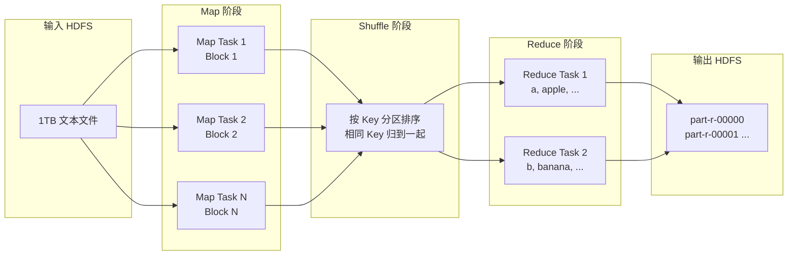

> **Hadoop 入门系列 · 第 4/10 篇**  
> 上一篇：[《HDFS 读写流程》](/2026/06/08/hadoop-series-03-hdfs-read-write/)  
> 下一篇预告：[《YARN——Hadoop 的操作系统》](/2026/06/10/hadoop-series-05-yarn/)

---

## 开头：1TB 文本里数单词，一台机器要跑 3 天

你有一份 **1TB 的网页爬取结果**，老板问：每个单词出现了多少次？

单机程序：

```
读 1TB → 统计 → 输出
```

按 100 MB/s 磁盘读速，光读完就要 **近 3 小时**，算上 CPU 统计，可能要 **跑一天**。

MapReduce 的思路：**把 1TB 切成 8000 份（每份 128MB Block），8000 台机器各算 2 分钟，最后汇总。**

总时间：**几分钟**。

这就是 **分而治之（Divide and Conquer）** —— Google 2004 年论文里的老古董，至今仍是理解分布式计算的必修课。

---

## 一、MapReduce 三阶段



| 阶段 | 做什么 | WordCount 例子 |
|------|--------|----------------|
| **Map** | 逐行处理，输出 (key, value) 对 | `"hello world"` → (hello,1), (world,1) |
| **Shuffle** | 按 key 分区、排序、传输 | 所有 (hello,1) 送到同一个 Reducer |
| **Reduce** | 汇总相同 key 的 value | (hello, [1,1,1]) → (hello, 3) |

**Shuffle 是幕后英雄** —— 占整个 Job 50%–80% 的时间，涉及磁盘排序、网络传输，优化 MapReduce 大多在优化 Shuffle。

---

## 二、WordCount 完整代码（Java）

### 2.1 Mapper

```java
import java.io.IOException;
import org.apache.hadoop.io.IntWritable;
import org.apache.hadoop.io.LongWritable;
import org.apache.hadoop.io.Text;
import org.apache.hadoop.mapreduce.Mapper;

/**
 * WordCount Mapper：每读一行，每个单词输出 (word, 1)
 */
public class WordCountMapper extends Mapper<LongWritable, Text, Text, IntWritable> {

    private final static IntWritable ONE = new IntWritable(1);
    private Text word = new Text();

    @Override
    protected void map(LongWritable key, Text value, Context context)
            throws IOException, InterruptedException {
        String line = value.toString();
        for (String w : line.split("\\s+")) {
            if (w.isEmpty()) continue;
            word.set(w);
            context.write(word, ONE);  // 输出 (word, 1)
        }
    }
}
```

### 2.2 Reducer

```java
import java.io.IOException;
import org.apache.hadoop.io.IntWritable;
import org.apache.hadoop.io.Text;
import org.apache.hadoop.mapreduce.Reducer;

/**
 * WordCount Reducer：相同单词的 1 全部加起来
 */
public class WordCountReducer extends Reducer<Text, IntWritable, Text, IntWritable> {

    private IntWritable result = new IntWritable();

    @Override
    protected void reduce(Text key, Iterable<IntWritable> values, Context context)
            throws IOException, InterruptedException {
        int sum = 0;
        for (IntWritable val : values) {
            sum += val.get();
        }
        result.set(sum);
        context.write(key, result);  // 输出 (word, total)
    }
}
```

### 2.3 Driver（主程序）

```java
import org.apache.hadoop.conf.Configuration;
import org.apache.hadoop.fs.Path;
import org.apache.hadoop.io.IntWritable;
import org.apache.hadoop.io.Text;
import org.apache.hadoop.mapreduce.Job;
import org.apache.hadoop.mapreduce.lib.input.FileInputFormat;
import org.apache.hadoop.mapreduce.lib.output.FileOutputFormat;

public class WordCount {

    public static void main(String[] args) throws Exception {
        if (args.length != 2) {
            System.err.println("Usage: WordCount <input> <output>");
            System.exit(-1);
        }

        Configuration conf = new Configuration();
        Job job = Job.getInstance(conf, "word count");
        job.setJarByClass(WordCount.class);

        job.setMapperClass(WordCountMapper.class);
        job.setReducerClass(WordCountReducer.class);

        job.setOutputKeyClass(Text.class);
        job.setOutputValueClass(IntWritable.class);

        FileInputFormat.addInputPath(job, new Path(args[0]));
        FileOutputFormat.setOutputPath(job, new Path(args[1]));

        System.exit(job.waitForCompletion(true) ? 0 : 1);
    }
}
```

---

## 三、命令行运行 WordCount

### 3.1 在 Docker Hadoop 容器中运行

```bash
docker exec -it hdfs bash

# 准备输入数据
cat > /tmp/words.txt << 'EOF'
hadoop mapreduce yarn
hadoop hdfs spark
mapreduce is old but important
spark is faster than mapreduce
EOF

hdfs dfs -mkdir -p /user/wordcount/input
hdfs dfs -put /tmp/words.txt /user/wordcount/input/
hdfs dfs -rm -r -f /user/wordcount/output

# 运行 Hadoop 自带的 WordCount 示例（镜像内置）
hadoop jar /usr/local/hadoop/share/hadoop/mapreduce/hadoop-mapreduce-examples-*.jar wordcount \
  /user/wordcount/input /user/wordcount/output

# 查看结果
hdfs dfs -cat /user/wordcount/output/part-r-00000
```

### 3.2 预期输出

```
hadoop  2
hdfs    1
important       1
is      2
mapreduce       2
old     1
spark   2
than    1
yarn    1
```

### 3.3 数据流回顾

```
输入: "hadoop mapreduce yarn"
  ↓ Map
(hadoop,1) (mapreduce,1) (yarn,1)
  ↓ Shuffle（按 key 分组）
hadoop → [1,1]
mapreduce → [1,1]
  ↓ Reduce
hadoop → 2
mapreduce → 2
```

---

## 四、MapReduce 的局限：为什么 Spark 会取代它

MapReduce 在 2006–2014 年是王者，但今天新项目很少直接写 MR 了。

| 局限 | 说明 | Spark 的改进 |
|------|------|--------------|
| **中间结果写磁盘** | 每个 Map/Reduce 结束都 spill 到 HDFS | Spark 尽量 **内存迭代**，快 10–100 倍 |
| **只支持 Map→Reduce 两阶段** | 复杂算法（迭代、图计算）要链式多个 Job | Spark 支持 **多阶段 DAG** |
| **延迟高** | 秒级启动 + 磁盘 I/O | Spark 毫秒级 Task 调度 |
| **编程模型死板** | 必须写成 Map + Reduce | Spark 提供 Java/Scala/Python/SQL 多种 API |
| **实时性差** | 纯批处理 | Spark Streaming / Flink 做流计算 |

**但 MapReduce 思想永不过时：**

- **分而治之** → Spark 的 Partition
- **Shuffle** → Spark 的 shuffle / join
- **数据本地性** → Spark 的 locality-aware scheduling

面试问「MapReduce 原理」仍然高频 —— 因为它是理解一切分布式计算的 **母版**。

---

## 本节小结

| 概念 | 要点 |
|------|------|
| **Map** | 拆分问题，输出 (K,V) |
| **Shuffle** | 按 K 分区归组，最耗时 |
| **Reduce** | 汇总同 K 的 V |
| **WordCount** | 最经典的入门示例 |
| **局限** | 磁盘 I/O 多、模型死板、延迟高 |
| **Spark** | 内存计算 + DAG，MR 的精神继承者 |

---

## 下篇预告

**第 5 篇：《YARN——Hadoop 的操作系统，让应用们和平共处》**

- ResourceManager / NodeManager / ApplicationMaster
- 一个 MR 任务如何被 YARN 调度
- FIFO / Capacity / Fair 三种调度器

---

## 思考题

> WordCount 的 Reducer 数量由什么决定？如果只有 1 个 Reducer，集群有 100 台机器，并行度利用了多少？

提示：`job.setNumReduceTasks(n)` 或配置文件 `mapreduce.job.reduces`。1 个 Reducer = 全局汇总瓶颈。

下一篇见 🐘
