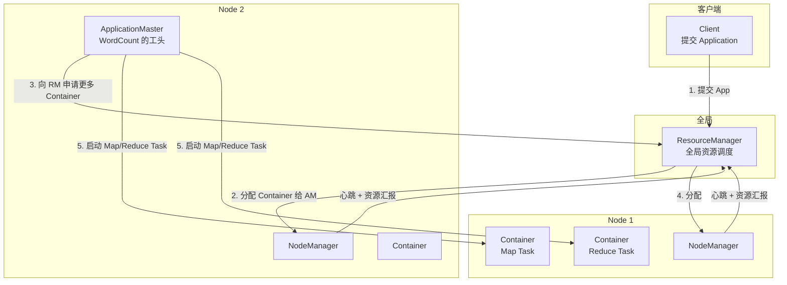
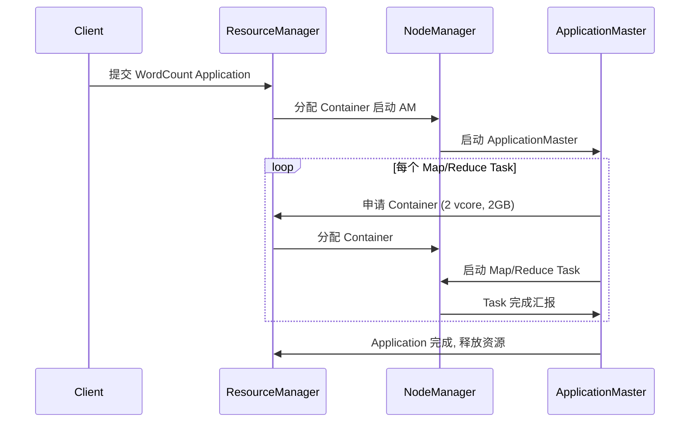

> **Hadoop 入门系列 · 第 5/10 篇**  
> 上一篇：[《MapReduce 思想》](/2026/06/09/hadoop-series-04-mapreduce/)  
> 下一篇预告：[《Hive——让你用 SQL 查 HDFS》](/2026/06/11/hadoop-series-06-hive/)

---

## 开头：一个集群只能跑一个任务？

Hadoop 1.x 时代，MapReduce 框架 **独占** 整个集群：

- JobTracker 既管资源又管任务
- 集群里同时只能跑 MapReduce
- Hive、Spark、HBase 想进来？没门

就像 **一台电脑只能运行一个程序** —— 32 核 CPU 跑 1 个 WordCount，剩下 31 核干瞪眼。

2013 年 Hadoop 2.0 引入 **YARN**，把「资源管理」和「计算框架」拆开。MapReduce 只是 YARN 上跑的一个应用，Spark、Hive、Flink 都可以来抢资源 —— 但 YARN 会公平分配，不会打架。

---

## 一、YARN 架构



| 组件 | 角色 | 类比 |
|------|------|------|
| **ResourceManager (RM)** | 全局资源仲裁 | 班主任：分配教室和座位 |
| **NodeManager (NM)** | 单节点资源管理 | 组长：汇报本组空位 |
| **ApplicationMaster (AM)** | 单个 App 的协调者 | 课代表：帮 WordCount 要资源、盯进度 |
| **Container** | CPU + 内存的逻辑隔离单元 | 一张课桌：2 核 4GB |

---

## 二、任务提交流程：WordCount 如何被 YARN 调度



**8 步白话版：**

1. 你执行 `hadoop jar wordcount.jar ...`
2. Client 向 RM 提交 Application
3. RM 在某个 NM 上启动 **ApplicationMaster**
4. AM 分析 InputSplit，计算需要多少 Map/Reduce Task
5. AM 向 RM **逐个申请 Container**
6. RM 根据调度策略分配 Container
7. AM 在 Container 里启动 Map/Reduce Task
8. 全部 Task 完成，AM 注销，释放资源

---

## 三、三种调度器对比

YARN 支持可插拔调度器，常用三种：

| 调度器 | 策略 | 适用场景 |
|--------|------|----------|
| **FIFO** | 先来先服务，一个 App 占满才轮到下一个 | 单用户测试环境 |
| **Capacity Scheduler** | 多队列，每队列保底容量 + 弹性借用 | **企业生产环境（默认）** |
| **Fair Scheduler** | 所有 App 公平分享资源，小任务不用等大任务 | 多租户、交互式查询 |

### Capacity Scheduler 示例

```xml
<!-- capacity-scheduler.xml 简化示例 -->
<property>
  <name>yarn.scheduler.capacity.root.queues</name>
  <value>production,dev</value>
</property>
<property>
  <name>yarn.scheduler.capacity.root.production.capacity</name>
  <value>70</value>   <!-- 生产队列保底 70% -->
</property>
<property>
  <name>yarn.scheduler.capacity.root.dev.capacity</name>
  <value>30</value>   <!-- 开发队列保底 30% -->
</property>
```

- **production 队列**：ETL 报表，占 70% 保底
- **dev 队列**：工程师测试 SQL，占 30%
- 生产队列空闲时，dev 可以 **借用** 多余资源

### 选型建议

```
单用户学习 / Docker 本地  → FIFO 够用
公司多部门共享集群       → Capacity Scheduler
多团队抢资源、要小任务快  → Fair Scheduler
```

---

## 四、实践：在 YARN Web UI 看调度过程

### 4.1 启动带 YARN 端口的容器

默认 Docker 镜像可能未映射 YARN 端口，需重新运行：

```bash
docker stop hdfs && docker rm hdfs

docker run -d --name hdfs \
  -p 50070:50070 \
  -p 9000:9000 \
  -p 8088:8088 \
  -p 8042:8042 \
  -p 19888:19888 \
  harisekhon/hadoop:2.7
```

### 4.2 提交 WordCount 任务

```bash
docker exec -it hdfs bash

hdfs dfs -mkdir -p /user/yarn-test/input
echo "yarn resource manager scheduler" | hdfs dfs -put - /user/yarn-test/input/test.txt
hdfs dfs -rm -r -f /user/yarn-test/output

hadoop jar /usr/local/hadoop/share/hadoop/mapreduce/hadoop-mapreduce-examples-*.jar wordcount \
  /user/yarn-test/input /user/yarn-test/output
```

### 4.3 观察 Web UI

打开 **ResourceManager UI**：

```text
http://localhost:8088/cluster
```

| 页面 | 看什么 |
|------|--------|
| **Cluster Metrics** | 总内存、总 vCore、Active Nodes |
| **Applications** | 刚提交的 WordCount 状态（RUNNING → FINISHED） |
| **Nodes** | 各 NodeManager 资源使用率 |

点击某个 Application 可看到：

- **Map Tasks** 数量与进度
- **Reduce Tasks** 数量与进度
- 每个 Task 运行在哪个 Container、哪台 Node

**Applications 页截图要点：**

- Application Type: MAPREDUCE
- State: FINISHED
- FinalStatus: SUCCEEDED
- Aggregate Resource Allocation: 用了多少 GB-seconds 内存

---

## 本节小结

| 概念 | 要点 |
|------|------|
| **YARN 解决的问题** | 集群资源被 MR 独占 → 多框架共享 |
| **RM** | 全局调度 |
| **NM** | 节点级管理 |
| **AM** | 单 App 工头 |
| **Container** | 资源隔离单元 |
| **Capacity Scheduler** | 企业生产默认，多队列保底 |
| **Web UI** | `8088/cluster` 看任务调度全过程 |

---

## 下篇预告

**第 6 篇：《Hive——让你用 SQL 查 HDFS》**

- Hive 如何把 SQL 翻译成 MapReduce
- 内部表 vs 外部表
- 分区与分桶

---

## 思考题

> 集群 100 核 CPU，Capacity Scheduler 给 dev 队列保底 20%。此时 production 队列有一个大 ETL 占满 80 核，dev 队列提交一个小 Hive 查询，能立刻拿到 20 核吗？

答案：能。Capacity 保证 **队列最小容量**，dev 至少应有 20 核可用（具体还取决于 NM 实际空闲情况）。

下一篇见 🐘
