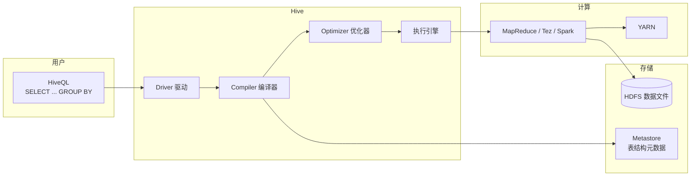

> **Hadoop 入门系列 · 第 6/10 篇**  
> 上一篇：[《YARN 资源调度》](/2026/06/10/hadoop-series-05-yarn/)  
> 下一篇预告：[《Kafka + Hadoop——让数据流起来》](/2026/06/12/hadoop-series-07-kafka-hadoop/)

---

## 开头：数据分析师不想写 Java MapReduce

业务同学只想写：

```sql
SELECT city, COUNT(*) AS pv
FROM page_views
WHERE dt = '2026-06-11'
GROUP BY city;
```

你让他写 MapReduce？他第二天就离职了。

**Hive** 的定位：**把 SQL 翻译成 MapReduce / Tez / Spark 任务，底层数据仍在 HDFS。**

Hive 不是数据库，是 **HDFS 上的数据仓库工具** —— 没有实时插入、没有行级更新，有的是 **海量数据的离线 SQL 分析**。

---

## 一、Hive 架构：SQL 如何变成 MapReduce



**一条 SQL 的执行路径：**

1. **Parser** 解析 SQL 语法
2. **Semantic Analyzer** 查 Metastore，获取表结构、分区、HDFS 路径
3. **Logical Plan** 生成算子树（Filter → GroupBy → Select）
4. **Physical Plan** 翻译成 MapReduce Job（或 Tez DAG）
5. **提交 YARN** 执行，结果写回 HDFS 或返回客户端

---

## 二、Metastore：表结构存在哪儿？

Hive 的 **Metastore** 存储所有表的元数据：

| 存什么 | 例子 |
|--------|------|
| 库名、表名 | `analytics.page_views` |
| 列名、类型 | `user_id STRING, city STRING, dt STRING` |
| HDFS 位置 | `hdfs://namenode:9000/user/hive/warehouse/page_views` |
| 分区信息 | `dt=2026-06-11` → 对应子目录 |
| 存储格式 | TextFile / ORC / Parquet |

Metastore 本身通常存在 **MySQL / PostgreSQL** 里（生产环境），不是 HDFS。

**关键理解：Hive 表 = Metastore 里的元数据 + HDFS 上的文件。** 删 Metastore 记录不等于删 HDFS 文件（外部表尤其如此）。

---

## 三、内部表 vs 外部表

| 类型 | 建表语句 | 删表时发生什么 | 适用场景 |
|------|----------|----------------|----------|
| **内部表（Managed）** | `CREATE TABLE t ...` | **元数据 + HDFS 数据都删** | Hive 完全管理的中间表 |
| **外部表（External）** | `CREATE EXTERNAL TABLE t ... LOCATION 'hdfs://...'` | **只删元数据，HDFS 文件保留** | 原始日志、共享数据集 |

```sql
-- 内部表：Hive 拥有数据生命周期
CREATE TABLE managed_log (
  user_id STRING,
  page STRING
) ROW FORMAT DELIMITED FIELDS TERMINATED BY ',';

-- 外部表：HDFS 文件由其他系统写入，Hive 只读
CREATE EXTERNAL TABLE external_log (
  user_id STRING,
  page STRING
)
ROW FORMAT DELIMITED FIELDS TERMINATED BY ','
LOCATION '/data/raw/logs/';
```

**经验法则：**

- 原始数据、多个系统共享 → **外部表**
- ETL 中间结果、临时表 → **内部表**

---

## 四、分区与分桶：如何让查询快 10 倍

### 4.1 分区（Partition）—— 剪枝

按日期分区，查询带 `WHERE dt='2026-06-11'` 时 **只扫描一个子目录**：

```
/user/hive/warehouse/page_views/
  dt=2026-06-10/  part-00000, part-00001
  dt=2026-06-11/  part-00000        ← 只读这个
  dt=2026-06-12/  part-00000
```

```sql
CREATE TABLE page_views (
  user_id STRING,
  city STRING,
  url STRING
)
PARTITIONED BY (dt STRING)
STORED AS ORC;

-- 插入指定分区
INSERT INTO page_views PARTITION (dt='2026-06-11')
SELECT user_id, city, url FROM staging;
```

**没有分区**：1 年 365 天数据全扫。  
**有分区**：只扫 1 天 → 理论加速 **365 倍**（实际受文件大小影响）。

### 4.2 分桶（Bucket）—— 均匀 + 高效 Join

按 `user_id` 哈希分 32 桶，相同 user_id 一定在同一桶：

```sql
CREATE TABLE users (
  user_id STRING,
  name STRING
)
CLUSTERED BY (user_id) INTO 32 BUCKETS
STORED AS ORC;
```

**好处：**

- 采样：`TABLESAMPLE(BUCKET 1 OUT OF 32)` 快速抽样
- Join 优化：两个表按相同 key 分桶，**桶对桶 Join**，避免全量 Shuffle

---

## 五、动手：创建表、导入数据、跑 SQL

以下在 **Hive CLI** 或 **Beeline** 中执行（需 Hive 环境；Docker 完整 Hive 栈可用 `bde2020/hive` 等镜像，此处给出标准 SQL 流程）：

### 5.1 建表 + 导入

```sql
-- 创建分区外部表
CREATE EXTERNAL TABLE IF NOT EXISTS page_views (
  user_id  STRING,
  city     STRING,
  url      STRING,
  ts       BIGINT
)
PARTITIONED BY (dt STRING)
ROW FORMAT DELIMITED FIELDS TERMINATED BY '\t'
LOCATION '/user/hive/page_views';

-- 加载本地数据到 HDFS 并注册分区
-- （命令行）
-- hdfs dfs -put sample.tsv /user/hive/page_views/dt=2026-06-11/

ALTER TABLE page_views ADD PARTITION (dt='2026-06-11');
```

**sample.tsv 示例：**

```
u001    北京    /home    1718073600
u002    上海    /product 1718073601
u001    北京    /cart    1718073602
u003    广州    /home    1718073603
u002    上海    /home    1718073604
```

### 5.2 跑 SQL

```sql
-- 各城市 PV
SELECT city, COUNT(*) AS pv
FROM page_views
WHERE dt = '2026-06-11'
GROUP BY city
ORDER BY pv DESC;
```

预期结果：

```
北京    2
上海    2
广州    1
```

### 5.3 查看执行计划

```sql
EXPLAIN SELECT city, COUNT(*) FROM page_views WHERE dt='2026-06-11' GROUP BY city;
```

你会看到 Hive 生成的 **MapReduce 算子**：Map 读 ORC/Text → Combine Partial Aggregate → Reduce 最终汇总。

---

## 本节小结

| 概念 | 要点 |
|------|------|
| **Hive 定位** | SQL → MR/Spark，数据在 HDFS |
| **Metastore** | 表结构元数据，通常在 MySQL |
| **内部表** | 删表删数据 |
| **外部表** | 删表保留 HDFS 文件 |
| **分区** | 目录剪枝，按 dt 过滤极快 |
| **分桶** | 哈希分文件，优化 Join/采样 |

---

## 下篇预告

**第 7 篇：《Kafka + Hadoop——让数据流起来，打通任督二脉》**

- Kafka Topic / Partition / Offset
- Flume 日志摄入 HDFS
- Nginx → Kafka → HDFS → Hive 全链路

---

## 思考题

> 一张 10 亿行的表按 `dt` 分区，查询 `WHERE dt='2026-01-01' AND user_id='u001'` 和 `WHERE user_id='u001'` 哪个快？如何进一步优化第二种查询？

提示：第二种会扫所有分区。可考虑 **分桶（按 user_id）** 或 **ORC 列式存储 + 谓词下推**。

下一篇见 🐘
