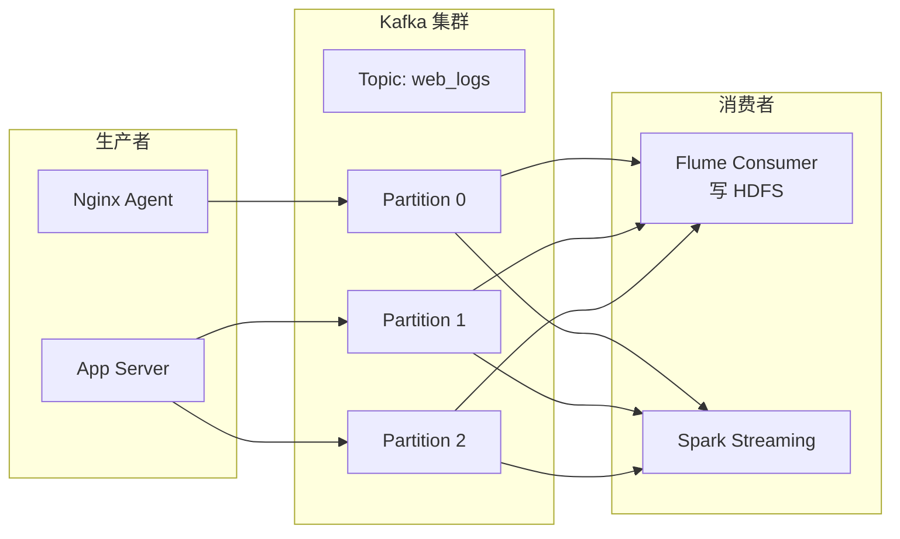
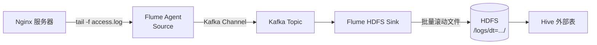
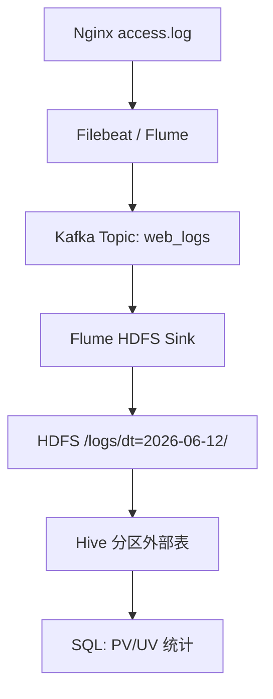

> **Hadoop 入门系列 · 第 7/10 篇**  
> 上一篇：[《Hive SQL 入口》](/2026/06/11/hadoop-series-06-hive/)  
> 下一篇预告：[《HBase——HDFS 上的大表哥》](/2026/06/13/hadoop-series-08-hbase/)

---

## 开头：日志每秒 10 万条，HDFS 怎么接？

网站访问日志像开闸的水 —— Nginx 每秒写入几万行。HDFS 擅长 **大批量写入**，不擅长 **逐条实时接流**。

中间缺一层 **数据总线**：

```
Nginx 日志 → ??? → HDFS → Hive 分析
```

这个 `???` 就是 **Kafka**（配合 Flume / Logstash 等采集工具）。

Kafka 缓冲洪峰，HDFS 批量落盘，Hive 离线查 —— **实时采集 + 离线分析** 的经典组合。

---

## 一、Kafka 核心概念



| 概念 | 说明 | 类比 |
|------|------|------|
| **Topic** | 消息分类 | 微信公众号的一个号 |
| **Partition** | Topic 的分片，并行单位 | 号里的多篇文章，可并行读 |
| **Offset** | 分区内消息序号 | 看到第几篇文章 |
| **Producer** | 发消息 | 作者发稿 |
| **Consumer** | 读消息 | 读者订阅 |
| **Consumer Group** | 组内消费者分摊 Partition | 一个群多人分着读 |

**为什么 Kafka 适合做数据总线？**

1. **高吞吐**：单机百万条/秒
2. **持久化**：消息落盘，Consumer 挂了可重读
3. **解耦**：Producer 不用知道谁在消费
4. **可回溯**：按 Offset 重新消费历史数据
5. **水平扩展**：加 Partition 加并行度

---

## 二、Flume / Kafka 把日志实时摄入 HDFS

### 2.1 架构



### 2.2 Flume 配置示例（Kafka → HDFS）

```properties
# flume-hdfs.conf
agent.sources = kafkaSource
agent.channels = memChannel
agent.sinks = hdfsSink

# Kafka Source
agent.sources.kafkaSource.type = org.apache.flume.source.kafka.KafkaSource
agent.sources.kafkaSource.kafka.bootstrap.servers = kafka1:9092
agent.sources.kafkaSource.kafka.topics = web_logs
agent.sources.kafkaSource.batchSize = 1000

# Memory Channel
agent.channels.memChannel.type = memory
agent.channels.memChannel.capacity = 10000

# HDFS Sink（按时间滚动）
agent.sinks.hdfsSink.type = hdfs
agent.sinks.hdfsSink.hdfs.path = hdfs://namenode:9000/logs/%Y-%m-%d
agent.sinks.hdfsSink.hdfs.filePrefix = access-
agent.sinks.hdfsSink.hdfs.rollInterval = 3600
agent.sinks.hdfsSink.hdfs.rollSize = 134217728
agent.sinks.hdfsSink.hdfs.fileType = DataStream

agent.sources.kafkaSource.channels = memChannel
agent.sinks.hdfsSink.channel = memChannel
```

**关键参数：**

- `rollInterval = 3600`：每小时一个 HDFS 文件
- `rollSize = 128MB`：或达到 128MB 就滚动 —— 对齐 HDFS Block 大小

---

## 三、案例：Nginx → Kafka → HDFS → Hive

### 3.1 全链路



### 3.2 Nginx 日志格式

```
192.168.1.1 - - [12/Jun/2026:10:00:01 +0800] "GET /index.html HTTP/1.1" 200 1024 "-" "Mozilla/5.0"
```

### 3.3 Hive 外部表

```sql
CREATE EXTERNAL TABLE nginx_logs (
  ip        STRING,
  ts        STRING,
  method    STRING,
  url       STRING,
  status    INT,
  bytes     BIGINT
)
PARTITIONED BY (dt STRING)
ROW FORMAT DELIMITED FIELDS TERMINATED BY ' '
LOCATION '/logs/';

ALTER TABLE nginx_logs ADD PARTITION (dt='2026-06-12');
```

### 3.4 分析 SQL

```sql
-- 当日 PV
SELECT COUNT(*) AS pv FROM nginx_logs WHERE dt = '2026-06-12';

-- 各 URL PV Top 10
SELECT url, COUNT(*) AS pv
FROM nginx_logs
WHERE dt = '2026-06-12'
GROUP BY url
ORDER BY pv DESC
LIMIT 10;
```

---

## 四、Sqoop vs Flume：两种数据入口

| 工具 | 数据源 | 目标 | 模式 | 典型场景 |
|------|--------|------|------|----------|
| **Sqoop** | 关系型 DB（MySQL/Oracle） | HDFS / Hive | **批量导入导出** | 每天把 MySQL 订单表同步到 Hive |
| **Flume** | 日志文件 / Kafka / HTTP | HDFS / HBase | **流式采集** | Nginx 日志实时写入 HDFS |

```bash
# Sqoop 示例：MySQL → HDFS
sqoop import \
  --connect jdbc:mysql://dbhost:3306/orders \
  --username hive \
  --password xxx \
  --table orders \
  --target-dir /user/hive/orders \
  --split-by order_id \
  -m 4
```

**选型口诀：**

```
数据库表 → Sqoop（批量）
日志/事件流 → Kafka + Flume（流式）
```

---

## 本节小结

| 概念 | 要点 |
|------|------|
| **Kafka** | 高吞吐消息总线，解耦生产与消费 |
| **Topic/Partition/Offset** | 分类 / 并行 / 消费进度 |
| **Flume** | 采集日志 → Kafka 或直写 HDFS |
| **全链路** | Nginx → Kafka → HDFS → Hive |
| **Sqoop** | 关系 DB 批量入 HDFS |
| **Flume** | 日志流式入 HDFS |

---

## 下篇预告

**第 8 篇：《HBase——HDFS 上的「大表哥」，支持随机读写》**

- RowKey / Column Family
- HMaster + RegionServer
- RowKey 设计原则

---

## 思考题

> Kafka Topic 有 3 个 Partition，Consumer Group 有 2 个 Consumer，怎么分配？如果 Group 有 4 个 Consumer 呢？

答案：2 Consumer 时，1 个 Consumer 读 2 个 Partition，另 1 个读 1 个。4 Consumer 时，3 个 Partition 各 1 个 Consumer  busy，1 个 Consumer 空闲 —— **Partition 数 ≥ Consumer 数** 才能充分利用。

下一篇见 🐘
