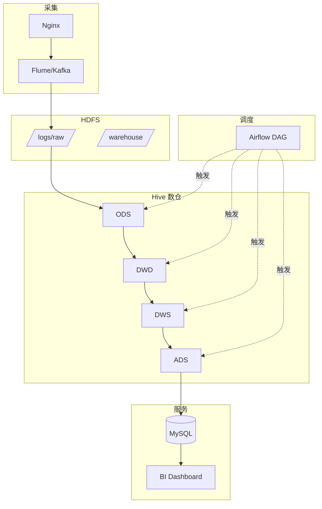

> **Hadoop 入门系列 · 第 9/10 篇**  
> 上一篇：[《HBase 随机读写》](/2026/06/13/hadoop-series-08-hbase/)  
> 下一篇预告：[《Hadoop 过时了吗？》](/2026/06/15/hadoop-series-10-future/)

---

## 开头：老板要「昨天网站多少 PV、多少 UV」

产品经理每天上午 9 点要一份报表：

- 昨日 **PV**（页面浏览量）
- 昨日 **UV**（独立访客数）
- Top 10 热门页面

原始数据是 Nginx 日志，格式乱七八糟，IP 有爬虫，URL 带参数。

你需要一套 **离线数仓**，把脏 raw log 一层层洗干净，最后变成 BI 仪表盘上的一行数字。

---

## 一、数据流向全景


```
日志文件 → HDFS → Hive(ODS) → Hive(DWD) → Spark SQL(DWS) → MySQL(ADS) → 可视化
```

---

## 二、分层解释：ODS → DWD → DWS → ADS

| 层级 | 全称 | 做什么 | 表命名示例 |
|------|------|--------|------------|
| **ODS** | Operational Data Store | **贴源**，原样或轻度清洗 | `ods.nginx_log_raw` |
| **DWD** | Data Warehouse Detail | **明细**，去脏、统一字段、维度关联 | `dwd.page_view_detail` |
| **DWS** | Data Warehouse Summary | **汇总**，按主题预聚合 | `dws.page_pv_uv_daily` |
| **ADS** | Application Data Store | **应用**，面向报表的最终表 | `ads.daily_report` |

**为什么要分层？**

- **ODS**：保留原始数据，出问题可回溯
- **DWD**：一次清洗，多处复用
- **DWS**：避免 BI 直接扫亿级明细，预聚合加速
- **ADS**：对接 MySQL/BI，字段语义业务化

---

## 三、场景实战：网站 PV / UV 统计

### 3.1 原始日志样例

```
192.168.1.100 - u001 [14/Jun/2026:10:01:23 +0800] "GET /product?id=123 HTTP/1.1" 200 2048 "https://example.com" "Mozilla/5.0"
192.168.1.101 - u002 [14/Jun/2026:10:01:24 +0800] "GET /home HTTP/1.1" 200 512 "-" "Mozilla/5.0"
192.168.1.100 - u001 [14/Jun/2026:10:02:01 +0800] "GET /cart HTTP/1.1" 200 768 "-" "Bot/1.0"
```

### 3.2 ODS 层：贴源入库

```sql
CREATE EXTERNAL TABLE ods.nginx_log_raw (
  raw_line STRING
)
PARTITIONED BY (dt STRING)
ROW FORMAT DELIMITED FIELDS TERMINATED BY '\n'
LOCATION '/warehouse/ods/nginx_log_raw/';

-- 加载当天分区
ALTER TABLE ods.nginx_log_raw ADD PARTITION (dt='2026-06-14');
```

### 3.3 DWD 层：解析 + 清洗

```sql
CREATE TABLE dwd.page_view_detail (
  ip          STRING,
  user_id     STRING,
  event_time  TIMESTAMP,
  url         STRING,
  status      INT,
  is_bot      BOOLEAN
)
PARTITIONED BY (dt STRING)
STORED AS ORC;

INSERT OVERWRITE TABLE dwd.page_view_detail PARTITION (dt='2026-06-14')
SELECT
  regexp_extract(raw_line, '^([\\d.]+)', 1)                          AS ip,
  regexp_extract(raw_line, '- ([^ ]+) \\[', 1)                       AS user_id,
  from_unixtime(unix_timestamp(
    regexp_extract(raw_line, '\\[([^\\]]+)\\]', 1),
    'dd/MMM/yyyy:HH:mm:ss Z'))                                        AS event_time,
  regexp_extract(raw_line, '"GET ([^ ]+)', 1)                         AS url,
  CAST(regexp_extract(raw_line, '" \\d+ (\\d+)', 1) AS INT)          AS status,
  raw_line LIKE '%Bot%'                                              AS is_bot
FROM ods.nginx_log_raw
WHERE dt = '2026-06-14'
  AND raw_line LIKE '%GET%';
```

**清洗规则：**

- 解析 IP、用户、时间、URL
- 标记 Bot 流量（`is_bot = true`）
- 过滤非 GET 请求（可选）

### 3.4 DWS 层：按日汇总 PV/UV

```sql
CREATE TABLE dws.page_pv_uv_daily (
  url         STRING,
  pv          BIGINT,
  uv          BIGINT
)
PARTITIONED BY (dt STRING)
STORED AS ORC;

INSERT OVERWRITE TABLE dws.page_pv_uv_daily PARTITION (dt='2026-06-14')
SELECT
  url,
  COUNT(*)                    AS pv,
  COUNT(DISTINCT user_id)     AS uv
FROM dwd.page_view_detail
WHERE dt = '2026-06-14'
  AND is_bot = false
  AND status = 200
GROUP BY url;
```

**全站 PV/UV：**

```sql
SELECT
  dt,
  SUM(pv) AS total_pv,
  COUNT(DISTINCT user_id) AS total_uv  -- 需从 DWD 层算全站 UV
FROM dws.page_pv_uv_daily
WHERE dt = '2026-06-14'
GROUP BY dt;
```

更精确的全站 UV 应在 DWD 层：

```sql
SELECT COUNT(DISTINCT user_id) AS total_uv
FROM dwd.page_view_detail
WHERE dt = '2026-06-14' AND is_bot = false AND status = 200;
```

### 3.5 ADS 层：导出到 MySQL 供 BI 使用

```sql
CREATE TABLE ads.daily_site_report (
  dt          STRING,
  total_pv    BIGINT,
  total_uv    BIGINT,
  top_url     STRING,
  top_url_pv  BIGINT
);

INSERT OVERWRITE TABLE ads.daily_site_report
SELECT
  '2026-06-14' AS dt,
  COUNT(*) AS total_pv,
  COUNT(DISTINCT user_id) AS total_uv,
  MAX(url) AS top_url,  -- 简化示例，实际用窗口函数
  MAX(pv) AS top_url_pv
FROM (
  SELECT url, user_id, COUNT(*) OVER() AS dummy
  FROM dwd.page_view_detail
  WHERE dt = '2026-06-14' AND is_bot = false
) t;
```

```bash
# Sqoop 导出到 MySQL
sqoop export \
  --connect jdbc:mysql://bi-db:3306/report \
  --username bi \
  --password xxx \
  --table daily_site_report \
  --export-dir /warehouse/ads/daily_site_report/dt=2026-06-14 \
  --input-fields-terminated-by '\001'
```

---

## 四、调度：Cron vs Airflow

### 4.1 Cron（简单场景）

```bash
# 每天凌晨 2 点跑 T+1 报表
0 2 * * * /opt/scripts/run_daily_etl.sh >> /var/log/etl.log 2>&1
```

`run_daily_etl.sh`：

```bash
#!/bin/bash
DT=$(date -d 'yesterday' +%Y-%m-%d)

hive -e "ALTER TABLE ods.nginx_log_raw ADD IF NOT EXISTS PARTITION (dt='${DT}')"
hive -f /opt/sql/dwd_page_view.sql --hivevar dt=${DT}
hive -f /opt/sql/dws_pv_uv.sql --hivevar dt=${DT}
sqoop export ... --export-dir /warehouse/ads/.../dt=${DT}
```

### 4.2 Airflow（生产推荐）

```python
from airflow import DAG
from airflow.operators.bash import BashOperator
from datetime import datetime, timedelta

default_args = {
    'owner': 'data-team',
    'retries': 2,
    'retry_delay': timedelta(minutes=5),
}

with DAG(
    'daily_pv_uv_report',
    default_args=default_args,
    schedule_interval='0 2 * * *',
    start_date=datetime(2026, 6, 1),
    catchup=False,
) as dag:

    ods = BashOperator(
        task_id='load_ods',
        bash_command='hive -f /opt/sql/ods_load.sql --hivevar dt={{ ds }}',
    )

    dwd = BashOperator(
        task_id='build_dwd',
        bash_command='hive -f /opt/sql/dwd_page_view.sql --hivevar dt={{ ds }}',
    )

    dws = BashOperator(
        task_id='build_dws',
        bash_command='hive -f /opt/sql/dws_pv_uv.sql --hivevar dt={{ ds }}',
    )

    export_mysql = BashOperator(
        task_id='export_to_mysql',
        bash_command='/opt/scripts/sqoop_export.sh {{ ds }}',
    )

    ods >> dwd >> dws >> export_mysql
```

**Airflow 优势：**

- DAG 可视化依赖
- 失败重试 + 告警
- 补跑历史分区（backfill）

---

## 五、完整架构图



---

## 本节小结

| 层级 | 职责 |
|------|------|
| **ODS** | 贴源，保留原始 |
| **DWD** | 清洗明细 |
| **DWS** | 主题汇总 |
| **ADS** | 报表应用 |
| **调度** | Cron 简单 / Airflow 生产 |
| **出口** | Sqoop → MySQL → BI |

---

## 下篇预告

**第 10 篇（系列收官）：《Hadoop 过时了吗？——从大数据编年史看下一代架构》**

- Hadoop 还用在哪儿
- Spark / Flink / 云原生
- Lambda → Kappa → 湖仓一体
- 学习路线回顾

---

## 思考题

> DWS 层已经按 URL 汇总了 PV，BI 还要查「各城市 PV」—— 应该回 DWD 层重算，还是在 DWS 加一张新表？为什么？

提示：DWD 有 city 维度（需关联 IP 地域库），DWS 按 URL 汇总丢失了 city —— 应新建 `dws.page_pv_by_city_daily`，不要硬从 URL 汇总表反推。

下一篇见 🐘
