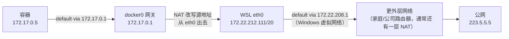

> **Linux 板块 · 第 2 篇**  
> 上一篇：[《nsenter 前置知识》](/Linux/basics/linux-01-nsenter-prerequisites)  
> 下一篇：[《tcpdump 抓包》](/Linux/basics/linux-03-tcpdump)（本文之后的排障与验证，都要靠它把包拍给你看）

---

## 开头：一条 5 毫秒的 ping，路上每块牌子都读不懂

容器里跑一条最普通的 `ping 223.5.5.5`（ping：发个小包过去，看对方在不在、多久回来；`223.5.5.5` 是阿里公共 DNS，公网上一台服务器）——5 毫秒多就有回音，通了。这条输出第 12 球原样跑给你看。可这条小小的 ping 要出小区、过一扇门、被改一次门牌、再穿过一层内网才到公网；回头一看路上的配置，全是没认过的牌子：

```text
Subnet=172.17.0.0/16 Gateway=172.17.0.1
```

容器 IP 是 `172.17.0.5`。很多人卡在「地址池」「`/16`」「网关」这几个词上，索性整段跳过——结果读 [Docker 第 11 篇](/云原生/docker/docker-15-network) 的 bridge、veth 时步步踩坑。

根因一句话：**不是 Docker 太难，是这条路上「门牌、小区、大门」几块牌子没认过——IP 常识缺了一小块**。本篇不先背概念：全程跟着这同一条 ping 的旅程滚 **13 球**，**每球只解开一块牌子、只回答一个问题**。读完你能用人话解释 `Subnet` / `Gateway` / 容器 IP 的关系，说清 `/16` 这种写法的含义，并回答两个方向的访问问题——为什么外人不能直接访问容器 IP，容器却能上网。

| 球 | 这一球解开的 | 读完能回答的 |
|----|--------------|--------------|
| **1** | 门牌：IP 挂在网卡上 | `ip addr` 的 `inet` 字段怎么读 |
| **2** | 回环口：127.0.0.1 只在本机内转 | 为什么监听 127.0.0.1 的服务外面连不上 |
| **3** | `scope` 一栏：host / link / global | 同一条输出里 scope 各档什么意思 |
| **4** | 出身：172 是私有号（RFC 1918） | 外网为什么摸不到容器 IP |
| **5** | 套娃：WSL 也在别人的内网里 | 容器、WSL、Windows 谁套着谁 |
| **6** | `/n`：前 n 位相同 = 同小区 | `172.17.0.0/16` 怎么读、多大 |
| **7** | 二进制位：高位钉死、低位可变 | `/20` 为什么是从 208 到 223 |
| **8** | 前缀套前缀 | `172.17.0.0/16` 为何落在 `172.16.0.0/12` 里 |
| **9** | 网络地址与广播地址 | 一片网段里哪两个号不发给设备 |
| **10** | 地址池：网段切给容器领号 | 一个 /16 能切多少个 /24 |
| **11** | 网关：`default via` 指谁 | 出小区的包先交给谁（实测 ping 网关） |
| **12** | NAT 嵌套链 | 私有号的包凭什么能到公网 |
| **13** | 对账：三行 Docker 输出 | Subnet / Gateway / 容器 IP 怎么连成一条路 |

> **实验环境**：WSL2（Windows 里跑的 Linux 子系统）Ubuntu-22.04，内装原生 Docker Engine **29.1.3**（非 Docker Desktop）；下文 `docker0`、路由、容器内输出均来自该环境。你的机器上具体号码几乎必然不同（比如容器是 `.2` 还是 `.5`），**网段结构一致即可对照**。

---

## 第 1 球：解开「门牌」——IP 是挂在网卡上的号

ping 要出发，包上得先写两个号：**源 IP**（我的门牌）和**目的 IP**（对方的门牌），网络才知道怎么投递。第一球先认识门牌本身。

**网卡**（network interface）第一次出现，先给个着落：机器上负责收发网络包的「插口」，有物理的也有软件模拟出来的，每张网卡有自己的名字（`eth0`、`docker0` 这种）。**IPv4 地址就是网络门牌号：四段 0~255 的数字，如 `172.17.0.5`；而且它属于某张网卡，不属于整机**——一台机器可以有多张网卡、各领各的号，同一张网卡甚至可以挂多个 IP。

本机看一眼 Docker 装好后就自动出现的那张虚拟网卡：

```bash
$ ip -4 addr show docker0
6: docker0: <BROADCAST,MULTICAST,UP,LOWER_UP> mtu 1500 qdisc noqueue state UP group default
    inet 172.17.0.1/16 brd 172.17.255.255 scope global docker0
       valid_lft forever preferred_lft forever
```

这一球只认 `inet` 那一行：

| 片段 | 含义 |
|------|------|
| `docker0` | 网卡名。Docker 装好后自带的虚拟网卡，是所有容器的「总机」 |
| `inet 172.17.0.1/16` | 这张网卡的 IPv4 门牌是 `172.17.0.1`；`/16` 第 6 球讲 |
| `mtu` / `qdisc` / `state` | 单帧上限、排队规则、网卡状态——本文用不到，先跳过 |

同一行里的 `brd`（广播地址）和 `scope`，分别是第 9 球和第 3 球的菜，先混个脸熟。

---

## 第 2 球：解开「回环口」——127.0.0.1 为什么外面连不上

机器上还有一块「每台机器都有」的**环回口** `lo`：

```bash
$ ip -4 addr show lo
1: lo: <LOOPBACK,UP,LOWER_UP> mtu 65536 qdisc noqueue state UNKNOWN group default qlen 1000
    inet 127.0.0.1/8 scope host lo
       valid_lft forever preferred_lft forever
```

`lo` 的 `127.0.0.1` 就是常说的 localhost：发给它的包**不出网卡、只在本机内部转**。你以后在服务器上看到「服务监听 127.0.0.1 所以外部连不上」，根子就在这——门牌是「本机内部专用」的，包根本不会往外面的网卡走。

（输出里那栏 `scope host` 的正式解读，是下一球的事。）

第 1、2 球认到的网卡，钉成一张图（这台 WSL 机器上同时存在它们）：

```text
一台 Linux 机器（本机 WSL）
├── docker0 ─ inet 172.17.0.1/16   ← Docker 自带虚拟网卡，容器「总机」
├── lo     ─ inet 127.0.0.1/8     ← 环回口：只在本机内部转
└── eth0   ─ ？                    ← 机器真正的「对外」口，第 5 球揭开
```

---

## 第 3 球：解开「scope」——ip addr 输出里的「活动范围」栏

前两球的输出里都有一栏 `scope`：docker0 是 `scope global`，lo 是 `scope host`。它说的是**这个门牌在多大的范围内有效**：

| scope 值 | 意思 | 本机例子 |
|----------|------|----------|
| `host` | 只在本机内部有效，不出网卡 | `127.0.0.1/8 scope host lo`（第 2 球） |
| `link` | 只在这条链路（本网段）上有效 | IPv6 的 `fe80::` 链路本地号常见；本文的 IPv4 输出里没出现 |
| `global` | 全局有效，可以和本机之外的设备通信 | `172.17.0.1/16 scope global docker0`（第 1 球） |

一句话：**docker0 的 172.17.0.1 是真门牌（global），lo 的 127.0.0.1 是本机内部号（host）**——第 2 球那个「监听 127.0.0.1 连不上」的现象，在 scope 这栏有了正式的名字。后面第 11 球的路由表里还会冒出一个 `scope link`，那是路由的属性「目的地就在本链路」，和地址的 scope 是亲戚不是同一个字段，到时候再对。

---

## 第 4 球：解开「号码出身」——172 是私有号，出门要靠 NAT

第 1 球门牌 `172.17.0.1`、开头容器的 `172.17.0.5`，都是 172 开头。为什么内网世界集体用这几个开头？因为**互联网上真正能全球路由的公网地址在 2026 年的今天是稀缺资源**；家里、公司、云内网、Docker 默认用的都是**私有地址**（RFC 1918 划定的保留段，RFC 是互联网标准文档的编号），共三类：

| 私有网段 | 大小 | 常见场景 |
|----------|------|----------|
| `10.0.0.0/8` | 超大 | 大企业内网、部分 K8s/云 VPC |
| `172.16.0.0/12`（含 `172.17.x.x`） | 大 | **Docker 默认 bridge 常用** |
| `192.168.0.0/16` | 中 | 家庭路由器、办公室 LAN |

为什么这么设计：IPv4 只有约 43 亿个号，全球设备远超这个数。办法是内网随便用私有号，**出门时由网关做 NAT**（网络地址转换）——把包的源地址改写成网关自己的出口地址，回来再把数据还给你；于是一整个内网可以共享少量甚至一个公网号。

于是「和 Docker 的关系」能说清一半：容器拿到的 `172.17.0.5` 是**引擎内部的内网号**，外面的公网、甚至你办公室另一台电脑，通常**不能直接**用这个号访问容器——所以才需要 `-p` 端口映射「开一扇门」。你 ping 的 `223.5.5.5` 是公网号，容器手里的 `172.17.0.5` 是私有号，两个世界怎么通？靠 NAT，第 12 球实测。私有号这边「内网套内网」到底长什么样，下一球先看。

---

## 第 5 球：解开「套娃」——你的 WSL 也活在别人的内网里

第 2 球图里留的问号：`eth0`（机器真正的「对外」口）领的是什么号？看本机：

```bash
$ ip -4 addr show eth0
2: eth0: <BROADCAST,MULTICAST,UP,LOWER_UP> mtu 1500 qdisc mq state UP group default qlen 1000
    inet 172.22.212.111/20 brd 172.22.223.255 scope global eth0
       valid_lft forever preferred_lft forever
```

`172.22.212.111`——又是 172 开头，和容器的 `172.17.0.5` 同族（都在 `172.16.0.0/12` 这一段里，第 8 球用前缀验证）。这不是巧合，**私有网段不是 Docker 的发明，你此刻就活在里面**。把「谁套在谁里面」钉一下：

```text
公网
└── Windows 宿主（在家庭/公司路由器的内网里）
    └── WSL 的 eth0：172.22.212.111（私有号，由 Windows 宿主分配）
        └── Docker 容器：172.17.0.5（私有号，再套一层内网）
```

也就是说：**WSL 是 Windows「内网」里的一台机器，Docker 容器又是 WSL 内网里的机器**，一层套一层。第 4 球那半句现在补全了：容器这个内网号的外面，至少还套着两层内网；包要一层层递出去，每层都有自己的门——门的事第 11 球讲，先把「小区边界」认清楚，第 6~8 球。

---

## 第 6 球：解开「/n」——前 n 位相同才算同小区

那条 ping 的目的地 `223.5.5.5` 和容器 `172.17.0.5` 不同族，几乎肯定不在同一片地盘。可**「同一片地盘」到底怎么判定**？这就轮到 `inet` 行尾那个 `/16` 了。

把 IP 想成「小区 + 门牌」：

- **网段（subnet）**：哪一片小区（号码范围）
- **具体 IP**：小区里的某一户

家里路由器最常见的网段是 `192.168.1.0/24`：**前三段固定是 `192.168.1`，只有最后一段从 0 变到 255**——共 256 个号的一小片小区。你家手机、电脑、电视都从这里领号。

IP 地址本质是 32 个二进制位，四段数字只是方便人读（每段 8 位）。写成 `网段/n`（CIDR 记法，先当「斜线记法」这个别名记着）意思是一个约定：

> **前 n 位是「小区名」（网络部分），必须一模一样；剩下的位是「门牌」（主机部分），可以随便变。**

不用真做二进制运算，记住换算关系就够：

| 写法 | 固定部分 | 可变部分 | 范围（以 `172.17` 开头为例） | 号码总数 |
|------|----------|----------|------------------------------|----------|
| `/24` | 前三段（24 位） | 最后一段 | `172.17.0.0` ~ `172.17.0.255` | 256 |
| `/20` | 前 20 位（两段 + 第三段的高 4 位） | 12 位 | `172.17.208.0` ~ `172.17.223.255` | 4096 |
| `/16` | 前两段（16 位） | 后两段 | `172.17.0.0` ~ `172.17.255.255` | 65536 |

所以 `172.17.0.0/16` 读作：**前两段固定 `172.17`，后两段可变**——6.5 万多个号的一大片。`/` 后面的数字越大，网段越小（小区越挤）。表里 `/20` 那行现在看着费解没关系，第 7 球用二进制把它拆开。

回到那条 ping：拿前 16 位一比，`223.5.5.5` 和 `172.17.0.0/16` 对不上——**目的地不在自家小区，必须出门**。出门交给谁，第 11 球讲。

---

## 第 7 球：解开「二进制位」——/20 为什么从 208 切到 223

第 6 球换算表里 `/20` 那行的「第三段的高 4 位」，展开看一眼就懂。每段是 8 个二进制位，**左边叫高位、右边叫低位**（和十进制「十位在前、个位在后」同理）；`/20` = 前 16 位（两段全部）+ 第三段的**左半边 4 位**。拿 `212` 开刀：

```text
212  =  1  1  0  1 │ 0  1  0  0
       └──高 4 位──┘ └──低 4 位──┘
        1101 被钉死    0100 可变
```

第三段高 4 位是 `1101` 的数，从 `1101 0000`（208）排到 `1101 1111`（223）共 16 个；到 `1110 0000`（224）高 4 位就变了、出了这片网段。所以 `/20` 的切法是：**在 `/16` 的基础上，把第三段按「左半边」再锁一次——16 个第三段值 × 256 个第四段 = 4096 个号**。

**加餐：用这个方法读懂你自己的机器**。第 5 球里 WSL 的 `eth0` 是 `172.22.212.111/20`：前 20 位固定，即前两段 `172.22` 固定、第三段的高 4 位固定（`212` 与 `208`~`223` 共享高 4 位 `1101`），所以这片网段是 `172.22.208.0` ~ `172.22.223.255`——对照输出里的 `brd 172.22.223.255`（网段最后一个号），正好对上。这个「最后一个号」的身份不一般，第 9 球揭。

---

## 第 8 球：解开「前缀套前缀」——小区可以套小区

把 `172.22.212.111` 展开成二进制，看它同时属于谁：

```text
172    . 22    . 212   . 111
10101100 00010110 11010100 01101111
└───前 16 位───┘└高4位┘
```

- 属不属于 `172.22.0.0/16`？——只查**前 16 位**：`10101100 00010110`，正是 `172.22` ✅
- 属不属于 `172.22.208.0/20`？——多查 4 位：`212`（`11010100`）的高 4 位 `1101`，与 `208`~`223` 一致 ✅

同一招也能验证第 4 球表格里那句「含 `172.17.x.x`」：属不属于 `172.16.0.0/12`？——查**前 12 位**：第二段 `16`~`31`（`00010000`~`00011111`）的高 4 位都是 `0001`，`17` 在其中 ✅。所以 `172.17.0.0/16` 整片落在 `172.16.0.0/12` 里。

规律一句话：**`/n` 只检查前 n 位；n 越大检查越严，圈子越小**。于是 `172.22.208.0/20`（前 20 位固定）的每个成员必然满足 `172.22.0.0/16`（只要求前 16 位）——小圈完全装在大圈里，如同「海淀区居民」都算「北京居民」。往后读 Docker 时会碰到它的直接应用：Docker 发网段前判断「候选段会不会和宿主网段相撞」，用的就是这套前缀包含/重叠检查。

---

## 第 9 球：解开「两个不发人的号」——网络地址与广播地址

第 7 球加餐里 `brd 172.22.223.255` 是网段「最后一个号」，第 1 球 docker0 的 `brd 172.17.255.255` 同理。网段头尾这两个号是「公共设施」，**不发给任何设备**：

- **网络地址**（主机部分全 0，如 `172.17.0.0`）：代表「这片小区本身」。`docker network inspect` 里的 `Subnet=172.17.0.0/16` 用的就是它——它是在**指认小区**，不是某个设备的门牌（第 13 球实测）
- **广播地址**（主机部分全 1，如 `172.17.255.255`）：发给它 = 喊给全小区听。`ip addr` 里的 `brd` 字段就是它的露面

顺便把账算清：256 个号的 `/24` 去掉头尾，实际能发给设备的只有 254 个；`/16` 是 65534 个。

---

## 第 10 球：解开「地址池」——一片网段切给容器领号

Docker 说 **Subnet = 地址池**，意思就是：

> 这片网段里的号码，被保留给「挂在这张 Docker 网络上的容器」来分配。  
> 新容器起来，就从池子里领一个还没人用的号（如 `172.17.0.2`、`.3`、`.5`…）。

类比：公司 IT 划了 `172.17.*` 给容器工位用——**地址池 = 这批可分配的工位号**，网络地址和广播地址（第 9 球）是「机房」和「大喇叭」，不发人。

这片池子还能再切：把一个 `/16` 按 `/24` 切，第三段 0~255 每个值一片，能切 **256 片**；按 `/20` 切是 16 片。Docker 引擎配置里管这个的项叫 `default-address-pools`（默认地址池，`daemon.json` 里配）；你不停 `docker network create` 时看到的 `172.18.0.0/16`、`172.19.0.0/16`……一路排下去，就是从 `172.16.0.0/12` 这段大池里一片一片领的。每个网络各占一片、互不重叠——思考题会考这个。

小区认完了（边界怎么划、哪两个号不发人、整片归谁管），该出门了。

---

## 第 11 球：解开「大门」——网关与 default via

第 6 球判完：目的地不在自家小区。跨出小区的包该交给谁？——**网关**。

**是什么**：默认网关是「离开本网段、去别的地方」时，包先交给谁。它自己也是网段里的一个号，只是承担了「转发」的角色。

**为什么**：同网段设备可以直接对话（喊一嗓子全楼都听得见的范围内）；跨网段（访问公网、去别的网段）中间要有人转发——网关就干这个。没配网关的设备，只能在小范围里活动。

**怎么做**：进容器实测。说明一句：`busybox` 是个几 MB 的迷你镜像，自带 `ping`、`ip` 这些小工具，`--rm` 让它跑完就删，拿来当一次性实验室最顺手。

```bash
$ docker run --rm busybox ip route
default via 172.17.0.1 dev eth0
172.17.0.0/16 dev eth0 scope link  src 172.17.0.5
```

第二行是「本网段内部直连」（路由的 `scope link`：目的地就在本链路，直接送——第 3 球说过它和地址的 scope 是亲戚）；第一行 `default via 172.17.0.1` 就是默认网关——**其余所有目的地，一律先把包交给 `172.17.0.1`**，正是宿主机上的 `docker0`。

容器里 ping 一下网关，确认这扇门开着：

```bash
$ docker run --rm busybox ping -c 2 172.17.0.1
PING 172.17.0.1 (172.17.0.1): 56 data bytes
64 bytes from 172.17.0.1: seq=0 ttl=64 time=0.077 ms
64 bytes from 172.17.0.1: seq=1 ttl=64 time=0.065 ms

--- 172.17.0.1 ping statistics ---
2 packets transmitted, 2 packets received, 0% packet loss
round-trip min/avg/max = 0.065/0.071/0.077 ms
```

`time` 是往返耗时（0.07 毫秒，几乎零成本）；`ttl` 是包还能过几站的计数器，每过一跳减 1，先混个脸熟——下一球对比路程远近时正好用上。

---

## 第 12 球：解开「换头术的路线」——NAT 嵌套链

再测「出了这扇门能不能到公网」——ping 一个公网 DNS（阿里 `223.5.5.5`）：

```bash
$ docker run --rm busybox ping -c 2 223.5.5.5
PING 223.5.5.5 (223.5.5.5): 56 data bytes
64 bytes from 223.5.5.5: seq=0 ttl=113 time=5.543 ms
64 bytes from 223.5.5.5: seq=1 ttl=113 time=5.793 ms

--- 223.5.5.5 ping statistics ---
2 packets transmitted, 2 packets received, 0% packet loss
round-trip min/avg/max = 5.543/5.668/5.793 ms
```

通了：网关 0.07 ms，公网 5 ms 多，路是真的远（`ttl` 也从 64 变成 113 的量级——回包在公网上穿了很多跳）。容器手里的可是私有地址（第 4 球），包怎么出去的？——**交给网关 `172.17.0.1` 之后，宿主机一路 NAT 改写源地址**，一层层送出去；回程再原路改回来。把整条链画出来，你会发现「网关」是嵌套的（第 5 球的套娃，在这里逐层开门）：



每层的逻辑一模一样：**我在某网段里，出网段就交给本段网关；网关们层层接力 + NAT**。看懂这一球，Docker 网络的「容器为什么能上网、为什么外网进不来」就同时有了答案——出方向是网关+NAT 主动送出去的，进方向没人帮你转，所以得用 `-p` 在宿主机上开一扇显式的门。NAT 这步「换头术」具体怎么改包，[第 4 篇](/Linux/basics/linux-04-nat)拆开讲，本文只到「知道它在哪一步动手」。

---

## 第 13 球：解开「对账」——三行 Docker 输出连成一条路

十三块牌子认完十二块，回头把开头那串输出逐行对上。在引擎里执行（`--format` 表示只挑出想要的两个字段打印）：

```bash
$ docker network inspect bridge --format \
  'Subnet={{(index .IPAM.Config 0).Subnet}} Gateway={{(index .IPAM.Config 0).Gateway}}'
Subnet=172.17.0.0/16 Gateway=172.17.0.1
```

`Subnet` 指认小区（第 9 球的网络地址），`Gateway` 是池子的门（第 11 球）。再看宿主机路由表里 docker0 那条：

```bash
$ ip -4 route | grep docker0
172.17.0.0/16 dev docker0 proto kernel scope link src 172.17.0.1
```

含义：**目的地是 `172.17.0.0/16` 这片小区的包，直接从 docker0 这张网卡送出去**（`proto kernel` 表示内核起网卡时自动配的），本机在这片小区里的号是 `172.17.0.1`。容器那侧（第 11 球实测）则是镜像的另一半：`172.17.0.0/16 dev eth0 scope link src 172.17.0.5`。

再抓一个刚起的容器看它从池里（第 10 球）领到的号：

```bash
$ docker run --rm busybox ip -4 addr show eth0
2: eth0@if88: <BROADCAST,MULTICAST,UP,LOWER_UP,M-DOWN> mtu 1500 qdisc noqueue
    inet 172.17.0.5/16 brd 172.17.255.255 scope global eth0
       valid_lft forever preferred_lft forever
```

**合并理解**：

```text
Subnet  172.17.0.0/16  →  地址池（可分配的号段；.0 是网络地址，.255.255 是广播地址）
Gateway 172.17.0.1     →  池子的门 / docker0 的门牌
容器 IP 172.17.0.5     →  从池子领到的一个号（你机器上是 .2/.3/... 都正常）
```

串起来，就是那条 ping 的完整路：

> Docker 在宿主机上划了一片私有网段当地址池；docker0 占网关号；每个新容器从池里领 IP，并把默认路由指到网关——于是容器既能跟同网段其它容器说话，又能经网关 + NAT 出网；而外人要进来，得靠宿主机上显式开的 `-p` 端口门。

顺带一眼：容器里这张网卡叫 `eth0@if88`——`@if88` 暗示它是**一对虚拟网线（veth）的一端**，另一头插在宿主机侧。这根线怎么接、网桥怎么转，正是 [Docker 第 11 篇](/云原生/docker/docker-15-network)的正菜，本文不展开。

---

## 怎么记：每个词对照「哪一球解开的」

| 名词 / 写法 | 哪一球解开 | 一句话记法 |
|------------|-----------|-----------|
| IP、`inet` | 第 1 球 | 门牌挂在网卡上，不挂在整台上 |
| `127.0.0.1` / localhost | 第 2 球 | 环回口，只在本机内部转 |
| `scope` host / link / global | 第 3 球 | 门牌的有效范围 |
| 私有地址三段（RFC 1918） | 第 4 球 | `10/8`、`172.16/12`、`192.168/16`，内网专用 |
| NAT | 第 4 球见面、第 12 球实测 | 出门改写源地址；拆解在第 4 篇 |
| `/n`、网段（CIDR） | 第 6 球 | 前 n 位相同，才算同小区 |
| 高位 / 低位 | 第 7 球 | 每段 8 位，左半边钉死、右半边可变 |
| 前缀套前缀 | 第 8 球 | `/n` 只查前 n 位；小圈装在大圈里 |
| 网络地址 / 广播地址 | 第 9 球 | `.0` 指认小区、末尾全 1 是大喇叭，都不发人 |
| 地址池（Subnet） | 第 10 球 | Docker 留给容器领号的号段；/16 能切 256 个 /24 |
| 网关 / `default via` | 第 11 球 | 出小区，先把包交给它 |
| `proto kernel` | 第 13 球 | 内核起网卡时自动配的路由 |
| `eth0@if88` / veth | 第 13 球 | 一对虚拟网线的一端（谜底在第 5 篇） |

命令也按球记：

| 命令 | 干什么 | 哪几球用过 |
|------|--------|-----------|
| `ip -4 addr show <网卡>` | 看网卡的门牌 / 广播地址 | 1、2、5、13 |
| `ip -4 route` | 看路由表（`default via` 在这） | 11、13 |
| `docker network inspect bridge --format …` | 看 Subnet / Gateway | 13 |
| `docker run --rm busybox <命令>` | 一次性进容器跑命令 | 11、12、13 |

---

## 历史包袱：子网掩码、A/B/C 类与 ifconfig

**点分掩码 vs `/n`**。老教材、Windows 的网络设置页常写成「子网掩码 255.255.255.0」，它和本文的 `/24` 是同一件事的两种写法——掩码就是「网络部分是哪几位」的另一种标注：

```text
255.255.255.0 = /24      255.255.0.0 = /16      255.255.240.0 = /20
```

掩码从左往右数有几个 1，斜线后就写几；见到 `255.255.255.0`，心里翻译成 `/24` 即可。

再往前还有「A/B/C 类地址」：上世纪按第一段把网段定死为 /8、/16、/24 三档。90 年代 CIDR 出来后任意 `/n` 都合法，A/B/C 类退成历史名词，只剩老教材和面试题还在问；RFC 1918 的三段恰好按这三档取整——`10/8` 是一整个「A 类」，`172.16/12` 是 16 个连续「B 类」，`192.168/16` 是 256 个连续「C 类」。

**`ifconfig` / `route -n` 老命令**。网上教程还常见用 `ifconfig` 看地址、`route -n` 看路由——它们属于 net-tools 工具包，多数新发行版已默认不装。本文用的 `ip addr` / `ip route` 是接班的 iproute2：`ifconfig` ≈ `ip addr`，`route -n` ≈ `ip route`。

---

## 和系列其它篇

| 相关篇 | 在这条路上的位置 |
|--------|------------------|
| [第 1 篇 nsenter 前置知识](/Linux/basics/linux-01-nsenter-prerequisites) | 上一篇 |
| [第 3 篇 tcpdump](/Linux/basics/linux-03-tcpdump) | 下一篇：把第 12 球那条 ping 拍成包给你看 |
| [第 4 篇 NAT](/Linux/basics/linux-04-nat) | 第 4、12 球只说了结论的「换头术」，在那篇逐条拆开 |
| [第 5 篇 netns/veth/iptables](/Linux/basics/linux-05-netns-iptables) | `eth0@if88` 的谜底；手搓容器网络的两块地基 |
| [Docker 第 11 篇](/云原生/docker/docker-15-network) | 本文的直接服务对象：bridge、`-p`、用名字互访 |

读 Docker 第 11 篇时，把这张对照带在身上：

1. 看见 `Subnet` / `Gateway` → 第 10 球的地址池 + 第 11 球的门
2. 看见容器 `172.17.0.x` → 池子里的一户（第 4 球：私有号），不是公网 IP
3. 看见 `-p 18080:80` → 外人进不来这片私有池（第 12 球），所以在宿主机上开的显式端口门
4. 看见 `eth0@if88`、`veth` → 一对虚拟网线的两端，Docker 网络的物理底座

更深的东西不必直接跳 Docker 系列——本板块已经铺好进阶路：[第 3 篇](/Linux/basics/linux-03-tcpdump) 把包拍给你看，[第 4 篇](/Linux/basics/linux-04-nat) 拆「换头术」，[第 5 篇](/Linux/basics/linux-05-netns-iptables) 手搓容器网络的两块地基（上面那个 `@if88` 的谜底就在那篇）。顺完这条线再进 [Docker 第 11 篇](/云原生/docker/docker-15-network) 最稳；本文只保证**数字读得懂**。

---

## 小结

跟着一条 `ping 223.5.5.5`，13 球各解开一块牌子：

1. **第 1 球·门牌**：IP 是四段数字的门牌号，挂在网卡上、不属于整机；`inet` 一行读出门牌。  
2. **第 2 球·回环**：`127.0.0.1` 只在本机内部转——监听它的服务外部连不上。  
3. **第 3 球·scope**：host 只本机、link 只本链路、global 全局；docker0 是 global，lo 是 host。  
4. **第 4 球·出身**：RFC 1918 三段私有号；外人摸不到容器 IP，出门要靠 NAT。  
5. **第 5 球·套娃**：容器 ⊂ WSL 内网 ⊂ Windows 内网，一层套一层，每层有自己的门。  
6. **第 6 球·/n**：前 n 位相同才算同小区；`/24` 256 个号、`/16` 6.5 万个号；`223.5.5.5` 不在 `172.17/16`，必须出门。  
7. **第 7 球·二进制**：每段 8 位，高位钉死、低位可变；`/20` = 第三段高 4 位锁死，208~223。  
8. **第 8 球·前缀套前缀**：`/n` 只查前 n 位，小圈装大圈；`172.17.0.0/16` 落在 `172.16.0.0/12` 里。  
9. **第 9 球·两个不发人的号**：`.0` 是网络地址（指认小区），末尾全 1 是广播地址（`brd`，喊全小区）。  
10. **第 10 球·地址池**：Subnet = Docker 留给容器领号的网段；一个 /16 能切 256 个 /24。  
11. **第 11 球·大门**：`default via 172.17.0.1` 指向 docker0；ping 网关 0.07 ms，门开着。  
12. **第 12 球·NAT 链**：网关层层接力 + NAT 改写源地址——容器能上网而外网进不来，是同一机制的两面。  
13. **第 13 球·对账**：`Subnet` = 地址池、`Gateway` = 池子的门、容器 IP = 池里领的号；`eth0@if88` 是 veth 的一端。

---

## 思考题

> 若 `docker network inspect` 显示 `Subnet=172.21.0.0/16`、`Gateway=172.21.0.1`（自定义 bridge），容器 IP 却是 `172.21.0.3`，这和默认 `172.17.0.0/16` 是同一片地址池吗？应用里该写死这个 IP，还是写容器名？
>
> 再加一问：这个网段里 `172.21.0.0` 和 `172.21.255.255` 会被分配给容器吗？

（提示：不同 Docker 网络可以有各自的地址池，见第 10 球；名字解析见 Docker 第 11 篇自定义 bridge；两个特殊号见第 9 球。）

---

## 参考资料

- [RFC 1918 · Address Allocation for Private Internets](https://www.rfc-editor.org/rfc/rfc1918) — 三段私有地址的原始定义
- [RFC 4632 · CIDR](https://www.rfc-editor.org/rfc/rfc4632) — 取代 A/B/C 类的无类别编址（「历史包袱」一节的出处）
- [Docker Docs · Container networking](https://docs.docker.com/engine/network/) — 默认 bridge、地址池、`-p` 端口发布
- 本机实测环境：WSL2 Ubuntu-22.04 + 原生 Docker Engine 29.1.3
