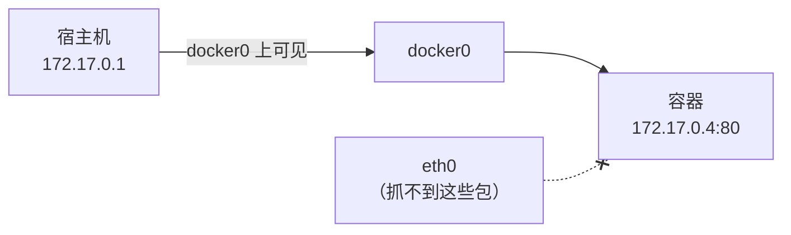

> **Linux 板块 · 第 3 篇**  
> 上一篇：[《IP、网段与网关》](/Linux/basics/linux-02-ip-subnet-gateway)  
> 下一篇：[《NAT 现场实录》](/Linux/basics/linux-04-nat)（本文练好的抓包功夫，正好去拍 NAT 换头的现行）

---

## 开头：端口明明 LISTEN，就是连不上

排障时最憋屈的一类问题长这样（本机实测）——服务说自己在监听：

```bash
ss -tln | grep 18097
```

```text
LISTEN 0      5          127.0.0.1:18097      0.0.0.0:*
```

可客户端一连就吃闭门羹：

```bash
curl http://172.22.212.111:18097/
```

```text
curl: (7) Failed to connect to 172.22.212.111 port 18097: Connection refused
```

`ss` 说端口在听，`iptables` 说规则没拦——可包到底有没有到？到了之后发生了什么？谁也没说。换 tcpdump 上场，现场一秒破案：

```text
$ tcpdump -ni lo tcp port 18097 -c 2
14:18:13.596940 IP 172.22.212.111.40386 > 172.22.212.111.18097: Flags [S], ...
14:18:13.596950 IP 172.22.212.111.18097 > 172.22.212.111.40386: Flags [R.], ...
```

连接请求（`[S]`）落地仅 **10 微秒**，内核直接回了拒绝（`[R.]`）——因为这个服务只绑在 `127.0.0.1` 上（第 2 篇讲过：`scope host` 的地址只在本机内部转），从 `172.22.212.111` 这个门牌进来的请求「没人认领」。换 `curl http://127.0.0.1:18097/` 立刻就通。这两行里的 `[S]`、`[R.]` 是什么意思，雪球 5 会给你整张字母表。

根因一句话：**`ss`、`iptables` 这类工具读的是内核里登记的「配置」，是账本；而「包来没来、来了被谁怎么处理」是发生过的事件——账本不记事件**，所以配置全对却连不上时，只能去调监控。tcpdump 就是这台对着网卡的监控录像机：

| 层 | 工具 | 看到的是 | 类比 |
|----|------|----------|------|
| 配置层 | `ip`、`ss`、`iptables`、`docker network inspect` | 内核里**登记了什么** | 账本 |
| 事件层 | **tcpdump**、Wireshark | 包**实际发生了什么** | 监控录像 |

账本可以有借条没还上、规则开着却不生效——录像不会撒谎。「LISTEN 了却 refused」「规则放行了却不通」「容器能 ping 通 IP 却 curl 不动」，这类问题的最终裁判都是抓包。第 4 篇拆 NAT 时还要靠它两侧抓包拍现行——本文先把这件兵器正式交到你手上。

本篇不先背参数。**同一条流量一路滚大**：先在 lo 上抓自己的 ping 抓到第一行，再把一次 `curl` 的 12 行逐字段读懂，最后把镜头转向 docker0 上容器的那条 `curl`，用它定位真实问题：

| 雪球 | 这一球加上去的 | 当场能看见的效果 |
|------|----------------|------------------|
| **1** | 三件套 `-i` / `-n` / `-c`（外加 `-D` 认口） | lo 上一次 ping，请求/应答 4 行上屏 |
| **2** | 结尾统计三行 + `any` 虚拟口 | 「8 收到对 4 抓到」之谜解开，每行多了 `In`/`Out` 方向 |
| **3** | 把 `-n` 拧紧到 `-nn` | `localhost` 不再顶替 `127.0.0.1`，端口也不被翻译 |
| **4** | BPF 过滤器 | eth0 上 4 行全是与 223.5.5.5 的对话 |
| **5** | TCP Flags 字母表 | 一次 `curl` 从握手到挥手 12 行全读懂；开头那记 `[R.]` 结案 |
| **6** | 一本账对照：读透 `ss` | `Local Address` 两种写法一对比，门开在哪一眼看清 |
| **7** | `-A` + `-s0` | `GET /hello?name=world` 请求原文现形 |
| **8** | 换口到 docker0（容器流量） | `GET /` 与 `200 OK` 全程上屏；同一过滤器在 eth0 零包 |
| **9** | `-w` / `-r` 存取 pcap | 包变成可回放的文件，回读连特权都不要 |

> **贯穿场景**：同一台 WSL2；练手服务一律 `python3 -m http.server`（开头 18097、雪球 5 用 18099、雪球 7 用 18098），抓包产物统一放 `/tmp`。
> **环境指纹**：WSL2 Ubuntu-22.04，tcpdump **4.99.1** + libpcap 1.10.1（Ubuntu 22.04 仓库版；上游最新稳定版 4.99.6，2025-12-30 发布），Docker Engine 29.1.3。抓包需要 root（准确说是 `CAP_NET_RAW` 能力），本环境默认用户即 root；你在普通用户环境里命令前加 `sudo`。
> **官方入口**：[tcpdump(1) 手册](https://www.tcpdump.org/manpages/tcpdump.1.html)、[pcap-filter(7) 过滤器语法](https://www.tcpdump.org/manpages/pcap-filter.7.html)、[tcpdump.org](https://www.tcpdump.org/)。本文全部写法在 4.99 与上游新版通用。
> **读完你能**：独立完成一次「选接口 → 写过滤器 → 抓包 → 逐字段读懂 → 存文件回放」的完整排障；看到 `[S]`、`[S.]`、`[R.]`、`[P.]` 能立刻说出发生了什么。

> 想亲手复现开头这个现场：`python3 -m http.server 18097 --bind 127.0.0.1 &` 起一个只绑回环的服务，再拿 eth0 的地址去 curl 它。

---

## 雪球 1：加上 `-i`/`-n`/`-c` 三件套，在 lo 上抓到第一行

tcpdump 做的事一句话讲完：**把流经某个网络接口的包复制一份**，解析后打印在屏幕上，或原样存进文件。它不转发、不修改、不影响网络——只是「旁听」。

它凭什么看得见？底下干活的是 **libpcap** 库（Windows 上同类叫 Npcap；Wireshark 的抓包引擎也是它）。在 Linux 上，libpcap 通过内核的 **AF_PACKET** 机制从网卡驱动层取包——这个旁听点很靠底，所以连被防火墙丢弃前后的包、转发中的包都看得见。也正因为它能看「别人的信」，读取网卡的原始包是特权操作（root / `CAP_NET_RAW`）；读已保存的 pcap 文件则不需要特权（雪球 9 验证）。

先确认手上的版本：

```bash
tcpdump --version
```

```text
tcpdump version 4.99.1
libpcap version 1.10.1 (with TPACKET_V3)
OpenSSL 3.0.2 15 Mar 2022
```

### 1.1 先认口：`-D` 列出能抓谁

```bash
tcpdump -D
```

```text
1.eth0 [Up, Running, Connected]
2.docker0 [Up, Running, Connected]
3.vethd1f1123 [Up, Running, Connected]
4.vethbf20c82 [Up, Running, Connected]
5.vethfb8f8a7 [Up, Running, Connected]
6.any (Pseudo-device that captures on all interfaces) [Up, Running]
7.lo [Up, Running, Loopback]
8.br-232b31f9d168 [Up, Disconnected]
...（省略若干 br- 开头的自定义网桥与系统虚拟设备）
```

值得认识的面孔，立刻钉成一张表：

| 接口 | 是谁 |
|------|------|
| `eth0` | WSL 对外的物理侧网卡 |
| `docker0` | Docker 默认网桥，第 2 篇的老朋友 |
| `lo` | 环回，只跑本机内部流量，最干净，适合练手 |
| `veth*` | 容器网线的宿主侧（第 2 篇 `eth0@if88` 的伏笔） |
| `any` | 虚拟口，汇总所有接口，雪球 2 用 |

**抓哪张口，就看见谁的流量**——这句话贯穿全文，雪球 8 会拿它破一桩案子。

### 1.2 第一个抓包：在 lo 上抓 ping

`lo` 上只有本机自己的流量，不会被别人的包刷屏。一个终端抓包、另一个终端 `ping`（合成一条命令的话把抓包放后台）：

```bash
tcpdump -ni lo icmp -c 4 &
ping -c 2 127.0.0.1
```

命令第一次出现，逐片拆开（后面九成的抓包都是它们的组合）：

| 片段 | 含义 |
|------|------|
| `-i lo` | 监听 lo 这张口（**i**nterface） |
| `-n` | 地址显示数字，不做名字解析（雪球 3 专讲为什么） |
| `icmp` | 过滤器：只要 ICMP 包（雪球 4 专讲） |
| `-c 4` | 抓满 4 个包就退出（**c**ount），练手时防止刷屏 |
| `&` | 把 tcpdump 放后台，腾出终端敲 ping |
| `ping -c 2` | 发 2 个探测包就停（第 2 篇用过） |

本机输出：

```text
tcpdump: verbose output suppressed, use -v[v]... for full protocol decode
listening on lo, link-type EN10MB (Ethernet), snapshot length 262144 bytes
14:03:01.531082 IP 127.0.0.1 > 127.0.0.1: ICMP echo request, id 1, seq 1, length 64
14:03:01.531090 IP 127.0.0.1 > 127.0.0.1: ICMP echo reply, id 1, seq 1, length 64
14:03:02.549638 IP 127.0.0.1 > 127.0.0.1: ICMP echo request, id 1, seq 2, length 64
14:03:02.549649 IP 127.0.0.1 > 127.0.0.1: ICMP echo reply, id 1, seq 2, length 64
4 packets captured
8 packets received by filter
0 packets dropped by kernel
```

一次就抓到了完整的请求/应答。开头两行 banner 也是信息：`verbose output suppressed` 表示默认精简模式（`-v` 才展开全部协议字段）；`listening on lo` 是正在监听的口；`link-type EN10MB` 表示按以太网帧解析（EN10MB 是以太网的代号）；`snapshot length 262144` 是**默认抓取长度**（snaplen，够覆盖常见整包，截断话题雪球 7 展开）。挑第一行数据逐字段拆：

| 字段 | 一句话 |
|------|--------|
| `14:03:01.531082` | 时间戳，精确到微秒——第 4 篇靠它认「同一个包」在两张网卡上的时差 |
| `IP` | 这是个 IPv4 包 |
| `127.0.0.1 > 127.0.0.1` | 源地址 > 目的地址；lo 上自己发给自己，两边都是自己 |
| `ICMP echo request` | 包的类型：ping 的「请问有人吗」 |
| `id 1` | 标识是哪一次 ping（Linux 拿进程号充当）；同一次 ping 里 id 不变，四行全是 `id 1` |
| `seq 1` | 这次 ping 发出的第几个包，从 1 递增（下一对就是 `seq 2`） |
| `length 64` | ICMP 载荷 64 字节（ping 的默认大小） |

request/reply 成对出现、seq 递增——ping 的流量就这么好认。结尾那三行统计先按下不表，下一球专门拆。

---

## 雪球 2：加上结尾统计三行，顺手用 `any` 看方向

每场抓包结束时 tcpdump 都会交代三句话，原样抠出来：

```text
4 packets captured        ← tcpdump 实际收到并处理的包数
8 packets received by filter   ← 内核过滤器放行给抓包机制的包数
0 packets dropped by kernel    ← 内核缓冲区不够而丢弃的包数
```

**坑：为什么是 8 对 4？丢了一半吗？** 手册原话：`received by filter` 的**语义依赖操作系统**，可能包含 tcpdump 尚未处理的包。在 Linux 的 lo 上，同一个包「发出」和「到达」各经过旁听点一次，内核按 8 次计数，tcpdump 呈现时合并为 4 个——**数字不一致是正常现象，不是丢了包**。验证它很容易：用 `any` 这个虚拟口抓，输出会带方向标记：

```text
$ tcpdump -ni any "icmp and host 127.0.0.1" -c 4
14:07:47.425172 lo    In  IP 127.0.0.1 > 127.0.0.1: ICMP echo request, id 5, seq 1, length 64
14:07:47.425182 lo    In  IP 127.0.0.1 > 127.0.0.1: ICMP echo reply, id 5, seq 1, length 64
...
```

`any` 汇总所有接口的流量，并多打印**接口名 + 方向**：`lo In` 表示这个包正从 lo 进本机（`Out` 则是出本机）。排障时「不知道包走哪张口」，先 `tcpdump -ni any` 定位，再换到具体接口上细抓，是常用套路。

真正要盯的是第三行：`dropped by kernel` 不为 0，说明包多得 tcpdump 来不及取，**现场已经失真**——对策是收紧过滤器（雪球 4）、加 `-c`、或直接落盘（雪球 9）。

> **雪球 2 补**：抓包结束先看最后一行再看来往内容。`dropped by kernel` 非 0 的抓包不能当排障证据——先改命令（收窄/限数/落盘）再抓一次。

---

## 雪球 3：把 `-n` 拧紧到 `-nn`，别让工具自作主张查名字

不加 `-n` 时，tcpdump 会试着把地址反解析成名字。对比同一批包：

```text
$ tcpdump -i lo icmp -c 2        （无 -n）
14:03:04.625701 IP localhost > localhost: ICMP echo request, id 2, seq 1, length 64
```

`127.0.0.1` 变成了 `localhost`。看着亲切，代价有三：**反解要查 DNS，慢**（地址多时肉眼可见地卡）；**查询本身产生流量**，污染你要观察的现场；**解析可能失败或张冠李戴**。所以排障口诀是：**永远 `-n`**。

再进一步的 `-nn` 连端口号也不翻译成服务名——默认 `80` 会显示成 `http`。日常两杆枪：`-n` 图省事，`-nn` 要精确，生产排障用后者。

> **雪球 3 补**：端口号被翻译成服务名这件事，雪球 9 回读 pcap 文件时当场应验——到时候少写一个 `n`，端口 `80` 就会显示成 `.http`。

---

## 雪球 4：加上 BPF 过滤器，在内核里先把不要的包扔掉

### 4.1 为什么必须过滤

不带过滤器抓生产网卡，等于用吸管喝洪水：屏幕刷屏、内核缓冲溢出丢包（`dropped by kernel` 飙升，雪球 2 的坑应验）、明文密码从眼前滚过。好在 tcpdump 的过滤**不是**抓回来再筛——过滤器会被编译成 **BPF**（Berkeley Packet Filter，伯克利包过滤器）指令，**在内核里执行**，不匹配的包根本不会复制给 tcpdump，代价极小。

🧗 眼见为实，`tcpdump -d` 能看到编译结果：

```text
$ tcpdump -d "host 223.5.5.5"
Warning: assuming Ethernet
(000) ldh      [12]
(001) jeq      #0x800           jt 2	jf 4
(002) ld       [26]
...
```

（读不懂没关系，知道「过滤器是编译成机器码在内核执行的」这个事实即可，主线用不上。）

### 4.2 实测与速查表

在 eth0 上只抓与公网 DNS `223.5.5.5` 有关的 ICMP——同一条 ping 流量，这次换到真实网卡上：

```bash
tcpdump -ni eth0 host 223.5.5.5 -c 4 &
ping -c 2 223.5.5.5
```

新加的东西只有过滤器 `host 223.5.5.5`：源**或**目的是这个地址的包都要。本机输出：

```text
14:03:05.689489 IP 172.22.212.111 > 223.5.5.5: ICMP echo request, id 3, seq 1, length 64
14:03:05.695013 IP 223.5.5.5 > 172.22.212.111: ICMP echo reply, id 3, seq 1, length 64
14:03:06.691236 IP 172.22.212.111 > 223.5.5.5: ICMP echo request, id 3, seq 2, length 64
14:03:06.697121 IP 223.5.5.5 > 172.22.212.111: ICMP echo reply, id 3, seq 2, length 64
```

四行全是和 `223.5.5.5` 的对话，一个杂包都没有——eth0 平时还跑着 SSH、DNS 等各种流量，全被内核里的过滤器挡在了门外。字段全是雪球 1 认过的老面孔，只是源地址换成了 `172.22.212.111`（本机 eth0 的门牌）。

常用表达式速查（以下写法均在本机 `-d` 编译验证通过）：

| 写法 | 匹配什么 |
|------|----------|
| `host 172.17.0.4` | 源**或**目的是这个地址 |
| `src host 172.17.0.4` / `dst host ...` | 只匹配一个方向 |
| `net 172.17.0.0/16` | 整个网段（第 2 篇的 CIDR 记法） |
| `port 80` / `tcp port 80` / `udp port 53` | 端口，可限定协议 |
| `portrange 8000-8100` | 端口段 |
| `icmp` / `tcp` / `udp` | 按协议 |
| `and` / `or` / `not` | 组合以上所有条件 |

组合起来就是日常主力句式，比如雪球 8 要用的「容器 172.17.0.4 的 80 端口流量」：

```bash
tcpdump -ni docker0 "host 172.17.0.4 and tcp port 80"
```

> **雪球 4 补**：表达式**整体加引号**——`and`、括号这类词和符号不转义会被 shell 抢先解释，报一堆看不懂的语法错。另一个习惯是**先收窄再开抓**：宁可抓少了再放宽，不要一开始就全量。

---

## 雪球 5：加上 Flags 字母表，读懂一次 curl 的完整一生

ICMP 看够了，本文后面的主角是 TCP——容器里跑的 Web 服务全是它。本机起一个临时 HTTP 服务，抓一次 `curl` 从握手到挥手的完整一生：

```bash
python3 -m http.server 18099 --bind 127.0.0.1 &
tcpdump -ni lo "tcp port 18099" -c 12 &
curl -s http://127.0.0.1:18099/ -o /dev/null
```

三条命令第一次出现，拆开：

| 片段 | 含义 |
|------|------|
| `python3 -m http.server 18099` | 起一个临时静态文件服务器，监听 18099 |
| `--bind 127.0.0.1` | 只绑回环——和开头案发那个服务同一个姿势 |
| `"tcp port 18099"` | 雪球 4 的句式：这个端口的 TCP 包 |
| `-c 12` | 预留 12 个包，握手 + 数据 + 挥手刚好装下 |
| `curl -s` | 静默模式，不打印进度条 |
| `-o /dev/null` | 响应体扔进黑洞——我们要看的是过程，不是页面 |

本机输出（`options` 内容较长，已用 `...` 精简）：

```text
14:07:50.543715 IP 127.0.0.1.53622 > 127.0.0.1.18099: Flags [S],     seq 2551389454, win 65495, options [mss 65495,...], length 0
14:07:50.543728 IP 127.0.0.1.18099 > 127.0.0.1.53622: Flags [S.],   seq 2301513543, ack 2551389455, win 65483, options [...], length 0
14:07:50.543738 IP 127.0.0.1.53622 > 127.0.0.1.18099: Flags [.],     ack 1, win 512, length 0
14:07:50.543812 IP 127.0.0.1.53622 > 127.0.0.1.18099: Flags [P.],   seq 1:80, ack 1, win 512, length 79
14:07:50.543818 IP 127.0.0.1.18099 > 127.0.0.1.53622: Flags [.],     ack 80, win 511, length 0
14:07:50.571386 IP 127.0.0.1.18099 > 127.0.0.1.53622: Flags [P.],   seq 1:158, ack 80, win 512, length 157
...（省略 3 行纯确认与数据行）
14:07:50.571492 IP 127.0.0.1.18099 > 127.0.0.1.53622: Flags [F.],   seq 1314, ack 80, win 512, length 0
14:07:50.571502 IP 127.0.0.1.53622 > 127.0.0.1.18099: Flags [F.],   seq 80, ack 1314, win 567, length 0
14:07:50.571509 IP 127.0.0.1.18099 > 127.0.0.1.53622: Flags [.],     ack 81, win 512, length 0
```

先认解剖结构——一行 TCP 输出的每个字段：

| 片段 | 含义 |
|------|------|
| `127.0.0.1.53622 > 127.0.0.1.18099` | `IP.端口`，源在左目的在右——地址和端口之间是**点**不是冒号；`53622` 是 curl 侧的临时端口 |
| `Flags [S.]` | TCP 标志位，这个包在「说」的话，见下表 |
| `seq 1:80` | 本包携带的数据是字节流的第 1~79 字节 |
| `ack 80` | 我已收到对方的前 79 字节，期望下一个从 80 开始 |
| `win 512` | 接收窗口：我还能再收多少字节（排查慢连接时会用到） |
| `length 79` | 携带的数据字节数，`length 0` = 纯控制包 |
| `options [mss 65495,...]` | 握手包附带的协商参数（最大段大小等），正文里常省略 |

Flags 字母表（摘自手册，常用的六个）：

| 标记 | 名字 | 包在说什么 |
|------|------|-----------|
| `[S]` | SYN | 「我想建立连接」 |
| `[S.]` | SYN+ACK | 「同意，我也确认」 |
| `[.]` | ACK | 「收到」（常见的无声确认） |
| `[P.]` | PSH+ACK | 「这里有一段数据，请向上交付」 |
| `[F.]` | FIN+ACK | 「我说完了，想关连接」 |
| `[R.]` | RST+ACK | 「拒绝 / 出错了，连接作废」 |

拿字母表逐行套上面的输出，故事就出来了：**三次握手** `[S]`→`[S.]`→`[.]`；**发数据** `[P.]`（79 字节正是 HTTP 请求）；**收响应** `[P.]`（157 字节是响应的前一段）；**四次挥手** `[F.]`→`[F.]`→`[.]`。再看开头那个连不上的案例——`[S]` 刚落地就换来 `[R.]`，就是内核在说「这个端口没人听」。排障最常见的判读就这几招：**只见 `[S]` 不见 `[S.]` 是路断了；见 `[R.]` 是被拒；全是重传 `[P.]` 是丢包**。

> **雪球 5 补**：序号默认显示**相对值**（连接建立后按字节流偏移计），要看原始值加 `-S`。相对 seq 只在本机这份输出里自洽，别拿去跟别的机器抓的包对数。

---

## 雪球 6：加上一本账对照——读透 ss，给开头的案子结案

雪球 5 读懂了 `[R.]`，开头的案子在事件层其实已经破了。但配置层那本账也值得回头读透——**两本证据合起来，才是完整现场**。

`ss`（**s**ocket **s**tatistics）列出内核里当前的 socket，是老牌 `netstat` 的现代继任者（数据来自 `/proc/net/tcp`）。三个选项各管一件事：

| 选项 | 含义 | 不加会怎样 |
|------|------|-----------|
| `-t` | 只看 **TCP** | UDP 等一起列出来 |
| `-l` | 只看 **L**istening（监听中的「服务端门」） | 已建立的连接（ESTAB 等）也会列出 |
| `-n` | 地址、端口显示**数字**，不查名字 | `80` 显示成 `http`，还可能去查 DNS——和 tcpdump 的 `-n` 是同一个哲学：**快、准、不污染现场** |

`| grep 18097` 只是在几十行里聚焦你关心的端口。不带过滤看全貌（本机实测节选）：

```bash
ss -tln
```

```text
State  Recv-Q Send-Q Local Address:Port  Peer Address:PortProcess
LISTEN 0      4096         0.0.0.0:18080      0.0.0.0:*
LISTEN 0      4096   127.0.0.53%lo:53         0.0.0.0:*
LISTEN 0      511          0.0.0.0:80         0.0.0.0:*
```

五列的含义（LISTEN 行）：

| 列 | 含义 |
|----|------|
| State | `LISTEN` = 一扇等着别人来敲的门 |
| Recv-Q | 已完成握手、排队等应用 accept 的连接数（持续增长 = 应用收不过来） |
| Send-Q | 这个队列的上限（backlog） |
| **Local Address:Port** | **门开在哪个地址的哪个端口——排障时最要紧的一列** |
| Peer Address:Port | 监听态下无意义，恒为 `0.0.0.0:*` |

关键就在 Local Address 的两种写法（同一台机器、两个服务的对照，实测）：

```text
LISTEN 0      5          127.0.0.1:18097      ← 绑死环回：只有本机能敲开这扇门
LISTEN 0      5            0.0.0.0:18096      ← 绑 0.0.0.0：本机所有网卡的地址都能敲开
```

所以回头看：`ss` 从一开始就把答案写清了——「有个门，开在 `127.0.0.1`」。它没有骗人，只是容易被读成「LISTEN + 端口对上了 = 没问题」。**配置层工具给的是局部真相**（门开在哪），把局部真相拼成完整现场（敲门的包到底遭遇了什么），才是抓包工具的活。顺带一眼：全貌里那行 `0.0.0.0:18080`，正是雪球 8 容器 `-p 18080:80` 在宿主机开的门——到时候回来对号。

---

## 雪球 7：加上 `-A` 和 `-s0`，把包里的明文打出来

TCP 行只告诉你「有多少数据」，`-A` 把数据内容按 ASCII 打出来：

```bash
python3 -m http.server 18098 --bind 127.0.0.1 &
tcpdump -A -s0 -ni lo "tcp dst port 18098" -c 4 &
curl -s "http://127.0.0.1:18098/hello?name=world" -o /dev/null
```

新加的两样：`-A` 按 ASCII 打印包的载荷；`-s0` 抓完整包（理由马上讲）。过滤器换成 `tcp dst port` 只留「去程」——要看的是 curl 发出的请求原文，响应的 HTML 会把屏幕刷爆。

```text
14:16:53.114869 IP 127.0.0.1.42872 > 127.0.0.1.18098: Flags [P.], seq 0:95, ack 1, win 512, length 95
E.....@.@.l..........xF.C..................
.X.K.X.KGET /hello?name=world HTTP/1.1
Host: 127.0.0.1:18098
User-Agent: curl/7.81.0
Accept: */*
```

逐行读：

| 行 | 一句话 |
|----|--------|
| `14:16:53.114869 IP ... length 95` | 雪球 5 的老 TCP 行：一个带 95 字节数据的 `[P.]` 包 |
| `E.....@.@.l...` 两行乱码 | 以太网/IP/TCP 头部的字节按 ASCII 显示，不可打印的都成了点——给机器看的，不用人读 |
| `GET /hello?name=world HTTP/1.1` | HTTP 请求行：方法、路径（带查询串）、协议版本 |
| `Host: 127.0.0.1:18098` | 要访问的主机和端口 |
| `User-Agent: curl/7.81.0` | 客户端自报家门 |
| `Accept: */*` | 什么响应类型都收 |

HTTP 请求的每一个字都看得见——包括没加密的口令、Cookie。`-s0` 的意思是「抓完整包」：snaplen 设为 0 即取默认 262144。老教程里人手一个 `-s 0`，是因为旧版默认只抓 68 字节会截断；4.99 时代不带也行，写了更稳（来龙去脉见文末「历史包袱」）。截断真的发生时，输出会标 `[|proto]`。顺带一句常识：**HTTPS 的包抓出来是一串乱码，这是加密的本意**——想看解密内容需要密钥配合 Wireshark，超出本文范围。

---

## 雪球 8：换一张口——docker0 上抓容器，eth0 上零包

前面练的功夫，现在用到 Docker 上（这也是本系列作为 Docker 前置的正题）。本机有个发布过 `-p 18080:80` 的容器（第 4 篇 NAT 的主角，IP `172.17.0.4`），在 docker0 上看宿主机访问它的全程：

```bash
tcpdump -ni docker0 "host 172.17.0.4 and tcp port 80" -c 8 &
curl -s http://172.17.0.4/ -o /dev/null -w "HTTP %{http_code}\n"
```

新加的东西只有 `-i docker0`：镜头从 lo 换到 Docker 网桥。`curl` 的 `-w "HTTP %{http_code}\n"` 表示请求结束后按格式串打印状态码变量。输出：

```text
HTTP 200
```

```text
14:15:52.209291 IP 172.17.0.1.34164 > 172.17.0.4.80: Flags [S],     seq 3551765619, win 64240, options [mss 1460,...], length 0
14:15:52.209322 IP 172.17.0.4.80 > 172.17.0.1.34164: Flags [S.],   seq 2698906446, ack 3551765620, win 65160, options [...], length 0
14:15:52.209332 IP 172.17.0.1.34164 > 172.17.0.4.80: Flags [.],     ack 1, win 502, length 0
14:15:52.209381 IP 172.17.0.1.34164 > 172.17.0.4.80: Flags [P.],   seq 1:75, ack 1, win 502, length 74: HTTP: GET / HTTP/1.1
14:15:52.209564 IP 172.17.0.4.80 > 172.17.0.1.34164: Flags [P.],   seq 1:239, ack 75, win 509, length 238: HTTP: HTTP/1.1 200 OK
...（省略 3 行）
```

握手、`GET /`、`200 OK`，一网打尽——拿雪球 5 的字母表逐行套即可。三个新面孔：`172.17.0.1` 是 docker0（网关），`172.17.0.4` 是容器；行尾的 `HTTP: GET / HTTP/1.1`、`HTTP: HTTP/1.1 200 OK` 是 tcpdump 顺手认出的 HTTP 内容。

**同一时刻在 eth0 上抓会怎样？**（过滤器换成容器地址，等 5 秒超时退出）：

```bash
timeout 5 tcpdump -ni eth0 "host 172.17.0.4"
```

（curl 依旧 HTTP 200。）

```text
0 packets captured
0 packets received by filter
0 packets dropped by kernel
```

**一个包都没有。** 宿主机与容器同在 `172.17.0.0/16` 这片网段（第 2 篇的 `scope link` 直连路由），流量只走 docker0，根本不经过 eth0——这就是「抓哪张口，就看见谁的流量」的反面教材：



留给下一篇的钩子也在这：**容器去 ping 公网时，eth0 上能抓到吗？源地址还是 `172.17.0.4` 吗？**——第 4 篇用同样的手法拍 NAT 换头。

> **雪球 8 补 🧗（混杂模式的实测说明）**：教材常说 tcpdump 默认把网卡设为混杂模式（看见「不发给本机」的包，`-p` 关闭）。但在本机（tcpdump 4.99.1）实测：抓包期间 `ip link show docker0` 并**没有**出现 PROMISC 标志；手动 `ip link set docker0 promisc on` 则立刻出现——说明是否置位由 libpcap 与系统决定，`-p` 的语义只是「不主动去开」。手册还明确：`any` 接口**不会**使用混杂模式。好在抓宿主↔容器、容器↔网关的流量并不需要它（去程是本机发出、回程目的 MAC 就是本机口）；现代交换网络里混杂模式的用武之地本也不多。

---

## 雪球 9：加上 `-w`/`-r`，把现场存成可回放的证据

屏幕会滚走，文件不会。`-w` 把**原始包**存成 pcap 文件（业界通用格式，Wireshark 直接打开）：

```bash
tcpdump -ni docker0 "host 172.17.0.4 and tcp port 80" -c 6 -w /tmp/docker-http.pcap &
curl -s http://172.17.0.4/ -o /dev/null
```

新加的只有 `-w /tmp/docker-http.pcap`：不解析上屏，原样写文件。本机只打印了结尾统计：

```text
6 packets captured
12 packets received by filter
0 packets dropped by kernel
```

（12 对 6 又是熟悉的倍数——雪球 2 讲过 `received by filter` 的计数语义，不是丢包。）

看一眼产物：

```bash
ls -l /tmp/docker-http.pcap
file /tmp/docker-http.pcap
```

```text
-rw-r--r-- 1 tcpdump tcpdump 844 Aug 17 14:16 /tmp/docker-http.pcap
/tmp/docker-http.pcap: pcap capture file, microsecond ts (little-endian) - version 2.4 (Ethernet, capture length 262144)
```

逐行拆：`ls -l` 那行里 `-rw-r--r--` 是权限（别人只读不可写），属主显示 **tcpdump** 而不是 root——tcpdump 写文件时默认**降权**到 tcpdump 用户（`-Z` 选项的默认值，安全设计），`844` 是文件字节数。`file` 那行交代格式：pcap 捕获文件、微秒精度时间戳、小端序、版本 2.4、以太网链路、抓取长度 262144。

回读用 `-r`（不需要特权）：

```bash
tcpdump -nn -r /tmp/docker-http.pcap | head -4
```

```text
reading from file /tmp/docker-http.pcap, link-type EN10MB (Ethernet), snapshot length 262144
14:16:00.349015 IP 172.17.0.1.36820 > 172.17.0.4.80: Flags [S], ...
```

`reading from file ...` 的 banner 说明这回不是听网卡、是读文件；`head -4` 只取前几行。注意 `36820 > 80` 的端口——**雪球 3 埋的坑在这应验**：若省掉一个 `n`（只 `-n` 不 `-nn`），同样的文件会显示成 `172.17.0.4.http`，端口被翻译成了服务名。文件是原始证据，回读时才决定怎么呈现，这也是「落盘再分析」的好处之一。

生产上长时间抓包的配套件：`-C` 按大小切文件、`-W` 限制个数（环形覆盖）、`-G` 按时间轮转——名字先记下，用到再查手册。

**收尾清理**：本文起过三个练手服务（开头 18097、雪球 5 的 18099、雪球 7 的 18098，都是 `python3 -m http.server`），连同落盘的 pcap 一起清掉（`pkill -f` 按命令行匹配杀进程，`rm -f` 删文件）：

```bash
pkill -f http.server && rm -f /tmp/docker-http.pcap
```

---

## 参数怎么记（对照哪一球用过）

每个选项都是在某一球里带着效果出场过的，按出场顺序记：

| 选项/命令 | 干什么 | 在哪一球用过 |
|-----------|--------|--------------|
| `-D` | 列出可抓的口 | 1 |
| `-i <口>` / `any` | 选口 / 全口并带 `In`、`Out` 方向 | 1 / 2 |
| `-n` / `-nn` | 不查名字 / 连端口也不翻译 | 1、3 |
| `-c N` | 抓满 N 个包退出 | 1 |
| `host`/`net`/`port` + `and`/`or`/`not` | BPF 过滤表达式（整体加引号） | 4、8 |
| `-d` 🧗 | 看过滤器的编译结果 | 4 |
| `-S` | 序号显示原始值 | 5 补 |
| `-A` / `-s0` | 打印明文 / 抓完整包 | 7 |
| `-w` / `-r` | 落盘 / 回读 | 9 |
| `-C`/`-W`/`-G` | 按大小切文件 / 限个数 / 按时间轮转 | 9（记名字即可） |
| `ss -tln` | 账本：门开在哪 | 开头、6 |
| `python3 -m http.server` | 练手服务 | 开头、5、7 |
| `file` / `pkill -f` | 认文件格式 / 按命令行杀进程 | 9 |

## 历史包袱：老教程里的三处版本痕迹

- **人手一个 `-s 0`**：旧版 tcpdump 默认 snaplen 只有 68 字节，HTTP 包必截断，所以老教程见包就写 `-s 0`。4.99 起默认 262144（雪球 1 的 banner 就是本机证据），不带也基本够——写了更稳，不算错。
- **`netstat -tln`**：`ss` 出现前的老写法，两者都读 `/proc/net/tcp`；新系统请用 `ss`。
- **版本差**：本机是 Ubuntu 22.04 仓库的 tcpdump 4.99.1 + libpcap 1.10.1；上游最新稳定版 4.99.6（2025-12-30 发布），线上手册已是对应 5.0.0-PRE-GIT 的版本。`received by filter` 语义依操作系统而定等表述以手册为准，本文写法各版通用。

## 和系列其它篇

| 相关篇 | 在这一路上出现的位置 |
|--------|----------------------|
| [第 2 篇《读 Docker 网络前要懂的 IP、网段与网关》](/Linux/basics/linux-02-ip-subnet-gateway) | `scope host`（开头案子的根因）、`scope link` 直连路由（雪球 8）、`eth0@if88`/veth 伏笔（雪球 1） |
| [第 4 篇《NAT 白话拆解》](/Linux/basics/linux-04-nat) | 下一篇：两侧抓包拍 NAT 换头，主角就是雪球 8 的 `172.17.0.4` 容器 |
| [Docker 第 11 篇《Docker 网络——从 localhost 不通滚到能用名字互访》](/云原生/docker/docker-15-network) | veth 这根线怎么接、网桥怎么转——雪球 8 docker0 的下一层 |

## 小结

同一条流量滚了九球：

1. **三件套起步**：`-D` 认口、`-i` 选口、`-n` 不查名、`-c` 限个数；banner 里的 snaplen 262144 先记下。  
2. **结尾统计**：`dropped by kernel` 非 0 = 现场已失真，这份抓包不能当证据；`received` 数字翻倍是 lo 双计不是丢包；`any` 带方向，先定位再细抓。  
3. **`-nn`**：地址、端口都不翻译——生产排障的默认姿势。  
4. **BPF 过滤器**：编译进内核执行，先收窄再开抓，表达式整体加引号。  
5. **Flags 字母表**：`[S]` 请求连接、`[S.]` 同意、`[R.]` 拒绝（开头案例的真凶）、`[P.]` 带数据、`[F.]` 关闭；只见 `[S]` 不见 `[S.]` 是路断了。  
6. **合读账本**：`ss -tln` 的 Local Address:Port 写明门开在哪（绑 `127.0.0.1` 只有本机能敲、绑 `0.0.0.0` 所有地址可敲）——配置层给局部真相，抓包补完整现场。  
7. **`-A` + `-s0`**：明文一屏可见（口令也在内）；HTTPS 乱码是加密的本意。  
8. **docker0 抓容器**：宿主↔容器在 eth0 上零流量（同网段 `scope link` 直连）；混杂模式是否置位依系统而定，实测 4.99.1 未置位也不影响本文场景。  
9. **`-w`/`-r`**：pcap 是可回放的原始证据，回读不要特权，Wireshark 可接着分析。

**思考题**：

> 1. 雪球 8 证明「宿主→容器」的流量在 eth0 上抓不到。那**容器 ping 223.5.5.5** 时，`tcpdump -ni eth0 "host 223.5.5.5"` 能抓到包吗？如果能，源地址会写谁的名字？（提示：回看第 2 篇「出网段先交给网关」；答案就是下一篇的正文。）
> 2. 生产机上同事执行了 `tcpdump -ni eth0`（无过滤器、无 `-c`）十分钟后 Ctrl+C，统计显示 `dropped by kernel = 15000`。这份抓包能作为排障依据吗？你会给他哪三条改进命令？（提示：雪球 2 的补、雪球 4 的两个习惯、雪球 9 的落盘。）

下一篇：[《NAT 白话拆解》](/Linux/basics/linux-04-nat)。

---

## 参考资料

- [tcpdump(1) 官方手册](https://www.tcpdump.org/manpages/tcpdump.1.html)（线上版对应 5.0.0-PRE-GIT，更新于 2026-07；统计三行、Flags 字母表、`any` 与混杂模式的表述均出自此处）
- [tcpdump.org](https://www.tcpdump.org/) — 当前稳定版 4.99.6（2025-12-30）；过滤器语法详见配套的 [pcap-filter(7)](https://www.tcpdump.org/manpages/pcap-filter.7.html)
- [Wireshark](https://www.wireshark.org/) — pcap 文件的图形化分析器
- 本机实测环境：WSL2 Ubuntu-22.04，tcpdump 4.99.1 + libpcap 1.10.1，Docker Engine 29.1.3
