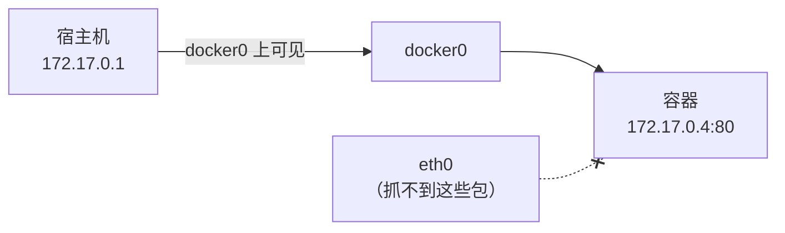

> **Linux 板块 · 第 3 篇**  
> 上一篇：[《读 Docker 网络前要懂的 IP、网段与网关》](/Linux/basics/linux-02-ip-subnet-gateway)  
> 下一篇：[《NAT 白话拆解》](/Linux/basics/linux-04-nat)（本文练好的抓包功夫，正好去拍 NAT 换头的现行）

---

## 开头：端口明明 LISTEN，就是连不上

排障时最憋屈的一类问题长这样（本机实测）——服务说自己在监听：

```bash
$ ss -tln | grep 18097
LISTEN 0      5          127.0.0.1:18097      0.0.0.0:*
```

可客户端一连就吃闭门羹：

```text
$ curl http://172.22.212.111:18097/
curl: (7) Failed to connect to 172.22.212.111 port 18097: Connection refused
```

`ss` 说端口在听，`iptables` 说规则没拦——它们读的都是**配置**，是「账本」。**包到底有没有到？到了之后发生了什么？** 账本回答不了。上 tcpdump，现场一秒破案：

```text
$ tcpdump -ni lo tcp port 18097 -c 2
14:18:13.596940 IP 172.22.212.111.40386 > 172.22.212.111.18097: Flags [S], ...
14:18:13.596950 IP 172.22.212.111.18097 > 172.22.212.111.40386: Flags [R.], ...
```

连接请求（`S`）落地仅 **10 微秒**，内核直接回了拒绝（`R.`）——因为这个服务只绑在 `127.0.0.1` 上（第 2 篇讲过：`scope host` 的地址只在本机内部转），从 `172.22.212.111` 这个门牌进来的请求「没人认领」。换 `curl http://127.0.0.1:18097/` 立刻就通。

这就是 tcpdump 的位置：**当所有配置类工具都说「没问题」时，它让你看见包本身的生死**。第 4 篇拆 NAT 时还要靠它两侧抓包拍现行——本文先把这件兵器正式交到你手上。

> 想亲手复现这个现场：`python3 -m http.server 18097 --bind 127.0.0.1 &` 起一个只绑回环的服务，再拿 eth0 的地址去 curl 它。

### 回读 `ss -tln`：账本其实写得明明白白

破案之后再回头把开头那行 `ss -tln | grep 18097` 拆透——它是「配置层」工具的代表，本文后面还会反复出现。

`ss`（**s**ocket **s**tatistics）列出内核里当前的 socket，是老牌 `netstat` 的现代继任者（数据来自 `/proc/net/tcp`）。三个选项各管一件事：

| 选项 | 含义 | 不加会怎样 |
|------|------|-----------|
| `-t` | 只看 **TCP** | UDP 等一起列出来 |
| `-l` | 只看 **L**istening（监听中的「服务端门」） | 已建立的连接（ESTAB 等）也会列出 |
| `-n` | 地址、端口显示**数字**，不查名字 | `80` 显示成 `http`，还可能去查 DNS——和 tcpdump 的 `-n` 是同一个哲学：**快、准、不污染现场** |

`| grep 18097` 只是在几十行里聚焦你关心的端口。不带过滤看全貌（本机实测节选）：

```text
$ ss -tln
State  Recv-Q Send-Q Local Address:Port  Peer Address:PortProcess
LISTEN 0      4096         0.0.0.0:18080      0.0.0.0:*
LISTEN 0      4096   127.0.0.53%lo:53         0.0.0.0:*
LISTEN 0      511          0.0.0.0:80         0.0.0.0:*
```

五列的含义（LISTEN 行）：

| 列 | 含义 |
|----|------|
| State | `LISTEN` = 一扇等着别人来敲的门 |
| Recv-Q | 已完成握手、排队等应用 accept 的连接数（持续增长 = 应用收不过来） |
| Send-Q | 这个队列的上限（backlog） |
| **Local Address:Port** | **门开在哪个地址的哪个端口——排障时最要紧的一列** |
| Peer Address:Port | 监听态下无意义，恒为 `0.0.0.0:*` |

关键就在 Local Address 的两种写法（同一台机器、两个服务的对照，实测）：

```text
LISTEN 0      5          127.0.0.1:18097      ← 绑死环回：只有本机能敲开这扇门
LISTEN 0      5            0.0.0.0:18096      ← 绑 0.0.0.0：本机所有网卡的地址都能敲开
```

所以回头看：`ss` 从一开始就把答案写清了——「有个门，开在 `127.0.0.1`」。它没有骗人，只是容易被读成「LISTEN + 端口对上了 = 没问题」。**配置层工具给的是局部真相**（门开在哪），把局部真相拼成完整现场（敲门的包到底遭遇了什么），才是抓包工具的活。

> **目标**：能独立完成一次「从选接口、写过滤器、抓包、读懂输出到存文件回放」的完整排障；看到 `[S]`、`[S.]`、`[R.]`、`[P.]` 这些标记能立刻说出发生了什么。  
> **实验环境**：WSL2 Ubuntu-22.04，tcpdump **4.99.1** + libpcap 1.10.1（Ubuntu 22.04 仓库版）。上游最新稳定版为 4.99.6（2025-12-30 发布，见 [tcpdump.org](https://www.tcpdump.org/)），本文全部写法通用。抓包需要 root（准确说是 `CAP_NET_RAW` 能力），本环境默认用户即 root；你在普通用户环境里命令前加 `sudo`。

---

## 一、tcpdump 是什么：给流经网卡的包拍「快照」

**是什么**：tcpdump 把**流经某个网络接口的包复制一份**，解析后打印在屏幕上，或原样存进文件。它不转发、不修改、不影响网络——只是「旁听」。

**为什么需要它**：网络排障的工具分两层——

| 层 | 工具 | 看到的是 | 类比 |
|----|------|----------|------|
| 配置层 | `ip`、`ss`、`iptables`、`docker network inspect` | 内核里**登记了什么** | 账本 |
| 事件层 | **tcpdump**、Wireshark | 包**实际发生了什么** | 监控录像 |

账本可以有借条没还上、规则开着却不生效——录像不会撒谎。「LISTEN 了却 refused」「规则放行了却不通」「容器能 ping 通 IP 却 curl 不动」，这类问题的最终裁判都是抓包。

**背景知识**：tcpdump 底下干活的是 **libpcap** 库（Windows 上同类叫 Npcap；Wireshark 的抓包引擎也是它）。在 Linux 上，libpcap 通过内核的 **AF_PACKET** 机制从网卡驱动层取包——这个旁听点很靠底，所以连被防火墙丢弃前后的包、转发中的包都看得见。也正因为它能看「别人的信」，读取网卡的原始包是特权操作（root / `CAP_NET_RAW`），读已保存的 pcap 文件则不需要。

确认一下手上的版本：

```bash
$ tcpdump --version
tcpdump version 4.99.1
libpcap version 1.10.1 (with TPACKET_V3)
OpenSSL 3.0.2 15 Mar 2022
```

---

## 二、三件套起步：`-i` 选口、`-n` 显示数字、`-c` 数量

### 2.1 先看有哪些口可抓：`-D`

```bash
$ tcpdump -D
1.eth0 [Up, Running, Connected]
2.docker0 [Up, Running, Connected]
3.vethd1f1123 [Up, Running, Connected]
4.vethbf20c82 [Up, Running, Connected]
5.vethfb8f8a7 [Up, Running, Connected]
6.any (Pseudo-device that captures on all interfaces) [Up, Running]
7.lo [Up, Running, Loopback]
8.br-232b31f9d168 [Up, Disconnected]
...（省略若干 br- 开头的自定义网桥与系统虚拟设备）
```

值得认识的面孔：`eth0`（WSL 对外的物理侧网卡）、`docker0`（Docker 默认网桥，第 2 篇的老朋友）、`lo`（环回）、几条 `veth`（容器网线的宿主侧，见第 2 篇 `eth0@if88` 的伏笔）。**抓哪张口，就看见谁的流量**——这句话贯穿全文。

### 2.2 第一个抓包：在 lo 上抓 ping

`lo` 只跑本机内部流量，最干净，适合练手。一个终端抓包，另一个终端 `ping`（合成一条命令的话把抓包放后台）：

```bash
$ tcpdump -ni lo icmp -c 4 &
$ ping -c 2 127.0.0.1
```

```text
tcpdump: verbose output suppressed, use -v[v]... for full protocol decode
listening on lo, link-type EN10MB (Ethernet), snapshot length 262144 bytes
14:03:01.531082 IP 127.0.0.1 > 127.0.0.1: ICMP echo request, id 1, seq 1, length 64
14:03:01.531090 IP 127.0.0.1 > 127.0.0.1: ICMP echo reply, id 1, seq 1, length 64
14:03:02.549638 IP 127.0.0.1 > 127.0.0.1: ICMP echo request, id 1, seq 2, length 64
14:03:02.549649 IP 127.0.0.1 > 127.0.0.1: ICMP echo reply, id 1, seq 2, length 64
4 packets captured
8 packets received by filter
0 packets dropped by kernel
```

一次就抓到了完整的请求/应答。逐段拆开：

| 片段 | 含义 |
|------|------|
| `-i lo` | 监听 lo 这张口 |
| `-n` | 地址显示数字，不做名字解析（下一节专讲） |
| `icmp` | 过滤器：只要 ICMP 包（第四节专讲） |
| `-c 4` | 抓满 4 个包就退出 |
| `14:03:01.531082` | 时间戳，精确到微秒——第 4 篇靠它对「同一个包」在两张网卡上的时差 |
| `127.0.0.1 > 127.0.0.1` | 源地址 > 目的地址 |
| `ICMP echo request/reply` | ping 的请求与应答 |

开头两行 banner 也有信息：`link-type EN10MB` 表示按以太网帧解析；`snapshot length 262144` 是**默认抓取长度**（snaplen，够覆盖常见整包，截断问题见第六节）。

### 2.3 结尾三行统计：抓了多少、丢了多少

```text
4 packets captured        ← tcpdump 实际收到并处理的包数
8 packets received by filter   ← 内核过滤器放行给抓包机制的包数
0 packets dropped by kernel    ← 内核缓冲区不够而丢弃的包数
```

为什么本例是 8 对 4？手册原话：`received by filter` 的**语义依赖操作系统**，可能包含 tcpdump 尚未处理的包。在 Linux 的 lo 上，同一个包「发出」和「到达」各经过旁听点一次，内核按 8 次计数，tcpdump 呈现时合并为 4 个——**数字不一致是正常现象，不是丢了包**。验证它很容易：用 `any` 这个虚拟口抓，输出会带方向标记：

```text
$ tcpdump -ni any "icmp and host 127.0.0.1" -c 4
14:07:47.425172 lo    In  IP 127.0.0.1 > 127.0.0.1: ICMP echo request, id 5, seq 1, length 64
14:07:47.425182 lo    In  IP 127.0.0.1 > 127.0.0.1: ICMP echo reply, id 5, seq 1, length 64
...
```

`any` 汇总所有接口的流量，并多打印**接口名 + 方向**（`In` 进本机 / `Out` 出本机）——排障时「不知道包走哪张口」，先 `tcpdump -ni any` 定位，再换到具体接口上细抓，是常用套路。真正要盯的是第三行：`dropped by kernel` 不为 0，说明包多得 tcpdump 来不及取，**现场已经失真**——对策是收紧过滤器（第四节）、加 `-c`、或直接落盘（第八节）。

---

## 三、`-n` 与 `-nn`：别让工具自作主张去查名字

不加 `-n` 时，tcpdump 会试着把地址反解析成名字。对比同一批包：

```text
$ tcpdump -i lo icmp -c 2        （无 -n）
14:03:04.625701 IP localhost > localhost: ICMP echo request, id 2, seq 1, length 64
```

`127.0.0.1` 变成了 `localhost`。看着亲切，代价有三：**反解要查 DNS，慢**（地址多时肉眼可见地卡）；**查询本身产生流量**，污染你要观察的现场；**解析可能失败或张冠李戴**。所以排障口诀是：**永远 `-n`**。再进一步的 `-nn` 连端口号也不翻译成服务名——默认 `80` 会显示成 `http`（第八节回读文件时给你看实例）。写下来：日常两杆枪 `-n`（图省事）与 `-nn`（要精确），生产排障用后者。

---

## 四、BPF 过滤器：在内核里先把不要的包扔掉

### 4.1 为什么必须过滤

不带过滤器抓生产网卡，等于用吸管喝洪水：屏幕刷屏、内核缓冲溢出丢包（`dropped by kernel` 飙升）、明文密码从眼前滚过。好在 tcpdump 的过滤**不是**抓回来再筛——过滤器会被编译成 **BPF**（Berkeley Packet Filter，伯克利包过滤器）指令，**在内核里执行**，不匹配的包根本不会复制给 tcpdump，代价极小。`tcpdump -d` 能看到编译结果：

```text
$ tcpdump -d "host 223.5.5.5"
Warning: assuming Ethernet
(000) ldh      [12]
(001) jeq      #0x800           jt 2	jf 4
(002) ld       [26]
...
```

（读不懂没关系，知道「过滤器是编译执行的机器码」这个事实即可。）

### 4.2 实测与速查表

在 eth0 上只抓与公网 DNS `223.5.5.5` 有关的 ICMP：

```bash
$ tcpdump -ni eth0 host 223.5.5.5 -c 4 &
$ ping -c 2 223.5.5.5
```

```text
14:03:05.689489 IP 172.22.212.111 > 223.5.5.5: ICMP echo request, id 3, seq 1, length 64
14:03:05.695013 IP 223.5.5.5 > 172.22.212.111: ICMP echo reply, id 3, seq 1, length 64
14:03:06.691236 IP 172.22.212.111 > 223.5.5.5: ICMP echo request, id 3, seq 2, length 64
14:03:06.697121 IP 223.5.5.5 > 172.22.212.111: ICMP echo reply, id 3, seq 2, length 64
```

常用表达式速查（以下写法均在本机 `-d` 编译验证通过）：

| 写法 | 匹配什么 |
|------|----------|
| `host 172.17.0.4` | 源**或**目的是这个地址 |
| `src host 172.17.0.4` / `dst host ...` | 只匹配一个方向 |
| `net 172.17.0.0/16` | 整个网段（第 2 篇的 CIDR 记法） |
| `port 80` / `tcp port 80` / `udp port 53` | 端口，可限定协议 |
| `portrange 8000-8100` | 端口段 |
| `icmp` / `tcp` / `udp` | 按协议 |
| `and` / `or` / `not` | 组合以上所有条件 |

组合起来就是日常主力句式，比如第七节要用的「容器 172.17.0.4 的 80 端口流量」：

```bash
tcpdump -ni docker0 "host 172.17.0.4 and tcp port 80"
```

两个习惯：表达式**整体加引号**（`and`、括号这类词和符号不转义会被 shell 抢先解释）；**先收窄再开抓**，宁可抓少了放宽，不要一开始就全量。

---

## 五、读懂 TCP 行：Flags 是包在「说」什么

TCP 包是本文后续的主角。本机起一个临时 HTTP 服务，抓一次 `curl` 的完整一生：

```bash
$ python3 -m http.server 18099 --bind 127.0.0.1 &
$ tcpdump -ni lo "tcp port 18099" -c 12 &
$ curl -s http://127.0.0.1:18099/ -o /dev/null
```

```text
14:07:50.543715 IP 127.0.0.1.53622 > 127.0.0.1.18099: Flags [S],     seq 2551389454, win 65495, options [mss 65495,...], length 0
14:07:50.543728 IP 127.0.0.1.18099 > 127.0.0.1.53622: Flags [S.],   seq 2301513543, ack 2551389455, win 65483, options [...], length 0
14:07:50.543738 IP 127.0.0.1.53622 > 127.0.0.1.18099: Flags [.],     ack 1, win 512, length 0
14:07:50.543812 IP 127.0.0.1.53622 > 127.0.0.1.18099: Flags [P.],   seq 1:80, ack 1, win 512, length 79
14:07:50.543818 IP 127.0.0.1.18099 > 127.0.0.1.53622: Flags [.],     ack 80, win 511, length 0
14:07:50.571386 IP 127.0.0.1.18099 > 127.0.0.1.53622: Flags [P.],   seq 1:158, ack 80, win 512, length 157
...（省略 3 行纯确认与数据行）
14:07:50.571492 IP 127.0.0.1.18099 > 127.0.0.1.53622: Flags [F.],   seq 1314, ack 80, win 512, length 0
14:07:50.571502 IP 127.0.0.1.53622 > 127.0.0.1.18099: Flags [F.],   seq 80, ack 1314, win 567, length 0
14:07:50.571509 IP 127.0.0.1.18099 > 127.0.0.1.53622: Flags [.],     ack 81, win 512, length 0
```

（`options` 内容较长，已用 `...` 精简。）一行 TCP 输出的解剖：

| 片段 | 含义 |
|------|------|
| `127.0.0.1.53622 > 127.0.0.1.18099` | `IP.端口`，源在左目的在右——地址和端口之间是**点**不是冒号 |
| `Flags [S.]` | TCP 标志位，见下表 |
| `seq 1:80` | 本包携带的数据是字节流的第 1~79 字节 |
| `ack 80` | 我已收到对方的前 79 字节，期望下一个从 80 开始 |
| `length 79` | 携带的数据字节数，`length 0` = 纯控制包 |

Flags 字母表（摘自手册，常用的六个）：

| 标记 | 名字 | 包在说什么 |
|------|------|-----------|
| `[S]` | SYN | 「我想建立连接」 |
| `[S.]` | SYN+ACK | 「同意，我也确认」 |
| `[.]` | ACK | 「收到」（常见的无声确认） |
| `[P.]` | PSH+ACK | 「这里有一段数据，请向上交付」 |
| `[F.]` | FIN+ACK | 「我说完了，想关连接」 |
| `[R.]` | RST+ACK | 「拒绝 / 出错了，连接作废」 |

对照上面 12 行：**三次握手** `[S]`→`[S.]`→`[.]`，**发数据** `[P.]`（79 字节正是 HTTP 请求），**收响应** `[P.]`，**四次挥手** `[F.]`→`[F.]`→`[.]`。再看开头那个连不上的案例——`[S]` 刚落地就换来 `[R.]`，就是内核在说「这个端口没人听」。排障最常见的判读就这几招：**只见 `[S]` 不见 `[S.]` 是路断了；见 `[R.]` 是被拒；全是重传 `[P.]` 是丢包**。

两个细节：序号默认显示**相对值**（首次出现后按字节流偏移计，要原始值加 `-S`）；`win` 是接收窗口（对方还能收多少字节），排查慢连接时会用到。

---

## 六、看见内容：`-A` 打印明文

TCP 行只告诉你「有多少数据」，`-A` 把数据内容按 ASCII 打出来：

```bash
$ python3 -m http.server 18098 --bind 127.0.0.1 &
$ tcpdump -A -s0 -ni lo "tcp dst port 18098" -c 4 &
$ curl -s "http://127.0.0.1:18098/hello?name=world" -o /dev/null
```

```text
14:16:53.114869 IP 127.0.0.1.42872 > 127.0.0.1.18098: Flags [P.], seq 0:95, ack 1, win 512, length 95
E.....@.@.l..........xF.C..................
.X.K.X.KGET /hello?name=world HTTP/1.1
Host: 127.0.0.1:18098
User-Agent: curl/7.81.0
Accept: */*
```

HTTP 请求的每一个字都看得见——包括没加密的口令、Cookie。 `-s0` 意思是「抓完整包」（snaplen 设为 0 即取默认 262144；老教程里 `-s 0` 是因为旧版默认只抓 68 字节会截断，4.99 时代不带也行，写了更稳）。截断发生时输出会标 `[|proto]`。顺带一句常识：**HTTPS 的包抓出来是一串乱码，这是加密的本意**——想看解密内容需要密钥配合 Wireshark，超出本文范围。

---

## 七、抓 Docker 容器的包：本系列的正题

前面练的功夫，现在用到 Docker 上。本机有个发布过 `-p 18080:80` 的容器（第 4 篇的老演员，IP `172.17.0.4`），在 docker0 上看宿主机访问它的全程：

```bash
$ tcpdump -ni docker0 "host 172.17.0.4 and tcp port 80" -c 8 &
$ curl -s http://172.17.0.4/ -o /dev/null -w "HTTP %{http_code}\n"
HTTP 200
```

```text
14:15:52.209291 IP 172.17.0.1.34164 > 172.17.0.4.80: Flags [S],     seq 3551765619, win 64240, options [mss 1460,...], length 0
14:15:52.209322 IP 172.17.0.4.80 > 172.17.0.1.34164: Flags [S.],   seq 2698906446, ack 3551765620, win 65160, options [...], length 0
14:15:52.209332 IP 172.17.0.1.34164 > 172.17.0.4.80: Flags [.],     ack 1, win 502, length 0
14:15:52.209381 IP 172.17.0.1.34164 > 172.17.0.4.80: Flags [P.],   seq 1:75, ack 1, win 502, length 74: HTTP: GET / HTTP/1.1
14:15:52.209564 IP 172.17.0.4.80 > 172.17.0.1.34164: Flags [P.],   seq 1:239, ack 75, win 509, length 238: HTTP: HTTP/1.1 200 OK
...（省略 3 行）
```

握手、`GET /`、`200 OK`，一网打尽。注意 tcpdump 还认出了 HTTP 内容，在行尾标注出来。这里 `172.17.0.1` 是 docker0（网关），`172.17.0.4` 是容器。

**同一时刻在 eth0 上抓会怎样？**（过滤器换成容器地址，等 5 秒超时退出）：

```text
$ timeout 5 tcpdump -ni eth0 "host 172.17.0.4"
（curl 依旧 HTTP 200）
0 packets captured
0 packets received by filter
0 packets dropped by kernel
```

**一个包都没有。** 宿主机与容器同在 `172.17.0.0/16` 这片网段（第 2 篇的 `scope link` 直连路由），流量只走 docker0，根本不经过 eth0——这就是「抓哪张口，就看见谁的流量」的反面教材：



留给下一篇的钩子也在这：**容器去 ping 公网时，eth0 上能抓到吗？源地址还是 `172.17.0.4` 吗？**——第 4 篇用同样的手法拍 NAT 换头。

**关于混杂模式（promiscuous）的实测说明**：教材常说 tcpdump 默认把网卡设为混杂模式（看见「不发给本机」的包，`-p` 关闭）。但在本机（tcpdump 4.99.1）实测：抓包期间 `ip link show docker0` 并**没有**出现 PROMISC 标志；手动 `ip link set docker0 promisc on` 则立刻出现——说明是否置位由 libpcap 与系统决定，`-p` 的语义只是「不主动去开」。手册还明确：`any` 接口**不会**使用混杂模式。好在抓宿主↔容器、容器↔网关的流量并不需要它（去程是本机发出、回程目的 MAC 就是本机口）；现代交换网络里混杂模式的用武之地本也不多。

---

## 八、保存与回放：`-w` 落盘、`-r` 回读

屏幕会滚走，文件不会。`-w` 把**原始包**存成 pcap 文件（业界通用格式，Wireshark 直接打开）：

```bash
$ tcpdump -ni docker0 "host 172.17.0.4 and tcp port 80" -c 6 -w /tmp/docker-http.pcap &
$ curl -s http://172.17.0.4/ -o /dev/null
```

```text
6 packets captured
12 packets received by filter
0 packets dropped by kernel
```

```bash
$ ls -l /tmp/docker-http.pcap
-rw-r--r-- 1 tcpdump tcpdump 844 Aug 17 14:16 /tmp/docker-http.pcap
$ file /tmp/docker-http.pcap
/tmp/docker-http.pcap: pcap capture file, microsecond ts (little-endian) - version 2.4 (Ethernet, capture length 262144)
```

回读用 `-r`（不需要特权）：

```bash
$ tcpdump -nn -r /tmp/docker-http.pcap | head -4
reading from file /tmp/docker-http.pcap, link-type EN10MB (Ethernet), snapshot length 262144
14:16:00.349015 IP 172.17.0.1.36820 > 172.17.0.4.80: Flags [S], ...
```

注意 `36820 > 80` 的端口——若省掉一个 `n`，同样的文件会显示成 `172.17.0.4.http`：端口被翻译成了服务名。文件是原始证据，回读时才决定怎么呈现，这也是「落盘再分析」的好处之一。生产上长时间抓包的配套件：`-C` 按大小切文件、`-W` 限制个数（环形覆盖）、`-G` 按时间轮转——名字先记下，用到再查手册。

**收尾清理**：本文起过三个练手服务（开头 18097、第五节 18099、第六节 18098，都是 `python3 -m http.server`），连同落盘的 pcap 一起清掉：

```bash
$ pkill -f http.server && rm -f /tmp/docker-http.pcap
```

---

## 小结

- **配置层看账本，事件层看录像**：`ss -tln` 的 Local Address:Port 写明门开在哪（绑 `127.0.0.1` 只有本机能敲、绑 `0.0.0.0` 所有地址可敲），但敲门的包实际遭遇了什么，要 tcpdump 才看得见——最终裁判权在包本身
- 三件套起步：`-i` 选口（`-D` 列口、`any` 全口并带 `In/Out` 方向）、`-n`/`-nn` 显示数字、`-c` 限个数；结尾统计里 `dropped by kernel` 不为 0 = 现场已失真
- **过滤器是编译成 BPF 在内核执行的**，先收窄再开抓：`host`/`net`/`port`/`src`/`dst` + `and`/`or`/`not`，整体加引号
- TCP 行会说话：`[S]` 请求连接、`[S.]` 同意、`[R.]` 拒绝（开头案例的真凶）、`[P.]` 带数据、`[F.]` 关闭；只见 `[S]` 不见 `[S.]` 是路断了
- `-A` 看 HTTP 明文，`-s0` 抓全包；HTTPS 乱码是加密的本意
- 抓容器流量去 **docker0**（宿主↔容器在 eth0 上零流量）；混杂模式是否置位依系统而定，实测 4.99.1 未置位也不影响本文场景
- `-w` 存 pcap 是可回放的原始证据，`-r` 回读、Wireshark 可打开继续分析

---

## 思考题

> 1. 第七节证明「宿主→容器」的流量在 eth0 上抓不到。那**容器 ping 223.5.5.5** 时，`tcpdump -ni eth0 "host 223.5.5.5"` 能抓到包吗？如果能，源地址会写谁的名字？（提示：回看第 2 篇「出网段先交给网关」；答案就是下一篇的正文。）
> 2. 生产机上同事执行了 `tcpdump -ni eth0`（无过滤器、无 `-c`）十分钟后 Ctrl+C，统计显示 `dropped by kernel = 15000`。这份抓包能作为排障依据吗？你会给他哪三条改进命令？

---

## 参考资料

- [tcpdump(1) 官方手册](https://www.tcpdump.org/manpages/tcpdump.1.html)（线上版对应 5.0.0-PRE-GIT，更新于 2026-07；统计三行、Flags 字母表、`any` 与混杂模式的表述均出自此处）
- [tcpdump.org](https://www.tcpdump.org/) — 当前稳定版 4.99.6（2025-12-30）；过滤器语法详见配套的 [pcap-filter(7)](https://www.tcpdump.org/manpages/pcap-filter.7.html)
- [Wireshark](https://www.wireshark.org/) — pcap 文件的图形化分析器
- 本机实测环境：WSL2 Ubuntu-22.04，tcpdump 4.99.1 + libpcap 1.10.1，Docker Engine 29.1.3
