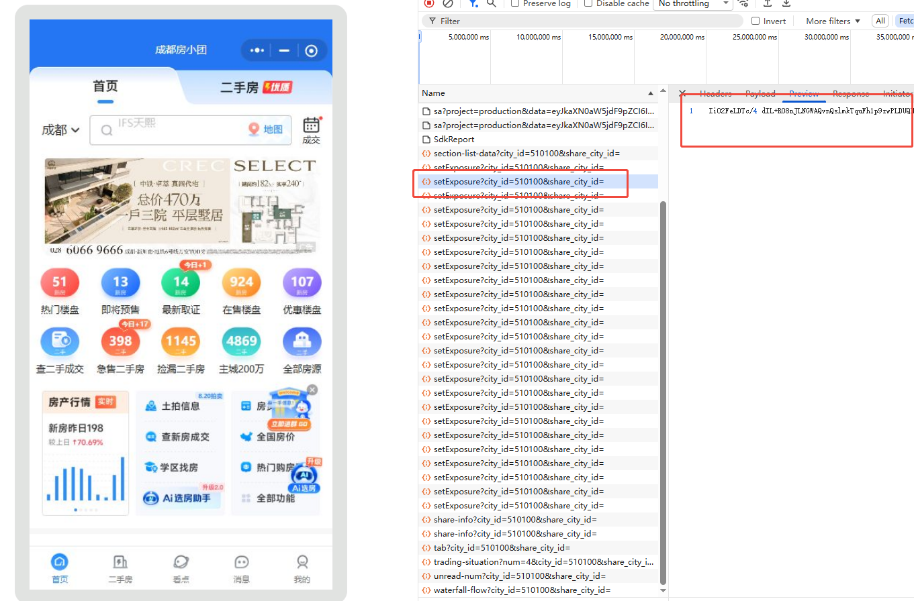

---

## 如何对微信小程序进行抓包

> - Windows 10 + PC 微信，WMPF 路径里见过 **25297**
> - [WMPFDebugger](https://github.com/evi0s/WMPFDebugger) 已能打出 `miniapp client connected`
> - CDP：`ws://127.0.0.1:62000`；脚本侧 Node / Python 均可
> - 独立 API 仓库：https://github.com/code-corey/fxt-miniprogram-search-api


[上一篇](/Notes/projects/wechat-miniprogram-fangxiaotuan-mitm-retrospective)把 Proxifier + mitm 搭齐了，结论也很硬：外层几乎全是 **mmtls**，装 CA 也解不出业务 JSON。换上 [WMPFDebugger](/Notes/tools/wmpfdebugger) 之后，又容易掉进两种「看起来有戏、其实还没碰到明文」的坑：

1. 浏览器打开 devtools://devtools/bundled/inspector.html?ws=127.0.0.1:62000
2. Network 里偶见 `fxt-api.huanjutang.com`，响应仍可能是业务加密，所以根本就无法从网页请求链接中看到什么数据
3. Elements 里的 `page-frame.html` 壳上也几乎没有单价字段。



所以爬虫进度就陷入了停滞。接口的返回结果是加密的，页面上也无法获取什么内容，没法使用Dom解析。

所以，我们得换一种思路才行，我们的任务是获取数据，那么在什么地方能够获到数据呢？

 

```

┌─────────────────────────────────────────────────────────────┐
│                     脚本整体结构                              │
├─────────────────────────────────────────────────────────────┤
│  1. CDP 基础层 (CdpSession, evaluate)                        │
│     └── 封装 WebSocket 通信，发送 CDP 命令                     │
│                                                            │
│  2. 数据采集层 (get_current_page_info)                       │
│     └── 执行 JS，从页面内存读取数据                             │
│                                                            │
│  3. 数据处理层 (print_page_info, extract_project_info)       │
│     └── 格式化打印、提取结构化数据                              │
│                                                            │
│  4. 输出层 (save_as_markdown)                               │
│     └── 保存为 JSON / Markdown                              │
│                                                            │
│  5. 主流程 (main)                                           │
│     └── 协调各层执行                                         │
└─────────────────────────────────────────────────────────────┘
```


这里需要讲解一下，微信小程序本身的原理才行。工具让微信小程序可以有Dev Tools，可以查看上下文。


---

## 思路1：先换脑——明文住在哪一层？

既然通过无法通过接口进行获取数据，能否从微信小程序本身的特性入手

```text
PC 微信小程序两层车间：

  渲染层（webview / page-frame）
    → DevTools Elements 里那层壳
    → 业务字段很少，别在这里找单价

  逻辑层（appservice）
    → 跑 JS、发请求、解密、填 Vue vm / data
    → 明文业务对象住在这里  ← 我们要进的门
```

WMPFDebugger 在中间干的事也可以缩成三步（细节见[工具篇](/Notes/tools/wmpfdebugger)）：

1. 按 WMPF 版本偏移注入，强制打开远程调试；
2. 把微信私有调试协议翻译成标准 **Chrome DevTools Protocol**；
3. 在本机露出 `ws://127.0.0.1:62000`。

你之后写的每一行脚本，本质都是同一句 CDP：

```text
Runtime.evaluate({
  expression: "...跑在小程序逻辑层的 JS...",
  contextId: <appservice 的 id>,
  returnByValue: true
})
```

简单来说，就是我们可以借助WMPFDebugger这个工具，往微信小程序 发送一些请求。


---

## 雪球 2：连上 62000，并认出哪个「房间」才是办事车间

这一球只加两件事：**连上调试口**，以及**选对要说话的那间 JS 房间**。  
先把两个术语用大白话钉死，再动手。

### 2.1 CDP 是什么？（遥控器说明书）

**CDP = Chrome DevTools Protocol（Chrome 开发者工具协议）。**

平时你在 Chrome 里按 F12，点 Elements / Console / Network，并不是「魔法」，而是 DevTools 界面在跟浏览器内核说话。说的那套语言就叫 CDP：一条条 JSON 命令，例如：

- 「执行这段 JS」→ `Runtime.evaluate`
- 「打开网络监听」→ `Network.enable`

WMPFDebugger 干的事，是给 PC 微信小程序也开出**同一套遥控口**，默认挂在本机：

```text
ws://127.0.0.1:62000
```

对照表：

| 角色 | 类比 | 在本故事里是谁 |
|------|------|----------------|
| 你的 Python / Node 脚本，或 Chrome DevTools | 拿遥控器的人 | 客户端 |
| **CDP** | 遥控器和电器之间的协议 / 语言 | 怎么下命令 |
| `ws://127.0.0.1:62000` | 墙上的插座 | WebSocket 地址 |
| 小程序运行时 | 被遥控的电器 | WMPF 里的 JS 环境 |

所以：**CDP 不是微信私有发明**，是 Chromium 系通用的调试协议。连上 62000，就能用和 Chrome 一样的方式对小程序说：*请执行这段 JS，把返回值给我。*

### 2.2 execution context 是什么？（JS 房间 / 门牌号）

**execution context = 一段 JS 正在里面跑的「房间」（沙箱）。**

同一个 `62000` 插座后面，往往不止一间房。连上之后，里面可能同时有：

```text
连上 ws://127.0.0.1:62000 之后，里面可能有：

  房间 1：某个页面壳（渲染层 webview）
  房间 2：另一个 webview
  房间 3：appservice 逻辑层   ← 有 wx、getCurrentPages、业务 vm
  房间 4：插件 / 其它…
```

每间房有一个编号，CDP 里叫 **`contextId`**（本机冒烟时曾是 `3`）。

关键点只有一句：

> **你在错误的房间里执行 `getCurrentPages()`，可能根本没有这个函数，或页面栈是空的。**  
> 业务明文（后面的 `searchProjectList`、`infoSections`）住在**逻辑层那一间**里。

因此雪球 2 不是「连上 Wi‑Fi 就完了」，而是：

```text
1. 插上插座：连 ws://127.0.0.1:62000
2. 发现里面有很多 JS「房间」（execution context）
3. 挨个敲门，找出带业务能力的「办事车间」（appservice）
4. 记住门牌号 contextId
5. 以后 Runtime.evaluate 都对着这扇门说话
```

### 2.3 怎么认出办事车间？

探针很土：从 `contextId = 1, 2, 3…` 挨个问同一段 JS——这间房有没有这些东西：

- `typeof wx !== 'undefined'`
- `typeof getApp === 'function'`
- `typeof getCurrentPages === 'function'` 且 `pages.length > 0`

哪个答「有」，就写入 `config.local.json`，后面所有 evaluate 都带上这个编号。

本机冒烟输出（摘要）：

```text
[WX_OK] contextId=3 hasWx=true getApp=function pages=2
已选用 contextId=3
```

当场效果：

- 连得上 `ws://127.0.0.1:62000`；
- 知道以后所有 `Runtime.evaluate` 都带上 **`contextId: 3`**（小程序冷启动后编号会变，要重新 probe）。

一句话收束：

> **CDP = 怎么跟调试目标说话；execution context = 说话时你进的是哪一间 JS 房间；contextId = 那间房的门牌号。**

### 2.4 用 Python 把每个房间敲一遍（可直接跑）

前置：WMPFDebugger 已起、房小团已连接、本机已 `pip install websockets`。  
下面这段**不依赖**完整业务仓库，专门用来列出：每个 `contextId` 里有没有 `wx`、页面栈有多长——帮你亲眼看见「很多房间，只有一间是办事车间」。

```python
# list_contexts.py
# 用法：python list_contexts.py
# 作用：连上 ws://127.0.0.1:62000，扫描 contextId=1..20，打印每间房的探测结果

import asyncio
import json
import websockets

CDP_URL = "ws://127.0.0.1:62000"
MAX_ID = 20

# 在「某一间房」里执行的探针：看看这间有没有办事能力
PROBE_JS = """
(function () {
  var hasWx = typeof wx !== 'undefined';
  var getAppType = typeof getApp;
  var pages = -1;
  if (typeof getCurrentPages === 'function') {
    try { pages = getCurrentPages().length; } catch (e) { pages = -1; }
  }
  var ok = hasWx && getAppType === 'function' && pages > 0;
  return { ok: ok, hasWx: hasWx, getAppType: getAppType, pages: pages };
})()
"""


async def cdp_call(ws, msg_id, method, params):
    """发一条 CDP 命令，等到同 id 的回包。"""
    await ws.send(json.dumps({"id": msg_id, "method": method, "params": params}))
    while True:
        raw = await ws.recv()
        msg = json.loads(raw)
        if msg.get("id") == msg_id:
            return msg


async def main():
    print(f"连接 {CDP_URL} …")
    async with websockets.connect(CDP_URL, max_size=8 * 1024 * 1024) as ws:
        # 打开 Runtime 域（后面才能 evaluate）
        await cdp_call(ws, 1, "Runtime.enable", {})

        chosen = None
        print(f"{'contextId':>10}  {'ok':>5}  {'hasWx':>6}  {'getApp':>10}  pages  备注")
        print("-" * 72)

        next_id = 2
        for context_id in range(1, MAX_ID + 1):
            next_id += 1
            resp = await cdp_call(
                ws,
                next_id,
                "Runtime.evaluate",
                {
                    "expression": PROBE_JS,
                    "contextId": context_id,   # ← 门牌号：进哪一间房
                    "returnByValue": True,
                    "awaitPromise": False,
                },
            )

            # 房间不存在时，CDP 常回 error
            if resp.get("error"):
                err = resp["error"]
                msg = err.get("message", err) if isinstance(err, dict) else err
                print(f"{context_id:>10}  {'—':>5}  {'—':>6}  {'—':>10}  {'—':>5}  无此房间 ({msg})")
                continue

            result = (resp.get("result") or {}).get("result") or {}
            # 该房间执行抛错 / 没有 returnByValue
            if (resp.get("result") or {}).get("exceptionDetails"):
                print(f"{context_id:>10}  {'—':>5}  {'—':>6}  {'—':>10}  {'—':>5}  执行异常")
                continue

            info = result.get("value") or {}
            ok = bool(info.get("ok"))
            note = "← 办事车间候选" if ok else ""
            if ok and chosen is None:
                chosen = context_id
                note = "← 选用这个 contextId"
            print(
                f"{context_id:>10}  {str(ok):>5}  {str(info.get('hasWx')):>6}  "
                f"{str(info.get('getAppType')):>10}  {str(info.get('pages')):>5}  {note}"
            )

        print("-" * 72)
        if chosen is None:
            print("没有找到可用的办事车间。检查：调试器、小程序是否已连接、是否关了 Clash。")
        else:
            print(f"结论：以后 Runtime.evaluate 请带 contextId={chosen}")
            print("仓库里等价命令：python -m fxt_api --probe")


if __name__ == "__main__":
    asyncio.run(main())
```

你可能会看到类似输出（数字以本机为准）：

```text
连接 ws://127.0.0.1:62000 …
 contextId     ok   hasWx      getApp  pages  备注
------------------------------------------------------------------------
         1  False   False   undefined     -1
         2  False   False   undefined     -1
         3   True    True    function      2  ← 选用这个 contextId
         4      —       —           —      —  无此房间 (...)
         ...
结论：以后 Runtime.evaluate 请带 contextId=3
```

读表的方式：

| 列 | 含义 |
|---|---|
| `contextId` | 房间门牌号 |
| `ok` | 是否像办事车间（有 wx + getApp + 页面栈） |
| `hasWx` / `getApp` / `pages` | 这间房里探针看到的细节 |
| 无此房间 | 这个编号当前不存在，跳过即可 |

完整仓库里已经封装好了同一逻辑，不必每次手抄：

```powershell
cd <fxt-miniprogram-search-api 仓库目录>
python -m fxt_api --probe
# 或 HTTP：POST http://127.0.0.1:8787/probe
```

雪球 7 的 `POST /probe` 干的就是「敲门认门牌」。

若连不上：先查 Clash 是否开着、Chrome DevTools 是否占着 62000、小程序是否已 `miniapp client connected`——这三项比「改代码」更常是真凶。

---

## 雪球 3：先问「现在站在哪一页」，再谈读写

这一球只加：**读页面栈**。不加搜索、不 dump 单价。  
雪球 2 找到了「办事车间」这间房；进门之后还要问：**你人站在哪一层楼？**

### 3.1 页面栈是什么？（一摞纸）

**页面栈 = 小程序里「你一路点进来、现在叠在一起的那些页面」，像一摞纸。**

```text
打开首页          → 纸上只有 1 张
再点进楼盘主页    → 盖第 2 张
再点进详细信息    → 盖第 3 张（最上面 = 你屏幕上正在看的）
点一次返回        → 撕掉最上面那张，露出下面那张
```

微信官方 API：

```js
getCurrentPages()  // 返回从「最早打开」到「当前屏」的页面数组（底 → 顶）
```

| 概念 | 是什么 | 从哪来 |
|------|--------|--------|
| **路由表** | 小程序*声明过*的全部页面路径（像商场目录） | `__wxConfig.pages`（往往几百条） |
| **页面栈** | *此刻*实际打开了哪些页、谁在最上面（像你走进了哪几层） | `getCurrentPages()` |

目录再全，也不代表你人在那一层。**接口能不能调通，看的是栈顶是谁**，不是路由表有多厚。

### 3.2 这段代码在干什么？

在逻辑层（带上雪球 2 的 `contextId`）执行：

```js
var pages = getCurrentPages();           // 整摞纸：从底到顶
var top = pages[pages.length - 1];       // 最上面那张 = 当前页
({
  n: pages.length,                       // 一共叠了几层
  routes: pages.map(p => p.route || p.__route__),  // 每一层的路径名
  top: top.route || top.__route__        // 栈顶路径（当前屏）
});
```

逐行：

| 写法 | 含义 |
|------|------|
| `getCurrentPages()` | 取出整摞页面对象 |
| `pages[pages.length - 1]` | 数组最后一项 = 栈顶 = 你正在看的页 |
| `n` | 叠了几层 |
| `routes` | 从底到顶每一层的路由字符串 |
| `top` | **当前页**路由——后面搜 / dump 都默认对着它 |

详情态本机实拍过类似：

```text
n = 2
routes =
  subpackages/project/pages/index          // 底层：楼盘主页
  subpackages/project-info/pages/index     // 栈顶：详细信息 ← 屏幕上就是它
top =
  subpackages/project-info/pages/index
```

画成纸摞：

```text
        ┌─────────────────────────────────────┐
  栈顶 → │ project-info/pages/index  详细信息  │  ← 屏幕 / $vm 在这里
        ├─────────────────────────────────────┤
  更早 → │ project/pages/index       楼盘主页  │
        └─────────────────────────────────────┘
```

### 3.3 为什么要先问栈顶？

因为不同页上挂的方法、数据不一样：

| 你要干什么 | 栈顶最好是 | 上面才有 |
|---|---|---|
| 读单价 / 拿地价 | `subpackages/project-info/pages/index` | `infoSections`、`reload` |
| 按小区名搜列表 | `subpackages/search/pages/result` | `keywordSearch`、`searchProjectList` |

栈顶错了：不是 CDP 坏了，是「进对了房间，却站错了楼层」——雪球 5 踩的坑，有一半都是这个。

也可以从 CDP 喊一句切页（联调 API 时用过）：

```js
wx.navigateTo({ url: '/subpackages/search/pages/result' });
```

`navigateTo` = 再盖一张纸；不要和 `redirectTo`（换掉当前这张）搞混。

当场效果：你知道接下来该 dump 详情，还是该去搜名单；不再对着错误页面空跑。

---

## 雪球 3.5：实战回放——你丢给我 `devtools://...?ws=127.0.0.1:62000`，我到底怎么捞的？

对话里出现过这个地址：

```text
devtools://devtools/bundled/inspector.html?ws=127.0.0.1:62000
```

它和雪球 2 的插座是**同一根线**：浏览器 DevTools 前端通过 `ws=127.0.0.1:62000` 连上 WMPFDebugger。  
当时你让我「分析当前 vm / 路由 / 页面栈，再把其它也扫一遍」。**我并没有靠在 Chrome 里人肉点 Elements**——原因和做法如下。

### 为什么不盯着 Chrome DevTools 面板抠？

1. 本机常出现 ***The tab is inactive***，面板半死不活；
2. Chrome 占着 62000 时，脚本端 CDP 会抢连接、互相踢；
3. Elements 里多半是 `page-frame.html` **渲染层壳**，单价不在 DOM 树上；
4. 要批量扫「所有 context / 所有注册路由 / vm 字段名」，脚本比人手点快、可落盘。

所以实际路径是：

```text
同一个 ws://127.0.0.1:62000
        │
        ├─ Chrome DevTools（可选用，但别和脚本同时占）
        │
        └─ Node / Python CDP 客户端  ← 我们主要用这个
              Runtime.evaluate(表达式, contextId)
```

本地脚手架在 `fxt-runtime-scraper` 里（API 仓库是后抽的搜索薄层），关键脚本：

| 脚本 | 干什么 |
|------|--------|
| `npm run probe` / `python -m fxt_api --probe` | 扫所有 `contextId`，认办事车间 |
| `node src/dump-routes.js` | 扫**页面栈** + **全站注册路由表** |
| `node src/dump-vm.js` | dump **栈顶** `$vm` / `_data` / `infoSections` |

产物曾落到：`data/debug/routes_dump.json`、`data/debug/vm_dump.json`。

### 第一步：扫「所有房间」（execution context）

和雪球 2.4 同一思路：`contextId = 1..N` 轮询探针。本机结果是 **`contextId=3`** 带 `wx` + 页面栈。  
后面所有 dump **都固定对着 3 号房说话**——否则你在渲染层房间里找 `getCurrentPages`，要么没有，要么不是业务栈。

### 第二步：扫「页面栈 + 全站路由」（你要的路由 / 栈）

`dump-routes.js` 注入的逻辑层表达式，核心就两块：

**A. 当前页面栈（此刻叠了哪些纸）**

```js
var pages = getCurrentPages();
pages.map(function (p, i) {
  var vm = p.$vm || p;
  var d = vm._data || vm.$data || {};
  return {
    index: i,
    route: p.route || p.__route__,
    options: p.options,           // 例如 project_id=42605
    projectId: d.projectId,
    projectName: d.projectInfo && d.projectInfo.name,
    dataKeys: Object.keys(d).slice(0, 40),
    methods: ['reload','searchSubmit','loadNext','getProjectDetail']
      .filter(function (n) { return typeof vm[n] === 'function'; })
  };
});
```

本机详情态实拍过：

```text
pageStackLen = 2
[0] subpackages/project/pages/index       // 楼下：楼盘主页，有 getProjectDetail
[1] subpackages/project-info/pages/index  // 栈顶：详细信息，有 reload；projectId=42605
topRoute = subpackages/project-info/pages/index
```

**B. 全站已注册路由（商场目录，不是当前栈）**

同一次 evaluate 里再读 `__wxConfig`：

```js
__wxConfig.pages          // 主包/已展开路径列表
__wxConfig.entryPagePath  // 入口
// 再拼 subPackages，得到 allRegisteredRoutes（本机曾扫到约 500+ 条）
```

这样就能回答两类完全不同的问题：

| 问题 | 看哪份数据 |
|------|------------|
| **现在**人在哪一页？ | `pageStack` / `topRoute` |
| 小程序**一共声明了**哪些页？（搜索页路径叫什么？） | `allRegisteredRoutes` / `__wxConfig.pages` |

「扫描所有其它」在这一步的含义就是：**把目录整本倒出来**，从中标出和业务相关的，例如：

- `subpackages/search/pages/index`、`.../result`
- `subpackages/project/pages/index`
- `subpackages/project-info/pages/index`（以及 tags、housing-database…）
- 以及 auction / map / ershou 等一堆分包（知道有，但不一定要爬）

### 第三步：扫「当前栈顶的 vm」（你要的 vm）

`dump-vm.js` 在**同一 contextId** 里对栈顶页做结构摘要：

```js
var pages = getCurrentPages();
var page = pages[pages.length - 1];
var vm = page.$vm || page;
var data = vm._data || vm.$data || {};

// 大致会收集：
// - route / pageKeys / vmKeys / dataKeys / methodNames
// - projectId、projectInfo、infoSections（含 rows 标题）
// - 把 infoSections 展平打成 flat（楼盘名、参考单价、拿地价格…）
// - $children 摘要（后面搜列表时会在子组件上找到 searchSubmit）
```

本机在「城西金茂晓棠」详情栈顶时，dump 直接给出：

```text
projectId = 42605
projectInfo.name = 城西金茂晓棠
infoSections = 基本信息 / 销售信息 / 建筑概况 / 物业信息
flat.参考单价 = 住宅22189-25782元/㎡
flat.拿地价格 = 13200.00元/㎡（成交楼面地价）
```

**这就是「根据 DevTools 同款 62000 拿到 vm」的真实做法**：不是解析 `devtools://` 这个 URL 本身，而是连它指向的 WebSocket，在逻辑层 `evaluate` 一把。

### 万能 Python 脚本：一次扫完房间 / 页面栈 / 路由 / vm

早期示例需要手填 `CONTEXT_ID=3`，还偏房小团字段。现已收成**万能探针**（任意经 WMPFDebugger 打开的小程序都能用）：

| 能力 | 说明 |
|------|------|
| 自动扫 `contextId` | 列出每间房的 `hasWx` / `pages`，自动选办事车间 |
| 页面栈 | 每一层 `route` / `options` / `dataKeys` / 方法提示 |
| 全站路由 | `__wxConfig` 展开后的完整 `registeredRoutes` |
| 栈顶 vm | 标量预览、方法名、子树里的 `keywordSearch`/`searchSubmit`/`reload`… |
| 顺手展平 | 若存在通用 `infoSections` 结构，额外给出 `flatFromInfoSections` |

仓库文件：

- https://github.com/code-corey/fxt-miniprogram-search-api/blob/main/dump_wmpf.py  
- 实现：`fxt_api/dump_all.py`

```powershell
cd <clone 后的 fxt-miniprogram-search-api>
python -m pip install -r requirements.txt

# 默认连 ws://127.0.0.1:62000，自动 probe，写出 dump_wmpf.json
python dump_wmpf.py

# 常用参数
python dump_wmpf.py --cdp-url ws://127.0.0.1:62000 -o out.json
python dump_wmpf.py --context-id 3                 # 已知门牌可跳过盲扫结果里的选用逻辑仍会记录
python dump_wmpf.py --route-filter search          # 终端额外打印含 search 的注册路由
python -m fxt_api --dump --route-filter project-info
```

输出 JSON 骨架（万能，不绑死业务名）：

```json
{
  "cdpUrl": "ws://127.0.0.1:62000",
  "chosenContextId": 3,
  "contexts": [
    { "contextId": 3, "ok": true, "hasWx": true, "getAppType": "function", "pages": 2 }
  ],
  "dump": {
    "topRoute": "subpackages/project-info/pages/index",
    "pageStack": [ { "index": 0, "route": "...", "dataKeys": [], "methods": [] } ],
    "registeredCount": 563,
    "registeredRoutes": [ "pages/index/index", "subpackages/search/pages/result", "..." ],
    "topVm": {
      "dataKeys": ["projectId", "infoSections", "..."],
      "methods": ["reload", "..."],
      "scalarPreview": {},
      "flatFromInfoSections": { "参考单价": "...", "拿地价格": "..." },
      "interestingComponents": []
    }
  }
}
```

对照你当时的三个问题：

| 你要的 | 看 JSON 哪里 |
|--------|----------------|
| 有哪些 execution context / contextId | `contexts` + `chosenContextId` |
| 页面栈 / 当前路由 | `dump.pageStack` / `dump.topRoute` |
| 扫所有其它页面路径 | `dump.registeredRoutes` |
| 当前 vm | `dump.topVm` |

前置不变：WMPFDebugger 已连、关 Clash、**别让 Chrome DevTools 占着 62000**。

### 三步串起来（对照你的原话）

```text
你给的：devtools://inspector.html?ws=127.0.0.1:62000
          │
          ▼
我做的：  ① 扫全部 contextId     → 锁定办事车间（如 3）
          ② dump-routes           → 页面栈 + 全站路由表
          ③ dump-vm               → 栈顶 $vm / infoSections / flat
          ④（后续雪球）在搜索页再 dump 组件字段
               → 发现 searchProjectList / keywordSearch
```

命令备忘：

```powershell
# 万能一把梭（推荐）
python dump_wmpf.py -o dump_wmpf.json --route-filter search

# 或 Node 脚手架分步
npm run probe
node src/dump-routes.js
node src/dump-vm.js
```

当场效果：后面雪球 4～6 不是猜字段名，而是**对着 dump 出来的钥匙串**（`reload`、`infoSections`、`keywordSearch`、`searchProjectList`）逐个试。

---

## 雪球 4：在详情页 dump `vm`——单价原来一直躺在桌上

这一球只加：**读栈顶 `$vm` 里的业务字段**（雪球 3.5 的 dump-vm 已经演示过怎么捞；这里钉死「读到了什么」）。  
假设你已经手动点进任意楼盘详情（例如城西金茂晓棠）。

关键字段一次认齐：

| 字段 / 方法 | 是什么 |
|---|---|
| `projectId` | 如 `42605` |
| `projectInfo` | 名称、tags、sections |
| **`infoSections`** | 基本信息 / 销售 / 建筑 / 物业——分行明文 |
| `reload` | 改 `projectId` 后再调用，可换盘刷新 |

「城西金茂晓棠」本机从 `infoSections` 展平后的摘录：

```text
楼盘名     城西金茂晓棠
参考单价   住宅22189-25782元/㎡
拿地时间   2025-11-20
拿地价格   13200.00元/㎡（成交楼面地价）
楼盘地址   成都市武侯区花龙一路
```

当场效果：

- **证明路径成立**：单价 / 拿地价不必解包，逻辑层已经有明文；
- 后续「按 ID 拉详情」的剧本也就清楚了：改 `projectId` → 调 `reload` → 再读 `infoSections`。

种子：搜索 API 暂时只做「按名找 ID」；详情可以按同一 CDP 模式继续滚成第二个接口。

---

## 雪球 5：第一次搜——为什么「金茂」变成了「天元府」？

这一球故意只做「半成品」：停在搜索结果页，设关键词，调你以为对的方法，读你以为对的列表。

搜索页组件上同时躺着好几份名单（dump 方法名时能看到）：

| 名字 | 它实际是什么 |
|---|---|
| `projectList` | 默认「附近 / 最新」流 |
| `searchProjectList` | 关键词结果（名字常带 HTML 高亮） |
| `keywordSearch` | 真正触发关键词搜索（带 debounce） |
| `searchSubmit` / `onSubmit` | 容易误触；曾把结果清空 |

错误路径（本机真实踩过）：

1. 只调 `searchSubmit`，`inputVal` 已经变成「城西金茂晓棠」；
2. 采集时读的是 **`projectList`**；
3. 返回一串无关项：天元府、锦里云邸、各种「××亩」土拍地块……

调试采样里甚至出现过：`inputVal` 正确，但连续 8 秒 `projectList` 前几名纹丝不动——**关键词写进了输入框，名单却还是附近流**。

当场效果（这一球的「成功」就是把失败看清楚）：

- 你知道「能连上 CDP」≠「搜对了」；
- 下一球只改两处：触发方法 + 读哪份名单。

另一次误触 `onSubmit` / `loadSearchData`，会把 `searchProjectList` 直接清成 `0`——所以雪球 6 只碰 `keywordSearch`。

---

## 雪球 6：换成 `keywordSearch`，改读 `searchProjectList`

这一球只改触发与采集，其它不动：

```text
1. inputVal = 关键词
2. 顺手写下 params.search_data.keyword（若存在）
3. 调用 keywordSearch(关键词)   ← 不是 searchSubmit
4. 等 debounce + 网络返回
5. 读 searchProjectList         ← 不是 projectList
6. name 做 stripHtml（去掉 <span style=...> 高亮）
```

本机用「城西金茂晓棠」试触发后，`searchProjectList` 前几名变成：

```text
城西金茂晓棠
东城金茂晓棠
东城金茂晓棠二期
青羊金茂锦棠
东城金茂锦棠
```

修采集后首条：

| id | name | avg_price | area |
|---|---|---|---|
| **42605** | **城西金茂晓棠** | 22189-25782元/㎡ | 武侯区 |

当场效果：搜索链路闭环。  
和雪球 4 拼起来就是完整业务：`搜名字 → 得 id →（可选）进详情 reload → 抄 infoSections`。

---

## 雪球 6.5：有了 `scan_routes` 结果，怎么「调用接口」返回数据？

先看一份真实扫描摘要（和你本机跑出来的同类）：

```text
chosenContextId = 3
entryPagePath   = pages/index/index.html
topRoute        = subpackages/project-info/pages/index
pageStackLen    = 2
  [0] subpackages/project/pages/index       name=城西金茂晓棠 id=42605
  [1] subpackages/project-info/pages/index  name=城西金茂晓棠 id=42605
registeredCount = 563
  … 其中有 subpackages/search/pages/result 等
```

### 6.5.1 扫描结果本身不是业务数据

| 扫描给你的 | 它**是**什么 | 它**不是**什么 |
|------------|--------------|----------------|
| `chosenContextId` | 以后说话的门牌号 | 小区列表 |
| `pageStack` / `topRoute` | **现在**人站在哪一页 | 全站业务 JSON |
| `registeredRoutes`（563 条） | 小程序**声明过**的页面路径目录 | 已经打开、已经加载好的数据 |
| `entryPagePath` | 冷启动入口 | 当前查询结果 |

一句话钉死：

> **`scan_routes` = 地图 + GPS。**  
> 地图告诉你「搜索结果页叫什么、详情页叫什么」；GPS 告诉你「人现在在详情页」。  
> **真正的小区列表 / 单价，还要走到那一页，让小程序自己请求，再从 vm 抄出来。**

所以不存在「对着 563 条路由直接 HTTP 打微信后端拿明文」这一步——后端包可能仍加密；我们走的是 **CDP → 逻辑层方法 → vm 明文**。

专用命令（只扫栈 + 路由，比万能 dump 更轻）：

```powershell
python scan_routes.py
python scan_routes.py --filter search -o routes_scan.json
# 或
python -m fxt_api --scan-routes --filter search
```

仓库：https://github.com/code-corey/fxt-miniprogram-search-api

### 6.5.2 利用扫描结果的标准四步（查询闭环）

把「用户想查一个小区名」拆成四步。每一步都用扫描结果里的某一格。

```text
① 查地图（registeredRoutes）
     找到能力对应的页面路径
        搜索 → …/search/pages/result
        详情 → …/project-info/pages/index

② 看 GPS（pageStack / topRoute）
     栈顶是不是目标页？
        是 → 下一步
        否 → CDP 里 wx.navigateTo / 人手点过去，再扫一次确认

③ 在栈顶调「小程序自己的方法」（不是你自己拼业务 HTTPS）
        搜索页：keywordSearch(关键词)
        详情页：改 projectId + reload()

④ 读 vm 里已经解密的字段，组装成你的 API 响应
        搜索：searchProjectList → [{id,name,price…}]
        详情：infoSections → flat（参考单价、拿地价格…）
```

对照你这份扫描：

| 你想做的事 | 扫描怎么用 | 中间必须补上的动作 | 最后读哪里 |
|------------|------------|--------------------|------------|
| **按名搜索** | 在 563 条里确认有 `subpackages/search/pages/result` | 但 `topRoute` 现在是 **project-info**，要先切到搜索结果页 | `searchProjectList` |
| **读当前盘单价** | `topRoute` 已是 project-info，栈里还有 projectId=42605 | **不用切页**，直接读栈顶 vm | `infoSections` / `flat` |
| **换另一个 id 的详情** | 路由仍用 project-info | `vm.projectId = 新id` → `reload()` → 再读 | 同上 |

### 6.5.3 「调用接口」到底调用的是谁？

这里最容易混：口语里的「调接口」有两层。

```text
层 A —— 你对外提供的接口（Python FastAPI）
        GET /search?q=城西金茂晓棠
        ↑ 浏览器 / 别的程序打这个

层 B —— 小程序对它自己后端的 HTTPS
        例如 fxt-api.…（可能仍加密）
        ↑ 只有小程序逻辑层会发；我们一般不直接仿造

层 C —— CDP 调试调用（Runtime.evaluate）
        在 contextId=3 里执行：keywordSearch / reload / 读 vm
        ↑ 本方案真正动手的地方
```

**查询返回数据的主路径是 A ← C，不是 A ← 直接打 B。**

细节时序（搜索为例）：

```text
客户端                  FastAPI(/search)              CDP :62000              小程序逻辑层
   |                         |                            |                        |
   |  GET ?q=锦江城市花园三期  |                            |                        |
   |------------------------>|                            |                        |
   |                         |  connect + Runtime.enable  |                        |
   |                         |--------------------------->|                        |
   |                         |  evaluate: 当前 topRoute?  |                        |
   |                         |--------------------------->|  getCurrentPages()     |
   |                         |  若不是 search/result      |                        |
   |                         |  evaluate: navigateTo(...) |----------------------->|
   |                         |--------------------------->|  打开搜索结果页         |
   |                         |  evaluate: keywordSearch(q)|----------------------->|
   |                         |                            |     小程序自己请求后端  |
   |                         |                            |     （加密/解密它自己做）|
   |                         |  轮询 evaluate: 读列表     |<-----------------------|
   |                         |--------------------------->|  searchProjectList     |
   |                         |  JSON {items:[…]}          |                        |
   |<------------------------|                            |                        |
```

要点：

1. **FastAPI 不解析业务密文**；它只编排 CDP。  
2. **必须栈顶对**：你扫描时停在 project-info，若直接 `/search` 而不切页，就会找不到 `keywordSearch` 或读到错误的 `projectList`。  
3. **返回给调用方的 JSON**，来自逻辑层内存，字段在雪球 6 / 4 已经验过。

### 6.5.4 两种查询剧本（把扫描用满）

**剧本 S —— 搜索列表（对应 `GET /search`）**

1. `scan_routes` / 已知地图：目标路由 = `subpackages/search/pages/result`  
2. 若 `topRoute !=` 该路径 →

```js
wx.navigateTo({ url: '/subpackages/search/pages/result' });
// 或人手打开搜索结果页
```

3. CDP：`keywordSearch(q)`（雪球 6）  
4. CDP：读 `searchProjectList`，`stripHtml(name)`  
5. 你的接口返回：

```json
{ "keyword": "…", "route": "…/search/pages/result", "count": N, "items": [ { "id", "name", "…" } ] }
```

**剧本 D —— 详情明文（单价 / 拿地价）**

1. 地图：目标 = `subpackages/project-info/pages/index`  
2. 你当前扫描已经满足栈顶 = project-info，且 hint id=42605 → **可直接读**  
3. 若要换盘：CDP 设 `projectId` + `reload()`（雪球 4）  
4. 读 `infoSections` → `flat`  
5. 将来可封成 `GET /project/{id}`（仓库里搜索已封，详情可按同一模式再滚一球）

### 6.5.5 和「563 条路由」的正确关系

563 条的价值是**选型与排障**，不是循环 563 次去爬：

- 用 `--filter search` 快速确认搜索页真实路径叫 `…/result` 而不是别的；  
- 用 `pageStack` 解释「为什么接口 503 / 空列表」——往往是栈顶错了；  
- 新能力（土拍、二手）先在目录里找路由，再 dump 该页 vm 找方法名，而不是猜 URL。

### 6.5.6 最小心智模型（背下来）

```text
scan_routes  →  知道「去哪一页、人在哪」
dump_wmpf    →  知道「这一页有哪些方法/字段」
evaluate 调方法 + 读 vm  →  真正拿到明文
FastAPI      →  把上面三步包成别人会用的 HTTP
```

你这份扫描已经说明：门牌 3 可用、人在详情、目录里有搜索页。  
要「查询返回列表」，差的不是再扫一遍，而是 **把栈顶切到 search/result，再走雪球 6 + 雪球 7**。

---

## 雪球 7 🧗：把「抄小票」封成一条 HTTP

这一球只加封装：把雪球 6.5 的剧本 S 收成 HTTP。代码在独立仓库：

https://github.com/code-corey/fxt-miniprogram-search-api

模块怎么长（每层只干一件事）：

```text
fxt_api/
  cdp.py         # WebSocket 说 CDP
  exprs.py       # 要注入的 JS 字符串
  probe.py       # 雪球 2：选 contextId
  search.py      # 雪球 6：keywordSearch + 采集
  api_server.py  # FastAPI 门面
  config.py      # cdpUrl / contextId / 延迟
```

起服务：

```powershell
cd E:\MyGithub\fxt-miniprogram-search-api   # 或你的 clone 路径
python -m pip install -r requirements.txt
python -m fxt_api --probe
uvicorn fxt_api.api_server:app --host 127.0.0.1 --port 8787
```

| 方法 | 路径 | 对应前面哪一球 |
|---|---|---|
| GET | `/health` | 进程还活着 |
| POST | `/probe` | 雪球 2 |
| GET | `/search?q=小区名` | 雪球 6.5 剧本 S + 雪球 6 |

一次 `GET /search?q=城西金茂晓棠` 在服务器内部滚过的路径：

```text
浏览器
  → FastAPI 解出 q
  → 读 config（缺 contextId 就 auto_probe）
  → connect ws://127.0.0.1:62000
  → Runtime.enable
  → evaluate(PAGE_INFO)              # 雪球 3
  → evaluate(keywordSearch(q))       # 雪球 6
  → 轮询 searchProjectList
  → JSON { keyword, route, count, items[] }
  → 断开 CDP
```

响应形状（示意，字段以实跑为准）：

```json
{
  "keyword": "城西金茂晓棠",
  "route": "subpackages/search/pages/result",
  "count": 20,
  "warning": null,
  "items": [
    {
      "id": "42605",
      "name": "城西金茂晓棠",
      "district": "武侯区",
      "extra": { "avg_price": ["22189-25782元/㎡"], "area": "武侯区" }
    }
  ]
}
```

不启 HTTP 也能滚同一球：

```python
from fxt_api import search_by_name

result = search_by_name("城西金茂晓棠", max_items=50)
for item in result.items:
    print(item.id, item.name, item.extra.get("avg_price"))
```

本地还有更完整的 Node 脚手架 `fxt-runtime-scraper`（含详情 fetch / CSV）。Python 仓库是把**雪球 6**抽成可独立安装的薄层——雪球 4 的详情接口，按同一模式再滚一轮即可。

---

## 整条雪道回顾（出问题对照这张表）

| 你看见的现象 | 多半停在哪一球没滚对 | 先做什么 |
|---|---|---|
| CDP 超时 / 连不上 | 雪球 2 之前 | 关 Clash、关 Chrome DevTools、确认 miniapp connected |
| `Cannot find context` | 雪球 2 | 重新 `--probe` |
| `未找到搜索组件` | 雪球 3 | 栈顶改到 `search/pages/result` |
| 有单价在屏上但脚本读不到 | 雪球 4 | dump `$vm`，读 `infoSections` |
| 关键词对、列表却是附近盘 | 雪球 5→6 | 改用 `keywordSearch` + `searchProjectList` |
| 扫描有路由但 `/search` 仍失败 | 雪球 6.5 | 看 `topRoute` 是否已是 `search/pages/result`；先切页再搜 |
| HTTP 503 | 雪球 7 的前置 | 把异常原文当线索，回到上表 |

合规边界（整条雪道共用）：只整理本机已登录账号正常浏览可见的信息；控制频率；升级微信后 Frida 偏移可能失效；**不要**把 `config.local.json` 和隐私字段推进公开仓库。

---

## 你现在手里有什么

| 产物 | 位置 |
|---|---|
| 本篇（滚雪球版） | `src/Notes/projects/wechat-miniprogram-fangxiaotuan-wmpfdebugger-cdp-runtime.md` |
| mitm 失败复盘 | [房小团抓包复盘](/Notes/projects/wechat-miniprogram-fangxiaotuan-mitm-retrospective) |
| 调试器怎么装 | [WMPFDebugger](/Notes/tools/wmpfdebugger) |
| Python `/search` + `scan_routes` / `dump_wmpf` | https://github.com/code-corey/fxt-miniprogram-search-api |

**相关阅读**

- [《PC 微信小程序抓包复盘：为什么「成都房小团」解不出小区单价》](/Notes/projects/wechat-miniprogram-fangxiaotuan-mitm-retrospective)（路径 A：mitm 为什么死）
- [《WMPFDebugger——让 PC 微信小程序也能用 Chrome DevTools》](/Notes/tools/wmpfdebugger)（怎么装、怎么起）
- [《微信 MMTLS——抓包工具看不见的那条 80 端口连接》](/Notes/tools/wechat-mmtls)
