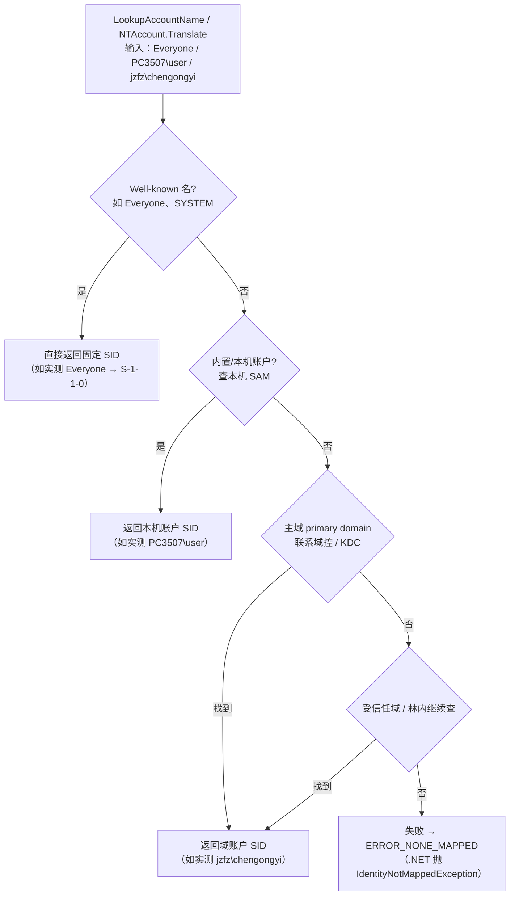

# 第 3 讲：名字 ↔ SID——LSA 去哪里查

### 麻烦

你在程序里、在权限对话框里常看到的是**名字**——`jzfz\chengongyi`、`Everyone`、`PC3507\user`。但 Windows 内部、存在对象（文件 ACL、注册表、服务）上真正记录的是 **SID**（`S-1-5-21-...`）。于是每次「拿名字问系统：这对应谁」、或反过来「拿到一串 SID：这是哪个账户」，都需要一次**翻译**。

谁来做这个翻译？本讲的主角 **LSA**。

### 这一讲讲透：名字与 SID 怎么互译

**LSA（Local Security Authority，本地安全机构）** 是 Windows 的安全子系统，名字↔SID 翻译是它的职责之一。
来源：[Credentials processes in Windows authentication（Microsoft Learn）](https://learn.microsoft.com/en-us/windows-server/security/windows-authentication/credentials-processes-in-windows-authentication)

对应的经典 Win32 API：

| 方向 | API | 作用 |
|------|-----|------|
| 名字 → SID | [`LookupAccountName`](https://learn.microsoft.com/en-us/windows/win32/api/winbase/nf-winbase-lookupaccountnamew) | 输入账户名，返回 SID + 所在域 |
| SID → 名字 | `LookupAccountSid` | 输入 SID，返回账户名 + 域 |

这两个 API 底层都走 LSA 的 `LsaLookupNames` / `LsaLookupSids`。

#### C# / .NET 里怎么写

`.NET` 把它封装成了 `NTAccount.Translate`——**不会自己算 SID**，而是向操作系统发起这次查找：

```csharp
using System.Security.Principal;

// 名字 → SID
var account = new NTAccount(@"jzfz\chengongyi");
var sid = (SecurityIdentifier)account.Translate(typeof(SecurityIdentifier));
Console.WriteLine(sid.Value);   // S-1-5-21-3977539503-3587586693-2971573549-279405

// 反过来：SID → 名字
var name = (NTAccount)sid.Translate(typeof(NTAccount));
Console.WriteLine(name.Value);  // JZFZ\chengongyi
```

找不到会抛 `IdentityNotMappedException`。

> 🖥️ **实机演示**（本机真实跑 `NTAccount.Translate`，名字→SID）：
> ```text
> Everyone          -> S-1-1-0                                   ← well-known（第 1 级命中）
> PC3507\user       -> S-1-5-21-3515524382-1810956650-2183447911-1001  ← 本地账户（SAM，第 2 级）
> jzfz\chengongyi   -> S-1-5-21-3977539503-3587586693-2971573549-279405 ← 域账户（域控，第 3 级）
> SYSTEM            -> S-1-5-18                                  ← well-known 系统账户
> Administrators    -> S-1-5-32-544                              ← well-known 内置组
> ```
>
> 注意一个细节：`PC3507\user`（本地账户）和 `jzfz\chengongyi`（域账户）的 SID 都是 `S-1-5-21-...` 开头，但**中间那三段「机器/域标识」完全不同**——本地账户的标识段是本机自己生成的（`...-3515524382-...`），域账户的标识段是域生成的（`...-3977539503-...`）。**SID 用「谁发的」区分本地还是域，而不是看名字前缀。** 末尾的 RID（`-1001`、`-279405`）才是该账户在自己库里的序号。

---

### LSA 在整机里处在什么位置

下面这张图来自 Microsoft Learn《Credentials processes in Windows authentication》，画的是**客户端上的 LSA 架构**：用户态程序的安全请求如何进入 LSA，再如何落到本机 SAM 或域控。

> 图片来源（Microsoft Learn）：
> [Credentials processes in Windows authentication](https://learn.microsoft.com/en-us/windows-server/security/windows-authentication/credentials-processes-in-windows-authentication)
> 原图文件：`authn_lsa_architecture_client.png`


**怎么读这张图（只盯住「名字↔SID 去哪查」）：**

| 图上区域 | 组件 | 和本讲的关系 |
|----------|------|--------------|
| 最上排 | User Mode App / CredUI / Winlogon / Kernel App | 各种「想问安全子系统」的入口。你的 C# `Translate` 也是**用户态程序**经系统 API 问到 LSA，不必自己懂协议细节。 |
| 黄色大框 | **Local Security Authority**（`Lsasrv.dll` 等） | **翻译与认证的总调度台**。名字↔SID、验身份相关请求先汇聚到这里。 |
| 黄框内一排 SSP | NTLM / Kerberos / Schannel… | 不同场景用的安全支持提供者（SSP）。本讲先记住：**本地账户路径常和 NTLM↔SAM 相关；域账户路径常和 Kerberos / Netlogon↔域控相关**。具体登录协议下一讲展开。 |
| 右侧 | **SAM（`Samsrv.dll`）→ Registry** | **本机账户**的权威库。本地用户名对应的 SID，答案在本机 SAM。 |
| 下侧 | **Netlogon** → **Domain Controller / KDC** | **域账户**要问域。图上可见到 DC / KDC 的网络路径——这就是 `jzfz\chengongyi` 这类域账户名最终落到域控的原因。 |

一句话收束：

> **C# 只负责开口问；本机 LSA 负责调度；本地答案在 SAM，域答案在域控（经 Netlogon 通向 KDC）。**

---

### 翻译时按什么顺序查？

架构图回答了「**经过哪些组件**」；`LookupAccountName` 的 Remarks 还规定了「**按什么优先级试**」。按官方文档顺序，LSA 收到一个名字后依次试：



来源：[LookupAccountName Remarks（Microsoft Learn）](https://learn.microsoft.com/en-us/windows/win32/api/winbase/nf-winbase-lookupaccountnamew)——官方描述查询会查 built-in 账户、本机 SAM，再到域（primary domain 及受信任域）。

四级顺序：

1. **Well-known SID**（如 `Everyone` = `S-1-1-0`、`SYSTEM` = `S-1-5-18`、`Administrators` = `S-1-5-32-544`）——这些是全 Windows 统一的固定值，不查任何库。来源：[Well-known SIDs（Microsoft Learn）](https://learn.microsoft.com/en-us/windows/win32/secauthz/well-known-sids)
2. **内置/本机账户**（本机 SAM）——对应图里 **SAM → Registry**
3. **主域（primary domain）**——对应图里通向 **Domain Controller / KDC** 的路径
4. **受信任域**——继续在林内其它域查

> 💡 **建议用完全限定名**（`域\用户`，如 `jzfz\chengongyi`），比光写 `chengongyi` 更清晰、也更快——LSA 不用猜你指的是本机的还是域里的同名账户。

> 🖥️ **上面的实机演示正好印证了这个顺序**：`Everyone`/`SYSTEM`/`Administrators` 在第 1 级（well-known）就命中、拿到固定 SID；`PC3507\user` 在第 2 级（本机 SAM）命中；`jzfz\chengongyi` 要走到第 3 级（联系域）才拿到。**同一个 `Translate` 调用，背后查的地方完全不同。**

---

### 一个性能细节：LSA 有查找缓存

把名字翻译成 SID 可能要打网络问域控，代价不低。所以 LSA 维护了 **Name/SID 查找缓存**，命中缓存就不必反复打扰域控。
来源：[LSA Lookup performance counters（Microsoft Learn）](https://learn.microsoft.com/en-us/windows-server/identity/ad-ds/lsa-lookup-performance-counters)

> 所以「一次翻译」**可能当场问域控，也可能命中本机缓存**——但无论哪种，都**不是你的 C# 进程自己去读 SAM 或 AD**，而是 LSA 代劳。

---

### 收束

**你现在会了：**

- 名字与 SID 的互译由 **LSA** 负责；Win32 用 `LookupAccountName` / `LookupAccountSid`，.NET 用 `NTAccount.Translate`。
- 查询按四级顺序：**well-known → 本机 SAM → 主域 → 受信任域**；建议用完全限定名 `域\用户`。
- 本地答案在 **SAM**，域答案在 **域控**（经 Netlogon 通 KDC）；翻译有 **LSA 缓存**。
- SID 用「谁发的」区分本地/域，不是看名字前缀——本机账户和域账户的 `S-1-5-21-...` 标识段完全不同。

**下一讲才需要：** 登录时，LSA 不只做翻译，还要**验密码**——过程是怎样的、LSASS 进程又是什么角色。

---

<!-- chapter-nav:start -->
← 上一章：[第 2 讲：SID](./03-sid.md)
· [回书稿索引](../00-index.md)
→ 下一章：[第 4 讲：登录与 LSA](./05-logon-lsa.md)
<!-- chapter-nav:end -->
