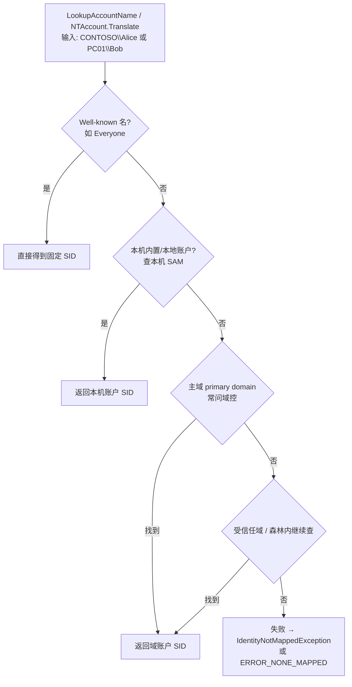

# 第 3 站：名字 ↔ SID——LSA 去哪里查

### 麻烦

你在程序里常写 `CONTOSO\Alice`，但对象上要记的是 SID。需要一次「翻译」。

### 这一站只发明：名字与 SID 的互译

Windows 的 **LSA（Local Security Authority）** 提供 **name ↔ SID 翻译**。  
来源：[Credentials processes - LSA](https://learn.microsoft.com/en-us/windows-server/security/windows-authentication/credentials-processes-in-windows-authentication)

对应的经典 Win32 API 是 **`LookupAccountName`**（名→SID）和 **`LookupAccountSid`**（SID→名）。  
来源：[LookupAccountNameW](https://learn.microsoft.com/en-us/windows/win32/api/winbase/nf-winbase-lookupaccountnamew)

#### C# 里你看到的写法

```csharp
using System.Security.Principal;

var account = new NTAccount(@"CONTOSO\Alice");
var sid = (SecurityIdentifier)account.Translate(typeof(SecurityIdentifier));
Console.WriteLine(sid.Value);   // S-1-5-21-...-xxxx

// 反过来
var name = (NTAccount)sid.Translate(typeof(NTAccount));
Console.WriteLine(name.Value);
```

`.NET` 的 `Translate` **不会自己算 SID**，而是向操作系统发起这次查找；找不到会抛 `IdentityNotMappedException`。

#### 官方架构图：LSA 在整机里处在什么位置

下面这张图来自 Microsoft Learn《Credentials processes in Windows authentication》，画的是**客户端上的 LSA 架构**：凭据/安全请求如何进入 LSA，再如何落到本机 SAM 或域控一侧。

> 图片来源（Microsoft Learn）：  
> [Credentials processes in Windows authentication](https://learn.microsoft.com/en-us/windows-server/security/windows-authentication/credentials-processes-in-windows-authentication)  
> 原图文件：`authn_lsa_architecture_client.png`


**怎么读这张图（只盯住「名字↔SID 去哪查」）：**

| 图上区域 | 组件（图中英文） | 和小白的关系 |
|----------|------------------|--------------|
| 最上排 | User Mode App / CredUI / Winlogon / Kernel App | 各种「想问安全子系统」的入口。你的 C# `Translate` 也属于**用户态程序**经系统 API 问到 LSA，不必自己懂协议细节。 |
| 黄色大框 | **Local Security Authority**（`Lsasrv.dll` 等） | **翻译与认证的总调度台**。名字↔SID、验身份相关请求，先汇聚到这里。 |
| 黄框内一排 SSP | NTLM / Kerberos / Schannel… | 不同场景用的安全支持提供者。本站先记住：**本地账户路径常和 NTLM↔SAM 相关；域账户路径常和 Kerberos / Netlogon↔域控相关**。具体登录协议下一站再展开。 |
| 右侧 | **SAM（`Samsrv.dll`）→ Registry** | **本机账户**的权威库。本地用户名对应的 SID，答案在本机 SAM（注册表中有受保护副本）。 |
| 下侧 | **Netlogon**、到 **Domain Controller / KDC** 的箭头 | **域账户**要问域。图上可见到 DC / KDC 的网络路径——这就是 `CONTOSO\Alice` 这类名字最终常落到域控的原因。 |

用一句话把图收束到本站：

> **C# 只负责开口问；本机 LSA 负责调度；本地答案在 SAM，域答案在域控（经 Netlogon / 目录服务相关路径）。**

Learn 对该图相关组件的文字说明也印证了这一点，例如：Winlogon 经 `secur32.dll` 把交互登录凭据交给 LSA；`samsrv.dll` 是存放本地安全账户的 SAM；`netlogon.dll` 维护到域控的安全通道，并可传回域 SID 与用户权利等。  
来源：同上 [Credentials processes](https://learn.microsoft.com/en-us/windows-server/security/windows-authentication/credentials-processes-in-windows-authentication) 中组件表。

#### 执行时究竟按什么顺序查？（LookupAccountName）

官方架构图回答「**经过哪些组件**」；`LookupAccountName` 的 Remarks 还规定了「**按什么优先级试**」。官方没有单独流程图，下面按文档顺序自绘：



文字对照：

1. **Well-known SIDs**（如 Everyone）  
2. **本机内置/本地账户**（本机 SAM）——对应图里 **SAM → Registry**  
3. **主域（primary domain）**——对应图里通向 **Domain Controller** 的路径  
4. 再查 **受信任域**；还可查到森林中其它域账户  

并建议用完全限定名 `域\用户`（你这段就是），比光写 `Alice` 更清晰、通常也更快。  
来源：[LookupAccountName Remarks](https://learn.microsoft.com/en-us/windows/win32/api/winbase/nf-winbase-lookupaccountnamew)

对 `CONTOSO\Alice` 走一遍：

```text
C# Translate
  → 本机 LSA / LookupAccountName
      → 不是 well-known
      → 一般也不是「仅存在本机 SAM」的本地用户
      → 进入主域查找 → 常联系 CONTOSO 域控（或命中本机 LSA 名称缓存）
  → 返回 SID
```

LSA 还有 Name/SID **查找缓存**，减少反复打域控。  
来源：[LSA Lookup performance counters](https://learn.microsoft.com/en-us/windows-server/identity/ad-ds/lsa-lookup-performance-counters)

> **权威数据**：域账户在域目录（经域控）；本地账户在本机 SAM。  
> **本次调用**：可能命中缓存，也可能当场问域控——不是 C# 进程自己读库。

### 收束

**你现在会了：** 名字与 SID 如何互译；能对着 LSA 架构图指出「本地走 SAM、域走域控」。  
**下一站才需要：** 登录时，LSA 不只做翻译，还要**验密码**——过程是怎样的。

---

---

---

---

<!-- chapter-nav:start -->
← 上一章：[第 2 站：SID](./03-sid.md)
· [回书稿索引](../00-index.md)
→ 下一章：[第 4 站：登录与 LSA](./05-logon-lsa.md)
<!-- chapter-nav:end -->
