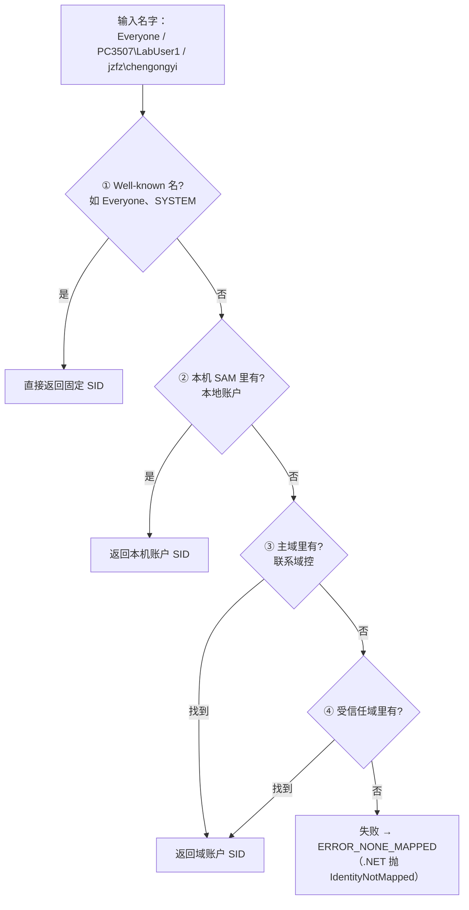

# 第 3 讲：名字 ↔ SID——LSA 去哪里查

> **卷一 · 发明权限（共 15 讲）**
> 师生对话实录课：AI 当老师、我当 0 基础学生，每讲只发明一个概念。

---

## 开场

**🧑‍🏫 老师：**

上一讲我们把身份锚在了 SID 上。但留了个缝：**你看到的都是名字**——`jzfz\chengongyi`、`Everyone`、`PC3507\LabUser1`；而 Windows 内部、真正存在文件 ACL / 注册表 / 服务上的，是 **SID**（`S-1-5-21-...`）。

所以每次都得做一次**翻译**：拿名字问系统「这对应哪个 SID」，或反过来。这一讲就发明这个翻译机制——**一个名字，到底是怎么变成 SID 的。**

一句话全景先立起来：

> **你的程序开口问 → LSA 接手调度 → 答案从本机 SAM 或域控拿出来 → 还给程序。**

关键是中间那句——**程序自己不去读 SAM，也不去连域控**。用户态程序没有资格直接读安全库，它只负责「开口问」，剩下的全交给 **LSA（Local Security Authority，本地安全机构）**——装在 `lsass.exe` 进程里的总调度台（[Microsoft Learn：认证中的凭证过程](https://learn.microsoft.com/en-us/windows-server/security/windows-authentication/credentials-processes-in-windows-authentication)）。

---

## 第 1 课：翻译的六步全景

**🧑‍🏫 老师：**

以查 `jzfz\chengongyi` 的 SID 为例，完整走一遍（本讲核心，看懂它就懂了「翻译」）：

```text
1. 程序调 Translate("jzfz\chengongyi")        ← 你的程序开口问
        │
        │  （用户态程序不能直接读 SAM，得委托）
        ▼
2. 请求进入 LSA（lsass.exe）                    ← LSA 接手调度
        │
        ▼
3. LSA 按顺序找：
     • 是 Everyone 这种固定名？ → 不是
     • 本机 SAM 里有 chengongyi？ → 没有（本机只有 LabUser1、user……）
     • → 判定要去域里找
        │
        ▼
4. LSA 通过 Netlogon 这条通道，向域控（DC）发问   ← 出网络，到域控
        │
        ▼
5. 域控查自己的 AD（活动目录），找到 chengongyi，
   返回它的 SID：S-1-5-21-3977539503-...-279405
        │
        ▼
6. LSA（顺手存进查找缓存）把 SID 还给程序
```

三个要点记牢：

- **程序不开口以外啥也不干**——不读 SAM、不连域控，全由 LSA 代劳；
- **答案有两个可能的来源**：本机账户在 SAM（`C:\Windows\System32\config\SAM`），域账户在域控（经 Netlogon 通道去问）；
- **LSA 会缓存**——查到一次就记下，下次同名直接返回，不必再打扰域控（[LSA 查找缓存](https://learn.microsoft.com/en-us/windows-server/identity/ad-ds/lsa-lookup-performance-counters)）。所以「一次翻译」可能当场问域控，也可能命中本机缓存——但无论哪种，都不是你的程序自己去碰库。

> 图里还会出现 SSP（NTLM/Kerberos 等认证协议的实现包）、SRM（内核里做访问检查的组件）、LPC（程序和 LSA 的通信通道）——它们属于**登录与认证**的大图景，本讲用不到，下一讲展开。

---

## 插问 1：第 3 步说「按顺序找」——具体什么顺序？

**🧑‍🎓 学生：** 第 3 步里 LSA「按顺序找」，先试固定名、再翻本机的、再去域里——这个顺序是谁定的？一共几级？

**🧑‍🏫 老师：**

官方 [`LookupAccountName`](https://learn.microsoft.com/en-us/windows/win32/api/winbase/nf-winbase-lookupaccountnamew) 的 Remarks 规定了**四级**：



四级从便宜到贵：**well-known**（`Everyone`=`S-1-1-0`、`SYSTEM`=`S-1-5-18`、`Administrators`=`S-1-5-32-544`，全 Windows 统一，不查任何库直接返回）→ **本机 SAM**（本机建的账户）→ **主域**（加域的机器去问域控）→ **受信任域**（林内有信任关系的其它域）。

空口无凭，本机把五个名字各翻译一遍（.NET `NTAccount.Translate`，真实输出）：

```text
Everyone             -> S-1-1-0
SYSTEM               -> S-1-5-18
Administrators       -> S-1-5-32-544
PC3507\LabUser1      -> S-1-5-21-3515524382-1810956650-2183447911-1009
jzfz\chengongyi      -> S-1-5-21-3977539503-3587586693-2971573549-279405
```

**同一个 `Translate` 调用，背后查的地方完全不同**：前三个是第 1 级 well-known 直接命中；`PC3507\LabUser1` 是第 2 级（本机 SAM）；`jzfz\chengongyi` 一路走到第 3 级（域控）。还能看出一件事：LabUser1 和 chengongyi 的 SID 都是 `S-1-5-21-...` 开头，但**中间三段「机器/域标识」完全不同**（`3515524382-...` vs `3977539503-...`）——上一讲说过：**SID 用「谁发的」区分本地还是域，不是看名字前缀。**

---

## 第 2 课：代码里怎么调

**🧑‍🏫 老师：**

原理讲清了，上手。三层 API 从高到低：

| 层次 | API | 用法 |
|------|-----|------|
| .NET（推荐） | `NTAccount.Translate` | 最简单 |
| Win32 | [`LookupAccountName`](https://learn.microsoft.com/en-us/windows/win32/api/winbase/nf-winbase-lookupaccountnamew) / `LookupAccountSid` | 名→SID / SID→名 |
| 更底层 | `LsaLookupNames` / `LsaLookupSids` | LSA 原生接口，前两者底层都走它 |

C#（或 PowerShell）双向：

```csharp
using System.Security.Principal;

// 名字 → SID
var account = new NTAccount(@"jzfz\chengongyi");
var sid = (SecurityIdentifier)account.Translate(typeof(SecurityIdentifier));
Console.WriteLine(sid.Value);   // S-1-5-21-3977539503-...-279405

// 反过来：SID → 名字
var name = (NTAccount)sid.Translate(typeof(NTAccount));
Console.WriteLine(name.Value);  // JZFZ\chengongyi
```

`Translate` **不自己算 SID**，而是把请求发给 LSA（走的就是第 1 课那 6 步）。反向翻译本机也实测了——拿 LabUser2 的 SID（上一讲记的 `-1010`）问名字：

```text
S-1-5-21-3515524382-1810956650-2183447911-1010  ->  PC3507\LabUser2
```

查不到的名字会怎样？实测翻译一个不存在的 `PC3507\NoSuchUser`：

```text
IdentityNotMappedException: 未能转换部分或所有标识引用。
```

四级全落空，报错收场——这个异常写 ACL 工具时总会遇到（第 32 讲 .NET 改 ACL 还会回来）。

**🧑‍🎓 学生：** 那写名字时有什么讲究吗？我看有的地方写 `chengongyi`、有的写全的 `jzfz\chengongyi`。

**🧑‍🏫 老师：**

**用完全限定名**（`域\用户`）比裸名好——LSA 不用猜你指的是本机的还是域里的同名账户，更快也更准。裸名碰到本机和域里恰好都有 `chen` 这种账户时，解析结果可能不符合预期；而全限定名把答案钉死。这也是 SDDL、icacls 输出里都是 `机器\名字` 形态的原因。

---

## 收束

**你现在会了：**

- **名字→SID 的本质**：程序开口问 → LSA 调度 → 答案从 SAM（本地）或域控（域，经 Netlogon）来 → 还给程序；程序自己不碰库。
- 四级顺序：well-known → 本机 SAM → 主域 → 受信任域；失败抛 `IdentityNotMapped`。
- 翻译有 **LSA 缓存**，不一定每次都打域控。
- SID 用「谁发的」区分本地/域；写名字用完全限定名更准。
- 代码用 `NTAccount.Translate` 或 Win32 `LookupAccountName/Sid`。

**下一讲才需要：** LSA 不只做翻译，登录时还要**验密码**——那时 SSP（NTLM/Kerberos）、SRM 这些组件才真正登场。

---

<!-- chapter-nav:start -->
← 上一章：[第 2 讲：SID](./03-sid.md)
· [回书稿索引](../00-index.md)
→ 下一章：[第 4 讲：登录与 LSA](./05-logon-lsa.md)
<!-- chapter-nav:end -->
