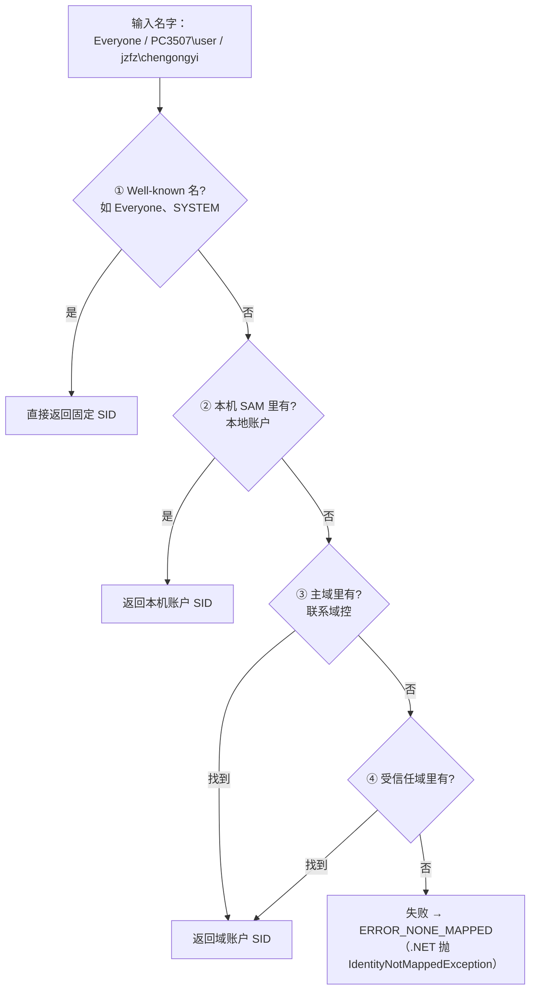

# 第 3 讲：名字 ↔ SID——LSA 去哪里查

### 麻烦

你看到的都是**名字**——`jzfz\chengongyi`、`Everyone`、`PC3507\user`。但 Windows 内部、存在文件 ACL / 注册表 / 服务上的，是 **SID**（`S-1-5-21-...`）。

所以每次都得做一次**翻译**：拿名字问系统「这对应哪个 SID」，或反过来。这一讲就专门讲清——**这个名字，到底是怎么变成 SID 的。**

---

### 名字 → SID：这一步究竟发生了什么

先给一句话全景，再拆开：

> **你的程序开口问 → LSA 接手调度 → 答案从本机 SAM 或域控拿出来 → 还给程序。**

关键是中间那句——**程序自己不去读 SAM，也不去连域控**。它只负责「开口问」，剩下的全交给 **LSA（Local Security Authority，本地安全机构）** 这个系统组件代劳。LSA 装在 `lsass.exe` 进程里，是所有安全相关请求的「总调度台」。来源：[Credentials processes in Windows authentication（Microsoft Learn）](https://learn.microsoft.com/en-us/windows-server/security/windows-authentication/credentials-processes-in-windows-authentication)

以查 `jzfz\chengongyi` 的 SID 为例，完整走一遍（**这一节是本讲的核心，看懂它就懂了「翻译」**）：

```text
1. 程序调 Translate("jzfz\chengongyi")        ← 你的程序开口问
        │
        │  （用户态程序不能直接读 SAM，得委托）
        ▼
2. 请求进入 LSA（lsass.exe）                    ← LSA 接手调度
        │
        ▼
3. LSA 按顺序找：
     • 是 Everyone 这种固定名？ → 不是
     • 本机 SAM 里有 chengongyi？ → 没有（本机只有 user、user1）
     • → 判定要去域里找
        │
        ▼
4. LSA 通过 Netlogon 这条通道，向域控（DC）发问   ← 出网络，到域控
        │
        ▼
5. 域控查自己的 AD（活动目录），找到 chengongyi，
   返回它的 SID：S-1-5-21-3977539503-...-279405
        │
        ▼
6. LSA（顺手存进查找缓存）把 SID 还给程序
```

三个要点记牢：

- **程序不开口以外啥也不干**——不读 SAM、不连域控，全由 LSA 代劳。
- **答案有两个可能的来源**：本机账户在 **SAM**（`C:\Windows\System32\config\SAM`），域账户在**域控**（经 Netlogon 通道去问）。
- **LSA 会缓存**——查到一次就记下，下次同名直接返回，不必再打扰域控。

> 📎 图里还会出现 SSP（NTLM/Kerberos 等认证协议的「实现包」）、SRM（内核里做访问检查的组件）、LPC（程序和 LSA 的通信通道）这些组件——它们属于**登录与认证**的大图景，本讲讲「翻译」用不到细节，下一讲展开。要看全景，见 [Microsoft Learn 那张架构图](https://learn.microsoft.com/en-us/windows-server/security/windows-authentication/credentials-processes-in-windows-authentication)。

---

### 深挖一：LSA 按「四级顺序」找

上面第 3 步说「LSA 按顺序找」——具体是什么顺序？官方 [`LookupAccountName`](https://learn.microsoft.com/en-us/windows/win32/api/winbase/nf-winbase-lookupaccountnamew) 的 Remarks 规定了四级：



四级是：

1. **Well-known SID**——全 Windows 统一的固定名，如 `Everyone`=`S-1-1-0`、`SYSTEM`=`S-1-5-18`、`Administrators`=`S-1-5-32-544`。**不查任何库**，直接返回。来源：[Well-known SIDs（Microsoft Learn）](https://learn.microsoft.com/en-us/windows/win32/secauthz/well-known-sids)
2. **本机 SAM**——本机建的账户（如 `PC3507\user`）
3. **主域**——加域的机器，去问域控（如 `jzfz\chengongyi`）
4. **受信任域**——本域没有，继续到林内有信任关系的其它域找

> 💡 **用完全限定名**（`域\用户`，如 `jzfz\chengongyi`）比光写 `chengongyi` 好——LSA 不用猜你指的是本机的还是域里的同名账户，更快也更准。

---

### 深挖二：实机演示，印证四级顺序

本机真实跑一遍名字→SID（用 .NET 的 `NTAccount.Translate`），看不同名字落在哪一级：

```text
Everyone          -> S-1-1-0                                        ← 第 1 级（well-known）
PC3507\user       -> S-1-5-21-3515524382-1810956650-2183447911-1001 ← 第 2 级（本机 SAM）
jzfz\chengongyi   -> S-1-5-21-3977539503-3587586693-2971573549-279405 ← 第 3 级（域控）
SYSTEM            -> S-1-5-18                                       ← 第 1 级（well-known）
Administrators    -> S-1-5-32-544                                   ← 第 1 级（well-known）
```

**同一个 `Translate` 调用，背后查的地方完全不同**：前三个 well-known 直接命中、本机的走 SAM、域账户走到域控。

> 还能看出一件事：`PC3507\user`（本地账户）和 `jzfz\chengongyi`（域账户）的 SID 都是 `S-1-5-21-...` 开头，但**中间那三段「机器/域标识」完全不同**——本机的标识段是本机生成的（`...-3515524382-...`），域的标识段是域生成的（`...-3977539503-...`）。**SID 用「谁发的」区分本地还是域，不是看名字前缀。** 末尾的 RID（`-1001`、`-279405`）是账户在自己库里的序号。

---

### 上手：在代码里调用翻译

讲清了原理，看怎么在程序里用。三个层次的 API，从高到低：

| 层次 | API | 用法 |
|------|-----|------|
| .NET（推荐） | `NTAccount.Translate` | 最简单，下面有例子 |
| Win32 | [`LookupAccountName`](https://learn.microsoft.com/en-us/windows/win32/api/winbase/nf-winbase-lookupaccountnamew) / `LookupAccountSid` | 名→SID / SID→名 |
| 更底层 | `LsaLookupNames` / `LsaLookupSids` | LSA 原生接口，前两者底层都走它 |

C# 例子（名字↔SID 双向）：

```csharp
using System.Security.Principal;

// 名字 → SID
var account = new NTAccount(@"jzfz\chengongyi");
var sid = (SecurityIdentifier)account.Translate(typeof(SecurityIdentifier));
Console.WriteLine(sid.Value);   // S-1-5-21-3977539503-...-279405

// 反过来：SID → 名字
var name = (NTAccount)sid.Translate(typeof(NTAccount));
Console.WriteLine(name.Value);  // JZFZ\chengongyi
```

`Translate` **不自己算 SID**，而是把请求发给 LSA（走的就是上面那 6 步）。找不到抛 `IdentityNotMappedException`。

---

### 一个性能细节：缓存

第 6 步提到「LSA 顺手存进缓存」——把名字翻译成 SID 可能要打网络问域控，代价不低，所以 LSA 维护了 **Name/SID 查找缓存**，命中就不必反复打扰域控。
来源：[LSA Lookup performance counters（Microsoft Learn）](https://learn.microsoft.com/en-us/windows-server/identity/ad-ds/lsa-lookup-performance-counters)

> 所以「一次翻译」**可能当场问域控，也可能命中本机缓存**——但无论哪种，都**不是你的程序自己去读 SAM 或 AD**，而是 LSA 代劳。

---

### 收束

**你现在会了：**

- **名字→SID 的本质**：程序开口问 → **LSA** 调度 → 答案从 **SAM**（本地）或**域控**（域，经 Netlogon）拿来 → 还给程序。程序自己不碰库。
- LSA 按**四级顺序**找：well-known → 本机 SAM → 主域 → 受信任域；用完全限定名 `域\用户` 更准更快。
- 翻译有 **LSA 缓存**，不一定每次都打域控。
- SID 用「谁发的」区分本地/域——本机和域账户的 `S-1-5-21-...` 标识段不同。
- 代码里用 .NET `NTAccount.Translate`，或 Win32 `LookupAccountName` / `LookupAccountSid`。

**下一讲才需要：** LSA 不只做翻译，登录时还要**验密码**——那时 SSP（NTLM/Kerberos）、SRM 这些组件才真正登场。

---

<!-- chapter-nav:start -->
← 上一章：[第 2 讲：SID](./03-sid.md)
· [回书稿索引](../00-index.md)
→ 下一章：[第 4 讲：登录与 LSA](./05-logon-lsa.md)
<!-- chapter-nav:end -->
