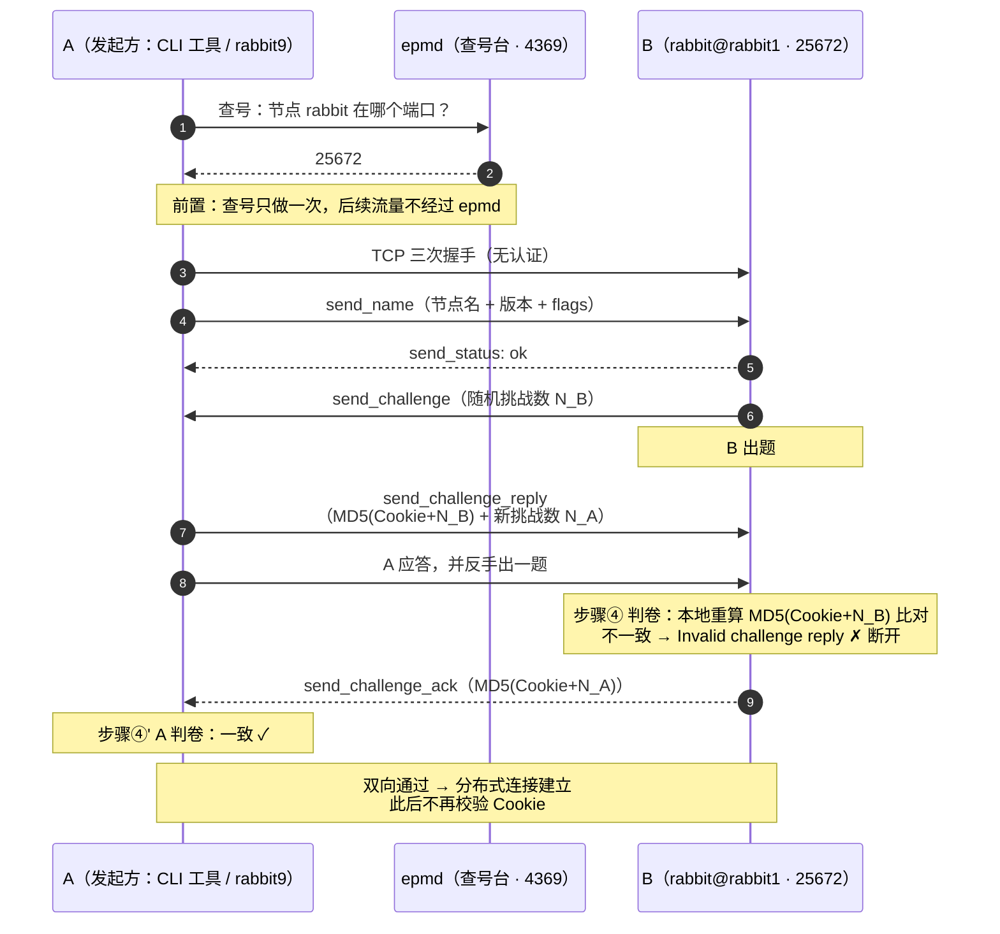

> **RabbitMQ 系列 · 番外篇**（[第 11 篇《集群与高可用》](/中间件/rabbitmq/rabbitmq-11-cluster-ha)的配套深读）  
> 主线系列：[上一篇：集群与高可用](/中间件/rabbitmq/rabbitmq-11-cluster-ha) · [下一篇：Classic 队列为什么一堆积就变慢](/中间件/rabbitmq/rabbitmq-12-classic-backlog-degradation)

---

## 开头：一行环境变量背后的机制

第 11 篇搭集群时，compose 里有一行：

```yaml
RABBITMQ_ERLANG_COOKIE: "rmq-cluster-cookie-2026"   # 三节点必须一致
```

为什么这三个容器必须设同一个值？为什么不一致集群就「组不起来」？这个所谓的 **Erlang Cookie** 到底是什么层的东西、怎么完成认证、口令对不上时系统内部发生了什么？这篇番外把整个机制拆开讲透——所有命令与日志都来自本机三节点集群（RabbitMQ 4.3.4 / Erlang 27.3.4.16）的真实运行。

---

## 一、为什么需要 Cookie：RabbitMQ 的底层是「分布式 Erlang」

RabbitMQ 是用 Erlang 写的，**每个 RabbitMQ 节点就是一个 Erlang 虚拟机（VM）**。集群里节点之间的通信——同步元数据、Khepri/Raft 复制日志、CLI 工具下发指令——走的既不是 AMQP 也不是 HTTP，而是 Erlang 语言自带的**分布式通信机制（Erlang distribution）**：两个 Erlang 节点一旦建立连接，就处在同一个「分布式集群运行时」里，可以**互相直接调用函数、传递消息**，就像对方的代码跑在自己进程里一样。

这带来一个别的中间件没有的安全问题：**Erlang 节点之间的信任是完全对等、无角色的**。连上来的「对端」可以对你做任何事——没有「只读节点」「受限连接」这种概念。所以 Erlang 在分布式握手层设计了一个最朴素也最关键的准入控制：**双方必须持有同一个共享密钥（Cookie），才允许建立连接**。

> 🔑 一句话：AMQP 端口（5672）守的是「客户端能不能收发消息」，权限体系很细（用户、vhost、正则授权）；而集群端口（25672）守的是「能不能完全控制这个节点」，**唯一的门卫就是 Cookie**。两者是完全不同层面的信任模型。

相关端口回顾（与第 11 篇对应）：

| 端口 | 用途 |
|------|------|
| 4369 | epmd，节点名 → 端口的发现服务（「先问 epmd：rabbit@rabbit1 在哪个端口」） |
| 25672 | Erlang distribution，节点间与 CLI 工具的通信通道 |
| 35672-35682 | CLI 工具作为「客户端」发起连接时用的动态源端口 |

### 顺手讲透：epmd 是什么

上表里的 4369 端口属于 **epmd（Erlang Port Mapper Daemon，Erlang 端口映射守护进程）**。它是 Erlang 生态的「查号台」：**节点名 → 分布式端口号**的电话簿。

**它解决什么问题**：Erlang 节点的分布式端口默认是「AMQP 端口 + 20000」（所以是 5672 + 20000 = 25672），但这个端口**可以配置、也不保证固定**。想连 `rabbit@rabbit1` 的一方，怎么知道对方到底监听在哪个端口？Erlang 的答案是：每台机器上跑一个统一的登记处，监听 4369——节点启动时把自己的名字和端口登记进去；要连它的人先查号、再直连。

```
节点启动时：rabbit@rabbit1 ──登记「我叫 rabbit，端口 25672」──▶ 本机 epmd (4369)

连接发起时：rabbit9 ──查号「rabbit 在哪个端口？」──▶ rabbit1 机器的 epmd (4369)
            rabbit9 ◀──「25672」──────────────────
            rabbit9 ──直接连 25672，开始 Cookie 握手──▶ rabbit@rabbit1
```

**实测看这本登记簿**（rabbit1 容器里）：

```bash
$ docker exec rabbit1 epmd -names
epmd: up and running on port 4369 with data:
name rabbit at port 25672          ← 节点 rabbit（即 rabbit@rabbit1）登记在 25672

$ docker exec rabbit1 sh -c 'ps aux | grep epmd | grep -v grep'
rabbitmq  63  ...  /opt/erlang/lib/erlang/erts-15.2.7.12/bin/epmd -daemon
```

第二条输出还有个信息量：epmd 是 **Erlang 运行时（ERTS）自带的，节点启动时自动拉起**，不需要单独安装或配置——`erts-15.2.7.12/bin/epmd` 就是它出生的证据。

三个实践要点：

| 要点 | 说明 |
|------|------|
| 只管查号，不管传话 | 4369 只在**建连前**被查询一次；之后所有集群流量走 25672 点对点，**不经过 epmd**。epmd 挂了，**已有连接不受影响，只是新连接建立不了** |
| 一机一个 | 每台机器（每个容器）只有一个 epmd，为机上**所有** Erlang 节点服务——单机多节点时它们共用 4369，各登记各的端口 |
| 防火墙 | 集群节点之间 4369 和 25672 都必须放行；第 11 篇 compose 里没写 4369 端口映射，是因为容器间互访走内部网络，不需要映射到宿主机 |

---

## 二、Cookie 是怎么完成认证的：challenge-response 握手

Cookie 认证发生在 Erlang distribution 建连握手阶段。整个握手是标准的**挑战-应答（challenge-response）**流程：双方互相出题、各自用口令算摘要作答，谁也不把口令本身发出去。逐步拆开看（A = 发起方，比如 CLI 工具或想入群的节点；B = 接收方节点）：

**前置：先找到门、再敲 TCP**。A 先问 epmd（4369 端口）「`rabbit@rabbit1` 的分布式端口是多少」，epmd 答「25672」；A 向 25672 发起 **TCP 连接**——这一步没有任何认证，三次握手就能成功。

**步骤 ① 自报家门（`send_name` → `send_status`）**。A 发出第一个分布式协议包 `send_name`：自己的节点名、Erlang 分布式协议版本、能力标志位（flags）。B 收到后回一个 `send_status`：`ok`（可以继续）或 `nok`（比如同名节点已连接等，直接终止）。注意这一步**只交换身份、不涉及任何密钥**——到这里为止，网络通了、名字报了，但 B 还不知道 A 是不是「自己人」。

**步骤 ② B 出题（`send_challenge`）**。B 发送 `send_challenge`，核心载荷是一个**随机挑战数 N_B**（每次连接都重新随机生成）。这相当于问 A：「拿你声称的身份，答这道题」。

**步骤 ③ A 应答，并反手出一题（`send_challenge_reply`）**。A 回复 `send_challenge_reply`，里面带两样东西：
- **对 B 那道题的答案**：`摘要 = MD5(Cookie + N_B)`——用自己的口令和对方的挑战数拼在一起算哈希；
- **A 自己的随机挑战数 N_A**——反手给 B 出一道一样的题。

口令本身从头到尾没有出现在网络上，网上跑的只是「口令 + 随机数」的摘要。

**步骤 ④ B 判卷**。B 用**自己本地存的 Cookie** 同样计算 `MD5(Cookie + N_B)`，与 A 交上来的摘要比对：
- **不一致** → 认定 A 不持有相同口令，握手失败：B 在日志里记下 `Connection attempt from node ... rejected. Invalid challenge reply. **`，随即关闭连接；
- **一致** → A 通过考核，继续下一步。

**步骤 ⑤ B 补答 A 的题（`send_challenge_ack`）**。单向验证还不够——A 也得确认 B 是自己人。B 回复 `send_challenge_ack`，携带 `MD5(Cookie + N_A)`；A 同样本地重算比对。

**完成**：双向判卷都通过，分布式连接正式建立。此后双方进入同一个 Erlang 集群运行时（互发消息、远程调用），**不再重复校验 Cookie**——认证只在建连时做一次。

泳道时序图汇总（三条泳道：发起方 A、查号台 epmd、接收方 B）：



这个设计里有三个值得咂摸的细节：

| 设计 | 目的 |
|------|------|
| 网上只传 `MD5(Cookie + 挑战数)`，不传 Cookie | 口令不上链路，抓包抓不到口令明文 |
| 挑战数每次连接随机生成 | 防重放——上次握手的摘要包再发一遍，这次题变了，答案自然对不上 |
| 双向互考（③⑤ 两步） | 不存在「单向信任」：假节点冒充 B 同样会被 A 识破 |

> ⚠️ 但也要清醒：这套握手诞生于可信内网时代，摘要算法是 **MD5**，强度有限——它防的是「口令被嗅探」，不防「被离线暴力破解」。所以口令本身要够长够随机（别用 `rmq-cluster-cookie-2026` 这种人话），跨不可信网络必须叠加 inter-node TLS（第五节）。

### 实测还原：口令对不上时，握手死在哪一步

本机起一个第四节点 `rabbit9`，故意给它设不同的 Cookie，让它去连集群：

```bash
docker run -d --name rabbit9 --hostname rabbit9 \
  --network rabbitmq-cluster_default \
  -e RABBITMQ_ERLANG_COOKIE=WRONG-COOKIE-999 \
  rabbitmq:4.3-management

# 用 rabbit9 上的 CLI 去查 rabbit@rabbit1 的状态
$ docker exec rabbit9 rabbitmqctl -n rabbit@rabbit1 status
Error: unable to perform an operation on node 'rabbit@rabbit1'. ...

DIAGNOSTICS
===========
attempted to contact: [rabbit@rabbit1]

rabbit@rabbit1:
  * connected to epmd (port 4369) on rabbit1
  * epmd reports node 'rabbit' uses port 25672 for inter-node and CLI tool traffic
  * TCP connection succeeded but Erlang distribution failed
  * suggestion: check if the Erlang cookie is identical for all server nodes and CLI tools
  ...
Current node details:
 * node name: 'rabbitmqcli-93-rabbit@rabbit9'
 * Erlang cookie hash: +c8xpyJSqIzOPV77J9Hfdw==      ← CLI 打印自己 Cookie 的指纹，供比对
```

对照上面的流程逐步定位：epmd 问答成功（`connected to epmd`）、TCP 成功（`TCP connection succeeded`）——**前置和步骤 ① 都过了，死在步骤 ④**：`Erlang distribution failed` 正是「判卷不通过」的客户端表述。

再看被敲门一方（B）的日志，就是判卷失败的原文：

```
2026-08-14 10:18:52 [error] <0.5057.0> ** Connection attempt from node 'rabbitmqcli-542-rabbit@rabbit9' rejected. Invalid challenge reply. **
2026-08-14 10:19:06 [error] <0.5084.0> ** Connection attempt from node rabbit@rabbit9 rejected. Invalid challenge reply. **
```

日志甚至能区分来者身份：`rabbitmqcli-*` 前缀的是 CLI 工具，裸 `rabbit@rabbit9` 的是节点本体（后者是紧接着 `join_cluster` 的尝试，同样死在判卷，集群组不起来）。

**那个 `Erlang cookie hash` 是干嘛的？——官方留的比对线索**。CLI 报错时特意打印自己口令的「指纹」，就是让你拿去和目标节点对一对。指纹的算法是 `Base64(MD5(Cookie))`，实测验证：

```bash
# CLI 侧（rabbit9，口令 WRONG-COOKIE-999）：md5 结果与报错中的 hash 一字不差
$ node -e "console.log(require('crypto').createHash('md5').update('WRONG-COOKIE-999').digest('base64'))"
+c8xpyJSqIzOPV77J9Hfdw==

# 服务端侧（rabbit1 的生效口令）：
$ docker exec rabbit1 rabbitmqctl eval 'base64:encode(crypto:hash(md5, atom_to_list(erlang:get_cookie()))).'
<<"LMHK9/GUzIifE8LkUl3xyg==">>
```

`+c8xp...` ≠ `LMHK9...`——**两边指纹一对上号，口令不一致当场实锤**，连 Cookie 明文都不用看。排查集群「组不起来」时，这是最快的定位手段。

> 🔑 Cookie 认证回答的是「你是自己人吗」，**不回答「流量会不会被偷看」**——它只认证、不加密。节点间复制的数据在 25672 上默认是明文传输的。跨机房、不可信网络要配 **inter-node TLS**（见第五节）。

---

## 三、Cookie 存在哪、从哪来

按官方 [Clustering Guide](https://www.rabbitmq.com/docs/clustering)（4.3）的规范，逐条对照：

| 规范 | 内容 |
|------|------|
| 取值 | 一串字母数字，最长 255 字符 |
| 权限 | 文件必须仅属主可读（UNIX `600`）——因为它等同节点完全控制权 |
| 一致性要求 | **集群里每个节点、以及所有要用 CLI 工具的机器，都必须是同一个值** |
| 缺省行为 | 文件不存在时，Erlang VM 会在节点启动时**随机生成**一个 |

「随机生成」这条要特别注意：每个节点独立随机，各不相同——**随机 Cookie 的节点之间永远互相拒绝**。所以官方明确说随机生成只适合单节点开发环境，集群的 Cookie 必须在**部署阶段显式生成并分发到所有节点**（生产用 Ansible/K8s 等自动化工具做）。

手动部署分发文件时还有个容器特有的坑：挂载卷后 `.erlang.cookie` 属主可能变成 root，容器内 rabbitmq 用户（UID 999）读不到，节点直接启动失败——这也是 Docker 镜像提供环境变量方案的原因之一。

**Cookie 文件的位置**因平台和角色而异：

| 环境 | 位置 |
|------|------|
| Linux 服务端 | `/var/lib/rabbitmq/.erlang.cookie` |
| Linux CLI 工具 | `$HOME/.erlang.cookie`——**按用户各一份**，root 和普通用户都要放（这也是高频踩坑点） |
| Docker 社区镜像 | 不用文件，用 `RABBITMQ_ERLANG_COOKIE` 环境变量，镜像用它填充 Cookie |
| Kubernetes | 同上，值写在 StatefulSet 的 Pod 模板里（实践中放 Secret） |
| Windows（Erlang 20.2+） | `%HOMEDRIVE%%HOMEPATH%\.erlang.cookie` 或 `%USERPROFILE%\.erlang.cookie`；Windows 服务还另有一份在 `C:\Windows\system32\config\systemprofile\.erlang.cookie`，要互相拷贝 |

除文件外还有两个**临时覆盖**口子（官方均标注为最不安全、不推荐）：服务端 `RABBITMQ_SERVER_ADDITIONAL_ERL_ARGS="-setcookie <值>"`，CLI 侧 `rabbitmqctl --erlang-cookie <值>`（会留在 shell 历史里）。

---

## 四、本机实测：三个值得记住的细节

### 4.1 问运行时「生效的 Cookie 是什么」

排查时**别只看文件**——直接问 Erlang 运行时最准：

```bash
$ docker exec rabbit1 rabbitmqctl eval 'erlang:get_cookie().'
'rmq-cluster-cookie-2026'
$ docker exec rabbit2 rabbitmqctl eval 'erlang:get_cookie().'
'rmq-cluster-cookie-2026'
$ docker exec rabbit3 rabbitmqctl eval 'erlang:get_cookie().'
'rmq-cluster-cookie-2026'
```

三节点一致，集群互通的前提成立。

### 4.2 磁盘文件是「假」的：优先级问题

一个反直觉的实测发现：进容器 `cat /var/lib/rabbitmq/.erlang.cookie`，三个节点的内容**各不相同、且都是 20 位随机串**——既不是 compose 里设的值，彼此也不一致，但集群完全正常。

原因：Docker 镜像里 `RABBITMQ_ERLANG_COOKIE` 环境变量**直接作为节点启动时的生效 Cookie**，优先级高于 cookie 文件；文件里那份随机值（是某次初始化时 VM 自动生成的）根本没被用到。

用官方诊断命令 `rabbitmq-diagnostics erlang_cookie_sources` 看 CLI 工具到底从哪取口令，一目了然：

```
$ docker exec rabbit1 rabbitmq-diagnostics erlang_cookie_sources
Listing Erlang cookie sources used by CLI tools...

Cookie File
  Effective home directory: /var/lib/rabbitmq
  Cookie file path: /var/lib/rabbitmq/.erlang.cookie
  Cookie file size: 20                                  ← 磁盘文件：20 位随机值（未被采用）

Cookie CLI Switch
  --erlang-cookie value set? false                      ← 命令行参数：没用

Env variable  (Deprecated)
  RABBITMQ_ERLANG_COOKIE value set? true
  RABBITMQ_ERLANG_COOKIE value length: 23               ← 环境变量生效（23 = "rmq-cluster-cookie-2026"）
```

> ⚠️ 注意官方已经把环境变量标注为 **Deprecated**——能用，但新部署建议改用挂载统一 Cookie 文件的方式，避免跟 4.2 的行为差异纠缠。

### 4.3 Cookie 对不上时，三种角色三种报错

同一台 `rabbit9`（错误 Cookie）敲门，不同角色看到的报错完全不同，排查时对号入座：

| 谁连谁 | 现象 |
|------|------|
| CLI 工具 → 节点 | `rabbitmqctl` 报「TCP connection succeeded but Erlang distribution failed」，并列出自己 Cookie 的哈希供比对（见第二节） |
| 节点 → 节点（`join_cluster`） | 命令打印 `Clustering node rabbit@rabbit9 with rabbit@rabbit1` 后报 `{erpc,noconnection}` 类错误，成团失败 |
| 被拒一方（服务端） | 日志记录 `Connection attempt from node ... rejected. Invalid challenge reply` |

> 🔑 排查口诀：**看客户端「distribution failed」+ 服务端「Invalid challenge reply」成对出现，就是 Cookie 不一致**；若客户端连 TCP 都连不上，才是网络/防火墙/hostname 解析问题。

---

## 五、生产实践清单

**① 当凭据管，别当配置管**。持有 Cookie = 对节点拥有完全控制权（可下发任意指令），按 root 级凭据的规格对待：不进 Git、不进镜像、不写日志；K8s 里放 Secret，只在 StatefulSet Pod 模板引用。

**② 端口不暴露**。4369/25672 只对集群内网和 CLI 机器开放。公网可达的 25672 + 泄露的 Cookie = 集群被人完全接管。

**③ 轮换 = 一次计划内全集群维护**。轮换窗口内新旧 Cookie 的节点互相视为不可达，效果等同一次全集群重启（元数据存储还可能因凑不齐多数派而不可用）。务必在维护窗口、按「先停全部 → 改完 → 再拉起」整体执行，不要滚动改。

**④ 只认证不加密 → 敏感网络加 TLS**。Cookie 握手只做认证，25672 上的复制流量默认明文。跨机房/不可信网络要给 Erlang distribution 配 TLS（[Using TLS for Inter-node Traffic](https://www.rabbitmq.com/docs/clustering-ssl)）；配了之后 CLI 工具也必须走 TLS 才能连上节点。

**⑤ CLI 换用户就失效？查 HOME**。CLI 工具按当前用户的 `$HOME/.erlang.cookie` 取口令，root 和普通用户各有一份，新机器/新用户上跑 `rabbitmqctl` 报认证失败，先确认该用户 HOME 下有没有正确的 Cookie 文件。

---

## 小结

- RabbitMQ 节点 = Erlang VM，集群通信走 **Erlang distribution**；节点间信任**完全对等**，唯一的准入控制就是 Cookie。
- 认证靠 **challenge-response 握手**：口令不传输，只互相出题验证；失败时客户端报 `Erlang distribution failed`、服务端记 `Invalid challenge reply`。
- Cookie **只认证、不加密**；加密要配 inter-node TLS。
- 文件不存在时 VM 随机生成（每节点独立，集群不可用）；集群必须在部署阶段显式统一。Docker 镜像用 `RABBITMQ_ERLANG_COOKIE` 环境变量，且**优先级高于磁盘文件**（实测磁盘上可以是一份没用的随机值）；该变量已被官方标注 Deprecated。
- 排查三板斧：`erlang:get_cookie().` 问运行时、`erlang_cookie_sources` 查取值来源、对照双侧日志定位是不是口令问题。

回到主线：[《RabbitMQ 集群与高可用》](/中间件/rabbitmq/rabbitmq-11-cluster-ha) · 继续阅读：[《Classic 队列为什么一堆积就变慢》](/中间件/rabbitmq/rabbitmq-12-classic-backlog-degradation)

---

## 参考资料

- [RabbitMQ · Clustering Guide（4.3）](https://www.rabbitmq.com/docs/clustering) — Erlang Cookie、认证失败日志、Cookie 文件位置、`erlang_cookie_sources`、Docker/K8s 分发
- [RabbitMQ · Using TLS for Inter-node Traffic](https://www.rabbitmq.com/docs/clustering-ssl) — 分布式通道加密
- [RabbitMQ · CLI Tools](https://www.rabbitmq.com/docs/cli) — CLI 的 Cookie 来源与诊断
- 本机实测环境：WSL2 Ubuntu-22.04 + Docker 29.1.3，`rabbitmq:4.3-management`（RabbitMQ 4.3.4 / Erlang 27.3.4.16），compose 在 `/root/rabbitmq-cluster/`
