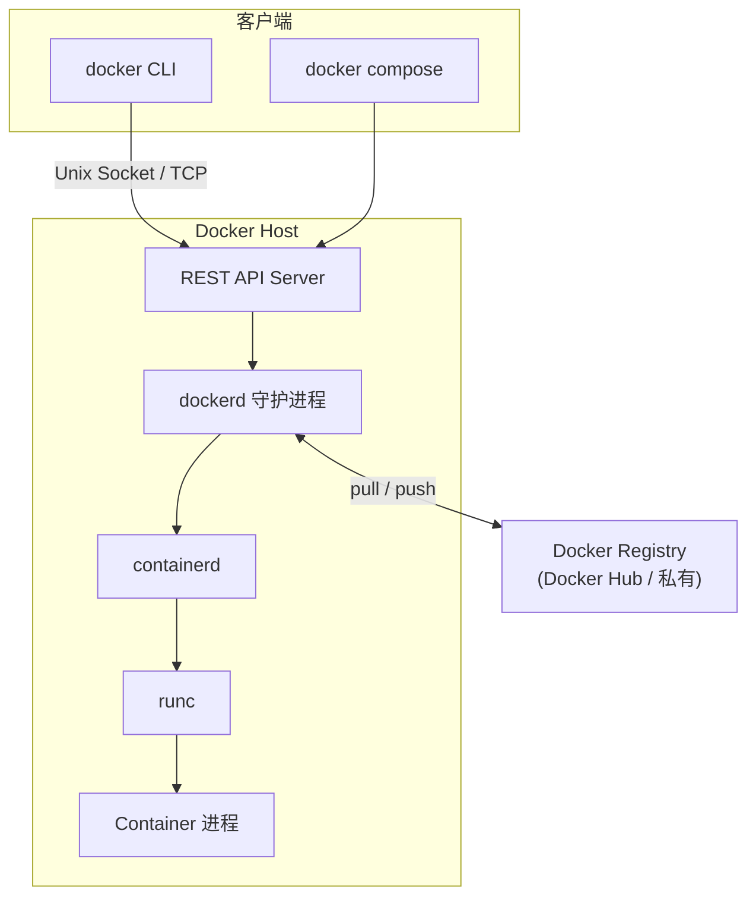

> **Docker 系列 · 第 2/23 篇**  
> 上一篇：[《Docker 是什么？——从 jar 包部署到镜像一键上线》](/云原生/docker/docker-01-what-is-docker)  
> 下一篇预告：[《容器 vs 虚拟机——为什么 Docker 不是「轻量 VM」》](/云原生/docker/docker-03-container-vs-vm)  
> 本篇按 2026 年版官方文档（Docker Overview / Engine 手册）重新校对组织。

---

## 开头：敲下 `docker run`，背后谁在干活？

你在终端输入：

```bash
docker run -d nginx
```

几秒内 Nginx 就在跑了。表面上只有一条命令，实际上至少经过 **CLI → dockerd → containerd → runc** 一串调用。面试里问「Docker 架构」，如果只答「客户端和服务端」，往往不够；要把各组件职责、OCI/Moby 演进和许可模型讲清楚，才算真懂 Engine。

---

## 一、当人们说「Docker」，通常指 Docker Engine

按现行官方定义，**Docker Engine 是一个开源容器化技术，以 Client-Server 应用形态提供**，由三部分组成：

1. 一个长期运行的守护进程 **dockerd**；
2. 一组 **API**，定义程序如何与 daemon 通信；
3. 一个命令行客户端 **docker**（CLI 用这些 API 驱动 daemon）。

daemon 创建并管理 Docker **对象**：镜像、容器、网络、卷。

但这只是官方在「概览页」给你看的顶层。往下一层，Engine 实际是个分层栈：

| 组件 | 角色 |
|------|------|
| **Docker Client** | 命令行 `docker` 或 SDK，发起请求 |
| **Docker daemon（dockerd）** | 守护进程，监听 API 请求，管理容器生命周期与全部对象 |
| **containerd** | 容器运行时，负责镜像传输、快照、容器执行（从 dockerd 中拆分） |
| **runc** | OCI 参考实现，真正创建并运行容器进程 |

概览页把 client/daemon/Desktop/Registry 放在第一层讲，containerd/runc 属于「引擎内部机制」——下面先看第一层，再钻进去。

---

## 二、平台架构：Client、daemon、Docker Desktop、Registry

### 2.1 Client-Server 结构

Docker 是 **C/S 架构**：daemon 跑在 Host 上，Client 通过 **REST API**（默认走 Unix 域套接字 `/var/run/docker.sock`，也可走 TCP 网络接口）访问 daemon。Client 和 daemon **可以不在同一台机器上**——同一个 `docker` 客户端可以连接多个远程 daemon。



各角色职责（现行官方口径）：

- **Docker client（docker）**：大多数用户使用 Docker 的主要方式。`docker run` 这类命令由 client 发给 dockerd 执行——**client 本身不干重活**。除 CLI 外，`docker compose` 也是官方列出的另一个客户端，用于管理由一组容器组成的应用；
- **dockerd**：监听 API 请求，管理镜像、容器、网络、卷等对象；Swarm 模式下还能与其他 daemon 通信管理服务；
- **Docker Registry**：存镜像。`docker pull` / `docker run` 自动从配置的 Registry 拉镜像，`docker push` 推送。Docker Hub 是默认公有 Registry，也可自建私有 Registry。

### 2.2 Docker Desktop：不可忽略的「第二形态」

现行官方架构文档已把 **Docker Desktop** 列为一等组件——在 Mac/Windows/Linux 上的一站式安装包，内含：

- dockerd（daemon）+ docker CLI；
- **Docker Compose**、**Docker Content Trust**（镜像签名）、**Kubernetes**（单机版）、**Credential Helper**。

对开发者的意义：在 Windows/macOS 上你从来不是「直接装 Engine」，而是装 Desktop（Windows 上跑在 WSL2 里）。对企业读者的意义见第七节的许可说明。

### 2.3 Docker 对象模型

使用 Docker 就是创建和使用这些**对象**：

| 对象 | 说明 |
|------|------|
| **镜像 Image** | 只读模板，含构建容器的指令；通常基于另一镜像加定制层。Dockerfile 每条指令生成一层，重建时只重建变化的层 |
| **容器 Container** | 镜像的可运行实例；可 create/start/stop/move/delete，可接网络、挂存储、甚至基于当前状态提交新镜像 |
| **网络 / 卷 / 插件** | daemon 管理的其他对象；容器的隔离程度（网络、存储等）可控 |

容器默认与宿主机和其他容器**相对良好隔离**；容器删除后，未写入持久化存储的状态全部消失。

---

## 三、`docker run` 完整解剖：官方六步 + 引擎内部七步

同一条命令，官方文档给了**用户视角**的六步，引擎内部还有**组件视角**的七步。两个视角叠起来才是完整答案。

### 3.1 用户视角：官方文档的六步

以 `docker run -ti ubuntu /bin/bash` 为例（默认 Registry 配置下）：

1. 本地没有 `ubuntu` 镜像 → 自动执行相当于 `docker pull ubuntu` 的拉取；
2. 创建新容器，相当于 `docker container create`；
3. 分配一个**读写文件系统**作为容器最上层——容器内可创建/修改文件；
4. 创建**网络接口**把容器连到默认网络（分配 IP；默认可经宿主机网络访问外部）；
5. 启动容器并执行 `/bin/bash`；因 `-i -t` 附着到终端，可交互；
6. `exit` 退出后**容器停止但不删除**——可再次 start 或 remove。

### 3.2 组件视角：引擎内部的七步

（自 Docker 1.11 引入 containerd/runc 拆分以来的现行链路）

**第 1 步：CLI 只是薄壳。** `docker` 本身是个 Go 二进制，不含任何容器逻辑。它解析参数、把镜像名补全为 `docker.io/library/nginx:latest`，然后通过 Unix socket 向 daemon 发两个 REST 调用：`POST /containers/create` + `POST /containers/{id}/start`——所以 `docker run` 本质是 create + start 的组合。

**第 2 步：dockerd 找镜像。** daemon 先查本地镜像；`nginx` 不存在就走 pull 流程——向 Registry 申请认证 token、取 manifest、逐层下载 layer blob。注意下载与落盘是**委托 containerd 的 content store** 完成的，dockerd 只管策略层（认证、tag 记录）。

**第 3 步：dockerd 准备运行环境。** 创建容器元数据（ID、名称、端口映射），并分配网络——默认 bridge 模式下创建 veth pair、挂到 `docker0` 网桥、写 iptables DNAT 规则；如有卷、网络自定义也在此步落地。

**第 4 步：dockerd → containerd（gRPC）。** dockerd 通过 containerd 的 gRPC 接口（`/run/containerd/containerd.sock`）创建 task。containerd 用 snapshotter（默认 overlayfs）把镜像只读层 + 一个可写层组装出 rootfs，再按 OCI runtime-spec 生成 `config.json`（启动命令、环境变量、挂载、namespace 清单），两者打包成 **OCI bundle**。

**第 5 步：containerd → shim。** containerd 为容器 fork 一个 `containerd-shim-runc-v2` 进程，此后 shim 是容器进程的「养父」：stdin/stdout 走它管理的 FIFO，退出码由它收割。

**第 6 步：shim → runc create/start。** runc 读取 bundle 中的 `config.json`，`clone()` 出带全套 namespace（pid/net/uts/ipc/mount）的子进程，写入 cgroup 限制资源，`pivot_root()` 切换到容器 rootfs，按 spec 降权（capabilities/seccomp），最后 `exec` 为 nginx 主进程。**runc 是一次性的——干完活就退出**，容器进程从此挂在 shim 名下。

**第 7 步：状态回传。** shim 向 containerd 上报 task 状态，dockerd 把容器标记为 running，CLI 打印 64 位容器 ID，命令返回。整条链路秒级完成。

### 3.3 为什么要拆这么多层

每层拆分都有明确动机，也是「Docker 架构」面试的加分点：

| 拆分 | 解决什么问题 |
|------|------|
| dockerd 与 containerd 分离 | containerd 是通用容器运行时，Kubernetes 后来经 CRI 直接用它；Docker 只是它的一个客户 |
| 引入 shim | 容器进程的父进程是 shim 而非 daemon，因此 **dockerd/containerd 重启升级不杀容器** |
| 引入 runc（OCI 参考实现） | 规范与实现解耦，runc 可整体替换为 crun、kata-runtime 等 |

---

## 四、Docker Platform：开发、打包、运行应用

除 Engine 外，Docker 还描述了一个**平台**概念：**提供开发、打包、运行应用的环境**，把应用与底层 infrastructure 隔离开。

可以抽象为三层模型：

| 层级 | 内容 |
|------|------|
| **应用层** | 你的业务程序及其依赖 |
| **容器层** | 镜像与容器——标准化打包与隔离运行时 |
| **基础设施层** | 物理机、虚拟机、云主机、存储与网络 |

「到底什么是 Docker」在此语境下有两层答案：

1. **软件产品**：可运行在 Windows、Linux、macOS 上的容器引擎（Go 实现，Apache 2.0，GitHub 维护）  
2. **运行时单元**：轻量、可移植的**容器**——沙箱隔离、开销低、共享宿主机内核

平台层的典型收益（官方归纳）：**快速一致的交付**（本地开发 → CI/CD → 推到生产即发布）、**弹性的部署与伸缩**（同一负载跑在本机/机房/云/混合环境）、**同硬件跑更多负载**（相比 hypervisor 虚拟机更轻，适合高密度部署）。

---

## 五、什么是容器？（Engine 视角再定义）

从平台视角，容器是：

- 对软件及其依赖的**标准化打包**
- 应用之间**相互隔离**
- **共享同一个 OS Kernel**
- 可在多种主流操作系统上运行（通过对应平台的 Docker 实现）

与虚拟机的关键区别：**容器是 APP 层面的隔离**；传统虚拟化是**物理资源层面**的隔离（独立 Guest OS）。

容器要解决的问题：

- 缓和**开发 vs 运维**的环境不一致  
- 在 DevOps 链路中充当**可重复交付单元**  

一个 Docker 容器 = **一个运行时环境**，可理解为进程组的「标准化集装箱」。底层技术上，Docker 用 Linux 内核的 **namespaces** 提供隔离工作区（每个容器一套独立 namespace），用 **cgroups** 限制资源——细节在系列底层原理篇展开。

---

## 六、docker 基本组成与概念对照表

| 概念 | 说明 |
|------|------|
| **Docker 镜像（Images）** | 创建容器的只读模板，如 Ubuntu 系统镜像 |
| **Docker 容器（Container）** | 镜像的运行实例；独立运行的一个或一组应用 |
| **Docker 客户端（Client）** | 通过命令行或 [Docker SDK](https://docs.docker.com/develop/sdk/) 与 daemon 通信；`docker compose` 是另一官方客户端 |
| **Docker 主机（Host）** | 运行 dockerd 与容器的物理机或虚拟机 |
| **Docker Registry** | 存储镜像；[Docker Hub](https://hub.docker.com) 是公有 Registry。结构为：Registry → 多个 Repository → 多个 Tag → 每个 Tag 对应一个镜像。引用格式 `<仓库名>:<标签>`，缺省标签为 `latest` |

**Host** 上安装 Docker 程序；**Registry** 保存打包好的镜像（公有/私有）；**Image** 是静态制品；**Container** 是 Image 启动后的实例。

关系链：

```
Registry 存 Image → docker pull/run 用到 Host → Image 实例化为 Container
```

Docker 使用 **C/S 架构 + 远程 API** 创建与管理容器；**容器必须由镜像创建**。

---

## 七、OCI、Moby 与许可模型（2026 现状）

### 7.1 OCI 与 runc

OCI 制定 **runtime-spec** 与 **image-spec** 后，**runc** 成为通用低层运行时。Docker CE 底层使用 runc，因此：

- 在宿主机直接执行 `runc`，子命令风格与 `docker` 相近  
- 其他实现（如 crictl + containerd 纯 CRI 路径）也可在同一规范下运行容器  

Engine 是「用户友好的集成栈」；OCI 是「接口与实现解耦的规范层」。这一分工对后来 **Kubernetes 弃用 dockershim、默认 containerd/CRI-O** 的演进也有铺垫——后文系列会涉及 daemon 底层原理篇。

### 7.2 Moby

2017 年 Docker 项目迁入 **Moby**：Moby 是上游开源仓库，**Docker CE/EE** 是基于 Moby 的发行版；社区可 fork Moby 定制引擎，不被 Docker 公司产品路线完全绑定。

### 7.3 许可模型（企业选型必读）

现行官方口径需要分清两条线：

- **Docker Engine 本体**：开源，**Apache License 2.0**；
- **Docker Desktop 分发渠道**：大企业（**员工超过 250 人，或年收入超过 1000 万美元**）商业使用需**付费订阅**。

也就是说「Docker 免费吗」的正确答案是：Linux 上直接装 Engine 免费；团队用 Desktop 且规模过线则要买订阅。这一点和 2017 年的旧认知差异很大，选型时容易踩。

---

## 小结

- 口语中的 Docker ≈ **Docker Engine**（dockerd + API + CLI），内部再分 **containerd / runc** 两层；现行官方架构还把 **Docker Desktop** 与 Registry 列为一等组件。
- **Client-Server + Socket/API**；CLI 不直接起容器，而是驱动 daemon 与运行时栈。
- `docker run` 有两个视角的答案：官方六步（pull/create/RW 层/网络/执行/停止不删除）+ 引擎内部七步（CLI → dockerd → containerd → shim → runc）。
- **Docker Platform** 强调应用与基础设施隔离的三层模型；核心对象是**镜像、容器、网络、卷**。
- 许可：Engine Apache 2.0 免费；Desktop 在大企业（>250 人或 >$10M 收入）需付费订阅。

下一篇专门对比**容器与虚拟机**，澄清「轻量 VM」误解，并用表格量化启动速度、密度与隔离差异。
