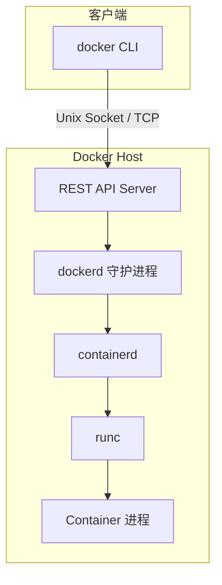

> **Docker 系列 · 第 3/33 篇**
> 上一篇：[《容器 vs 虚拟机——为什么 Docker 不是「轻量 VM」》](/云原生/docker/docker-02-container-vs-vm) · 下一篇：[《Docker 安装三种方式——离线、在线与现成虚拟机》](/云原生/docker/docker-04-install)

---

## 开头：敲下 `docker run`，背后谁在干活？

你在终端输入：

```bash
docker run -d nginx
```

几秒内 Nginx 就在跑了。表面上只有一条命令，实际上至少经过 **CLI → dockerd → containerd → runc** 一串调用。面试里问「Docker 架构」，如果只答「客户端和服务端」，往往不够；要把各组件职责和 OCI/Moby 演进讲清楚，才算真懂 Engine。

---

## 一、当人们说「Docker」，通常指 Docker Engine

**Docker Engine** 是一个 **Client-Server** 应用程序，是日常使用的「Docker 本体」。主要组件包括：

| 组件 | 角色 |
|------|------|
| **Docker Client** | 命令行 `docker` 或 SDK，发起请求 |
| **Docker daemon（dockerd）** | 守护进程，在主机上长期运行，管理容器生命周期 |
| **containerd** | 容器运行时，负责镜像传输、容器执行等（从 dockerd 中拆分） |
| **runc** | OCI 参考实现，真正创建并运行容器进程 |

Engine 从 CLI 接收 `docker` 命令，完成容器与镜像管理，例如：

```bash
docker run ...          # 创建并启动容器
docker ps               # 列出运行中容器
docker images           # 列出本地镜像
```

---

## 二、Client-Server 结构与调用路径

Docker 是 **C/S 架构**：守护进程跑在 Host 上，Client 通过 **Socket**（默认 Unix 域套接字 `/var/run/docker.sock`）访问 daemon。daemon 解析命令并管理主机上的容器。

典型分层如下：



各层职责简述：

- **CLI（docker）**：用户入口，解析参数，调用 API  
- **REST API Server**：dockerd 对外接口  
- **dockerd**：镜像管理、网络、卷、编排接口等「面向上层」能力  
- **containerd**：镜像 pull/push、快照、容器 CRUD，对接 runc  
- **runc**：按 OCI runtime-spec 创建 namespaces、cgroups，启动容器 init 进程  

2017 年 Docker 项目迁入 **Moby** 后，这种拆分更清晰：Moby 是上游开源仓库，**Docker CE/EE** 是基于 Moby 的发行版；社区也可 fork Moby 定制引擎，而不被 Docker 公司产品路线完全绑定。

---

## 三、Docker Platform：开发、打包、运行应用

除 Engine 外，Docker 还描述了一个**平台**概念：**提供开发、打包、运行应用的环境**，把应用与底层 infrastructure 隔离开。

可以抽象为三层模型：

| 层级 | 内容 |
|------|------|
| **应用层** | 你的业务程序及其依赖 |
| **容器层** | 镜像与容器——标准化打包与隔离运行时 |
| **基础设施层** | 物理机、虚拟机、云主机、存储与网络 |

「到底什么是 Docker」在此语境下有两层答案：

1. **软件产品**：可运行在 Windows、Linux、macOS 上的容器引擎（Go 实现，Apache 2.0，GitHub 维护）  
2. **运行时单元**：轻量级、可移植的**容器**——沙箱隔离、开销低、共享宿主机内核  

---

## 四、什么是容器？（Engine 视角再定义）

从平台视角，容器是：

- 对软件及其依赖的**标准化打包**
- 应用之间**相互隔离**
- **共享同一个 OS Kernel**
- 可在多种主流操作系统上运行（通过对应平台的 Docker 实现）

与虚拟机的关键区别：**容器是 APP 层面的隔离**；传统虚拟化是**物理资源层面**的隔离（独立 Guest OS）。

容器要解决的问题：

- 缓和**开发 vs 运维**的环境不一致  
- 在 DevOps 链路中充当**可重复交付单元**  

一个 Docker 容器 = **一个运行时环境**，可理解为进程组的「标准化集装箱」。

---

## 五、docker 基本组成与概念对照表

| 概念 | 说明 |
|------|------|
| **Docker 镜像（Images）** | 创建容器的只读模板，如 Ubuntu 系统镜像 |
| **Docker 容器（Container）** | 镜像的运行实例；独立运行的一个或一组应用 |
| **Docker 客户端（Client）** | 通过命令行或 [Docker SDK](https://docs.docker.com/develop/sdk/) 与 daemon 通信 |
| **Docker 主机（Host）** | 运行 dockerd 与容器的物理机或虚拟机 |
| **Docker Registry** | 存储镜像；[Docker Hub](https://hub.docker.com) 是公有 Registry。结构为：Registry → 多个 Repository → 多个 Tag → 每个 Tag 对应一个镜像。引用格式 `<仓库名>:<标签>`，缺省标签为 `latest` |

**Host** 上安装 Docker 程序；**Registry** 保存打包好的镜像（公有/私有）；**Image** 是静态制品；**Container** 是 Image 启动后的实例。

关系链：

```
Registry 存 Image → docker pull/run 用到 Host → Image 实例化为 Container
```

Docker 使用 **C/S 架构 + 远程 API** 创建与管理容器；**容器必须由镜像创建**。

---

## 六、与 OCI、runc 的关系（Engine 为何能「可替换」）

OCI 制定 **runtime-spec** 与 **image-spec** 后，**runc** 成为通用低层运行时。Docker CE 底层使用 runc，因此：

- 在宿主机直接执行 `runc`，子命令风格与 `docker` 相近  
- 其他实现（如 crictl + containerd 纯 CRI 路径）也可在同一规范下运行容器  

Engine 是「用户友好的集成栈」；OCI 是「接口与实现解耦的规范层」。这一分工对后来 **Kubernetes 弃用 dockershim、默认 containerd/CRI-O** 的演进也有铺垫。

本篇只建立**组件地图**：谁在链路上、各自干什么。`dockerd → containerd → shim → runc` 的完整调用链、与进程树的对照，放到主线后半的 [第 23 篇](/云原生/docker/docker-23-daemon-runtime)（建议先读完进程视角与 Cgroups 再深入）。

---

## 小结

- 口语中的 Docker ≈ **Docker Engine**，组件为 **Client、dockerd、containerd、runc**。  
- **Client-Server + Socket/API**；CLI 不直接起容器，而是驱动 daemon 与运行时栈。  
- **Docker Platform** 强调应用与基础设施隔离的三层模型。  
- 核心对象：**镜像（模板）、容器（实例）、Registry（仓库）**；Host 是运行载体。  

下一篇进入实操：**Docker 安装的三种方式**（离线、在线、现成虚拟机环境）。
