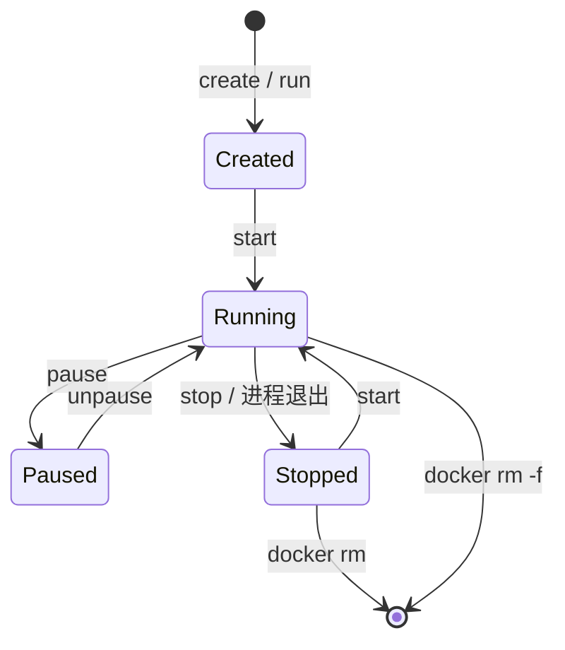

> **Docker 系列 · 第 5/33 篇**
> 上一篇：[《Docker 安装三种方式——离线、在线与现成虚拟机》](/云原生/docker/docker-04-install) · 下一篇：[《容器日常命令——run、ps、stop、exec 与常用运维》](/云原生/docker/docker-06-container-commands)

---

## 开头：删容器会不会把镜像也删了？

同事误执行 `docker rm` 之后紧张地问：「镜像还在吗？要重新 pull 吗？」

慌的根源是没分清两样东西：

- **镜像（Image）**：只读模板，负责「带什么文件/环境」——可拉取、可打 tag、可推送
- **容器（Container）**：镜像的运行实例，负责「进程怎么跑」——可停、可删；删实例默认**不**删模板

官方也把容器说成「带齐所需文件的隔离进程」，把镜像说成「标准化的打包：文件、二进制、库与配置」；镜像由多层（layer）组成，容器从镜像实例化而来。

本篇先把心智模型讲清，再把**镜像侧常用命令**本机跑一遍；容器日常线（`run/ps/stop/rm`）留给第 6 篇。

> **实验环境**：Docker Client / Server **29.1.2**（Docker Desktop，Windows）。示例镜像：`alpine:3.21`。概念参考：[What is an image?](https://docs.docker.com/get-started/docker-concepts/the-basics/what-is-an-image/)、[What is a container?](https://docs.docker.com/get-started/docker-concepts/the-basics/what-is-a-container/)。

---

## 一、是什么：镜像与容器各管什么？

| 维度 | 镜像（Image） | 容器（Container） |
|------|---------------|-------------------|
| 状态 | 静态、只读 | 动态、有生命周期 |
| 内容 | 分层 rootfs + 配置（config/manifest） | 镜像层 + **可写层** + 运行态（进程、网络等） |
| 类比 | 类 / 安装包 / ISO | 实例 / 进程组 |
| 职责 | **存储与分发**（pull / push / save） | **运行应用** |
| 删除 | `docker image rm` / `docker rmi` | `docker rm`（运行中需先 stop 或 `-f`） |

实现直觉（足够支撑后续命令）：

1. 引擎用镜像创建容器时，在只读层之上再叠一层 **container layer（可写）**
2. 同一镜像可起多个容器——多个实例，默认互不影响
3. 在容器里 `echo`、装包，改的是**可写层**，不是镜像本身

```text
同一份 alpine:3.21
        │
        ├─► 容器 c1（自己的可写层）
        └─► 容器 c2（另一份可写层）
```

---

## 二、为什么要这样分？

| 诉求 | 设计 |
|------|------|
| 一次构建、到处跑 | 交付的是**镜像**，不是某台机器上的临时容器 |
| 一台机器跑多份 | 一份镜像 → 多个容器 |
| 改运行态不污染模板 | 可写层独立；要固化再用 commit / 更推荐 Dockerfile |
| 协作与缓存 | layer 可复用；Registry 可按层增量传（深讲见第 8、14 篇） |

引用格式：

```text
[<registry>/][<namespace>/]<repository>:<tag>
```

省略 tag 时默认常为 `latest`（习惯上别过度迷信 `latest` 的「永远最新」）。容器**不会** push 进 Registry；仓库里存的是镜像。

---

## 三、本机验证：删容器 ≠ 删镜像，改容器 ≠ 改镜像

### 3.1 同一镜像，两个容器

```bash
docker run -d --name c1-imgdemo alpine:3.21 sleep 300
docker run -d --name c2-imgdemo alpine:3.21 sleep 300
docker ps --filter name=imgdemo
```

本机：

```text
CONTAINER ID   IMAGE         NAMES
4d44f0026980   alpine:3.21   c2-imgdemo
8704df4c0e72   alpine:3.21   c1-imgdemo
```

两个容器 ID，镜像名相同——**一份模板，两个实例**。

### 3.2 改 c1，c2 看不见

```bash
docker exec c1-imgdemo sh -c "echo hello-from-c1 > /tmp/demo.txt && cat /tmp/demo.txt"
docker exec c2-imgdemo sh -c "ls /tmp/demo.txt"
```

本机：c1 打印 `hello-from-c1`；c2 报 `No such file or directory`。

### 3.3 删掉容器，镜像还在

```bash
docker rm -f c1-imgdemo c2-imgdemo
docker images alpine:3.21
```

```text
REPOSITORY   TAG       IMAGE ID       SIZE
alpine       3.21      48b0309ca019   12.2MB
```

这就是开篇那个问题的答案：**`docker rm` 删的是实例，不是模板。**

---

## 四、镜像命令：从 Registry 到本地

下面按「拿到 → 查看 → 命名 → 删除」讲镜像 CLI。官方子命令别名：`docker pull` ≡ `docker image pull`，`docker images` ≡ `docker image ls`，`docker rmi` ≡ `docker image rm`。

### 4.1 `pull`：拉取镜像

```bash
docker pull alpine:3.21
```

本机（已是最新时）：

```text
Digest: sha256:48b0309ca019d89d40f670aa1bc06e426dc0931948452e8491e3d65087abc07d
Status: Image is up to date for alpine:3.21
docker.io/library/alpine:3.21
```

默认 Registry 是 Docker Hub（`docker.io`）。私有仓地址写进名字即可，例如 `harbor.example.com/demo/alpine:3.21`（认证与 HTTPS 见 Harbor 篇）。

### 4.2 `images` / `image ls`：列出本地镜像

```bash
docker images alpine
# 等价：docker image ls alpine
```

本机：

```text
REPOSITORY   TAG       IMAGE ID       SIZE
alpine       3.21      48b0309ca019   12.2MB
alpine       latest    51183f2cfa63   13.1MB
```

注意：`3.21` 与 `latest` 是**两个不同 ID**——tag 只是名字，不一定指向同一内容。列表里的 SIZE 多为解压后占用观感，不等于下载流量（官方文档亦有说明）。

### 4.3 `inspect`：看镜像元数据

```bash
docker image inspect alpine:3.21 --format "Id={{.Id}} Os={{.Os}} Arch={{.Architecture}} Layers={{len .RootFS.Layers}} Cmd={{json .Config.Cmd}}"
```

本机：

```text
Id=sha256:48b0309ca019d89d40f670aa1bc06e426dc0931948452e8491e3d65087abc07d
Os=linux Arch=amd64 Layers=1 Cmd=["/bin/sh"]
```

排障时常用：确认架构（arm64/amd64）、入口命令、环境变量。完整 JSON 很大，优先用 `--format` 取字段。

对**容器**做 `docker inspect demo-nginx` 时字段更多（运行状态、端口绑定、挂载等），见下文「读懂 `docker inspect`」。

### 4.4 `history`：看「怎么叠出来的」

```bash
docker history alpine:3.21
```

本机：

```text
IMAGE          CREATED        CREATED BY                                       SIZE      COMMENT
48b0309ca019   4 months ago   CMD ["/bin/sh"]                                  0B        buildkit.dockerfile.v0
<missing>      4 months ago   ADD alpine-minirootfs-3.21.7-x86_64.tar.gz /…   8.5MB     buildkit.dockerfile.v0
```

每一行大致对应一层变化。为何能分层复用、UnionFS 如何挂载，见**第 22 篇**；这里先建立「镜像不是单文件黑盒」的直觉。

### 4.5 `tag`：给同一 ID 挂新门牌

```bash
docker tag alpine:3.21 mylab/alpine:demo
docker images --format "table {{.Repository}}\t{{.Tag}}\t{{.ID}}"
```

本机可见（节选）：

```text
REPOSITORY       TAG     IMAGE ID
alpine           3.21    48b0309ca019
mylab/alpine     demo    48b0309ca019
```

**同一个 IMAGE ID，两个名字**——不复制层。推私有仓前通常要 `tag` 成带 Registry 主机名的名字（第 8 篇会接到 `push` 流程）。

### 4.6 `rmi` / `image rm`：删除镜像（其实是删引用）

```bash
docker rmi mylab/alpine:demo
```

本机输出：`Untagged: mylab/alpine:demo`。  
`alpine:3.21` 仍在，因为还有 tag 指着 `48b0309ca019`。

要点：

- 有容器仍在使用该镜像时，删除会被拒绝（需先删容器，或按策略强制——慎用）
- 多个 tag 指向同一 ID 时，删其中一个 tag 往往只是 **Untagged**；层要等引用清零才真正回收
- 这与 `docker rm`（删容器）是两条线，别混用

### 4.7 `commit`：能固化，但不作为首选生产线

可以把容器可写层提交成新镜像（教学/应急有用）。下面四行是一条完整演示链：**先造一个未启动的容器 → 把它固化成新镜像 → 删掉临时容器 → 用 history 核对多出来的层**。本例几乎没改文件，目的是走通流程，不是做出「有内容差异」的镜像。

```bash
cid=$(docker create alpine:3.21)
docker commit -m "lab note" "$cid" mylab/alpine:committed
docker rm "$cid"
docker history mylab/alpine:committed
```

逐行含义：

| 步骤 | 命令 | 在干什么 |
|------|------|----------|
| 1 | `cid=$(docker create alpine:3.21)` | `create` 只**创建**容器、**不启动**进程；把容器 ID 存进变量 `cid`，供后面引用 |
| 2 | `docker commit -m "lab note" "$cid" mylab/alpine:committed` | 把该容器当前状态（镜像层 + 可写层）打成**新镜像**；`-m` 写进层的 COMMENT；名字是 `mylab/alpine:committed` |
| 3 | `docker rm "$cid"` | 临时容器使命完成，删掉实例；**新镜像仍留在本地** |
| 4 | `docker history mylab/alpine:committed` | 看分层历史；相对原始 `alpine:3.21`，顶部多一行带 COMMENT `lab note` 的层 |

`create` 与 `run` 的差别：`run` ≈ create + start；这里故意用 `create`，避免起进程，只为 commit 留一个可引用的容器对象。若你在 commit 前往容器里写过文件或装过包，新层里才会有实质内容；本例几乎是「空提交」，history 上仍能看到那条 `lab note` 记录。

本机会在历史顶部看到带 COMMENT `lab note` 的新层。长期维护更推荐 **Dockerfile 重建**（可重复、可审查）——见第 9 篇。

### 4.8 边界：本篇不展开的镜像命令

| 命令 | 去哪看 |
|------|--------|
| `docker save` / `docker load` | 第 8 篇：离线搬运 |
| `docker push` + 私有仓 | 第 12 篇 Harbor |
| `docker build` + Dockerfile | 第 9 篇 |

---

## 五、读懂 `docker inspect`：容器元数据地图

`docker inspect` 可检查容器、镜像等多种对象（见[官方 inspect](https://docs.docker.com/reference/cli/docker/inspect/)）。对容器执行时，返回的是引擎眼里这份实例的**完整说明书**——最外层是 JSON **数组**，通常只有一个对象：`[{ ... }]`。字段很多，别想一次背完。

正确读法：

1. **按真实 JSON 出现的块顺序扫**（身份 → State → 路径/名称 → HostConfig → Mounts → Config → NetworkSettings → Manifest）
2. **再用 `--format` 取字段**，别每次肉眼翻几百行

下面以本机实验容器为准（先起、再看；示例 JSON 与本机一次真实输出一致）：

```bash
docker run -d --name demo-nginx -p 8080:80 nginx:alpine
docker inspect demo-nginx
```

### 5.1 镜像 inspect vs 容器 inspect

| | `docker image inspect` | `docker inspect <容器>` |
|--|------------------------|-------------------------|
| 看什么 | 模板：层、架构、默认 Cmd/Env | **这一次运行**：状态、端口绑定、实际挂载、PID… |
| 何时用 | 确认拉到了什么、给谁打 tag | 排障：为啥起不来、端口映到哪、环境变量是啥 |

同一条 `docker inspect` 也可写 `docker container inspect`；对象名冲突时可用类型前缀消歧。

下面从数组里**第一个对象**开始，按块拆开对照。

### 5.2 身份与「进程 1 怎么起来」

```json
{
  "Id": "f4184869fb43ec14361b84d682e9aa0f5475033bbba411bed96878737cea42a9",
  "Created": "2026-08-16T08:34:06.386404784Z",
  "Path": "/docker-entrypoint.sh",
  "Args": [
    "nginx",
    "-g",
    "daemon off;"
  ]
}
```

| 字段 | 含义 |
|------|------|
| `Id` | 容器完整 ID；`docker ps` 通常只显示前 12 位（本例 `f4184869fb43`） |
| `Created` | 创建时间（UTC） |
| `Path` + `Args` | 实际启动的可执行文件与参数——「进程 1 到底怎么拉起来」 |

`Path`/`Args` 对应镜像里的 `Entrypoint`+`Cmd` 解析结果：本例入口是 `/docker-entrypoint.sh`，参数是 `nginx -g daemon off;`。

### 5.3 `State`：现在活着吗？

```json
"State": {
  "Status": "running",
  "Running": true,
  "Paused": false,
  "Restarting": false,
  "OOMKilled": false,
  "Dead": false,
  "Pid": 2274,
  "ExitCode": 0,
  "Error": "",
  "StartedAt": "2026-08-16T08:34:06.482946851Z",
  "FinishedAt": "0001-01-01T00:00:00Z"
}
```

| 字段 | 含义 |
|------|------|
| `Status` | 总状态：`created` / `running` / `exited` / `paused`… |
| `Running` / `Paused` / `Restarting` / `Dead` | 布尔开关，细拆状态 |
| `Pid` | 容器主进程在**宿主机（或 Desktop 里的 Linux VM）**上的 PID；未运行多为 `0` |
| `ExitCode` | 退出码；正在跑时常见为 `0` |
| `Error` | 引擎记录的错误；正常为空串 |
| `OOMKilled` | 是否曾因内存不足被杀 |
| `StartedAt` / `FinishedAt` | 启动 / 结束时间；未结束时 `FinishedAt` 常是零值 `0001-01-01T00:00:00Z` |

排障口诀：先看 `Status` / `Error` / `OOMKilled` / `ExitCode`，再决定要不要看日志或资源限制。

### 5.4 镜像指针、日志路径与其它顶层字段

紧挨在 `State` 后面的一批顶层键：

```json
{
  "Image": "sha256:4a73073bd557c65b759505da037898b61f1be6cbcc3c2c3aeac22d2a470c1752",
  "ResolvConfPath": "/var/lib/docker/containers/f4184869fb43…/resolv.conf",
  "HostnamePath": "/var/lib/docker/containers/f4184869fb43…/hostname",
  "HostsPath": "/var/lib/docker/containers/f4184869fb43…/hosts",
  "LogPath": "/var/lib/docker/containers/f4184869fb43…/f4184869fb43…-json.log",
  "Name": "/demo-nginx",
  "RestartCount": 0,
  "Driver": "overlayfs",
  "Platform": "linux",
  "MountLabel": "",
  "ProcessLabel": "",
  "AppArmorProfile": "",
  "ExecIDs": null
}
```

（路径里的容器 ID 已用 `…` 缩短；你本机 `inspect` 里是完整路径。）

| 字段 | 含义 |
|------|------|
| `Image` | 所用镜像的**内容摘要**（sha256），不是 `nginx:alpine` 这个名字 |
| `Name` | 容器名，常带前导 `/` → `/demo-nginx` |
| `RestartCount` | 按重启策略已重启次数 |
| `Driver` | 存储驱动（本机 `overlayfs`） |
| `Platform` | 平台（`linux`） |
| `LogPath` | 默认 json-file 日志在 daemon 侧的路径；日常用 `docker logs` 即可 |
| `ResolvConfPath` / `HostnamePath` / `HostsPath` | 注入容器的 DNS/hostname/hosts 在宿主机（或 VM）上的文件 |
| `AppArmorProfile` / `MountLabel` / `ProcessLabel` | Linux 安全模块相关；Desktop 上常为空 |
| `ExecIDs` | 当前是否有 `docker exec` 会话；没有则为 `null` |

注意：这里的 `Image` 是摘要；人读的镜像名在后面的 `Config.Image`。

### 5.5 `HostConfig`：宿主机怎么约束这个容器

`Config` 偏「应用想怎样」；`HostConfig` 偏「宿主机允许怎样」。本例完整块如下（很长是正常的——大量资源字段为 `0`/`null`/`false` 表示**未限制 / 用默认**）：

```json
"HostConfig": {
  "Binds": null,
  "ContainerIDFile": "",
  "LogConfig": {
    "Type": "json-file",
    "Config": {}
  },
  "NetworkMode": "bridge",
  "PortBindings": {
    "80/tcp": [
      {
        "HostIp": "",
        "HostPort": "8080"
      }
    ]
  },
  "RestartPolicy": {
    "Name": "no",
    "MaximumRetryCount": 0
  },
  "AutoRemove": false,
  "VolumeDriver": "",
  "VolumesFrom": null,
  "ConsoleSize": [0, 0],
  "CapAdd": null,
  "CapDrop": null,
  "CgroupnsMode": "private",
  "Dns": null,
  "DnsOptions": [],
  "DnsSearch": [],
  "ExtraHosts": null,
  "GroupAdd": null,
  "IpcMode": "private",
  "Cgroup": "",
  "Links": null,
  "OomScoreAdj": 0,
  "PidMode": "",
  "Privileged": false,
  "PublishAllPorts": false,
  "ReadonlyRootfs": false,
  "SecurityOpt": null,
  "UTSMode": "",
  "UsernsMode": "",
  "ShmSize": 67108864,
  "Runtime": "runc",
  "Isolation": "",
  "CpuShares": 0,
  "Memory": 0,
  "NanoCpus": 0,
  "CgroupParent": "",
  "BlkioWeight": 0,
  "BlkioWeightDevice": [],
  "BlkioDeviceReadBps": [],
  "BlkioDeviceWriteBps": [],
  "BlkioDeviceReadIOps": [],
  "BlkioDeviceWriteIOps": [],
  "CpuPeriod": 0,
  "CpuQuota": 0,
  "CpuRealtimePeriod": 0,
  "CpuRealtimeRuntime": 0,
  "CpusetCpus": "",
  "CpusetMems": "",
  "Devices": [],
  "DeviceCgroupRules": null,
  "DeviceRequests": null,
  "MemoryReservation": 0,
  "MemorySwap": 0,
  "MemorySwappiness": null,
  "OomKillDisable": null,
  "PidsLimit": null,
  "Ulimits": [],
  "CpuCount": 0,
  "CpuPercent": 0,
  "IOMaximumIOps": 0,
  "IOMaximumBandwidth": 0,
  "MaskedPaths": [
    "/proc/acpi",
    "/proc/asound",
    "/proc/interrupts",
    "/proc/kcore",
    "/proc/keys",
    "/proc/latency_stats",
    "/proc/sched_debug",
    "/proc/scsi",
    "/proc/timer_list",
    "/proc/timer_stats",
    "/sys/devices/virtual/powercap",
    "/sys/firmware"
  ],
  "ReadonlyPaths": [
    "/proc/bus",
    "/proc/fs",
    "/proc/irq",
    "/proc/sys",
    "/proc/sysrq-trigger"
  ]
}
```

排障时优先盯这些：

| 字段 | 本例 | 含义 |
|------|------|------|
| `PortBindings` | `80/tcp → HostPort 8080` | **你请求的**端口发布（来自 `-p 8080:80`） |
| `NetworkMode` | `bridge` | 网络模式 |
| `RestartPolicy.Name` | `no` | 不自动重启 |
| `AutoRemove` | `false` | 退出后不自动删（`--rm` 才会是 true） |
| `Binds` | `null` | 没有 `-v` bind mount |
| `Memory` / `NanoCpus` 等 | `0` | 未设资源上限 |
| `Privileged` / `CapAdd` / `CapDrop` | 默认收紧 | 权限与 Linux capabilities |
| `LogConfig.Type` | `json-file` | 日志驱动 |
| `Runtime` | `runc` | 底层 OCI runtime |
| `MaskedPaths` / `ReadonlyPaths` | 一串 `/proc`、`/sys` | 引擎默认遮罩/只读，降低容器碰敏感内核接口的风险 |

其余 CPU/IO/ulimit 字段本例全是「未配置」的零值——看到一长串别慌，多数可以跳过。

### 5.6 `GraphDriver` 与顶层 `Mounts`

```json
"GraphDriver": {
  "Data": null,
  "Name": ""
},
"Mounts": []
```

| 字段 | 含义 |
|------|------|
| `GraphDriver` | 可写层用的图驱动信息；排存储问题时偶用。本机 Desktop 上 `Data`/`Name` 可能为空，不代表容器没存储 |
| `Mounts` | **解析后的挂载结果**（类型、源、目标、读写）。本例 `[]`——没挂 volume/bind |

可写层里 `echo` 出来的文件**不会**出现在 `Mounts`；`Mounts` 只描述显式挂载。

### 5.7 `Config`：镜像带来的「默认运行配置」

描述容器内期望的应用配置（不等于宿主机端口怎么映射）：

```json
"Config": {
  "Hostname": "f4184869fb43",
  "Domainname": "",
  "User": "",
  "AttachStdin": false,
  "AttachStdout": false,
  "AttachStderr": false,
  "ExposedPorts": {
    "80/tcp": {}
  },
  "Tty": false,
  "OpenStdin": false,
  "StdinOnce": false,
  "Env": [
    "PATH=/usr/local/sbin:/usr/local/bin:/usr/sbin:/usr/bin:/sbin:/bin",
    "NGINX_VERSION=1.31.3",
    "PKG_RELEASE=1",
    "DYNPKG_RELEASE=1",
    "NJS_VERSION=1.0.0",
    "NJS_RELEASE=1",
    "ACME_VERSION=0.4.1"
  ],
  "Cmd": [
    "nginx",
    "-g",
    "daemon off;"
  ],
  "Image": "nginx:alpine",
  "Volumes": null,
  "WorkingDir": "/",
  "Entrypoint": [
    "/docker-entrypoint.sh"
  ],
  "OnBuild": null,
  "Labels": {
    "maintainer": "NGINX Docker Maintainers <docker-maint@nginx.com>"
  },
  "StopSignal": "SIGQUIT",
  "StopTimeout": 1
}
```

| 字段 | 含义 | 本例 |
|------|------|------|
| `Hostname` | 容器主机名 | 默认常取 ID 前缀：`f4184869fb43` |
| `Image` | 创建时用的镜像**引用名** | `nginx:alpine` |
| `Entrypoint` / `Cmd` | 入口与默认参数 | 与前面 `Path`/`Args` 对应 |
| `Env` | 环境变量 | 含 `PATH`、`NGINX_VERSION=1.31.3` 等 |
| `ExposedPorts` | 镜像声明「我听这些端口」（文档式） | `80/tcp` |
| `WorkingDir` | 工作目录 | `/` |
| `User` | 以何用户跑；空多为镜像默认（常是 root） | `""` |
| `Labels` | 键值标签 | maintainer 等 |
| `StopSignal` / `StopTimeout` | `docker stop` 相关 | Nginx 镜像常见 `SIGQUIT` |
| `Tty` / `OpenStdin` / `Attach*` | TTY 与标准流挂接 | 后台 `-d` 时多为 false |

注意：`ExposedPorts` **不会**自动在宿主机开门；真要映射看 `HostConfig.PortBindings` 和下一节 `NetworkSettings.Ports`。

### 5.8 `NetworkSettings`：网络与端口真相

```json
"NetworkSettings": {
  "Bridge": "",
  "SandboxID": "147606b6557f06927d9490a9566cb39e9c357067f04e596a914af12589e0ec88",
  "SandboxKey": "/var/run/docker/netns/147606b6557f",
  "Ports": {
    "80/tcp": [
      {
        "HostIp": "0.0.0.0",
        "HostPort": "8080"
      },
      {
        "HostIp": "::",
        "HostPort": "8080"
      }
    ]
  },
  "HairpinMode": false,
  "LinkLocalIPv6Address": "",
  "LinkLocalIPv6PrefixLen": 0,
  "SecondaryIPAddresses": null,
  "SecondaryIPv6Addresses": null,
  "EndpointID": "",
  "Gateway": "",
  "GlobalIPv6Address": "",
  "GlobalIPv6PrefixLen": 0,
  "IPAddress": "",
  "IPPrefixLen": 0,
  "IPv6Gateway": "",
  "MacAddress": "",
  "Networks": {
    "bridge": {
      "IPAMConfig": null,
      "Links": null,
      "Aliases": null,
      "MacAddress": "02:24:6a:fe:b2:23",
      "DriverOpts": null,
      "GwPriority": 0,
      "NetworkID": "eeec2fc3251d2340ae077e373244a09d6ef0690300fe4e74dfacb25aac7bff93",
      "EndpointID": "47a615eb54f4a92c2a7a5337484291eaa4ef411a746f1da39bf0eb776794c4ad",
      "Gateway": "172.17.0.1",
      "IPAddress": "172.17.0.2",
      "IPPrefixLen": 16,
      "IPv6Gateway": "",
      "GlobalIPv6Address": "",
      "GlobalIPv6PrefixLen": 0,
      "DNSNames": null
    }
  }
}
```

| 字段 | 含义 |
|------|------|
| `Ports` | **实际生效**的端口映射：本例容器 `80` → 宿主机 `0.0.0.0:8080` 与 `[::]:8080` |
| `Networks.bridge.IPAddress` | 容器在 bridge 网上的 IP：`172.17.0.2` |
| `Networks.bridge.Gateway` | 网关：`172.17.0.1` |
| 顶层 `IPAddress` / `Gateway` / `MacAddress` | 旧式扁平字段；较新引擎 / Desktop 上**经常为空**——空不代表没 IP，请改看 `Networks.<网络名>` |
| `SandboxID` / `SandboxKey` | 网络命名空间相关标识；日常排障很少直接用 |

从 Windows/macOS 宿主机访问服务，优先用**发布端口**（本例 `8080`），不要假设能直接路由到 `172.17.0.2`。

### 5.9 `ImageManifestDescriptor`：这份镜像清单是谁

较新引擎还会带上 OCI manifest 描述（多平台 / 溯源时有用）：

```json
"ImageManifestDescriptor": {
  "mediaType": "application/vnd.oci.image.manifest.v1+json",
  "digest": "sha256:1d40e3eb3bf4f138de1d67193f2aa5309fcaf343eb5ffadbf5e9439de1eb1ebb",
  "size": 2495,
  "annotations": {
    "com.docker.official-images.bashbrew.arch": "amd64",
    "org.opencontainers.image.base.digest": "sha256:303405b1401ffdc4fc6e57c8824761cf39bd28b8399e0c5933a20e7273c8cbf5",
    "org.opencontainers.image.base.name": "nginx:1.31.3-alpine-slim",
    "org.opencontainers.image.created": "2026-07-15T23:57:27Z",
    "org.opencontainers.image.revision": "ccdab6c99ae2e2fc53a144dc68d6b8f44163adf2",
    "org.opencontainers.image.source": "https://github.com/nginx/docker-nginx.git#ccdab6c99ae2e2fc53a144dc68d6b8f44163adf2:mainline/alpine",
    "org.opencontainers.image.url": "https://hub.docker.com/_/nginx",
    "org.opencontainers.image.version": "1.31.3-alpine"
  },
  "platform": {
    "architecture": "amd64",
    "os": "linux"
  }
}
```

日常运维看 `platform`（确认 amd64/arm64）和 `annotations` 里的版本/来源即可；其余可当扩展元数据。

到这里，`inspect` 数组里那一个对象的主要块就齐了。回头对照你自己的 `docker inspect demo-nginx`，顺序应大致相同，具体 ID/IP/时间会不同。

### 5.10 常用 `--format` 配方（本机可直接抄）

完整 JSON 适合学习；排障时用 `--format` 只取需要的字段：

```bash
# 状态一眼看清
docker inspect demo-nginx --format "{{.Name}} {{.State.Status}} pid={{.State.Pid}} oom={{.State.OOMKilled}}"

# 镜像名 + 入口
docker inspect demo-nginx --format "Image={{.Config.Image}} Entrypoint={{json .Config.Entrypoint}} Cmd={{json .Config.Cmd}}"

# 端口映射
docker inspect demo-nginx --format "{{json .NetworkSettings.Ports}}"

# bridge 网 IP（Desktop 也适用）
docker inspect demo-nginx --format "{{range .NetworkSettings.Networks}}{{.IPAddress}}{{end}}"

# 环境变量
docker inspect demo-nginx --format "{{range .Config.Env}}{{println .}}{{end}}"

# 挂载
docker inspect demo-nginx --format "{{json .Mounts}}"
```

本机对应结果（节选）：`Name=/demo-nginx`、`Status=running`、`Image=nginx:alpine`、`8080->80`、`172.17.0.2`。

实验看完可清理：`docker rm -f demo-nginx`。

## 六、容器生命周期（概念图，命令细节见第 6 篇）



| 阶段 | 命令方向（细节第 6 篇） |
|------|-------------------------|
| 获取镜像 | `docker pull`（本篇） |
| 创建并启动 | `docker run` |
| 查看 | `docker ps` / `ps -a`；深挖用本篇 `inspect` |
| 停止 / 再启 | `stop` / `start` |
| 删容器 | `docker rm` |
| 删镜像 | `docker rmi`（本篇） |

**注意：** 容器删掉后，未提交的可写层数据默认丢失；要持久化用 **volume / bind mount**（网络与存储相关篇再展开），别把重要数据只写在容器可写层里。

---

## 七、和系列「三要素」的衔接

| 概念 | 本篇位置 |
|------|----------|
| **Registry** | 存镜像；`pull`/`push` 的对面 |
| **Image** | 只读模板；镜像命令 + `image inspect` |
| **Container** | 运行实体；概念 + **`inspect` 字段地图**；日常启停见第 6 篇 |

一句话：**容器通过镜像创建**——这是 Engine API 与 CLI 的共同前提。

---

## 八、命令速查

| 目的 | 命令 |
|------|------|
| 拉取 | `docker pull IMAGE[:TAG]` |
| 列表 | `docker images` / `docker image ls` |
| 镜像元数据 | `docker image inspect IMAGE` |
| 容器元数据 | `docker inspect CONTAINER` |
| 分层历史 | `docker history IMAGE` |
| 打标签 | `docker tag SOURCE TARGET` |
| 删镜像引用 | `docker rmi IMAGE` / `docker image rm` |
| 容器改动固化（慎用） | `docker commit CONTAINER [REPO[:TAG]]` |

---

## 小结

- 镜像分发，容器运行；一对多，可写层隔离——**删容器 ≠ 删镜像，改容器 ≠ 改镜像**。
- 镜像日常：`pull` → `images` → `inspect`/`history` → `tag` → `rmi`；`commit` 能救急，生产线优先 Dockerfile。
- 容器 `inspect`：按块对照完整 JSON（身份 → State → HostConfig → Config → NetworkSettings…）；Desktop 下 IP 看 `Networks`，端口看 `Ports`。
- 容器怎么跑、怎么停、怎么清 → **第 6 篇**；离线打包 → 第 8 篇；分层原理 → 第 22 篇。

下一篇见 🐳
