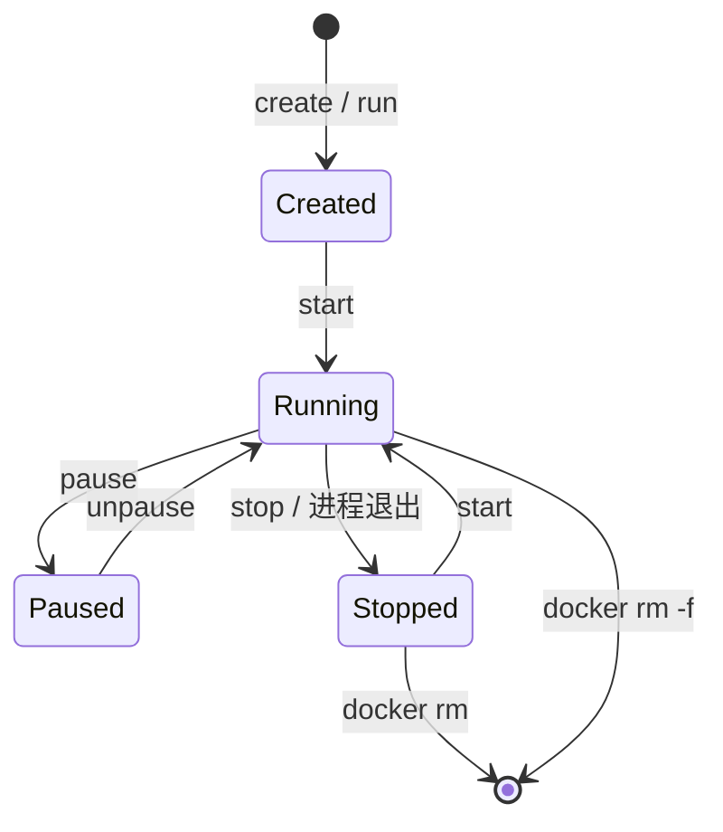

> **Docker 系列 · 第 5/18 篇**  
> 上一篇：[《Docker 安装三种方式——离线、在线与现成虚拟机》](/云原生/docker/docker-04-install)  
> 下一篇：[《容器日常命令——run、ps、stop、exec 与常用运维》](/云原生/docker/docker-06-container-commands)

---

## 开头：删容器会不会把镜像也删了？

同事误执行 `docker rm` 之后紧张地问：「镜像还在吗？要重新 pull 吗？」

慌的根源是没分清两样东西：

- **镜像（Image）**：只读模板，负责「带什么文件/环境」——可拉取、可打 tag、可推送
- **容器（Container）**：镜像的运行实例，负责「进程怎么跑」——可停、可删；删实例默认**不**删模板

官方也把容器说成「带齐所需文件的隔离进程」，把镜像说成「标准化的打包：文件、二进制、库与配置」；镜像由多层（layer）组成，容器从镜像实例化而来。

本篇先把心智模型讲清，再把**镜像侧常用命令**本机跑一遍；容器日常线（`run/ps/stop/rm`）留给第 6 篇。

> **实验环境**：Docker Client / Server **29.1.2**（Docker Desktop，Windows）。示例镜像：`alpine:3.21`。概念参考：[What is an image?](https://docs.docker.com/get-started/docker-concepts/the-basics/what-is-an-image/)、[What is a container?](https://docs.docker.com/get-started/docker-concepts/the-basics/what-is-a-container/)。

---

## 一、是什么：镜像与容器各管什么？

| 维度 | 镜像（Image） | 容器（Container） |
|------|---------------|-------------------|
| 状态 | 静态、只读 | 动态、有生命周期 |
| 内容 | 分层 rootfs + 配置（config/manifest） | 镜像层 + **可写层** + 运行态（进程、网络等） |
| 类比 | 类 / 安装包 / ISO | 实例 / 进程组 |
| 职责 | **存储与分发**（pull / push / save） | **运行应用** |
| 删除 | `docker image rm` / `docker rmi` | `docker rm`（运行中需先 stop 或 `-f`） |

实现直觉（足够支撑后续命令）：

1. 引擎用镜像创建容器时，在只读层之上再叠一层 **container layer（可写）**
2. 同一镜像可起多个容器——多个实例，默认互不影响
3. 在容器里 `echo`、装包，改的是**可写层**，不是镜像本身

```text
同一份 alpine:3.21
        │
        ├─► 容器 c1（自己的可写层）
        └─► 容器 c2（另一份可写层）
```

---

## 二、为什么要这样分？

| 诉求 | 设计 |
|------|------|
| 一次构建、到处跑 | 交付的是**镜像**，不是某台机器上的临时容器 |
| 一台机器跑多份 | 一份镜像 → 多个容器 |
| 改运行态不污染模板 | 可写层独立；要固化再用 commit / 更推荐 Dockerfile |
| 协作与缓存 | layer 可复用；Registry 可按层增量传（深讲见第 8、14 篇） |

引用格式：

```text
[<registry>/][<namespace>/]<repository>:<tag>
```

省略 tag 时默认常为 `latest`（习惯上别过度迷信 `latest` 的「永远最新」）。容器**不会** push 进 Registry；仓库里存的是镜像。

---

## 三、本机验证：删容器 ≠ 删镜像，改容器 ≠ 改镜像

### 3.1 同一镜像，两个容器

```bash
docker run -d --name c1-imgdemo alpine:3.21 sleep 300
docker run -d --name c2-imgdemo alpine:3.21 sleep 300
docker ps --filter name=imgdemo
```

本机：

```text
CONTAINER ID   IMAGE         NAMES
4d44f0026980   alpine:3.21   c2-imgdemo
8704df4c0e72   alpine:3.21   c1-imgdemo
```

两个容器 ID，镜像名相同——**一份模板，两个实例**。

### 3.2 改 c1，c2 看不见

```bash
docker exec c1-imgdemo sh -c "echo hello-from-c1 > /tmp/demo.txt && cat /tmp/demo.txt"
docker exec c2-imgdemo sh -c "ls /tmp/demo.txt"
```

本机：c1 打印 `hello-from-c1`；c2 报 `No such file or directory`。

### 3.3 删掉容器，镜像还在

```bash
docker rm -f c1-imgdemo c2-imgdemo
docker images alpine:3.21
```

```text
REPOSITORY   TAG       IMAGE ID       SIZE
alpine       3.21      48b0309ca019   12.2MB
```

这就是开篇那个问题的答案：**`docker rm` 删的是实例，不是模板。**

---

## 四、镜像命令：从 Registry 到本地

下面按「拿到 → 查看 → 命名 → 删除」讲镜像 CLI。官方子命令别名：`docker pull` ≡ `docker image pull`，`docker images` ≡ `docker image ls`，`docker rmi` ≡ `docker image rm`。

### 4.1 `pull`：拉取镜像

```bash
docker pull alpine:3.21
```

本机（已是最新时）：

```text
Digest: sha256:48b0309ca019d89d40f670aa1bc06e426dc0931948452e8491e3d65087abc07d
Status: Image is up to date for alpine:3.21
docker.io/library/alpine:3.21
```

默认 Registry 是 Docker Hub（`docker.io`）。私有仓地址写进名字即可，例如 `harbor.example.com/demo/alpine:3.21`（认证与 HTTPS 见 Harbor 篇）。

### 4.2 `images` / `image ls`：列出本地镜像

```bash
docker images alpine
# 等价：docker image ls alpine
```

本机：

```text
REPOSITORY   TAG       IMAGE ID       SIZE
alpine       3.21      48b0309ca019   12.2MB
alpine       latest    51183f2cfa63   13.1MB
```

注意：`3.21` 与 `latest` 是**两个不同 ID**——tag 只是名字，不一定指向同一内容。列表里的 SIZE 多为解压后占用观感，不等于下载流量（官方文档亦有说明）。

### 4.3 `inspect`：看镜像元数据

```bash
docker image inspect alpine:3.21 --format "Id={{.Id}} Os={{.Os}} Arch={{.Architecture}} Layers={{len .RootFS.Layers}} Cmd={{json .Config.Cmd}}"
```

本机：

```text
Id=sha256:48b0309ca019d89d40f670aa1bc06e426dc0931948452e8491e3d65087abc07d
Os=linux Arch=amd64 Layers=1 Cmd=["/bin/sh"]
```

排障时常用：确认架构（arm64/amd64）、入口命令、环境变量。完整 JSON 很大，优先用 `--format` 取字段。

对**容器**做 `docker inspect demo-nginx` 时字段更多（运行状态、端口绑定、挂载等），见下文「读懂 `docker inspect`」。

### 4.4 `history`：看「怎么叠出来的」

```bash
docker history alpine:3.21
```

本机：

```text
IMAGE          CREATED        CREATED BY                                       SIZE      COMMENT
48b0309ca019   4 months ago   CMD ["/bin/sh"]                                  0B        buildkit.dockerfile.v0
<missing>      4 months ago   ADD alpine-minirootfs-3.21.7-x86_64.tar.gz /…   8.5MB     buildkit.dockerfile.v0
```

每一行大致对应一层变化。为何能分层复用、UnionFS 如何挂载，见**第 14 篇**；这里先建立「镜像不是单文件黑盒」的直觉。

### 4.5 `tag`：给同一 ID 挂新门牌

```bash
docker tag alpine:3.21 mylab/alpine:demo
docker images --format "table {{.Repository}}\t{{.Tag}}\t{{.ID}}"
```

本机可见（节选）：

```text
REPOSITORY       TAG     IMAGE ID
alpine           3.21    48b0309ca019
mylab/alpine     demo    48b0309ca019
```

**同一个 IMAGE ID，两个名字**——不复制层。推私有仓前通常要 `tag` 成带 Registry 主机名的名字（第 8 篇会接到 `push` 流程）。

### 4.6 `rmi` / `image rm`：删除镜像（其实是删引用）

```bash
docker rmi mylab/alpine:demo
```

本机输出：`Untagged: mylab/alpine:demo`。  
`alpine:3.21` 仍在，因为还有 tag 指着 `48b0309ca019`。

要点：

- 有容器仍在使用该镜像时，删除会被拒绝（需先删容器，或按策略强制——慎用）
- 多个 tag 指向同一 ID 时，删其中一个 tag 往往只是 **Untagged**；层要等引用清零才真正回收
- 这与 `docker rm`（删容器）是两条线，别混用

### 4.7 `commit`：能固化，但不作为首选生产线

可以把容器可写层提交成新镜像（教学/应急有用）：

```bash
cid=$(docker create alpine:3.21)
docker commit -m "lab note" "$cid" mylab/alpine:committed
docker rm "$cid"
docker history mylab/alpine:committed
```

本机会在历史顶部看到带 COMMENT `lab note` 的新层。长期维护更推荐 **Dockerfile 重建**（可重复、可审查）——见第 10 篇。

### 4.8 边界：本篇不展开的镜像命令

| 命令 | 去哪看 |
|------|--------|
| `docker save` / `docker load` | 第 8 篇：离线搬运 |
| `docker push` + 私有仓 | 第 9 篇 Harbor |
| `docker build` + Dockerfile | 第 10 篇 |

---

## 五、读懂 `docker inspect`：容器元数据地图

`docker inspect` 可检查容器、镜像等多种对象（见[官方 inspect](https://docs.docker.com/reference/cli/docker/inspect/)）。对容器执行时，返回的是引擎眼里这份实例的**完整说明书**——JSON 数组里通常只有一个对象，但字段极多。

正确读法：

1. **先按块扫**（身份 → State → Config → HostConfig → NetworkSettings → Mounts）
2. **再用 `--format` 取字段**，别每次肉眼翻几百行

下面以本机实验容器为准：

```bash
docker run -d --name demo-nginx -p 8080:80 nginx:alpine
docker inspect demo-nginx
```

### 5.1 镜像 inspect vs 容器 inspect

| | `docker image inspect` | `docker inspect <容器>` |
|--|------------------------|-------------------------|
| 看什么 | 模板：层、架构、默认 Cmd/Env | **这一次运行**：状态、端口绑定、实际挂载、PID… |
| 何时用 | 确认拉到了什么、给谁打 tag | 排障：为啥起不来、端口映到哪、环境变量是啥 |

同一条 `docker inspect` 也可写 `docker container inspect`；对象名冲突时可用类型前缀消歧。

### 5.2 身份与「从哪启动」

| 字段 | 含义 | 本机 `demo-nginx` 示例 |
|------|------|------------------------|
| `Id` | 容器完整 ID | `99285b68aa3b…`（`ps` 里只显示前 12 位） |
| `Name` | 名称，常带前导 `/` | `/demo-nginx` |
| `Created` | 创建时间（UTC） | `2026-08-16T08:16:39Z` |
| `Image` | 所用镜像的内容摘要（sha256） | `sha256:4a73073bd557…` |
| `Path` + `Args` | 实际启动的可执行文件与参数 | Path=`/docker-entrypoint.sh`，Args=`nginx -g daemon off;` |
| `Driver` | 存储驱动 | `overlayfs` |
| `Platform` | 平台 | `linux` |
| `RestartCount` | 按重启策略已重启次数 | `0` |
| `LogPath` | 默认 json-file 日志在 daemon 侧的路径 | 在 Desktop/Linux 上路径形态不同，一般用 `docker logs` 即可 |

`Path`/`Args` 回答的是：「进程 1 到底是怎么拉起来的？」——和镜像里的 `Entrypoint`+`Cmd` 对应，但这里是**解析后的运行结果**。

### 5.3 `State`：现在活着吗？

| 字段 | 含义 |
|------|------|
| `Status` | 总状态字符串：`created` / `running` / `exited` / `paused`… |
| `Running` / `Paused` / `Restarting` / `Dead` | 布尔开关，细拆状态 |
| `Pid` | 容器主进程在**宿主机（或 VM）PID 命名空间**里的进程号；未运行多为 `0` |
| `ExitCode` | 退出码；正在跑时通常为上次/当前约定值（本机 running 时为 `0`） |
| `Error` | 引擎记录的错误信息；正常为空串 |
| `OOMKilled` | 是否曾因内存不足被杀 |
| `StartedAt` / `FinishedAt` | 启动 / 结束时间；未结束时 `FinishedAt` 可能是零值时间 |

本机节选：

```text
Status=running  Running=true  Pid=1655  ExitCode=0  OOMKilled=false
StartedAt=2026-08-16T08:16:39Z
```

排障口诀：先看 `Status`/`Error`/`OOMKilled`/`ExitCode`，再决定要不要看日志或资源限制。

### 5.4 `Config`：镜像带来的「默认运行配置」

这一块主要来自镜像配置 + `run` 时覆盖，描述**容器内期望的应用配置**（不等于宿主机端口怎么映射）。

| 字段 | 含义 | 本机示例 |
|------|------|----------|
| `Hostname` | 容器主机名 | 默认常取 ID 前缀：`99285b68aa3b` |
| `Image` | 创建时用的镜像引用名 | `nginx:alpine` |
| `Entrypoint` | 入口 | `["/docker-entrypoint.sh"]` |
| `Cmd` | 传给入口的默认命令 | `["nginx","-g","daemon off;"]` |
| `Env` | 环境变量 | 含 `PATH`、`NGINX_VERSION=1.31.3` 等 |
| `ExposedPorts` | 镜像声明「我听这些端口」（文档式） | `80/tcp` |
| `WorkingDir` | 工作目录 | `/` |
| `User` | 以何用户跑；空表示默认（多为 root，视镜像） | `""` |
| `Labels` | 键值标签 | 镜像/构建时打的元数据 |
| `StopSignal` / `StopTimeout` | `docker stop` 时优先信号与超时相关 | 本机 `StopSignal=SIGQUIT`（Nginx 镜像常见） |
| `Tty` / `OpenStdin` / `Attach*` | 是否分配 TTY、是否挂接标准流 | 后台 `-d` 时多为 false |

注意：`ExposedPorts` **不会**自动在宿主机开门；真要映射看下一节 `HostConfig.PortBindings` / `NetworkSettings.Ports`。

### 5.5 `HostConfig`：宿主机怎么约束这个容器

| 字段 | 含义 | 本机示例 |
|------|------|----------|
| `PortBindings` | 端口发布请求：容器口 → 宿主机口 | `80/tcp → HostPort 8080` |
| `RestartPolicy` | 重启策略 | `Name=no`（默认不自动重启） |
| `NetworkMode` | 网络模式 | `bridge` |
| `Binds` | bind mount 字符串列表 | 本例 `null`（没挂目录） |
| `Mounts`（HostConfig 内） | 较新的挂载声明结构 | 与顶层 `Mounts` 结果呼应 |
| `Memory` / `NanoCpus` 等 | 资源限制；`0` 常表示未限制 | 本机均为 `0` |
| `Privileged` / `CapAdd` / `CapDrop` | 权限与能力 | 安全相关，默认收紧 |
| `AutoRemove` | 是否退出即删（对应 `--rm`） | |

`Config` 偏「应用想怎样」；`HostConfig` 偏「宿主机允许怎样」。端口、重启、资源、特权多在这里。

### 5.6 `NetworkSettings`：网络与端口真相

| 字段 | 含义 |
|------|------|
| `Ports` | **实际生效**的端口映射 |
| `Networks` | 加入的网络及每张网的 IP/网关/MAC |
| 顶层 `IPAddress` / `Gateway` / `MacAddress` | 旧式扁平字段；在较新引擎 / Desktop 上**经常为空**，请改看 `Networks.<网络名>` |

本机：

```text
Ports: 80/tcp → 0.0.0.0:8080 与 [::]:8080
Networks.bridge.IPAddress = 172.17.0.2
Networks.bridge.Gateway   = 172.17.0.1
顶层 IPAddress = ""   ← 空，不代表没 IP
```

从 Windows/macOS 宿主机访问服务，优先用**发布端口**（本例 `8080`），不要假设能直接路由到 `172.17.0.2`。

### 5.7 `Mounts`：实际挂上了什么

顶层 `Mounts` 是**解析后的挂载结果**（类型、源、目标、读写）。本例为空数组 `[]`——没挂 volume/bind。有数据卷时，这里能看到 `Type`（`bind`/`volume`）、`Source`、`Destination`、`RW` 等。

可写层里乱写的文件**不会**出现在 `Mounts` 里；`Mounts` 只描述显式挂载。

### 5.8 其他常见顶层字段（点到为止）

| 字段 | 含义 |
|------|------|
| `GraphDriver` | 可写层用的图驱动及底层目录信息（排存储问题偶用） |
| `HostsPath` / `HostnamePath` / `ResolvConfPath` | 注入容器的 hosts/hostname/resolv 在宿主机上的文件路径 |
| `AppArmorProfile` / `MountLabel` / `ProcessLabel` | Linux 安全模块相关标签 |
| `ExecIDs` | 当前 `docker exec` 会话相关 ID（有 exec 时才有内容） |
| `ImageManifestDescriptor` | 与镜像 manifest 相关的描述（多平台场景更有用） |

多数日常运维用不到整块；知道「安全/存储/DNS 注入信息在这里」即可。

### 5.9 常用 `--format` 配方（本机可直接抄）

```bash
# 状态一眼看清
docker inspect demo-nginx --format "{{.Name}} {{.State.Status}} pid={{.State.Pid}} oom={{.State.OOMKilled}}"

# 镜像名 + 入口
docker inspect demo-nginx --format "Image={{.Config.Image}} Entrypoint={{json .Config.Entrypoint}} Cmd={{json .Config.Cmd}}"

# 端口映射
docker inspect demo-nginx --format "{{json .NetworkSettings.Ports}}"

# bridge 网 IP（Desktop 也适用）
docker inspect demo-nginx --format "{{range .NetworkSettings.Networks}}{{.IPAddress}}{{end}}"

# 环境变量
docker inspect demo-nginx --format "{{range .Config.Env}}{{println .}}{{end}}"

# 挂载
docker inspect demo-nginx --format "{{json .Mounts}}"
```

本机前几条对应结果（节选）：`Name=/demo-nginx`、`Status=running`、`Image=nginx:alpine`、`8080->80`、`172.17.0.2`。

---

## 六、容器生命周期（概念图，命令细节见第 6 篇）



| 阶段 | 命令方向（细节第 6 篇） |
|------|-------------------------|
| 获取镜像 | `docker pull`（本篇） |
| 创建并启动 | `docker run` |
| 查看 | `docker ps` / `ps -a`；深挖用本篇 `inspect` |
| 停止 / 再启 | `stop` / `start` |
| 删容器 | `docker rm` |
| 删镜像 | `docker rmi`（本篇） |

**注意：** 容器删掉后，未提交的可写层数据默认丢失；要持久化用 **volume / bind mount**（网络与存储相关篇再展开），别把重要数据只写在容器可写层里。

---

## 七、和系列「三要素」的衔接

| 概念 | 本篇位置 |
|------|----------|
| **Registry** | 存镜像；`pull`/`push` 的对面 |
| **Image** | 只读模板；镜像命令 + `image inspect` |
| **Container** | 运行实体；概念 + **`inspect` 字段地图**；日常启停见第 6 篇 |

一句话：**容器通过镜像创建**——这是 Engine API 与 CLI 的共同前提。

---

## 八、命令速查

| 目的 | 命令 |
|------|------|
| 拉取 | `docker pull IMAGE[:TAG]` |
| 列表 | `docker images` / `docker image ls` |
| 镜像元数据 | `docker image inspect IMAGE` |
| 容器元数据 | `docker inspect CONTAINER` |
| 分层历史 | `docker history IMAGE` |
| 打标签 | `docker tag SOURCE TARGET` |
| 删镜像引用 | `docker rmi IMAGE` / `docker image rm` |
| 容器改动固化（慎用） | `docker commit CONTAINER [REPO[:TAG]]` |

---

## 小结

- 镜像分发，容器运行；一对多，可写层隔离——**删容器 ≠ 删镜像，改容器 ≠ 改镜像**。
- 镜像日常：`pull` → `images` → `inspect`/`history` → `tag` → `rmi`；`commit` 能救急，生产线优先 Dockerfile。
- 容器 `inspect`：按 **State / Config / HostConfig / NetworkSettings / Mounts** 读；Desktop 下 IP 看 `Networks`，端口看 `Ports`。
- 容器怎么跑、怎么停、怎么清 → **第 6 篇**；离线打包 → 第 8 篇；分层原理 → 第 14 篇。

下一篇见 🐳
