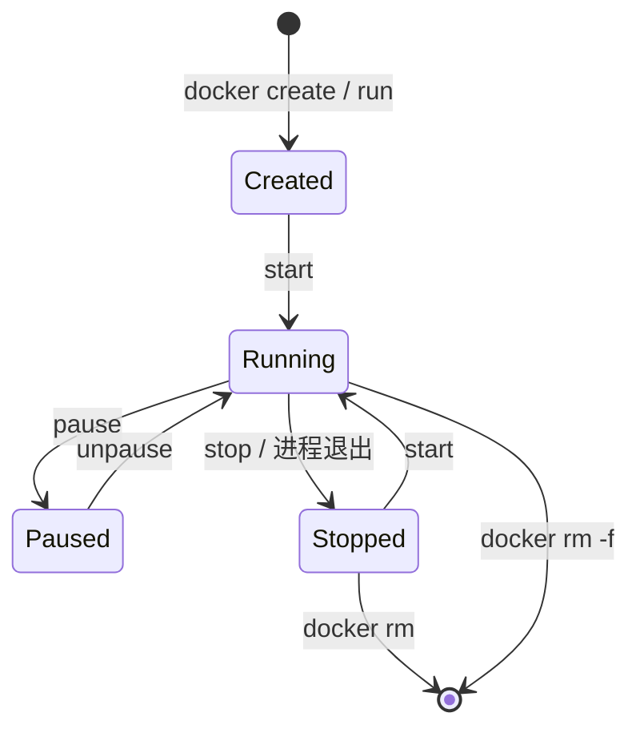

> **Docker 系列 · 第 5/23 篇**  
> 上一篇：[《Docker 安装三种方式——离线、在线与现成虚拟机》](/云原生/docker/docker-04-install)  
> 下一篇预告：[《容器日常命令——run、ps、stop、exec 与常用运维》](/云原生/docker/docker-06-container-commands)

---

## 开头：删容器会不会把镜像也删了？

同事误执行 `docker rm` 停掉测试容器后问：「镜像还在吗？要重新 pull 吗？」——说明 **Image 与 Container 的边界** 还没建立清楚。

镜像（Image）是**只读模板**；容器（Container）是镜像**运行时的实例**。删容器一般不删镜像；删镜像则无法再基于它启动新容器（除非重新 pull 或 load）。搞清二者关系，是正确使用 `docker run`、`docker commit`（后续篇）和 Dockerfile 构建的前提。

---

## 一、Container 容器是什么？

从 Engine 的实现角度，容器是这样诞生的：

1. **通过 Image 创建**（逻辑上是 copy-on-write 的「复制」）  
2. 在 **Image 的只读层（layers）之上**，再叠一层 **container layer（可读写）**  
3. 类比面向对象：**Image ≈ 类，Container ≈ 实例**  

职责分工：

| 对象 | 职责 |
|------|------|
| **Image** | 负责应用的**存储与分发**——打包文件系统与元数据，可 push/pull |
| **Container** | 负责**运行应用**——进程、网络、挂载等在运行时绑定 |

因此：**同一个镜像可以启动多个相互隔离的容器**（多个实例）；每个容器有自己的可写层，默认不影响镜像和其他容器。

---

## 二、镜像 vs 容器：对照理解

| 维度 | 镜像（Image） | 容器（Container） |
|------|---------------|-------------------|
| 状态 | 静态、只读 | 动态、有生命周期 |
| 内容 | 分层 rootfs + 配置 | 镜像层 + **可写层** + 运行态（PID、IP 等） |
| 类比 | 类、安装包、ISO | 实例、进程组 |
| 创建方式 | `docker pull`、`docker build` | `docker run`、`docker create` |
| 删除 | `docker rmi` | `docker rm`（需先 stop 或 `-f`） |

**镜像**：只读文件，提供运行程序所需的完整文件系统与依赖（在单一 Linux 内核前提下）。  
**容器**：镜像的实例，由 Docker 引擎创建；**容器之间彼此隔离**（namespace/cgroup）。

---

## 三、生命周期（简图）



典型命令对应：

| 阶段 | 命令示例 |
|------|----------|
| 获取镜像 | `docker pull nginx:latest` |
| 创建并启动 | `docker run -d --name web nginx` |
| 查看 | `docker ps` / `docker ps -a` |
| 停止 | `docker stop web` |
| 删除容器 | `docker rm web` |
| 删除镜像 | `docker rmi nginx:latest`（无容器引用时） |

**注意：** 容器删除后，**未提交**的可写层数据默认丢失；需持久化时应使用 **volume** 或 **bind mount**（系列后续篇章展开）。

---

## 四、与 Registry、Tag 的关系

镜像常从 **Registry** 拉取。引用格式：

```
<仓库名>:<标签>
```

例如 `nginx:1.25`。省略标签时默认为 **`latest`**。同一 Repository 下多个 Tag 对应同一软件的不同版本镜像。

容器**不**存入 Registry；交付时推送的是**镜像**。运行时在目标 Host 上 `docker run` 实例化。

---

## 五、面向对象类比（加深记忆）

```text
class Image {
    // 只读：Ubuntu、JDK、jar、配置
}

Image nginxImage = pull("nginx:latest");

Container c1 = nginxImage.run();  // 实例 1
Container c2 = nginxImage.run();  // 实例 2，相互隔离
```

- 修改 **c1 可写层**（如在容器内 `apt install`）**不会**改变镜像本身  
- 若要把改动固化为新镜像，需 `docker commit` 或更推荐的 **Dockerfile 重建**（系列第 10 篇 Dockerfile 主题）

---

## 六、和「基本组成」的衔接

回顾系列第 1、2 篇的三要素：

| 概念 | 在本篇中的位置 |
|------|----------------|
| **Registry** | 存 Image |
| **Image** | 静态模板；分层只读 |
| **Container** | Image 的运行实体；顶层可写 |

**Docker 容器通过 Docker 镜像来创建**——这是 Engine API 与 CLI 设计的基础假设。

---

## 小结

- 容器 = 镜像 + **可写 container layer** + 运行时隔离。  
- **Image 分发，Container 运行**；一对多，实例互隔离。  
- 删容器 ≠ 删镜像；持久化别依赖可写层，要用 volume。  
- 格式 `<repo>:<tag>`，默认 tag 为 `latest`。  

下一篇进入**日常命令**：`docker run`、`ps`、`stop`、`rm`、`top`、`exec` 等本地运维必备操作。
