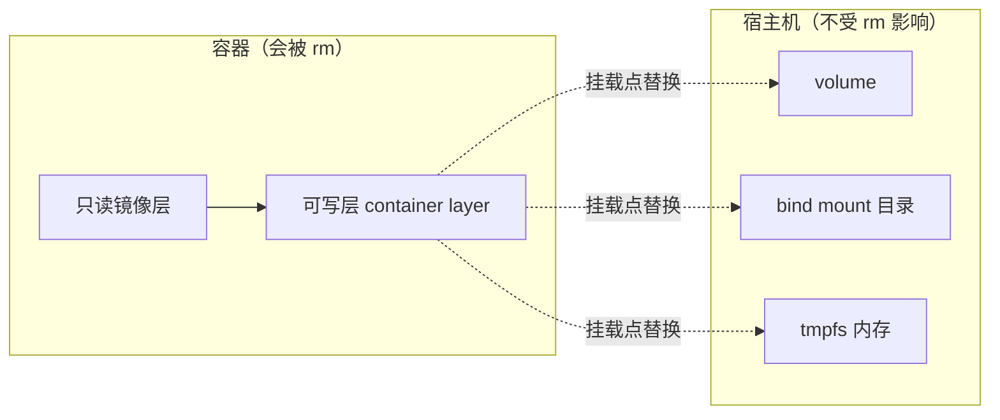

> **Docker 系列 · 第 12/24 篇**
> 上一篇：[《Docker 网络模式与实操——从 docker0 到 overlay》](/云原生/docker/docker-11-network) · 下一篇：[《Docker Compose 编排——用 YAML 定义一整栈微服务》](/云原生/docker/docker-13-compose)

---

## 开头：MySQL 容器一删，库没了

你用容器跑了个 MySQL，测试数据灌了两周。某天升级镜像版本：`docker rm` 旧容器、`docker run` 新容器——**库没了，两周白干**。

这不是 bug，是设计。[第 5 篇](/云原生/docker/docker-05-container-and-image/)讲过：容器的文件系统 = **只读镜像层 + 一层可写层**。可写层属于这个容器，容器一删，写在里面的数据就没了。

要让数据活得比容器久，得把「数据所在的那条路径」挂到容器外面去。本篇就讲这件事。正文用 busybox 当「库」的替身（镜像小、命令短），三种挂载各跟一条能抄的案例：

1. **命名卷保住数据**：写入 → 删容器 → 再挂，文件还在
2. **bind 热更新**：宿主机改文件，容器不重启就读到
3. **tmpfs 用完即焚**：写进内存，容器一停就没了

> 🗺️ **0 基础路线图**：第一次读只走主线，读完就能回答「数据挂哪、删容器会不会没、prune 会不会误伤」。带 🧗 的进阶块用到再回头。
> - **主线（顺序读）**：一（挂载是什么）→ 二（命令表，先当目录）→ 三（命名卷，跳过 3.4、3.5）→ 四（匿名卷与 prune）→ 五（bind）→ 六（tmpfs）→ 八（备份）→ 十（选型）
> - **进阶块（🧗）**：3.4 空卷垫底 ｜ 3.5 只挂子目录 ｜ 七 Image Mount（借工具，不是持久化）｜ 九 卷驱动（NFS 等）

> **实验环境**（文中输出均来自本机）：WSL2 Ubuntu-22.04 里的原生 Docker Engine **29.1.3**。官方参考：[Storage](https://docs.docker.com/engine/storage/)、[Volumes](https://docs.docker.com/engine/storage/volumes/)、[Bind mounts](https://docs.docker.com/engine/storage/bind-mounts/)、[tmpfs](https://docs.docker.com/engine/storage/tmpfs/)、[Image mounts](https://docs.docker.com/engine/storage/image-mounts/)。

---

## 一、背景知识：挂载把数据盖到容器外



**是什么**：挂载 = 把外部存储「盖」到容器内某条路径上。盖上之后，这条路径的读写都落在外部，不落在可写层。

**为什么**：可写层随容器生灭。不挂的话，`docker rm` 等于把库一并扔掉——开头那个 MySQL 故事。

三种持久化机制先定调（官方 [Storage](https://docs.docker.com/engine/storage/) 的定位）。第一次读只需记住「存哪、谁管、典型场景」三行，挂载写法后面逐节敲：

| | **Volume 命名卷** | **Bind Mount 绑定挂载** | **tmpfs** |
|------|------|------|------|
| 数据存哪 | Docker 管理的区域（`/var/lib/docker/volumes/`） | 宿主机上**你指定的任意目录** | 内存（不落盘） |
| 谁管理生命周期 | Docker（`docker volume` 命令族） | 你自己 | 随容器生灭 |
| 挂载方式 | `-v 卷名:/data` 或 `--mount type=volume` | `-v /host/path:/data` 或 `--mount type=bind` | `--tmpfs /scratch` 或 `--mount type=tmpfs` |
| 典型场景 | **数据库、中间件状态**（生产首选） | 开发时源码热更新、共享配置文件 | 敏感临时数据（密钥、会话缓存） |
| 可移植性 | ✅ 好（不依赖宿主机目录结构） | ❌ 差（换台机器路径就失效） | — |

> 🔑 官方建议一句话：**存数据用 Volume，共享/开发文件用 Bind Mount，不想留在磁盘上的临时数据用 tmpfs**（tmpfs 与「落盘」的关系有个官方修正，见 6.3）。

官方 Storage 总览（2026-07 版）其实列了五种挂载。另外两种本篇不当主线：**Image Mount** 是把另一张镜像只读挂进来「借工具」，不是持久化，进阶见第七节；**Named Pipe** 是 Windows 上容器连 Docker Engine 用的管道，Linux 世界见不到，本文不写。

---

## 二、持久化命令全家福——先把兵器摆上桌

和 [第 11 篇第二节](/云原生/docker/docker-11-network)同款打法：进实操前先把命令摆上桌，当目录用。这里不讲机制，只认「有哪几条、干什么」；真正怎么挂，从第三节开始跟案例走。

### 2.1 `docker volume`：管卷的五件兵器

```bash
docker volume --help
```

```text
Usage:  docker volume COMMAND

Manage volumes

Commands:
  create      Create a volume
  inspect     Display detailed information on one or more volumes
  ls          List volumes
  prune       Remove unused local volumes
  rm          Remove one or more volumes

Run 'docker volume COMMAND --help' for more information on a command.
```

**怎么读**：五件兵器按「**建 → 查 → 删**」的使用生命周期记：

| 命令 | 干什么 | 本文实测 |
|------|--------|----------|
| `volume create` | **建**卷（可带驱动与参数，第九节 NFS 见） | 3.1 |
| `volume inspect` | **查**详情：真身路径、驱动、创建时间 | 3.2 |
| `volume ls` | **查**清单（`-f dangling=true` 只看悬空卷） | 四 |
| `volume rm` | **删**指定卷 | 四 |
| `volume prune` | **删**所有没人用的悬空卷（边界实测） | 四 |

### 2.2 `docker run` 的挂载旗标：真正干活的七件

卷建好怎么挂上容器？全靠 `docker run` 这几个旗标：

| 旗标 | 干什么 | 本文实测 |
|------|--------|----------|
| `-v 卷名:容器路径` | 挂**命名卷**（生产首选） | 3.1 |
| `-v /宿主路径:容器路径` | **bind mount**：挂宿主目录 | 五 |
| `-v 容器路径`（只写一半） | 挂**匿名卷**（悬空卷的来源） | 四 |
| `--mount type=volume,source=…,target=…` | 挂卷的**严格版**（拼错立刻报错） | 3.3 |
| `--mount type=bind,…` | bind 的严格版 | 3.3 |
| `--tmpfs 容器路径[:opts]` | 内存挂载（`opts` 可带 `size`/`mode` 等） | 六 |
| `--mount type=image,src=…,dst=…` | 把另一个镜像**只读**挂进容器 | 七 |
| `:ro` 后缀 | 只读挂载 | 五 |
| `--volumes-from 容器` | 继承另一个容器的全部挂载 | 八 |

### 2.3 排障两连记个名字就行

机制还没讲，这里不混着挂卷和 bind。后面会用到的两招先记名字：

- 看这容器挂了什么：`docker inspect --format '{{json .Mounts}}' <容器>`（Go 模板，[第 11 篇](/云原生/docker/docker-11-network)用过）
- 看这卷被谁用着：`docker ps --filter volume=<卷名>`——**删卷前必查**

完整对照（一条卷 + 一条 bind 的真实输出）放到 5.5，那时两种挂载都见过了。

---

## 三、Volume 命名卷：生产持久化的首选（实测）

**是什么**：一块由 Docker 起名、保管的存储。脚本里只出现卷名（如 `mydata`），不出现宿主机路径。

**为什么**：数据要活得比容器久，还得换机器、换目录结构都不受影响。删容器不删卷（下面立刻实测）、`prune` 默认也不动命名卷（第四节）；写卷直接落宿主机文件系统，不像写可写层那样要过存储驱动，性能更好（官方卷文档的对比结论）。

### 3.1 完整案例：建卷、写入、删容器、再读

这就是开头 MySQL 故事的解法，用 busybox 把链路跑通。`--rm` 表示容器退出即删除——专门用来证明「容器没了，数据还在」。

先建卷：

```bash
$ docker volume create mydata
mydata
```

第一个容器写入，然后自己消失：

```bash
$ docker run --rm -v mydata:/data busybox sh -c 'echo "persist-me" > /data/note.txt'
```

**要查什么**：一个全新容器挂上**同一个卷名**，文件还在不在？

```bash
$ docker run --rm -v mydata:/data busybox cat /data/note.txt
persist-me
```

容器是新的、镜像层是全新的，但 `note.txt` 还在——**数据跟着卷走，不跟着容器走**。MySQL 同理：`-v mysql-data:/var/lib/mysql`，之后随便删容器、换镜像版本，数据不动。

### 3.2 数据存在哪：真身路径（原理演示）

**要查什么**：卷在宿主机的哪？

```bash
$ docker volume inspect mydata
[
    {
        "CreatedAt": "2026-08-14T13:14:01Z",
        "Driver": "local",
        "Labels": null,
        "Mountpoint": "/var/lib/docker/volumes/mydata/_data",
        "Name": "mydata",
        "Options": null,
        "Scope": "local"
    }
]
```

`Mountpoint` 就是答案：`/var/lib/docker/volumes/<卷名>/_data`。再写一次并在宿主机直接读，对上同一份文件：

```bash
$ docker run --rm -v mydata:/data busybox sh -c 'echo "persist-me" > /data/note.txt && cat /data/note.txt'
persist-me

$ ls -l /var/lib/docker/volumes/mydata/_data/
-rw-r--r-- 1 root root 11 Aug 14 21:14 note.txt
$ cat /var/lib/docker/volumes/mydata/_data/note.txt
persist-me
```

> ⚠️ 官方口径提醒（Storage 总览，2026-07 版）：卷目录虽然在宿主机文件系统上、root 也确实读得到——上面就是这么演示的——但官方明确：**直接访问/操作卷数据属于 unsupported、未定义行为**，可能把卷或数据弄坏。本文这样演示是为了看清原理；生产里的正确姿势是第八节「挂进容器再操作」。

### 3.3 `-v` 的自动创建 vs `--mount` 的严格检查

引用一个不存在的**命名卷**，`-v` 会静默创建：

```bash
$ docker run --rm -v autodata:/data busybox echo 'auto-created ok'
auto-created ok

$ docker volume ls | grep autodata
local     autodata
```

输出确认：卷就这样被悄悄创建了。而 `--mount` 是严格模式，bind 源路径不存在直接报错、不猜你的意图：

```bash
$ docker run --rm --mount type=bind,source=/root/no-such-dir,target=/src busybox echo hi
docker: Error response from daemon: invalid mount config for type "bind":
bind source path does not exist: /root/no-such-dir
```

> 🔑 脚本里推荐用 `--mount`：拼错卷名/路径时立刻报错，而不是悄悄造出一个空卷让应用「看起来正常地丢了数据」。

### 3.4 空卷的「自动垫底」与 `volume-nocopy`（实测）

> 🧗 **进阶块，可先跳过**——主线记住「空命名卷第一次挂到有内容的路径，会把镜像里的文件拷进卷」即可；下面是开关和证据。

第一次把**空**命名卷挂到容器里**已有内容**的路径，Docker 会做一件贴心事：把镜像该路径的内容**先拷进卷**，再完成挂载（官方叫 pre-populate，中文就叫垫底）。实测（nginx 镜像自带 html）：

```bash
$ docker run --rm nginx:alpine ls -A /usr/share/nginx/html    # 不挂载：镜像原样
50x.html
index.html

$ docker volume create html-vol
html-vol
$ docker run --rm -v html-vol:/usr/share/nginx/html nginx:alpine ls -A /usr/share/nginx/html
50x.html
index.html

$ docker run --rm -v html-vol:/x busybox ls -A /x             # 换 busybox 挂同卷再验证
50x.html
index.html

$ docker volume rm html-vol
```

刚建的空卷，挂上去就有内容——而且**换 busybox 也看得到**：文件是真的拷进了卷，不是镜像的把戏。用途：给应用预填充默认配置、初始数据。对照记一笔：bind mount **没有**这个垫底行为，宿主目录是什么样挂上去就是什么样（第五节坑①实测对比）。

不想要垫底？`volume-nocopy`（`--mount` 加 `volume-nocopy`，`-v` 加 `:nocopy` 后缀）：

```bash
$ docker volume create nocopy-vol
nocopy-vol

$ docker run --rm --mount type=volume,source=nocopy-vol,target=/usr/share/nginx/html,volume-nocopy nginx:alpine ls -A /usr/share/nginx/html
                                    # 输出为空：镜像内容没有拷进来

$ docker run --rm -v nocopy-vol:/usr/share/nginx/html:nocopy nginx:alpine ls -A /usr/share/nginx/html
                                    # -v 写法同义，输出同样为空

$ docker volume rm nocopy-vol
```

拷不拷由你定：想要「镜像内容垫底」用默认，想要「干净的空卷」加 nocopy。

### 3.5 只挂卷的一小块：`volume-subpath`（实测）

> 🧗 **进阶块，可先跳过**——多容器共享一个卷、各用各的子目录时才需要。

仅 `--mount` 写法。官方场景是两个容器往同一个 logs 卷写日志：先在卷里造好子目录（**子目录必须先存在**，否则挂载直接失败）：

```bash
$ docker volume create logs-vol
logs-vol

$ docker run --rm -v logs-vol:/data busybox mkdir /data/app1 /data/app2

$ docker run --rm --mount type=volume,source=logs-vol,target=/var/log/app,volume-subpath=app1 \
    busybox sh -c 'echo log-from-app1 > /var/log/app/run.log'

$ docker run --rm -v logs-vol:/data busybox find /data -type f
/data/app1/run.log
```

容器挂的是 `volume-subpath=app1`，写进的 `/var/log/app/run.log` 实际落在卷的 `app1/` 子目录；`app2` 它根本看不见。子目录不存在时的报错（顺带把卷的真身路径暴露了）：

```bash
$ docker run --rm --mount type=volume,source=logs-vol,target=/x,volume-subpath=not-exist busybox true
docker: Error response from daemon: cannot access path /var/lib/docker/volumes/logs-vol/_data/not-exist: lstat /var/lib/docker/volumes/logs-vol/_data/not-exist: no such file or directory

$ docker volume rm logs-vol
```

---

## 四、匿名卷与悬空卷：prune 到底删什么（实测）

**是什么**：不给卷名、只给容器内路径（`-v /data`），Docker 会生成一个 **64 位哈希名的匿名卷**。看起来也是卷，但你叫不出名字，清单里是一长串哈希。

**背景**： [第 9 篇](/云原生/docker/docker-09-dockerfile/) 的 `VOLUME /xxx` 只是**声明挂载点**，并没有帮你建好命名卷。镜像里写了这句（很多数据库官方镜像都这么干），你 `docker run` 时又没 `-v 卷名:…`，引擎就会自动挂一个匿名卷到这个路径——数据仍在卷上，但不在你起的那个名字里。

**为什么要分清**：匿名卷的生死取决于**容器怎么删**。三种删法三种结局（以下均为实测）。命名卷走的是另一套保护，正好回答开头那句「prune 会不会误删数据库卷」。

> ⚠️ 先澄清一个易混点：下面反复出现的 `-v` 是 **`docker rm` 自己的旗标**（长写法 `--volumes`），意思是「删容器时，把它创建的匿名卷一起删」——和 `docker run -v` 的「挂载」**完全是两码事**。同一个字母，在不同命令里各有各的意思，初学最容易在这绊倒。

**方式一：`--rm` 容器退出——匿名卷连带一起删**：

```bash
$ docker run --rm -d --name anon-rm-demo -v /data busybox sleep 60
b388970b614ca80ac636ecc229343c0e06f338583d9e09101c1046962c4dc0fb

$ docker inspect anon-rm-demo --format '{{range .Mounts}}type={{.Type}} name={{.Name}} dst={{.Destination}}{{println}}{{end}}'
type=volume name=12aa00229028ff1ff4c71a66fe49d8b53811bcfb1b60782cfde410c9b7546291 dst=/data

$ docker stop anon-rm-demo
anon-rm-demo

$ docker volume inspect 12aa00229028ff1ff4c71a66fe49d8b53811bcfb1b60782cfde410c9b7546291
[]
Error response from daemon: get 12aa00229028ff1ff4c71a66fe49d8b53811bcfb1b60782cfde410c9b7546291: no such volume
```

容器退出，`--rm` 把容器和匿名卷**一起**带走了。

**方式二：`docker rm`（不带 `-v`）——匿名卷留下来，变成悬空卷**：

```bash
$ docker run --name anon-keep -v /data busybox sh -c 'echo keep > /data/f'

$ docker inspect anon-keep --format '{{range .Mounts}}type={{.Type}} name={{.Name}} dst={{.Destination}}{{println}}{{end}}'
type=volume name=057fcecb958d190946c93b684407c9691213bc36d4848f584c984dc98bd2eb05 dst=/data

$ docker rm anon-keep
anon-keep

$ docker volume ls -f dangling=true
DRIVER    VOLUME NAME
local     057fcecb958d190946c93b684407c9691213bc36d4848f584c984dc98bd2eb05
```

容器没了、卷还在，且再没有任何容器引用它——这就是**悬空卷**（dangling）。生产上真正堆出悬空卷的，正是这种「不带 `--rm`、`docker rm` 也不加 `-v`」的日常用法。

**方式三：`docker rm -v`——「连卷一起删」的手动版**（实测）：

```bash
$ docker run --name lab-rmv-demo -v /data busybox sh -c 'echo x > /data/f'

$ docker inspect lab-rmv-demo --format '{{range .Mounts}}{{.Name}}{{end}}'
4973a95b0df7d9fd1042eaf64d57c0d4aa4253976eb9dfa0088770f79f3d32b8

$ docker rm -v lab-rmv-demo
lab-rmv-demo

$ docker volume inspect 4973a95b0df7d9fd1042eaf64d57c0d4aa4253976eb9dfa0088770f79f3d32b8
Error response from daemon: get 4973a95b0df7…: no such volume
```

容器删了，匿名卷**也跟着没了**——和方式一 `--rm` 的效果一样，区别只是「退出时自动」还是「你敲命令时手动」。

两条安全边界值得记住（第二条同样实测验证过）：

- `-v` **只连带匿名卷**；命名卷（如 `named-safe`）哪怕容器 `rm -v` 删掉，卷也**原样保留**——数据库卷不会被这个旗标误伤
- 反过来讲：想让匿名卷跟容器一起走，要么 `run` 时带 `--rm`，要么删时带 `rm -v`；两条都不做，悬空卷就攒下了

清理用 `docker volume prune`，但**先看清它的边界再敲**——实测（先显式创建一个从未被使用的命名卷 `orphan`，此时机器上唯一的悬空卷是上面那个匿名卷）：

```bash
$ docker volume create orphan
orphan

$ docker volume prune -f
Deleted Volumes:
057fcecb958d190946c93b684407c9691213bc36d4848f584c984dc98bd2eb05

Total reclaimed space: 5B

$ docker volume ls | grep orphan
local     orphan
```

注意结果：prune 只删了那个**匿名**悬空卷；`orphan` 这个显式命名的卷哪怕从未被任何容器使用，也**没被删**。

> ⚠️ `docker volume prune` 默认**只删匿名的悬空卷，不删命名卷**——这是官方故意的保护设计（`docker volume prune --help` 写明：`-a, --all  Remove all unused volumes, not just anonymous ones`）。`docker volume prune -a` 才会连未使用的命名卷一起删，生产环境慎用 `-a`。要删指定卷，永远用 `docker volume rm <卷名>` 精确删除（实测：`docker volume rm orphan`，输出卷名即成功）。

---

## 五、Bind Mount：把宿主机目录直接挂进来（实测）

**是什么**：把宿主机上**你指定的目录（或文件）**盖到容器里。`-v` 的第一段从「卷名」换成「以 `/` 开头的绝对路径」，Docker 据此识别这是 bind。挂载点照样盖在可写层上，容器删了，宿主机数据照旧在。

**为什么**：命名卷把「数据存哪」交给 Docker——真身在 `/var/lib/docker/volumes/` 深处，第三节看过。下面两个需求它反而不顺手：

- **开发热更新**：容器直接跑宿主机上的源码，改了立刻生效，不必每改一次就重建镜像
- **路径必须由我定**：共享一份配置、把构建产物落到工程目录——不能是 Docker 造的哈希目录

### 5.1 完整案例：两边操作的是同一份文件（实测）

```bash
$ mkdir -p /root/bind-demo
$ echo 'host-file-content' > /root/bind-demo/host.txt

$ docker run --rm -v /root/bind-demo:/src busybox cat /src/host.txt
host-file-content
```

容器读到了宿主机文件。反过来，容器内写入也会直接落到宿主机：

```bash
$ docker run --rm -v /root/bind-demo:/src busybox sh -c 'echo data-by-container > /src/from-container.txt'

$ ls -l /root/bind-demo
total 8
-rw-r--r-- 1 root root 18 Aug 17 20:19 from-container.txt
-rw-r--r-- 1 root root 18 Aug 17 20:19 host.txt
$ cat /root/bind-demo/from-container.txt
data-by-container
```

宿主机目录里多出了容器写的文件——注意属主是 `root:root`，容器内默认 root 干活，落到宿主机也是 root（多人共用的机器上要留意）。所谓「双向实时同步」，本质是**两边操作的是同一份磁盘文件**，不存在复制、也不存在延迟：bind mount 挂进去的就是宿主机目录本身。inspect 里长什么样，见 5.5。

**单文件也能挂**——源路径指到具体文件即可，典型用途是共享一份配置文件（官方举的例子正是 Docker 自己：把宿主机的 `/etc/resolv.conf` 挂进每个容器做 DNS 解析）：

```bash
$ echo 'nameserver 8.8.8.8' > /root/single.conf

$ docker run --rm -v /root/single.conf:/etc/resolv.conf busybox cat /etc/resolv.conf
nameserver 8.8.8.8

$ rm /root/single.conf               # 演示完清掉
```

### 5.2 开发热更新就是这么来的（实测）

起一个**长驻**容器挂着源码目录，宿主机改文件，不重启容器再看：

```bash
$ docker run -d --name bind-live -v /root/bind-demo:/src busybox sleep infinity
$ docker exec bind-live cat /src/host.txt
host-file-content

$ echo 'hot-update-line' >> /root/bind-demo/host.txt      # 宿主机改文件

$ docker exec bind-live cat /src/host.txt
host-file-content
hot-update-line

$ docker rm -f bind-live
```

容器**没重启**，第二次 `exec` 就读到了新行。把 `/root/bind-demo` 换成你的工程目录、`/src` 换成 `/app`，就是本地开发的日常形态：IDE 在宿主机改代码，容器里跑的服务立刻读到新内容——前提是应用会重新读文件（静态文件、或会监视文件变化的开发服务器天然满足）。下一篇 Compose 会把这写成 `./src:/app`，这里会这一条 `-v` 就够了。

### 5.3 `:ro` 只读挂载：内核层面的写保护（实测）

共享配置文件给容器，但明确它不许改——在挂载后缀加 `:ro`：

```bash
$ docker run --rm -v /root/bind-demo:/src:ro busybox sh -c 'echo x > /src/new.txt'
sh: line 0: can't create /src/new.txt: Read-only file system
```

读不受影响（`cat` 照常），写被拒绝——拒绝发生在**内核文件系统层**（`EROFS`，只读文件系统），不是 Docker 模拟的报错，容器内进程绕不过去。5.5 的 inspect 里那条 bind 挂载 `"RW":false`，就是它留下的铁证。

### 5.4 三个坑，个个有实测证据

**坑①：挂上去 = 盖住，镜像原有内容被「遮蔽」**。还是 nginx 自带 html 的那个路径，这次 bind 一个**空目录**上去：

```bash
$ docker run --rm nginx:alpine ls -A /usr/share/nginx/html    # 不挂载：镜像原样
50x.html
index.html

$ mkdir -p /root/empty-dir
$ docker run --rm -v /root/empty-dir:/usr/share/nginx/html nginx:alpine ls -A /usr/share/nginx/html
                                                              # 输出为空！index.html 不见了

$ rm -rf /root/empty-dir                                       # 演示完清掉
```

同样是「空的东西挂到有内容的路径」，结局完全不同（空卷那组 3.4 刚实测过）：

| 挂载方式 | 挂到 `/usr/share/nginx/html` 后看到 | 为什么 |
|------|------|------|
| 不挂载 | `50x.html  index.html` | 镜像层自带 |
| bind 一个空目录 | **空** | 宿主目录**原样盖上去**，镜像内容被遮蔽 |
| 空命名卷 | `50x.html  index.html` | 首次挂载把镜像内容**先拷进卷**，再挂回来 |

bind mount 的遮蔽，官方的类比是「往 `/mnt` 挂 U 盘」——挂上后看到的是 U 盘的内容，原有内容被盖住而**不是被删**；且容器里没有 `umount` 的办法，只能不带挂载重建容器。这也是「想把 nginx 的 html 目录 bind 出来改」时最常见的翻车点：得先把镜像里的文件拷出来垫底，或者干脆用卷（卷的自动垫底见 3.4，不想要还能用 `volume-nocopy` 关掉）。

**坑②：路径拼错不报错，`-v` 会静默建一个空目录**。3.3 节里 `/root/no-such-dir` 用 `--mount` 挂载直接报错；换成 `-v` 再试同一路径：

```bash
$ ls /root/no-such-dir
ls: cannot access '/root/no-such-dir': No such file or directory

$ docker run --rm -v /root/no-such-dir:/src busybox ls -A /src
                                              # 容器内 /src 是空的，且没有任何报错

$ ls -ld /root/no-such-dir
drwxr-xr-x 2 root root 4096 Aug 17 20:19 /root/no-such-dir

$ rm -rf /root/no-such-dir                    # 演示完清掉
```

真相：`-v` 发现宿主路径不存在时，会**自动创建它（永远是目录）**——路径打错一个字，不报错，只得到一个空目录，应用「安静地丢数据」。官方 bind mounts 文档（2026-07 更新版）写明：`--mount` 默认报错，若确需自动创建，得显式加 `bind-create-src` 选项——要造也是你自己明说的。所以 3.3 的建议在这里再加一分：**脚本里用 `--mount`**。

「永远是目录」在**挂文件**的场景尤其阴（实测）——想挂 `/root/single.conf` 这类配置文件，名字打错了：

```bash
$ docker run --rm -v /root/no-such.conf:/etc/app.conf busybox ls -ld /etc/app.conf
drwxr-xr-x    2 root     root     4096 Aug 17 12:42 /etc/app.conf

$ ls -ld /root/no-such.conf
drwxr-xr-x 2 root root 4096 Aug 17 20:42 /root/no-such.conf

$ rm -rf /root/no-such.conf          # 演示完清掉
```

容器里的应用期望 `/etc/app.conf` 是个文件，拿到的却是个**空目录**——后续报错往往让人摸不着头脑。

**坑③：强耦合宿主机，且默认可写**。bind 的源是这台机器的绝对路径，换台机器、换个环境路径就对不上——官方原话是容器与宿主机 "strongly tied"。同时 bind 默认可写，容器内进程能增删改宿主机文件，波及宿主机上的非 Docker 进程。所以第一节那张表的结论值得再念一遍：**生产与编排里的数据持久化用命名卷，bind mount 留给开发机的源码与配置共享**——能只读就加 `:ro`。

### 5.5 排障：这容器挂了什么？这卷谁在用？

两种挂载都见过了，把 2.3 记下的两招跑一遍。先挂一条卷、一条只读 bind 做样本：

```bash
$ mkdir -p /root/bind-demo
$ docker run -d --name lab-mount-demo -v mydata:/data -v /root/bind-demo:/src:ro \
    busybox sleep infinity

$ docker inspect --format '{{json .Mounts}}' lab-mount-demo
[{"Type":"volume","Name":"mydata","Source":"/var/lib/docker/volumes/mydata/_data","Destination":"/data","Driver":"local","Mode":"z","RW":true,"Propagation":""},{"Type":"bind","Source":"/root/bind-demo","Destination":"/src","Mode":"ro","RW":false,"Propagation":"rprivate"}]
```

一长行不便读，关键字段拆开：

| 字段 | 前半（卷那条） | 后半（bind 那条） |
|------|----------------|-------------------|
| `Type` | `volume` | `bind` |
| `Name` / `Source` | 卷名 `mydata`；真身在 `/var/lib/docker/volumes/…` | 没有卷名，`Source` 就是宿主目录 |
| `Destination` | 容器内路径 `/data` | `/src` |
| `RW` | `true` 可写 | `false`——`:ro` 生效的铁证 |

`Mode` / `Propagation` 是 Linux 挂载的额外标签（谁能访问、挂载会不会传给子挂载），本篇排障用不上，看见即可。

再**反向**查：一个卷被哪些容器用着（**删卷前必查**，删了在用的卷 = 事故）：

```bash
$ docker ps --filter volume=mydata --format '{{.Names}}'
lab-mount-demo

$ docker rm -f lab-mount-demo      # 演示完清掉
```

---

## 六、tmpfs：临时数据放内存（实测）

**是什么**：一块只存在于内存里的文件系统，挂到容器的某条路径上。

**为什么**：前两节的数据都想留在磁盘上。令牌、会话缓存这类东西恰恰相反——**用完就该消失，不该写成任何磁盘文件**（磁盘上的东西会被镜像、快照、备份顺手带走）。还有一类是高频读写的临时状态，写进可写层要走存储驱动、有性能开销。tmpfs 给这两类数据一块内存盘。

### 6.1 完整案例：写进去，停了就没了（实测）

```bash
$ docker run --rm --tmpfs /scratch busybox sh -c 'mount | grep scratch; echo hello > /scratch/f && cat /scratch/f'
tmpfs on /scratch type tmpfs (rw,nosuid,nodev,noexec,relatime)
hello
```

`mount` 输出证实 `/scratch` 是一块 **tmpfs 内存文件系统**：读写极快、容器一停数据即焚。`--mount type=tmpfs,dst=/app` 是同义写法，inspect 里 `Type` 为 `tmpfs`、`Source` 为空（内存挂载没有「源」）：

```bash
$ docker run -d --name tmp-demo --mount type=tmpfs,dst=/app nginx:alpine
$ docker inspect tmp-demo --format '{{json .Mounts}}'
[{"Type":"tmpfs","Source":"","Destination":"/app","Mode":"","RW":true,"Propagation":""}]
$ docker rm -f tmp-demo
```

和 bind 一样，tmpfs 也会**遮蔽**挂载点的原有内容——实测盖在 `/etc` 上：

```bash
$ docker run --rm --tmpfs /etc busybox ls -A /etc
hostname
hosts
resolv.conf
```

镜像自带的 passwd、group 等全被盖住了。剩下三个文件不是 tmpfs 里「原来就有」的，而是 Docker 在挂完之后**重新注入**的网络文件（主机名、hosts、DNS）——例外，不是「遮蔽失效」。第 5.4 节坑①的遮蔽规律在这里同样成立。

### 6.2 容量与参数：不设 size，默认能吃一半内存（实测）

先看一个容易踩的默认值——不传任何参数，tmpfs 的容量上限 = **宿主机内存的 50%**：

```bash
$ free -m | head -2                      # 宿主机
              total        used        free      shared  buff/cache  available
Mem:            7942         505         7067           4         370        7276

$ docker run --rm --tmpfs /scratch busybox df -h /scratch
Filesystem                Size      Used Available Use% Mounted on
tmpfs                     3.9G         0      3.9G   0% /scratch
```

宿主机 7.9G 内存，容器里 `df` 看到 3.9G——正好一半。测试机无所谓，生产上不设限就是给容器留了「吃掉宿主一半内存」的口子。设上限用 `size=`，而「写爆一块盘」需要一个能**精确控制写入量**的工具——`dd`（数据搬运工，名字源自 disk duplicator：从 `if` 读、往 `of` 写，每次搬 `bs` 这么大、共搬 `count` 次）。实测：

```bash
$ docker run --rm --tmpfs /scratch:size=1m busybox sh -c 'dd if=/dev/zero of=/scratch/f bs=1M count=3; ls -l /scratch'
dd: error writing '/scratch/f': No space left on device
2+0 records in
1+0 records out
1048576 bytes (1.0MB) copied, 0.000943 seconds, 1.0GB/s
-rw-r--r--    1 root     root     1048576 Aug 17 12:39 /scratch/f
```

命令逐段拆解：

| 段 | 含义 |
|----|------|
| `dd` | 按块复制数据：写入总量 = `bs × count`，正好拿来精确「灌水」 |
| `if=/dev/zero` | 输入源：`/dev/zero` 是个**永远读得出 `\0` 字节**的字符设备，要多少有多少（它的兄弟 `/dev/null` 正相反，只进不出的黑洞） |
| `of=/scratch/f` | 输出目标：在 tmpfs 里建文件 `f` 往里写 |
| `bs=1M` | 块大小 1 MiB——dd 一块一块搬 |
| `count=3` | 搬 3 块，计划写入 3 MiB；上限只有 1 MiB，**必然写爆——这就是实验设计** |
| `;` + `ls -l /scratch` | 分号 = 前一条**无论成败**都接着跑下一条；dd 失败了，正好看看文件停在了多大 |

输出逐行读：

| 行 | 怎么读 |
|----|--------|
| `dd: error writing … No space left on device` | 写到第 2 块时撞上 `ENOSPC`（空间不够，内核拒绝）——这就是上限在强制执行 |
| `2+0 records in` / `1+0 records out` | 完整读进 2 块、完整写出 1 块——第 2 块读出来了，没写成 |
| `1048576 bytes (1.0MB) copied` | 实际写入量：正好 1 MiB = 上限本体 |
| `-rw-r--r-- … 1048576 … /scratch/f` | `ls -l` 印证：文件就停在 1048576 字节 |

一句话：**上限 1 MiB 的盘，想写 3 MiB，写满第 1 048 576 字节就被内核拦下**——`size=` 是硬顶，不是建议值。其余常用参数（`--tmpfs 路径:opt1,opt2` 逗号分隔；`--mount` 写法为 `tmpfs-size`/`tmpfs-mode`）：

| 参数 | 干什么 | 默认 |
|------|------|------|
| `size` | 容量上限 | 宿主内存 50% |
| `mode` | 挂载点权限 | `1777`（`drwxrwxrwt`） |
| `uid` / `gid` | 挂载点属主 | root(0) |
| `noexec` | 禁止执行里面的二进制 | 允许执行 |

前两个都能实测看到（默认 `drwxrwxrwt`，改过之后变 `700` 且属主 1000）；`noexec` 则由内核强制拒绝执行：

```bash
$ docker run --rm --tmpfs /scratch busybox ls -ld /scratch
drwxrwxrwt    2 root     root            40 Aug 17 12:39 /scratch

$ docker run --rm --tmpfs /scratch:mode=700,uid=1000,gid=1000 busybox ls -ld /scratch
drwx------    2 1000     1000            40 Aug 17 12:39 /scratch

$ docker run --rm --tmpfs /t:noexec busybox sh -c 'printf "#!/bin/sh\necho pwned\n" > /t/s && chmod +x /t/s && /t/s'
sh: line 0: /t/s: Permission denied
```

### 6.3 三个限制，和一个「永不落盘」的修正

官方 tmpfs 文档列的三个限制：

- **不能在容器间共享**——没有 `--tmpfs-from` 这种东西，要共享数据得回到卷
- **仅 Linux**（macOS/Windows 容器没有）
- 挂载点权限可能在容器重启后**重置**，必要时用 `uid`/`gid` 参数规避

> ⚠️ 修正一个流行说法：tmpfs 常被讲成「绝不落盘」。官方文档（tmpfs 页 Important 提示）说得更谨慎——Docker 的 tmpfs 直接映射**内核 tmpfs**，内存吃紧时**数据可能被换出到 swap**，也就是写进了交换文件。「不写容器文件系统、不写宿主机普通文件」永远成立；「绝不落盘」要看机器有没有 swap——本机 `free -m` 里就躺着 4G swap。真有严格不落盘的需求，得从部署层面禁用 swap。

---

## 七、Image Mount：把另一个镜像只读挂进来（实测）

生产镜像越来越「瘦」：distroless、加固镜像（Hardened Images）这类连 shell、`ps`、`curl` 都不带。容器行为异常想进去看看，`docker exec <容器> sh` 直接告诉你没有这个文件。老办法要么重打一个带工具的镜像（污染交付物），要么 `docker cp` 往里拷工具（改动现场）。官方 Storage 文档（2026-08 新页）给出的第四种挂载是第三个选项：**Image Mount**——把一个工具镜像（如 busybox）**只读**挂进容器，原镜像一个字节不用动。

### 7.1 基本用法：alpine 容器里出现 busybox 的整套工具（实测）

```bash
$ docker run --rm --mount type=image,source=busybox,dst=/dbg alpine ls /dbg/bin 2>/dev/null | head -6
[
[[
acpid
add-shell
adduser
```

alpine 容器的 `/dbg` 下就是 busybox 镜像的完整 `/bin`。开讲前三条要点：

- **只认 `--mount type=image`，没有 `-v` 写法**——`-v busybox:/dbg` 会被解析成「名为 busybox 的**命名卷**」（3.3 的知识点），语义完全变了
- **要求 daemon 启用 containerd image store**。本机 `docker info` 显示 `Storage Driver: overlayfs`、`driver-type: io.containerd.snapshotter.v1`，即满足；旧版经典存储驱动不支持
- **实验特性**：29.1.3 下每条 `type=image` 命令都会先打一行 `WARNING: Image mount is an experimental feature`（走 stderr，上面的 `2>/dev/null` 就是滤掉它；下文代码块同样省略此行）

只读是强制的，和 5.3 的 `:ro` 一样由内核拒绝：

```bash
$ docker run --rm --mount type=image,source=busybox:musl,dst=/dbg alpine sh -c 'touch /dbg/x'
touch: /dbg/x: Read-only file system
```

### 7.2 大坑：文件看得见，就是跑不起来（实测）

挂进来的二进制能不能执行，取决于 **libc 是否匹配**。`busybox:latest` 是 glibc（Debian 基）构建，alpine 是 musl——实测翻车：

```bash
$ docker run --rm --mount type=image,source=busybox,dst=/dbg alpine /dbg/bin/echo hello
exec /dbg/bin/echo: no such file or directory
```

报错极具误导性——`ls` 明明看得到这个文件。真相：glibc 二进制启动时要找动态链接器（`/lib64/ld-linux-x86-64.so.2`），musl 系的 alpine 里没有，内核找不到加载器，报的就是这句 "no such file or directory"。换成 musl 版 busybox 立刻正常：

```bash
$ docker pull busybox:musl
Status: Downloaded newer image for busybox:musl

$ docker run --rm --mount type=image,source=busybox:musl,dst=/dbg alpine /dbg/bin/echo hello-from-mounted-image
hello-from-mounted-image
```

（静态链接的二进制没有这个问题，这也是官方示例用 `busybox:musl` 的原因。）

### 7.3 三个小特性：subpath、不自动 pull、inspect（实测）

只想要镜像的一部分？`image-subpath` 挂子目录：

```bash
$ docker run --rm --mount type=image,source=busybox,dst=/tools,image-subpath=bin alpine ls /tools 2>/dev/null | head -4
[
[[
acpid
add-shell
```

源镜像**不会自动 pull**，本地没有直接报错：

```bash
$ docker run --rm --mount type=image,source=busybox:no-such-tag,dst=/dbg alpine true
docker: Error response from daemon: No such image: busybox:no-such-tag

Run 'docker run --help' for more information
```

inspect 视角——`Type` 是新成员 `image`，`"RW":false` 是只读铁证（`Source` 是一长串 overlayfs 快照路径，此处截断）：

```bash
$ docker run -d --name img-demo --mount type=image,source=busybox:musl,dst=/dbg alpine sleep infinity
$ docker inspect img-demo --format '{{json .Mounts}}'
[{"Type":"image","Name":"busybox:musl","Source":"/var/lib/docker/rootfs/overlayfs/6432…c6d","Destination":"/dbg","Mode":"","RW":false,"Propagation":"rprivate"}]
$ docker rm -f img-demo
```

Compose 里用长语法 `type: image`（`image.subpath` 需 Compose ≥ 2.35.0）。最后强调定位：**Image Mount 不是持久化机制**——挂进来的是只读内容、不产生任何数据；它是「借工具/借资产」的手法，选型时回到第十节的表。

---

## 八、卷的备份与恢复（实测）

第三节实测过：卷的真身就在 `/var/lib/docker/volumes/mydata/_data`，宿主机 root 直接就能读。那备份是不是直接 `tar` 这个目录完事？**能用，但有前提**——你得有 root、卷用的是 `local` 驱动，而且官方总览页（2026-07）明确：直接访问卷数据属于 **unsupported、未定义行为**（3.1 的提醒框说过）。`/var/lib/docker/…` 是 Docker 的实现细节，一旦卷挂到 NFS/云盘（第九节），本地压根没有这个目录。官方因此给了一套**与存储位置无关**的通用套路：**临时容器 + tar**——不管数据实际在哪，先挂进一个一次性容器，再打包到另一个 bind mount 目录带走。

### 8.1 备份：把卷 tar 成宿主机上的一个文件（实测）

```bash
$ mkdir -p /root/backup

$ docker run --rm -v mydata:/data -v /root/backup:/backup busybox tar cvf /backup/mydata.tar -C /data .
./
./note.txt
```

```bash
$ ls -l /root/backup
total 8
-rw-r--r-- 1 root root 2560 Aug 17 20:21 mydata.tar

$ docker run --rm -v /root/backup:/backup busybox tar tvf /backup/mydata.tar
drwxr-xr-x root/root         0 2026-08-17 12:21:05 ./
-rw-r--r-- root/root        11 2026-08-17 12:21:05 ./note.txt
```

命令拆开就三件事：`-v mydata:/data` 把要备份的卷挂进来；`-v /root/backup:/backup` 用第五节的 bind mount 准备好「出口」；`tar cvf … -C /data .` 打包（`-C /data .` 表示先进 `/data` 再打包当前目录，所以归档里的路径是 `./note.txt` 而非绝对路径）。小注：`tar` 列出的时间戳是容器内 UTC 时区，宿主机 `ls` 是本地时区，相差 8 小时——同一份文件，不是两份数据。

### 8.2 恢复：新卷 + 同一套路反过来（实测）

```bash
$ docker volume create mydata-restored
mydata-restored

$ docker run --rm -v mydata-restored:/data -v /root/backup:/backup busybox tar xvf /backup/mydata.tar -C /data
./
./note.txt

$ docker run --rm -v mydata-restored:/data busybox cat /data/note.txt
persist-me
```

恢复 = 空白新卷 + 同款临时容器，把 `cvf` 换成 `xvf`，最后 `cat` 验证数据回来了。跨主机迁移是它的自然延伸：把 `mydata.tar` 拷到新机器，重复这三条命令即可。

### 8.3 `--volumes-from`：备份整个容器的卷，不用逐个查（实测）

真实场景里，一个数据库容器可能挂了好几个卷，逐个 `-v 卷名:…` 备份还得先查清单。`--volumes-from <容器>` 让新容器**原样继承**目标容器的全部挂载：

```bash
$ docker run -d --name db-like -v mydata:/var/lib/data busybox sleep infinity
$ docker run -d --name helper --volumes-from db-like busybox sleep infinity

$ docker inspect --format '{{range .Mounts}}{{.Type}}  {{.Source}} -> {{.Destination}}{{println}}{{end}}' helper
volume  /var/lib/docker/volumes/mydata/_data -> /var/lib/data

$ docker exec helper cat /var/lib/data/note.txt
persist-me

$ docker rm -f helper
```

helper 的 `docker run` 里**一个 `-v` 都没写**，Mounts 里却有一条完整的卷挂载——从 db-like 继承来的，读一下便知。于是「备份某容器的全部数据」一行化，不用知道它挂了什么：

```bash
$ docker run --rm --volumes-from db-like -v /root/backup:/backup busybox tar cvf /backup/db-like.tar /var/lib/data
var/lib/data/
var/lib/data/note.txt

$ docker rm -f db-like
```

（`tar` 会自动去掉成员名开头的 `/`，属正常行为。）定时任务里跑 8.1 或这一条，就是最朴素的卷备份方案；多个容器要共享同一份数据，也是用 `--volumes-from`。

---

## 九、卷驱动：卷不一定在本地磁盘

`docker volume inspect` 输出里的 `"Driver": "local"` 暗示卷有「驱动」概念。为什么需要它？前面的卷数据全落在本机 `/var/lib/docker/volumes/`，两个需求它答不了：**多台主机共享同一份数据**（数据库主从、共享文件），以及**数据要交给专业存储管**（NFS、云盘）——`local` 驱动把数据放本机，换个驱动就能放别处。创建时用 `--opt` 传驱动参数，比如官方文档的 NFS 卷：

```bash
docker volume create --driver local \
  --opt type=nfs \
  --opt o=addr=192.168.1.100,rw,nfsvers=4 \
  --opt device=:/path/on/nfs \
  nfs-data
```

创建后 `docker run -v nfs-data:/data ...` 照常用——应用无感知，数据已在网络存储上。第三方卷驱动还能对接云盘（AWS EBS、Azure Disk）、分布式存储（Ceph、GlusterFS）。这是「可插拔存储」的接口，K8s 里的 PV/PVC 走的是同一思想。

官方卷文档同页还有两个 `local` 驱动的花活，思路相同（驱动 + `--opt` 决定数据去哪）：**CIFS/Samba 卷**（`--opt type=cifs`，Windows 共享目录直接挂给容器，不用先在宿主机配挂载点）和**块设备挂载**（文件先 `mkfs.ext4` 建文件系统、`losetup` 映射成 loop 设备，再 `--opt device=/dev/loopN` 整块挂进容器——官方自己都标注「仅作示例、不推荐常规使用」）；另有 rclone 这类第三方卷驱动把数据放上 S3/WebDAV 远端。

---

## 十、选型决策与 Compose 回顾

决策速查：

| 你的需求 | 用什么 |
|------|------|
| 数据库/中间件的数据目录 | 命名卷（Compose 里 `volumes:` 顶层声明 + 服务引用） |
| 开发热更新源码、共享配置 | bind mount（开发环境专用；单文件也能挂） |
| 密钥等临时数据 | tmpfs（记得 `size=` 设限；严格不落盘还要看 swap） |
| 调试无 shell 的精简镜像 | image mount 挂个工具镜像（第七节） |
| 跨主机共享存储 | 卷驱动（NFS/CIFS/云盘/分布式存储） |
| 迁移/备份卷 | tar 打包套路（第八节） |

下一篇 Compose 会用到挂载字段；先熟悉下面写法，到[第 13 篇](/云原生/docker/docker-13-compose/)就能对上每一行含义：

```yaml
services:
  db:
    image: mysql:8.4
    volumes:
      - db-data:/var/lib/mysql           # 命名卷：数据持久化
      - ./init:/docker-entrypoint-initdb.d:ro   # bind mount + 只读：初始化脚本（MySQL 官方镜像的固定目录）

volumes:
  db-data: {}                            # 顶层声明命名卷
```

---

## 小结

- 容器可写层随容器生灭；持久化 = 把数据路径挂到容器外。**三种机制**：Volume（Docker 管理、生产数据首选）、Bind Mount（宿主机目录、开发共享）、tmpfs（内存、敏感临时数据）；另有只读「借工具」的 Image Mount（第七节）。注意：**直接访问卷的宿主机目录是官方 unsupported 行为**，演示可以、生产不行。
- 命名卷数据在宿主机 `/var/lib/docker/volumes/<名>/_data`；**容器删、数据在**；`-v` 引用不存在命名卷会自动创建，`--mount` 严格报错——脚本用 `--mount`。空卷默认会把镜像内容拷进卷（`volume-nocopy`/`:nocopy` 关闭），`volume-subpath` 可只挂卷的某个子目录（3.4、3.5）。
- 匿名卷结局取决于删除方式（实测验证）：`--rm` 退出即连带删、`docker rm` 不带 `-v` 残留成悬空卷、`docker rm -v` 手动连卷删；**命名卷永不跟随容器**。注意 `rm -v` 与 `run -v` 同字母不同义。
- **`volume prune` 只删匿名悬空卷，命名卷哪怕没被使用也不删**（实测验证）；`-a` 才会连命名卷一起删。
- Bind mount 双向实时同步（本质是两边操作同一份文件），单文件也能挂；`:ro` 只读由内核强制（`EROFS`）；它会**遮蔽**挂载点的镜像原有内容，`-v` 源路径不存在时**静默建目录**（文件场景拿到的是空目录）、`--mount` 报错；路径强耦合宿主机——生产用命名卷，bind 留给开发机。
- tmpfs 是内存文件系统：默认上限 = **宿主内存 50%**（`size=` 设限，`mode`/`uid`/`noexec` 可调），不能容器间共享、仅 Linux；官方明确**内存吃紧时可能换出到 swap**——「绝不落盘」只在无 swap 的机器上成立。
- Image Mount（2026-08 新类型，需 containerd image store，29.1.3 下为实验特性）：把另一个镜像**只读**挂进容器，调试精简镜像的「借工具」手法；只认 `--mount`、源镜像不自动 pull，注意 libc 匹配（glibc 二进制在 musl 镜像里报误导性的 no such file）。
- 备份/恢复 = 临时容器 + tar（`cvf`/`xvf` 同一套路，与存储位置无关）；备份「整个容器的卷」或共享数据用 `--volumes-from`；跨主机共享 = 卷驱动（NFS/CIFS/云盘）。

**思考题**：为什么数据库镜像的 Dockerfile 要写 `VOLUME /var/lib/mysql`？不写会怎样？（提示：匿名卷 + 没挂命名卷时，数据落在哪、容器删除后命运如何。）

下一篇：[《Docker Compose 编排——用 YAML 定义一整栈微服务》](/云原生/docker/docker-13-compose/)。

---

## 参考资料

- [Docker Docs · Storage](https://docs.docker.com/engine/storage/) — 挂载类型总览（2026-07 版：五种挂载；直接访问卷数据 unsupported）
- [Volumes](https://docs.docker.com/engine/storage/volumes/) — 卷生命周期、备份恢复、卷驱动、NFS/CIFS/块设备
- [Bind mounts](https://docs.docker.com/engine/storage/bind-mounts/)（2026-07 更新版：遮蔽行为、`-v` 自动建目录与 `--mount` 的 `bind-create-src`）/ [tmpfs](https://docs.docker.com/engine/storage/tmpfs/)（默认 50% 内存、可能换出 swap）
- [Image mounts](https://docs.docker.com/engine/storage/image-mounts/)（2026-08 新页；前提 [containerd image store](https://docs.docker.com/engine/storage/containerd-image-store/)）
- 本机实测环境：WSL2 Ubuntu-22.04 + Docker 29.1.3
