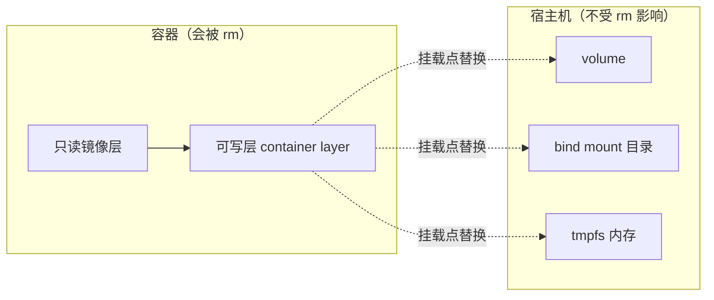

> **Docker 系列 · 第 12/24 篇**
> 上一篇：[《Docker 网络模式与实操——从 docker0 到 overlay》](/云原生/docker/docker-11-network) · 下一篇：[《Docker Compose 编排——用 YAML 定义一整栈微服务》](/云原生/docker/docker-13-compose)

---

## 开头：MySQL 容器一删，库没了

你用容器跑了个 MySQL，测试数据灌了两周。某天升级镜像版本：`docker rm` 旧容器、`docker run` 新容器——**库没了，两周白干**。

这不是 bug，是设计：容器的文件系统由「只读镜像层 + 一个可写层」组成（[第 5 篇](/云原生/docker/docker-05-container-and-image/)讲过这个心智模型），**可写层属于容器**，容器删除它就没了。`docker rm` 从不留情。

要让数据活得比容器久，Docker 提供三种把数据「挂」到容器外的机制：**Volume（卷）、Bind Mount（绑定挂载）、tmpfs（内存挂载）**。本篇全部在本机实测（Docker 29.x，WSL2 Ubuntu-22.04），看完你能准确回答三个问题：三种机制各适合什么场景？为什么 `volume prune` 不会误删你的数据库卷？卷里的数据到底存在宿主机哪里？

---

## 一、先看清问题：可写层随容器而生灭



挂载的本质：把外部存储「覆盖」到容器内某个路径上。此后这个路径的读写都落在外部存储，不落在可写层——容器再怎么删，数据岿然不动。

三种机制一张表定调（官方 [Storage 文档](https://docs.docker.com/engine/storage/)的定位）：

| | **Volume 命名卷** | **Bind Mount 绑定挂载** | **tmpfs** |
|------|------|------|------|
| 数据存哪 | Docker 管理的区域（`/var/lib/docker/volumes/`） | 宿主机上**你指定的任意目录** | 内存（不落盘） |
| 谁管理生命周期 | Docker（`docker volume` 命令族） | 你自己 | 随容器生灭 |
| 挂载方式 | `-v 卷名:/data` 或 `--mount type=volume` | `-v /host/path:/data` 或 `--mount type=bind` | `--tmpfs /scratch` 或 `--mount type=tmpfs` |
| 典型场景 | **数据库、中间件状态**（生产首选） | 开发时源码热更新、共享配置文件 | 敏感临时数据（密钥、会话缓存） |
| 可移植性 | ✅ 好（不依赖宿主机目录结构） | ❌ 差（换台机器路径就失效） | — |

> 🔑 官方建议一句话：**存数据用 Volume，共享/开发文件用 Bind Mount，绝不能落盘的临时数据用 tmpfs。**

---

## 二、持久化命令全家福——先把兵器摆上桌

和 [docker-11 第二节](/云原生/docker/docker-11-network)同款打法：进实操前，把持久化会用到的命令整个摆上桌——后面每节掏出的都是这里的某一件，忘了回来查表。

### 2.1 `docker volume`：管卷的五件兵器

```bash
docker volume --help
```

```text
Usage:  docker volume COMMAND

Manage volumes

Commands:
  create      Create a volume
  inspect     Display detailed information on one or more volumes
  ls          List volumes
  prune       Remove unused local volumes
  rm          Remove one or more volumes

Run 'docker volume COMMAND --help' for more information on a command.
```

**怎么读**：五件兵器按「**建 → 查 → 删**」的使用生命周期记：

| 命令 | 干什么 | 本文实测 |
|------|--------|----------|
| `volume create` | **建**卷（可带驱动与参数，第八节 NFS 见） | 3.1 |
| `volume inspect` | **查**详情：真身路径、驱动、创建时间 | 3.1 |
| `volume ls` | **查**清单（`-f dangling=true` 只看悬空卷） | 四 |
| `volume rm` | **删**指定卷 | 四 |
| `volume prune` | **删**所有没人用的悬空卷（边界实测） | 四 |

### 2.2 `docker run` 的挂载旗标：真正干活的七件

卷建好怎么挂上容器？全靠 `docker run` 这几个旗标：

| 旗标 | 干什么 | 本文实测 |
|------|--------|----------|
| `-v 卷名:容器路径` | 挂**命名卷**（生产首选） | 3.2 |
| `-v /宿主路径:容器路径` | **bind mount**：挂宿主目录 | 五 |
| `-v 容器路径`（只写一半） | 挂**匿名卷**（悬空卷的来源） | 四 |
| `--mount type=volume,source=…,target=…` | 挂卷的**严格版**（拼错立刻报错） | 3.3 |
| `--mount type=bind,…` | bind 的严格版 | 3.3 |
| `--tmpfs 容器路径` | 内存挂载 | 六 |
| `:ro` 后缀 | 只读挂载 | 五 |
| `--volumes-from 容器` | 继承另一个容器的全部挂载 | 七 |

### 2.3 反向查：这容器挂了什么？这卷谁在用？

排障两连（实测）。先看**容器视角**的挂载清单——`{{json .Mounts}}` 把 inspect 里挂载数组整个打出来（Go 模板，docker-11 认过的老朋友）：

```bash
$ mkdir -p /root/bind-demo
$ docker run -d --name lab-mount-demo -v mydata:/data -v /root/bind-demo:/src:ro \
    busybox sleep infinity

$ docker inspect --format '{{json .Mounts}}' lab-mount-demo
[{"Type":"volume","Name":"mydata","Source":"/var/lib/docker/volumes/mydata/_data","Destination":"/data","Driver":"local","Mode":"z","RW":true,"Propagation":""},{"Type":"bind","Source":"/root/bind-demo","Destination":"/src","Mode":"ro","RW":false,"Propagation":"rprivate"}]
```

一长行不便读，关键五字段拆开：

| 字段 | 前半（卷那条） | 后半（bind 那条） |
|------|----------------|-------------------|
| `Type` | `volume` | `bind` |
| `Name` / `Source` | 卷名 `mydata`；真身在 `/var/lib/docker/volumes/…` | 没有卷名，`Source` 就是宿主目录 |
| `Destination` | 容器内路径 `/data` | `/src` |
| `RW` | `true` 可写 | `false`——`:ro` 生效的铁证 |

（`Mode` / `Propagation` 涉及 SELinux 标签与挂载传播，进阶话题，本文不展开。）

再**反向**查：一个卷被哪些容器用着（**删卷前必查**，删了在用的卷 = 事故）：

```bash
$ docker ps --filter volume=mydata --format '{{.Names}}'
lab-mount-demo

$ docker rm -f lab-mount-demo      # 演示完清掉
```

---

## 三、Volume 命名卷：生产持久化的首选（实测）

### 3.1 创建、查看、找到它在宿主机的真身

```bash
$ docker volume create mydata
mydata

$ docker volume inspect mydata
[
    {
        "CreatedAt": "2026-08-14T13:14:01Z",
        "Driver": "local",
        "Labels": null,
        "Mountpoint": "/var/lib/docker/volumes/mydata/_data",
        "Name": "mydata",
        "Options": null,
        "Scope": "local"
    }
]
```

`Mountpoint` 就是答案：卷里的数据存在宿主机 `/var/lib/docker/volumes/<卷名>/_data`。实测验证（宿主机直接读到容器写入的文件）：

```bash
$ docker run --rm -v mydata:/data busybox sh -c 'echo "persist-me" > /data/note.txt && cat /data/note.txt'
persist-me

$ ls -l /var/lib/docker/volumes/mydata/_data/
-rw-r--r-- 1 root root 11 Aug 14 21:14 note.txt
$ cat /var/lib/docker/volumes/mydata/_data/note.txt
persist-me
```

### 3.2 核心：容器删了，数据还在

**第一个容器写数据，然后删掉它**（注意 `--rm`，容器退出即删除）：

```bash
$ docker run --rm -v mydata:/data busybox sh -c 'echo "persist-me" > /data/note.txt'
```

**起一个全新容器挂同一个卷**：

```bash
$ docker run --rm -v mydata:/data busybox cat /data/note.txt
persist-me
```

容器是新的、镜像层是全新的，但 `note.txt` 还在——**数据跟着卷走，不跟着容器走**。这就是开头 MySQL 场景的解法：`-v mysql-data:/var/lib/mysql`，之后随便删容器、换镜像版本，数据不动。

### 3.3 `-v` 的自动创建 vs `--mount` 的严格检查

引用一个不存在的**命名卷**，`-v` 会静默创建：

```bash
$ docker run --rm -v autodata:/data busybox echo 'auto-created ok'
auto-created ok

$ docker volume ls | grep autodata
local     autodata
```

输出确认：卷就这样被悄悄创建了。而 `--mount` 是严格模式，bind 源路径不存在直接报错、不猜你的意图：

```bash
$ docker run --rm --mount type=bind,source=/root/no-such-dir,target=/src busybox echo hi
docker: Error response from daemon: invalid mount config for type "bind":
bind source path does not exist: /root/no-such-dir
```

> 🔑 脚本里推荐用 `--mount`：拼错卷名/路径时立刻报错，而不是悄悄造出一个空卷让应用「看起来正常地丢了数据」。

---

## 四、匿名卷与悬空卷：prune 到底删什么（实测）

不给卷名、只给容器内路径（`-v /data`），Docker 会生成一个 **64 位哈希名的匿名卷**；镜像的 Dockerfile 里若声明了 `VOLUME /xxx`，起容器时也会自动生成匿名卷（很多数据库官方镜像都这么干）。

匿名卷的生死取决于**容器怎么删**，三种删法三种结局（以下均为实测）。

> ⚠️ 先澄清一个易混点：下面反复出现的 `-v` 是 **`docker rm` 自己的旗标**（长写法 `--volumes`），意思是「删容器时，把它创建的匿名卷一起删」——和 `docker run -v` 的「挂载」**完全是两码事**。同一个字母，在不同命令里各有各的意思，初学最容易在这绊倒。

**方式一：`--rm` 容器退出——匿名卷连带一起删**：

```bash
$ docker run --rm -d --name anon-rm-demo -v /data busybox sleep 60
b388970b614ca80ac636ecc229343c0e06f338583d9e09101c1046962c4dc0fb

$ docker inspect anon-rm-demo --format '{{range .Mounts}}type={{.Type}} name={{.Name}} dst={{.Destination}}{{println}}{{end}}'
type=volume name=12aa00229028ff1ff4c71a66fe49d8b53811bcfb1b60782cfde410c9b7546291 dst=/data

$ docker stop anon-rm-demo
anon-rm-demo

$ docker volume inspect 12aa00229028ff1ff4c71a66fe49d8b53811bcfb1b60782cfde410c9b7546291
[]
Error response from daemon: get 12aa00229028ff1ff4c71a66fe49d8b53811bcfb1b60782cfde410c9b7546291: no such volume
```

容器退出，`--rm` 把容器和匿名卷**一起**带走了。

**方式二：`docker rm`（不带 `-v`）——匿名卷留下来，变成悬空卷**：

```bash
$ docker run --name anon-keep -v /data busybox sh -c 'echo keep > /data/f'

$ docker inspect anon-keep --format '{{range .Mounts}}type={{.Type}} name={{.Name}} dst={{.Destination}}{{println}}{{end}}'
type=volume name=057fcecb958d190946c93b684407c9691213bc36d4848f584c984dc98bd2eb05 dst=/data

$ docker rm anon-keep
anon-keep

$ docker volume ls -f dangling=true
DRIVER    VOLUME NAME
local     057fcecb958d190946c93b684407c9691213bc36d4848f584c984dc98bd2eb05
```

容器没了、卷还在，且再没有任何容器引用它——这就是**悬空卷**（dangling）。生产上真正堆出悬空卷的，正是这种「不带 `--rm`、`docker rm` 也不加 `-v`」的日常用法。

**方式三：`docker rm -v`——「连卷一起删」的手动版**（实测）：

```bash
$ docker run --name lab-rmv-demo -v /data busybox sh -c 'echo x > /data/f'

$ docker inspect lab-rmv-demo --format '{{range .Mounts}}{{.Name}}{{end}}'
4973a95b0df7d9fd1042eaf64d57c0d4aa4253976eb9dfa0088770f79f3d32b8

$ docker rm -v lab-rmv-demo
lab-rmv-demo

$ docker volume inspect 4973a95b0df7d9fd1042eaf64d57c0d4aa4253976eb9dfa0088770f79f3d32b8
Error response from daemon: get 4973a95b0df7…: no such volume
```

容器删了，匿名卷**也跟着没了**——和方式一 `--rm` 的效果一样，区别只是「退出时自动」还是「你敲命令时手动」。

两条安全边界值得记住（第二条同样实测验证过）：

- `-v` **只连带匿名卷**；命名卷（如 `named-safe`）哪怕容器 `rm -v` 删掉，卷也**原样保留**——数据库卷不会被这个旗标误伤
- 反过来讲：想让匿名卷跟容器一起走，要么 `run` 时带 `--rm`，要么删时带 `rm -v`；两条都不做，悬空卷就攒下了

清理用 `docker volume prune`，但**先看清它的边界再敲**——实测（先显式创建一个从未被使用的命名卷 `orphan`，此时机器上唯一的悬空卷是上面那个匿名卷）：

```bash
$ docker volume create orphan
orphan

$ docker volume prune -f
Deleted Volumes:
057fcecb958d190946c93b684407c9691213bc36d4848f584c984dc98bd2eb05

Total reclaimed space: 5B

$ docker volume ls | grep orphan
local     orphan
```

注意结果：prune 只删了那个**匿名**悬空卷；`orphan` 这个显式命名的卷哪怕从未被任何容器使用，也**没被删**。

> ⚠️ `docker volume prune` 默认**只删匿名的悬空卷，不删命名卷**——这是官方故意的保护设计（`docker volume prune --help` 写明：`-a, --all  Remove all unused volumes, not just anonymous ones`）。`docker volume prune -a` 才会连未使用的命名卷一起删，生产环境慎用 `-a`。要删指定卷，永远用 `docker volume rm <卷名>` 精确删除（实测：`docker volume rm orphan`，输出卷名即成功）。

---

## 五、Bind Mount：把宿主机目录直接挂进来（实测）

命名卷把「数据存哪」交给 Docker 管——真身在 `/var/lib/docker/volumes/` 深处，第三节亲眼看过。但有两个高频需求，这反而不顺手：

- **开发热更新**：想让容器直接跑宿主机上的源码目录，宿主机改代码、容器立刻生效，而不是每改一次就重建镜像
- **用我指定的目录**：共享一份配置文件、把构建产物直接落到宿主机工程目录——路径必须由**我**定，不能是 Docker 造的哈希目录

Bind Mount（绑定挂载）就是为此存在的：`-v` 的第一段从「卷名」换成「以 `/` 开头的宿主机绝对路径」，Docker 据此识别这是 bind；其余规则与卷一致——挂载点照样盖在可写层上，容器删了，宿主机数据照旧在。

### 5.1 双向同步：两边操作的是同一份文件（实测）

```bash
$ mkdir -p /root/bind-demo
$ echo 'host-file-content' > /root/bind-demo/host.txt

$ docker run --rm -v /root/bind-demo:/src busybox cat /src/host.txt
host-file-content
```

容器读到了宿主机文件。反过来，容器内写入也会直接落到宿主机：

```bash
$ docker run --rm -v /root/bind-demo:/src busybox sh -c 'echo data-by-container > /src/from-container.txt'

$ ls -l /root/bind-demo
total 8
-rw-r--r-- 1 root root 18 Aug 17 20:19 from-container.txt
-rw-r--r-- 1 root root 18 Aug 17 20:19 host.txt
$ cat /root/bind-demo/from-container.txt
data-by-container
```

宿主机目录里多出了容器写的文件——注意属主是 `root:root`，容器内默认 root 干活，落到宿主机也是 root（多人共用的机器上要留意）。所谓「双向实时同步」，本质是**两边操作的是同一份磁盘文件**，不存在复制、也不存在延迟：bind mount 挂进去的就是宿主机目录本身。（第 2.3 节 inspect 输出里那条 `"Type":"bind"`、没有卷名的记录，就是它。）

### 5.2 开发热更新就是这么来的（实测）

起一个**长驻**容器挂着源码目录，宿主机改文件，不重启容器再看：

```bash
$ docker run -d --name bind-live -v /root/bind-demo:/src busybox sleep infinity
$ docker exec bind-live cat /src/host.txt
host-file-content

$ echo 'hot-update-line' >> /root/bind-demo/host.txt      # 宿主机改文件

$ docker exec bind-live cat /src/host.txt
host-file-content
hot-update-line

$ docker rm -f bind-live
```

容器**没重启**，第二次 `exec` 就读到了新行。把 `/root/bind-demo` 换成你的工程目录、`/src` 换成 `/app`，就是本地开发的日常形态：IDE 在宿主机改代码，容器里跑的服务立刻读到新内容——前提是应用会重新读文件（静态文件、带 watch 的开发服务器天然满足）。[第 13 篇](/云原生/docker/docker-13-compose/) Compose 里的 `./src:/app` 写法，就是这一节的正式化。

### 5.3 `:ro` 只读挂载：内核层面的写保护（实测）

共享配置文件给容器，但明确它不许改——在挂载后缀加 `:ro`：

```bash
$ docker run --rm -v /root/bind-demo:/src:ro busybox sh -c 'echo x > /src/new.txt'
sh: line 0: can't create /src/new.txt: Read-only file system
```

读不受影响（`cat` 照常），写被拒绝——拒绝发生在**内核文件系统层**（`EROFS`），不是 Docker 模拟的报错，容器内进程绕不过去。第 2.3 节 inspect 里那条 bind 挂载的 `"RW":false`，就是它留下的铁证。

### 5.4 三个坑，个个有实测证据

**坑①：挂上去 = 盖住，镜像原有内容被「遮蔽」**。先看 nginx 镜像自带的 html 目录长什么样，再做两组对照实验：

```bash
$ docker run --rm nginx:alpine ls -A /usr/share/nginx/html    # 不挂载：镜像原样
50x.html
index.html

$ mkdir -p /root/empty-dir
$ docker run --rm -v /root/empty-dir:/usr/share/nginx/html nginx:alpine ls -A /usr/share/nginx/html
                                                              # 输出为空！index.html 不见了

$ docker volume create html-vol
html-vol
$ docker run --rm -v html-vol:/usr/share/nginx/html nginx:alpine ls -A /usr/share/nginx/html
50x.html
index.html

$ docker run --rm -v html-vol:/x busybox ls -A /x             # 换个镜像挂同卷再验证
50x.html
index.html

$ docker volume rm html-vol                                    # 演示完清掉
```

同样是「空的东西挂到有内容的路径」，结局完全不同：

| 挂载方式 | 挂到 `/usr/share/nginx/html` 后看到 | 为什么 |
|------|------|------|
| 不挂载 | `50x.html  index.html` | 镜像层自带 |
| bind 一个空目录 | **空** | 宿主目录**原样盖上去**，镜像内容被遮蔽 |
| 空命名卷 | `50x.html  index.html` | 首次挂载把镜像内容**先拷进卷**，再挂回来 |

最后那个「换 busybox 也看得到」是关键证据：文件确实存进了卷里，不是镜像的把戏。bind mount 的遮蔽，官方的类比是「往 `/mnt` 挂 U 盘」——挂上后看到的是 U 盘的内容，原有内容被盖住而**不是被删**；且容器里没有 `umount` 的办法，只能不带挂载重建容器。这也是「想把 nginx 的 html 目录 bind 出来改」时最常见的翻车点：得先把镜像里的文件拷出来垫底，或者干脆用卷。

**坑②：路径拼错不报错，`-v` 会静默建一个空目录**。3.3 节里 `/root/no-such-dir` 用 `--mount` 挂载直接报错；换成 `-v` 再试同一路径：

```bash
$ ls /root/no-such-dir
ls: cannot access '/root/no-such-dir': No such file or directory

$ docker run --rm -v /root/no-such-dir:/src busybox ls -A /src
                                              # 容器内 /src 是空的，且没有任何报错

$ ls -ld /root/no-such-dir
drwxr-xr-x 2 root root 4096 Aug 17 20:19 /root/no-such-dir

$ rm -rf /root/no-such-dir                    # 演示完清掉
```

真相：`-v` 发现宿主路径不存在时，会**自动创建它（永远是目录）**——路径打错一个字，不报错，只得到一个空目录，应用「安静地丢数据」。官方 bind mounts 文档（2026-07 更新版）写明：`--mount` 默认报错，若确需自动创建，得显式加 `bind-create-src` 选项——要造也是你自己明说的。所以 3.3 的建议在这里再加一分：**脚本里用 `--mount`**。

**坑③：强耦合宿主机，且默认可写**。bind 的源是这台机器的绝对路径，换台机器、换个环境路径就对不上——官方原话是容器与宿主机 "strongly tied"。同时 bind 默认可写，容器内进程能增删改宿主机文件，波及宿主机上的非 Docker 进程。所以第一节那张表的结论值得再念一遍：**生产与编排里的数据持久化用命名卷，bind mount 留给开发机的源码与配置共享**——能只读就加 `:ro`。

---

## 六、tmpfs：数据只活在内存里（实测）

```bash
$ docker run --rm --tmpfs /scratch busybox sh -c 'mount | grep scratch; echo hello > /scratch/f && cat /scratch/f'
tmpfs on /scratch type tmpfs (rw,nosuid,nodev,noexec,relatime)
hello
```

`mount` 输出证实 `/scratch` 是一块 **tmpfs 内存文件系统**：读写极快、容器一停数据即焚、**永不落盘**。适合放密钥/令牌文件、会话缓存这类「用完就该消失、绝不能留在磁盘上被镜像或快照带走」的数据。

---

## 七、卷的备份与恢复（实测）

第三节实测过：卷的真身就在 `/var/lib/docker/volumes/mydata/_data`，宿主机 root 直接就能读。那备份是不是直接 `tar` 这个目录完事？**能用，但有前提**——你得有 root，且卷用的是 `local` 驱动。`/var/lib/docker/…` 是 Docker 的实现细节，一旦卷挂到 NFS/云盘（第八节），本地压根没有这个目录。官方因此给了一套**与存储位置无关**的通用套路：**临时容器 + tar**——不管数据实际在哪，先挂进一个一次性容器，再打包到另一个 bind mount 目录带走。

### 7.1 备份：把卷 tar 成宿主机上的一个文件（实测）

```bash
$ mkdir -p /root/backup

$ docker run --rm -v mydata:/data -v /root/backup:/backup busybox tar cvf /backup/mydata.tar -C /data .
./
./note.txt
```

```bash
$ ls -l /root/backup
total 8
-rw-r--r-- 1 root root 2560 Aug 17 20:21 mydata.tar

$ docker run --rm -v /root/backup:/backup busybox tar tvf /backup/mydata.tar
drwxr-xr-x root/root         0 2026-08-17 12:21:05 ./
-rw-r--r-- root/root        11 2026-08-17 12:21:05 ./note.txt
```

命令拆开就三件事：`-v mydata:/data` 把要备份的卷挂进来；`-v /root/backup:/backup` 用第五节的 bind mount 准备好「出口」；`tar cvf … -C /data .` 打包（`-C /data .` 表示先进 `/data` 再打包当前目录，所以归档里的路径是 `./note.txt` 而非绝对路径）。小注：`tar` 列出的时间戳是容器内 UTC 时区，宿主机 `ls` 是本地时区，相差 8 小时——同一份文件，不是两份数据。

### 7.2 恢复：新卷 + 同一套路反过来（实测）

```bash
$ docker volume create mydata-restored
mydata-restored

$ docker run --rm -v mydata-restored:/data -v /root/backup:/backup busybox tar xvf /backup/mydata.tar -C /data
./
./note.txt

$ docker run --rm -v mydata-restored:/data busybox cat /data/note.txt
persist-me
```

恢复 = 空白新卷 + 同款临时容器，把 `cvf` 换成 `xvf`，最后 `cat` 验证数据回来了。跨主机迁移是它的自然延伸：把 `mydata.tar` 拷到新机器，重复这三条命令即可。

### 7.3 `--volumes-from`：备份整个容器的卷，不用逐个查（实测）

真实场景里，一个数据库容器可能挂了好几个卷，逐个 `-v 卷名:…` 备份还得先查清单。`--volumes-from <容器>` 让新容器**原样继承**目标容器的全部挂载：

```bash
$ docker run -d --name db-like -v mydata:/var/lib/data busybox sleep infinity
$ docker run -d --name helper --volumes-from db-like busybox sleep infinity

$ docker inspect --format '{{range .Mounts}}{{.Type}}  {{.Source}} -> {{.Destination}}{{println}}{{end}}' helper
volume  /var/lib/docker/volumes/mydata/_data -> /var/lib/data

$ docker exec helper cat /var/lib/data/note.txt
persist-me

$ docker rm -f helper
```

helper 的 `docker run` 里**一个 `-v` 都没写**，Mounts 里却有一条完整的卷挂载——从 db-like 继承来的，读一下便知。于是「备份某容器的全部数据」一行化，不用知道它挂了什么：

```bash
$ docker run --rm --volumes-from db-like -v /root/backup:/backup busybox tar cvf /backup/db-like.tar /var/lib/data
var/lib/data/
var/lib/data/note.txt

$ docker rm -f db-like
```

（`tar` 会自动去掉成员名开头的 `/`，属正常行为。）定时任务里跑 7.1 或这一条，就是最朴素的卷备份方案；多个容器要共享同一份数据，也是用 `--volumes-from`。

---

## 八、卷驱动：卷不一定在本地磁盘

`docker volume inspect` 输出里的 `"Driver": "local"` 暗示卷有「驱动」概念——`local` 驱动把数据放本机，但驱动也可以把数据放到别处。创建时用 `--opt` 传驱动参数，比如官方文档的 NFS 卷：

```bash
docker volume create --driver local \
  --opt type=nfs \
  --opt o=addr=192.168.1.100,rw,nfsvers=4 \
  --opt device=:/path/on/nfs \
  nfs-data
```

创建后 `docker run -v nfs-data:/data ...` 照常用——应用无感知，数据已在网络存储上。第三方卷驱动还能对接云盘（AWS EBS、Azure Disk）、分布式存储（Ceph、GlusterFS）。这是「可插拔存储」的接口，K8s 里的 PV/PVC 走的是同一思想。

---

## 九、选型决策与 Compose 回顾

决策速查：

| 你的需求 | 用什么 |
|------|------|
| 数据库/中间件的数据目录 | 命名卷（Compose 里 `volumes:` 顶层声明 + 服务引用） |
| 开发热更新源码、共享配置 | bind mount（开发环境专用） |
| 密钥等绝不能落盘的临时文件 | tmpfs |
| 跨主机共享存储 | 卷驱动（NFS/云盘/分布式存储） |
| 迁移/备份卷 | tar 打包套路（第七节） |

下一篇 Compose 会用到挂载字段；先熟悉下面写法，到[第 13 篇](/云原生/docker/docker-13-compose/)就能对上每一行含义：

```yaml
services:
  db:
    image: mysql:8.4
    volumes:
      - db-data:/var/lib/mysql           # 命名卷：数据持久化
      - ./init:/docker-entrypoint-initdb.d:ro   # bind mount + 只读：初始化脚本（MySQL 官方镜像的固定目录）

volumes:
  db-data: {}                            # 顶层声明命名卷
```

---

## 小结

- 容器可写层随容器生灭；持久化 = 把数据路径挂到容器外。**三种机制**：Volume（Docker 管理、生产数据首选）、Bind Mount（宿主机目录、开发共享）、tmpfs（内存、敏感临时数据）。
- 命名卷数据在宿主机 `/var/lib/docker/volumes/<名>/_data`；**容器删、数据在**；`-v` 引用不存在命名卷会自动创建，`--mount` 严格报错——脚本用 `--mount`。
- 匿名卷结局取决于删除方式（实测验证）：`--rm` 退出即连带删、`docker rm` 不带 `-v` 残留成悬空卷、`docker rm -v` 手动连卷删；**命名卷永不跟随容器**。注意 `rm -v` 与 `run -v` 同字母不同义。
- **`volume prune` 只删匿名悬空卷，命名卷哪怕没被使用也不删**（实测验证）；`-a` 才会连命名卷一起删。
- Bind mount 双向实时同步（本质是两边操作同一份文件），`:ro` 只读由内核强制（`EROFS`）；它会**遮蔽**挂载点的镜像原有内容（空命名卷则会先把镜像内容拷进卷），`-v` 源路径不存在时**静默建空目录**、`--mount` 报错；路径强耦合宿主机——生产用命名卷，bind 留给开发机。tmpfs 永不落盘。
- 备份/恢复 = 临时容器 + tar（`cvf`/`xvf` 同一套路，与存储位置无关）；备份「整个容器的卷」或共享数据用 `--volumes-from`；跨主机共享 = 卷驱动（NFS/云盘）。

**思考题**：为什么数据库镜像的 Dockerfile 要写 `VOLUME /var/lib/mysql`？不写会怎样？（提示：匿名卷 + 没挂命名卷时，数据落在哪、容器删除后命运如何。）

下一篇：[《Docker Compose 编排——用 YAML 定义一整栈微服务》](/云原生/docker/docker-13-compose/)。

---

## 参考资料

- [Docker Docs · Storage](https://docs.docker.com/engine/storage/) — 三种挂载机制总览
- [Volumes](https://docs.docker.com/engine/storage/volumes/) — 卷生命周期、备份恢复、卷驱动、NFS
- [Bind mounts](https://docs.docker.com/engine/storage/bind-mounts/)（2026-07 更新版：遮蔽行为、`-v` 自动建目录与 `--mount` 的 `bind-create-src`）/ [tmpfs](https://docs.docker.com/engine/storage/tmpfs/)
- 本机实测环境：WSL2 Ubuntu-22.04 + Docker 29.x
