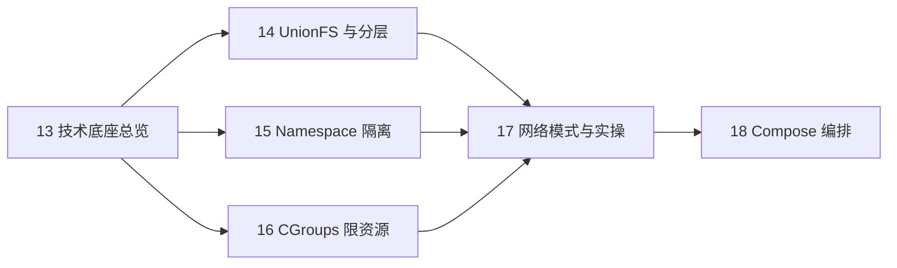

> **Docker 系列 · 第 16/24 篇**
> 上一篇：[《容器日志与监控——logs 原理、日志轮转与 stats/events 三板斧》](/云原生/docker/docker-20-logging-monitoring) · 下一篇：[《UnionFS 与镜像分层——Docker 镜像为什么是一层一层叠出来的》](/云原生/docker/docker-14-unionfs)
>
> 本篇起进入**底层原理**阶段：先总览地图，再分篇深入 UnionFS → Namespace → 进程视角 → Cgroups → Daemon/runtime。

---

## 开头：容器「轻」在哪？

你在生产环境跑过几十个 Java 微服务后，会有一个直观感受：**虚拟机太重，裸进程又太裸**。

- 每个服务若独占一台 VM：内存、启动时间、镜像体积都是成本
- 若全部跑在宿主机上：端口冲突、依赖版本、进程互相可见，运维噩梦

Docker 给出的中间路线是：**看起来像独立的小机器，实际上只是宿主机上的进程，加上内核级的隔离与限额**。

要理解 Docker 为什么能「又轻又隔离」，必须回到它的技术底座——Linux 上的三大支柱。

---

## 一、三大底层技术

Linux 命名空间（Namespaces）、控制组（Cgroups）和联合文件系统（UnionFS）支撑了 Docker 的核心实现，也是容器技术能在 2013 年后爆发的根本原因。

| 技术 | 解决什么问题 | Docker 中的角色 |
|------|--------------|-----------------|
| **Namespaces** | 视图隔离：进程、网络、挂载点等 | 让容器 A 看不到容器 B |
| **Cgroups** | 物理资源限额与统计 | 限制 CPU、内存、I/O 等 |
| **UnionFS** | 多层目录联合挂载 | 镜像分层、写时复制的基础 |

Docker 主要利用 Linux 底层能力：

- **Namespaces**：隔离 PID、NET、IPC、MNT、UTS（以及 User、Cgroup 等）
- **Control groups**：资源限制与用量统计
- **Union file systems**：Container 与 Image 的分层存储

---

## 二、一句话定义容器

> **容器的本质**：被 Namespaces 和 Cgroups 约束、拥有逻辑上独立文件系统与网络命名空间的一个（或一组）进程。

它不是完整的虚拟机，而是**受限的进程 + 联合文件系统视图 + 独立网络栈**。这也是 Docker 与 KVM 虚拟机的根本差异：容器共享宿主机内核，VM 则虚拟化整套硬件与内核。

---

## 三、经典公式：Docker ≈ LXC + AUFS

早期常听到的概括仍然有助于建立整体图景：

```
Docker ≈ LXC（Linux Containers）+ AUFS（Advanced UnionFS）
```

更细一层可以拆成：

| 层次 | 组成 | 职责 |
|------|------|------|
| **Cgroup** | Linux 内核 | 底层落实 CPU、内存、blkio 等资源管理 |
| **LXC** | Cgroup + Namespace + Chroot + veth + 脚本 | 用户态容器运行时中间层 |
| **Docker** | 在 LXC 之上再封装 | 镜像管理、API、CLI、生态 |

可以粗略认为：

```
LXC ≈ Cgroup + Namespace + Chroot + veth + 用户控制脚本
```

**没有 Cgroup，就没有 LXC；没有 LXC 的隔离思路，Docker 的容器模型也立不住。** 而镜像分层则依赖 UnionFS（早期 AUFS，后因 AUFS 未进入主线内核，Linux 上常见 OverlayFS / Device Mapper 等替代方案）。

---

## 四、各模块分工速览

### 4.1 Namespaces —— 看得见什么

命名空间是容器隔离的基础，保证 **A 容器看不到 B 容器**。

Docker Engine 使用的 Linux 隔离技术包括：

| Namespace | 隔离内容 |
|-----------|----------|
| **pid** | 进程 ID 空间 |
| **net** | 网络设备、协议栈、端口 |
| **ipc** | System V IPC、POSIX 消息队列 |
| **mnt** | 文件系统挂载点 |
| **uts** | 主机名、NIS 域名 |
| **user** | UID/GID 映射 |

此外还有 **cgroup** namespace（隔离 cgroup 根目录视图）和较新的 **time** namespace 等。进容器手段见第 7 篇；Namespace 实现原理见第 18 篇。

### 4.2 Cgroups —— 能用多少

Namespaces 解决「看见谁」，**Cgroups 解决「能用多少」**。

常用子系统包括：`cpu`、`memory`、`blkio`、`devices`、`freezer` 等。Docker 为每个容器在 `/sys/fs/cgroup/.../docker/<容器ID>/` 下创建对应 cgroup，通过修改 `cpu.cfs_quota_us`、`memory.limit_in_bytes` 等文件限制资源。

详见：[《CGroups 限资源》](/云原生/docker/docker-16-cgroups)

### 4.3 UnionFS —— 镜像怎么叠

镜像不是单一 tarball，而是**一层层只读 Layer + 容器可写层**的联合挂载。

- 底层通常是 Base Image（如 `debian`、`alpine`）
- Dockerfile 每条指令产生一层
- 运行时在最上层叠加可写 Container Layer

详见：[《UnionFS 与镜像分层》](/云原生/docker/docker-14-unionfs)

---

## 五、与 Kubernetes 运行时的关系（补充）

理解 Docker 底座，也有助于读懂 K8s 里的容器运行时演进：

- 早期：`kubelet` → CRI → `docker-shim` → Docker API → `containerd` → `runc`
- 现在：Docker 已从 K8s 默认路径中淡出，**containerd / CRI-O** 直接对接 OCI 运行时
- 但无论上层是 Docker 还是 containerd，**底层仍是 Namespace + Cgroup + 联合文件系统 + OCI 镜像规范**

容器「是什么」没有变，变的只是谁来做编排与 API 封装。

---

## 六、学习路线：本篇之后读什么



| 篇目 | 主题 | 链接 |
|------|------|------|
| **14** | UnionFS、AUFS、镜像分层与 build 缓存 | [docker-14-unionfs](/云原生/docker/docker-14-unionfs) |
| **15** | 进程/网络隔离、Libnetwork、Chroot | [docker-15-namespace](/云原生/docker/docker-15-namespace) |
| **16** | Cgroups 子系统与资源限制实操 | [docker-16-cgroups](/云原生/docker/docker-16-cgroups) |
| **17** | bridge/host/none/overlay 等网络模式 | [docker-17-network](/云原生/docker/docker-17-network) |
| **18** | Compose YAML 与常用命令 | [docker-18-compose](/云原生/docker/docker-18-compose) |

---

## 本节小结

| 概念 | 一句话 |
|------|--------|
| **Namespaces** | 隔离进程、网络、挂载等视图 |
| **Cgroups** | 限制 CPU、内存、I/O 等物理资源 |
| **UnionFS** | 多层目录联合，支撑镜像分层 |
| **容器本质** | 受限进程 + 独立文件系统/网络视图 |
| **Docker ≈ LXC + AUFS** | 资源管理 + 镜像管理的经典概括 |

---

## 下篇预告

**第 17 篇：《UnionFS 与镜像分层》**

我们将用 AUFS 的 `company/home` 实验理解联合挂载，再对照 Dockerfile 的 `build` 输出，看清 Layer 如何堆叠、缓存如何复用。

---

## 思考题

> 若只启用 Namespace 而不配置 Cgroup，容器之间可能出现什么问题？若只配置 Cgroup 而不启用 Network Namespace 呢？

欢迎在评论区写下你的分析。下一篇见 🐳
