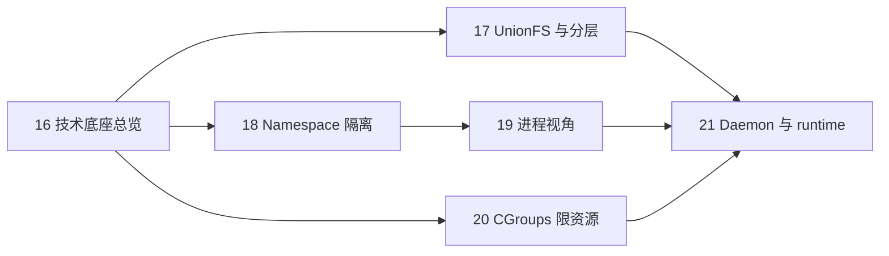

> **Docker 系列 · 第 16/24 篇**
> 上一篇：[《容器日志与监控——盯住同一个容器，从 logs 第一行滚到磁盘账单》](/云原生/docker/docker-15-logging-monitoring) · 下一篇：[《UnionFS 与镜像分层——从两个目录滚出一个容器文件系统》](/云原生/docker/docker-17-unionfs)
>
> 本篇起进入**底层原理**阶段：先总览地图，再分篇深入 UnionFS → Namespace → 进程视角 → Cgroups → Daemon/runtime。

---

## 开头：容器凭什么又轻又像一台机器

你在生产环境跑过几十个 Java 微服务后，会有一个直观感受：**虚拟机太重，裸进程又太裸**——「隔离」和「轻快」好像天生只能二选一。

Docker 给出的中间路线，一句话就能说完：

> **看起来像独立的小机器，实际上只是宿主机上的进程，加上内核级的隔离与限额。**

这句话读第一遍像广告，读第二遍是个悖论：**像一台机器**，意味着有自己的进程表、自己的根目录、自己的网卡；**又轻**，意味着不装新系统、秒级启动、镜像还能共享。经验里「像机器的东西从来不轻，轻的东西从来不隔离」——容器凭什么两头都占？

本篇不先背概念。整篇就抓着上面这一句话，**每一节只解开其中一个词**，一路解到 Linux 的三根支柱跟前：

| 节 | 这一节解开的 | 读完能回答的 |
|----|--------------|--------------|
| 1 | 为什么需要第三条路 | VM 和裸进程各自败在哪笔账上 |
| 2 | 「轻」的一半：它真是进程 | 容器为什么不是小 VM |
| 3 | 「机器感」的一半：三张视图 + 一道限额 | 一句话定义里每个词各指什么 |
| 4 | 戏法道具全是内核现成的 | 三根支柱各管什么，Docker 发明了什么 |
| 5 | 第一张视图：看得见什么 | A 容器为什么看不到 B 容器 |
| 6 | 第二张视图：自己的根文件系统 | 镜像为什么一层层、可写层是什么 |
| 7 | 隔离的另一半：能用多少 | 视图隔开了，资源为什么还得限额 |
| 8 | 第一代配方：Docker ≈ LXC + AUFS | LXC 拼了什么，Docker 又加了什么 |
| 9 | 配方会老，底座不老 | K8s 里 Docker 为什么淡出、什么没变 |

贯穿全文的「那条故事」不是某个实验目录，而是**这句话本身**：每节解开一个词，谜面就少一块；读到第 9 节再回头看，整句话应该已经不神秘了。具体的动手与深挖分给后面四篇（第 17～20 篇）和第 21 篇，文末有分工表。官方出处：[Docker overview — The underlying technology](https://docs.docker.com/get-started/overview/)。

---

## 第 1 节：两难的账本——VM 太重，裸进程太裸

先把选择权的两边算清楚。几十个微服务摆在你面前，传统上只有两条路：

- 每个服务若独占一台 VM：内存、启动时间、镜像体积都是成本
- 若全部跑在宿主机上：端口冲突、依赖版本、进程互相可见，运维噩梦

第一条路的病根，[第 2 篇](/云原生/docker/docker-02-container-vs-vm)算过账：VM 要虚拟化整套硬件、引导一个完整的 Guest OS，「重」是**架构性**的，省不掉。第二条路的病根更直白：所有进程共享同一份系统视图——一张进程表、一张端口表、一套系统库，几十个服务挤在一起必然互相踩。

所以要找的第三条路，得**同时**满足两件事：

1. 隔离到「像各用各的机器」——互看不见、互不挤占
2. 又轻到「只是进程」——不起动一个新的操作系统

这正是开头那句话要拆的东西。读完这节你能回答：Docker 卖的不是「更快的 VM」，也不是「管进程的脚本」，而是这条中间路线本身。

---

## 第 2 节：先解「轻」的一半——它是宿主机进程，不是小 VM

那句话里最反直觉的是后半句：「**实际上只是宿主机上的进程**」。

容器不是完整的虚拟机：它**共享宿主机内核**；VM 则虚拟化整套硬件与内核——这是 Docker 与 KVM 虚拟机的根本差异。完整对比在[第 2 篇](/云原生/docker/docker-02-container-vs-vm)，这里只记两条：

- VM 启动要引导 Guest OS；容器启动只是**起一个（或一组）进程**
- 不虚拟化硬件，就没有硬件模拟这层开销

「轻」到这一步解掉了一半：快、省内存，都因为它是进程。「轻」的另一半——几百 MB 的镜像为什么能十台机器共享、改一行代码不用全量重传——先按下不表，第 6 节的「分层」来解。

顺带一条证据链：既然只是进程，容器里的「PID 1」在宿主机上就该另有一个号。[第 19 篇](/云原生/docker/docker-19-process-view)会真的跑给你看——同一个 nginx，容器里是 1 号，宿主机上是 10420 号。

---

## 第 3 节：再解「机器感」的一半——一句话定义里的三张视图、一道限额

「只是进程」成立，那「看起来像独立的小机器」从哪来？把定义的正式版本摆上来，答案就藏在里面：

> **容器的本质**：被 Namespaces 和 Cgroups 约束、拥有逻辑上独立文件系统与网络命名空间的一个（或一组）进程。

逐词拆开，正好四样东西：

- **一个（或一组）进程**——第 2 节已解，主体就是它
- **Namespaces 约束**——给进程换一副「眼镜」：看见自己的进程表、自己的网卡（第 5 节）
- **Cgroups 约束**——给进程上一道「额度」：CPU、内存用到哪封顶（第 7 节）
- **逻辑上独立的文件系统与网络命名空间**——注意「逻辑上」三个字：磁盘和网线都没有多出来，变的只是内核给这个进程的**视图**（第 6 节）

也就是说，机器感不是「多了一台机器」，而是**同一个进程被换了三张视图，外加一道限额**。钉成一张小图，后面六节都在填它：

```text
宿主机上的一个进程
├── 视图一：进程 / 主机名 / 挂载点……    ← Namespaces（第 5 节）
├── 视图二：根文件系统（自己的 /）      ← UnionFS 只读层 + 可写层（第 6 节）
├── 视图三：独立网络栈（自己的网卡）    ← Namespaces 里的 net（第 5 节）
└── 一道限额：CPU / 内存 / I/O 上限    ← Cgroups（第 7 节）
```

和 VM 一对照，本质区别就一句话：**容器 = 受限进程 + 联合文件系统视图 + 独立网络栈**，不是一套虚拟化的硬件。

---

## 第 4 节：戏法的道具全是内核现成的——三根支柱认个脸

三张视图、一道限额，没有一样是 Docker 造的。支撑 Docker 核心实现的，是 Linux 上的三大底层技术——它们也是容器技术能在 **2013 年后爆发**的根本原因：

| 技术 | 解决什么问题 | Docker 中的角色 |
|------|--------------|-----------------|
| **Namespaces** | 视图隔离：进程、网络、挂载点等 | 让容器 A 看不到容器 B |
| **Cgroups** | 物理资源限额与统计 | 限制 CPU、内存、I/O 等 |
| **UnionFS** | 多层目录联合挂载 | 镜像分层、写时复制的基础 |

对照第 3 节那张小图：三行正好分别接管视图一/三（Namespaces）、限额（Cgroups）、视图二（UnionFS）。

Docker 主要利用的 Linux 底层能力，官方文档列的就是这三样：

- **Namespaces**：隔离 PID、NET、IPC、MNT、UTS（以及 User、Cgroup 等）
- **Control groups**：资源限制与用量统计
- **Union file systems**：Container 与 Image 的分层存储

注意主语：**全是 Linux 内核**。Docker 的贡献不在发明这些机制，而在**封装**——把它们拼成顺手的产品，再配上镜像生态（第 8 节看这段封装史）。也正因如此，容器离不开 Linux 内核：Windows / macOS 上的 Docker Desktop，其实藏了一台 Linux 虚拟机在替你跑这些机制（[第 19 篇](/云原生/docker/docker-19-process-view)做实验时能看见它）。

---

## 第 5 节：第一张视图——A 容器为什么看不到 B（Namespaces）

命名空间是容器隔离的基础，保证 **A 容器看不到 B 容器**。Docker Engine 使用的 Linux 隔离技术，常用的是这六类：

| Namespace | 隔离内容 |
|-----------|----------|
| **pid** | 进程 ID 空间 |
| **net** | 网络设备、协议栈、端口 |
| **ipc** | System V IPC、POSIX 消息队列 |
| **mnt** | 文件系统挂载点 |
| **uts** | 主机名、NIS 域名 |
| **user** | UID/GID 映射 |

此外还有 **cgroup** namespace（隔离 cgroup 根目录视图）和较新的 **time** namespace 等。

逐行对着「机器感」读，每行都能对上一个你见过的现象：

- **pid**：容器里 `ps` 只有寥寥几个进程，业务进程常常就是 1 号——「自己的进程表」（两套 PID 的对照实验在[第 19 篇](/云原生/docker/docker-19-process-view)）
- **net**：独立网卡、IP、端口——两个容器各自监听 80 也不打架；bridge、veth、端口映射的实操在[第 11 篇](/云原生/docker/docker-11-network)
- **mnt / uts**：自己的挂载点、自己的主机名——进容器发现 `hostname` 变了，就是 uts 在起作用
- **ipc / user**：进程间通信队列各用各的；UID/GID 各有一套编号，容器里的 root 和宿主机上的 root 未必是同一个

分工说清楚：怎么**进**容器去看这些视图（`exec` / `attach` / `nsenter`）见[第 7 篇](/云原生/docker/docker-07-enter-container)；Namespace 的**实现原理**（`clone()` flags、源码路径、chroot / pivot_root）见[第 18 篇](/云原生/docker/docker-18-namespace)。本篇只到「每张视图隔离什么」为止，不抢它们的活。

---

## 第 6 节：第二张视图——自己的根文件系统怎么来（UnionFS）

视图一解决「看见哪些进程」，视图三解决「用哪套网络」，中间还缺一块：容器里 `ls /` 看到的那套目录、自己的 libc、自己的 `/etc`，从哪来？

答案是**镜像不是单一 tarball**，而是**一层层只读 Layer + 容器可写层**的联合挂载：

- 底层通常是 Base Image（如 `debian`、`alpine`）
- Dockerfile 每条指令产生一层
- 运行时在最上层叠加可写 Container Layer

这个结构同时解开了悖论的两头：

- **机器感**：容器进程被「盖」上一套自己的根文件系统，看到的就是 `debian` 或 `alpine` 那套目录——视图二到位
- **轻的另一半**：层是只读的、可共享的——十台机器跑同一镜像，Base 层在磁盘上只存一份；改一行代码只多一层，不重传整个镜像

[第 5 篇](/云原生/docker/docker-05-container-and-image)早就用过这套心智模型的运维面（镜像=类、容器=实例、删容器丢的是可写层），[第 9 篇](/云原生/docker/docker-09-dockerfile)写 Dockerfile 时你也在一层层堆它。**怎么**联合挂载（AUFS 的 company/home 实验）、build 缓存怎么复用，是[第 17 篇](/云原生/docker/docker-17-unionfs)的主场。

---

## 第 7 节：隔离的另一半——视图隔开了，资源还在抢（Cgroups）

Namespaces 解决「看见谁」，**Cgroups 解决「能用多少」**。

这两件事必须分开：视图隔离只是「假装看不见对方」，CPU、内存、磁盘还是同一颗、同一块——第 5 节的隔离再干净，一个内存泄漏的容器照样能把整机拖垮。

常用子系统包括：`cpu`、`memory`、`blkio`、`devices`、`freezer` 等。Docker 为每个容器在 `/sys/fs/cgroup/.../docker/<容器ID>/` 下创建对应 cgroup，通过修改 `cpu.cfs_quota_us`、`memory.limit_in_bytes` 等文件限制资源。

两个落点，帮你把日常参数和这些文件对上：

- `docker run --cpus=0.5 -m 512m` 这类参数，最终就是写进上面这类文件（[第 13 篇](/云原生/docker/docker-13-compose)雪球 8 里 `docker inspect` 出的 `NanoCpus=500000000`，落点就在这里）
- 老资料里 `/sys/fs/cgroup/memory/docker/<id>/` 这类路径多是 **cgroup v1** 的布局；本机是 v1 还是 v2，路径不一样，以实际为准（[第 19 篇](/云原生/docker/docker-19-process-view)、[第 20 篇](/云原生/docker/docker-20-cgroups)都有本机验证）

子系统的展开、配额怎么算、超限了 OOM 怎么触发，详见[第 20 篇](/云原生/docker/docker-20-cgroups)。

---

## 第 8 节：第一代配方——Docker ≈ LXC + AUFS

三根支柱认完脸，一句老话回头看得更清。早期常听到的概括，**至今仍然有助于建立整体图景**：

```text
Docker ≈ LXC（Linux Containers）+ AUFS（Advanced UnionFS）
```

把右边再拆细一层，正好是「内核 → 中间层 → 产品」的三级台阶：

| 层次 | 组成 | 职责 |
|------|------|------|
| **Cgroup** | Linux 内核 | 底层落实 CPU、内存、blkio 等资源管理 |
| **LXC** | Cgroup + Namespace + Chroot + veth + 脚本 | 用户态容器运行时中间层 |
| **Docker** | 在 LXC 之上再封装 | 镜像管理、API、CLI、生态 |

LXC 这一层，可以粗略记成：

```text
LXC ≈ Cgroup + Namespace + Chroot + veth + 用户控制脚本
```

对着前几节读这张表：Cgroup 在内核里落实资源（第 7 节）；LXC 把 Cgroup、Namespace（第 5 节）、Chroot、veth 加上脚本，拼成「拿来就能用的容器」；Docker 在最上面补的，恰恰是第 6 节那块——**镜像管理、API、CLI、生态**。

**没有 Cgroup，就没有 LXC；没有 LXC 的隔离思路，Docker 的容器模型也立不住。** 而镜像分层则依赖 UnionFS（早期 AUFS，它后来的下落见文末「历史包袱」）。Chroot 和 veth 各自怎么工作，留在[第 18 篇](/云原生/docker/docker-18-namespace)。

---

## 第 9 节：配方会老，底座不老——runtime 演进与 K8s

「Docker ≈ LXC + AUFS」是 2013 年前后的配方。十几年过去，右边两项都换过了。换个角度，看看 K8s 里的容器运行时演进，你会发现**变的全是上层，底座没动**：

- 早期：`kubelet` → CRI → `docker-shim` → Docker API → `containerd` → `runc`
- 现在：Docker 已从 K8s 默认路径中淡出，**containerd / CRI-O** 直接对接 OCI 运行时
- 但无论上层是 Docker 还是 containerd，**底层仍是 Namespace + Cgroup + 联合文件系统 + OCI 镜像规范**

对照着读：公式里的 LXC，后来被 containerd / runc 这套运行时栈取代；AUFS 换成了 OverlayFS；可公式右边那**两类能力**——隔离（Namespace + Cgroup）和分层镜像（UnionFS）——一样没少，只是被写成了 OCI 标准。

所以才有那句结论：**容器「是什么」没有变，变的只是谁来做编排与 API 封装。** 这也是开头那句话到今天仍然成立的原因。`dockerd → containerd → shim → runc` 的完整调用链见[第 21 篇](/云原生/docker/docker-21-daemon-runtime)。

至此，九个词全部解完。

---

## 怎么记：那句话的每个词，在哪一节解开

把开头那句话再摆一遍——「看起来像独立的小机器，实际上只是宿主机上的进程，加上内核级的隔离与限额」——现在每个词都有着落：

| 那句话里的词 | 在哪一节解开 | 落到哪根支柱 |
|--------------|--------------|--------------|
| 「只是宿主机上的进程」（轻的一半） | 第 2 节 | 无——正因为不是 VM |
| 「像独立的小机器」：进程 / 主机名 / 挂载视图 | 第 5 节 | Namespaces |
| 「像独立的小机器」：根文件系统 | 第 6 节 | UnionFS |
| 「像独立的小机器」：网络栈 | 第 5 节（net 行） | Namespaces |
| 「轻」的另一半：层可复用 | 第 6 节 | UnionFS |
| 「隔离」 | 第 5 节 | Namespaces |
| 「限额」 | 第 7 节 | Cgroups |
| 这套拼法谁先拼的、Docker 加了什么 | 第 8 节 | LXC → Docker 封装 |
| 今天谁在跑这套底座 | 第 9 节 | containerd / runc / OCI |

---

## 历史包袱

- **AUFS**：公式里的 AUFS 后来**未进入 Linux 主线内核**，Linux 上常见 **OverlayFS / Device Mapper** 等替代方案。今天 `docker info` 里的 Storage Driver 多半是 `overlay2`（[第 17 篇](/云原生/docker/docker-17-unionfs)有同款查看命令）；但「只读层 + 可写层 + 写时复制」的语义一直没变。
- **LXC**：「Docker ≈ LXC + AUFS」要当**历史/教学公式**记——Docker 早期确实借 LXC 起步，后来换成自己的运行时栈（containerd / runc，见第 9 节），现行架构里已经没有 LXC 这一层。
- **docker-shim**：老教程里 `kubelet → docker-shim → Docker API` 的链路已成历史，K8s 现在由 containerd / CRI-O 直接对接 OCI 运行时（见第 9 节）。

---

## 和系列其它篇（学习路线）

本篇是原理阶段的地图：后面四篇各拿走一根支柱做实验，第 21 篇收调用链。



| 相关篇 | 在这一路上出现的位置 |
|--------|----------------------|
| [第 2 篇](/云原生/docker/docker-02-container-vs-vm) 容器 vs 虚拟机 | 第 1、2 节：VM 的账、共享内核 vs 虚拟化硬件 |
| [第 5 篇](/云原生/docker/docker-05-container-and-image) 容器与镜像 | 第 6 节：镜像=类、容器=实例、可写层 |
| [第 7 篇](/云原生/docker/docker-07-enter-container) 进入容器四法 | 第 5 节：进视图的手段（exec / attach / nsenter） |
| [第 11 篇](/云原生/docker/docker-11-network) 网络模式 | 第 5 节：net 视图的 bridge / veth / 端口映射 |
| [第 13 篇](/云原生/docker/docker-13-compose) Compose | 第 7 节：`NanoCpus` 落到 cgroup |
| [第 17 篇](/云原生/docker/docker-17-unionfs) UnionFS、AUFS、镜像分层与 build 缓存 | 第 6 节：下一篇，填满视图二 |
| [第 18 篇](/云原生/docker/docker-18-namespace) 进程/网络隔离、Libnetwork、Chroot | 第 5 节：填满视图一 |
| [第 19 篇](/云原生/docker/docker-19-process-view) 容器内外 PID 对照 | 第 2、5、7 节：进程本质的证据 |
| [第 20 篇](/云原生/docker/docker-20-cgroups) Cgroups 子系统与资源限制实操 | 第 7 节：填满限额 |
| [第 21 篇](/云原生/docker/docker-21-daemon-runtime) Daemon 与 runtime | 第 9 节：调用链收尾 |

---

## 小结

把开头那句话重读一遍，这次每个词都有出处：

> **看起来像独立的小机器**（第 5、6 节：三张视图）**，实际上只是宿主机上的进程**（第 2 节：不是 VM）**，加上内核级的隔离**（第 5 节 Namespaces）**与限额**（第 7 节 Cgroups）。

按节收账：

1. **第 1 节**：VM 太重、裸进程太裸；第三条路要「隔离得像机器，又轻得像进程」。  
2. **第 2 节**：容器共享宿主机内核，是进程不是小 VM——「轻」的前一半。  
3. **第 3 节**：一句话定义拆出三张视图 + 一道限额；机器感是视图，不是硬件。  
4. **第 4 节**：三根支柱全是 Linux 内核现成能力，Docker 做的是封装与生态。  
5. **第 5 节**：Namespaces 管「看得见什么」，六类常用命名空间，A 看不到 B。  
6. **第 6 节**：UnionFS 管「根文件系统哪来」，只读层 + 可写层，也解了「轻」的后一半。  
7. **第 7 节**：Cgroups 管「能用多少」，限额写进 `/sys/fs/cgroup/...` 下的文件。  
8. **第 8 节**：Docker ≈ LXC + AUFS——Cgroup 内核落地，LXC 拼装，Docker 加镜像与生态。  
9. **第 9 节**：LXC 换成 containerd / runc、AUFS 换成 OverlayFS，底座三件套没变。

一个词一句话（速查版）：

| 概念 | 一句话 |
|------|--------|
| **Namespaces** | 隔离进程、网络、挂载等视图 |
| **Cgroups** | 限制 CPU、内存、I/O 等物理资源 |
| **UnionFS** | 多层目录联合，支撑镜像分层 |
| **容器本质** | 受限进程 + 独立文件系统/网络视图 |
| **Docker ≈ LXC + AUFS** | 资源管理 + 镜像管理的经典概括 |

**思考题**：若只启用 Namespace 而不配置 Cgroup，容器之间可能出现什么问题？若只配置 Cgroup 而不启用 Network Namespace 呢？（提示：分别回想第 5 节的「看不见 ≠ 不存在」和第 7 节的「限额管不了端口」。）欢迎在评论区写下你的分析。

下一篇：[第 17 篇《UnionFS 与镜像分层》](/云原生/docker/docker-17-unionfs)——用 AUFS 的 `company/home` 实验理解联合挂载，再对照 Dockerfile 的 `build` 输出，看清 Layer 如何堆叠、缓存如何复用。

---

## 参考资料

- [Docker overview — The underlying technology](https://docs.docker.com/get-started/overview/)：Namespaces / Control groups / Union file systems 三件套的官方出处
- [What is a container?](https://docs.docker.com/get-started/docker-concepts/the-basics/what-is-a-container/)
- [namespaces(7) — Linux manual page](https://man7.org/linux/man-pages/man7/namespaces.7.html)
- [Control Groups v2 — Linux kernel docs](https://docs.kernel.org/admin-guide/cgroup-v2.html)
- 本篇为概念综述，无本机实验输出；每个论断的实验验证分散在第 17～21 篇（系列实验环境：Docker 29.1.x）
