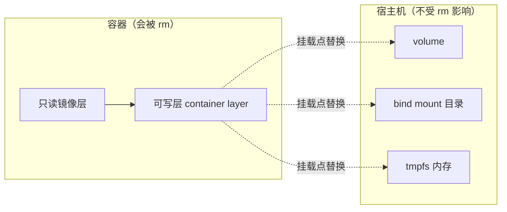

> **Docker 系列 · 第 12/24 篇**
> 上一篇：[《Docker 网络模式与实操——从 docker0 到 overlay》](/云原生/docker/docker-17-network) · 下一篇：[《Docker Compose 编排——用 YAML 定义一整栈微服务》](/云原生/docker/docker-18-compose)

---

## 开头：MySQL 容器一删，库没了

你用容器跑了个 MySQL，测试数据灌了两周。某天升级镜像版本：`docker rm` 旧容器、`docker run` 新容器——**库没了，两周白干**。

这不是 bug，是设计：容器的文件系统由「只读镜像层 + 一个可写层」组成（[第 5 篇](/云原生/docker/docker-05-container-and-image/)讲过心智模型；UnionFS 细节见后文[第 17 篇](/云原生/docker/docker-14-unionfs/)），**可写层属于容器**，容器删除它就没了。`docker rm` 从不留情。

要让数据活得比容器久，Docker 提供三种把数据「挂」到容器外的机制：**Volume（卷）、Bind Mount（绑定挂载）、tmpfs（内存挂载）**。本篇全部在本机实测（Docker 29.x，WSL2 Ubuntu-22.04），看完你能准确回答三个问题：三种机制各适合什么场景？为什么 `volume prune` 不会误删你的数据库卷？卷里的数据到底存在宿主机哪里？

---

## 一、先看清问题：可写层随容器而生灭



挂载的本质：把外部存储「覆盖」到容器内某个路径上。此后这个路径的读写都落在外部存储，不落在可写层——容器再怎么删，数据岿然不动。

三种机制一张表定调（官方 [Storage 文档](https://docs.docker.com/engine/storage/)的定位）：

| | **Volume 命名卷** | **Bind Mount 绑定挂载** | **tmpfs** |
|------|------|------|------|
| 数据存哪 | Docker 管理的区域（`/var/lib/docker/volumes/`） | 宿主机上**你指定的任意目录** | 内存（不落盘） |
| 谁管理生命周期 | Docker（`docker volume` 命令族） | 你自己 | 随容器生灭 |
| 挂载方式 | `-v 卷名:/data` 或 `--mount type=volume` | `-v /host/path:/data` 或 `--mount type=bind` | `--tmpfs /scratch` 或 `--mount type=tmpfs` |
| 典型场景 | **数据库、中间件状态**（生产首选） | 开发时源码热更新、共享配置文件 | 敏感临时数据（密钥、会话缓存） |
| 可移植性 | ✅ 好（不依赖宿主机目录结构） | ❌ 差（换台机器路径就失效） | — |

> 🔑 官方建议一句话：**存数据用 Volume，共享/开发文件用 Bind Mount，绝不能落盘的临时数据用 tmpfs。**

---

## 二、Volume 命名卷：生产持久化的首选（实测）

### 2.1 创建、查看、找到它在宿主机的真身

```bash
$ docker volume create mydata
mydata

$ docker volume inspect mydata
[
    {
        "CreatedAt": "2026-08-14T13:14:01Z",
        "Driver": "local",
        "Labels": null,
        "Mountpoint": "/var/lib/docker/volumes/mydata/_data",
        "Name": "mydata",
        "Options": null,
        "Scope": "local"
    }
]
```

`Mountpoint` 就是答案：卷里的数据存在宿主机 `/var/lib/docker/volumes/<卷名>/_data`。实测验证（宿主机直接读到容器写入的文件）：

```bash
$ docker run --rm -v mydata:/data busybox sh -c 'echo "persist-me" > /data/note.txt && cat /data/note.txt'
persist-me

$ ls -l /var/lib/docker/volumes/mydata/_data/
-rw-r--r-- 1 root root 11 Aug 14 21:14 note.txt
$ cat /var/lib/docker/volumes/mydata/_data/note.txt
persist-me
```

### 2.2 核心：容器删了，数据还在

**第一个容器写数据，然后删掉它**（注意 `--rm`，容器退出即删除）：

```bash
$ docker run --rm -v mydata:/data busybox sh -c 'echo "persist-me" > /data/note.txt'
```

**起一个全新容器挂同一个卷**：

```bash
$ docker run --rm -v mydata:/data busybox cat /data/note.txt
persist-me
```

容器是新的、镜像层是全新的，但 `note.txt` 还在——**数据跟着卷走，不跟着容器走**。这就是开头 MySQL 场景的解法：`-v mysql-data:/var/lib/mysql`，之后随便删容器、换镜像版本，数据不动。

### 2.3 `-v` 的自动创建 vs `--mount` 的严格检查

引用一个不存在的**命名卷**，`-v` 会静默创建：

```bash
$ docker run --rm -v autodata:/data busybox echo 'auto-created ok'
auto-created ok

$ docker volume ls | grep autodata
local     autodata          # 卷被自动创建了
```

而 `--mount` 是严格模式，bind 源路径不存在直接报错、不猜你的意图：

```bash
$ docker run --rm --mount type=bind,source=/root/no-such-dir,target=/src busybox echo hi
docker: Error response from daemon: invalid mount config for type "bind":
bind source path does not exist: /root/no-such-dir
```

> 🔑 脚本里推荐用 `--mount`：拼错卷名/路径时立刻报错，而不是悄悄造出一个空卷让应用「看起来正常地丢了数据」。

---

## 三、匿名卷与悬空卷：prune 到底删什么（实测）

不给卷名、只给容器内路径（`-v /data`），Docker 会生成一个 **64 位哈希名的匿名卷**：

```bash
$ docker run --rm -d --name anon-demo -v /data busybox sleep 120
$ docker inspect anon-demo --format '{{range .Mounts}}type={{.Type}} name={{.Name}} dst={{.Destination}}{{println}}{{end}}'
type=volume name=b7b465d7217c7e5301f9f49e958854b52c52d03388b2232aaf89ff9b1797fada dst=/data
```

另外，镜像的 Dockerfile 里若声明了 `VOLUME /xxx`，起容器时也会自动生成匿名卷（很多数据库官方镜像都这么干）。容器删了，匿名卷却**不会跟着删**——久而久之堆出一堆「悬空卷」（dangling，没有任何容器引用）：

```bash
$ docker volume ls -f dangling=true
DRIVER    VOLUME NAME
local     061dc58888c362c004f4da556b11c32b4befe2d53f220e4504b28567664a5817
local     3351d6bb6d09d411b09d9d853bcd15c11123fbddad4f04dfcdb03c6d0d449091
...
```

清理用 `docker volume prune`。但**先看清它的边界再敲**——实测（先显式创建一个从未被使用的命名卷 `orphan`）：

```bash
$ docker volume prune -f
Deleted Volumes:
b7b465d7217c7e5301f9f49e958854b52c52d03388b2232aaf89ff9b1797fada
061dc58888c362c004f4da556b11c32b4befe2d53f220e4504b28567664a5817
3351d6bb6d09d411b09d9d853bcd15c11123fbddad4f04dfcdb03c6d0d449091
...（共 5 个，全是匿名悬空卷）

Total reclaimed space: 223.6kB
```

注意结果：**`orphan` 这个显式命名的卷（哪怕没有任何容器用它）没被删**，`mydata` 也没被删。

> ⚠️ `docker volume prune` 默认**只删匿名的悬空卷，不删命名卷**——这是官方故意的保护设计。`docker volume prune -a` 才会连未使用的命名卷一起删，生产环境慎用 `-a`。要删指定卷永远用 `docker volume rm <卷名>`（同样实测：`docker volume rm autodata orphan mydata` 三个精确删除）。

---

## 四、Bind Mount：把宿主机目录直接挂进来（实测）

```bash
$ echo 'host-file-content' > /root/bind-demo/host.txt

$ docker run --rm -v /root/bind-demo:/src busybox cat /src/host.txt
host-file-content
```

容器读到了宿主机文件；反过来容器内写入也会出现在宿主机——双向实时同步，这是「开发热更新」的基础：源码目录 bind 进容器，宿主机改代码、容器里立刻生效。

**只读挂载**加 `:ro` 后缀，实测容器内写入被内核拒绝：

```bash
$ docker run --rm -v /root/bind-demo:/src:ro busybox sh -c 'echo x > /src/new.txt'
sh: line 0: can't create /src/new.txt: Read-only file system
```

> ⚠️ Bind mount 的两个坑：① 它把宿主机目录**原样覆盖**到容器路径——如果容器内该路径下有镜像自带的文件，挂载后会被「遮住」（对 bind mount，首次挂载不会复制内容，volume 才会把镜像内已有数据先拷进卷）；② 路径是宿主机强耦合，换机器就断，编排（Compose/K8s）里优先用命名卷。

---

## 五、tmpfs：数据只活在内存里（实测）

```bash
$ docker run --rm --tmpfs /scratch busybox sh -c 'mount | grep scratch; echo hello > /scratch/f && cat /scratch/f'
tmpfs on /scratch type tmpfs (rw,nosuid,nodev,noexec,relatime)
hello
```

`mount` 输出证实 `/scratch` 是一块 **tmpfs 内存文件系统**：读写极快、容器一停数据即焚、**永不落盘**。适合放密钥/令牌文件、会话缓存这类「用完就该消失、绝不能留在磁盘上被镜像或快镜带走」的数据。

---

## 六、卷的备份与恢复（实测）

卷不能 `docker cp` 直接整目录导出？官方套路是**临时容器 + tar**：把卷挂到一个短命容器里，打包到另一个 bind mount 目录：

```bash
$ docker run --rm -v mydata:/data -v /root/backup:/backup busybox tar cvf /backup/mydata.tar -C /data .
./
./note.txt

$ docker run --rm -v /root/backup:/backup busybox tar tvf /backup/mydata.tar
drwxr-xr-x root/root         0 2026-08-14 13:14:08 ./
-rw-r--r-- root root        11 2026-08-14 13:14:08 ./note.txt
```

恢复就是反过来：把 tar 解到新卷（`tar xvf /backup/mydata.tar -C /data`）。定时任务里跑这两条，就是最朴素的卷备份方案。多容器共享一个卷则用 `--volumes-from <容器>` 直接继承其挂载配置。

---

## 七、卷驱动：卷不一定在本地磁盘

`docker volume inspect` 输出里的 `"Driver": "local"` 暗示卷有「驱动」概念——`local` 驱动把数据放本机，但驱动也可以把数据放到别处。创建时用 `--opt` 传驱动参数，比如官方文档的 NFS 卷：

```bash
docker volume create --driver local \
  --opt type=nfs \
  --opt o=addr=192.168.1.100,rw,nfsvers=4 \
  --opt device=:/path/on/nfs \
  nfs-data
```

创建后 `docker run -v nfs-data:/data ...` 照常用——应用无感知，数据已在网络存储上。第三方卷驱动还能对接云盘（AWS EBS、Azure Disk）、分布式存储（Ceph、GlusterFS）。这是「可插拔存储」的接口，K8s 里的 PV/PVC 走的是同一思想。

---

## 八、选型决策与 Compose 回顾

决策速查：

| 你的需求 | 用什么 |
|------|------|
| 数据库/中间件的数据目录 | 命名卷（Compose 里 `volumes:` 顶层声明 + 服务引用） |
| 开发热更新源码、共享配置 | bind mount（开发环境专用） |
| 密钥等绝不能落盘的临时文件 | tmpfs |
| 跨主机共享存储 | 卷驱动（NFS/云盘/分布式存储） |
| 迁移/备份卷 | tar 打包套路（第六节） |

下一篇 Compose 会用到挂载字段；先熟悉下面写法，到[第 13 篇](/云原生/docker/docker-18-compose/)就能对上每一行含义：

```yaml
services:
  db:
    image: mysql:8.4
    volumes:
      - db-data:/var/lib/mysql           # 命名卷：数据持久化
      - ./init:/docker-entrypoint-init.d:ro   # bind mount + 只读：初始化脚本

volumes:
  db-data: {}                            # 顶层声明命名卷
```

---

## 小结

- 容器可写层随容器生灭；持久化 = 把数据路径挂到容器外。**三种机制**：Volume（Docker 管理、生产数据首选）、Bind Mount（宿主机目录、开发共享）、tmpfs（内存、敏感临时数据）。
- 命名卷数据在宿主机 `/var/lib/docker/volumes/<名>/_data`；**容器删、数据在**；`-v` 引用不存在命名卷会自动创建，`--mount` 严格报错——脚本用 `--mount`。
- **`volume prune` 只删匿名悬空卷，命名卷哪怕没被使用也不删**（实测验证）；`-a` 才会连命名卷一起删。
- Bind mount 是双向实时同步，`:ro` 只读由内核强制；tmpfs 永不落盘。
- 备份 = 临时容器 + tar；跨主机共享 = 卷驱动（NFS/云盘）。

**思考题**：为什么数据库镜像的 Dockerfile 要写 `VOLUME /var/lib/mysql`？不写会怎样？（提示：匿名卷 + 没挂命名卷时，数据落在哪、容器删除后命运如何。）

下一篇：[《容器日志与监控》](/云原生/docker/docker-20-logging-monitoring/)。

---

## 参考资料

- [Docker Docs · Storage](https://docs.docker.com/engine/storage/) — 三种挂载机制总览
- [Volumes](https://docs.docker.com/engine/storage/volumes/) — 卷生命周期、备份恢复、卷驱动、NFS
- [Bind mounts](https://docs.docker.com/engine/storage/bind-mounts/) / [tmpfs](https://docs.docker.com/engine/storage/tmpfs/)
- 本机实测环境：WSL2 Ubuntu-22.04 + Docker 29.x
