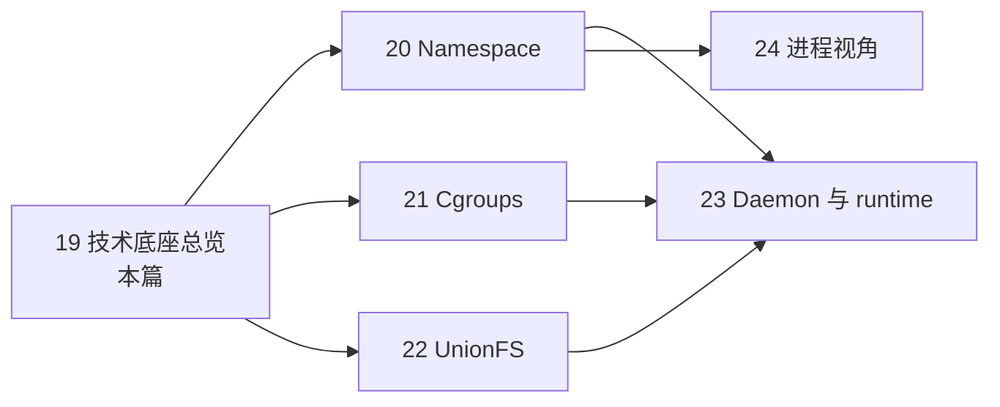

> **Docker 系列 · 第 19/33 篇**
> 上一篇：[《Compose 现代特性——watch 热更、profiles 分组与 init 容器》](/云原生/docker/docker-18-compose-modern) · 下一篇：[《Namespace 隔离——从一个容器里的怪现象滚穿六大命名空间》](/云原生/docker/docker-20-namespace)
>
> 本篇起进入**底层原理**阶段：先总览地图，再分篇深入 Namespace → Cgroups → UnionFS → Daemon/runtime → 进程视角。

---

## 写在前面

Docker 系列学到第 19 篇，命令、镜像、网络、卷、Compose 都用熟了。但每次有人问「容器到底是什么」，我只能背一句网上抄来的话：**看起来像独立的小机器，实际上只是宿主机上的进程，加上内核级的隔离与限额。**

这句话第一遍读像广告——「又轻又隔离」在我经验里是矛盾的：像机器的东西从来不轻（虚拟机），轻的东西从来不隔离（裸进程）。容器凭什么两头都占？Namespace、Cgroups、UnionFS 这三个词更是只闻其名。

所以继续用对话的老办法：**让 AI 当老师，我当学生，每课只讲一个概念，我有问题就打断，没问题就继续**。整场对话就抓着那一句话，一课解开一个词，而且这回每个论断都在本机跑出证据——看完你会和我一样发现：这句话不是广告，是账本。

课程路线图（走到哪算哪）：

> ① 两难的账本 → ② 「轻」：它真是进程 → ③ 共享同一个内核 → ④ 机器感 = 三张视图 + 一道限额 → ⑤ 视图一/三：A 看不到 B → ⑥ 视图二：自己的根文件系统 → ⑦ 一道限额：能用多少 → ⑧ 道具全是内核现成的 → ⑨ 第一代配方：LXC + AUFS → ⑩ 配方会老，底座不老

环境：WSL2 Ubuntu-22.04（root）+ Docker Engine 29.1.3。官方出处：[Docker overview — The underlying technology](https://docs.docker.com/get-started/overview/)。

---

## 第 1 课：两难的账本——VM 太重，裸进程太裸

**🧑‍🏫 老师：**

先把你那句「经验里矛盾」的经验，算成一笔账。

几十个微服务要部署，传统上只有两条路。**第一条：每个服务一台虚拟机。** VM 要虚拟化整套硬件——CPU、内存、网卡全是模拟出来的，然后在这套假硬件上引导一个完整的 Guest OS，你的服务才能开机。重是**架构性**的（[第 2 篇](/云原生/docker/docker-02-container-vs-vm)算过详细账）：每个 VM 吃掉一份内存给 Guest OS，开机要等引导，镜像动辄几个 GB。

**第二条：全部跑在宿主机上，当裸进程。** 轻是轻了，但几十个服务共享同一份系统视图——一张进程表、一张端口表、一套系统库。A 服务要 libc 2.31、B 服务要 2.35；A 占了 8080、B 也想监听 8080；`ps` 一看全是别人的进程。互相踩，运维噩梦。

所以 Docker 卖的其实是一条**中间路线**：隔离到「像各用各的机器」，又轻到「只是进程」。开头那句话拆到最后，就是这条路线的实现说明书。

> 一句话收口：**VM 隔离但重（虚拟化整套硬件 + Guest OS），裸进程轻但互相踩（共享一张系统视图）；容器要同时拿下两头。**

---

## 插问 1：VM 到底重在哪？「快不起来」是因为什么？

**🧑‍🎓 学生：** 你说 VM 的重是「架构性」的——意思是不能靠加钱解决吗？我把 VM 内存加到 64G、换成 NVMe，它还是慢怎么办？

**🧑‍🏫 老师：**

加钱能解决「资源不够」，解决不了「流程冗长」。VM 启动慢的根源不在硬件性能，而在**它必须完整走一遍「开机」**：

```text
VM 开机 = 上电 → BIOS/UEFI → 引导加载器 → 内核解压初始化 → 挂根文件系统
          → 起各类系统服务 → 你的应用

容器启动 = 内核直接创建进程（进程自己带好视图）
```

VM 的这条链是给「一台真正的机器」设计的，一步都省不掉，每步都在为「它以为自己是一台独立计算机」付出代价。容器跳过整条链：宿主机内核已经跑起来了，直接**起进程**就行——这就是后面第 2 课要眼见为实的「轻」。

也正因为如此，加钱能缩短 VM 开机时间（从 40 秒到 8 秒），但缩短不到容器的量级（毫秒级起进程）。量级差距来自架构，不来自配置。

> 一句话收口：**VM 慢在「必须完整开机」这条链，架构决定的，加钱只能优化常数，改不了量级。**

---

## 第 2 课：先解「轻」——它就是宿主机上的一个进程

**🧑‍🏫 老师：**

那句话里最反直觉的是后半句：「实际上只是宿主机上的进程」。空口无凭，当场验证。起一个最无聊的容器——跑 `sleep`：

```bash
docker run -d --name tf-sleep busybox sleep infinity
```

如果容器真的「只是一个进程」，那我应该能在**宿主机**的进程表里直接找到它。两个视角各看一眼：

```bash
docker top tf-sleep
ps -eo pid,ppid,comm,args | grep 'sleep infinity' | grep -v grep
```

```text
UID    PID    PPID  C  STIME  TTY  TIME     CMD
root  39988  39964  2  15:34   ?   00:00:00 sleep infinity

  PID  PPID COMMAND  ARGS
39988 39964 sleep    sleep infinity
```

`docker top` 是 Docker 替你查的宿主机进程表，`ps` 是你自己查的——**同一个进程，宿主机 PID 39988**。它不在什么「虚拟机里」，就躺在宿主机的进程表里，跟你的 bash、sshd 排一张表。

再进容器里面看：

```bash
docker exec tf-sleep ps
```

```text
PID   USER     TIME  COMMAND
    1 root      0:00 sleep infinity
    7 root      0:00 ps
```

同一个 `sleep infinity`，容器里看是 **1 号进程**，宿主机看是 **39988 号**。同一个进程，两套编号——这套戏法是第 5 课的 pid namespace 变的，先把现象记住。

所以「轻」的前一半解掉了：容器启动快、省内存，因为它**根本不起动新的操作系统，只是创建进程**——`docker run` 干的事，内核视角就是 fork 出一个带特殊配置的进程。

> 一句话收口：**容器 = 宿主机进程表里的一行；容器里 PID 1、宿主机里 39988，是同一个进程的两套编号。**

---

## 第 3 课：共享同一个内核

**🧑‍🎓 学生：** 等等，如果只是个进程，那容器里的「操作系统」哪去了？busybox 里也有自己的内核吗？

**🧑‍🏫 老师：**

问到关键了：**没有自己的内核，全体共享宿主机这一个。** 证据随手就能跑——`uname -r` 报告内核版本，两边各跑一次：

```bash
echo -n "宿主机:    "; uname -r
echo -n "容器内: "; docker run --rm busybox uname -r
```

```text
宿主机:    6.6.87.2-microsoft-standard-WSL2
容器内: 6.6.87.2-microsoft-standard-WSL2
```

一模一样，连 `-microsoft-standard-WSL2` 这种宿主机的「胎记」都带进去了——因为内核就是同一个，`uname` 只是问内核「你是谁」。对比 VM：Guest OS 有自己的内核，`uname -r` 报的是 Guest 自己的版本号。

这也解释了两件事：

- **为什么镜像那么小**：镜像里只装应用和它要的用户态库（busybox 才几 MB），内核这个大家伙不用带——宿主机有；
- **为什么容器离不开 Linux 内核**：第 8 课会看到，隔离和限额的工具全是 Linux 内核提供的。Windows / macOS 上的 Docker Desktop 其实**藏了一台 Linux 小虚拟机**在替你跑内核那部分——本实验的 WSL2 就是这台「机器」本身。

> 一句话收口：**容器内没有独立内核，全体共用宿主机那一个；镜像小、启动快，都是这句话的赠品。**

---

## 插问 2：共享内核，那容器里能跑 Windows 程序吗？

**🧑‍🎓 学生：** 既然共享宿主机内核——我在 Linux 上跑个容器，里面装 Windows 的 exe，行不行？

**🧑‍🏫 老师：**

不行，而且败因恰好能帮你巩固「共享内核」这句话。

一个程序要跑起来，光是「有文件」不够，它要**不停呼叫内核**：打开文件（open）、收发网络（send/recv）、申请内存（mmap）、创建进程（fork）……这些呼叫走的是**系统调用**，而系统调用的「接口方言」是内核定的。

Windows 的 exe 说的是 NT 内核的方言（Win32 API），Linux 内核只听得懂 POSIX 方言。共享内核意味着：exe 在容器里发出的每一次系统调用，Linux 内核都听不懂——不是「慢」，是「语言不通」。

所以规则可以记成一句：**镜像可以随便换用户态（alpine、debian、甚至带 glibc 的东西），内核没得选——宿主机是什么内核，容器就用什么内核。** Linux 容器要跑在 Windows/macOS 上，就得先垫一台 Linux 内核（Docker Desktop 的隐藏 VM / WSL2），等于「借一个听得懂方言的内核」。

（想跑 Windows 容器也有——Windows 内核原生容器，跑 Windows Server 内核 + Windows 镜像，那是另一套体系，和本系列说的 Linux 容器平行。）

> 一句话收口：**共享内核 = 共享系统调用方言；Linux 容器里跑不了 Windows 程序，因为内核听不懂它的呼叫。**

---

## 第 4 课：机器感的定义——三张视图 + 一道限额

**🧑‍🏫 老师：**

「轻」解完了。现在拆前半句：「看起来像独立的小机器」从哪来。把容器的正式定义摆上来，机器感的零件全在里面：

> **容器的本质**：被 Namespaces 和 Cgroups 约束、拥有逻辑上独立文件系统与网络命名空间的一个（或一组）进程。

逐词拆，正好四样东西：

- **一个（或一组）进程**——第 2 课已验证，主体就是它；
- **Namespaces 约束**——给进程换一副「眼镜」：看见自己的进程表、自己的网卡（第 5 课）；
- **Cgroups 约束**——给进程上一道「额度」：CPU、内存用到哪封顶（第 7 课）；
- **逻辑上独立的文件系统与网络命名空间**——注意「逻辑上」三个字：磁盘和网线**没有多出来一根**，变的只是内核给这个进程的**视图**。

也就是说，机器感不是「多了一台机器」，而是**同一个进程被换了三张视图、外加一道限额**：

```text
宿主机上的一个进程（第 2 课：宿主机 PID 39988）
├── 视图一：自己的进程表、主机名……   ← Namespaces（第 5 课）
├── 视图二：自己的根文件系统 /       ← UnionFS 只读层+可写层（第 6 课）
├── 视图三：自己的网络栈、网卡       ← Namespaces 里的 net（第 5 课）
└── 一道限额：CPU / 内存 / I/O 上限  ← Cgroups（第 7 课）
```

接下来四课，每课填一行，每行都有本机实验。

> 一句话收口：**机器感 = 三张视图 + 一道限额；磁盘网线没多，变的全是内核给进程看的「图」。**

---

## 第 5 课：视图一和视图三——A 容器为什么看不到 B（Namespaces）

**🧑‍🏫 老师：**

第 2 课留下一个悬案：同一个 `sleep`，容器里是 1 号、宿主机是 39988 号。现在揭底：内核给每个容器进程发了一副**专用眼镜**（namespace），眼镜里重编号。耳听为虚，直接去 `/proc` 里看眼镜本体——每个进程的 `/proc/<pid>/ns/` 目录下挂着它所有 namespace 的「编号牌」：

```bash
docker inspect tf-sleep --format '{{.State.Pid}}'
# → 39988（容器主进程在宿主机的 PID，第 2 课查过）

for ns in pid mnt net uts; do
  echo -n "host-init : "; readlink /proc/1/ns/$ns
  echo -n "container : "; readlink /proc/39988/ns/$ns
done
```

```text
--- pid
  host-init : pid:[4026532219]
  container : pid:[4026532582]
--- mnt
  host-init : mnt:[4026532217]
  container : mnt:[4026532579]
--- net
  host-init : net:[4026531840]
  container : net:[4026532584]
--- uts
  host-init : uts:[4026532218]
  container : uts:[4026532580]
```

四组编号**全不一样**——宿主机的 1 号进程和容器进程，戴着四副不同的眼镜。namespace 的本质就是这些编号牌：编号相同 = 同一副眼镜（看见同一个世界）；编号不同 = 各看各的。

再拿三个现象对号入座，全是这副眼镜变的戏法。

**主机名不同（uts）**：

```bash
echo -n "host: "; hostname
echo -n "container: "; docker exec tf-sleep hostname
```

```text
host: pc3507
container: 09c5dd7d6c56
```

**进程表互不可见（pid）**——再起两个容器，各自 `ps`：

```bash
docker run -d --name tf-a busybox sleep infinity
docker run -d --name tf-b nginx:alpine
docker exec tf-a ps
```

```text
PID   USER     TIME  COMMAND
    1 root      0:00 sleep infinity
    7 root      0:00 ps
```

tf-a 里只有自己（和 ps）。tf-b 里跑一遍 `ps`，看到的全是 nginx 自己那窝进程——**两个容器互相看不见对方的进程**，尽管它们在宿主机进程表里比邻而居。

**网卡各自一张（net）**：

```bash
docker exec tf-a ip addr show eth0 | grep inet
docker exec tf-b ip addr show eth0 | grep inet
```

```text
    inet 172.17.0.5/16 brd 172.17.255.255 scope global eth0
    inet 172.17.0.6/16 brd 172.17.255.255 scope global eth0
```

一人一张 eth0、一个 IP——所以两个容器各自监听 80 也不打架（bridge、veth 的机制细节是[第 15 篇](/云原生/docker/docker-15-network)的活）。

Docker 常用的 namespace 一共六类，每类隔离一样东西：

| Namespace | 隔离内容 | 你见过的现象 |
|-----------|----------|--------------|
| **pid** | 进程编号 | 容器里业务进程是 1 号 |
| **net** | 网卡、协议栈、端口 | 各有 eth0、都监听 80 不打架 |
| **mnt** | 挂载点 | 第 14 篇的挂载「盖住」 |
| **uts** | 主机名 | hostname 是容器 ID |
| **ipc** | 进程间通信队列 | 信号量、消息队列各用各的 |
| **user** | UID/GID 编号 | 容器里的 root ≠ 宿主机 root（可配置） |

此外还有 **cgroup**、较新的 **time** 等。注意主语：**namespace 是 Linux 内核的机制**，Docker 只是给每个容器进程配齐了这套眼镜。每副眼镜怎么造出来（`clone()` 的 flags、`unshare`）、怎么自己动手写一个「迷你容器」，是[第 20 篇](/云原生/docker/docker-20-namespace)的主场。

> 一句话收口：**Namespaces = 每进程一副「眼镜」，编号牌在 `/proc/<pid>/ns/`；A 看不到 B，不是 B 不存在，是 A 的眼镜里没有它。**

---

## 第 6 课：视图二——自己的根文件系统怎么来（UnionFS）

**🧑‍🎓 学生：** 视图一和三我看到证据了。可还有一块：我进容器 `ls /`，看到一整套目录、自己的 `/etc`——进程视图里哪来的这套文件？总不能是给我复制了一份系统吧？

**🧑‍🏫 老师：**

复制一份就又不「轻」了。答案是**联合挂载**：镜像不是一个大 tarball，而是**一层层只读目录叠起来，再在最上面盖一层可写层**，联合呈现成 `/`。证据同样在 `/proc` 里——容器主进程的挂载表：

```bash
grep -m1 overlay /proc/39988/mountinfo
```

```text
998 796 0:93 / / rw,relatime - overlay overlay rw,\
lowerdir=/var/lib/containerd/.../snapshots/1692/fs:/var/lib/containerd/.../snapshots/113/fs,\
upperdir=/var/lib/containerd/.../snapshots/1693/fs,\
workdir=/var/lib/containerd/.../snapshots/1693/work
```

这行就是根文件系统的全部秘密，逐段读：

- **`lowerdir=1692/fs:113/fs`**——两层**只读**目录（镜像层），冒号隔开，从左往右一层层往下垫；
- **`upperdir=1693/fs`**——**可写层**，容器里写的所有东西落在这里（[第 14 篇](/云原生/docker/docker-14-data-persistence)讲过：rm 容器丢的就是它）；
- **`workdir`**——overlay 自己的工作目录，不用管；
- 联合起来挂到 `/`（`/ / rw` 那段）——容器里 `ls /` 看到的，就是这几层叠出来的结果。

往哪一层里写了什么，`docker history` 从镜像侧看得更清楚（nginx:alpine 为例）：

```bash
docker history nginx:alpine --format '{{.Size}}\t{{.CreatedBy}}' | head -5
```

```text
51.8MB	RUN /bin/sh -c set -x && apkArch="$(cat …
0B	ENV ACME_VERSION=0.4.1
0B	ENV ACME_VERSION=0.4.1
0B	ENV NJS_RELEASE=1
0B	ENV NJS_VERSION=1.0.0
```

每条 Dockerfile 指令一层，大小一栏就是这层的体积——`RUN` 装包的层 51.8MB，`ENV`、`CMD` 只是元数据 0B。

这个结构同时解了「机器感」和「轻」的另一半：

- **机器感**：进程被盖上一套自己的根文件系统，看到的就是 alpine/debian 那套目录——视图二到位；
- **轻的另一半**：层是**只读、可共享**的——十台机器跑同一镜像，base 层磁盘上只存一份；改一行代码只新增一层，不重传整个镜像（[第 9 篇](/云原生/docker/docker-09-dockerfile)的构建缓存就是它在干活）。

（上面 mountinfo 里目录前缀是 `/var/lib/containerd/...` 而不是老教程说的 `/var/lib/docker/overlay2/...`，因为本机启用了 containerd image store，存储驱动是 `overlayfs`——语义完全一样，这是[第 23 篇](/云原生/docker/docker-23-daemon-runtime)的伏笔。）

> 一句话收口：**根文件系统 = 只读镜像层叠罗汉 + 顶上可写层，`mountinfo` 里 lowerdir/upperdir 白纸黑字；分层可共享，是「轻」的另一半。**

---

## 第 7 课：一道限额——视图隔开了，资源还在抢（Cgroups）

**🧑‍🏫 老师：**

三张视图齐了，但只解决「**看见**什么」。还剩一个物理问题：CPU 还是同一颗、内存还是同一块——视图隔离只是「假装看不见对方」，一个内存泄漏的容器照样能把整机拖垮。所以需要第二类约束：**Cgroups，管「能用多少」**。

马上验证限额真的存在、真的写在内核文件里。起一个限了额的容器——半个 CPU、16MB 内存：

```bash
docker run -d --name tf-lim --cpus 0.5 --memory 16m busybox sleep infinity
docker inspect tf-lim --format 'NanoCpus={{.HostConfig.NanoCpus}} Memory={{.HostConfig.Memory}}'
```

```text
NanoCpus=500000000 Memory=16777216
```

`--cpus 0.5` 被换算成 5 亿纳秒，16m 换算成字节数。然后去内核的 cgroup 文件系统里找落点——每个容器在 `/sys/fs/cgroup/` 下有自己的目录，`docker run` 的限额参数最终就是写进这里的普通文件：

```bash
CG=/sys/fs/cgroup/system.slice/docker-f9611c2856cc…8bc8.scope   # tf-lim 的 cgroup 目录
cat $CG/cpu.max
cat $CG/memory.max
```

```text
50000 100000
16777216
```

逐个读：

- `cpu.max = 50000 100000`：每 **100000 微秒**的周期里，最多给这个容器跑 **50000 微秒**——正好一半，`--cpus 0.5` 的真身；
- `memory.max = 16777216`：16MB 硬顶，超了内核直接 OOM kill。

对照组——没限额的 tf-sleep，同一个文件长这样：

```bash
cat /sys/fs/cgroup/system.slice/docker-09c5dd7d…380.scope/cpu.max
```

```text
max 100000
```

`max` = 不限。同一种文件、两个值，限额与否一目了然。

两个落点帮你把日常和内核对上：`docker run --cpus` / `-m` 这类参数（[第 16 篇](/云原生/docker/docker-16-compose) Compose 里写 `cpus:`、`mem_limit:` 同理）落点就在这；老资料里的路径多是 cgroup **v1** 布局（本机 `stat -fc %T /sys/fs/cgroup` 输出 `cgroup2fs`，是 **v2**），路径长得不一样，思想不变。超限之后内核怎么掐（OOM、CPU 节流）是[第 21 篇](/云原生/docker/docker-21-cgroups)的主场。

> 一句话收口：**Namespace 管看见什么，Cgroup 管能用多少；`--cpus 0.5` 最终就是 cgroup 目录里 cpu.max 文件里的两个数字。**

---

## 插问 3：只有 Namespace 不限额，会出什么事？

**🧑‍🎓 学生：** 我在想一个组合问题：如果一台机器上的容器只配了 Namespace、没配 Cgroup，会发生什么？反过来只有 Cgroup 呢？

**🧑‍🏫 老师：**

好问题，这两个「半残容器」各有一个典型死法。

**只有 Namespace、没有 Cgroups：** 视图上大家井水不犯河水，但 CPU、内存是**同一颗同一块**。一个容器里写了死循环狂吃 CPU，或内存泄漏——`docker stats` 一看它在宿主机层面吃得欢，其他容器跟着卡顿、整机 OOM。更麻烦的是排查：**限额也是计量**，没有 cgroup 的统计，你连「是谁吃的」都要靠猜。死法：**一个容器拖垮整机，其他人陪葬**。

**只有 Cgroups、没有 Network Namespace（其它同理）：** 资源倒是有边了，但所有容器看**同一张端口表**——A 监听了 80，B 再监听 80 直接 `Address already in use`；还看同一张进程表、同一个根文件系统，隔离基本归零。死法：**限额了个寂寞，容器们在一张桌子上抢端口**。

合起来正好说明这两类约束**正交、缺一不可**：Namespace 划「地盘」（谁看不见谁），Cgroups 分「口粮」（各自能用多少）。Docker 默认两者都配齐——本机跑的每个容器，第 5 课那几张 ns 编号牌和第 7 课那个 cgroup 目录，都是 `docker run` 一起发下来的。

> 一句话收口：**Namespace = 地盘，Cgroups = 口粮；只给地盘会被饿死邻居，只给口粮会同桌抢碗。**

---

## 第 8 课：戏法道具全是内核现成的——Docker 发明了什么

**🧑‍🎓 学生：** 到这里我有点震惊：namespace 是内核的，cgroup 是内核的，overlay 也是内核的——那 Docker 到底发明了什么？

**🧑‍🏫 老师：**

这个震惊值得。把三根支柱列成表，主语一栏看清楚：

| 支柱 | 解决什么 | 谁的 | 诞生时间 |
|------|----------|------|----------|
| **Namespaces** | 视图隔离 | Linux 内核 | 2002 年起陆续合入 |
| **Cgroups** | 资源限额与统计 | Linux 内核 | 2007 年（Google 捐入） |
| **UnionFS/OverlayFS** | 分层联合挂载 | Linux 内核/文件系统 | overlayfs 2014 年合入 |

这三样在 Docker 出现（2013 年）之前**全都在内核里躺了好几年**。容器技术能在 2013 年后爆发，不是内核突然进化了，而是有人把现成道具**拼成了顺手的产品**。

拼装的历史一句话版本，也是你会在老资料里反复见到的一个公式：

```text
Docker ≈ LXC + AUFS
```

拆成三级台阶看：

| 层次 | 组成 | 职责 |
|------|------|------|
| 内核 | Namespace + Cgroup | 落实地盘与口粮 |
| **LXC**（用户态工具集） | 内核能力 + chroot + veth + 脚本 | 第一次把道具拼成「拿来能用的容器」 |
| **Docker** | LXC 之上再封装 | **镜像管理、Registry、CLI/API、可移植性** |

LXC 在 2008 年就把「容器」拼出来了，但用起来是运维专家的玩具。Docker 早期直接借 LXC 起步，真正的贡献是上面那层：**把「一个容器」变成「一份可以在任何机器复现的镜像」**——Dockerfile、分层镜像、Registry 生态。道具是内核的，**让道具人人会用**，才是产品化的那一步。

> 一句话收口：**三根支柱全是内核现成的；Docker 的发明不在隔离技术，而在镜像与生态——把专家工具变成人人能用的产品。**

---

## 第 9 课：第一代配方会老——runtime 演进

**🧑‍🎓 学生：** 「Docker ≈ LXC + AUFS」这个公式今天还成立吗？

**🧑‍🏫 老师：**

当**历史公式**记，它已经全换过了。十几年过去，右边两项都退役：

- **LXC 这一层**被 Docker 自家的运行时栈取代：`containerd`（管理容器生命周期）+ `runc`（真正调 `clone()` 创建进程的那个）。现行架构里没有 LXC 什么事了；
- **AUFS** 没能进 Linux 主线内核，被 **OverlayFS** 取代——第 6 课 `docker info` 里那个 `overlayfs` 就是它（语义没变：只读层 + 可写层 + 写时复制）。

更宏观的一轮换血发生在 K8s 那边：

```text
早期 K8s：kubelet → CRI → docker-shim → Docker Engine → containerd → runc
现在 K8s：kubelet → CRI → containerd（或 CRI-O）→ runc
```

Docker 从 K8s 的默认路径里淡出了（2020 年前后，v1.24 移除 dockershim）。但看清楚换了什么：换的全是**上层封装**——谁提供 API、谁来编排。右边垫底的还是那几样：**Namespace + Cgroup + 联合文件系统**，而且被写成了开放标准（**OCI**：镜像格式规范 + 运行时规范），任何实现照着标准来就能互换。

所以才有那句结论：**容器「是什么」十四年没变——受限进程 + 分层文件系统 + 独立网络栈；变的只是谁来做 API 封装与编排。** 这也是开头那句话到今天依然成立的原因。`dockerd → containerd → shim → runc` 每一级干什么、怎么亲眼看到调用链，是[第 23 篇](/云原生/docker/docker-23-daemon-runtime)的主场。

> 一句话收口：**LXC 换成了 containerd/runc，AUFS 换成了 OverlayFS，上层换了三轮，底座三件套一根没动——还被 OCI 写成了标准。**

---

## 插问 4：K8s 都不用 Docker 了，我们还在 docker build，矛盾吗？

**🧑‍🎓 学生：** 公司里流程是这样的：CI 用 `docker build` 打镜像，推到 Harbor，K8s 拉下来跑。可你刚说 K8s 淡出了 Docker——那我们这套流程是不是迟早要改？

**🧑‍🏫 老师：**

不用改，因为「淡出」淡出的是**运行时**那一环，不是镜像。把链路拆开看：

```text
构建侧：docker build → 产出镜像（OCI 格式）→ push Harbor
运行侧：kubelet → containerd → runc → 拉同一份镜像跑
```

关键在中间那份「合同」：**OCI 镜像规范**。Docker 构建出的镜像（准确说是 buildkit 构建的）就是 OCI 格式，containerd、CRI-O 全都按同一份规范解析。K8s 抛弃的是 dockershim 那段**多余的转发**——kubelet 本来要经由 Docker Engine 再到 containerd，两头 API 还要翻译；现在直连 containerd，链路短了，但**拉的还是同一个镜像仓库、同一份镜像**。

所以你们的流程完全健康：`docker build` 在构建侧只是「一个生产 OCI 镜像的工具」，将来真想换，`podman build`、`buildah`、`nerdctl build` 产出的镜像直接通用。工具可换，**镜像格式是合同**——这正是 OCI 标准存在的意义。

> 一句话收口：**K8s 淡出的是 Docker 运行时，不是 Docker 镜像；OCI 是合同，构建工具随便换，产物谁都能跑。**

---

## 小结

把开头那句话最后摆一遍——这次每个词都有出处、有实验：

> **看起来像独立的小机器**（第 5、6 课：三张视图，ns 编号牌 + overlay mountinfo 眼见为实）**，实际上只是宿主机上的进程**（第 2 课：宿主机 ps 里那一行）**，共享同一个内核**（第 3 课：uname -r 一致）**，加上内核级的隔离**（第 5 课 Namespaces）**与限额**（第 7 课：cpu.max 里的 50000 100000）。

一个词一句话（速查版）：

| 概念 | 一句话 |
|------|--------|
| **Namespaces** | 每进程一副眼镜：进程表、网卡、主机名、挂载点各看各的 |
| **Cgroups** | 每进程一道口粮：CPU/内存上限写在 `/sys/fs/cgroup` 的文件里 |
| **UnionFS/OverlayFS** | 只读层叠罗汉 + 可写层，根文件系统和镜像共享都靠它 |
| **容器本质** | 受限进程 + 独立文件系统/网络视图，不是虚拟化硬件 |
| **Docker ≈ LXC + AUFS** | 历史公式：内核道具是现成的，Docker 发明的是镜像与生态 |
| **OCI** | 镜像与运行时的开放合同，上层随便换、底座不变 |

**思考题**：第 5 课的 namespace 编号牌里，两个容器的 `net:[...]` 编号不同、但都桥接到同一个 `docker0`——「网络视图隔离」和「网络能互通」矛盾吗？（提示：[第 15 篇](/云原生/docker/docker-15-network)的 veth 一头在容器、一头在桥上。）

下一篇：[《Namespace 隔离——从一个容器里的怪现象滚穿六大命名空间》](/云原生/docker/docker-20-namespace)——拿起本篇的第一根支柱，亲手用 `clone()` 造一个迷你容器。

---

## 学习路线：本篇在原理阶段的位置

本篇是原理阶段的地图，后面四篇各拿走一根支柱做实验，第 23 篇收调用链：



| 相关篇 | 在这一路上出现的位置 |
|--------|----------------------|
| [第 2 篇](/云原生/docker/docker-02-container-vs-vm) 容器 vs 虚拟机 | 第 1、2 课：VM 的账、共享内核 vs 虚拟化硬件 |
| [第 9 篇](/云原生/docker/docker-09-dockerfile) Dockerfile | 第 6 课：一条指令一层、构建缓存 |
| [第 14 篇](/云原生/docker/docker-14-data-persistence) 数据持久化 | 第 6 课：可写层随容器生灭 |
| [第 15 篇](/云原生/docker/docker-15-network) 网络 | 第 5 课：net 视图的 bridge / veth |
| [第 20 篇](/云原生/docker/docker-20-namespace) Namespace 深入 | 第 5 课：填满视图一/三 |
| [第 21 篇](/云原生/docker/docker-21-cgroups) Cgroups 深入 | 第 7 课：填满限额 |
| [第 22 篇](/云原生/docker/docker-22-unionfs) UnionFS 深入 | 第 6 课：填满视图二 |
| [第 23 篇](/云原生/docker/docker-23-daemon-runtime) Daemon 与 runtime | 第 9 课：调用链收尾 |
| [第 24 篇](/云原生/docker/docker-24-process-view) 进程视角 | 第 2 课：两套 PID 对照 |

---

## 历史包袱

- **AUFS**：未进 Linux 主线，被 OverlayFS 取代；「只读层 + 可写层 + 写时复制」语义未变。老教程里的 `/var/lib/docker/overlay2/` 路径，在 containerd image store 下变成 `/var/lib/containerd/.../snapshots/`（本篇第 6 课实测）。
- **LXC**：Docker 早期借它起步，后换自研运行时栈（containerd/runc），现行架构里没有这一层。公式当历史/教学记。
- **docker-shim**：`kubelet → docker-shim → Docker API` 链路已废弃（K8s v1.24 移除），现为 containerd/CRI-O 直连。

---

## 本篇实验清理（可照抄）

```bash
docker rm -f tf-sleep tf-a tf-b tf-lim
```

---

## 参考资料

- [Docker overview — The underlying technology](https://docs.docker.com/get-started/overview/)：Namespaces / Control groups / Union file systems 三件套的官方出处
- [What is a container?](https://docs.docker.com/get-started/docker-concepts/the-basics/what-is-a-container/)
- [namespaces(7) — Linux manual page](https://man7.org/linux/man-pages/man7/namespaces.7.html)
- [Control Groups v2 — Linux kernel docs](https://docs.kernel.org/admin-guide/cgroup-v2.html)
- 本机：WSL2 Ubuntu-22.04 + Docker Engine 29.1.3（cgroup v2、containerd image store）
