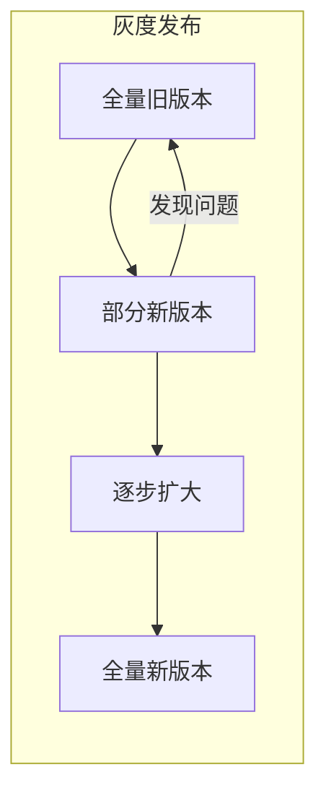
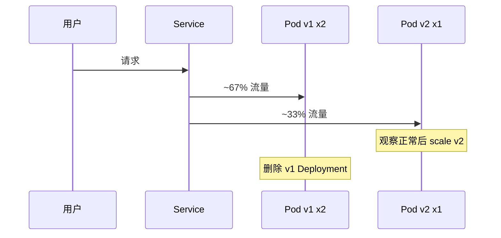

> **Kubernetes 系列 · 第 15/35 篇**  
> 上一篇：[《Gateway API：七层入口的新标准与 Ingress 迁移》](/云原生/k8s/k8s-14-gateway-api)  
> 下一篇：[《基于 QPS 的动态扩缩容——Prometheus Operator 与 Adapter》](/云原生/k8s/k8s-16-prometheus-hpa)

---

## 开头：上线不翻车，先搞懂发布策略

Ingress 解决了「流量从集群外怎么进来」的问题；一旦服务要升级，下一个高频场景就是：**怎么把新版本推上去，又尽量不影响在线用户？**

蓝绿、金丝雀、滚动、A/B 测试——名字听起来很多，本质都是在回答同一个问题：**新旧版本如何共存、如何切流、如何回滚**。本文先梳理概念与适用场景，再给出在 Minikube 上可复现的 Deployment + Service 实操，最后补充 Ingress Annotations 实现按 Header/权重分流。

---

## 一、灰度发布：平滑过渡的发布方式

**灰度发布**指在「全旧（0）」与「全新（1）」之间平滑过渡：先让一部分用户访问新版本，观察指标与反馈，再逐步扩大范围或一键回滚。

| 收益 | 说明 |
|------|------|
| 降低影响面 | 出问题只波及部分用户，可提前发现 bug |
| 收集反馈 | 新版本的使用数据可用于产品决策 |
| 热迁移与快速回滚 | 不必整机停机，回滚路径清晰 |

常见灰度类型：**金丝雀发布**、**滚动发布**、**蓝绿发布**。A/B 测试与前三者目标不同，后文单独说明。



---

## 二、四种策略概念对比

### 2.1 蓝绿发布（Blue/Green）

准备**两套完整环境**：绿色为当前在线版本，蓝色为新版本（不对外或仅做验证）。验证通过后，**一次性**将流量从绿切到蓝；观察稳定后销毁旧绿环境。


| 优点 | 缺点 |
|------|------|
| 切换快、回滚快（改 Service selector 即可） | 需要双倍资源 |
| 发布前可在蓝环境充分测试 | 切换是全量的，蓝环境有问题会直接影响全部用户 |

**适用**：资源充足、希望秒级切换/回滚；系统内聚、数据同步简单。

### 2.2 金丝雀发布（Canary）

只有**一套基础设施**，先上线**少量**新版本实例（如 1 台或 2% 流量），观察日志与监控，再逐步替换剩余实例。名字来自矿井下矿前放金丝雀探毒气——用小代价试错。


| 优点 | 缺点 |
|------|------|
| 成本低，一台即可开始 | 全量替换时若流量过大可能短暂中断 |
| 可配合权重做「流量切分」 | 自动化不足时需人工介入 |

**适用**：实例数量多、无法承担双倍机器；对代码信心不足时优先选用。

### 2.3 滚动发布（Rolling Update）

在金丝雀基础上的**自动化**演进：Deployment 按批次替换 Pod（如 1 → 10% → 50% → 100%），每批之间可观察。K8s 原生 `RollingUpdate` 即此类。


关键参数：

| 参数 | 含义 |
|------|------|
| `maxSurge` | 更新过程中最多可超出期望副本数的 Pod 数（绝对值或百分比） |
| `maxUnavailable` | 更新过程中最多不可用的 Pod 数；设为 `0` 可保证更新期间容量不减少 |

### 2.4 A/B 测试——与发布策略不是一回事

| 维度 | 蓝绿 / 金丝雀 / 滚动 | A/B 测试 |
|------|----------------------|----------|
| 目标 | 确保**新版本稳定**、可控上线 | 比较**多个已上线版本**的转化率、订单等业务效果 |
| 版本关系 | 有新旧之分 | 多个版本均已达上线标准，可能用蓝绿等方式上线 |
| 流量控制 | 逐步切或一次性切 | 按用户特征分配流量，如 A 10%、B 10%、C 80% |

A/B 在 K8s 中常借助 **Istio**、**Traefik**、**Ingress canary annotations** 等在 HTTP Header/Cookie 上分流。

---

## 三、Kubernetes 中的六种发布形态

| 策略 | K8s 实现要点 |
|------|-------------|
| 重建（Recreate） | 先停旧 Pod 再建新 Pod，有停机窗口 |
| 滚动更新 | Deployment `strategy.type: RollingUpdate` |
| 蓝绿 | 两套 Deployment + Service selector 切换 |
| 金丝雀 | 多 Deployment 共享 Service，按 Pod 比例分流 |
| A/B | Header/Cookie/权重规则，常配合 Ingress 或 Mesh |
| 无损发布 | PreStop + readiness，配合优雅下线 |

---

## 四、实操一：Deployment 金丝雀（按 Pod 比例）

思路：v1、v2 两个 Deployment 共用 label `app: my-app`，Service 只选 `app: my-app`；kube-proxy 对后端 Pod **轮询/随机**，流量大致按 **Pod 数量比例**分配。

### 4.1 准备镜像与目录

实验使用带 `/env` 探针端点的 nginx-gateway 镜像（返回 `VERSION` 环境变量）。在 Minikube 节点上：

```bash
minikube ip   # 记下 IP，下文以 192.168.49.2 为例
cd deployPolicy   # 存放 YAML 的目录
```

### 4.2 v1 Deployment + Service（`app-v1-canary.yaml`）

```yaml
apiVersion: apps/v1
kind: Deployment
metadata:
  name: my-app-v1
  labels:
    app: my-app
spec:
  replicas: 2
  selector:
    matchLabels:
      app: my-app
      version: v1.0.0
  template:
    metadata:
      labels:
        app: my-app
        version: v1.0.0
    spec:
      containers:
        - name: my-app
          image: nginx:alpine   # 实验可换为带 /env 的自定义镜像
          ports:
            - name: http
              containerPort: 8008
          env:
            - name: VERSION
              value: v1.0.0
            - name: env_flag
              value: VERSION-v1.0.0
          livenessProbe:
            httpGet:
              path: /
              port: http
            initialDelaySeconds: 5
            periodSeconds: 5
          readinessProbe:
            httpGet:
              path: /
              port: http
            periodSeconds: 5
---
apiVersion: v1
kind: Service
metadata:
  name: my-app
  labels:
    app: my-app
spec:
  type: NodePort
  ports:
    - name: http
      port: 8008
      targetPort: http
      nodePort: 30808
  selector:
    app: my-app
```

### 4.3 v2 Deployment（`app-v2-canary.yaml`）

```yaml
apiVersion: apps/v1
kind: Deployment
metadata:
  name: my-app-v2
  labels:
    app: my-app
spec:
  replicas: 1
  selector:
    matchLabels:
      app: my-app
      version: v2.0.0
  template:
    metadata:
      labels:
        app: my-app
        version: v2.0.0
    spec:
      containers:
        - name: my-app
          image: nginx:alpine
          ports:
            - name: http
              containerPort: 8008
          env:
            - name: VERSION
              value: v2.0.0
            - name: env_flag
              value: VERSION-v2.0.0
          livenessProbe:
            httpGet:
              path: /
              port: http
            initialDelaySeconds: 5
            periodSeconds: 5
          readinessProbe:
            httpGet:
              path: /
              port: http
            periodSeconds: 5
```

### 4.4 金丝雀步骤

```bash
# Step 1：启动 v1（2 副本）
kubectl apply -f app-v1-canary.yaml
kubectl get svc -l app=my-app
curl http://192.168.49.2:30808
watch kubectl get pod

# Step 2：启动 v2（1 副本）—— 约 1/3 流量到新版本
kubectl apply -f app-v2-canary.yaml
while sleep 1; do curl -s http://192.168.49.2:30808 | head -1; done

# Step 3：v2 扩到 2 副本（v1:v2 = 1:1）
kubectl scale --replicas=2 deploy my-app-v2

# Step 4：删除 v1，流量全到 v2
kubectl delete deploy my-app-v1

# 清理
kubectl delete all -l app=my-app
```



**小结**：金丝雀较慢但风险小；Service 默认按 Pod 数比例分流，**不能**精确到 30% 这种粒度——要精细控制需 Ingress 权重或 Service Mesh。

---

## 五、实操二：Deployment 滚动发布

同一 Service，通过**单个 Deployment 的镜像/模板变更**触发滚动；或 v1/v2 两个 Deployment 但 v2 带 `RollingUpdate` 策略。

### 5.1 关键 strategy 片段

```yaml
spec:
  replicas: 3
  strategy:
    type: RollingUpdate
    rollingUpdate:
      maxSurge: 1        # 最多多 1 个 Pod
      maxUnavailable: 0  # 更新期间不允许不可用
```

### 5.2 操作步骤

```bash
kubectl apply -f app-v1.yaml
watch kubectl get pod
kubectl get svc -l app=my-app

# 触发滚动：apply v2 的 Deployment（同名或替换镜像）
kubectl apply -f app-v2-rolling.yaml

# 观察版本切换
while sleep 1; do curl -s http://192.168.49.2:30808 | head -1; done

# 回滚
kubectl rollout undo deploy my-app-v2

# 暂停 / 恢复（排查时用）
kubectl rollout pause deploy my-app-v2
kubectl rollout resume deploy my-app-v2

kubectl delete -l app=my-app
```

滚动发布**不控制精确流量比例**，但 K8s 原生支持好；出问题用 `rollout undo` 回滚。

---

## 六、实操三：蓝绿发布（Service selector 切换）

两套 Deployment **同时运行**，Service 通过 **version 标签** 决定流量指向哪一套。

### 6.1 Service 关键 selector

```yaml
spec:
  selector:
    app: my-app
    version: v1.0.0   # 切流时改为 v2.0.0
```

### 6.2 步骤

```bash
kubectl apply -f app-v1-svc.yaml      # v1 + Service 指向 v1
kubectl apply -f app-v2.yaml          # 仅启动 v2，不接流量

# 验证 v1
while sleep 1; do curl -s http://192.168.49.2:30808 | head -1; done

# 一切换到 v2（patch 无需删 Pod）
kubectl patch service my-app -p '{"spec":{"selector":{"version":"v2.0.0"}}}'

# 有问题立刻切回
kubectl patch service my-app -p '{"spec":{"selector":{"version":"v1.0.0"}}}'

kubectl delete all -l app=my-app
```

`kubectl patch` 适合在不重建 Service 的情况下改 selector，是蓝绿切换的常用手法。

---

## 七、Ingress Annotations 金丝雀（精细流量）

Ingress-Nginx（≥ 0.21.0）支持 Canary 规则，优先级：**canary-by-header → canary-by-cookie → canary-weight**。

| Annotation | 作用 |
|------------|------|
| `nginx.ingress.kubernetes.io/canary` | 启用金丝雀 Ingress |
| `nginx.ingress.kubernetes.io/canary-weight` | 按权重 0–100 分流（适合蓝绿式比例切换） |
| `nginx.ingress.kubernetes.io/canary-by-header` | Header 为 `always` 走 Canary，`never` 不走 |
| `nginx.ingress.kubernetes.io/canary-by-header-value` | 与上条配合，匹配具体 Header 值 |
| `nginx.ingress.kubernetes.io/canary-by-cookie` | 按 Cookie 分流，适合 A/B |

示例：主 Ingress 指向 v1，Canary Ingress 指向 v2，权重 10%：

```yaml
apiVersion: networking.k8s.io/v1
kind: Ingress
metadata:
  name: my-app-canary
  annotations:
    nginx.ingress.kubernetes.io/canary: "true"
    nginx.ingress.kubernetes.io/canary-weight: "10"
spec:
  rules:
    - host: app.example.com
      http:
        paths:
          - path: /
            pathType: Prefix
            backend:
              service:
                name: my-app-v2
                port:
                  number: 8008
```

按 Header 做 A/B 时，可设 `canary-by-header: X-Canary` 与 `canary-by-header-value: beta`。

---

## 八、策略选型速查

| 场景 | 推荐 |
|------|------|
| 资源充足、要秒级切换/回滚 | 蓝绿 + Service patch |
| 实例多、只能渐进 | 金丝雀（Deployment 比例或 Ingress 权重） |
| 日常迭代、K8s 原生 | Deployment RollingUpdate |
| 比较 UI/转化率 | A/B + Header/Cookie 规则 |
> ➡️ 下一篇：[《Jenkins + Ingress 自动化灰度发布流水线》](/云原生/k8s/k8s-26-jenkins-canary)

---

## 小结

- **灰度**是总目标；**蓝绿**双环境切流、**金丝雀**小流量试水、**滚动**批次替换、**A/B** 测业务效果——四者不要混为一谈。
- Minikube 上可用 **双 Deployment + 同一 Service** 模拟金丝雀；用 **patch Service selector** 做蓝绿；用 **maxSurge/maxUnavailable** 做滚动。
- 需要 **30% 流量到新版本** 这类精确控制时，应上 **Ingress canary annotations** 或 **Service Mesh**，而不是仅靠 Pod 个数比例。

> ➡️ 下一篇：[《基于 QPS 的动态扩缩容——Prometheus Operator 与 Adapter》](/云原生/k8s/k8s-16-prometheus-hpa)
