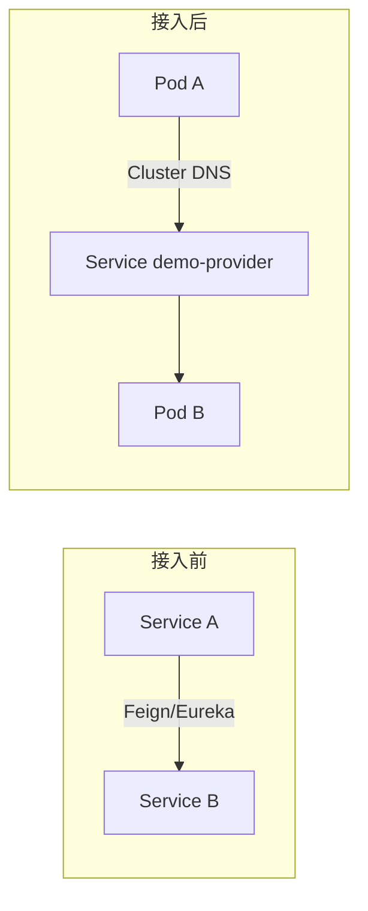

> **Kubernetes 系列 · 第 25/35 篇**  
> 上一篇：[《分布式存储方案——Longhorn 与 GlusterFS》](/云原生/k8s/k8s-24-storage-longhorn-glusterfs)  
> 下一篇：[《Jenkins + Ingress 自动化灰度发布流水线》](/云原生/k8s/k8s-26-jenkins-canary)

---

## 开头：Spring Cloud 上 K8s，镜像从哪来？

Istio 管的是网格内流量；业务首先要以 **镜像** 形式进集群。典型路径：**本地 Maven 打包 → Dockerfile 构建 → push 到 Harbor → K8s 从私服 pull → Deployment 拉起 Pod**。

本文聚焦 **Minikube + Harbor** 联调：启动参数、证书与 `insecure-registries`、镜像 build/tag/push 命令清单，以及 Spring Cloud 服务接入 K8s 后架构上「还需要不需要 Eureka」等常见问题。

---

## 一、接入 K8s 后架构变化（FAQ）

| 问题 | 简要回答 |
|------|----------|
| 还需要 Eureka 吗？ | **服务发现**可由 K8s Service + DNS 替代；若仍用 Nacos/Eureka 做配置中心，可保留，但 Pod IP 会变，需适配 |
| 服务间通信性能？ | Pod → Service VIP → kube-proxy/IPVS → 目标 Pod；比进程内 Feign 多一跳网络，一般毫秒级；Mesh 再多一层 Sidecar 本地转发 |
| 没接 K8s 前 | 服务直连 + 注册中心 |
| 接入 K8s 后 | 通过 **Service 名称**（如 `demo-provider:7700`）访问，DNS 解析到 ClusterIP |



---

## 二、Minikube 指定 Harbor 私有仓库

Harbor 假设已在宿主机部署（如 `192.168.56.121:85`，域名 `harbor.example.com`）。**若 Minikube 已创建过**，需先删再起，否则 registry 参数不生效：

```bash
minikube delete
```

### 2.1 启动 Minikube（带 insecure registry）

```bash
minikube start \
  --kubernetes-version=v1.23.1 \
  --driver=docker \
  --image-mirror-country=cn \
  --force \
  --insecure-registry=192.168.56.121:85
```

### 2.2 宿主机 Docker 信任 Harbor

编辑 `/etc/docker/daemon.json`：

```json
{
  "registry-mirrors": [
    "https://hub-mirror.c.163.com"
  ],
  "insecure-registries": ["192.168.56.121:85", "harbor.example.com:85"]
}
```

```bash
sudo systemctl daemon-reload
sudo systemctl restart docker
echo "192.168.56.121 harbor.example.com" | sudo tee -a /etc/hosts
```

### 2.3 验证 Harbor 连通

```bash
kubectl get pods -A

minikube ssh
curl http://192.168.56.121:85/v2/_catalog
exit
```


---

## 三、Minikube 内拉取私服镜像

Minikube 是独立 Docker/KVM 环境，**宿主机**能 pull 不代表 **Minikube 节点**能 pull，需同步证书或 insecure 配置。

### 3.1 方法一：复制证书目录

Harbor HTTPS 时，证书放在 Docker 约定路径：

```text
/etc/docker/certs.d/<registry-host>/
  ├── ca.crt
  ├── client.cert
  └── client.key
```

在宿主机：

```bash
minikube ip                    # 如 192.168.49.2
sudo passwd docker             # 若需 scp 到 minikube 的 docker 用户

# 从宿主机复制到 minikube
scp -r /etc/docker/certs.d docker@192.168.49.2:/etc/docker/
```

在 Minikube 内（`minikube ssh` → `sudo su`）：

```bash
cat <<EOF >> /etc/hosts
192.168.56.121  harbor.example.com
EOF

sudo systemctl restart docker
docker pull harbor.example.com/demo/nginx:latest
```

### 3.2 方法二：Minikube 内改 daemon.json

```bash
minikube ssh
sudo su

cat <<EOF > /etc/docker/daemon.json
{
  "insecure-registries": ["192.168.56.121:85", "harbor.example.com:85"]
}
EOF

cat <<EOF >> /etc/hosts
192.168.56.121  harbor.example.com
EOF

sudo systemctl daemon-reload
sudo systemctl restart docker
docker pull harbor.example.com/demo/demo-provider:v1.0.1
```

### 3.3 常见证书错误

```text
x509: certificate is valid for xxx, not harbor.example.com
```

说明证书 SAN 与访问域名不一致：重新签发含 SAN 的证书，或统一用 IP + insecure-registries，并保证 `/etc/hosts` 与 `docker login` 使用同一主机名。

---

## 四、Harbor 运维命令

```bash
cd /usr/local/harbor/harbor/
docker-compose stop      # 建议先 stop
docker-compose up -d     # 再启动
docker-compose restart   # 勿盲目 restart 导致数据不一致
```

Web UI：`https://harbor.example.com` → 项目 `demo` → 查看镜像列表。

---

## 五、Docker 构建镜像并推送 Harbor

以 Spring Boot 服务 `demo-provider` 为例，目录含 `demo-provider-1.0-SNAPSHOT.jar`、`Dockerfile`、`deploy-sit.sh`。

### 5.1 Dockerfile 示例

```dockerfile
FROM eclipse-temurin:8-jre-alpine
MAINTAINER demo-team

ADD demo-provider-1.0-SNAPSHOT.jar /app/JarApplication.jar
ADD deploy-sit.sh /app/run.sh
RUN chmod +x /app/run.sh

ENTRYPOINT ["/bin/sh", "-c", "/app/run.sh start"]
```

`deploy-sit.sh` 通常负责读取 `JVM_CONF`、启动 Java 进程。

### 5.2 docker build 常用选项

| 选项 | 说明 |
|------|------|
| `-t name:tag` | 镜像名与标签 |
| `-f Dockerfile` | 指定 Dockerfile 路径 |
| `--no-cache` | 不使用缓存 |
| `--build-arg` | 构建变量 |
| `.` | 构建上下文目录 |

### 5.3 完整命令清单（构建 → 推送 → 验证）

在**宿主机**项目目录执行：

```bash
cd /path/to/demo-application/

# 1. 清理旧镜像（可选）
docker rmi harbor.example.com/demo/demo-provider:v1.0.1 2>/dev/null
docker rmi demo-provider:v1.0.1 2>/dev/null

# 2. 构建
docker build -t demo-provider:v1.0.1 .

# 3. 登录 Harbor
docker login harbor.example.com
# 输入 admin / 密码

# 4. 打 tag（仓库路径 = Harbor 项目名/镜像名:标签）
docker tag demo-provider:v1.0.1 harbor.example.com/demo/demo-provider:v1.0.1

# 5. 推送
docker push harbor.example.com/demo/demo-provider:v1.0.1

# 6. 宿主机验证 pull
docker pull harbor.example.com/demo/demo-provider:v1.0.1

# 7. Minikube 内验证 pull
minikube ssh -- docker pull harbor.example.com/demo/demo-provider:v1.0.1
```


### 5.4 docker tag / push 语法

```bash
docker tag SOURCE_IMAGE[:TAG] TARGET_IMAGE[:TAG]
docker push [OPTIONS] NAME[:TAG]
```

Harbor 路径规则：`registry域名/项目名/仓库名:标签`，例如 `harbor.example.com/demo/demo-provider:v1.0.1`。

---

## 六、Minikube 辅助插件（可选）

```bash
minikube addons enable dashboard
minikube addons enable metrics-server
minikube dashboard   # 本地代理 Web UI
```

Dashboard 适合查看 Namespace、Pod、事件；生产集群需 RBAC 与访问控制。

---

## 七、K8s 部署 Spring Cloud 服务（预览）

镜像进 Harbor 后，Deployment 需指定：

```yaml
spec:
  containers:
    - name: demo-provider
      image: harbor.example.com/demo/demo-provider:v1.0.1
      imagePullPolicy: IfNotPresent
      ports:
        - containerPort: 7700
      env:
        - name: NACOS_SERVER
          value: "192.168.56.121:8848"
        - name: JVM_CONF
          value: "-server -Xms64m -Xmx256m"
  imagePullSecrets:
    - name: harbor-secret
```

`imagePullSecrets`、ConfigMap、hostAliases、hostPath 及 **ImagePullBackOff / CrashLoopBackOff** 排障在下一篇展开。

### 7.1 docker-compose 与 K8s 资源对照

| docker-compose | Kubernetes |
|----------------|------------|
| `services.xxx` | Deployment + Service |
| `environment` | `env` / ConfigMap |
| `volumes` | `volumeMounts` + PV/PVC 或 hostPath |
| `extra_hosts` | `hostAliases` |
| `networks` | Service + Cluster DNS |

---

## 八、OpenResty 基础镜像（扩展）

短平快 Lua 接口可用 OpenResty 作基础镜像：

```dockerfile
FROM openresty/openresty:1.19.9.1-alpine
ADD ./LuaDemoProject/ /app/LuaDemoProject/
ADD deploy-sit.sh /app/run.sh
RUN chmod +x /app/run.sh
ENTRYPOINT ["/bin/sh", "-c", "/app/run.sh"]
```

构建推送流程与 Java 服务相同：`docker build` → `docker tag` → `docker push`。

---

## 小结

- Minikube 启动时用 **`--insecure-registry`** 或在节点内配置 **certs.d / daemon.json**，否则 kubelet 拉私服镜像会失败。
- 标准流水线：**build → login → tag → push → minikube ssh pull 验证**。
- Spring Cloud 上 K8s 后，进程间调用改为 **Service DNS**；注册中心是否保留取决于是否仍依赖其配置能力。

> ➡️ 下一篇：[《Service 四层流量分发——iptables、IPVS 与四类 Port》](/云原生/k8s/k8s-09-service-l4)
