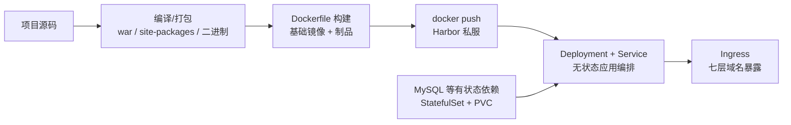

> **Kubernetes 系列 · 第 28/35 篇**  
> 上一篇：[《发布进阶——Argo Rollouts 金丝雀与 OpenKruise 原地升级》](/云原生/k8s/k8s-27-advanced-rollout)  
> 下一篇：[《网络进阶——Cilium、Hybridnet、双栈与 Traefik》](/云原生/k8s/k8s-29-advanced-network)

---

## 开头：概念都学完了，真实项目怎么落上去？

前面二十八篇把 Pod、Deployment、Service、Ingress、存储、认证这些「积木」都讲完了。但一个真实业务项目从一份源码到「用户能在浏览器里访问」，中间还有一条完整的流水线要打通：

**源码 → 编译制品 → Dockerfile 构建镜像 → push 到 Harbor → K8s 从私服拉取 → Deployment/Service 编排 → Ingress 暴露**。

本文用三个语言各不相同的真实项目（Java/Spring、Python/Django、Golang/Gin）走一遍这条路径——你会发现 Dockerfile 是三者差异最大的地方（JDK 运行时 vs 解释器 vs 静态编译二进制），而编排层几乎一模一样。最后再看一个有状态中间件 RocketMQ 怎么上云：NameServer、Broker、Console 各用什么控制器、怎么扩缩容。

---

## 一、上云通用路径

### 1.1 三种语言，一条流水线

不管什么语言，上云的步骤都可以抽象成同一张流程图：



| 阶段 | 产物 | 关键动作 |
|------|------|----------|
| 1. 编译 | war 包 / 依赖清单 / 静态二进制 | Maven、pip、go build |
| 2. 镜像 | 基础镜像 + 项目镜像 | Dockerfile 分层：基础镜像只做一次，项目镜像复用它 |
| 3. 仓库 | Harbor 私服里的 tag | docker login / tag / push |
| 4. 编排 | Deployment + Service | 副本数、资源限额、探针、imagePullSecrets |
| 5. 暴露 | Ingress 规则 | 域名 → Service → Pod |
| 6. 依赖 | StatefulSet + PVC | MySQL 等有状态服务，headless service 提供稳定 DNS |

而这条流水线跑起来之前，集群侧有一批**公共依赖**必须先就位。

### 1.2 公共依赖总览

课程环境在 K8s 集群之外准备了四台「公共服务」主机：


| 序号 | 提供服务 | IP地址         | 域名               | 备注            |
| ---- | -------- | -------------- | ------------------ | --------------- |
| 1    | DNS      | 192.168.10.211 |                    | bind9，内网域名解析 |
| 2    | Nginx    | 192.168.10.212 | yaml.kubemsb.com   | 资源清单文件托管 |
| 3    | Harbor   | 192.168.10.213 | harbor.kubemsb.com | www.kubemsb.com |
| 4    | NFS      | 192.168.10.214 | nfs.kubemsb.com    | 持久存储后端     |

- **DNS（bind9）**：为 Nginx、Harbor、NFS 提供统一域名，集群节点不用各自改 hosts。区域文件核心内容：

~~~powershell
[root@dns named]# cat kubemsb.com.zone
$TTL 1D
@       IN SOA  kubemsb.com admin.kubemsb.com. (
                                        0       ; serial
                                        1D      ; refresh
                                        1H      ; retry
                                        1W      ; expire
                                        3H )    ; minimum
@       NS      ns.kubemsb.com.
ns      A       192.168.10.211
yaml    A       192.168.10.212
harbor  A       192.168.10.213
nfs	    A		192.168.10.214
~~~

- **Nginx（YAML 托管）**：编译了 fancyindex 模块的 Nginx，把所有资源清单文件以目录列表形式挂在 `http://yaml.kubemsb.com/` 下，`kubectl apply -f http://yaml.kubemsb.com/xxx.yaml` 即可部署，清单有了「版本化的托管处」。
- **NFS + StorageClass**：提供持久存储动态供给，MySQL、RocketMQ 这类有状态服务的 PVC 都靠它自动创建 PV：

~~~powershell
[root@master01 ~]# kubectl get storageclass
NAME         PROVISIONER                                   RECLAIMPOLICY   VOLUMEBINDINGMODE   ALLOWVOLUMEEXPANSION   AGE
nfs-client   k8s-sigs.io/nfs-subdir-external-provisioner   Delete          Immediate           false                  10s
~~~

存储原理与 PV/PVC 细节见[《存储管理——PV、PVC 与 StorageClass》](/云原生/k8s/k8s-11-pv-pvc)。

### 1.3 Harbor 接入：节点信任 + 拉取认证

Harbor 本身的部署（docker-compose 离线安装、HTTPS 证书、UI 使用）在[《Harbor + K8s 手动部署 SpringCloud》](/云原生/k8s/k8s-25-harbor-springcloud)已详讲，这里只保留集群侧接入的两个动作。

**第一步：所有 K8s 节点信任 Harbor 私服**（HTTP 或自签证书场景）：

~~~powershell
[root@k8s-* ~]# vim /etc/docker/daemon.json
[root@k8s-* ~]# cat /etc/docker/daemon.json
{
        "insecure-registries": ["http://www.kubemsb.com"]
}

[root@k8s-* ~]# systemctl restart docker

[root@k8s-* ~]# docker login www.kubemsb.com
Username: admin
Password: 12345
WARNING! Your password will be stored unencrypted in /root/.docker/config.json.
Configure a credential helper to remove the warning. See
https://docs.docker.com/engine/reference/commandline/login/#credentials-store

Login Succeeded
~~~

**第二步：在 K8s 里创建 docker-registry 类型的 Secret**，让 Pod 能以账号拉取私有镜像：

~~~powershell
[root@k8s-master1 ~]# kubectl create secret docker-registry harbor-secret \
  --docker-server=www.kubemsb.com \
  --docker-username=admin \
  --docker-password=12345

[root@k8s-master1 ~]# kubectl get secret |grep harbor-secret
harbor-secret                        kubernetes.io/dockerconfigjson        1      19s
~~~

之后在 Deployment 里引用：

```yaml
spec:
  imagePullSecrets:
  - name: harbor-secret
```

> 💡 嫌每个 Deployment 都写 `imagePullSecrets` 麻烦？把 Secret patch 到 ServiceAccount 上，Pod 指定 `serviceAccount: harbor-sa` 即可；不同 namespace 还可以用不同的 ServiceAccount 对应不同的 Harbor 账号权限。Secret 细节见[《Secret、ConfigMap 与部署排障》](/云原生/k8s/k8s-12-secret-configmap)。

### 1.4 部署前规划：有状态 vs 无状态

每个项目上云前先做一次角色划分，这一步决定了用哪套清单模板：

| 组件 | 控制器 | Service 类型 | 存储 | 示例 |
|------|--------|--------------|------|------|
| Web 应用（无状态） | Deployment | ClusterIP | 通常不需要 | Tomcat / Django / Gin |
| 数据库（有状态） | StatefulSet | Headless（ClusterIP: None） | PVC 动态供给 | MySQL |
| 运维控制台（无状态） | Deployment | ClusterIP + Ingress | 不需要 | rocketmq-dashboard |

StatefulSet 与 Headless Service 的原理见[《有状态负载——DaemonSet、StatefulSet 与 Job》](/云原生/k8s/k8s-07-daemon-stateful-job)。Headless Service 给每个 Pod 一个稳定 DNS（`<pod>.<svc>.<ns>`），应用连数据库就写这个地址，Pod 重建 IP 变了也不受影响。

---

## 二、Java 项目上云（war 包 + Tomcat）

> Spring Cloud 微服务全家桶（Eureka 取舍、多模块构建、服务间调用）在[第 15 篇](/云原生/k8s/k8s-25-harbor-springcloud)已完整实战过。本节聚焦**单个 Java Web 服务的上云要点**：基础镜像定制、编译打包、镜像分层、配套 MySQL。

### 2.1 基础镜像定制

Java 项目以 war 包发布，需要 Tomcat 做运行时。可以直接 `docker pull tomcat`，也可以定制——把 JDK、Tomcat 固化成**基础镜像**，后续每个项目镜像只叠一层 war 包：

~~~powershell
[root@harborserver tomcatdockerfile]# cat Dockerfile
FROM centos:centos7
MAINTAINER "admin<admin@kubemsb.com>"

ENV VERSION=8.5.81
ENV JAVA_HOME=/usr/local/jdk

RUN yum -y install wget

RUN wget https://dlcdn.apache.org/tomcat/tomcat-8/v${VERSION}/bin/apache-tomcat-${VERSION}.tar.gz --no-check-certificate

RUN tar xf apache-tomcat-${VERSION}.tar.gz

RUN mv apache-tomcat-${VERSION} /usr/local/tomcat

RUN rm -rf apache-tomcat-${VERSION}.tar.gz /usr/local/tomcat/webapps/*

RUN mkdir /usr/local/tomcat/webapps/ROOT

ADD ./jdk /usr/local/jdk

RUN echo "export TOMCAT_HOME=/usr/local/tomcat" >> /etc/profile

RUN echo "export JAVA_HOME=/usr/local/jdk" >> /etc/profile

RUN echo "export PATH=$TOMCAT_HOME/bin:$JAVA_HOME/bin:$PATH" >> /etc/profile

RUN echo "export CLASSPATH=.:$JAVA_HOME/lib/dt.jar:$JAVA_HOME/lib/tools.jar" >> /etc/profile

RUN source /etc/profile

EXPOSE 8080

CMD ["/usr/local/tomcat/bin/catalina.sh","run"]
~~~

~~~powershell
构建并推送基础镜像到 Harbor 的 java-project 项目
[root@harborserver tomcatdockerfile]# docker build -t www.kubemsb.com/java-project/tomcat:8581 .
......
Successfully built db4db20a6c85
Successfully tagged www.kubemsb.com/java-project/tomcat:8581

[root@harborserver ~]# docker push www.kubemsb.com/java-project/tomcat:8581
~~~


> 💡 分两层的好处：JDK + Tomcat 这 800 多 MB 只构建一次；项目迭代时只重打 war 包那一层，构建和推送都秒级。

### 2.2 编译打包与项目镜像

编译机准备官方 JDK 与 Maven（`JAVA_HOME`、`MAVEN_HOME` 加入 PATH），然后先改数据库连接地址——指向集群内 MySQL 的 Headless DNS：

~~~powershell
[root@harbor java-project]# cat src/main/resources/application.yml
server:
  port: 8080
spring:
  datasource:
    url: jdbc:mysql://db-0.mysql.javaproject:3306/test?characterEncoding=utf-8
    username: root
    password: 123456
    driver-class-name: com.mysql.jdbc.Driver
  freemarker:
    ......
~~~

~~~powershell
[root@harbor java-project]# mvn clean package
......
[INFO] Building war: /root/javaproject/project-source/pro-source/java-project/target/kubemsb-tomcat-0.0.1-Test.war
[INFO] ------------------------------------------------------------------------
[INFO] BUILD SUCCESS
[INFO] ------------------------------------------------------------------------
~~~

项目镜像的 Dockerfile 只有 4 行——这就是基础镜像分层带来的效果：

~~~powershell
[root@harbor java-project]# cat Dockerfile
FROM www.kubemsb.com/java-project/tomcat:8581
LABEL maintainer "admin <admin@kubemsb.com>"
RUN rm -rf /usr/local/tomcat/webapps/*
ADD target/*.war /usr/local/tomcat/webapps/ROOT.war
~~~

~~~powershell
[root@harbor java-project]# docker build -t www.kubemsb.com/java-project/java-project:v1 .
[root@harbor java-project]# docker push www.kubemsb.com/java-project/java-project:v1
~~~

### 2.3 配套 MySQL：StatefulSet + 动态供给

~~~powershell
# cat 05_mysql.yaml
apiVersion: v1
kind: Service
metadata:
  name: mysql
  namespace: javaproject
spec:
  ports:
  - port: 3306
    name: mysql
  clusterIP: None
  selector:
    app: mysql-public

---

apiVersion: apps/v1
kind: StatefulSet
metadata:
  name: db
  namespace: javaproject
spec:
  selector:
    matchLabels:
      app: mysql-public
  serviceName: "mysql"
  template:
    metadata:
      labels:
        app: mysql-public
    spec:
      containers:
      - name: mysql
        image: mysql:5.7
        env:
        - name: MYSQL_ROOT_PASSWORD
          value: "123456"
        - name: MYSQL_DATABASE
          value: test
        ports:
        - containerPort: 3306
        volumeMounts:
        - mountPath: "/var/lib/mysql"
          name: mysql-data
  volumeClaimTemplates:
  - metadata:
      name: mysql-data
    spec:
      accessModes: ["ReadWriteMany"]
      storageClassName: "nfs-client"
      resources:
        requests:
          storage: 5Gi
~~~

~~~powershell
# kubectl apply -f http://yaml.kubemsb.com/03_java_project/01_ns.yaml
# kubectl apply -f http://yaml.kubemsb.com/03_java_project/05_mysql.yaml

[root@master01 ~]# kubectl get all -n javaproject
NAME       READY   STATUS    RESTARTS   AGE
pod/db-0   1/1     Running   0          19s

NAME            TYPE        CLUSTER-IP   EXTERNAL-IP   PORT(S)    AGE
service/mysql   ClusterIP   None         <none>        3306/TCP   19s

NAME                  READY   AGE
statefulset.apps/db   1/1     19s
~~~

NFS 侧可以看到 provisioner 自动创建的 PV 目录。导入数据库用 `kubectl cp` + `mysql source`：

~~~powershell
[root@master01 ~]# kubectl cp test.sql db-0:/ -n javaproject
[root@master01 ~]# kubectl exec -it db-0 -n javaproject -- bash
root@db-0:/# mysql -uroot -p123456
mysql> use test;
mysql> source /test.sql;
Query OK, 0 rows affected (0.00 sec)
......
~~~

### 2.4 部署与暴露

Deployment（含资源限额、存活/就绪探针、镜像拉取认证）：

~~~powershell
# cat 02_deployment.yaml
apiVersion: apps/v1
kind: Deployment
metadata:
  name: java-project
  namespace: javaproject
spec:
  replicas: 2
  selector:
    matchLabels:
      project: www
      app: java-demo
  template:
    metadata:
      labels:
        project: www
        app: java-demo
    spec:
      imagePullSecrets:
      - name: harborreg #认证信息
      containers:
      - name: tomcat
        image: www.kubemsb.com/java-project/java-project:v1 #镜像
        imagePullPolicy: Always
        ports:
        - containerPort: 8080
          name: web
          protocol: TCP
        resources:
          requests:
            cpu: 0.5
            memory: 1Gi
          limits:
            cpu: 1
            memory: 2Gi
        livenessProbe:
          httpGet:
            path: /
            port: 8080
          initialDelaySeconds: 60
          timeoutSeconds: 20
        readinessProbe:
          httpGet:
            path: /
            port: 8080
          initialDelaySeconds: 60
          timeoutSeconds: 20
~~~

Service 与 Ingress：

~~~powershell
# cat 03_service.yaml
apiVersion: v1
kind: Service
metadata:
  name: java-project
  namespace: javaproject
spec:
  selector:
    project: www
    app: java-demo
  ports:
  - name: web
    port: 80
    targetPort: 8080
~~~

~~~powershell
# cat 04_ingress.yaml
apiVersion: networking.k8s.io/v1
kind: Ingress
metadata:
  name: java-project
  namespace: javaproject
  annotations:
    ingressclass.kubernetes.io/is-default-class: "true"
    kubernetes.io/ingress.class: nginx
spec:
  rules:
    - host: javaweb.kubemsb.com
      http:
        paths:
        - pathType: Prefix
          path: /
          backend:
            service:
              name: java-project
              port:
                number: 80
~~~

~~~powershell
# kubectl apply -f http://yaml.kubemsb.com/03_java_project/02_deployment.yaml
# kubectl apply -f http://yaml.kubemsb.com/03_java_project/03_service.yaml
# kubectl apply -f http://yaml.kubemsb.com/03_java_project/04_ingress.yaml

[root@master01 ~]# kubectl get pods -n javaproject
NAME                            READY   STATUS    RESTARTS   AGE
db-0                            1/1     Running   0          38m
java-project-6f74d5b85c-ckq42   0/1     Running   0          43s
java-project-6f74d5b85c-dvvcl   0/1     Running   0          43s

[root@master01 ~]# kubectl get ingress -n javaproject
NAME           CLASS    HOSTS                 ADDRESS         PORTS   AGE
java-project   <none>   javaweb.kubemsb.com   192.168.10.13   80      73s
~~~

> ⚠️ Pod 起来后 `READY 0/1` 是正常现象：`initialDelaySeconds: 60` 加上 Spring 应用启动本身就需要时间，等就绪探针通过后会变 `1/1`。Ingress 语法与控制器部署见[《七层路由——Ingress》](/云原生/k8s/k8s-13-ingress-l7)。

物理机浏览器访问 `javaweb.kubemsb.com`（DNS 指向 ingress-nginx 的 LoadBalancer IP）：


---

## 三、Python 项目上云（Django + 解释器镜像）

### 3.1 项目结构

本次部署一个 Django 编写的 CMDB 系统：

~~~powershell
[root@localhost cmdb]# ls
db  pipsource  requirement  syscmdb

db用于存储项目数据库
pipsource用于存储pip源
requirement用于存储python项目依赖资源
syscmdb用于存储项目源代码
~~~

`requirement.txt` 锁定全部依赖版本（Django==1.11.18、PyMySQL==0.9.3 等）；`pipsource/.pip` 是国内 pip 源配置，直接打进镜像可以加速依赖安装。

### 3.2 基础镜像：把依赖「焊死」进去

Python 与 Java 的关键差异在这里：**依赖不是编译期产物，而是运行环境的一部分**，所以把「CentOS + Python3 + 全部 pip 依赖」整体做成基础镜像：

~~~powershell
[root@harborserver pythonprojectbaseimage]# cat Dockerfile
FROM centos:centos7
MAINTAINER "admin<admin@kubemsb.com>"

WORKDIR /

ADD pipsource/.pip /root

ADD requirement/* /

RUN yum -y install python36 gcc gcc-c++ python3-devel

RUN pip3 install -r /requirement.txt
~~~

~~~powershell
[root@harborserver pythonprojectbaseimage]# docker build -t www.kubemsb.com/library/pythonprojectbaseimage:v1 .
[root@harborserver pythonprojectbaseimage]# docker push www.kubemsb.com/library/pythonprojectbaseimage:v1
~~~

> 💡 `gcc gcc-c++ python3-devel` 不能省：bcrypt、cryptography 等依赖是 C 扩展，pip 安装时要在镜像内现场编译。

### 3.3 数据库部署与数据导入

与 Java 章节同一套模板，只是换了 namespace（`cmdb`）和数据库名（`syscmdb`）：

~~~powershell
# cat 02_mysql.yaml
apiVersion: v1
kind: Service
metadata:
  name: cmdbmysql
  namespace: cmdb
spec:
  ports:
  - port: 3306
    name: mysql
  clusterIP: None
  selector:
    app: mysqlcmdb

---

apiVersion: apps/v1
kind: StatefulSet
metadata:
  name: cmdbdb
  namespace: cmdb
spec:
  selector:
    matchLabels:
      app: mysqlcmdb
  serviceName: "cmdbmysql"
  template:
    metadata:
      labels:
        app: mysqlcmdb
    spec:
      containers:
      - name: mysql
        image: mysql:5.7
        env:
        - name: MYSQL_ROOT_PASSWORD
          value: "123456"
        - name: MYSQL_DATABASE
          value: syscmdb
        ports:
        - containerPort: 3306
        volumeMounts:
        - mountPath: "/var/lib/mysql"
          name: mysql-cmdb
  volumeClaimTemplates:
  - metadata:
      name: mysql-cmdb
    spec:
      accessModes: ["ReadWriteMany"]
      storageClassName: "nfs-client"
      resources:
        requests:
          storage: 1Gi
~~~

修改 Django 的数据库连接，指向 Headless DNS：

~~~powershell
[root@harborserver pythonprojectimage]# vim syscmdb/syscmdb/settings.py
......
84 DATABASES = {
 85     'default': {
 86         'ENGINE': 'django.db.backends.mysql',
 87         'NAME': 'syscmdb',
 88         'USER': 'root',
 89         'PASSWORD': '123456',
 90         'HOST': 'cmdbdb-0.cmdbmysql.cmdb',
 91         'PORT': '3306',
 92     }
 93 }
......
~~~

导入数据可以用管道一行完成：

~~~powershell
[root@master1 ~]# kubectl exec cmdbdb-0 -n cmdb -it -- mysql -uroot -p123456 syscmdb < cmdbdb.sql

[root@master1 ~]# kubectl exec -it cmdbdb-0 sh -n cmdb
# mysql -uroot -p123456
mysql> use syscmdb;
mysql> show tables;
+----------------------------+
| Tables_in_syscmdb          |
+----------------------------+
| auth_group                 |
| auth_group_permissions     |
| auth_permission            |
| auth_user                  |
| auth_user_groups           |
| auth_user_user_permissions |
| django_admin_log           |
| django_content_type        |
| django_migrations          |
| django_session            |
| products_product           |
| resources_disk             |
| resources_idc             |
| resources_network          |
| resources_server           |
| resources_serverauto       |
| resources_serveruser       |
| users_profile              |
+----------------------------+
18 rows in set (0.00 sec)
~~~

### 3.4 项目镜像与部署

项目镜像同样只有几行——「源码 + 启动命令」叠在基础镜像上：

~~~powershell
[root@harborserver pythonprojectimage]# cat Dockerfile
FROM www.kubemsb.com/python-project/pythonprojectbaseimage:v1

MAINTAINER "admin<admin@kubemsb.com>"

ADD . /

WORKDIR /syscmdb

EXPOSE 8000

CMD ["python3","manage.py","runserver","0.0.0.0:8000"]
~~~

~~~powershell
[root@harborserver pythonprojectimage]# docker build -t www.kubemsb.com/python-project/pythonprojectimage:v1 .
[root@harborserver pythonprojectimage]# docker push www.kubemsb.com/python-project/pythonprojectimage:v1
~~~

部署清单与 Java 端完全同构（deployment 端口 8000、service 80→8000、ingress host `cmdb.kubemsb.com`）：

~~~powershell
# cat 04_deployment.yaml
apiVersion: apps/v1
kind: Deployment
metadata:
  name: pythoncmdb
  namespace: cmdb
spec:
  replicas: 2
  selector:
    matchLabels:
      project: pythoncmdb
      app: cmdb-demo
  template:
    metadata:
      labels:
        project: pythoncmdb
        app: cmdb-demo
    spec:
      imagePullSecrets:
      - name: harborreg #认证信息
      containers:
      - name: cmdb
        image: www.kubemsb.com/library/pythonprojectimage:v1 #镜像
        imagePullPolicy: Always
        ports:
        - containerPort: 8000
          name: web
          protocol: TCP
        resources:
          requests:
            cpu: 0.5
            memory: 1Gi
          limits:
            cpu: 1
            memory: 2Gi
        livenessProbe:
          httpGet:
            path: /
            port: 8000
          initialDelaySeconds: 60
          timeoutSeconds: 20
        readinessProbe:
          httpGet:
            path: /
            port: 8000
          initialDelaySeconds: 60
          timeoutSeconds: 20
~~~

~~~powershell
# cat 05_service.yaml
apiVersion: v1
kind: Service
metadata:
  name: pythoncmdbsvc
  namespace: cmdb
spec:
  selector:
    project: pythoncmdb
    app: cmdb-demo
  ports:
  - name: web
    port: 80
    targetPort: 8000
# 由于使用ingress暴露，所以不使用NodePort
~~~

~~~powershell
# cat 06_ingress.yaml
apiVersion: networking.k8s.io/v1
kind: Ingress
metadata:
  name: pythoncmdbingress
  namespace: cmdb
  annotations:
    ingressclass.kubernetes.io/is-default-class: "true"
    kubernetes.io/ingress.class: nginx
spec:
  rules:
    - host: cmdb.kubemsb.com
      http:
        paths:
        - pathType: Prefix
          path: /
          backend:
            service:
              name: pythoncmdbsvc
              port:
                number: 80
~~~

~~~powershell
[root@master01 ~]# kubectl apply -f http://yaml.kubemsb.com/04_python_project/04_deployment.yaml
deployment.apps/pythoncmdb created
[root@master01 ~]# kubectl apply -f http://yaml.kubemsb.com/04_python_project/05_service.yaml
service/pythoncmdbsvc created
[root@master01 ~]# kubectl apply -f http://yaml.kubemsb.com/04_python_project/06_ingress.yaml
ingress.networking.k8s.io/pythoncmdbingress created
~~~

验证：

~~~powershell
[root@master01 ~]# kubectl get pods -n cmdb
NAME                          READY   STATUS    RESTARTS   AGE
cmdbdb-0                      1/1     Running   0          27m
pythoncmdb-56d4d84fd4-l927b   1/1     Running   0          116s
pythoncmdb-56d4d84fd4-xb6kk   1/1     Running   0          116s

[root@master01 ~]# kubectl get ingress -n cmdb
NAME                CLASS    HOSTS              ADDRESS         PORTS   AGE
pythoncmdbingress   <none>   cmdb.kubemsb.com   192.168.10.13   80      87s
~~~

浏览器访问 `cmdb.kubemsb.com`：


---

## 四、Golang 项目上云（Gin IM 系统 + 静态二进制）

### 4.1 项目情况

本次上线的是基于 Golang 开发的 IM 系统（Gin + Gorm），提供聊天及群聊功能。除 MySQL 外还依赖 Redis。

~~~powershell
[root@harbor ginchat-v1.0]# ls
asset  config  docs  go.mod  go.sum  index.html  main.go  models  router  service  test  utils  views

前端：index.html、views、asset
go源码：go.mod、go.sum、main.go等
配置目录：config/app.yaml（注意修改mysql数据库地址及redis连接地址）
~~~

### 4.2 依赖服务部署

MySQL 仍是同一套 StatefulSet 模板（namespace `ginchat`，数据库 `ginchat`），导数据同样一行：

~~~powershell
# kubectl apply -f http://yaml.kubemsb.com/05_go_project/02_mysql.yaml

# kubectl get pods -n ginchat
NAME                       READY   STATUS    RESTARTS   AGE
ginchatdb-0                1/1     Running   0          9m

# kubectl exec -it ginchatdb-0 -n ginchat -- mysql -uroot -p123456 ginchat < init_ginchat.sql
~~~

Redis 本例用容器单实例跑在集群外主机上（生产建议也进集群或用托管服务）：

~~~powershell
# mkdir -p /opt/redis/conf
# touch /opt/redis/conf/redis.conf
# docker run -p 6379:6379 --name ginchatredis -v /opt/redis/data:/data -v /opt/redis/conf:/etc/redis -d redis redis-server /etc/redis/redis.conf
~~~

### 4.3 源码编译：制品是一个自包含的二进制

装好 Go 环境后编译：

~~~powershell
# wget https://storage.googleapis.com/golang/getgo/installer_linux
# chmod +x installer_linux
# ./installer_linux
# source /root/.bash_profile

# go version
go version go1.18.3 linux/amd64
~~~

~~~powershell
[root@harbor ginchat-v1.0]# go get && go build -o bin/ginchatd

[root@harbor ginchat-v1.0]# ls bin
ginchatd
~~~

修改配置文件里的数据库地址（用完整 FQDN）和 Redis 地址：

~~~powershell
[root@harbor ~]# vim ginchat-v1.0/config/app.yml

mysql:
  dns: root:123456@tcp(ginchatdb-0.ginchatmysql.ginchat.svc.cluster.local:3306)/ginchat?charset=utf8mb4&parseTime=True&loc=Local
redis:
  addr: "192.168.10.213:6379"
  password: ""
  DB: 0
  poolSize: 30
  minIdleConn: 30
......
~~~

把制品与前端文件打包：

~~~powershell
[root@harbor ~]# ls ginchat-v1.0/
asset  config  ginchatd  index.html  views

[root@harbor ~]# tar cvzf ginchat.tgz ginchat-v1.0
~~~

### 4.4 项目镜像：最小的 Dockerfile

注意对比——Go 静态编译后**镜像里不需要任何语言运行时**，一个 CentOS 基础镜像 + 一个二进制就够：

~~~powershell
[root@harbor goginchatproject]# cat Dockerfile
FROM centos:centos7

ADD ./ginchat.tgz /

WORKDIR /ginchat-v1.0

RUN chmod +x /ginchat-v1.0/ginchatd

EXPOSE  8081

CMD /ginchat-v1.0/ginchatd
~~~

~~~powershell
[root@harbor goginchatproject]# docker build -t www.kubemsb.com/library/ginchat:v1 .
[root@harbor goginchatproject]# docker push www.kubemsb.com/library/ginchat:v1
~~~

### 4.5 三种语言 Dockerfile 差异对比

| 维度 | Java（war） | Python（Django） | Golang（Gin） |
|------|-------------|------------------|---------------|
| 制品形态 | war 包，需 JVM + Tomcat 运行 | 源码目录，需解释器 + 全部依赖 | 单个静态二进制 |
| 基础镜像 | centos7 + JDK + Tomcat（约 817MB） | centos7 + python36 + pip 依赖 | centos7（甚至可用 scratch/静态发行版） |
| 依赖处理 | 编译期打进 war | `pip3 install -r requirement.txt` 进基础镜像 | 编译期静态链接进二进制 |
| 启动命令 | `catalina.sh run` | `python3 manage.py runserver 0.0.0.0:8000` | `./ginchatd` |
| 端口 | 8080 | 8000 | 8081 |
| 镜像迭代成本 | 只换 war 层 | 只换源码层 | 只换二进制层 |

### 4.6 部署与访问

清单与前面两个项目完全同构，仅换名称、namespace、端口：

~~~powershell
# cat 04_deployment.yaml
apiVersion: apps/v1
kind: Deployment
metadata:
  name: ginchat
  namespace: ginchat
spec:
  replicas: 1
  selector:
    matchLabels:
      project: ginchat
      app: ginchat-demo
  template:
    metadata:
      labels:
        project: ginchat
        app: ginchat-demo
    spec:
      imagePullSecrets:
      - name: harborreg #认证信息
      containers:
      - name: ginchat
        image: www.kubemsb.com/library/ginchat:v2 #镜像
        imagePullPolicy: Always
        ports:
        - containerPort: 8081
          name: web
          protocol: TCP
        resources:
          requests:
            cpu: 0.5
            memory: 1Gi
          limits:
            cpu: 1
            memory: 2Gi
        livenessProbe:
          httpGet:
            path: /
            port: 8081
          initialDelaySeconds: 30
          timeoutSeconds: 20
        readinessProbe:
          httpGet:
            path: /
            port: 8081
          initialDelaySeconds: 30
          timeoutSeconds: 20
~~~

~~~powershell
# cat 05_service.yaml
apiVersion: v1
kind: Service
metadata:
  name: ginchatsvc
  namespace: ginchat
spec:
  selector:
    project: ginchat
    app: ginchat-demo
  ports:
  - name: web
    port: 80
    targetPort: 8081
~~~

~~~powershell
# cat 06_ingress.yaml
apiVersion: networking.k8s.io/v1
kind: Ingress
metadata:
  name: ginchatingress
  namespace: ginchat
  annotations:
    ingressclass.kubernetes.io/is-default-class: "true"
    kubernetes.io/ingress.class: nginx
spec:
  rules:
    - host: ginchat.kubemsb.com
      http:
        paths:
        - pathType: Prefix
          path: /
          backend:
            service:
              name: ginchatsvc
              port:
                number: 80
~~~

~~~powershell
[root@master01 ~]# kubectl apply -f  http://yaml.kubemsb.com/05_go_project/04_deployment.yaml
[root@master01 ~]# kubectl apply -f http://yaml.kubemsb.com/05_go_project/05_service.yaml
[root@master01 ~]# kubectl apply -f http://yaml.kubemsb.com/05_go_project/06_ingress.yaml

[root@master01 ~]# kubectl get pods -n ginchat
NAME                       READY   STATUS    RESTARTS   AGE
ginchat-5558d849c5-cq9qq   1/1     Running   0          15m
ginchatdb-0                1/1     Running   0          10m
~~~

浏览器访问 `ginchat.kubemsb.com`：


---

## 五、中间件上云：RocketMQ

业务项目之外，消息中间件这类**有状态服务**上云的思路又不同：NameServer 无状态可多副本、Broker 有配置文件要「一号一档」、Console 是普通无状态应用——三种角色三种打法。

### 5.1 RocketMQ 角色与集群模式

RocketMQ 由 Producer、Consumer、Broker、NameServer 四部分构成，**启动顺序：NameServer → Broker**。NameServer 类似注册中心（早期用 ZooKeeper，后来自研，代码量很小）；Broker 负责消息存储与转发。


| 集群模式 | 优点 | 缺点 |
|----------|------|------|
| 单 Master | 配置简单 | Broker 宕机整个服务不可用，不建议线上用 |
| 多 Master | 性能最高，单台宕机不影响应用 | 宕机期间未消费消息不可订阅 |
| 多 Master 多 Slave（异步复制） | Master 宕机可从 Slave 消费，性能几乎无损 | 主备有毫秒级延迟，磁盘损坏丢少量消息 |
| 多 Master 多 Slave（同步双写） | 数据与服务都无单点，消息无延迟 | 性能低约 10%，备机暂不能自动切换为主 |

> Topic 与 Message Queue：一个 Topic 可按需设置多个 Message Queue（类似分区），消息并行发送到各 Queue，消费者并行读取，用横向并行解决单 Topic 大流量问题。

### 5.2 K8s 部署方案

官方 rocketmq-operator 不便灵活调整副本数——每个 Broker 副本对应唯一且有差异的配置文件，副本一变配置就对不上了。本方案改为：**只用一个 Broker 配置模板，多个 Broker 实例自动基于模板生成各自配置**，扩缩容只需改副本数，无需关心配置文件（不适用于带 Slave 的部署方式）。

前置环境：StorageClass 动态供给（见第一节）、MetalLB（给 ingress-nginx 提供 LoadBalancer IP）、ingress-nginx controller。

### 5.3 构建镜像：一个镜像两种角色

NameServer 和 Broker **共用同一个镜像**，仅启动命令不同（`bin/mqnamesrv` vs `bin/mqbroker`），后续可用 ConfigMap 挂载配置，不必重打镜像：

~~~powershell
# cat Dockerfile
FROM   docker.io/library/openjdk:8u102-jdk AS JDK

LABEL mail=admin@kubemsb.com

RUN  rm -vf /etc/localtime \
     && ln -s /usr/share/zoneinfo/Asia/Shanghai /etc/localtime \
     && echo "Asia/Shanghai" > /etc/timezone \
     && export LANG=zh_CN.UTF-8

RUN     curl -k https://mirrors.tuna.tsinghua.edu.cn/apache/rocketmq/4.9.4/rocketmq-all-4.9.4-bin-release.zip \
         -o /tmp/rocketmq-all-4.9.4-bin-release.zip    \
     && unzip /tmp/rocketmq-all-4.9.4-bin-release.zip -d /tmp/ \
     && mv /tmp/rocketmq-all-4.9.4-bin-release /opt/rocketmq \
     && rm -rf /tmp/*

RUN  sed -ir '/-Xmx/c JAVA_OPT=${JAVA_OPT}' /opt/rocketmq/bin/runserver.sh \
     && sed -ir '/-Xmx/c JAVA_OPT=${JAVA_OPT}' /opt/rocketmq/bin/runbroker.sh

##  运行 MQ 应用时候可以通过环境变量设置 jvm 数值，如：JAVA_OPT="-server -Xms2g -Xmx2g -XX:MetaspaceSize=128m -XX:MaxMetaspaceSize=320m"

ENV     ROCKETMQ_HOME=/opt/rocketmq

WORKDIR $ROCKETMQ_HOME
~~~

~~~powershell
# docker build -t docker.io/nextgomsb/rocketmq:v1 . --no-cache

# docker images
REPOSITORY                                TAG         IMAGE ID       CREATED          SIZE
nextgomsb/rocketmq                        v1          ed01df462eb3   31 seconds ago   677MB

# docker push docker.io/nextgomsb/rocketmq:v1
~~~

Console 直接用官方 `apacherocketmq/rocketmq-dashboard:latest` 镜像。

> 💡 关键技巧是那两行 `sed`：把启动脚本里写死的 `-Xmx` 换成可被环境变量 `JAVA_OPT` 覆盖的形式，这样不同角色的容器（NameServer 要 2g、Broker 要 1g）共用一个镜像，JVM 参数在 YAML 里给。

### 5.4 NameServer：StatefulSet + ClusterIP Service

~~~powershell
# cat rocketmq-namesrv.yaml

---
apiVersion: v1
kind: Namespace
metadata:
  name: rocketmq

---
apiVersion: apps/v1
kind: StatefulSet
metadata:
  name: rocketmq-namesrv
  namespace: rocketmq
spec:
  serviceName: rocketmq-namesrv
  replicas: 2
  selector:
    matchLabels:
      app: rocketmq-namesrv
  template:
    metadata:
      labels:
        app: rocketmq-namesrv
    spec:
      containers:
      - name: rocketmq-namesrv-container
        image: docker.io/nextgomsb/rocketmq:v1
        imagePullPolicy: IfNotPresent
        command:
        - bin/mqnamesrv
        env:
        - name: JAVA_OPT
          value: -server -Xms2g -Xmx2g -XX:MetaspaceSize=256m -XX:MaxMetaspaceSize=512m
---
apiVersion: v1
kind: Service
metadata:
  name: rocketmq-namesrv
  namespace: rocketmq
  labels:
    app: rocketmq-namesrv
spec:
  ports:
  - port: 9876
    protocol: TCP
    targetPort: 9876
  selector:
    app: rocketmq-namesrv
  type: ClusterIP
~~~

### 5.5 Broker：StatefulSet，通过命令行参数找 NameServer

~~~powershell
# cat rocketmq-broker.yaml

---
apiVersion: apps/v1
kind: StatefulSet
metadata:
  name: rocketmq-broker
  namespace: rocketmq
spec:
  serviceName: rocketmq-broker
  replicas: 2
  selector:
    matchLabels:
      app: rocketmq-broker
  template:
    metadata:
      labels:
        app: rocketmq-broker
    spec:
      containers:
      - name: rocketmq-broker
        image: nextgomsb/rocketmq:v1
        imagePullPolicy: IfNotPresent
        command:
        - bin/mqbroker
        - --namesrvAddr=rocketmq-namesrv.rocketmq.svc.cluster.local.:9876
        env:
        - name: JAVA_OPT
          value: -server -Xms1g -Xmx1g
      dnsPolicy: ClusterFirst
      restartPolicy: Always
      schedulerName: default-scheduler
      terminationGracePeriodSeconds: 30
  updateStrategy:
    rollingUpdate:
      partition: 0
    type: RollingUpdate
~~~

### 5.6 Dashboard：Deployment + Ingress

重点在 `JAVA_OPTS` 环境变量——它决定了控制台能否连上 NameServer：

~~~powershell
# cat rocketmq-dashboard.yaml

---
apiVersion: apps/v1
kind: Deployment
metadata:
  name: rocketmq-dashboard
  namespace: rocketmq
  labels:
    app: rocketmq-dashboard
spec:
  replicas: 1
  selector:
    matchLabels:
      app: rocketmq-dashboard
  template:
    metadata:
      labels:
        app: rocketmq-dashboard
    spec:
      containers:
      - name: rocketmq-dashboard
        image: apacherocketmq/rocketmq-dashboard:latest
        imagePullPolicy: IfNotPresent
        env:
        - name: JAVA_OPTS
          value: -Drocketmq.namesrv.addr=rocketmq-namesrv.rocketmq.svc.cluster.local.:9876
      dnsPolicy: ClusterFirst
      restartPolicy: Always
      schedulerName: default-scheduler
      securityContext: {}
      terminationGracePeriodSeconds: 30

---
apiVersion: v1
kind: Service
metadata:
  name: rocketmq-dashboard
  namespace: rocketmq
  labels:
    app: rocketmq-dashboard
spec:
  ports:
  - port: 8080
    protocol: TCP
    targetPort: 8080
  selector:
    app: rocketmq-dashboard
  type: ClusterIP
~~~

### 5.7 部署、扩缩容与访问

按「NameServer → Broker → Dashboard」顺序部署：

~~~powershell
# kubectl create -f rocketmq-namesrv.yaml

# kubectl get pods -n rocketmq
NAME                                 READY   STATUS    RESTARTS   AGE
...
rocketmq-namesrv-0                   1/1     Running   0          14m
rocketmq-namesrv-1                   1/1     Running   0          13m

# kubectl create -f rocketmq-broker.yaml

# kubectl get pods -n rocketmq
NAME                                 READY   STATUS    RESTARTS   AGE
rocketmq-broker-0                    1/1     Running   0          4m16s
rocketmq-broker-1                    1/1     Running   0          4m15s

# kubectl create -f rocketmq-dashboard.yaml

# kubectl get pods -n rocketmq
NAME                                 READY   STATUS    RESTARTS   AGE
rocketmq-dashboard-f4ccdf496-sv984   1/1     Running   0          73s
~~~

扩容只需 `kubectl scale`——这正是「一份配置模板」方案的价值（注意集群节点内存要够，每个 Broker 副本都要 1g JVM）：

~~~powershell
kubectl scale sts rocketmq-namesrv --replicas=3 -n rocketmq

# kubectl get pods -n rocketmq
NAME                                 READY   STATUS    RESTARTS   AGE
rocketmq-namesrv-0                   1/1     Running   0          15m
rocketmq-namesrv-1                   1/1     Running   0          14m
rocketmq-namesrv-2                   1/1     Running   0          4s

kubectl scale sts rocketmq-broker --replicas=3 -n rocketmq
~~~

Ingress 暴露控制台：

~~~powershell
# cat rocketmq-dashboard-ingress.yaml
apiVersion: networking.k8s.io/v1
kind: Ingress
metadata:
  name: ingress-rocketmq-dashboard                    #自定义ingress名称
  namespace: rocketmq
  annotations:
    ingressclass.kubernetes.io/is-default-class: "true"
    kubernetes.io/ingress.class: nginx
spec:
  rules:
  - host: rocketmq-dashboard.kubemsb.com                   # 自定义域名
    http:
      paths:
      - pathType: Prefix
        path: "/"
        backend:
          service:
            name: rocketmq-dashboard     # 对应上面创建的service名称
            port:
              number: 8080

# kubectl create -f rocketmq-dashboard-ingress.yaml

# kubectl get ingress -n rocketmq
NAME                         CLASS    HOSTS                            ADDRESS   PORTS   AGE
ingress-rocketmq-dashboard   <none>   rocketmq-dashboard.kubemsb.com             80      31s
~~~


> ⚠️ 本方案只适合无 Slave 的部署方式。多 Master 多 Slave 场景下主从的配置差异更大，建议使用 rocketmq-operator 或 Helm 管理。

---

## 六、清单与自查

任何项目上云前，过一遍这张清单：

| # | 检查项 | 命令/方法 |
|---|--------|-----------|
| 1 | 集群节点已信任 Harbor 并 docker login | `/etc/docker/daemon.json` 的 `insecure-registries` |
| 2 | 拉取凭证已建好 | `kubectl get secret`（docker-registry 类型）或 ServiceAccount 已 patch |
| 3 | 有状态依赖的 StorageClass 可用 | `kubectl get storageclass`，PVC 能 Bound |
| 4 | 项目按 namespace 隔离 | `kubectl get ns`，每项目/每环境独立 |
| 5 | 应用配置指向集群内 DNS | Headless 地址 `<pod>.<svc>.<ns>`，而非 Pod IP |
| 6 | Deployment 配了资源限额与探针 | requests/limits + livenessProbe/readinessProbe |
| 7 | Service 端口映射正确 | port（Service）→ targetPort（容器） |
| 8 | Ingress 域名可解析到控制器 | DNS 或 hosts 指向 ingress-nginx 的 EXTERNAL-IP |
| 9 | 中间件按角色选控制器 | NameServer/Broker 用 StatefulSet，Console 用 Deployment |
| 10 | 扩容路径已演练 | `kubectl scale sts <name> --replicas=N` |

常见坑速查：

- **Pod 一直 `0/1` Running**：先看是不是 `initialDelaySeconds` 未到（Java/Spring 启动慢），再 `kubectl describe pod` 看探针失败原因。
- **ImagePullBackOff**：secret 没建、没在 `imagePullSecrets` 引用，或节点没配 `insecure-registries`。
- **应用连不上数据库**：确认用的是 Headless DNS 全名，且 namespace 正确（跨 namespace 要带后缀）。
- **Broker 扩容后起不来**：节点内存不够 1g JVM，先扩节点资源。

---

## 小结

三个语言项目、一个中间件，走下来其实只有三板斧：

1. **镜像分层**：语言运行时固化为基础镜像（JDK+Tomcat / Python+依赖 / 纯二进制），项目镜像只叠制品层——构建快、推送小、迭代成本低。
2. **编排同构**：无状态应用永远是 Deployment + ClusterIP Service + Ingress 三件套；有状态依赖永远是 StatefulSet + Headless Service + PVC 动态供给；换语言换项目，改的只是镜像名、端口和域名。
3. **中间件按角色拆**：RocketMQ 的 NameServer/Broker/Console 分别落到 StatefulSet×2 与 Deployment，共用一个镜像靠启动命令和环境变量区分角色，扩缩容退化为一条 `kubectl scale`。

> ➡️ 下一篇：[《DRA 与 GPU 调度：AI 时代的资源分配》](/云原生/k8s/k8s-35-dra-gpu-scheduling)
