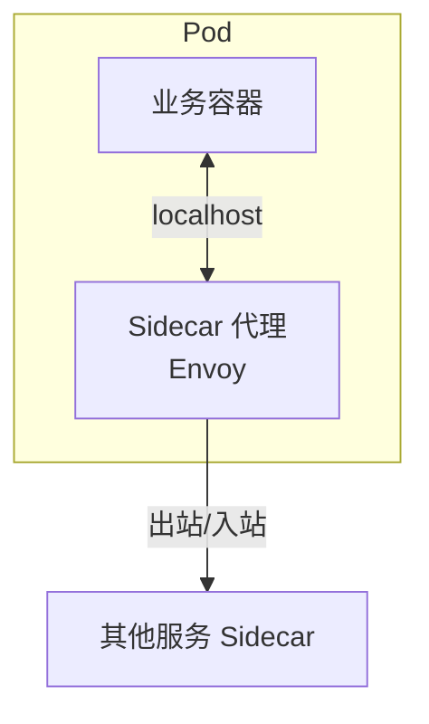
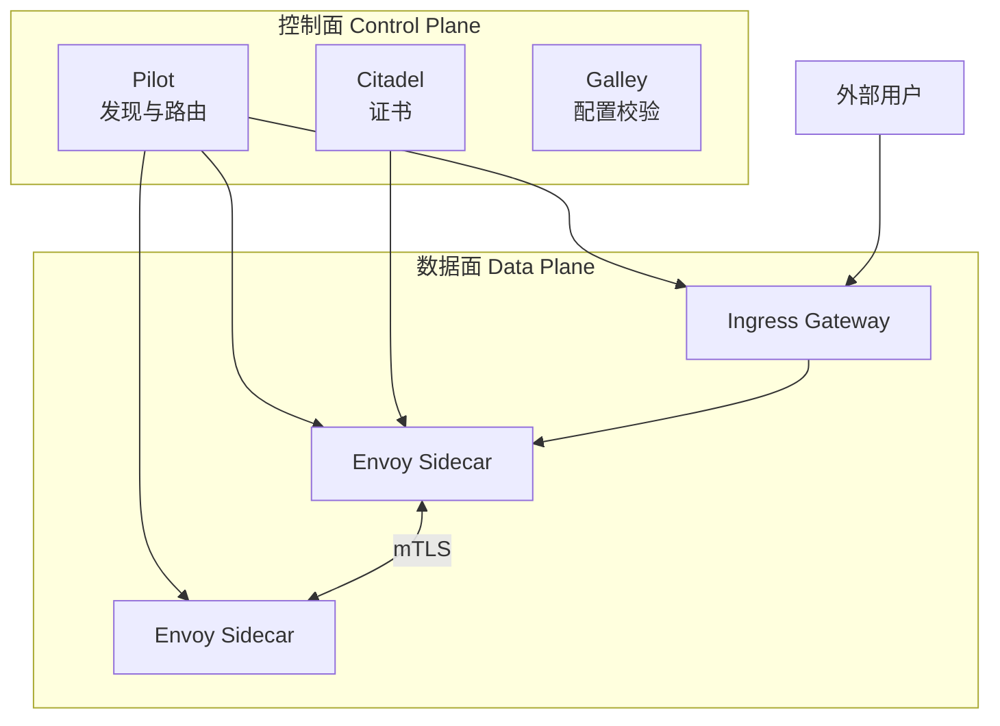
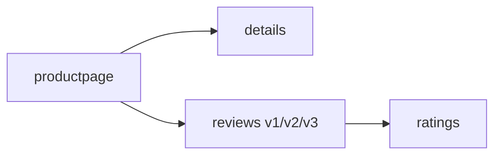

> **Kubernetes 系列 · 第 30/35 篇**  
> 上一篇：[《网络进阶——Cilium、Hybridnet、双栈与 Traefik》](/云原生/k8s/k8s-29-advanced-network)  
> 下一篇：[《事件驱动伸缩与集群监控——KEDA 与监控 UI》](/云原生/k8s/k8s-31-keda-monitoring)

---

## 开头：微服务治理能不能不写进业务代码？

Spring Cloud 把注册发现、负载均衡、熔断、网关写进每个服务——语言绑定、升级牵一发而动全身。**Service Mesh（服务网格）** 的思路是：把「流量代理 + 治理能力」拆成 **Sidecar**，与业务进程同 Pod 部署，业务只关心 HTTP/gRPC，治理由网格统一完成。

本文讲 Sidecar 与代理模式、Istio 控制面/数据面、组件职责，并在 Minikube 上完成 **安装 → Sidecar 注入 → Bookinfo → Ingress Gateway** 全流程。

---

## 一、Service Mesh 两大宏观模式

### 1.1 Sidecar（边车）模式

像摩托车旁的挎斗一样，每个业务 Pod 旁挂一个 **Sidecar 代理**：



Sidecar 负责：流量代理、监控、日志、限流、熔断、链路追踪等；与业务**同生共死**（同 Pod 生命周期）。

| 好处 | 代价 |
|------|------|
| 非侵入，多语言统一治理 | 每 Pod 多一个容器，占 CPU/内存 |
| Sidecar 可独立升级 | 多一跳本地转发（同节点延迟极低） |
| 与业务技术栈解耦 | 运维复杂度上升 |

### 1.2 代理（Proxy）模式

Sidecar 在客户端与服务之间**拦截并转发**请求，类似 Nginx 反向代理：Client → Envoy → 业务服务 → Envoy → Client。所有东西向流量默认经 Sidecar，才能统一做 mTLS、路由、遥测。


---

## 二、Spring Cloud 与 Istio 能力对照

| 能力 | Spring Cloud | Istio |
|------|-------------|-------|
| 服务发现 | Eureka / Nacos | Pilot |
| 负载均衡 | Ribbon | Envoy |
| 熔断限流 | Hystrix / Sentinel | Circuit breaker / Mixer 策略 |
| API 网关 | Zuul / Gateway | Ingress Gateway / Egress |
| 配置 | Config Server | ConfigMap / Galley（配置分发） |
| 灰度 / A/B | 自研或 Gateway | VirtualService + DestinationRule |
| 混沌工程 | Chaos Monkey | Envoy fault injection |

接入 K8s + Istio 后，**进程内 SDK 可大幅缩减**；服务间通信走 ClusterIP/Sidecar，性能多一次本地转发，同节点通常可忽略，跨节点与原来 Feign 调用量级相当。

---

## 三、Istio 架构：控制面与数据面



| 平面 | 组件 | 职责 |
|------|------|------|
| **数据面** | Envoy（Sidecar / Gateway） | 拦截流量、负载均衡、路由、遥测 |
| **控制面** | Pilot | 服务发现、路由规则下发给 Envoy |
| | Citadel | 证书与身份（mTLS） |
| | Galley | 校验并分发 Istio 配置（MCP） |
| | Sidecar Injector | Pod 创建时自动注入 Envoy |

### 3.1 一次请求在 Istio 里发生什么

1. **Sidecar 注入**：创建 Pod 时 Injector 修改 Spec，增加 Envoy 容器；Init 容器设置 **iptables** 劫持进出流量。
2. **流量拦截**：业务无感知，进出流量经本地 Envoy。
3. **服务发现**：Envoy 从 Pilot 获取目标服务实例列表。
4. **负载均衡 / 路由**：按 VirtualService 规则选 v1/v2、按权重分流。
5. **安全**：Citadel 下发证书，Sidecar 间可选 mTLS。
6. **遥测**：访问指标、日志经 Mixer 适配器到 Prometheus 等（新版本部分能力已合并进 Envoy）。


### 3.2 核心组件速览

**Pilot**（必需）：对接 K8s API 做服务发现；将 VirtualService、DestinationRule 等转为 Envoy 配置，经 xDS/gRPC 推送。

**Envoy**（数据面）：C++ 实现的高性能代理；Pod 内与 `pilot-agent` 同镜像运行——agent 负责启动 Envoy、热加载配置。

**Ingress Gateway**：集群**北向入口**，本身也是带 Envoy 的 Deployment，从集群外接收流量再转发到网格内服务。

**Mixer**（旧版常见）：策略检查与遥测上报；Istio 1.5+ 后能力逐步下沉，新项目以 Prometheus + Telemetry API 为主。

**Sidecar Injector**：命名空间标签 `istio-injection=enabled` 后，新 Pod 自动注入 Sidecar。

---

## 四、Minikube 安装 Istio

环境：Minikube + kubectl，Kubernetes ≥ 1.23。以下以 **Istio 1.20+** 官方 `istioctl` 为例（旧版 `istio-demo.yaml` 流程仍常见，命令类似）。

### 4.1 下载与 PATH

```bash
curl -L https://istio.io/downloadIstio | sh -
cd istio-1.20.0
export PATH=$PWD/bin:$PATH
istioctl version
```

### 4.2 安装控制面与 Ingress Gateway

```bash
# 默认 profile：含 Pilot、Ingress Gateway、Injector 等
istioctl install --set profile=demo -y

kubectl get pods -n istio-system
kubectl get svc -n istio-system
```

期望看到 `istiod`、`istio-ingressgateway` 等为 Running。

### 4.3 验证 Sidecar 注入

**手动注入**（不依赖命名空间标签）：

```bash
istioctl kube-inject -f first-istio.yaml | kubectl apply -f -
kubectl get pod
# READY 2/2：业务容器 + istio-proxy
kubectl describe pod <pod-name> | grep -A2 Containers
```

**自动注入**（推荐）：

```bash
kubectl create namespace my-istio-ns
kubectl label namespace my-istio-ns istio-injection=enabled

kubectl apply -f first-istio.yaml -n my-istio-ns
kubectl get pods -n my-istio-ns
# 应看到 2/2 READY
```

原理：Injector 在 Pod Spec 中**追加** Envoy 容器与 init 容器，并挂载 ConfigMap/Secret。

---

## 五、Bookinfo 示例应用

Bookinfo 是 Istio 官方书店 Demo：**productpage** 调 **details**、**reviews**（v1/v2/v3）、**ratings**，多语言、多版本，适合练流量治理。



### 5.1 部署

```bash
kubectl create namespace bookinfo-ns
kubectl label namespace bookinfo-ns istio-injection=enabled

cd istio-1.20.0/samples/bookinfo/platform/kube
kubectl apply -f bookinfo.yaml -n bookinfo-ns

kubectl get pods -n bookinfo-ns
# 每个 Pod 2/2：应用 + istio-proxy
kubectl get svc -n bookinfo-ns
```

### 5.2 集群内验证

```bash
kubectl exec -it "$(kubectl get pod -l app=ratings -n bookinfo-ns -o jsonpath='{.items[0].metadata.name}')" \
  -c ratings -n bookinfo-ns -- \
  curl -s productpage:9080/productpage | grep -o "<title.*</title>"
```

### 5.3 通过 Ingress 暴露（K8s Ingress 资源）

```yaml
apiVersion: networking.k8s.io/v1
kind: Ingress
metadata:
  name: productpage-ingress
  namespace: bookinfo-ns
spec:
  rules:
    - host: productpage.example.com
      http:
        paths:
          - path: /
            pathType: Prefix
            backend:
              service:
                name: productpage
                port:
                  number: 9080
```

```bash
kubectl apply -f productpage-ingress.yaml -n bookinfo-ns
minikube ip
# /etc/hosts: <minikube-ip> productpage.example.com
```

浏览器访问 `http://productpage.example.com`，多次刷新 **reviews** 会出现无星 / 黑星 / 红星三个版本（默认随机负载均衡）。

---

## 六、通过 Istio Ingress Gateway 访问

网格**标准入口**是 `istio-ingressgateway` Service，而不是直接绑业务 Ingress。

### 6.1 应用 Gateway + VirtualService

```bash
cd istio-1.20.0/samples/bookinfo/networking
kubectl apply -f bookinfo-gateway.yaml -n bookinfo-ns
kubectl get gateway -n bookinfo-ns
```

`bookinfo-gateway.yaml` 定义 Gateway 监听 80/443，VirtualService 把 `/productpage` 等路径路由到 productpage Service。

### 6.2 获取访问地址

```bash
export INGRESS_HOST=$(kubectl get po -l istio=ingressgateway -n istio-system \
  -o jsonpath='{.items[0].status.hostIP}')
export INGRESS_PORT=$(kubectl -n istio-system get svc istio-ingressgateway \
  -o jsonpath='{.spec.ports[?(@.name=="http2")].nodePort}')
export GATEWAY_URL=$INGRESS_HOST:$INGRESS_PORT

echo "http://$GATEWAY_URL/productpage"
curl -s "http://$GATEWAY_URL/productpage" | grep -o "<title.*</title>"
```

Minikube 下 `hostIP` 常为节点 IP，端口为 NodePort（如 31380）。


### 6.3 Gateway 与 K8s Ingress 的区别

| 方式 | 说明 |
|------|------|
| K8s Ingress | 需集群内 Ingress Controller；规则在 Ingress 资源 |
| Istio Gateway | Envoy 实现的 L4/L7 入口；与 VirtualService 配合，统一在网格内做路由、TLS、灰度 |

生产环境通常：**Gateway 作唯一北向入口**，集群内东西向走 Sidecar。

---

## 七、Sidecar 注入与流量治理延伸

自动注入后，可通过 **VirtualService** 把 90% 流量打到 reviews-v1、10% 到 v2（与上一篇金丝雀呼应）：

```yaml
apiVersion: networking.istio.io/v1beta1
kind: VirtualService
metadata:
  name: reviews
  namespace: bookinfo-ns
spec:
  hosts:
    - reviews
  http:
    - route:
        - destination:
            host: reviews
            subset: v1
          weight: 90
        - destination:
            host: reviews
            subset: v2
          weight: 10
```

需配合 **DestinationRule** 定义 `subset: v1/v2` 与版本标签。

---

## 八、清理

```bash
kubectl delete namespace bookinfo-ns
# 卸载 Istio
istioctl uninstall --purge -y
kubectl delete namespace istio-system
```

---

## 小结

- **Service Mesh** = Sidecar 模式 + 统一控制面；Istio 的数据面是 **Envoy**，控制面核心是 **Pilot** + **Injector**。
- **Bookinfo** 验证多服务调用链；**Ingress Gateway** 是集群外访问网格的推荐入口。
- 精确灰度、A/B、mTLS 在 Istio 里用 **VirtualService / DestinationRule** 声明即可，无需改 Java 代码。

> ➡️ 下一篇：[《项目上云实战——Java/Python/Golang 与中间件部署》](/云原生/k8s/k8s-28-app-onboarding)
