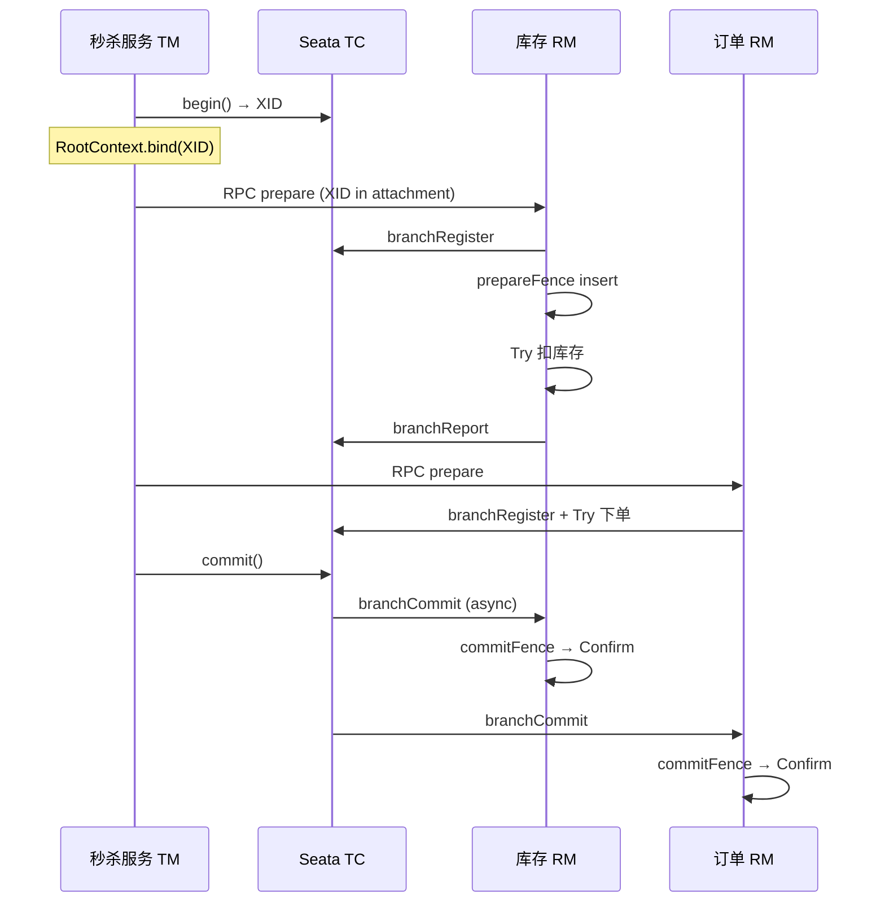

> **Seata 系列 · 第 7/8 篇**  
> 上一篇：[《TCC 三大优势与空回滚、悬挂、幂等》](/分布式/seata/seata-06-tcc-issues)  
> 下一篇：[《隔离性、脏读写防护与 Seata 面试题》](/分布式/seata/seata-08-isolation-interview)

---

## 开头：注解背后，Seata 做了什么？

[上一篇](/分布式/seata/seata-06-tcc-issues) 讲了 TCC 三大坑与 `tcc_fence_log` 解法。本文从源码串起全链路：**谁扫描注解、谁开启全局事务、Try 如何注册分支、Fence 如何幂等/防空回滚/防悬挂、二阶段谁回调 Confirm/Cancel、XID 如何跨服务传递**，并补充 `@GlobalLock` 与压测参考。

---

## 一、GlobalTransactionScanner：AOP 入口

Seata 全局事务的发起、提交/回滚依赖 **Spring AOP**。`GlobalTransactionScanner` 是入口，继承 `AbstractAutoProxyCreator`，重写 `getAdvicesAndAdvisorsForBean` 为 Bean 挂载拦截器。


### 1.1 Spring AOP 自动代理流程

`getBean("service")` 时，`BeanPostProcessor` 介入：

1. **自定义 TargetSource**：用户自行实例化，Spring 不再管理（极少见）
2. **常规路径**：Spring 完成实例化/填充/初始化，在**初始化后置处理器**里 `wrapIfNecessary` 创建代理——绝大多数 Seata 代理走此路径


### 1.2 方法调用链

JDK 动态代理的方法调用进入 `invoke` → 依次执行 **Interceptor 链**（后进先出，类似栈）：


### 1.3 wrapIfNecessary 创建拦截器

`GlobalTransactionScanner.wrapIfNecessary` 为 Bean 添加两类拦截：

- `GlobalTransactionalInterceptor` — 处理 `@GlobalTransactional` / `@GlobalLock`
- `TccActionInterceptor` — 处理 `@TwoPhaseBusinessAction`（TCC Try）


`wrapIfNecessary` 核心逻辑（简化）：

```java
// io.seata.spring.annotation.GlobalTransactionScanner
@Override
protected Object wrapIfNecessary(Object bean, String beanName, Object cacheKey) {
    if (disableGlobalTransaction) {
        return bean;
    }
    Class<?> serviceInterface = getTargetClass(bean);
    // 跳过非 Seata 相关 Bean，避免无谓代理
    if (!needsEnhancement(serviceInterface)) {
        return bean;
    }
    // 为 @GlobalTransactional / @TwoPhaseBusinessAction 等方法创建 Advisor
    Advisor advisor = new Advisor(new SeataInterceptor());
    return super.wrapIfNecessary(bean, beanName, cacheKey, advisor);
}
```

`SeataInterceptor` 内部按方法注解分发到 `GlobalTransactionalInterceptor` 或 `TccActionInterceptor`。

---

## 二、GlobalTransactionalInterceptor 与 TransactionalTemplate

### 2.1 拦截 @GlobalTransactional / @GlobalLock

执行带 `@GlobalTransactional` 的方法时，动态代理将流程切入 `GlobalTransactionalInterceptor`：


该拦截器扫描两个注解：

| 注解 | 处理模板 | 作用 |
|------|----------|------|
| `@GlobalTransactional` | `transactionalTemplate` | 开启/提交/回滚全局事务 |
| `@GlobalLock` | `globalLockTemplate` | 加锁标志 → 执行业务 → 释放标志（RM 侧轻量检查全局锁） |

从注解读取 `rollbackFor`、`timeout` 等配置，交给模板执行。


### 2.2 TransactionalTemplate.execute 三步

`TransactionalTemplate` 四个核心方法：`execute`、`beginTransaction`、`commitTransaction`、`rollbackTransaction`。


**execute 流程**（最重要）：


1. **是否已有全局事务**：A 调 B，A 创建 GT1，B 复用 GT1（事务传播）
2. **begin**：仅当「自己创建的全局事务」才 RPC 通知 TC；嵌套调用则跳过
3. **执行业务**
4. **rollback**：异常时，仅创建者负责回滚，否则异常外抛
5. **commit**：无异常时，仅创建者负责提交
6. **清理** ThreadLocal 中的 XID


`execute` 伪代码（对应 `io.seata.tm.api.TransactionalTemplate`）：

```java
public Object execute(TransactionalExecutor business) throws Throwable {
    GlobalTransaction tx = GlobalTransactionContext.getCurrentOrCreate();
    boolean existing = tx != null && tx.isExisting();
    boolean success = false;
    try {
        if (!existing) {
            tx.begin(timeout, name);          // RPC → TC，XID bind ThreadLocal
        }
        Object ret = business.execute();       // 执行业务
        success = true;
        return ret;
    } catch (Throwable ex) {
        if (!existing) {
            tx.rollback(ex);                   // RPC → TC rollback
        }
        throw ex;
    } finally {
        if (!existing && success) {
            tx.commit();                       // RPC → TC commit
        }
        if (!existing) {
            tx.suspend();                      // 清理 RootContext
        }
    }
}
```

**事务传播**：嵌套 `@GlobalTransactional` 时 `existing=true`，内层不再 begin/commit/rollback，异常仍向上抛。

### 2.3 beginTransaction → DefaultGlobalTransaction


TM 模块核心接口 `GlobalTransaction`：创建、提交、回滚全局事务，实质是向 TC 发 RPC。


TM 启动时连接 TC Server，通过 TM Client 通信。


`DefaultGlobalTransaction.begin` 本身逻辑轻量：调用 `TransactionManager`，将 **XID 存入 ThreadLocal**（`RootContext`），供整条 RPC 链路使用。


### 2.4 TransactionManager 与 TC 通信

`TransactionManager` 通过 **Java SPI** 加载，默认 `DefaultTransactionManager`：


`begin` / `commit` / `rollback` 均通过 **同步 RPC** 与 TC 交互：


---

## 三、TccActionInterceptor：一阶段 Try 流程

业务方法标注 `@TwoPhaseBusinessAction` 时，由 `TccActionInterceptor` 拦截。


### 3.1 分支注册与上下文参数

Try 阶段主要步骤：

1. 从 `RootContext` 取 XID
2. 解析 `@TwoPhaseBusinessAction` 的 `name`、`commitMethod`、`rollbackMethod`
3. **向 TC 注册分支**（branchRegister）
4. 将二阶段所需业务参数序列化为 JSON 写入 `BusinessActionContext`，随注册发往 TC
5. 执行业务 Try 方法
6. 若配置了 `useTCCFence=true`，调用 `TCCFenceHandler.prepareFence`
7. 再次请求 TC **更新**分支上下文（JSON）


`TccActionInterceptor.invoke` 简化流程：

```java
// io.seata.rm.tcc.interceptor.TccActionInterceptor
public Object invoke(MethodInvocation invocation) throws Throwable {
    if (!RootContext.inGlobalTransaction()) {
        return invocation.proceed();  // 无 XID 则直通
    }
    TwoPhaseBusinessAction action = getActionAnnotation(invocation);
    String xid = RootContext.getXID();
    String branchType = BranchType.TCC.name();

    // 1. 解析参数，构建 BusinessActionContext
    BusinessActionContext actionContext = getActionContext(xid, invocation);

    // 2. 注册分支 → TC
    Long branchId = doBranchRegister(xid, action.name(), actionContext.getActionContext());

    // 3. useTCCFence：一阶段屏障
    if (action.useTCCFence()) {
        TCCFenceHandler.prepareFence(xid, branchId, action.name());
    }

    // 4. 执行业务 Try
    Object result = invocation.proceed();

    // 5. 更新分支上下文（二阶段参数）→ TC
    doBranchReport(xid, branchId, actionContext.getActionContext());
    return result;
}
```

**优化提示**：业务参数可存本地 `tcc_fence_log` 或业务表，发给 TC 的 JSON 只保留分支元信息，减少网络 IO 与二次更新 RPC。


---

## 四、TCCFenceHandler 与 tcc_fence_log

### 4.1 启用条件

1. `@TwoPhaseBusinessAction(useTCCFence = true)`
2. 客户端建表 `tcc_fence_log`，配置 TCC fence 数据源


建表示例：

```sql
CREATE TABLE IF NOT EXISTS `tcc_fence_log` (
  `xid`          VARCHAR(128)  NOT NULL COMMENT 'global id',
  `branch_id`    BIGINT        NOT NULL COMMENT 'branch id',
  `action_name`  VARCHAR(64)   NOT NULL COMMENT 'action name',
  `status`       TINYINT       NOT NULL COMMENT 'status: tried(1), committed(2), rollbacked(3), suspended(4)',
  `gmt_create`   DATETIME(3)   NOT NULL,
  `gmt_modified` DATETIME(3)   NOT NULL,
  PRIMARY KEY (`xid`, `branch_id`)
) ENGINE = InnoDB DEFAULT CHARSET = utf8;
```

`application.yml` 片段：

```yaml
seata:
  tcc:
    fence:
      log-table-name: tcc_fence_log
      clean-period: 1h
```

核心字段：`xid`、`branch_id`、`action_name`；主键 `(xid, branch_id)`。  
status 区分 tried / committed / rollbacked / suspended。


### 4.2 prepareFence（一阶段）


- Try 前向 `tcc_fence_log` **insert** 初始记录
- 插入成功 → 二阶段尚未完成，继续 Try
- **DuplicateKey** → 二阶段 Cancel 已空回滚插入过记录，或已 committed → **拒绝 Try（防悬挂）**


### 4.3 commitFence（二阶段提交）


1. 查一阶段记录；无记录 → 抛异常，等待重试
2. 状态已是 `STATUS_COMMITTED` → 幂等返回
3. 已回滚/悬挂 → 不可提交
4. 执行 Confirm，更新为 `STATUS_COMMITTED`

### 4.4 rollbackFence（二阶段回滚）


1. 无一阶段记录 → **空回滚**：insert 占位记录，防后续 Try（悬挂）
2. insert 成功 → Try 未执行，空回滚成功
3. insert 失败 → Try 正在执行，抛异常等 TC 重试
4. 已 `ROLLBACKED` / `SUSPENDED` → 幂等返回
5. 已 `COMMITTED` → 不可回滚
6. 执行 Cancel，更新为 `STATUS_ROLLBACKED`

### 4.5 三问题源码级总结


| 阶段 | 逻辑 |
|------|------|
| **Try** | insert 初始记录；失败则说明二阶段已动，抛异常 |
| **Commit** | 无记录抛异常；已提交幂等；执行 Confirm 并改状态 |
| **Rollback** | 无记录空回滚 insert；已回滚幂等；执行 Cancel 并改状态 |

---

## 五、二阶段处理流程

**关键认知**：Confirm/Cancel 由 **TC 发起 RPC**，在 RM 的**异步线程**中执行，不在业务线程。

RM 初始化 `RMClient`，注册 `RmMessageListener` 监听 TC 消息。  
`DefaultRMHandler` 单例处理分支提交/回滚，按模式委托：

| Handler | 模式 |
|---------|------|
| `RMHandlerAT` | AT |
| `RMHandlerTCC` | TCC |
| `RMHandlerSaga` | Saga |


`getRMHandler(branchType)` 按分支类型路由。


### 5.1 Commit 路径

```
AbstractRMHandler.doBranchCommit
  → ResourceManager (SPI) → DefaultResourceManager
  → TCCResourceManager
  → TCCFenceHandler.commitFence()
  → 反射调用业务 commitMethod
```


### 5.2 Rollback 路径

```
AbstractRMHandler.doBranchRollback
  → TCCResourceManager
  → TCCFenceHandler.rollbackFence()
  → 反射调用业务 rollbackMethod
```


---

## 六、@GlobalLock + SELECT FOR UPDATE

### 6.1 SelectForUpdateExecutor

AT 模式下，`StatementProxy` 经 `ExecuteTemplate` 执行 SQL。  
若 SQL 为 `SELECT ... FOR UPDATE`，且方法带 `@GlobalTransactional` 或 `@GlobalLock`：

- 检查是否存在**全局锁**
- 若被占用：回滚本地事务，**while 循环重试**竞争本地锁 + 全局锁

源码：`io.seata.rm.datasource.exec.SelectForUpdateExecutor#doExecute`  
注释：`// Just check lock without requiring lock by now.` — 当前仅检查，不主动抢锁。


### 6.2 ConnectionProxy 提交与全局锁

提交在 `ConnectionProxy#doCommit`：

**@GlobalTransactional**：注册分支时向 TC **申请全局锁**  
→ `ConnectionProxy#register` → `AbstractCore#branchRegister` → `ATCore#branchSessionLock`


分支注册八步：取全局会话 → 锁会话 → 状态检查 → 加监听器 → 建分支 → 锁分支 → 加入全局会话 → 返回 branchId。


**@GlobalLock**：提交前 `processLocalCommitWithGlobalLocks` → `checkLock`  
检查本事务操作行是否与 TC 已有全局行锁冲突；**冲突则抛异常**，不在 TC 新增锁记录。


### 6.3 @GlobalLock 的价值

| 场景 | 隔离 | 机制 |
|------|------|------|
| Seata 事务 ↔ Seata 事务 | **RC** | 全局锁 + 本地锁 |
| Seata 事务 ↔ 独立本地事务 | 默认 **RU**（脏读/脏写） | 全局锁对外部无效 |

`@GlobalTransactional` 较重（begin/commit RPC）；**不需要全局事务、但需防脏读脏写**时，用 `@GlobalLock` 只查全局锁，更轻量。


---

## 七、XID 远程传递

TM 通过 `@GlobalTransactional` 创建 XID 并存入 `RootContext`（ThreadLocal）。跨服务时须把 XID 带入下游。

**原则**：RPC 框架在请求中附加隐藏属性存 XID，提供方取出后 `RootContext.bind(xid)`。

### 7.1 Dubbo Filter 示例

```java
@Activate(group = {Constants.PROVIDER, Constants.CONSUMER}, order = 100)
public class TransactionPropagationFilter implements Filter {

    @Override
    public Result invoke(Invoker<?> invoker, Invocation invocation) throws RpcException {
        String xid = RootContext.getXID();
        String rpcXid = RpcContext.getContext().getAttachment(RootContext.KEY_XID);
        boolean bind = false;

        if (xid != null) {
            // 消费方：XID 写入 RpcContext，随请求发出
            RpcContext.getContext().setAttachment(RootContext.KEY_XID, xid);
        } else if (rpcXid != null) {
            // 提供方：从 RpcContext 取出并绑定
            RootContext.bind(rpcXid);
            bind = true;
        }

        try {
            return invoker.invoke(invocation);
        } finally {
            if (bind) {
                RootContext.unbind(); // 防止 ThreadLocal 污染
            }
        }
    }
}
```

Feign/RestTemplate、HTTP 同理：Header 传递 `RootContext.KEY_XID`；Servlet Filter / `ClientHttpRequestInterceptor` 分别 bind/unbind。

**HTTP 提供方 — Servlet Filter**：

```java
@Component
public class SeataFilter implements Filter {
    @Override
    public void doFilter(ServletRequest req, ServletResponse resp, FilterChain chain)
            throws IOException, ServletException {
        HttpServletRequest request = (HttpServletRequest) req;
        String xid = request.getHeader(RootContext.KEY_XID.toLowerCase());
        boolean bound = false;
        if (StringUtils.isNotBlank(xid)) {
            RootContext.bind(xid);
            bound = true;
        }
        try {
            chain.doFilter(req, resp);
        } finally {
            if (bound) {
                RootContext.unbind();
            }
        }
    }
}
```

**HTTP 消费方 — RestTemplate Interceptor**：

```java
public class SeataRestTemplateInterceptor implements ClientHttpRequestInterceptor {
    @Override
    public ClientHttpResponse intercept(HttpRequest request, byte[] body,
            ClientHttpRequestExecution execution) throws IOException {
        String xid = RootContext.getXID();
        if (StringUtils.isNotEmpty(xid)) {
            request.getHeaders().add(RootContext.KEY_XID, xid);
        }
        return execution.execute(request, body);
    }
}
```

Seata Spring Boot Starter 会通过 `@PostConstruct` 自动向所有 `RestTemplate` Bean 注入该 Interceptor。


### 7.2 全链路时序（TCC 秒杀）



---

## 八、压测参考（简述）

Seata 官方与社区压测表明：**AT 模式在高并发下开销明显大于 TCC**。

| 模式 | 参考结论（单机 JMeter） |
|------|-------------------------|
| **AT** | 100/1000 并发成功率约 **23%–30%**（约 20 TPS 量级） |
| **TCC** | 100 并发成功率 **80%–98%**；500/1000 并发仍显著优于 AT（约 **100 TPS** 量级） |


> 压测结果受 TC 部署、DB、网络、业务 SQL 影响极大，上表仅作**量级参考**，生产需自建基准。高并发场景可优先评估 TCC/Saga，或缩小 `@GlobalTransactional` 边界。

---

## 小结

| 组件 | 职责 |
|------|------|
| `GlobalTransactionScanner` | Spring AOP 入口，注册 GT/TCC 拦截器 |
| `GlobalTransactionalInterceptor` | `@GlobalTransactional` / `@GlobalLock` |
| `TransactionalTemplate` | 传播、begin、业务、commit/rollback |
| `DefaultGlobalTransaction` + `DefaultTransactionManager` | XID 绑定 ThreadLocal，同步 RPC TC |
| `TccActionInterceptor` | Try 分支注册 + 执行业务 + prepareFence |
| `TCCFenceHandler` | 幂等 / 空回滚 / 防悬挂 |
| `DefaultRMHandler` → `TCCResourceManager` | 二阶段 Confirm/Cancel |
| `SelectForUpdateExecutor` + `@GlobalLock` | 混合场景 RC / 防脏读写 |
| `TransactionPropagationFilter` 等 | XID 跨 RPC/HTTP |

下一篇聚焦 **Seata 事务隔离级别（RC/RU）、脏读脏写防护方案**，以及 **AT 流程 / XA vs AT** 面试题，作为系列收官。

---

## 系列导航

| 篇目 | 主题 |
|------|------|
| [06 TCC 常见问题](/分布式/seata/seata-06-tcc-issues) | 幂等、空回滚、悬挂 |
| **07 TCC 源码** | 本文 |
| [08 隔离与面试](/分布式/seata/seata-08-isolation-interview) | RC、脏读写、面试题 |
