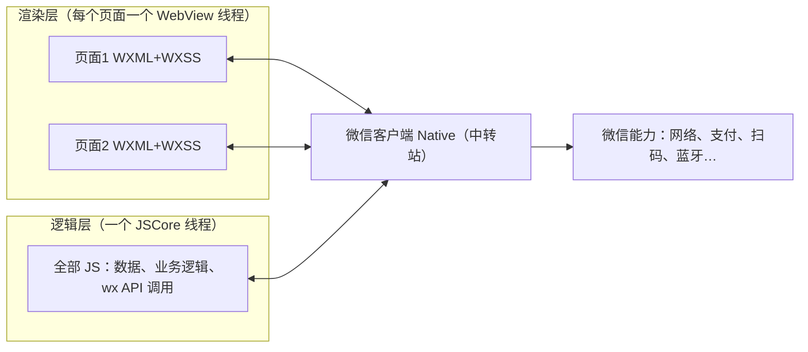

> **小程序开发系列 · 第 1/14 篇**（开篇）  
> 下一篇：[《跑起来第一个小程序》](/微信小程序/basics/mp-02-first-miniprogram)  
> 关联阅读：[《仿校团小程序抓包复盘》](/Notes/projects/wechat-miniprogram-fangxiaotuan-mitm-retrospective)（看看小程序的真实网络流量长什么样）

---

## 开头：微信明明能打开网页，为什么还要发明「小程序」

设想你在 2016 年的微信团队。公众号里的 H5 页面已经跑得很欢了——点个链接就能购物、填表、玩游戏，浏览器内核什么都能渲染。这时候老板提需求：我们要让商家在微信里做「扫码点单」「会员卡」「拼团」，而且要**像原生 App 一样顺滑**。

你第一个念头大概是：让他们继续写 H5 呗。但很快会发现三条过不去的坎：

1. **慢**。网页是「现用现下载」的：打开一个 H5，先加载 HTML，再加载 JS、CSS、图片，白屏转圈全靠网速心情。而原生 App 的代码早就在手机里躺着了，点开即用。
2. **不可控**。网页里跑的 JS 什么都能干——改 DOM、跳转到任意外部站点、诱导分享、钓鱼。微信没办法对一个「任意网页」做审核和约束。
3. **能力弱**。网页被浏览器沙箱关着，调不了蓝牙、扫码要绕、支付体验割裂。想用微信的账号体系和支付能力，只能靠 JS-SDK 这种「隔靴搔痒」的桥。

小程序就是微信对这三条坎的回答，思路一句话：**代码微信替你分发、运行微信替你把关、能力微信按需发放**——代价是开发者放弃「想写什么写什么」的自由，接受一套微信定义的框架和规矩。

本篇先建立整条知识线的地基：小程序的**双线程模型**。后面 13 篇讲的所有东西——为什么改数据必须 `setData`、为什么页面栈最多 10 层、为什么有域名白名单——根子都在这个模型上。

| 雪球 | 这一球加上去的 | 能解释什么 |
|------|----------------|------------|
| **1** | 小程序 vs H5 vs App 的定位 | 小程序到底「是」个什么东西 |
| **2** | 双线程模型（渲染层/逻辑层分家） | 为什么不能操作 DOM、为什么要 setData |
| **3** | 各端运行环境矩阵 | 为什么开发者工具正常、真机却出 bug |
| **4** | 代码组成（app 三件套 + 页面四件套） | 一个小程序项目里都有些什么 |
| **5** | Skyline 与 glass-easel | 2026 年双线程模型正在怎么进化 |

## 一、小程序是什么：一句话定位

官方的经典表述是「**不需要下载安装即可使用的应用，触手可及，用完即走**」。拆成白话：

- **它是应用**：有独立的代码包、独立的页面栈、独立的运行环境，不是「微信里的一个网页」；
- **不用安装**：代码包由微信下载缓存，用户无感知——对用户是「即点即用」，对开发者其实是「微信替你做了静默安装」；
- **寄生在微信里**：它没有自己的进程入口，一切能力（渲染、网络、支付、登录）都经由微信这个「宿主」发放。官方文档把微信客户端给小程序提供的环境叫[**宿主环境**](https://developers.weixin.qq.com/miniprogram/dev/framework/quickstart/framework.html)。

放到坐标系里看更清楚：

| 维度 | H5 网页 | 微信小程序 | 原生 App |
|------|---------|-----------|----------|
| 运行在哪 | 任意浏览器 | 微信客户端（宿主环境） | 操作系统 |
| 代码分发 | 输入 URL 现场加载 | 微信下载整个代码包到本地 | 应用商店安装 |
| 首开速度 | 取决于网络 | 快（代码包本地缓存 + 体积受限） | 最快 |
| 页面技术 | HTML/CSS/JS | WXML/WXSS/JS | 各家原生框架 |
| 能操作 DOM 吗 | 能 | **不能** | 不存在 DOM |
| 能力上限 | 浏览器沙箱 | 微信开放的能力（支付/蓝牙/扫码…） | 系统全部能力 |
| 上架门槛 | 无 | 微信审核 | 商店审核 |
| 典型体积 | 无限制 | 主包 2MB 级别 | 几十到几百 MB |

看出规律了吗：小程序每一项都卡在 H5 和原生 App **中间**——它就是微信在「网页的便捷」和「原生的体验」之间硬生生造出来的一个物种。理解了「居中」这个定位，后面所有设计都顺理成章。

## 二、核心：为什么不直接用 H5——双线程模型

这是全系列最重要的一节。先看网页的世界出了什么问题，再看小程序怎么改。

### 2.1 网页的旧疾：渲染和脚本抢一根线程

浏览器网页里，**渲染线程和脚本线程是互斥的**：JS 在跑的时候，页面没法同时排版绘制。所以网页里只要有一段 JS 卡了 500 毫秒，整个页面就冻住 500 毫秒——按钮点不动、动画掉帧。这也是网页开发「长任务要拆、要做 Web Worker」的由来。

### 2.2 小程序的手术：把「画界面的」和「算逻辑的」分到两个线程

微信的解法简单粗暴：既然这俩抢线程，那就别待在一起。官方文档原文（[小程序宿主环境](https://developers.weixin.qq.com/miniprogram/dev/framework/quickstart/framework.html)）：

> 小程序的运行环境分成**渲染层**和**逻辑层**，其中 WXML 模板和 WXSS 样式工作在渲染层，JS 脚本工作在逻辑层。
>
> 小程序的渲染层和逻辑层分别由 2 个线程管理：渲染层的界面使用了 WebView 进行渲染；逻辑层采用 JSCore 线程运行 JS 脚本。一个小程序存在多个界面，所以渲染层存在多个 WebView 线程，这两个线程的通信会经由微信客户端（Native）做中转，逻辑层发送网络请求也经由 Native 转发。

画成图：



逐个角色认识一下：

- **渲染层 = WebView**。WebView 就是嵌在 App 里的「迷你浏览器」，会渲染页面。注意「一个小程序存在多个界面，所以渲染层存在多个 WebView 线程」——你每打开一个页面，就多一个 WebView。这里的 WXML/WXSS 是微信自己定义的模板语言（第 3 篇细讲），不是 HTML/CSS，但最终由 WebView 渲染。
- **逻辑层 = JSCore（或 V8）**。JSCore 是一个**纯 JavaScript 引擎**，只懂跑 JS，不带任何浏览器设施。你的全部业务代码——数据、函数、`wx.request` 调用——都生活在这一个线程里，全小程序共享。
- **Native = 微信客户端**。两个线程不直接说话，所有消息（「数据变了，重新渲染」「用户点了按钮」）都由 Native 层中转；连网络请求都由 Native 代发。

### 2.3 这台手术带来的三个后果

双线程不是免费午餐，它直接塑造了小程序开发的所有「怪规矩」：

**后果一：你不能操作 DOM——因为逻辑层根本没有 DOM。**

网页里 `document.getElementById('btn').innerText = '已点'` 这类操作，在小程序里不存在：你的 JS 跑在 JSCore 这个纯 JS 引擎里，那里没有 `document`、没有 `window`、没有任何浏览器对象。那界面怎么更新？只能**声明的、数据驱动的方式**：

```js
// 网页思路（小程序里不存在）：
// document.querySelector('#count').textContent = 3

// 小程序思路：改数据，让框架去改界面
this.setData({ count: 3 })
```

WXML 里写的是「界面长什么样取决于数据」的模板，`setData` 负责把新数据送到渲染层重新渲染。**程序员失去直接操控界面的权力，换来渲染和逻辑永不互相卡死**——这是整个小程序框架的第一性原理，也是从网页开发迁移过来最大的心智转变。

**后果二：界面更新要「跨线程快递」，setData 是性能大头。**

逻辑层改了数据，要经过 Native 中转送到渲染层，这条路上数据要被序列化、传输、再应用。所以官方性能文档专门有一页「合理使用 setData」：频繁调用、一次传大对象，都会让这条快递通道拥堵。为什么 `setData` 这么金贵、怎么优化——第 4 篇专门拆。

**后果三：安全可控的根基。**

JS 被关在纯 JS 引擎的沙箱里，碰不到渲染层、碰不到系统能力；所有「出格」的动作（发网络请求、调摄像头、拉位置）都必须经过 Native 这道关卡。关卡在手，微信才能做**域名白名单**（第 11 篇）、**代码审核**（第 14 篇）、**API 权限 scope**（第 11 篇）这一整套管控。你甚至可以说：双线程首先是**安全设计**，其次才是性能设计。

### 2.4 各端运行环境：同一个小程序，不同的引擎

「渲染层用 WebView、逻辑层用 JSCore」是抽象说法，落到每个平台，具体引擎并不一样（[官方运行环境说明](https://developers.weixin.qq.com/miniprogram/dev/framework/runtime/env.html)）：

| 平台 | 逻辑层 JS 引擎 | 渲染层引擎 |
|------|---------------|-----------|
| iOS / iPadOS / macOS | JavaScriptCore | WKWebView |
| Android | V8 | XWeb（微信自研，基于 Mobile Chromium 内核） |
| Windows | Chromium 内核 | Chromium 内核 |
| 开发者工具 | NW.js | Chromium WebView |

两张实用的推论，先记下：

- 官方特别提示「**JavaScriptCore 无法开启 JIT 编译**，同等条件下运行性能要明显低于其他平台」——同样的 JS，iOS 上往往比 Android 上慢，逻辑层重计算时要有心理预期。
- 官方同样强调「**开发者工具仅供调试使用，最终的表现以客户端为准**」。工具里渲染层是 Chromium，真机 Android 是 XWeb、iOS 是 WKWebView，三个浏览器对同一份 WXSS 的解释存在差异——「工具里好好的，真机样式崩了」是小程序经典 bug 类型，根源在此。

## 三、一个小程序由什么组成

模型懂了，看实物。一个小程序项目 = **一个 app（程序主体）+ N 个 page（页面）**（[目录结构](https://developers.weixin.qq.com/miniprogram/dev/framework/structure.html)）：

**app 三件套**（放项目根目录）：

| 文件 | 必需 | 作用 |
|------|------|------|
| `app.js` | 是 | 小程序逻辑——整个程序唯一的 `App` 实例在哪注册 |
| `app.json` | 是 | 全局配置——所有页面路径、窗口样式、tabBar 都登记在这 |
| `app.wxss` | 否 | 公共样式表 |

**页面四件套**（每个页面一个目录，四个文件**同名不同扩展**）：

| 文件 | 必需 | 作用 |
|------|------|------|
| `页面名.wxml` | 是 | 页面结构（模板） |
| `页面名.js` | 是 | 页面逻辑 |
| `页面名.json` | 否 | 页面配置（比如这个页面的导航栏标题） |
| `页面名.wxss` | 否 | 页面样式 |

`app.json` 的 `pages` 数组是全小程序的「户口本」：

```json
{
  "pages": [
    "pages/index/index",
    "pages/logs/logs"
  ]
}
```

两条硬规矩：**写在 `pages` 里的第一个页面就是首页**（打开小程序看到的第一个页面）；没登记在 `pages` 里的页面无法被访问。微信打开小程序前会先把整个代码包下载到本地，然后照着户口本装载首页——这也是小程序「快」的原因之一：不像网页那样现场拼装。

首页装好、`App` 实例的 `onLaunch` 回调执行，一个页面则是「json 配置 → WXML 结构 + WXSS 样式 → js 里 `Page()` 构造器拿 `data` 和模板一起渲染」这样组装出来的。这套流程第 2 篇会在开发者工具里亲眼看一遍，第 7 篇再从生命周期角度细拆。

最后提前立个路标：项目里能放进代码包的文件类型有**白名单**（wxs、png、jpg、svg、mp3、mp4、wasm 等 18 种），白名单外的文件在开发工具里能访问、**上传时会被丢弃**——第一次遇到「资源文件真机不显示」时，记得回来翻这条。这些边界细节统一在第 13 篇（分包与体积）展开。

## 四、2026 年的现状：双线程正在被自己人革命

以上讲的是经典 WebView 渲染模型，也是本系列前 11 篇的地基。但按官方文档 2026 年的目录结构，「**Skyline 渲染引擎**」和「**glass-easel 组件框架**」已经和「小程序框架」平级成为独立章节——这是一场官方主导的、针对双线程弊端的自我革命：

- **Skyline 渲染引擎**：不再用 WebView 渲染，微信自研渲染引擎直接接管渲染层，配合单线程模型。官方给出的特性数据：建树流程耗时降低 30%~40%，`setData` 调用**不再有通信开销**（渲染和逻辑回到同一线程，自然不用「跨线程快递」）。
- **glass-easel 组件框架**：新一代组件框架，原本只在 Skyline 下可用；自**基础库 3.8.12** 起在 WebView 渲染引擎下也支持迁移——说明官方在两条渲染路线上统一组件底座。

注意因果没变：Skyline 优化的是「渲染层用什么画」和「线程怎么分」，而「数据驱动、`setData` 更新视图」的开发范式照旧。所以本系列的路线是：先把经典双线程模型吃透（它是理解一切行为的底座，存量小程序绝大多数仍跑在它上面），第 12 篇再专门切到 Skyline 实测对比。

## 五、能力边界：能做什么、不能做什么

给「小程序里面都有什么」先画个粗略的圈，后面每篇填一块：

**微信给的（H5 做不到或做不好的）**：

- 账号体系：微信登录、UnionID 打通（第 11 篇）
- 支付：微信支付（不在本系列展开）
- 硬件：蓝牙、NFC、Wi-Fi（本系列不深入，知道入口即可）
- 消息触达：订阅消息、客服消息（第 14 篇顺带）
- 微信生态入口：搜一搜、小程序码、分享卡片（第 14 篇）

**微信管着的（写代码前就要知道的）**：

- 网络请求只能发往**提前登记的 HTTPS 域名**（白名单，第 11 篇）
- 代码包体积有上限、需拆分包管理（第 13 篇）
- 页面栈有层数上限（第 6 篇——你点名要的路由与页面栈，整整一篇）
- 上线要过微信审核（第 14 篇）
- 敏感能力（定位、相册等）要用户授权 + 隐私协议（第 11 篇）

## 全系列地图

本系列用一个「待办清单」小程序从头滚到发布，每篇只加一层：

| 篇 | 主题 | 回答的问题 |
|----|------|-----------|
| 01（本篇） | 小程序是什么 | 为什么不直接写网页 |
| 02 | 跑起来第一个小程序 | 工具、账号、项目怎么搭 |
| 03 | 页面四件套与数据绑定 | WXML/WXSS/JS/JSON 怎么配合 |
| 04 | 双线程与 setData 的代价 | 数据更新的快递通道为什么贵 |
| 05 | 事件系统 | 用户点击怎么传到逻辑层 |
| 06 | 路由与页面栈 | 页面怎么跳转、栈怎么管理 |
| 07 | 生命周期 | 什么时机干什么事 |
| 08 | WXS | 渲染层为什么还需要一段脚本 |
| 09 | 内置组件 | 积木盒里都有什么 |
| 10 | 自定义组件 | 积木不够了自己造 |
| 11 | 常用 API 与权限 | 网络、存储、授权怎么用 |
| 12 | Skyline 与 glass-easel | 新引擎值不值得切 |
| 13 | 分包与启动性能 | 包大了怎么拆、启动怎么快 |
| 14 | 发布上线 | 从开发版到正式版走什么流程 |

## 小结

- 小程序是微信在「网页便捷」与「原生体验」之间造出的物种：**代码微信分发、运行微信把关、能力微信发放**。
- 它的地基是**双线程模型**：渲染层（WebView，每页一个）+ 逻辑层（JSCore/V8，全程序一个），通信由微信客户端 Native 中转。
- 这个模型的三个后果贯穿全系列：**不能操作 DOM（只能 `setData` 数据驱动）、界面更新有跨线程代价（setData 是性能大头）、JS 关在沙箱里（白名单/审核/权限的根基）**。
- 各端引擎不同（iOS JSCore 无 JIT、Android XWeb、工具 Chromium），所以「工具正常真机异常」是常态而非意外。
- 2026 年官方正推 Skyline + glass-easel 革 WebView 的命，但开发范式不变；先把经典模型吃透，第 12 篇再见分晓。

**思考题**（下一页刚好揭晓第一题）：

1. 网页里 `for` 循环跑 2 秒，页面会卡死；小程序逻辑层里 `for` 循环跑 2 秒，界面会卡死吗？渲染层和逻辑层谁受影响？
2. 既然逻辑层不能操作 DOM，开发者工具的「模拟器」里看到的界面，到底是渲染层的 WebView 还是逻辑层画出来的？
3. `setData` 把数据从逻辑层发到渲染层要序列化传输。猜一猜：往 `setData` 里塞一个 1MB 的字符串，和调用 1000 次各 1KB 的 `setData`，哪个更伤？

> **参考**（均为微信官方文档，2026-08 核验）：[小程序宿主环境·渲染层和逻辑层](https://developers.weixin.qq.com/miniprogram/dev/framework/quickstart/framework.html)｜[小程序的运行环境](https://developers.weixin.qq.com/miniprogram/dev/framework/runtime/env.html)｜[目录结构](https://developers.weixin.qq.com/miniprogram/dev/framework/structure.html)｜[Skyline 特性](https://developers.weixin.qq.com/miniprogram/dev/framework/runtime/skyline/features.html)｜[glass-easel 迁移说明](https://developers.weixin.qq.com/miniprogram/dev/framework/custom-component/glass-easel/migration.html)
