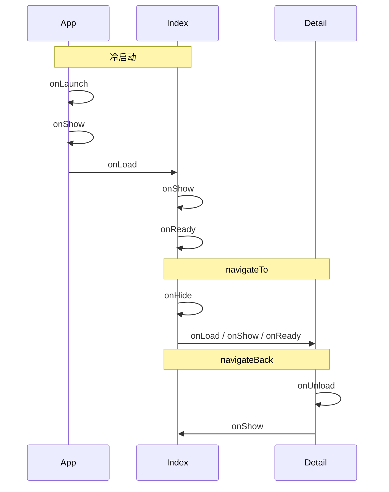

> **小程序开发系列 · 第 7/14 篇**  
> 上一篇：[《路由与页面栈》](/微信小程序/basics/mp-06-routing-page-stack)  
> 下一篇：[《WXS》](/微信小程序/basics/mp-08-wxs)

---

## 开头：一串日志里的时间线

06 篇已经让你看见：跳转不只是换画面，还会触发一串生命周期回调。本篇把 **App（全局）** 和 **Page（每个页面）** 的钩子摊开，并和路由动作一一对表。

实验仍在 `mp-demo-lab2`（工具 Stable 2.02.2608040，基础库 3.17.1）。先看冷启动时 Console 的真实顺序——这是整篇的骨架：

> ✅ **实测**（点「编译」后什么都不点）：

```text
[07] App onLaunch —— 小程序启动（全局仅一次）
[07] App onShow —— 进入前台
[07] index onLoad，options = {}
[07] index onShow
[07] index onReady（首次渲染完成）
```

| 雪球 | 这一球加上去的 | 当场能看见的效果 |
|------|----------------|------------------|
| **1** | App 生命周期 | 冷启动只有一次 onLaunch |
| **2** | Page 生命周期 | onLoad / onShow / onReady / onHide / onUnload |
| **3** | 路由 ↔ 生命周期联动表 | navigateTo / switchTab 各触发谁 |
| **4** | 冷启动 vs 热启动 | 何时没有 onLaunch |

## 一、App：整个小程序只有一个

`app.js` 里 `App({ ... })` 注册**全局唯一**实例：

```js
App({
  onLaunch() {
    console.log('[07] App onLaunch —— 小程序启动（全局仅一次）')
  },
  onShow() {
    console.log('[07] App onShow —— 进入前台')
  },
  onHide() {
    console.log('[07] App onHide —— 进入后台')
  },
  globalData: { version: '0.0.1' }
})
```

| 钩子 | 何时触发 | 常见用途 |
|------|----------|----------|
| `onLaunch` | 小程序**冷启动**完成时，全局**仅一次** | 读启动参数、登录、初始化全局数据 |
| `onShow` | 进入前台（冷启动后、从后台切回） | 刷新未读数、检查会话是否过期 |
| `onHide` | 进入后台（按 Home、切到别的 App） | 暂停定时器、上报停留 |
| `onError` | 脚本错误或 API 调用失败未 catch | 错误上报（本 demo 未挂） |

口诀：**Launch 管「生下来」，Show/Hide 管「醒着/睡着」。**

> ⏳ **待实测（可选）**：真机调试 → 按 Home 切后台再回微信，应看到 `App onHide` → 再回时 `App onShow`（页面级也会有 onHide/onShow）。模拟器上不一定好复现。

## 二、Page：每个页面自己的一生

首页挂的钩子（其它页同理）：

```js
onLoad(options) {
  console.log('[07] index onLoad，options =', options)
},
onShow() {
  console.log('[07] index onShow')
},
onReady() {
  console.log('[07] index onReady（首次渲染完成）')
},
onHide() {
  console.log('[07] index onHide')
},
onUnload() {
  console.log('[07] index onUnload（页面出栈销毁）')
}
```

| 钩子 | 何时触发 | 注意 |
|------|----------|------|
| `onLoad(options)` | 页面**实例被创建**时，一次 | 收 query；此时 DOM/首屏未必绘完 |
| `onShow` | 页面**出现在前台**时（含首次、从别的页返回） | 可触发多次；适合刷新列表 |
| `onReady` | **首次**渲染完成 | 只一次；适合拿节点信息（`createSelectorQuery`） |
| `onHide` | 被新页盖住、或切到别的 tab | 实例还在，**不是销毁** |
| `onUnload` | 页面**出栈销毁**（navigateBack / redirectTo 等） | 清定时器、解监听 |

对比记忆：

- **`onLoad` vs `onShow`**：Load = 出生（一次）；Show = 露脸（多次）。
- **`onHide` vs `onUnload`**：Hide = 睡着（还能醒）；Unload = 死了（实例没了）。

## 三、路由动作 ↔ 生命周期联动

把 06 篇的跳转和本篇钩子焊在一张表上（实测已对齐）：

### 1. 冷启动打开首页

```text
App onLaunch → App onShow → index onLoad → index onShow → index onReady
```

### 2. `navigateTo` 进详情，再 `navigateBack`（可带 EventChannel）

> ✅ **实测**：

```text
[07] index onHide
[06] detail onLoad，options = {id: "42", from: "index"}
…（详情页操作后返回）…
[06] index 收到详情页带回的数据： {picked: "来自详情页的回礼"}
[07] index onShow
```

含义：

- 旧页：**只 Hide，不 Unload**（还在栈里）
- 新页：`onLoad`（新建实例）→ 通常还有 onShow / onReady（本 demo 详情页只打了 onLoad 日志）
- 返回后：旧页再次 **onShow**，**不会再 onLoad**

### 3. `switchTab` 切到「我的」（tabBar 页）

> ✅ **实测**：

```text
[07] index onHide
[07] me onLoad（tabBar 页，冷启动切过来才触发）
[07] me onShow
```

- 第一次切到该 tab：有 **onLoad**
- 之后在两个 tab 间来回：一般只有 **onHide / onShow**，不再 onLoad（实例保留）

### 4. 压栈页 `navigateBack` 弹出

栈顶页走 **onUnload**（销毁），下面那页 **onShow**。自己用「退一层」按钮多按几次，对照 Console 即可验证。



## 四、冷启动 vs 热启动

| | 冷启动 | 热启动（从后台回到前台） |
|--|--------|--------------------------|
| 进程 | 小程序进程被新建 | 进程还在 |
| App | **有** `onLaunch`，再 `onShow` | **只有** `onShow`（无 Launch） |
| 页面 | 按启动路径重新建页 | 通常回到离开时的页，走页级 onShow |

开发时「点编译」≈ 模拟一次冷启动，所以你总能看到 `App onLaunch`。真机上用户从聊天记录再次打开、或很久以后再进，才是典型冷启动；按 Home 再回来多半是热启动。

系统日志里若出现 `LazyCodeLoading: true`，说明 `app.json` 的按需注入生效了——和生命周期无冲突，13 篇性能篇会再提。

## 五、写业务时钩子怎么选

| 需求 | 更合适的钩子 |
|------|----------------|
| 读 URL 参数、按 id 请求详情 | `onLoad` |
| 每次露脸都刷新（含从详情返回） | `onShow` |
| 算节点高度、动画起点 | `onReady` |
| 页面销毁时清 `setInterval` | `onUnload` |
| 全局登录、读场景值 | `App.onLaunch` |
| 从后台回前台同步状态 | `App.onShow` |

新手坑：把「每次返回都要刷新」写在 `onLoad` 里——从详情 `navigateBack` 回来 **不会再 onLoad**，列表就旧着。刷新逻辑放 `onShow`（必要时加脏标记，避免和无意义请求打架）。

## 小结

- **App**：`onLaunch` 一生一次；`onShow` / `onHide` 管前后台；
- **Page**：`onLoad` 出生一次，`onShow` 可多次，`onReady` 首屏一次，`onHide` 睡着，`onUnload` 销毁；
- **`navigateTo`**：旧页 Hide，新页 Load；**`navigateBack`**：旧页再 Show，不重新 Load；
- **tabBar**：第一次 `switchTab` 过来才 Load，之后多为 Show/Hide；
- 刷新列表优先考虑 **`onShow`**，不要赌返回会再走 `onLoad`。

**思考题**：

1. 用户路径：首页 → navigateTo 详情 → navigateBack 回首页。首页的 `onLoad` / `onShow` / `onHide` 各触发了几次？
2. 为什么「下拉刷新后的列表」适合在 `onShow` 里决定是否重新请求，而不是只写在 `onLoad`？
3. 真机按 Home 再回微信：更可能先看到 App 的哪个钩子？页面会不会重新 `onLoad`？（结合冷/热启动回答）

> **参考**：[小程序生命周期](https://developers.weixin.qq.com/miniprogram/dev/framework/app-service/page-life-cycle.html)｜[页面生命周期](https://developers.weixin.qq.com/miniprogram/dev/reference/api/Page.html)｜[App](https://developers.weixin.qq.com/miniprogram/dev/reference/api/App.html)
