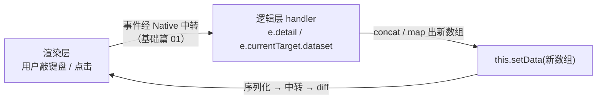

> **小程序实战 · TodoList · 第 3/5 篇**  
> 上一篇：[《画出列表页》](/微信小程序/practice/td-02-list-page)  
> 下一篇：[《删除与组件化》](/微信小程序/practice/td-04-delete-component)

---

## 开头：照片会动，才算应用

第 2 篇结束时，界面已经是 `data` 的照片——**改数组，照片就重拍**。但改数组的只能是你自己（改代码点编译）。TodoList 的本分是让用户来改：打一行字、点一下添加，列表长一条；点一下条目，勾选状态翻一面。

把这个诉求翻译成小程序的语言，就是接通一条完整的链路：



链路上每一站都是基础篇的主角：事件怎么传（[05](/微信小程序/basics/mp-05-events)）、`setData` 为什么是唯一摆渡船（[04](/微信小程序/basics/mp-04-dual-thread-setdata)）。本篇的增量是**把它们第一次串起来**：

| 雪球 | 这一球加上去的 | 验收标准 |
|------|----------------|----------|
| **1** | 输入区 + 受控输入 | `draft` 始终与输入框同步 |
| **2** | 添加 | 校验 → 新数组 → `setData`，列表长一条 |
| **3** | 勾选 | 点击条目，`done` 翻转、样式互换 |

## 一、输入区：先把「受控」讲透

页面顶部加一个输入行（布局样式见成品仓 `index.wxml` 的 `.composer` 区）：

```xml
<view class="composer">
  <input
    class="input"
    value="{{draft}}"
    placeholder="写下一件小事…"
    confirm-type="done"
    bindinput="onDraftInput"
    bindconfirm="onAdd"
  />
  <button class="add-btn" size="mini" type="primary" bindtap="onAdd">添加</button>
</view>
```

`data` 里加一个 `draft: ''`，然后是本节的主角：

```js
onDraftInput(e) {
  this.setData({ draft: e.detail.value })
},
```

**为什么叫受控输入？** 因为输入框的显示值 `value="{{draft}}"` 唯一地来自 `data.draft`，而 `data.draft` 唯一地在 `onDraftInput` 里被键盘事件更新——值的所有权收归逻辑层，界面只是回显。对照「非受控」：不绑 `value`，输入框自己管自己的内容，JS 想拿当前值只能到事件里临时读 `e.detail.value`。

两种写法都能跑，差别在你**要不要在用户输入的过程中介入**：

| 场景 | 受控（绑 value + setData） | 非受控（只听事件） |
|------|---------------------------|-------------------|
| 提交时取值 | `this.data.draft`，随时可读 | 必须自己找个变量存 |
| 输入过程校验 / 截断（如限制字数、过滤表情） | 顺手：改 `draft` 即生效 | 难：界面不归你管 |
| 代价 | 每次击键一次 `setData`（负载一个字符串，很便宜） | 无 |

TodoList 选受控，因为提交后要「清空输入框」——`setData({ draft: '' })` 一句就完成；非受控的话清空界面得借 `<input>` 的原生手段，绕。

## 二、添加：从校验到新数组

```js
onAdd() {
  const text = (this.data.draft || '').trim()
  if (!text) {
    wx.showToast({ title: '先写点内容', icon: 'none' })
    return
  }
  const todos = this.data.todos.concat({
    id: Date.now(),
    text,
    done: false
  })
  this.setData({ todos, draft: '' })
},
```

逐段拆解：

| 段 | 在干什么 | 为什么 |
|----|----------|--------|
| `(this.data.draft \|\| '').trim()` | 兜空值 + 去首尾空格 | `\|\|` 防 `draft` 尚未初始化的极端情况；`trim` 拦住「看着打了字其实全是空格」 |
| `if (!text) { toast; return }` | 空串拦截 | 空待办没有存在意义，**早退**优于后面每一步都判空 |
| `concat({...})` | **生成新数组** | 不改旧数组。为什么非要新的？见下文「不可变更新」 |
| `id: Date.now()` | 毫秒时间戳当身份证 | 教程够用；同一毫秒连点两次理论上会撞——成品仓加了随机后缀 `Date.now() + Math.floor(Math.random() * 1000)` |
| `setData({ todos, draft: '' })` | 一次快递发两个字段 | 新列表上屏 + 输入框清空，**合并成一次** `setData`（基础篇 04 的军规二） |

**为什么坚持 concat/map/filter 出新数组，而不是 `push` 完再 `setData({ todos: this.data.todos })`？** 两个理由：其一，引用没变时你很容易误以为「setData 了但界面没更新」——其实是把同一个引用又发了一遍，排查成本高；其二，新数组让「本次改了什么」一目了然，`todos = old.concat(x)` 读完即懂。这是小程序社区的主流习惯，React/Vue 的使用者也会眼熟。

## 三、勾选：dataset 定位 + map 翻转

行的模板上加 `data-id` 与 `bindtap`：

```xml
<view
  wx:for="{{todos}}"
  wx:key="id"
  class="item {{item.done ? 'is-done' : ''}}"
  data-id="{{item.id}}"
  bindtap="onToggle"
>
  <text class="mark">{{item.done ? '✓' : '○'}}</text>
  <text class="text">{{item.text}}</text>
</view>
```

```js
onToggle(e) {
  const id = e.currentTarget.dataset.id
  const todos = this.data.todos.map((t) =>
    t.id === id ? { id: t.id, text: t.text, done: !t.done } : t
  )
  this.setData({ todos })
},
```

三步读法：

1. **定位**：点击时渲染层把事件连同 `currentTarget.dataset` 一起快递到逻辑层（`data-id` → `dataset.id`，中划线转驼峰的规则见基础篇 05）。`id` 回来了，你就知道用户点的是哪一条——这是第 2 篇坚持给每条待办发「身份证」的回报；
2. **翻转**：`map` 遍历，命中 `id` 的那项**换成一个新对象**（`done: !t.done`），其余项原样返回。同样是不可变更新；
3. **上屏**：`setData({ todos })`，照片重拍，`✓/○` 与删除线互换。

`bindconfirm="onAdd"` 也顺手接上了：手机键盘右下角（`confirm-type="done"` 决定文案）一按，直接走添加，不必非去点按钮——移动端的手感细节。

## 四、实录：五步操作链的真实数据

用 automator 按真实用户路径驱动一遍（输出为实测，环境见第 1 篇；`pendingCount` 是第 5 篇才加的派生字段，本篇跟做时可忽略）：

```text
① 往输入框敲「读完小程序实战篇」
   data.draft = "读完小程序实战篇"          ← 受控输入：每敲一键，draft 就位

② 输入框改成三个空格，点「添加」
   todos.length = 0                        ← trim 拦截，空待办没有出生资格

③ 键盘 confirm 提交「读完小程序实战篇」，再按钮添加「把 TodoList 持久化」
   data.todos = [
     { id: 1787318000513, text: "读完小程序实战篇", done: false },
     { id: 1787318000720, text: "把 TodoList 持久化", done: false }
   ]                                       ← 两条 id 相差 207ms，Date.now() 够用
   添加后 data.draft = ""                   ← 一并清空输入框

④ 点击第一行
   第一条 done: false → true               ← dataset.id 定位 + map 翻转

⑤ 再点第一行
   done: true → false                      ← 可以来回切
```

每一行输出都在链路图上能找到对应的那一站。

## 五、常见坑速查

| 现象 | 根因 | 处理 |
|------|------|------|
| 点了添加没反应 | 只改了 `this.data`，没 `setData` | 数据的每一次变更都要上船（基础篇 04 的反例实验） |
| 输入框里打字，`data.draft` 不变 | 只绑了 `value` 没绑 `bindinput` | 补 `onDraftInput` |
| 点击行无反应 | handler 名拼错 | Console 会有「找不到事件处理函数」类警告，盯一眼 |
| `onToggle` 里 `id` 是 undefined | `data-id` 写成了 `id` | 自定义数据必须走 `data-*` 前缀 |
| 添加的条目点不中 | 行模板漏了 `data-id` 或 `bindtap` | 对照本节模板逐位检查 |

## 小结

- 一次交互 = **事件进（`e.detail` / `dataset`）→ 不可变更新（`concat` / `map`）→ `setData` 出**，本篇把这条链亲手焊了三遍（输入、添加、勾选）；
- 受控输入 = `value` 绑 `data` + `bindinput` 回写，代价是每次击键一次小 `setData`，换来值的所有权；
- 空串拦截放在函数**最前头**早退；多条字段变更合并进同一次 `setData`；
- `id` 是第 2 篇埋的伏笔，本篇靠它完成「用户点的是哪条」的定位——字段设计的回报会延后到。

**思考题**：

1. `onAdd` 里如果不 `trim`，直接 `if (!this.data.draft)`，哪些输入会溜进去？纯空格的待办渲染出来是什么样？
2. 把 `onDraftInput` 里的 `setData` 换成 `this.data.draft = e.detail.value`（配合 `value="{{draft}}"`），打字过程界面会有变化吗？点添加呢？（提示：分别想想「界面回显」和「提交读取」依赖什么。）
3. `Date.now()` 作 id，在什么使用节奏下会真的撞车？成品仓的随机后缀把碰撞概率降了多少数量级？

> **参考**：[input 组件](https://developers.weixin.qq.com/miniprogram/dev/component/input.html)｜[事件系统](https://developers.weixin.qq.com/miniprogram/dev/framework/view/wxml/event.html)｜[合理使用 setData](https://developers.weixin.qq.com/miniprogram/dev/framework/performance/tips/runtime_setData.html)
