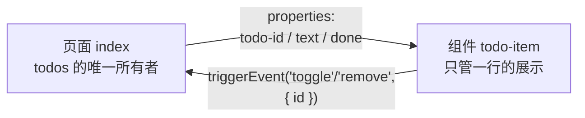

> **小程序实战 · TodoList · 第 4/5 篇**  
> 上一篇：[《新增与完成》](/微信小程序/practice/td-03-add-toggle)  
> 下一篇：[《持久化与收尾》](/微信小程序/practice/td-05-storage-ship)

---

## 开头：页面开始发胖

第 3 篇结束后，`index.wxml` 里躺着输入区 + 列表模板，`index.js` 里挂着三个 handler。TodoList 只有一种行，这样过下去了；但设想一下真实产品的待办行：勾选、文案、删除、置顶角标、长按菜单……全塞进页面，模板和 handler 会一起膨胀，而且这行卡片想复用到别处时，你只能复制粘贴。

小程序对这个问题的答案和所有组件化框架一样：**把一块「结构 + 样式 + 行为」收进自定义组件**。本篇借「删除」这件事把单条待办抽成 `todo-item` 组件——这两个主题放一篇，是因为删除按钮会引爆一个经典问题（**点击穿透 / 冒泡**），而它在组件内外的表现一致，正好一次讲透。

| 雪球 | 这一球加上去的 | 验收标准 |
|------|----------------|----------|
| **1** | 删除 | 点「删」，列表少一条 |
| **2** | `catchtap` 拦截冒泡 | 点「删」**只**触发删除，不会顺手翻转勾选 |
| **3** | `todo-item` 组件 | 列表改用 `<todo-item />`，行为与拆分前一致 |

## 一、先能删：filter + setData

删除的页面侧逻辑和第 3 篇同构——定位 `id`，不可变更新，上屏：

```js
onRemove(e) {
  const id = e.detail.id
  const todos = this.data.todos.filter((t) => t.id !== id)
  this.setData({ todos })
},
```

（`e.detail.id` 而不是 `dataset.id`——组件化后事件来源变了，第三节见。）

## 二、易混点成块：bindtap、catchtap 与一次点击的旅程

行的主体绑了 `bindtap="onToggle"`，删除按钮又需要自己的点击。小程序事件是**冒泡**的：点在「删」上，事件会从删除按钮一路向祖先节点传播，路过行的 `bindtap` 时把它也触发——用户想删一条，结果先勾 / 取消勾一下再删，行为脏了。

`bind` 与 `catch` 的全部区别一句话：**两者都监听并触发 handler，`catch` 额外把传播拦停在此节点**。

```text
点「删」button：
  catchtap（成品采用）         bindtap
  ─────────────────────────   ─────────────────────────
  button: onRemove ✅         button: onRemove ✅
  （传播被拦截）               行 view: onToggle ❌ 误触
```

所以删除按钮必须 `catchtap`：

```xml
<button class="del" size="mini" catchtap="onRemove">删</button>
```

顺带一提：本行的「误触」后果被 `id` 定位部分掩盖了——toggle 的 `map` 找不到已删除的 `id` 就空转，数据看不出错。但「handler 被意外执行」本身就该消灭，别依赖巧合兜底。

## 三、抽组件：四件套 + 一条铁律

新建 `components/todo-item/`，四个同名文件。先立铁律再写代码：

> **数据只能从页面流向组件（属性向下），组件的意图只能通过事件流回页面（事件向上）。组件自己不持有、不修改业务数据。**



为什么定这条规矩？组件如果自己 `setData` 改 `done`，改动只活在组件实例里：页面那份 `todos` 不知道、别的数据源不知道、第 5 篇的持久化更不知道——数据从此有了两份真相。让页面做唯一数据源，组件只当「展示 + 意图收集器」，状态永远可追。

### 3.1 todo-item.json：声明自己是组件

```json
{
  "component": true,
  "usingComponents": {}
}
```

### 3.2 todo-item.js：properties 是组件的入口参数

```js
Component({
  properties: {
    todoId: { type: Number, value: 0 },
    text: { type: String, value: '' },
    done: { type: Boolean, value: false }
  },
  methods: {
    onToggle() {
      this.triggerEvent('toggle', { id: this.data.todoId })
    },
    onRemove() {
      this.triggerEvent('remove', { id: this.data.todoId })
    }
  }
})
```

| 写法 | 是什么 | 为什么 |
|------|--------|--------|
| `properties` | 组件对外声明的入参（类型 + 默认值） | 页面传来什么、组件用什么，一目了然 |
| 属性名用 `todoId` 不是 `id` | 避开与节点 `id` 属性撞名 | 同名时行为易混，社区习惯加前缀 |
| `this.data.todoId` | properties 进来后挂在 `data` 上可读 | 可读，但**不要写**——入口参数该由外部驱动 |
| `triggerEvent('toggle', { id })` | 向上抛事件 + 载荷 | 组件不删数据，只报告「用户想对这条 id 做什么」 |

### 3.3 todo-item.wxml / wxss：模板与样式搬家

```xml
<view class="item {{done ? 'is-done' : ''}}">
  <view class="main" bindtap="onToggle">
    <text class="mark">{{done ? '✓' : '○'}}</text>
    <text class="text">{{text}}</text>
  </view>
  <button class="del" size="mini" catchtap="onRemove">删</button>
</view>
```

注意与拆分前的两处不同：行的 `bindtap` 收窄到内层 `.main`（把删除按钮隔在外面，进一步减少误触面）；模板里不再有 `wx:for` / `item.` 前缀——**组件只渲染一条**，循环是页面的事。原 `.item` / `.is-done` 等样式原样迁入 `todo-item.wxss`（组件样式默认与页面隔离，这正是我们要的）。

## 四、页面接线：登记、传参、改 handler

**登记**（`pages/index/index.json`）：

```json
{
  "usingComponents": {
    "todo-item": "/components/todo-item/todo-item"
  },
  "navigationBarTitleText": "TodoList"
}
```

**替换列表区**（`index.wxml`）：

```xml
<todo-item
  wx:for="{{todos}}"
  wx:key="id"
  todo-id="{{item.id}}"
  text="{{item.text}}"
  done="{{item.done}}"
  bind:toggle="onToggle"
  bind:remove="onRemove"
/>
```

对应关系逐位看：

| 页面写法 | 指向 |
|----------|------|
| `wx:for` + `wx:key` | 循环仍归页面管，每轮把一条 `item` 拆成三个属性喂给组件 |
| `todo-id="{{item.id}}"` | 属性名中划线 ↔ 驼峰互转，接 `properties.todoId` |
| `bind:toggle="onToggle"` | 监听组件抛出的 `toggle` 事件，进入页面的 `onToggle` |

**改 handler**：事件从「页面节点点击」变成了「组件 `triggerEvent`」，取 `id` 的位置从 `e.currentTarget.dataset.id` 换成 `e.detail.id`：

```js
onToggle(e) {
  const id = e.detail.id          // ← 第 3 篇这里是 e.currentTarget.dataset.id
  const todos = this.data.todos.map((t) =>
    t.id === id ? { id: t.id, text: t.text, done: !t.done } : t
  )
  this.setData({ todos })
}
```

## 五、实录：从组件内部真实点击

automator 直接点组件内部节点（自定义组件的边界要用 XPath 穿透查询），输出为实测：

```text
点击组件内 .main（第一行）：
  todos[0].done: false → true
  .stats 文案 = "共 2 项未完成 1"        ← toggle 链路经 triggerEvent 全程走通

再点一次 .main：
  done: true → false，.stats = "共 2 项未完成 2"

点「删」（第一行，删除前其 done = true）：
  剩余 todos.length = 1，幸存那条 done 保持 false
                                          ← catchtap 生效：删除动作没有顺带翻转任何行
```

验收清单（手动同样成立）：点条目完成态来回切换；点「删」该行消失、其余行状态纹丝不动；新添加的条目同样能勾能删。完整代码见成品仓 [`components/todo-item`](https://github.com/code-corey/mp-todolist/tree/master/components/todo-item)。

## 六、拆分前后对照：值不值

| 维度 | 拆分前（第 3 篇） | 拆分后 |
|------|-------------------|--------|
| 页面 wxml | 行模板 + 输入区混在一起 | 一个 `<todo-item />`，页面只剩骨架 |
| 数据所有权 | 页面 | 页面（不变！组件没分走） |
| 复用 | 复制粘贴 | 「已完成」二级页（第 5 篇练习）直接 `<todo-item />` |
| 代价 | —— | 多一层属性 / 事件的翻译，数据流转多读一跳 |

组件化不是免费午餐：本例组件只包一行模板，收益更多是**结构与边界的清晰**。判断标准：一块 UI 有独立内聚的行为、会被复用、或模板复杂到污染页面时，值得抽；否则别急着抽。

## 小结

- 删除 = `filter` 出新数组 + `setData`，与添加 / 勾选同一套「不可变更新」节奏；
- `bindtap` / `catchtap` 一字之差：**catch 拦停冒泡**，删除按钮必须用 catch，别依赖「误触恰好空转」的巧合；
- 组件铁律：**属性向下、事件向上，页面是唯一数据源**——`properties` 声明入参，`triggerEvent` 报告意图，组件不碰业务数据；
- 事件来源变了，取参位置跟着变：页面节点点击读 `e.currentTarget.dataset`，组件事件读 `e.detail`；
- 实测从组件内真实点击 toggle / remove，全链路（含 catchtap 的「无误触」）通过。

**思考题**：

1. 如果组件内部自己 `setData({ done: true })` 而不上抛事件，当时界面会变吗？重启小程序后呢？页面 `.stats` 统计还准吗？——三个问题分别对应组件内部数据的三种「过期」。
2. `todo-item` 的 `properties` 只收 `text / done / todoId` 三个原子值；也可以把整个 `item` 对象作为 `todo="{{item}}"` 传进去。两种传法各失去 / 得到什么？
3. 为什么 `wx:for` 和 `wx:key` 留在页面而不是搬进组件？（提示：谁拥有「全部待办」这个概念？）

> **参考**：[自定义组件](https://developers.weixin.qq.com/miniprogram/dev/framework/custom-component/)｜[组件间通信与事件](https://developers.weixin.qq.com/miniprogram/dev/framework/custom-component/events.html)｜[事件 · bind 与 catch](https://developers.weixin.qq.com/miniprogram/dev/framework/view/wxml/event.html)
