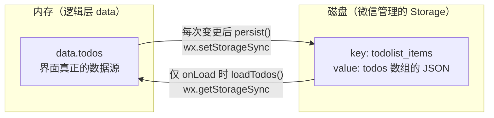

> **小程序实战 · TodoList · 第 5/5 篇**  
> 上一篇：[《删除与组件化》](/微信小程序/practice/td-04-delete-component)  
> 成品仓库：[mp-todolist](https://github.com/code-corey/mp-todolist)  
> 基础理论：[小程序基础系列](/微信小程序/basics/mp-01-what-is-miniprogram)

---

## 开头：一场注定发生的「失忆」

前四篇的 TodoList 已经能增、勾、删，但它有个致命秘密：**所有待办都活在逻辑层的内存里**。用户辛辛苦苦记了十几条，微信一杀后台、手机一重启，`Page` 重新构造，`data.todos` 回到初始值——一切归零。

Web 开发者会脱口而出「存 localStorage」，但小程序的逻辑层没有 DOM、没有 `window`（基础篇 [01](/微信小程序/basics/mp-01-what-is-miniprogram)），localStorage 无从谈起。微信替你准备的原生存储是 `wx.setStorageSync` / `wx.getStorageSync` 这组 API（基础篇 [11](/微信小程序/basics/mp-11-api-permissions) 讲过它在 API 体系中的位置）。

本篇解决三件事：

| 雪球 | 这一球加上去的 | 验收标准 |
|------|----------------|----------|
| **1** | Storage 读写 | 关项目重开（模拟杀进程），列表还在 |
| **2** | `pendingCount` 统计行 | 顶栏实时显示共几项 / 未完成几项 |
| **3** | 收尾清单 | 知道真机预览与上传前要查什么 |

## 一、心智模型：两份拷贝，一次摆渡

Storage 方案的本质是给 `todos` 多安排一份「磁盘拷贝」，并在内存与磁盘之间定好转运规则：



两条规则值得咂摸：

- **写多次，读一次**。每次增删勾都整表写回，简单粗暴；只在 `onLoad` 读一次。对比「每次读磁盘」：Storage 读取是同步阻塞逻辑层线程的，能用内存就用内存；
- **`data.todos` 仍然是唯一数据源**。Storage 不是「另一份真相」，只是它的备份——第 4 篇立的铁律原样延伸到磁盘层。

## 二、代码：装载与写回

约定 key 为 `todolist_items`，页面 JS 里加三个方法（`data` 里同步加 `pendingCount: 0`，`todos` 初始值改回 `[]`——第 2 篇的假数据正式退役）：

```js
const STORAGE_KEY = 'todolist_items'

Page({
  data: { draft: '', todos: [], pendingCount: 0 },

  onLoad() {
    this.loadTodos()
  },

  persist(todos) {
    try {
      wx.setStorageSync(STORAGE_KEY, todos)
    } catch (e) {
      console.log('[todo] setStorageSync fail', e)
    }
  },

  loadTodos() {
    try {
      const cached = wx.getStorageSync(STORAGE_KEY)
      const todos = Array.isArray(cached) ? cached : []
      this.setData({
        todos,
        pendingCount: this.computePending(todos)
      })
    } catch (e) {
      console.log('[todo] getStorageSync fail', e)
    }
  },

  computePending(todos) {
    return todos.filter((t) => !t.done).length
  }
})
```

逐段拆解：

| 段 | 在干什么 | 为什么 |
|----|----------|--------|
| `onLoad() { this.loadTodos() }` | 页面装载时读一次 | `onLoad` 每个页面实例只走一遍，是「从磁盘恢复」的正确时机（时机全家桶见基础篇 [07](/微信小程序/basics/mp-07-lifecycle)） |
| `try / catch` | 兜住存储异常 | 磁盘满、序列化失败都可能抛错；教程选择记日志继续跑，产品可按需提示用户 |
| `Array.isArray(cached) ? cached : []` | 校验形状 | key 不存在时 `getStorageSync` 返回空串 `""`（实测如此），脏数据也一并挡掉——**别把磁盘上的东西直接当真** |
| `pendingCount` 一并 `setData` | 派生统计同批更新 | 见下一节的前车之鉴 |

然后给第 3、4 篇的三个写操作**各补一行**：`onAdd` / `onToggle` / `onRemove` 的 `setData` 之后，都追加 `this.persist(todos)`。以 `onAdd` 为例：

```js
const todos = this.data.todos.concat({ id: nextId(), text, done: false })
this.setData({
  todos,
  draft: '',
  pendingCount: this.computePending(todos)
})
this.persist(todos)
```

## 三、统计行：派生字段的前车之鉴

```xml
<view class="stats">
  <text>共 {{todos.length}} 项</text>
  <text>未完成 {{pendingCount}}</text>
</view>
```

`todos.length` 模板里现算，`pendingCount` 为什么不能也写 `{{todos.filter(...)}}`？——`{{}}` 里**不能调函数**（渲染层跑不了逻辑层的代码，基础篇 03 的铁律），所以派生值必须在逻辑层算好、随数据一起上船。

这里有个实测翻车现场可以当教材。用 automator 直接往页面注入 3 条 todos（2 完成 1 未完成），**没**同步更新 `pendingCount`，统计行立刻自相矛盾：

```text
注入 3 条（2 done / 1 未完成）后：
  .stats 文案 = "共 3 项未完成 2"      ← 长度对，未完成数还是旧值 2
```

教训：**派生字段没有独立生命，必须跟数据源同批 `setData`**。这也是成品仓把 `computePending(todos)` 塞进每次更新的原因。

## 四、实录：冷启动回读 + 磁盘上的真相

**实验一：关掉再开。** 加两条待办（其中一条勾为完成），然后关闭项目、重新打开——对小程序而言等于一次冷启动，`Page` 重新构造、`onLoad` 重新执行。输出为实测：

```text
冷启动前 storage:
  [ { id: 1787318000720, text: "把 TodoList 持久化", done: false },
    { id: 1787318145563, text: "冷启动后我还在",   done: false } ]

─── 关闭项目 → 重新打开 ───

冷启动后 page.data():
  todos: 同上两条，原样回归
  __webviewId__: 4 → 5                      ← 界面实例换了新的，不是原来的页面
  .stats 文案 = "共 2 项未完成 2"
```

`__webviewId__` 从 4 变 5 是「确实是新页面实例」的铁证——数据不是「没丢」，而是**从磁盘重新装载**了一遍。

**实验二：看看磁盘。** 工具里 Storage 的落盘位置（Windows，用户数据目录）：

```text
WeappSimulator/WeappStorage/storage_2014598104_o6zAJs1….json

{
  "0": {
    "todolist_items": {
      "data": "[{\"id\":1787318000720,\"text\":\"把 TodoList 持久化\",\"done\":false},…]",
      "dataType": "Array"
    }
  },
  "2": {}
}
```

两个耐人寻味的细节：文件名里带着 AppID 相关的数字和用户 openid——**存储按 AppID + 用户隔离**，同目录下另外两个不同数字开头的文件属于另外两个小程序实验仓，互不可见（这正是思考题 3 的实锤）；`data` 字段就是数组序列化后的 JSON 字符串。真机上的物理实现不同（iOS / Android 各自的存储介质），但对开发者暴露的 API 与隔离语义一致——**写接口而非写实现**。

## 五、易混点：Sync 还是 Async

| | `wx.setStorageSync` | `wx.setStorage` |
|--|---------------------|-----------------|
| 调用形态 | 同步阻塞，直接拿返回值 / 抛异常 | 异步，`success / fail` 回调或 Promise |
| 卡不卡逻辑层 | 数据大时**卡**（JS 线程等磁盘） | 不卡，写完回调 |
| 适合 | 小数据、启动装载、教程 / 工具类 | 数据量大、写频繁的场景 |

TodoList 每次写的只是一串小数组，Sync 的简单胜出（官方文档也建议：数据量不大时用 Sync）。哪天真要存富文本草稿 + 图片 base64，再换异步版本，接口名只差去掉 `Sync`。

## 六、上线前检查清单

- [ ] 把 `project.config.json` 的 `appid` 换成**你自己的**（测试号 / 正式 AppID，见第 1 篇的选型表）；
- [ ] 真机预览走一遍：添加 → 勾选 → 删除 → 杀微信进程 → 重开，验证 Storage 在真机语义下同样存活；
- [ ] 本实战**无网络请求**，不必配置服务器域名白名单（`urlCheck` 保持 true 也不影响）；
- [ ] 上传时备注写清版本（如 `1.0.0`），后续迭代有据可查；
- [ ] 只给自己用的话，开发版预览扫码即可，不必走审核——发布全链路见基础篇 [14](/微信小程序/basics/mp-14-publish)。

## 七、五篇回望：一条链终于闭合

| 篇 | 做的事 | 用到的机制 | 对应基础篇 |
|----|--------|-----------|-----------|
| 01 | 空白工程跑起来 | 工程结构、AppID、app.json | 01 / 02 |
| 02 | 数组长成列表 | `{{}}`、`wx:for`、`wx:key`、rpx | 03 |
| 03 | 增与勾 | 事件、dataset、`setData` | 04 / 05 |
| 04 | 删与组件化 | `catchtap`、properties / `triggerEvent` | 05 / 10 |
| 05 | 持久化 | Storage、`onLoad` 时机、Sync/Async | 07 / 11 |

想继续加料（练习向，本系列不展开）：编辑文案、清空已完成、拆「已完成」二级页（练路由与页面栈，基础篇 [06](/微信小程序/basics/mp-06-routing-page-stack)）；要多人同步就上云开发——那需要引入网络与后端，是另一整条战线。

## 小结

- 持久化 = **两份拷贝一次摆渡**：`onLoad` 读一次，每次变更后整表写回；`data.todos` 仍是唯一数据源，Storage 只是备份；
- 读回来的数据要校验形状（key 不存在返回 `""`，实测如此）；派生统计字段必须与数据源**同批 `setData`**，否则统计行会用旧值自欺欺人；
- 实测冷启动 `__webviewId__` 翻新、数据原样回归；工具里落盘为按 **AppID + 用户隔离**的 JSON 文件；
- 小数据用 Sync，大 / 频用 Async；上线前过一遍清单（AppID、真机、域名、版本备注）。

**思考题**：

1. 用户在微信里「清除小程序数据」后，Storage 会怎样？若要「云端备份」还缺哪一层？（提示：需要账号 + 服务器，即第 11 篇的 `wx.request` 世界。）
2. 为什么装载放在 `onLoad` 而不是 `onShow`？放到 `onShow` 的话，从二级页返回时会发生什么多余的事？（`onShow` 每次都触发，基础篇 07。）
3. 同一部手机上两个不同 AppID 的小程序都往 key `todolist_items` 写数据，会互相覆盖吗？——本文实验二已经给了答案，说出依据。

> **参考**：[本地缓存 wx.setStorageSync](https://developers.weixin.qq.com/miniprogram/dev/api/storage/wx.setStorageSync.html)｜[wx.setStorage（异步版）](https://developers.weixin.qq.com/miniprogram/dev/api/storage/wx.setStorage.html)｜[生命周期 · onLoad/onShow](https://developers.weixin.qq.com/miniprogram/dev/framework/app-service/page-life-cycle.html)｜成品：[mp-todolist](https://github.com/code-corey/mp-todolist)
