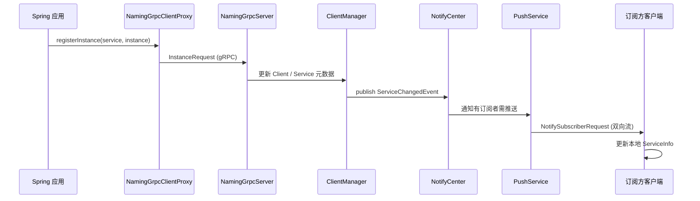

> **微服务 · Nacos · 第 1/3 篇**  
> 上一篇：[《Spring Cloud Alibaba 实战总结与组件地图》](/微服务/springcloud/sca-02-practice-summary)  
> 下一篇：[《Nacos 2.x gRPC Client/Server 初始化》](/微服务/nacos/nacos-02-grpc)

---

## 开头：Nacos 2.x 为什么把 HTTP 换成了 gRPC？

[SCA 实战总结篇](/微服务/springcloud/sca-02-practice-summary) 已经把 Nacos 放在注册中心 + 配置中心的位置；本篇进入 **Nacos 2.x 命名服务（Naming）内核**，回答一个源码级问题：**客户端注册实例、订阅服务、接收推送，在 2.x 里究竟走哪条链路？**

> **说明：本篇以课件架构图源码图为主线。** OCR 文本极少，下文结合 Nacos 2.x 公开源码与图示结构展开；gRPC 连接建立细节见 [第 2 篇](/微服务/nacos/nacos-02-grpc)，配置中心见 [第 3 篇](/微服务/nacos/nacos-03-config-center)。

**源码调试提示：** 导入 Nacos 2.x 源码到 IDEA 时，Maven 版本建议 **3.5.4+**，否则部分模块可能解析失败。

---

## 一、2.x 相对 1.x 的核心变化

| 维度 | Nacos 1.x | Nacos 2.x |
|------|-----------|-----------|
| 客户端 ↔ 服务端通信 | HTTP 短连接 + UDP 推送 | **gRPC 长连接**（默认端口 9848 = HTTP 8848 + 1000） |
| 实例变更通知 | UDP 推 + 客户端定时拉 | **gRPC 双向流** + 服务端 Push 引擎 |
| 连接模型 | 无统一 Connection 抽象 | `ConnectionBasedClientManager` 按连接管理客户端 |

2.x 并非简单「换协议」，而是把 **连接生命周期、事件总线、推送任务** 串成一条完整链路——这正是下面架构图要表达的内容。

---

## 二、整体架构图（diagram-led）

下图是 Nacos 2.x **命名服务**从客户端注册到服务端推送的全链路。建议对照源码包 `com.alibaba.nacos.naming` 与 `com.alibaba.nacos.core.remote` 阅读。


### 2.1 客户端侧：从 Spring 到 NamingGrpcClientProxy

**入口（Spring Cloud 集成）：**

1. 应用启动 → `NacosServiceRegistry.register()`  
2. 委托 `NamingService.registerInstance()`  
3. 2.x 默认走 **`NamingGrpcClientProxy`**（实现 `NamingClientProxy`）

**关键类职责：**

| 类 | 职责 |
|----|------|
| `NamingService` | 对外 API：注册、注销、订阅、查询 |
| `NamingClientProxyDelegate` | 代理委托，按协议选择 gRPC/HTTP 实现 |
| `NamingGrpcClientProxy` | gRPC 注册、订阅、心跳 |
| `RpcClient` / `RpcClientFactory` | 底层 gRPC 客户端：建连、重连、健康检查 |

客户端在 `NamingGrpcClientProxy` 构造时即创建 `RpcClient` 并 `start()`，建立与 Server 的 **长连接 + 双向流**——具体线程模型与 `connectToServer` 流程见 [gRPC 初始化篇](/微服务/nacos/nacos-02-grpc)。

### 2.2 服务端侧：gRPC 接入与 RequestHandler 路由

服务端由 **`NamingGrpcServer`**（继承 `BaseGrpcServer`）在 9848 端口启动 Netty gRPC 服务：

1. **`GrpcRequestAcceptor.request`**：处理普通 RPC（如 `InstanceRequest`）  
2. **`GrpcBiStreamRequestAcceptor`**：处理双向流，创建 `GrpcConnection`  
3. **`RequestHandlerRegistry`**：启动时扫描所有 `RequestHandler` 实现，按 `requestType` 注册——类似 Spring MVC 的 Controller 映射

**典型 Handler：**

- `InstanceRequestHandler` — 实例注册/注销  
- `SubscribeServiceRequestHandler` — 订阅服务  
- `ServiceQueryRequestHandler` — 查询实例列表  

### 2.3 ClientManager：以连接为中心的客户端模型

2.x 服务端用 **`ClientManager`**（默认 `ConnectionBasedClientManager`）管理客户端：

```
gRPC 连接建立
  → GrpcConnection 注册到 ConnectionManager
  → ClientManager.registerClient(connectionId, client)
  → clients Map 维护 connectionId → Client 映射
```

**Client** 抽象封装了：该连接订阅了哪些服务、持有哪些实例信息。连接断开时触发 `ClientDisconnectEvent`，对应实例标记不健康并进入推送链路。

### 2.4 事件通知机制（架构图红色区域）

注册/注销/心跳超时等操作不会直接「改完就完」，而是发布 **领域事件**，经 **`NotifyCenter`** 异步分发：

| 事件 | 典型触发 |
|------|----------|
| `ServiceChangedEvent` | 某服务的实例列表变更 |
| `ClientOperationEvent` | 客户端订阅/取消订阅 |
| `InstancesChangeEvent` | 实例上下线 |

订阅者包括 **`NamingSubscriberService`**、**`PushService`** 等——事件驱动保证了 **注册写入与推送解耦**，避免在 RequestHandler 里同步阻塞推送。

### 2.5 推送链路：PushService 与延迟任务

当服务实例变更且存在订阅者时：

1. `PushService` 收到变更通知  
2. 构造 **`PushDelayTask`**，放入延迟队列（`PushDelayTaskProcessor` 消费）  
3. 合并短时间内的多次变更，减少推送风暴  
4. 通过已建立的 **gRPC 双向流** 向客户端发送 `NotifySubscriberRequest`  
5. 客户端 `NamingGrpcClientProxy` 收到后更新本地 `ServiceInfo` 缓存，触发 `EventListener`

> **设计要点：** 推送走 **已有长连接**，不再依赖 1.x 的 UDP；延迟合并则平衡实时性与集群负载。

---

## 三、一次「注册实例」的完整时序



---

## 四、与配置中心模块的边界

| 模块 | 包路径（大致） | 通信 |
|------|----------------|------|
| **Naming（本篇）** | `naming/` | gRPC 9848 |
| **Config** | `config/` | gRPC + HTTP（配置拉取与长轮询） |

两者共用 `core/remote` 的 gRPC 基础设施（`BaseGrpcServer`、`RpcClient`），但业务 Handler 与存储模型完全分离。配置中心源码见 [nacos-03-config-center](/微服务/nacos/nacos-03-config-center)。

---

## 五、调试与延伸阅读

| 资源 | 说明 |
|------|------|
| [ProcessOn：Nacos 2.x 核心架构](https://www.processon.com/view/link/62f9158bf346fb3f1bff34ae) | 课件原版架构图 |
| Nacos GitHub `naming` 模块 | 建议从 `InstanceRequestHandler` 打断点 |
| [gRPC 初始化篇](/微服务/nacos/nacos-02-grpc) | Client/Server 建连细节 |

---

## 本篇小结

1. **Nacos 2.x 命名服务**以 gRPC 长连接为核心，替代 1.x HTTP + UDP 组合。  
2. 服务端 **`ClientManager` + 事件总线 + PushService** 构成「写入 → 通知 → 推送」闭环。  
3. 架构图是阅读源码的「地图」；下一篇 zoom in 到 **RpcClient 建连与 GrpcServer 启动** 两条初始化链路。
