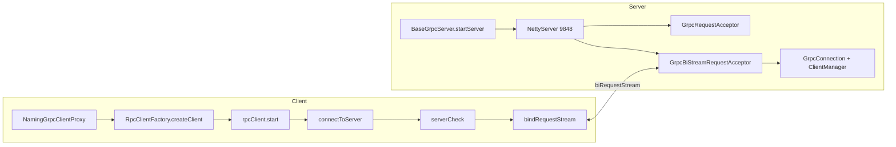

> **微服务 · Nacos · 第 2/3 篇**  
> 上一篇：[《Nacos 2.x 核心架构源码剖析》](/微服务/nacos/nacos-01-architecture)  
> 下一篇：[《Nacos 2.x 配置中心源码分析》](/微服务/nacos/nacos-03-config-center)

---

## 开头：9848 端口上的长连接是怎么建起来的？

[架构篇](/微服务/nacos/nacos-01-architecture) 梳理了 Naming 全链路；本篇 **zoom in** 到 gRPC 基础设施的两端初始化：**Client 如何建连、保活、重连**，**Server 如何启动 Netty、注册 Handler、接受双向流**。

> **说明：本篇完全 diagram-led。** 课件仅保留两张 ProcessOn 源码流程图，下文按图示结构结合 Nacos 2.x 源码展开。

| 图 | ProcessOn 原链 |
|----|----------------|
| grpcClient 初始化 | [link](https://www.processon.com/view/link/62f915b507912961358283b6) |
| grpcServer 启动 | [link](https://www.processon.com/view/link/62f915cb7d9c086a8f568ecd) |

---

## 一、gRPC Client 初始化


### 1.1 入口：NamingGrpcClientProxy

Spring Cloud 注册实例时，最终进入 **`NamingGrpcClientProxy`**。其构造阶段完成：

```java
// 概念性调用链（简化）
this.rpcClient = RpcClientFactory.createClient(
    uuid, clientName, serverListFactory, ...);
this.rpcClient.start();
```

`RpcClientFactory` 根据模块创建 **`GrpcClient`**（Naming / Config 各有一套 clientName，但底层机制相同）。

### 1.2 RpcClient.start()：线程池与三条支线

`start()` 内部创建 **`clientEventExecutor`** 线程池，并提交三个长期运行的任务：

| 任务 | 职责 |
|------|------|
| **connectToServer 循环** | 向 Server 列表发起连接，成功则绑定双向流 |
| **eventLinkedBlockingQueue 消费** | 处理 CONNECTED / DISCONNECTED 事件，回调 `notifyConnected()` |
| **reconnectionSignal 消费** | 处理重连信号；空闲时执行 **healthCheck**（默认约 5s 一次） |

这种「**一个连接线程 + 一个事件/健康线程**」的模型，把网络 I/O 与状态机解耦，避免在业务线程里阻塞 gRPC。

### 1.3 connectToServer：端口、ServerCheck、双向流

**端口计算（图示黄色注释）：**

```
gRPC 端口 = serverInfo.getServerPort() + rpcPortOffset()
默认 offset = 1000  →  8848 + 1000 = 9848
```

**连接步骤：**

1. **`serverCheck`**：通过 `requestBlockingStub.request(grpcRequest)` 同步探测目标节点是否存活  
2. **成功** → **`bindRequestStream`**：调用 `streamStub.requestBiStream`，与 Server 端 `GrpcBiStreamRequestAcceptor` 建立 **双向流**  
3. **CONNECTED 事件**入队 → 设置 `connectionActive = true`  
4. **失败** → `switchServerAsync` 切换下一节点，并向 `reconnectionSignal` 投递 `ReconnectContext`

### 1.4 健康检查与重连

- **healthCheck**：定时向 Server 发送健康探测（Server 侧 `HealthCheckRequestHandler`）  
- **失败** → 触发重连流程，回到 `connectToServer`  
- **Server 列表**来自 `ServerListFactory`（Nacos 集群地址配置 / 服务端返回的 peers）

> **实战提示：** 客户端连不上 9848 但 8848 正常，多半是防火墙未放行 gRPC 端口，或混用了只支持 1.x HTTP 的旧客户端。

---

## 二、gRPC Server 启动


### 2.1 BaseGrpcServer.startServer()

Naming 与 Config 各自继承 **`BaseGrpcServer`**（如 `NamingGrpcServer`）。启动链：

```
start()
  → BaseGrpcServer.startServer()
  → 读取 nacos_grpc_service.proto 定义的服务
  → 注册 ServerInterceptor（提取 connectionId、客户端 IP/端口）
  → addServices(handlerRegistry, serverInterceptor)
  → 绑定端口（默认 9848）
  → NettyServer.start()
```

**Proto 定义的两种调用：**

| RPC 类型 | 用途 |
|----------|------|
| `Request.request` | 单次请求-响应（注册、查询、健康检查等） |
| `BiRequestStream.biRequestStream` | **双向流**，承载推送与长连接 |

### 2.2 RequestHandlerRegistry：类似 Spring MVC 的 Handler 映射

Server 启动早期，`RequestHandlerRegistry` 作为 **`ApplicationListener`** 监听容器就绪事件：

1. 扫描所有 **`RequestHandler`** 实现类  
2. `registryHandlers.putIfAbsent(requestType, handler)`  
3. 运行时 `GrpcRequestAcceptor` 根据 `grpcRequest.getMetadata().getType()` 路由到对应 Handler

**示例映射：**

| requestType | Handler |
|-------------|---------|
| `InstanceRequest` | `InstanceRequestHandler` |
| `SubscribeServiceRequest` | `SubscribeServiceRequestHandler` |
| `ConfigQueryRequest` | Config 模块对应 Handler |

### 2.3 双向流接入：GrpcBiStreamRequestAcceptor

客户端 `bindRequestStream` 对应 Server 侧：

```
GrpcBiStreamRequestAcceptor.biRequestStream
  → ServerCalls.asyncBidiStreamingCall
  → new GrpcConnection(metaInfo, responseObserver, ...)
  → connectionManager.register(connectionId, connection)
  → notifyClientConnected → ClientManager.clientConnected
  → clients.computeIfAbsent(connectionId, ...)
```

**GrpcConnection** 封装了 `StreamObserver`，后续 `PushService` 通过该连接向客户端推送 `NotifySubscriberRequest`。

### 2.4 ServerInterceptor 的作用

拦截器在每次 RPC 进入 Handler 前，从 metadata 解析：

- **connectionId** — 连接唯一标识  
- **客户端 IP / 端口** — 用于审计与 Client 元数据  

这些信息写入 **`RequestMeta`**，供 Handler 与 ClientManager 使用。

---

## 三、Client 与 Server 初始化对照



---

## 四、与架构篇的衔接

| 阶段 | 本篇 | [架构篇](/微服务/nacos/nacos-01-architecture) |
|------|------|---------------------------------------------|
| 建连 | RpcClient + 双向流 | 全链路中的一环 |
| 注册 | InstanceRequest 走 GrpcRequestAcceptor | InstanceRequestHandler → 事件 → Push |
| 推送 | GrpcConnection 作为推送通道 | PushService → NotifySubscriberRequest |

Config 模块复用同一套 `GrpcClient` / `BaseGrpcServer`，但 Handler 与端口共用策略略有差异，详见 [配置中心篇](/微服务/nacos/nacos-03-config-center)。

---

## 本篇小结

1. **Client**：`RpcClient.start()` 启动建连、事件、健康检查三线程序；gRPC 端口 = HTTP + 1000。  
2. **Server**：`BaseGrpcServer` 启动 Netty；`RequestHandlerRegistry` 完成请求路由；双向流创建 `GrpcConnection` 并注册到 `ClientManager`。  
3. 两张源码图是调试 **连接问题**（连不上、频繁重连、推送收不到）时的首选地图。
