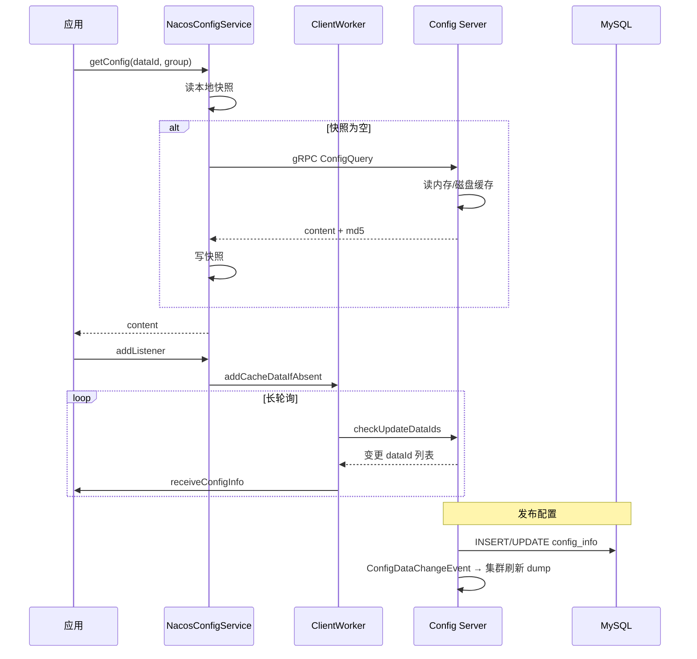

> **微服务 · Nacos · 第 3/3 篇**  
> 上一篇：[《Nacos 2.x gRPC Client/Server 初始化》](/微服务/nacos/nacos-02-grpc)  
> 下一篇：[《Sentinel 核心架构源码剖析》](/微服务/sentinel/sentinel-01-architecture)

---

## 开头：配置是怎么「拉一次、听 forever」的？

Naming 篇讲的是 **服务实例**；配置中心解决另一问题：**应用如何拿到远端配置，并在控制台改一行 YAML 后自动生效？**

本篇基于 Nacos **2.1.0** 配置模块源码，梳理 **Client 拉取与监听**、**Server dump 与发布** 两条主线。架构总览以课件 ProcessOn 图为准（见下文大图），文字部分补充 PDF 课件中的关键结论。

| 资源 | 链接 |
|------|------|
| 配置中心架构 ProcessOn | [link](https://www.processon.com/view/link/62d678c31e08531cf8db16ef) |
| ConfigService 核心接口笔记 | [有道笔记](https://note.youdao.com/s/co0GN9VS) |

---

## 一、配置中心整体架构


**三层结构：**

| 层次 | 核心类 | 职责 |
|------|--------|------|
| **Spring 集成** | `NacosPropertySourceLocator`、`PropertySourceBootstrapConfiguration` | 启动早期把 Nacos 配置注入 `Environment` |
| **Client** | `NacosConfigService`、`ClientWorker` | 拉取、本地快照、长轮询、Listener 回调 |
| **Server** | `ConfigController`、`DumpService`、`AsyncNotifyService` | 持久化 MySQL、本地文件缓存、集群通知 |

与 Naming 共用 [gRPC 基础设施](/微服务/nacos/nacos-02-grpc)，但配置读写走 **`ConfigQueryRequest`** 等专用 Handler，并保留 HTTP Open API（控制台 / SDK）。

---

## 二、Config Client：从 Demo 到生产

### 2.1 ConfigService 基本用法

课件 Demo 展示了 **`ConfigService`** 四大能力：获取、监听、发布、删除。

```java
Properties properties = new Properties();
properties.put(PropertyKeyConst.SERVER_ADDR, "localhost");
ConfigService configService = NacosFactory.createConfigService(properties);

// 获取配置
String content = configService.getConfig(dataId, group, 5000);

// 注册监听器
configService.addListener(dataId, group, new Listener() {
    @Override
    public void receiveConfigInfo(String configInfo) {
        System.out.println("===recieve:" + configInfo);
    }
    @Override
    public Executor getExecutor() {
        return null; // null 表示在 ClientWorker 线程回调
    }
});

// 发布 properties 格式配置
configService.publishConfig(dataId, group, "common.age=30",
    ConfigType.PROPERTIES.getType());
```


### 2.2 getConfig：本地优先，远端兜底

**核心实现类：`NacosConfigService#getConfig`**

读取顺序（课件与源码一致）：

1. **本地 Failover 文件**（人工放置的应急配置）  
2. **本地快照**（`~/nacos/config/` 下上次成功拉取的缓存）  
3. **远端 gRPC 拉取**，成功后 **写入本地快照**


> **设计意图：** 保证 Nacos Server 短暂不可用时，Client 仍能用 **快照** 启动；Failover 则用于运维强制覆盖。

### 2.3 注册 Listener：CacheData 与 cacheMap

配置变更回调依赖 **`ClientWorker`**：

- `addListener` / `getConfigAndSignListener` 内部均调用 **`addCacheDataIfAbsent`**
- 每个 `(dataId, group, tenant)` 对应一个 **`CacheData`** 实例
- 所有 `CacheData` 保存在 `ClientWorker` 的 **`AtomicReference<Map<String, CacheData>> cacheMap`**

**CacheData 核心成员：**

| 成员 | 作用 |
|------|------|
| `dataId` / `group` / `tenant` | 配置三元组 |
| `listeners` | 注册的 `Listener` 集合 |
| `md5` | 当前配置内容摘要，用于变更检测 |
| `taskId` | 长轮询任务标识 |


**长轮询：** `ClientWorker` 后台线程对 `cacheMap` 中的 `CacheData` 发起 **`checkUpdateDataIds`**（2.x 走 gRPC），Server Hold 请求直到配置变更或超时，Client 收到变更后拉取新内容并 **`receiveConfigInfo`** 回调。

---

## 三、Config Server：Dump 与发布

### 3.1 启动时 DumpService.init

服务端 **不会每次查询都打 MySQL**。启动时 **`DumpService#init`**：

1. 从 **MySQL** `config_info` 等表加载配置  
2. 写入 **本地磁盘**（`config-data` 目录）  
3. 将 **MD5** 等元信息缓存在 **内存**

**全量 vs 增量 dump（课件要点）：**

| 模式 | 触发条件 | 行为 |
|------|----------|------|
| **全量 dump** | 心跳文件显示上次心跳 **超过 6h** | 清空磁盘缓存 → 按主键 ID 每次 1000 条刷入磁盘 + 内存 |
| **增量 dump** | 6h 内心跳 | 捞最近 **6h** 变更（含删除）→ 刷新内存与文件 → 再与 DB 全量比对补漏 |

增量 dump 减少 DB I/O 与磁盘写入，适合集群节点频繁重启的场景。


### 3.2 发布配置：Controller → MySQL → 事件 → gRPC 通知

**入口：`ConfigController#publishConfig`**

1. 请求打到集群中 **某一节点**  
2. 该节点将配置 **持久化到 MySQL**  
3. 发布 **`ConfigDataChangeEvent`**  
4. 通过 **gRPC** 通知集群所有节点（含自身）刷新本地文件与内存  
5. 各节点 Client 长轮询返回 → 触发 Listener → Spring **`@RefreshScope` / `@NacosValue`** 等刷新


> **一致性模型：** MySQL 是 **Source of Truth**；各 Server 节点通过 **事件 + dump** 保持本地缓存最终一致；Client 通过长轮询感知变更，属于 **准实时** 而非强一致。

---

## 四、Spring Cloud 集成要点

**启动顺序：**

```
SpringApplication.run
  → Bootstrap Context
  → NacosPropertySourceLocator.locate
  → NacosConfigService.getConfig（走上述本地/远端逻辑）
  → NacosPropertySource 加入 Environment
  → 主 Context 刷新，@Value / @NacosConfigurationProperties 注入
```

**动态刷新：** 配置变更 → Listener → Spring Cloud Alibaba 的 **`NacosContextRefresher`** → 发布 `EnvironmentChangeEvent` → 重建 `@RefreshScope` Bean。

---

## 五、Client / Server 对照时序



---

## 本篇小结

1. **Client**：`getConfig` 本地快照优先；`ClientWorker` + `CacheData` + 长轮询驱动 Listener。  
2. **Server**：`DumpService` 启动加载 MySQL → 本地磁盘 + 内存；发布走事件通知集群。  
3. 配置中心与 Naming **共享 gRPC 层**但业务独立；读完本篇可继续 [Sentinel 架构篇](/微服务/sentinel/sentinel-01-architecture)。
