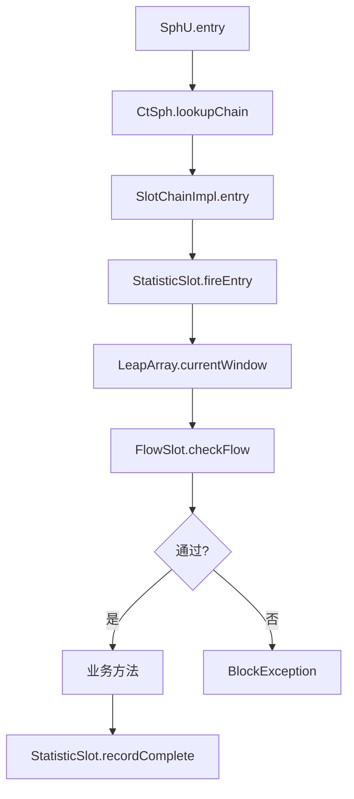

> **微服务 · Sentinel · 第 1/1 篇**  
> 上一篇：[《Nacos 2.x 配置中心源码分析》](/微服务/nacos/nacos-03-config-center)  
> 下一篇：[《Seata 内核源码深化：与分布式专栏互补》](/微服务/seata/seata-kernel-01-source)

---

## 开头：限流算法很多，Sentinel 为什么选滑动窗口？

[Nacos 三篇](/微服务/nacos/nacos-01-architecture) 解决了 **服务发现与配置**；流量进来之后，需要 **限流、熔断、降级**——这是 **Sentinel** 的主场。

本篇分两部分：先精讲课件中的 **四种经典限流算法**（为理解 Sentinel 统计模型打基础），再概述 **Sentinel 源码架构**（Slot Chain、LeapArray、规则管理）。架构细节以课件 ProcessOn / 有道笔记为延伸。

| 资源 | 说明 |
|------|------|
| VIP 笔记 | [Sentinel 限流、熔断降级源码剖析](http://note.youdao.com/noteshare?id=19206aab917935d3a101fa94d2b68700) |

---

## 一、四种限流算法精讲

Sentinel 的 QPS 统计与流控决策，底层是 **滑动窗口**（`LeapArray`）。先把四种算法的直觉与 trade-off 讲清楚。

### 1.1 计数器法（固定窗口）

**规则示例：** 接口 A 每分钟最多 100 次请求。

**做法：** 维护 `counter` 与窗口起始时间 `timeStamp`。请求到来 `counter++`；若 `counter > limit` 且仍在 1 分钟窗口内 → 拒绝；若窗口过期 → 重置 `counter`。

```java
public class Counter {
    public long timeStamp = System.currentTimeMillis();
    public int reqCount = 0;
    public final int limit = 100;
    public final long interval = 1000 * 60;

    public boolean limit() {
        long now = System.currentTimeMillis();
        if (now < timeStamp + interval) {
            reqCount++;
            return reqCount <= limit;
        } else {
            timeStamp = now;
            reqCount = 1;
            return true;
        }
    }
}
```

**缺点：** 窗口边界可能 **双倍突发**（例如 0:59 打满 100 + 1:00 再打满 100）。


### 1.2 滑动时间窗口（Rolling Window）

**思路：** 把大窗口切成多个 **小格子**（bucket），窗口随时间 **右滑**，每个格子独立计数；统计时汇总窗口内所有格子的计数。

**示例：** 1 分钟窗口切 6 格 → 每格 10 秒。请求在 0:35 到达 → 0:30~0:39 对应格子的 counter +1。


> **精度 trade-off：** 格子越多，滚动越平滑、统计越精确，但存储与汇总开销越大。**计数器法 = 只有 1 格的滑动窗口。**

课件伪代码用 `LinkedList<Long> slots` 保存各格累计值，后台线程每 100ms 滑动一次，比较首尾差值是否超过阈值——这是教学简化版；Sentinel 生产实现见下文 **LeapArray**。

### 1.3 漏桶算法（Leaky Bucket）

**模型：** 固定容量桶 + 固定 **出水速率**。请求像水流 **入桶**；桶满则 **溢出拒绝**；出水以 **恒定 rate** 处理请求。


```java
public class LeakyBucket {
    public long capacity;   // 桶容量
    public long rate;       // 每秒处理请求数（出水速率）
    public long water;      // 当前水量
    public long timeStamp = System.currentTimeMillis();

    public boolean limit() {
        long now = System.currentTimeMillis();
        water = Math.max(0, water - ((now - timeStamp) / 1000) * rate);
        timeStamp = now;
        if (water + 1 < capacity) {
            water += 1;
            return true;
        }
        return false;
    }
}
```

**特点：** 输出速率 **严格平滑**，天生避免临界双倍问题；但不允许合理 **突发**（来得再快也要排队漏出）。

### 1.4 令牌桶算法（Token Bucket）

**模型：** 以固定速率 **r** 向桶内放令牌，桶满丢弃多余令牌；请求到达 **取 1 枚令牌**，无令牌则拒绝。


```java
public class TokenBucket {
    public long capacity;
    public long rate;
    public long tokens;
    public long timeStamp = System.currentTimeMillis();

    public boolean grant() {
        long now = System.currentTimeMillis();
        tokens = Math.min(capacity, tokens + (now - timeStamp) * rate);
        timeStamp = now;
        if (tokens < 1) {
            return false;
        }
        tokens -= 1;
        return true;
    }
}
```

**与漏桶对比：** 令牌桶 **允许突发**——桶内攒够 100 枚令牌时，可瞬间通过 100 个请求（取令牌无耗时）。

### 1.5 算法小结

| 对比 | 结论 |
|------|------|
| **计数器 vs 滑动窗口** | 计数器是低精度滑动窗口；滑动窗口更准，占用更多 bucket 存储 |
| **漏桶 vs 令牌桶** | 漏桶输出恒速、抑制突发；令牌桶允许可控突发 |
| **Sentinel 的选择** | QPS / 并发统计用 **滑动窗口（LeapArray）**；流控效果上 **直接拒绝 / 匀速排队** 对应不同策略，与漏桶/令牌桶思想相通 |

---

## 二、Sentinel 核心架构

### 2.1 总体模型

```
资源调用 SphU.entry("resourceName")
  → Slot Chain（责任链）
      NodeSelectorSlot    → 选择链路节点
      ClusterBuilderSlot  → 构建调用树
      StatisticSlot       → 统计 QPS/RT/异常（LeapArray）
      FlowSlot            → 流控规则检查
      DegradeSlot         → 熔断降级
      ...
  → 通过则执行业务；BlockedException 则降级/快速失败
```

**关键抽象：**

| 概念 | 说明 |
|------|------|
| **Resource** | 受保护的资源名（URL、方法、自定义字符串） |
| **Context** | 调用上下文（entrance node、origin） |
| **Node** | 统计树节点：DefaultNode → ClusterNode |
| **Rule** | `FlowRule`、`DegradeRule`、`SystemRule` 等 |

### 2.2 StatisticSlot 与 LeapArray

**StatisticSlot** 在调用前后更新 **Pass / Block / Exception / RT** 等指标。底层 **`LeapArray`** 即滑动窗口：

- 固定 **sampleCount** 个 bucket，覆盖 **intervalInMs** 时间范围  
- 每个 `WindowWrap<MetricBucket>` 存储一个时间片的计数  
- 新请求根据 `timeMillis` 计算 bucket 索引，过期 bucket 重置  

这与上文滑动窗口图 **一一对应**——Sentinel 用数组 + 取模替代 LinkedList，避免频繁分配。

### 2.3 FlowSlot：流控规则

**FlowRule** 支持：

- **QPS 或并发线程数** 阈值  
- **直接拒绝**、**Warm Up**（冷启动，令牌桶思想）、**匀速排队**（漏桶思想）  
- **流控效果** + **调用来源** + **集群流控**（Token Server）

规则存在 **`FlowRuleManager`**，可通过 Dashboard、`ReadableDataSource`（如 Nacos）动态推送。

### 2.4 DegradeSlot：熔断降级

基于 **RT / 异常比例 / 异常数** 三种策略：

1. **统计** StatisticSlot 写入的滑动窗口指标  
2. 达到阈值 → 进入 **OPEN** 状态，后续请求直接降级  
3. 经过 **timeWindow** → **HALF_OPEN** 探测 → 恢复或继续 OPEN  

与 Hystrix 类似，但规则与统计 **统一在 Slot Chain**，扩展性更好。

### 2.5 规则管理与扩展

| 组件 | 职责 |
|------|------|
| `ReadableDataSource` | 从文件 / Nacos / ZK 拉规则 |
| `WritableDataSource` | 规则持久化 |
| `SlotChainBuilder` | SPI 扩展自定义 Slot |
| `Transport` 模块 | 与 Dashboard 通信，上报心跳与 metric |

Spring Cloud Alibaba 通过 **`SentinelAutoConfiguration`** 接入，资源切面常见 **`@SentinelResource`** 或 **`SentinelWebInterceptor`**。

---

## 三、源码阅读路径



**建议断点：**

1. `com.alibaba.csp.sentinel.SphU#entry`  
2. `StatisticSlot#entry` / `#exit`  
3. `ArrayMetric#addPass`  
4. `FlowSlot#checkFlow`  
5. `DegradeRuleManager#checkDegrade`

---

## 四、与 Nacos / Seata 的协作

| 组件 | 协作方式 |
|------|----------|
| **Nacos** | Sentinel 规则持久化到 Nacos Config，`NacosDataSource` 监听变更 |
| **OpenFeign / Gateway** | 适配器自动定义资源名，统一限流 |
| **Seata** | 无直接耦合；限流保护下游，事务保证一致性——下一篇 [Seata 内核](/微服务/seata/seata-kernel-01-source) |

---

## 本篇小结

1. **四种限流算法**各有适用场景；Sentinel 统计层采用 **滑动窗口（LeapArray）**。  
2. **Slot Chain** 把统计、流控、熔断串成责任链，`SphU.entry` 是唯一入口。  
3. 理解算法再看源码，**StatisticSlot → FlowSlot → DegradeSlot** 的顺序自然清晰；规则动态推送可结合 [Nacos 配置中心](/微服务/nacos/nacos-03-config-center) 一起实践。
