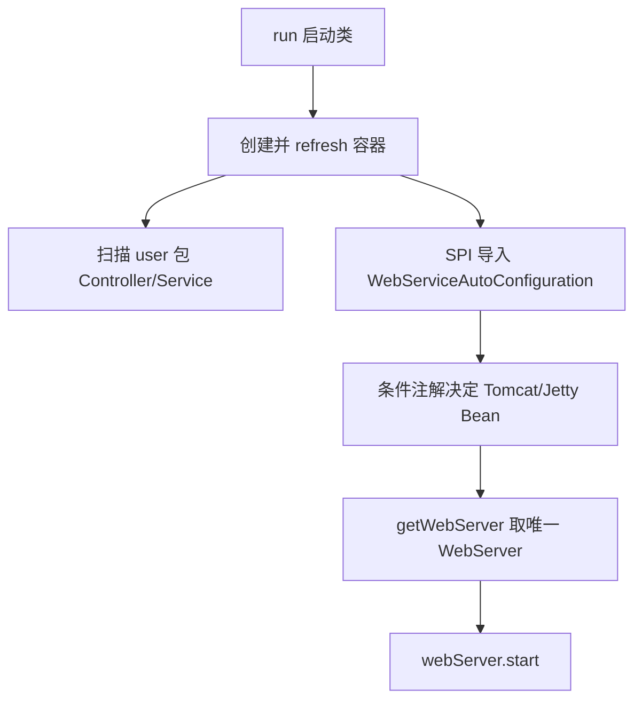

> **微服务 · Spring Boot · 第 1/3 篇**  
> 下一篇：[《Spring Boot 启动过程源码解析》](/微服务/springboot/boot-02-startup-source)

---

## 开头：Spring Boot 到底帮你做了什么？

日常开发里，我们写 `@SpringBootApplication` 和 `SpringApplication.run()` 就能启动 Web 应用。本文通过**手写一个极简版 Spring Boot**，把「创建容器 → 绑定 DispatcherServlet → 启动内嵌服务器 → 条件化自动配置 → SPI 发现配置类」这条主线走通。完整参考实现见 [Gitee：zhouyu-springboot](https://gitee.com/archguide/zhouyu-springboot)。

---

## 一、工程结构

建两个 Maven Module：

| 模块 | 职责 |
|------|------|
| `springboot` | 模拟框架源码（注解、启动类、自动配置） |
| `user` | 业务系统，用来验证模拟出来的 Boot |

`springboot` 模块依赖 Spring Context、Spring WebMVC、Servlet API 与内嵌 Tomcat：

```xml
<dependency>
    <groupId>org.springframework</groupId>
    <artifactId>spring-context</artifactId>
    <version>5.3.18</version>
</dependency>
<dependency>
    <groupId>org.springframework</groupId>
    <artifactId>spring-webmvc</artifactId>
    <version>5.3.18</version>
</dependency>
<dependency>
    <groupId>javax.servlet</groupId>
    <artifactId>javax.servlet-api</artifactId>
    <version>4.0.1</version>
</dependency>
<dependency>
    <groupId>org.apache.tomcat.embed</groupId>
    <artifactId>tomcat-embed-core</artifactId>
    <version>9.0.60</version>
</dependency>
```

`user` 模块只依赖 `springboot`，并编写 Controller / Service 做联调。


---

## 二、核心注解与启动类

真实 Boot 的两个入口：`@SpringBootApplication` 与 `SpringApplication.run()`。我们对应实现：

```java
@Target(ElementType.TYPE)
@Retention(RetentionPolicy.RUNTIME)
@Configuration
@ComponentScan
public @interface ZhouyuSpringBootApplication {
}

public class ZhouyuSpringApplication {
    public static void run(Class clazz) {
        // 待实现
    }
}
```

业务侧用法：

```java
@ZhouyuSpringBootApplication
public class MyApplication {
    public static void main(String[] args) {
        ZhouyuSpringApplication.run(MyApplication.class);
    }
}
```


目标：`run()` 执行完毕后，浏览器访问 `http://localhost:8081/test` 能命中 `UserController`。

---

## 三、run 方法：容器 + Tomcat

### 3.1 创建 Spring 容器

Spring MVC 的核心 Servlet 是 `DispatcherServlet`，它必须绑定一个 Spring 容器才能找到 Controller。因此 `run()` 第一步是创建并刷新容器：

```java
AnnotationConfigWebApplicationContext applicationContext =
    new AnnotationConfigWebApplicationContext();
applicationContext.register(clazz);  // 传入 MyApplication.class
applicationContext.refresh();
```

`MyApplication` 上有 `@ZhouyuSpringBootApplication`，而该注解又组合了 `@ComponentScan`。扫描路径为空时，`AnnotationConfigWebApplicationContext` 会以配置类所在包为扫描根——例如 `com.zhouyu.user`，从而注册 `UserController`、`UserService`。

### 3.2 启动内嵌 Tomcat

真实 Boot 同样使用 Embed-Tomcat。精简版启动逻辑：

```java
public static void startTomcat(WebApplicationContext applicationContext) {
    Tomcat tomcat = new Tomcat();
    // ... 配置 Connector 端口 8081、Engine、Host、Context ...
    tomcat.addServlet(contextPath, "dispatcher",
        new DispatcherServlet(applicationContext));
    context.addServletMappingDecoded("/*", "dispatcher");
    tomcat.start();
}
```

在 `run()` 中串联：

```java
public static void run(Class clazz) {
    AnnotationConfigWebApplicationContext applicationContext = ...;
    applicationContext.register(clazz);
    applicationContext.refresh();
    startTomcat(applicationContext);
}
```

至此，一个**能跑 Web 请求**的迷你 Boot 已经成型。


---

## 四、Tomcat / Jetty 条件切换

需求： classpath 有 Tomcat 依赖就启 Tomcat，有 Jetty 就启 Jetty，两者都有或都没有则报错——这正是 Spring Boot **Starter + 条件注解** 的雏形。

### 4.1 WebServer 抽象

```java
public interface WebServer {
    void start();
}
```

分别实现 `TomcatWebServer`、`JettyWebServer`，`run()` 改为：

```java
WebServer webServer = getWebServer(applicationContext);
webServer.start();
```

### 4.2 手写 @ConditionalOnClass

```java
@Target({ ElementType.TYPE, ElementType.METHOD })
@Retention(RetentionPolicy.RUNTIME)
@Conditional(ZhouyuOnClassCondition.class)
public @interface ZhouyuConditionalOnClass {
    String value() default "";
}
```

`ZhouyuOnClassCondition` 用类加载器尝试加载 `value` 指定的类，加载成功则条件成立。

### 4.3 自动配置类

```java
@Configuration
public class WebServiceAutoConfiguration {
    @Bean
    @ZhouyuConditionalOnClass("org.apache.catalina.startup.Tomcat")
    public TomcatWebServer tomcatWebServer() { return new TomcatWebServer(); }

    @Bean
    @ZhouyuConditionalOnClass("org.eclipse.jetty.server.Server")
    public JettyWebServer jettyWebServer() { return new JettyWebServer(); }
}
```

`getWebServer()` 从容器取唯一 `WebServer` Bean；0 个或多个都会抛异常。

---

## 五、SPI 发现自动配置类

`WebServiceAutoConfiguration` 在 `com.zhouyu.springboot` 包下，业务扫描路径 `com.zhouyu.user` **扫不到它**。真实 Boot 用 `spring.factories`（Boot 2.x）或 `AutoConfiguration.imports`（Boot 3.x）；这里用 **JDK SPI** 模拟：

1. 定义标记接口 `AutoConfiguration`
2. `WebServiceAutoConfiguration implements AutoConfiguration`
3. 在 `META-INF/services/com.zhouyu.springboot.AutoConfiguration` 中注册实现类
4. 在 `@ZhouyuSpringBootApplication` 上 `@Import(ZhouyuImportSelect.class)`

```java
public class ZhouyuImportSelect implements DeferredImportSelector {
    @Override
    public String[] selectImports(AnnotationMetadata metadata) {
        ServiceLoader<AutoConfiguration> loader =
            ServiceLoader.load(AutoConfiguration.class);
        List<String> list = new ArrayList<>();
        for (AutoConfiguration cfg : loader) {
            list.add(cfg.getClass().getName());
        }
        return list.toArray(new String[0]);
    }
}
```


最终启动链路：



- 仅 Tomcat 依赖 → 启动 Tomcat  
- 同时引入 Tomcat 与 Jetty → 报错（与真实 Boot 行为一致）  
- 排除 Tomcat、只留 Jetty → 启动 Jetty  


---

## 六、与真实 Spring Boot 的对应关系

| 手写实现 | 真实 Spring Boot |
|----------|------------------|
| `@ZhouyuSpringBootApplication` | `@SpringBootApplication`（含 `@EnableAutoConfiguration`） |
| `ZhouyuSpringApplication.run` | `SpringApplication.run` |
| `@ZhouyuConditionalOnClass` | `@ConditionalOnClass` |
| JDK SPI + `@Import` | `spring.factories` / `AutoConfiguration.imports` + `AutoConfigurationImportSelector` |
| `WebServer` / `TomcatWebServer` | `ServletWebServerFactory` / `TomcatServletWebServerFactory` |

---

## 小结

手写迷你 Boot 把四条主线串在一起：**启动类即配置类**、**内嵌 Servlet 容器与 DispatcherServlet 绑定**、**条件注解决定 Bean 是否注册**、**SPI 自动发现框架侧配置类**。下一篇进入真实 `SpringApplication.run()` 的完整源码流程。
