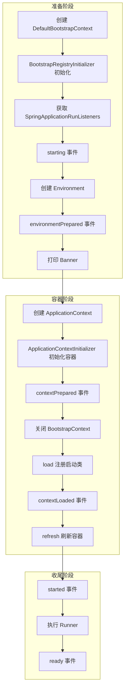

> **微服务 · Spring Boot · 第 2/3 篇**  
> 上一篇：[《手写模拟 Spring Boot 核心流程》](/微服务/springboot/boot-01-handwritten-core)  
> 下一篇：[《Spring Boot 自动配置底层源码解析》](/微服务/springboot/boot-03-autoconfigure)

---

## 开头：一行 run 背后发生了什么？

`SpringApplication.run(MyApplication.class, args)` 看起来只有一行，内部却串联了**环境准备、扩展点加载、容器创建与刷新、Web 服务器启动、Runner 回调**等完整生命周期。本文按源码执行顺序梳理 `SpringApplication` 构造阶段与 `run()` 阶段的关键步骤（基于 Spring Boot 2.x/3.x 通用模型）。

---

## 一、构造 SpringApplication 对象

### 1.1 推断 Web 应用类型

根据 classpath 判断 `WebApplicationType`：

| 条件 | 类型 |
|------|------|
| 存在 `DispatcherHandler`，不存在 `DispatcherServlet` | `REACTIVE` |
| 两者都不存在 | `NONE` |
| 其他（通常存在 `DispatcherServlet`） | `SERVLET` |

类型决定后续创建哪种 `ApplicationContext`（见第 9 步）。

### 1.2 加载三类扩展点

均从 `META-INF/spring.factories`（Boot 3 为 `META-INF/spring/org.springframework.boot.autoconfigure.AutoConfiguration.imports` 等路径，扩展点仍类似）读取并实例化：

| 扩展点 | 作用 |
|--------|------|
| `BootstrapRegistryInitializer` | 在容器出现前，向 `BootstrapRegistry` 注册共享对象 |
| `ApplicationContextInitializer` | 初始化 `ApplicationContext`，如提前注册 Listener |
| `ApplicationListener` | 监听 Boot 与 Spring 生命周期事件 |

### 1.3 推测 Main 类

通过当前线程调用栈，找到包含 `main(String[])` 的类，作为启动类。

### 1.4 注册 RunListener

默认实现 `EventPublishingRunListener`，负责在启动各阶段发布对应事件。

---

## 二、run(String... args) 全流程

### 2.1 环境准备（步骤 5–8）

- **Environment**：聚合 OS 环境变量、JVM 系统属性、命令行参数等。
- **environmentPrepared**：默认发布 `ApplicationEnvironmentPreparedEvent`；`EnvironmentPostProcessorApplicationListener` 在此阶段解析 `application.properties` / `application.yml` 并写入 Environment。
- **Banner**：控制台打印 Spring Boot 标识。

### 2.2 创建 ApplicationContext（步骤 9–10）

`ApplicationContextFactory.DEFAULT` 按 Web 类型创建容器：

| WebApplicationType | ApplicationContext |
|--------------------|------------------|
| SERVLET | `AnnotationConfigServletWebServerApplicationContext` |
| REACTIVE | `AnnotationConfigReactiveWebServerApplicationContext` |
| NONE | `AnnotationConfigApplicationContext` |

随后调用各 `ApplicationContextInitializer`。其中 `ConditionEvaluationReportLoggingListener` 虽名为 Listener，实际实现了 Initializer：向容器注册自身，并在 `ContextRefreshedEvent` 时打印**自动配置条件评估报告**。

### 2.3 注册启动类并刷新（步骤 11–15）

- **load**：将 `SpringApplication.run(Xxx.class)` 传入的类注册为配置类。
- **refresh**：等价于 `register` + `refresh`，完成组件扫描、自动配置导入、Bean 创建；Web 类型为 SERVLET 时，在 `onRefresh()` 中启动内嵌 Tomcat（详见 [第 3 篇](/微服务/springboot/boot-03-autoconfigure)）。
- 各阶段对应 `contextPrepared` → `contextLoaded` → `started` 事件。

### 2.4 Runner 与就绪（步骤 17–18）

- 收集并执行容器中所有 `ApplicationRunner`、`CommandLineRunner`。
- **ready** 阶段发布 `ApplicationReadyEvent` 与 `AvailabilityChangeEvent`（就绪状态 `ReadinessState.ACCEPTING_TRAFFIC`）。
- 任一步骤异常则触发 **failed**，发布 `ApplicationFailedEvent`。

### 2.5 存活与就绪状态

| 枚举 | 含义 |
|------|------|
| `LivenessState.CORRECT` | 应用进程正常运行 |
| `LivenessState.BROKEN` | 进程在跑但内部异常 |
| `ReadinessState.ACCEPTING_TRAFFIC` | 可接收流量 |
| `ReadinessState.REFUSING_TRAFFIC` | 拒绝流量（如 Tomcat 关闭中） |

---

## 三、配置文件优先级

Spring Boot 外部配置**优先级从低到高**（后者覆盖前者）：

1. `SpringApplication.setDefaultProperties` 默认属性  
2. `@PropertySource`（注意：部分 `logging.*`、`spring.main.*` 在 refresh 前已读取，过晚的 `@PropertySource` 无效）  
3. Config data（`application.properties` / `application.yml` 等）  
4. `RandomValuePropertySource`（`random.*`）  
5. OS 环境变量  
6. Java System Properties  
7. JNDI（一般可忽略）  
8. ServletContext / ServletConfig init 参数  
9. `SPRING_APPLICATION_JSON`  
10. **命令行参数**（最高之一）  
11. 测试专用：`@SpringBootTest` properties、`@TestPropertySource`  
12. Devtools 全局配置（`$HOME/.config/spring-boot`）

完整列表见 [Spring Boot 官方文档 · External Config](https://docs.spring.io/spring-boot/docs/current/reference/html/features.html#features.external-config)。

---

## 四、与手写版的衔接

[第 1 篇](/微服务/springboot/boot-01-handwritten-core) 手写的 `run()` 只做了「建容器 + 启 Tomcat」。真实 Boot 在此基础上增加了：

- Web 类型与容器类型的自动匹配  
- `spring.factories` 扩展点体系（Initializer / Listener / RunListener）  
- Environment 多层合并与配置文件解析  
- refresh 过程中的自动配置、条件评估与 WebServer 工厂启动  
- 事件驱动的可观测性与 Runner 扩展  

下一篇深入 **自动配置、条件注解与 Tomcat 自动装配** 源码。

---

## 小结

`SpringApplication` 构造阶段完成 Web 类型推断与扩展点装载；`run()` 则按固定顺序驱动 Environment → Context → refresh → Runner。理解这条时间线，是阅读 Boot 自动配置与 Starter 机制的前提。
