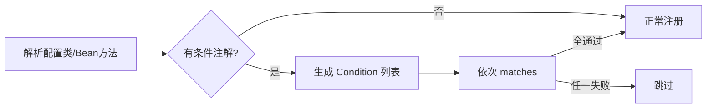

> **微服务 · Spring Boot · 第 3/3 篇**  
> 上一篇：[《Spring Boot 启动过程源码解析》](/微服务/springboot/boot-02-startup-source)  
> 下一篇：[《微服务架构概述与 Spring Cloud Alibaba》](/微服务/springcloud/sca-01-microservice-overview)

---

## 开头：Starter 加依赖就能用，靠的是什么？

`spring-boot-starter-web` 引入后 Tomcat 与 Spring MVC 自动就绪——背后是 **预置自动配置类 + 条件注解 + Starter 传递依赖** 的组合。本文从 `@EnableAutoConfiguration` 入手，讲清条件注解如何判断，并以 **内嵌 Tomcat** 为例串起 Starter 与自动配置。

---

## 一、自动配置入口

`@SpringBootApplication` 组合了 `@EnableAutoConfiguration`，其通过 `@Import(AutoConfigurationImportSelector.class)` 导入配置。

### 1.1 DeferredImportSelector 与 ImportSelector

| 类型 | 行为 |
|------|------|
| `ImportSelector` | 导入的配置类**立即**参与解析 |
| `DeferredImportSelector` | 导入的配置类**延迟**到普通 `@Configuration` 解析完毕后再处理，且支持分组（Boot 的 `AutoConfigurationGroup`） |

`AutoConfigurationImportSelector` 从 `META-INF/spring/org.springframework.boot.autoconfigure.AutoConfiguration.imports`（2.x 为 `spring.factories` 中 `EnableAutoConfiguration` 键）读取候选类列表，再经条件过滤后注册 Bean。

---

## 二、常用条件注解

| 注解 | 判断依据 |
|------|----------|
| `@ConditionalOnClass` | classpath 是否存在指定类 |
| `@ConditionalOnMissingClass` | 是否缺失指定类 |
| `@ConditionalOnBean` | 容器是否存在指定 Bean |
| `@ConditionalOnMissingBean` | 是否缺失指定 Bean |
| `@ConditionalOnSingleCandidate` | 指定类型是否只有一个候选（或唯一 `@Primary`） |
| `@ConditionalOnProperty` | Environment 中属性是否匹配 |
| `@ConditionalOnWebApplication` | 当前是否为 Web 应用（SERVLET / REACTIVE） |
| `@ConditionalOnExpression` | SpEL 表达式结果 |

条件可标在**类**或 **`@Bean` 方法**上；解析配置类或 Bean 定义时，Spring 收集全部条件并依次 `matches()`，任一不满足则跳过。

### 2.1 @ConditionalOnClass 源码路径

`@ConditionalOnClass` / `@ConditionalOnMissingClass` 均由 `OnClassCondition` 处理，继承链：`OnClassCondition` → `FilteringSpringBootCondition` → `SpringBootCondition` → `Condition`。

`getMatchOutcome()` 核心逻辑：

1. 读取 `@ConditionalOnClass` 的 `value`，用 `ClassNameFilter.MISSING` 检查；有缺失 → **不匹配**  
2. 读取 `@ConditionalOnMissingClass`，用 `ClassNameFilter.PRESENT` 检查；有存在 → **不匹配**  
3. 全部通过 → **匹配**

`isPresent` 本质是 `ClassLoader.loadClass` 能否成功解析类名。

### 2.2 @ConditionalOnBean 源码路径

由 `OnBeanCondition` 处理：通过 `BeanFactory` 查找指定类型/名称的 Bean，`MatchResult` 记录 matched / unmatched，逻辑与 OnClass 类似——存在性 vs 缺失性成对出现。



---

## 三、Starter 与自动配置的关系

**Starter 本质是一个 Maven 依赖聚合**：例如 `spring-boot-starter-web` 传递引入 `spring-boot-starter-tomcat`、`spring-webmvc` 等。

与自动配置的纽带是 **`@ConditionalOnClass`**：自动配置类声明「只有 classpath 存在 Tomcat 相关类时才生效」。因此：

- 引入 `starter-web` → 有 Tomcat 类 → `EmbeddedTomcat` 配置生效  
- 排除 `starter-tomcat` 并引入 `starter-jetty` → Tomcat Bean 不生效，Jetty Bean 生效  

---

## 四、案例：内嵌 Tomcat 如何自动启动

### 4.1 依赖链

```
spring-boot-starter-web
  └── spring-boot-starter-tomcat
        └── tomcat-embed-core
```

### 4.2 ServletWebServerFactoryAutoConfiguration

```java
@Configuration(proxyBeanMethods = false)
@AutoConfigureOrder(Ordered.HIGHEST_PRECEDENCE)
@ConditionalOnClass(ServletRequest.class)
@ConditionalOnWebApplication(type = Type.SERVLET)
@EnableConfigurationProperties(ServerProperties.class)
@Import({
    ServletWebServerFactoryAutoConfiguration.BeanPostProcessorsRegistrar.class,
    ServletWebServerFactoryConfiguration.EmbeddedTomcat.class,
    ServletWebServerFactoryConfiguration.EmbeddedJetty.class,
    ServletWebServerFactoryConfiguration.EmbeddedUndertow.class
})
public class ServletWebServerFactoryAutoConfiguration { ... }
```

条件：存在 `ServletRequest` + 应用类型为 SERVLET → 配置类生效。

### 4.3 EmbeddedTomcat

```java
@Configuration(proxyBeanMethods = false)
@ConditionalOnClass({ Servlet.class, Tomcat.class, UpgradeProtocol.class })
@ConditionalOnMissingBean(value = ServletWebServerFactory.class, search = SearchStrategy.CURRENT)
static class EmbeddedTomcat {
    @Bean
    TomcatServletWebServerFactory tomcatServletWebServerFactory(...) {
        return new TomcatServletWebServerFactory();
    }
}
```

- 有 Tomcat 依赖 → 注册 `TomcatServletWebServerFactory`  
- 用户自定义了 `ServletWebServerFactory` → `@ConditionalOnMissingBean` 阻止 Boot 默认 Bean  

Jetty、Undertow 分支同理，但容器内**只能有一个** `ServletWebServerFactory`。

### 4.4 从 Factory 到 WebServer

`ServletWebServerFactory.getWebServer(...)` 返回 `WebServer`（`start()` / `stop()` / `getPort()`）。`TomcatServletWebServerFactory.getWebServer()` 内部创建并启动 Tomcat。

在 [启动过程](/微服务/springboot/boot-02-startup-source) 的 **refresh → onRefresh()** 中：

```java
ServletWebServerFactory factory = getWebServerFactory(); // 从容器取唯一 Factory
this.webServer = factory.getWebServer(getSelfInitializer());
```

### 4.5 外部化配置 server.port

- `ServerProperties` 绑定 `server.*` 前缀配置  
- `ServletWebServerFactoryCustomizer` 读取 `server.port` 等属性  
- `WebServerFactoryCustomizerBeanPostProcessor` 在 Factory Bean 创建后调用各 Customizer，把端口等写入 `TomcatServletWebServerFactory`  

程序员也可自定义 `TomcatConnectorCustomizer` 修改 Connector：

```java
@Bean
public TomcatConnectorCustomizer tomcatConnectorCustomizer() {
    return connector -> connector.setPort(8888);
}
```

### 4.6 Tomcat 自动配置组件一览

| 组件 | 职责 |
|------|------|
| `spring-boot-starter-web` | 传递 Tomcat + Spring MVC 依赖 |
| `ServletWebServerFactoryAutoConfiguration` | 自动配置入口 |
| `EmbeddedTomcat` / `EmbeddedJetty` / `EmbeddedUndertow` | 注册对应 Factory Bean |
| `ServletWebServerFactoryCustomizer` | 应用 `server.*` 配置 |
| `WebServerFactoryCustomizerBeanPostProcessor` | Bean 创建后执行 Customizer |
| `ServletWebServerApplicationContext.onRefresh()` | 调用 Factory 启动 Web 服务器 |

---

## 五、其他自动配置速览

### 5.1 AOP — AopAutoConfiguration

- `@ConditionalOnProperty(spring.aop.auto=true, matchIfMissing=true)` 默认开启  
- 有 AspectJ 时：`@EnableAspectJAutoProxy`，按 `spring.aop.proxy-target-class` 选 JDK 或 CGLIB  
- 无 AspectJ 但需要类代理：注册 `InfrastructureAdvisorAutoProxyCreator`

### 5.2 MyBatis — MybatisAutoConfiguration

- 注册 `SqlSessionFactory`  
- `AutoConfiguredMapperScannerRegistrar` 通过 `AutoConfigurationPackages` 获取 Boot 扫描包，注册 `MapperScannerConfigurer`，限制接口需带 `@Mapper`

---

## 小结

Spring Boot 自动配置 = **候选类清单（imports/factories）** + **DeferredImportSelector 延迟导入** + **条件注解过滤** + **Starter 传递 classpath**。内嵌 Tomcat 案例展示了从依赖到 `WebServer.start()` 的完整链路。Boot 三篇至此收束；下一模块进入 [Spring Cloud Alibaba 微服务概述](/微服务/springcloud/sca-01-microservice-overview)。
